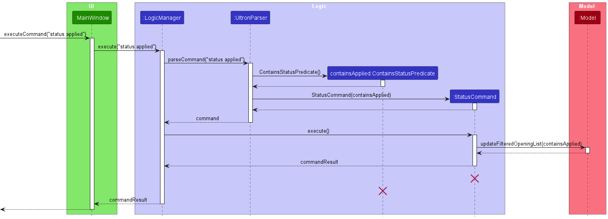
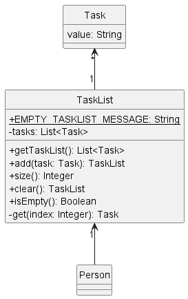

## **Table of Contents**

- [**Table of Contents**](#table-of-contents)
- [**Acknowledgements**](#acknowledgements)
- [**Setting up, getting started**](#setting-up-getting-started)
- [**Design**](#design)
  - [Architecture](#architecture)
  - [UI component](#ui-component)
  - [Logic component](#logic-component)
  - [Model component](#model-component)
  - [Storage component](#storage-component)
  - [Common classes](#common-classes)
- [**Implementation**](#implementation)
  - [FindTag Feature](#findtag-feature)
    - [About](#about)
    - [Implementation](#implementation-1)
  - [Sort feature](#sort-feature)
    - [About](#about-1)
    - [Implementation](#implementation-2)
  - [Status features](#status-features)
  - [Tasks Feature](#tasks-feature)
    - [About](#about-2)
    - [Implementation](#implementation-3)
  - [\[Proposed\] Undo/redo feature](#proposed-undoredo-feature)
    - [Proposed Implementation](#proposed-implementation)
    - [Design considerations:](#design-considerations)
  - [Add transaction feature](#add-transaction-feature)
    - [Proposed Implementation](#proposed-implementation-1)
    - [Design considerations:](#design-considerations-1)
- [**Documentation, logging, testing, configuration, dev-ops**](#documentation-logging-testing-configuration-dev-ops)
- [**Appendix: Requirements**](#appendix-requirements)
  - [Product scope](#product-scope)
  - [User stories](#user-stories)
  - [Use cases](#use-cases)
  - [Non-Functional Requirements](#non-functional-requirements)
  - [Glossary](#glossary)
- [**Appendix: Instructions for manual testing**](#appendix-instructions-for-manual-testing)
  - [Launch and shutdown](#launch-and-shutdown)
  - [Deleting a person](#deleting-a-person)
  - [Saving data](#saving-data)

---

## **Acknowledgements**

- {list here sources of all reused/adapted ideas, code, documentation, and third-party libraries -- include links to the original source as well}

---

## **Setting up, getting started**

Refer to the guide [_Setting up and getting started_](SettingUp.md).

---

## **Design**

:bulb: **Tip:** The `.puml` files used to create diagrams in this document can be found in the [diagrams](https://github.com/se-edu/addressbook-level3/tree/master/docs/diagrams/) folder. Refer to the [_PlantUML Tutorial_ at se-edu/guides](https://se-education.org/guides/tutorials/plantUml.html) to learn how to create and edit diagrams.

### Architecture

The **_Architecture Diagram_** given above explains the high-level design of the App.

Given below is a quick overview of main components and how they interact with each other.

**Main components of the architecture**

**`Main`** has two classes called [`Main`](https://github.com/se-edu/addressbook-level3/tree/master/src/main/java/seedu/address/Main.java) and [`MainApp`](https://github.com/se-edu/addressbook-level3/tree/master/src/main/java/seedu/address/MainApp.java). It is responsible for,

- At app launch: Initializes the components in the correct sequence, and connects them up with each other.
- At shut down: Shuts down the components and invokes cleanup methods where necessary.

[**`Commons`**](#common-classes) represents a collection of classes used by multiple other components.

The rest of the App consists of four components.

- [**`UI`**](#ui-component): The UI of the App.
- [**`Logic`**](#logic-component): The command executor.
- [**`Model`**](#model-component): Holds the data of the App in memory.
- [**`Storage`**](#storage-component): Reads data from, and writes data to, the hard disk.

**How the architecture components interact with each other**

The _Sequence Diagram_ below shows how the components interact with each other for the scenario where the user issues the command `delete 1`.

Each of the four main components (also shown in the diagram above),

- defines its _API_ in an `interface` with the same name as the Component.
- implements its functionality using a concrete `{Component Name}Manager` class (which follows the corresponding API `interface` mentioned in the previous point.

For example, the `Logic` component defines its API in the `Logic.java` interface and implements its functionality using the `LogicManager.java` class which follows the `Logic` interface. Other components interact with a given component through its interface rather than the concrete class (reason: to prevent outside component's being coupled to the implementation of a component), as illustrated in the (partial) class diagram below.

The sections below give more details of each component.

### UI component

The **API** of this component is specified in [`Ui.java`](https://github.com/se-edu/addressbook-level3/tree/master/src/main/java/seedu/address/ui/Ui.java)

The UI consists of a `MainWindow` that is made up of parts e.g.`CommandBox`, `ResultDisplay`, `PersonListPanel`, `StatusBarFooter` etc. All these, including the `MainWindow`, inherit from the abstract `UiPart` class which captures the commonalities between classes that represent parts of the visible GUI.

The `UI` component uses the JavaFx UI framework. The layout of these UI parts are defined in matching `.fxml` files that are in the `src/main/resources/view` folder. For example, the layout of the [`MainWindow`](https://github.com/se-edu/addressbook-level3/tree/master/src/main/java/seedu/address/ui/MainWindow.java) is specified in [`MainWindow.fxml`](https://github.com/se-edu/addressbook-level3/tree/master/src/main/resources/view/MainWindow.fxml)

The `UI` component,

- executes user commands using the `Logic` component.
- listens for changes to `Model` data so that the UI can be updated with the modified data.
- keeps a reference to the `Logic` component, because the `UI` relies on the `Logic` to execute commands.
- depends on some classes in the `Model` component, as it displays `Person` object residing in the `Model`.

### Logic component

**API** : [`Logic.java`](https://github.com/se-edu/addressbook-level3/tree/master/src/main/java/seedu/address/logic/Logic.java)

Here's a (partial) class diagram of the `Logic` component:

How the `Logic` component works:

1. When `Logic` is called upon to execute a command, it uses the `AddressBookParser` class to parse the user command.
2. This results in a `Command` object (more precisely, an object of one of its subclasses e.g., `AddCommand`) which is executed by the `LogicManager`.
3. The command can communicate with the `Model` when it is executed (e.g. to add a person).
4. The result of the command execution is encapsulated as a `CommandResult` object which is returned back from `Logic`.

The Sequence Diagram below illustrates the interactions within the `Logic` component for the `execute("delete 1")` API call.

:information_source: **Note:** The lifeline for `DeleteCommandParser` should end at the destroy marker (X) but due to a limitation of PlantUML, the lifeline reaches the end of diagram.

Here are the other classes in `Logic` (omitted from the class diagram above) that are used for parsing a user command:

How the parsing works:

- When called upon to parse a user command, the `AddressBookParser` class creates an `XYZCommandParser` (`XYZ` is a placeholder for the specific command name e.g., `AddCommandParser`) which uses the other classes shown above to parse the user command and create a `XYZCommand` object (e.g., `AddCommand`) which the `AddressBookParser` returns back as a `Command` object.
- All `XYZCommandParser` classes (e.g., `AddCommandParser`, `DeleteCommandParser`, ...) inherit from the `Parser` interface so that they can be treated similarly where possible e.g, during testing.

### Model component

**API** : [`Model.java`](https://github.com/se-edu/addressbook-level3/tree/master/src/main/java/seedu/address/model/Model.java)

The `Model` component,

- stores the address book data i.e., all `Person` objects (which are contained in a `UniquePersonList` object).
- stores the currently 'selected' `Person` objects (e.g., results of a search query) as a separate _filtered_ list which is exposed to outsiders as an unmodifiable `ObservableList<Person>` that can be 'observed' e.g. the UI can be bound to this list so that the UI automatically updates when the data in the list change.
- stores a `UserPref` object that represents the user’s preferences. This is exposed to the outside as a `ReadOnlyUserPref` objects.
- does not depend on any of the other three components (as the `Model` represents data entities of the domain, they should make sense on their own without depending on other components)

:information_source: **Note:** An alternative (arguably, a more OOP) model is given below. It has a `Tag` list in the `AddressBook`, which `Person` references. This allows `AddressBook` to only require one `Tag` object per unique tag, instead of each `Person` needing their own `Tag` objects. 

### Storage component

**API** : [`Storage.java`](https://github.com/se-edu/addressbook-level3/tree/master/src/main/java/seedu/address/storage/Storage.java)

The `Storage` component,

- can save both address book data and user preference data in json format, and read them back into corresponding objects.
- inherits from both `AddressBookStorage` and `UserPrefStorage`, which means it can be treated as either one (if only the functionality of only one is needed).
- depends on some classes in the `Model` component (because the `Storage` component's job is to save/retrieve objects that belong to the `Model`)

### Common classes

Classes used by multiple components are in the `seedu.addressbook.commons` package.

---

## **Implementation**

This section describes some noteworthy details on how certain features are implemented.

### FindTag Feature

#### About

The `FindTag` feature allows the sales person to find contacts in the address book based on the tag/s associated with a contact.

#### Implementation

The implementation for FindTag is similar to the other find functions implemented. The key difference between the other find functions differs in the implementation of the method to suit the manipulation of the argument and keywords in `StringUtil.java` to suit the use case.

In `StringUtil.java`, created a new method - `containsTagsIgnoreCase` to compare the keyword to the `Set<Tag>` that are assigned to a Person.

The find tag mechanism is facilitated by `FindTagCommandParser` where it parses the find tag command, triggering and associating the given arguments to a `FindTagCommand` class which extends `Command`. When `FindTagCommand` gets executed, it triggers the `model.updateFilteredPersonList()`  based on the predicate `TagContainsKeywordsPredicate` set in `StringUtil` to update the model view and the GUI to display the contact list that fulfills the predicate. Finally it returns a `CommandResult` for feedback to user on the amount of contacts that are returned.

Reminder to add diagram pictures

The following sequence diagram shows how the find tag operation works:

Insert Image

The following activity diagram shows what happens when a user executes a find tag command

Insert Image

### Sort feature

#### About

The sort feature is an inbuilt element of `SalesPunch` where it allows the sales person to sort the address book according to a certain attribute.

#### Implementation

The sort mechanism is facilitated by `SortCommandParser` where it parses sort commands, triggering and associating the given attribute to a `SortCommand` class which extends `Command`. When `SortCommand` gets executed, `ModelManager#sortPersonList()` sorts the address book according to the given attribute.

:information_source: **Note:** If the given input is not a valid attribute of a `Person` class, it will throw an error indicating invalid attribute.

The following sequence diagram shows how the sort operation works:

The following activity diagram summarizes what happens when a user executes a sort command:

### Status Features
#### Status Feature: Abstract Class - `Status`

During the development of transactions and implementing `TxnStatus`, the realisation of it sharing similar characteristics
to `LeadStatus` gave rose to the abstract parent class `Status`. These characteristics are:

- Contains a timestamp representing the creation of the existing status
- Has methods allowing the viewer of the status to see how long it has been since the timestamp
- Has a set of pre-defined status types

The `Status` class was created to encapsulate the similarities between statuses. If new object types that require a
status feature are introduced, the abstract `Status` class can be used (for example, implementing the done status of a Task).

The following diagram shows the structure of the implementation of Statuses, as of v1.3.

#### Lead Status feature

The Lead Status feature aims to provide information about the contact based on when the status was last set.
It is represented by the `LeadStatus status` attribute in a `Person`, which contains a `LeadStatusName` and
`Instant` timestamp. Each person existing in the contact list must have a status.

Because we would like to limit the types of statuses a contact should have, for consistency's sake, each
type of lead status is represented by an enum in `LeadStatusName`. `LeadStatusName` also contains mappings for
abbreviations of each status type.

The default lead status of a new contact added is `UNCONTACTED`, and the timestamp is the time of adding the contact.
The user is able to change the lead status of a contact to any other lead status. The timestamp is updated to the
`Instant.now()` of when the command is executed, which takes place in the creation of a lead status.

#### The `status` Command

The updating of the status is similar to the implementation of edit. The main difference lies in StatusCommand having an 
additional check, to verify if the LeadStatusName of the new status would be the same as the previous. If it is the same,
an error is thrown, the user is alerted. No creation of new LeadStatus will take place and the timestamp does not change.

If the lead status to change to is the same as the preexisting one, the command returns and does not alter the previous lead status nor its timestamp.
This also means that a lead status should not be updated when any other attributes are updated (via `edit`).

#### Transaction Statuses

Transactions have also been implemented with a `TxnStatus status`. Transaction statuses have a different set of 
names, and also defined in a similar fashion as `LeadStatus`. Both types of statuses have similar characteristics,
in terms of existing compulsorily in their container class `Transaction` and `Person`.

The default status for a Transaction is `OPEN`. This represents an incomplete transaction process.

### TaskList Feature

#### About

The TaskList feature aims to provide information about the tasks to be done for a contact.

#### Implementation

Tasks are represented by a `Task` object that is stored as an attribute of `Person`, currently containing a String for
the description of the task. In the future, it is possible to include various types of tasks such as events or
deadlines.

Under the `Model` for `Person`, created an attribute `TaskList` to store the various tasks of a person, where each 
`Task` stores the description of each task. The adding of `Task` to `TaskList` is done by the `AddTaskCommand` and 
clearing of all `Task` from the person is done by `ClearTaskCommand`. 

### \[Proposed\] Undo/redo feature

#### Proposed Implementation

The proposed undo/redo mechanism is facilitated by `VersionedAddressBook`. It extends `AddressBook` with an undo/redo history, stored internally as an `addressBookStateList` and `currentStatePointer`. Additionally, it implements the following operations:

- `VersionedAddressBook#commit()` — Saves the current address book state in its history.
- `VersionedAddressBook#undo()` — Restores the previous address book state from its history.
- `VersionedAddressBook#redo()` — Restores a previously undone address book state from its history.

These operations are exposed in the `Model` interface as `Model#commitAddressBook()`, `Model#undoAddressBook()` and `Model#redoAddressBook()` respectively.

Given below is an example usage scenario and how the undo/redo mechanism behaves at each step.

Step 1. The user launches the application for the first time. The `VersionedAddressBook` will be initialized with the initial address book state, and the `currentStatePointer` pointing to that single address book state.

Step 2. The user executes `delete 5` command to delete the 5th person in the address book. The `delete` command calls `Model#commitAddressBook()`, causing the modified state of the address book after the `delete 5` command executes to be saved in the `addressBookStateList`, and the `currentStatePointer` is shifted to the newly inserted address book state.

Step 3. The user executes `add n/David …​` to add a new person. The `add` command also calls `Model#commitAddressBook()`, causing another modified address book state to be saved into the `addressBookStateList`.

:information_source: **Note:** If a command fails its execution, it will not call `Model#commitAddressBook()`, so the address book state will not be saved into the `addressBookStateList`.

Step 4. The user now decides that adding the person was a mistake, and decides to undo that action by executing the `undo` command. The `undo` command will call `Model#undoAddressBook()`, which will shift the `currentStatePointer` once to the left, pointing it to the previous address book state, and restores the address book to that state.

:information_source: **Note:** If the `currentStatePointer` is at index 0, pointing to the initial AddressBook state, then there are no previous AddressBook states to restore. The `undo` command uses `Model#canUndoAddressBook()` to check if this is the case. If so, it will return an error to the user rather
than attempting to perform the undo.

The following sequence diagram shows how the undo operation works:

:information_source: **Note:** The lifeline for `UndoCommand` should end at the destroy marker (X) but due to a limitation of PlantUML, the lifeline reaches the end of diagram.

The `redo` command does the opposite — it calls `Model#redoAddressBook()`, which shifts the `currentStatePointer` once to the right, pointing to the previously undone state, and restores the address book to that state.

:information_source: **Note:** If the `currentStatePointer` is at index `addressBookStateList.size() - 1`, pointing to the latest address book state, then there are no undone AddressBook states to restore. The `redo` command uses `Model#canRedoAddressBook()` to check if this is the case. If so, it will return an error to the user rather than attempting to perform the redo.

Step 5. The user then decides to execute the command `list`. Commands that do not modify the address book, such as `list`, will usually not call `Model#commitAddressBook()`, `Model#undoAddressBook()` or `Model#redoAddressBook()`. Thus, the `addressBookStateList` remains unchanged.

Step 6. The user executes `clear`, which calls `Model#commitAddressBook()`. Since the `currentStatePointer` is not pointing at the end of the `addressBookStateList`, all address book states after the `currentStatePointer` will be purged. Reason: It no longer makes sense to redo the `add n/David …​` command. This is the behavior that most modern desktop applications follow.

The following activity diagram summarizes what happens when a user executes a new command:

#### Design considerations:

**Aspect: How undo & redo executes:**

- **Alternative 1 (current choice):** Saves the entire address book.

  - Pros: Easy to implement.
  - Cons: May have performance issues in terms of memory usage.

- **Alternative 2:** Individual command knows how to undo/redo by
  itself.
  - Pros: Will use less memory (e.g. for `delete`, just save the person being deleted).
  - Cons: We must ensure that the implementation of each individual command are correct.

_{more aspects and alternatives to be added}_

### Add transaction feature

#### Proposed Implementation

The proposed add transaction mechanism is facilitated by `UniqueTransactionList`. It is similar to `UniquePersonList` which stores a list of unique transaction records.

Given below is an example scenario and how to add transaction mechanism behaves at each step.

Step 1. The user launches the application for the first time. The `Storage` will check if there are existing transaction records in local storage. If transaction records are found, a `UniqueTransactionList` is created with existing transaction records. Else, an empty `UniqueTransactionList` is created in `AddressBook`.

Step 2. The user excutes `addtxn td/1 Venti Cold Brew  …​` to add a new transaction record. the `addtxn` command will be parsed by `AddTxnCommandParser` and a `AddTxnCommand` will be created. `AddTxnCommand#exexute()` add the input transaction record if it has a valid owner and it's not a duplicate of existing record, then it creates a `CommandResult` to provide feedback to the user.

#### Design considerations:

**Aspect: How add transaction executes:**

- **Alternative 1 (current choice):** Saves all transaction records in a separate list, each transaction has a non-null owner attribute indicates the other party involved in this transaction.

  - Pros: Easy to implement, easy to search through all transaction records.
  - Cons: May need long time to list down all transaction records under the save name.

- **Alternative 2:** Each Person object has a transaction list attribute, to store transactions belong to him or her.
  - Pros: Less time taken to identify transactions with the same person as no need to search through the whole transaction list.
  - Cons: Difficult to carry out operations on all transactions.

---

## **Documentation, logging, testing, configuration, dev-ops**

- [Documentation guide](Documentation.md)
- [Testing guide](Testing.md)
- [Logging guide](Logging.md)
- [Configuration guide](Configuration.md)
- [DevOps guide](DevOps.md)

---

## **Appendix: Requirements**

### Product scope

**Target user profile**:

- Tech-nerds turned salespeople, who are used to a CLI-interface
- Who have many contacts to trace
- But don't want to deal with a cluttered interface, because updating a CRM can be a pain
- And instead want a minimal and fast set-up to track their clients, tasks, and view stats

**Value proposition**: hyper-efficient CRM system for salespeople who don't want to work with a cluttered GUI

### User stories

Priorities: High (must have) - `* * *`, Medium (nice to have) - `* *`, Low (unlikely to have) - `*`

| Priority | As a …​                   | I want to …​                                                                                   | So that I can…​                                                          |
|----------|---------------------------|------------------------------------------------------------------------------------------------|--------------------------------------------------------------------------|
| `* * *`  | new user                  | see usage instructions                                                                         | refer to instructions when I forget how to use the App                   |
| `* * *` | salesperson               | add a new client                                                                               | keep track of all my clients                                             |
| `* * *` | salesperson               | view all my clients                                                                            | have access to each and every client                                     |
| `* * *`  | salesperson               | delete a client                                                                                | remove leads that have fallen cold, or are false entries                 |
| `* * *`  | forgetful salesperson     | filter my contacts by lead status                                                              | prioritise what to follow up on                                          |
| `* *`  | salesperson               | update client information                                                                      | keep my clients' informations up to date                                 |
| `* *`    | forgetful salesperson     | see the timestamp of the contact's lead status                                                 | prioritise customers who I have not followed up with                     |
| `* *`    | salesperson               | have a keyword search                                                                          | find lead based on a company or persons name                             |
| `* *`    | forgetful salesperson     | associate my contacts with the day of first creation                                           | determine the next time I should contact them                            |
| `* *`    | frantic salesperson       | be warned when I make certain actions in my application                                        | won’t jeopardise my work through carelessness                            |
| `*`    | cross-product salesperson | sort persons by their attributes such as gender or industry                                    | perform targeted sales strategy                                          |
| `*`      | new user                  | import my current database                                                                     |                                                                          |
| `*`      | salesperson               | record down all transactions with clients                                                      |                                                                          |
| `*`      | salesperson               | search through transactions based on an existing contact's name, while also seeing the contact | conveniently refer to persons' and transactions' info on the same screen |
| `*`      | forgetful salesperson     | add tasks for each contact                                                                     | refer to the tasks of each person to be done                             |
| `*`      | salesperson               | clear tasks for each contact                                                                   | edit the tasks and add new tasks for the contact                         |

### Use cases

(For all use cases below, the **System** is `SalesPunch` and the **Actor** is the `user`, unless specified otherwise)

**Use case: Add a person**

**MSS**

1.  User adds a person
2.  SalesPunch adds the person to contact list

    Use case ends.

**Extensions**

- 1a. SalesPunch detects an error in the entered data.

  - 1a1. SalesPunch requests for the correct data.
  - 1a2. User enters new data.
  - Steps 1a1-1a2 are repeated until the data entered is correct.
  - Use case resumes from step 2.

  Use case ends.

**Use case: Edit a person**

**MSS**

1.  User requests to list persons
2.  SalesPunch shows a list of persons
3.  User requests to edit a specific person in the list
4.  SalesPunch edits the person

    Use case ends.

**Extensions**

- 2a. The list is empty.

  Use case ends.

- 3a. SalesPunch detects an error in the entered data.

  - 3a1. SalesPunch requests for the correct data.
  - 3a2. User enters new data.
  - Steps 3a1-3a2 are repeated until the data entered is correct.
  - Use case resumes from step 4.

  Use case ends.

**Use case: Sort a person**

**MSS**

1.  User requests to sort persons based on an attribute
2.  SalesPunch shows a list of sorted persons

    Use case ends.

**Extensions**

- 2a. The list is empty.

  Use case ends.

- 1a. SalesPunch detects an error in the entered data.

    - 1a1. SalesPunch requests for the correct data.
    - 1a2. User enters new data.
    - Steps 1a1-1a2 are repeated until the data entered is correct.
    - Use case resumes from step 2.

  Use case ends.

**Use case: Delete a person**

**MSS**

1.  User requests to list persons
2.  SalesPunch shows a list of persons
3.  User requests to delete a specific person in the list
4.  SalesPunch displays a confirmation message
5.  User confirms to delete the specific person in the list
6.  SalesPunch deletes the person

    Use case ends.

**Extensions**

- 2a. The list is empty.

  Use case ends.

- 3a. The given index is invalid.

  - 3a1. SalesPunch shows an error message.

    Use case resumes at step 2.

**Use case: Update the lead status of a person**

**MSS**

1. User requests to list persons
2. SalesPunch shows a list of persons
3. User requests to update the lead status of a specific person in the list
4. SalesPunch checks the current lead status of the person
5. SalesPunch creates a new lead status for the person and stores the timestamp
6. SalesPunch displays the new lead status and time since the timestamp of the person

    Use case ends.

**Extensions**
- 2a. The list is empty.  
    Use case ends.
- 3a. The given index is invalid.
    - 3a1. SalesPunch shows an error message.
      Use case resumes at step 2. 
- 4a. SalesPunch finds that the lead status to be updated is the same as the current one.
  - 4a1. SalesPunch alerts the user that the lead status is the same.  
    Use case resumes at step 2

**Use case: Add tasks for a person**

**MSS**

1.  User adds task to a person
2.  SalesPunch updates the tasklist of the person in the contact list

    Use case ends.

**Extensions**

- 1a. User is able to add more types of tasks to a person. 

    - 1a1. SalesPunch requests for the correct data.
    - 1a2. User enters new data.
    - Steps 1a1-1a2 are repeated until the data entered is correct.
    - Use case resumes from step 2.

  Use case ends.

**Use case: Edit tasks**

**MSS**

1.  User clears tasks for a person
2.  SalesPunch updates the tasklist of the person in the contact list
3.  User adds new tasks for a person
4.  SalesPunch updates the tasklist of the person in the contact list

    Use case ends.

**Extensions**

- 1a. User is able to edit the specific task directly.

    - 1a1. SalesPunch requests for the correct data.
    - 1a2. User enters new data.
    - Steps 1a1-1a2 are repeated until the data entered is correct.
    - Use case resumes from step 2.

  Use case ends.

### Non-Functional Requirements

1.  Should work on any _mainstream OS_ with JDK `11` installed.
2.  Should be able to hold up to 1000 clients without a noticeable sluggishness in performance for typical usage.
3.  A user with above average typing speed for regular English text (i.e. not code, not system admin commands) should be able to accomplish most of the tasks faster using commands than using the mouse.
4.  A user should be able to work with 20 tasks per client without having noticeable sluggishness in performance for typical usage.

### Glossary

- **Mainstream OS**: Windows, Linux, Unix, OS-X
- **Client**: A person or entity registered in the application, that serves as the primary entity that the user interacts with. A Client is associated with a number of attributes, such as Lead Status, time created, Company, and Email etc. Also referred to as a Lead.
- **Attribute**: A person's association. Examples include name, gender, phone number, email, company, location, occupation, job title, address, and status.
- **Contact**: A person or entity registered in the application, that serves as the primary entity that the user interacts with. A Contact is associated with a number of attributes, such as Lead Status, time created, Company, and Email etc.
- **Lead**: A potential person or entity with sales opportunities. Often used interchangeably with Client.
- **Lead Status**: The current state of a Lead in the sales funnel. A Lead Status often changes based on actions that the user does with a Contact. Lead Statuses are associated with a time they were last updated.  Refer to the Implementation > Lead Status for more information concerning Lead Statuses. 

**Definitions of types of lead statuses**
- **Uncontacted**: Represents a possible lead status. The user has not gotten in touch with (contacted) the saved person. By default, newly added contacts have this status                                        |
- **Working**: Represents a possible lead status. The person has been contacted. The user is currently nurturing a relationship with the contact with the hopes of making them a qualified lead.               |
- **Qualified**: Represents a possible lead status. The contact is a client that has been nurtured to a ready, buying customer. A contact that has a prospect to buy or is in the sales funnel should go here.   |
- **Unqualified**: Represents a possible lead status. This status should only be used when it is certain that the customer's intents are not a match for the user's sales, and have no prospects of buying at all.

## **Appendix: Instructions for manual testing**

Given below are instructions to test the app manually.

:information_source: **Note:** These instructions only provide a starting point for testers to work on;
testers are expected to do more *exploratory* testing.

### Launch and shutdown

1. Initial launch

   1. Download the jar file and copy into an empty folder

   1. Double-click the jar file Expected: Shows the GUI with a set of sample contacts. The window size may not be optimum.

1. Saving window preferences

   1. Resize the window to an optimum size. Move the window to a different location. Close the window.

   1. Re-launch the app by double-clicking the jar file. 
      Expected: The most recent window size and location is retained.

1. _{ more test cases …​ }_

### Deleting a person

1. Deleting a person while all persons are being shown

   1. Prerequisites: List all persons using the `list` command. Multiple persons in the list.

   1. Test case: `delete 1` 
      Expected: First contact is deleted from the list. Details of the deleted contact shown in the status message. Timestamp in the status bar is updated.

   1. Test case: `delete 0` 
      Expected: No person is deleted. Error details shown in the status message. Status bar remains the same.

   1. Other incorrect delete commands to try: `delete`, `delete x`, `...` (where x is larger than the list size) 
      Expected: Similar to previous.

1. _{ more test cases …​ }_

### Saving data

1. Dealing with missing/corrupted data files

   1. _{explain how to simulate a missing/corrupted file, and the expected behavior}_

1. _{ more test cases …​ }_
