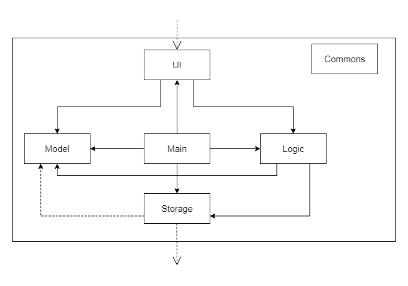
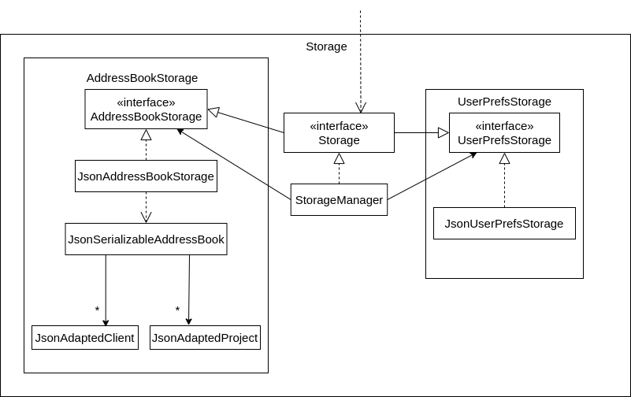

## Table of Contents

* Table of Contents
{:toc}

--------------------------------------------------------------------------------------------------------------------

## Acknowledgements

* Libraries used: [JavaFX](https://openjfx.io/),
  [Jackson](https://github.com/FasterXML/jackson),
  [JUnit5](https://github.com/junit-team/junit5)
* With inspiration from: [fzf](https://github.com/junegunn/fzf) (for fuzzy
  finding), [Vim](https://www.vim.org/) (for hotkeys)
* With GUI testing structure based on: [Address book-level4](https://github.com/se-edu/addressbook-level4)
* Originally forked from: [AddressBook
  3](https://github.com/nus-cs2103-AY2223S2/tp)

## Using this Guide

This guide is written for anyone who wishes to hack on the Mycelium codebase.
It assumes basic knowledge of Java as well as the ability to read UML diagrams.

### Icons and conventions

The following typographical conventions are used in this guide.

* (KEYCAP) - Indicates a literal set of keys, e.g. (CTRL+F) refers to the
  combination of the 'Control' and 'F' keys.

Throughout this guide, you might encounter certain boxes which like the ones
below. Here is what each of them means.

<div markdown="span" class="alert alert-success">
:bulb: This box signifies a tip or suggestion.
</div>

<div markdown="span" class="alert alert-info">
:information_source: This box signifies a general note.
</div>

<div markdown="span" class="alert alert-danger">
:warning: This box indicates a warning or caution.
</div>

### Content overview

This guide has been divided into five main parts.

* [Design](#design) discusses the high level architecture of Mycelium
* [User Interface](#user-interface) discusses GUI concerns
* [Command Handling](#command-handling) discusses the parsing and executing of commands
* [Storage](#storage) briefly explains Mycelium's approach to persisting data
* [Keyboard Interaction](#keyboard-interaction) discusses hotkeys and fuzzy search

We strive to write each section in a relatively self-contained manner, but some
cross-referencing might be necessary.

### Setting up locally

This guide assumes that you have already set up Mycelium on your computer. For
information on how to do this, see the [setting up guide](/tp/SettingUp.html).

--------------------------------------------------------------------------------------------------------------------

## Design

### Architecture



The ***Architecture Diagram*** given above explains the high-level design of the App.

Given below is a quick overview of main components and how they interact with each other.

**Main components of the architecture**


**`Main`** has two classes called [`Main`](https://github.com/AY2223S2-CS2103T-W14-1/tp/blob/master/src/main/java/mycelium/mycelium/Main.java) and [`MainApp`](https://github.com/AY2223S2-CS2103T-W14-1/tp/blob/master/src/main/java/mycelium/mycelium/MainApp.java).
It is responsible for,
* At app launch: Initializes the components in the correct sequence, and connects them up with each other.
* At shut down: Shuts down the components and invokes cleanup methods where necessary.

[**`Commons`**](#common-classes) represents a collection of classes used by multiple other components.

The rest of the App consists of four components.

* [**`UI`**](#ui-component): The UI of the App.
* [**`Logic`**](#logic-component): The command executor.
* [**`Model`**](#model-component): Holds the data of the App in memory.
* [**`Storage`**](#storage-component): Reads data from, and writes data to, the hard disk.

**How the architecture components interact with each other**

Each of the four main components (also shown in the diagram above),

* defines its *API* in an `interface` with the same name as the Component.
* implements its functionality using a concrete `{Component Name}Manager` class (which follows the corresponding API `interface` mentioned in the previous point.)

For example, the `Logic` component defines its API in the `Logic.java` interface and implements its functionality using the `LogicManager.java` class which follows the `Logic` interface. Other components interact with a given component through its interface rather than the concrete class (reason: to prevent outside component's being coupled to the implementation of a component), as illustrated in the (partial) class diagram below.


The sections below give more details of each component.

### UI component

The **API** of this component is specified in [`Ui.java`](https://github.com/AY2223S2-CS2103T-W14-1/tp/blob/master/src/main/java/mycelium/mycelium/ui/Ui.java)

{TODO update diagram}


### Logic component

{TODO update link}
**API** : [`Logic.java`](https://github.com/AY2223S2-CS2103T-W14-1/tp/blob/master/src/main/java/mycelium/mycelium/logic/Logic.java)

Here's a (partial) class diagram of the `Logic` component:


How the `Logic` component works:
1. When `Logic` is called upon to execute a command, it uses the `AddressBookParser` class to parse the user command.
1. This results in a `Command` object (more precisely, an object of one of its subclasses e.g., `AddProjectCommand`) which is executed by the `LogicManager`.
1. The command can communicate with the `Model` when it is executed (e.g. to add a project).
1. The result of the command execution is encapsulated as a `CommandResult` object which is returned back from `Logic`.

The Sequence Diagram below illustrates the interactions within the `Logic` component for the `execute("dp -pn Mycelium")` API call.


<div markdown="span" class="alert alert-info">:information_source: **Note:** The lifeline for `DeleteProjectCommandParser` should end at the destroy marker (X) but due to a limitation of PlantUML, the lifeline reaches the end of diagram.
</div>

Here are the other classes in `Logic` (omitted from the class diagram above) that are used for parsing a user command:


How the parsing works:
* When called upon to parse a user command, the `AddressBookParser` class creates an `XYZCommandParser` (`XYZ` is a placeholder for the specific command name e.g., `AddProjectCommandParser`) which uses the other classes shown above to parse the user command and create a `XYZCommand` object (e.g., `AddProjectCommand`) which the `AddressBookParser` returns back as a `Command` object.
* All `XYZCommandParser` classes (e.g., `AddProjectCommandParser`, `DeleteProjectCommandParser`, ...) inherit from the `Parser` interface so that they can be treated similarly where possible e.g, during testing.

### Model component

***Classes:*** [`Client.java`](https://github.com/AY2223S2-CS2103T-W14-1/tp/blob/master/src/main/java/mycelium/mycelium/model/client/Client.java), [`Project.java`](https://github.com/AY2223S2-CS2103T-W14-1/tp/blob/master/src/main/java/mycelium/mycelium/model/project/Project.java)


The `Model` box is the central component of the Mycelium's data. It contains
the entities `Client` and `Project` which are used to store the data of each
entity.

The `Client` class contains the attributes for a client's `Name`, `Email`,
`YearOfBirth`, source and `Phone` number, where the name and email are
compulsory fields. The rest of the attributes are optional, and hence stored in
`Optional` objects. The source attribute is a `String`.

The `Project` class contains the attributes for a project's `Name`,
`ProjectStatus`, `Email`, source, description, acceptedOn and deadline, where
the project name and email are compulsory fields. The rest of the attributes
are optional, where source, description and deadline are wrapped in `Optional`
objects. These optional attributes are typed:

- source: String
- projectStatus: `ProjectStatus`
- description: String
- acceptedOn: `LocalDate`
- deadline: `LocalDate`

Each entity uses different methods, which they inherit from `ClientModel` and
`ProjectModel` interface via the `Model` interface respectively.

Moreover, each entity is also stored in a `UniqueList`, which ensures that the
list do not contain duplicates. `UniqueList` from each entity is then stored in
`AddressBook`, which contains the overarching methods for handling each type of
list.

### Storage component

**API** : [`Storage.java`](https://github.com/AY2223S2-CS2103T-W14-1/tp/blob/master/src/main/java/mycelium/mycelium/storage/Storage.java)



The `Storage` component,
* can save both address book data and user preference data in json format, and read them back into corresponding objects.
* inherits from both `AddressBookStorage` and `UserPrefStorage`, which means it can be treated as either one (if only the functionality of only one is needed).
* depends on some classes in the `Model` component (because the `Storage` component's job is to save/retrieve objects that belong to the `Model`)

<div markdown="span" class="alert alert-danger">
:warning: If the JSON file storing the data becomes unreadable or invalid due to corruption or tampering,
Mycelium will ignore the data file and start an empty application with no projects and clients. Commands
performed that will modify the data file will overwrite the corrupted file. This would lead to a
complete and unrecoverable loss of data prior to the corruption.
</div>

### Common classes

Classes used by multiple components are in the `mycelium.mycelium.commons` package.

--------------------------------------------------------------------------------------------------------------------

<div markdown="span" class="alert alert-info">
:information_source: The following three sections discuss implementation
details. We have divided them into three overarching themes: [User
Interface](#user-interface), [Command Handling](#command-handling), and
[Keyboard Interactions](#keyboard-interactions).
</div>

## User Interface

### Statistics Dashboard

Statistics Dashboard displays statistics regarding Projects. There are three
main statistics: projects that are due soon, projects that are overdue
and a pie chart showing progress overview. The goal of this feature is to provide users
with useful information related to productivity to make adjustments accordingly.

For projects that are due soon, all projects that have deadlines within the current week
and next week will be displayed (Week starts from Sunday). For example, if the current
date is 11/04/2023, all projects with deadlines from 09/04/2023 to 22/04/2023 will be
shown on the **Due soon project list**.

For overdue list, all overdue projects will be displayed to make sure that users can
keep track of all the deadlines they have missed. Any deadlines before the current date will be
counted as overdue. For example, if the current date is 11/04/2023, projects with deadlines on 11/04/2023
will not be shown in **Overdue project list**, but projects with deadlines on 10/04/2023 will be shown in the **Overdue
project list**.

Both of **Due and Overdue project lists** utilize LocalDate library in Java to perform various operations on dates.

For Progress Overview Pie chart, there will be at most three segments. The three segments
will correspond to three project statuses, which are `not_started`, `done` and `in_progress`.
The size of each segment is proportional to the number of projects with its corresponding segment
label.
<div markdown="span" class="alert alert-danger">
:warning: The color of each segment is not related to the status.
</div>


#### Updating the UI

For **Due soon project lists**, **Overdue project lists** and **Pie chart**, `FilteredList` retrieved by
using `Logic#getFilteredProjectList` cannot be used because it will affect the UI. Besides,
all the statistics need filtering out, making it not possible to use `FilteredList#setPredicate`.
Thus, for the dashboard to update accordingly as changes are made to project list, a `ListChangeListener`
will be attached to the original list of projects. Whenever there is a change in the project list (e.g.
a new project is added), all the statistics will be updated as well. These changes could be due to
increased number of projects (e.g. a new project is created), or an existing project is modified.
Moreover, when there are no projects available matching the requirements of Due soon and Overdue project lists,
there will be messages displayed under the tab heading.


The diagram following shows us that the MainWindow is responsible for instantiating the StatisticsBox.
The fillInnerParts() method is part of the UI's initialization routine. The `ObservableList<Project>#addListener()`
will be called to listen for changes in project list. During the initialization of the StatisticsBox instance, data
for the **Due soon**, **Overdue** project list and **Pie chart** is also loaded.


### Tabs panel
In Mycelium, there are four main tabs: **Projects**, **Clients**, **Due soon** and **Overdue**.
The **Projects** tab will be responsible for displaying all projects created while the **Clients** tab
will display all clients created. Each of these two tabs is a `EntityTab` object, and contains a `EntityList` of
`Project` for **Projects** tab and `Client` for **Clients** tab. Both will be in the same
panel `EntityPanel` on the left side of the application view.

The **Due soon** tab will be responsible for displaying all projects that are due soon while the **Overdue** tab
will display all projects that are overdue as mentioned in the [Statistics Dashboard](#statistics-dashboard) section.
Each of these two tabs is a `StatisticsTab` object, and contains a `EntityList` of `Project`. Both of these two
tabs will be in the same panel `StatisticsPanel` on the right side of the application view.


For demonstration purposes, the following is the Activity Diagram when a `EntityPanel` is initialized:


For more information about interacting with the tabs using hotkeys, please refer to the
[Hotkeys with UiEvents](#hotkeys-with-uievents) section.


## Keyboard Interaction

### Hotkeys with UiEvents

UiEvents is an abstraction of keyboard events that can trigger changes in
user interface or perform some action. These keyboard events are handled by
UiEvent handlers that are bundled together within the `UiEventManager` class.

<div markdown="span" class="alert alert-info">
:information_source: We will occasionally refer to each of these event handlers as a `Key`
</div>

The following is the class diagram of the
`UiEventManager` class.


There are currently 10 registered event handlers, namely:
* `HelpKey` Help (F1)
* `QuitKey` Quit (CTRL+Q)
* `StartOfLineKey` Start of Line (CTRL+W)
* `EndOfLineKey` End of Line (CTRL+E)
* `ClearKey` Clear line (CTRL+D)
* `SwitchPanelKey` Switch Panels (CTRL+S)
* `SwitchTabKey` Switch Tabs (CTRL+L)
* `NextItemKey` Select next (CTRL+J)
* `PrevItemKey` Select previous (CTRL+K)
* `FindKey` Search (CTRL+F)

Each of these event handler perform an action associated with a keyboard event.
The action performed by each event handler can be found and modified in their respectively
named files found in the `java/mycelium/mycelium/logic/uievent` folder.

To find out more about the supported keyboard events and its associated actions
in Mycelium, please refer to the [User Guide](UserGuide.md#hotkeys).

#### UiEvent Handling
The `UiEventManager` is responsible for calling the appropriate event handler to handle
the incoming event. When a keyboard input is registered, the `UiEventManager#catchAndExecute(KeyEvent)`
method will be called with the incoming event as the argument.


The above seqeuence diagram shows what happens when a keyboard event is
registered. To keep the diagram simple, we only explicitly show two
out of the 10 registered event handlers as the other event handlers
work in a similar manner.
The key combination that triggered the event will be checked against
each of the registered event handlers to decide which event handler to invoke.


The above sequence diagram shows what happens once there is a match with a
generic event handler. An instance of the respective `Key` will be created,
and executed. The event is then consumed to prevent the event from propagating
any further to the inner UI elements.


The above sequence diagram shows how the user interface can be modified during
the execution of the `Key` instance. The `Key` calls the respective method of
the `MainWindow` which in turns calls the respective UI component to perform
the action associated with the event.

We will use the `SwitchTabKey` event handler as a concrete example. The following
sequence diagrams show what happens when the `SwitchTabKey` event handler is invoked.


Note that not all event handlers are built the same. An example of a more
complicated event handler will be `FindKey` which we will elaborate more
in the next section.

### Command Box

The command box in Mycelium can be in one of 2 `Mode` of operation, namely, `CommandMode` and `SearchMode`,
and supports switching between these 2 modes.
A `Mode` is modular component that is attached to the command box which
dictates the behaviour of the command box on input change and on submit.

The following is class diagram of the command box.


#### Changing Modes

The user can toggle between `SearchMode` and `CommandMode` with a keyboard event
invoking the `FindKey` event handler. Please refer to the
[UiEvent Handling](#uievent-handling) section for more information of how Mycelium
handles keyboard event.

The following sequence diagrams show what happens when `FindKey` event handler
is invoked.


Depending on the current `Mode` of the command box, triggering the `FindKey` event handler
creates the other `Mode` and calls `MainWindow#setCommandBoxMode(Mode)` which sets `Mode`
of the command box by calling `CommandBox#setMode(Mode)`.


When `Mode#setMode(Mode)` is called, the command box will call `Mode#teardownMode()`
on its outgoing `Mode` to perform the necessary clean up which includes
reverting the input to its prior state. The command box then calls `Mode#setupMode(String)`
on the incoming `Mode` which will perform the necessary setup for the incoming `Mode`.
This includes caching the current input of the command box so that it can return the input
to its original state when incoming `Mode` is torn down in the future.

#### On submit

The following sequence diagram shows what happens when the user submits in the
command box.


When the user submits, the command box will call `Mode#onInputSubmit(String)`
on its current `Mode` with the text input. An `Optional<Mode>` instance will be
returned which indicate the next `Mode` to change to if there is a `Mode`. Otherwise,
it will remain in keep its current `Mode`. This is utilised to switch back the command
box to `CommandMode` when submitting in `SearchMode`.

#### On input change

The following sequence diagram shows what happens when the user edits the input
of the command box.


When the user edits the input, the command box will call `Mode#onInputChange(String)`
on its current `Mode` with the text input. This is utilised in `SearchMode` to allow
for interactive changes to the displayed projects and clients as the user types.

### Fuzzy searching

A fuzzy search searches for text that matches a term closely instead of exactly.
In Mycelium, this is implemented using a modified version of [Levenshtein
distance](https://en.wikipedia.org/wiki/Levenshtein_distance), which measures
the "distance" between two strings. A lower distance corresponds to a better
match; a higher distance corresponds to a worse match. The goal of this feature
is to provide interactive fuzzy searching and display sorted results such that
the best match is at the top; here, "interactive" means that results are ranked
and displayed *as* the user types their query.

<div markdown="span" class="alert alert-info">
:information_source: **Note:** We will use the terms "fuzzy search" and "fuzzy
find" interchangeably in this document. The term "fuzzy ranking" refers to the
entire routine of processing items, computing their Levenshtein distance
against some input, and sorting them such that the closest matches are at the
front.
</div>

This section will briefly cover the idea behind the fuzzy ranking algorithm.
For full details regarding how the scoring is done, it is best to refer to [the
code](https://github.com/AY2223S2-CS2103T-W14-1/tp/blob/master/src/main/java/mycelium/mycelium/model/util/Fuzzy.java)
directly.

The scoring algorithm is implemented in the `Fuzzy` class in two pure
functions - `Fuzzy#delta` and `Fuzzy#levenshtein`, both returning a `double`
between 0 and 1 inclusive. A score of 1 indicates a perfect match, and lower
scores indicate poorer matches.

* `Fuzzy#delta` is a simpler algorithm which takes a query string and a target,
  and expects to find the query string as a subsequence of the target. In other
  words, it expects to find every character of the query within the target, and
  in the same order.
* `Fuzzy#levenshtein` computes the Levenshtein distance between two strings,
  and then normalizes it into the range [0, 1].

Suppose we have a query string and a list of items to rank, according to how
well they match the query. In broad strokes, the algorithm proceeds as such:

1. Compute `Fuzzy#delta` for each item.
1. For each item which received a score above zero, sort them by descending
   scores and add them to the resulting list.
1. Compute `Fuzzy#levenshtein` for the *remaining items* only.
1. Repeat step (2) for the remaining items using the scores obtained from
   `Fuzzy#levenshtein`.
1. Return the resulting list.

<div markdown="span" class="alert alert-success">
:bulb: The algorithm outlined above actually filters out all items which
receive a **zero** score from both `Fuzzy#delta` and `Fuzzy#levenshtein`. These
items would subsequently not be displayed to the user. If we raised this number
to, say, 0.1, then we can impose a stricter requirement on how well the items
match any given query, thus potentially filtering out more items. Hence, this
is a point for possible fine-tuning in the future.
</div>

<div markdown="span" class="alert alert-info">
:information_source: In Mycelium, fuzzy ranking is *not* case-sensitive. All
strings are converted to lowercase before any comparison.
</div>

#### `FuzzyManager`

In order to use fuzzy search from the application, we also have the
`FuzzyManager` class which exposes a more convenient API for us to rank clients
and projects. The class diagram below shows a high level overview of the
classes involved.


The `FuzzyManager#rankItems` method is just a convenient pure function which,
when given a list of clients or projects and a query string, constructs a new
sorted and filtered list based on how well each item matches the query. It
relies on the algorithm implemented within the `Fuzzy` class.

Note that part of this logic is implemented in the `SearchMode` class, which
has already been mentioned [above](#command-box). The `SearchMode` class
encapsulates the logic required to handle search requests (via a change in user
input) as well as applying updates to the UI. The following sequence diagrams
illustrate this in further detail.


From above, we see that the `onInputChanged()` method on `SearchMode` is
invoked with the current contents of the command box. From here, it is a
three-step process.

1. Retrieve an unmodified view of the clients and projects from a `Logic` instance
1. Pass the two lists through the `FuzzyManager#rankItems` method, which
   performs fuzzy ranking on the lists of clients and projects
1. Apply the two ranked lists to the `MainWindow`

#### Updating the UI

From the sequence diagram above, we see that updates to the UI after fuzzy
ranking is achieved by having `SearchMode` *set* the list of items in
`MainWindow`. This departs from the approach used in our CRUD operations, where
(immutable) references to a `FilteredList` of clients and projects were
obtained upon UI initialization, and any changes such as the creation or
deletion of a client were automatically propagated to the UI with no additional
setters required in our application's code.

However, the inclusion of fuzzy search introduces an important requirement -
*arbitrary filtering and sorting* based on user input. Furthermore, upon the
user exiting fuzzy search mode, we need to revert the user's view of clients
and projects back to the way it was, before fuzzy searching began.

In order to decouple these requirements from the more basic ones of CRUD, we
avoid modifying the original `FilteredList` owned by the UI. The general idea
is to replace the two lists of projects and clients every time the fuzzy
ranking is performed. Thus, the fuzzy ranking is free to perform any kind of
sorting and filtering it requires without worrying about any unintentional
side effects on the UI. After the user exits from fuzzy finding mode, the UI
then retrieves a clean reference to the lists of clients and projects from the
address book, which automatically reverts it to its pre-fuzzy state.

#### `CommandBox` state

The section on the [changing Command Box modes](#changing-modes) introduced the
role of this class in managing state between `SearchMode` and `CommandMode`. We
can now contextualize the differences between these two modes in relation to
fuzzy searching. This is illustrated in the activity diagram below.


## Command Handling

### Commands

#### Command Sequence

When the command box is in `CommandMode`, the user can enter commands to perform various operations in Mycelium. The following sequence diagram shows how the command is handled.


When the user enters a command, the command box calls `Mode#onInputSubmit(String)` on its current `CommandMode`.
The input from the command box is then propagated down to the `MainWindow`, the `Logic` and finally the `Parser` to be parsed.

The `Parser` then returns a `Command` instance to `Logic` which then executes the `Command` instance. The execution returns a `CommandResult` which is then passed back to the `MainWindow`.

The `MainWindow` updates the `CommandLog` based on the feedback from `CommandResult` and executes the `UiAction`.

The `CommandMode` then clears the `CommandBox` input and is now ready for accepting the next command.

#### UiActions

The `UiAction` class is an abstract class that represents an action to be performed by the `MainWindow`. Every `CommandResult` returned from a `Command` execution contains a `UiAction` that is to be executed by the `MainWindow`.

This is used to perform actions such as switching the tab to Projects tab when a Project related command is executed or exiting the application when the `ExitCommand` is executed.

The following sequence diagram shows how the `UiAction` that switches the tab to Projects tab.


Upon being executed, `UiAction` instance calls the appropriate method in `MainWindow` to perform the action from a successful command. In this case, the `UiAction` calls `MainWindow#selectProjectTab` to switch the tab to the Projects tab.

### Parser

--------------------------------------------------------------------------------------------------------------------

## Appendix: Requirements

### Product scope

**Target user profile**:
**Freelance Devs**

Freelance web developers with postings on multiple online marketplaces for digital services (e.g. Fiverr) who want to manage projects and clients easily while tracking their contract terms and hours spent per project.

**Value proposition**:
Mycelium strives to be a one-stop shop for freelance web developers to consolidate projects from multiple sources. Manage descriptive yet concise information about each client, all through an intuitive console-first interface. Mycelium is tailored for the modern web developer, enabling you to build strong and trusted relationships with clients.

### User stories

Priorities: High (must have) - `* * *`, Medium (nice to have) - `* *`, Low (unlikely to have) - `*`

| Priority | As a ...               | I want to ...                                                                                                  | So that ...                                                                          |
|----------|------------------------|----------------------------------------------------------------------------------------------------------------|--------------------------------------------------------------------------------------|
| * * *    | user                   | easily access each project by name for convenience.                                                            |                                                                                      |
| * * *    | user                   | create new projects and contacts.                                                                              |                                                                                      |
| * * *    | user                   | delete projects and contacts I no longer need.                                                                 |                                                                                      |
| * * *    | user                   | use the application on different platforms and operating systems.                                              |                                                                                      |
| * * *    | user                   | update details of existing projects and contacts                                                               | I can keep up with changing requirements of clients.                                 |
| *        | new user               | experience an intuitive user-interface. There should be help messages to guide me around the features.         | I can refer to instructions when I forget how to use the App                         |
| *        | user                   | efficiently log information about a new client                                                                 | I minimise the effort and time needed to start a project.                            |
| *        | new user               | login using my GitHub account                                                                                  | it is convenient to login.                                                           |
| *        | new user               | sign up using email and password                                                                               | I can avoid using third party authentication sources, like GitHub or Google.         |
| *        | forgetful user         | be reminded of up coming deadlines                                                                             | I will not miss out any deliverables set by clients.                                 |
| *        | user                   | easily categorise the type of each project I have been working on                                              | it is easier to reflect on in the future and navigate.                               |
| *        | user                   | view statistics related to productivity (which channel I gain most projects, money from)                       | I know which project to put more focus on to earn better money.                      |
| *        | user                   | track my client’s payment status                                                                               | transaction management would be fuss-free.                                           |
| *        | user                   | track my project’s progress                                                                                    | I can provide timely updates to my clients.                                          |
| *        | user                   | track the time I have worked on for each project                                                               | I can ensure I have allocated time for the different projects I am working on.       |
| *        | user                   | easily view all of my freelance job requests from Fiverr and Upwork in one place.                              |                                                                                      |
| *        | user                   | update my availability status for each platform in one place                                                   | I don't miss out on job offers due to scheduling conflicts.                          |
| *        | user                   | store client information, such as contact details and project specifications, in one place                     | I can quickly access it when needed.                                                 |
| *        | user with many clients | easily communicate with clients through the product                                                            | I can streamline my workflow and avoid having to switch between different platforms. |
| *        | user                   | receive notifications when I receive new job offers or when deadlines are approaching                          | I can stay on top of my workload.                                                    |
| *        | user                   | easily generate invoices for each freelance job and track payment status                                       | I can manage my finances more effectively.                                           |
| *        | user                   | easily rate and review clients                                                                                 | I can make informed decisions about which jobs to accept in the future.              |
| *        | user                   | follow the work of other developers                                                                            | I can find opportunities to collaborate.                                             |
| *        | user                   | use the app to estimate the amount of time that I will need for a project                                      | I can determine if I have the capacity to take on new projects.                      |
| *        | user                   | keep in contact with other developers                                                                          | I can work on larger projects efficiently.                                           |
| *        | user                   | personalize my contacts                                                                                        | I can know each client better                                                        |
| *        | user                   | export data from the product in different formats, such as CSV or Excel                                        | I can use the information elsewhere.                                                 |
| *        | user                   | securely store confidential information, such as client details                                                | I can keep sensitive information safe.                                               |
| *        | user                   | use the product offline                                                                                        | I can access my information when I don't have an internet connection.                |
| *        | user                   | easily search and filter projects based on specific criteria, such as deadline, client name, or project status | I can quickly find the information I need.                                           |

### Use cases

(For all use cases below, the **System** is the `Mycelium` and the **Actor** is the `user`, unless specified otherwise)

**Use case: Create a project**

**MSS**

1. User enters command and submits details for new project
2. Mycelium creates the project
3. User can view the new project listed in panel

   Use case ends.

**Extensions**

* 1a. Required project details are not provided.
   * 1a1. Mycelium shows an error message.

   Use case resumes at step 1.

* 1b. Some project details are invalid.
   * 1b1. Mycelium shows an error message.

   Use case resumes at step 1.

**Use case: Create a client**

**MSS**

1. User enters command and submits details for new client
2. Mycelium creates the client
3. User can view the new client listed in panel

   Use case ends.

**Extensions**

* 1a. Required client details are not provided.
   * 1a1. Mycelium shows an error message.

   Use case resumes at step 1.

* 1b. Some project details are invalid.
   * 1b1. Mycelium shows an error message.

   Use case resumes at step 1.

**Use case: Delete a project**

**MSS**

1. User enters command and submits name of project to delete
2. Mycelium deletes the project
3. User can no longer see project listed in panel

   Use case ends.

**Extensions**

* 1a. Project with submitted name does not exist.
   * 1a1. Mycelium shows an error message.

   Use case resumes at step 1.

**Use case: Delete a client**

**MSS**

1. User enters command and submits email of client to delete
2. Mycelium deletes the client
3. User can no longer see client listed in panel

   Use case ends.

**Extensions**

* 1a. Client with submitted email does not exist.
   * 1a1. Mycelium shows an error message.

   Use case resumes at step 1.

### Non-Functional Requirements

1.  Should work on any _mainstream OS_ as long as it has Java `11` or above installed.
1.  Should be able to hold up to 1000 clients without a noticeable sluggishness in performance for typical usage.
1.  Should be able to hold up to 1000 projects without a noticeable sluggishness in performance for typical usage.
1.  A user with above average typing speed for regular English text (i.e. not code, not system admin commands) should be able to accomplish most of the tasks faster using commands than using the mouse.
1.  All user operations should complete under 100ms.
1.  Should not lose any work in case the application crashes.
1.  Data persists when the application restarts.

*{More to be added}*

## Glossary

The terms in this glossary are sorted in alphabetical order.

* **Client**: An individual associated with a particular project, presumably
  the one who posted or requested it
* **Console-first interface**: An interface with interactions primarily through
  text commands or hotkeys
* **Draw.io**: A drag-and-drop diagramming tool. Available at
  [draw.io](https://app.diagrams.net/).
* **Fuzzy search**: A feature to search for items which partially match a query
  rather than exactly
* **Hotkey**: A convenient combination of key presses meant to invoke some app
  functionality
* **PlantUML**: A text-based diagramming tool. See
  [plantuml.com](https://plantuml.com/) for more information.
* **Project**: A freelance software development gig

--------------------------------------------------------------------------------------------------------------------

## Appendix: Instructions for manual testing

<div markdown="span" class="alert alert-success">
:bulb: When testing commands, it is recommended to test different combinations
of the optional arguments to ensure that the program can handle different use
cases.
</div>

### Client commands

**Creating a client**

1. Type the command "c" followed by a space and then the client's name (-cn
   name) and email (-e email).
1. Verify that the new client's name and email are displayed on the interface
   after successfully creating the contact.
1. Optionally, add any combination of the year of birth (-y argument), platform
   source (-src argument), and mobile number (-mn argument) after the email in
   the command. Verify that the corresponding information is displayed on the
   interface.
1. Test that an error message is displayed if a client with the same email
   already exists.
1. Test that an error message is displayed if no client name or email is
   provided.
1. Test that an error message is displayed if an invalid argument is entered.

**Deleting a client**

1. Identify an existing client contact to delete and note down their email
   address.
1. Type the command "dc" followed by a space and then the email address of the
   client to be deleted (-e email).
1. Verify that the interface displays the name and email of the deleted client.
1. Confirm that the deleted client's information is no longer accessible
   through the interface.
1. Test that an error message is displayed if no email address is provided.
1. Test that an error message is displayed if the email address provided does
   not correspond to an existing client contact.

**Updating a client**

1. Identify an existing client contact to update and note down their email
   address.
1. Type the command "uc" followed by a space and then the email address of the
   client to be updated (-e email).
1. Optionally, add any combination of the client's new name (-cn client_name),
   new email (-e2 email), new year of birth (-y year_of_birth), new platform
   source (-src source), or new mobile number (-mn mobile_number) after the
   email address in the command. Verify that the corresponding information is
   displayed on the interface after successful update.
1. Test that the client information is updated correctly by checking that the
   updated information is displayed on the interface.
1. Test that an error message is displayed if no email address is provided.
1. Test that an error message is displayed if the email address provided does
   not correspond to an existing client contact.
1. Test that an error message is displayed if a new email address is provided
   that is already associated with an existing client contact.
1. Test that if an optional argument is not provided, the corresponding field
   is not updated and the existing information is retained.

### Project commands

**Creating a project**

1. Type the command "p" followed by a space and then the project's name (-pn
   project_name) and the email of the client who submitted the project (-e
   client_email).
1. Verify that a message confirming the addition of the project is displayed.
1. Optionally, add any combination of the project's status (-s status), source
   (-src source), description (-d description), accepted date (-ad
   accepted_date), and deadline date (-dd deadline_date) after the client's
   email in the command. Verify that the corresponding information is displayed
   on the interface.
1. Test that an error message is displayed if no project name or client email
   is provided.
1. Test that an error message is displayed if a project with the same name
   already exists.
1. Test that the project information is stored correctly by checking that the
   information is displayed on the interface after successful creation.
1. Test that the default values are assigned correctly for the optional
   arguments.
1. Test that an error message is displayed if an invalid argument is entered.

**Deleting a project**

1. Identify an existing project to delete and note down its name.
1. Type the command "dp" followed by a space and then the project's name (-pn
   project_name).
1. Verify that a message confirming the deletion of the project is displayed.
1. Confirm that the deleted project's information is no longer accessible
   through the interface.
1. Test that an error message is displayed if no project name is provided.
1. Test that an error message is displayed if the project name provided does
   not correspond to an existing project.

**Updating a project**

1. Identify an existing project to update and note down its name.
1. Type the command "up" followed by a space and then the project's name (-pn
   project_name).
1. Optionally, add any combination of a new project name (-pn2
   new_project_name), a new client email (-e client_email), a new project
   status (-s status), a new source for the project (-src source), a new
   description for the project (-d description), a new accepted-on date for the
   project (-ad accepted_date), and a new deadline for the project (-dd
   deadline_date) after the project name in the command. Verify that the
   corresponding information is displayed on the interface after successful
   update.
1. Test that the project information is updated correctly by checking that the
   updated information is displayed on the interface.
1. Test that an error message is displayed if no project name is provided.
1. Test that an error message is displayed if the project name provided does
   not correspond to an existing project.
1. Test that if an optional argument is not provided, the corresponding field
   is not updated and the existing information is retained.
1. Test that an error message is displayed if an invalid argument is entered.

### Fuzzy search

1. Press (CTRL+F) to toggle to search mode, and note that the command box
   should switch color as an indication.
1. Type a query into the command box that partially matches a project name, and
   verify that the projects with matching names are displayed in the UI. Note
   that closer matches should be placed at the top.
1. Verify that the search is interactive and the UI automatically updates as
   you type your query.
1. Verify that only projects that have a partial match with the query are
   shown. Projects that don't match at all should not be shown.
1. Verify that the search is not case-sensitive.
1. Test that exiting search mode by pressing (CTRL+F) again returns the command
   box to its original color.
1. Repeat the above steps for client names.

The following steps test the feature for extracting project names and emails
with (ENTER).

1. Ensure there are some projects and clients in Mycelium.
1. Press (CTRL+F) to enter search mode.
1. In the search box, type a query for a project or client name that exists in
   the list, but do not press enter.
1. Use (CTRL+J) and (CTRL+K) to navigate and select the desired project or
   client in the search results.
1. Press (ENTER) to exit search mode and append the name or email of the
   selected project or client to the command box.
1. Verify that the selected project or client name/email is appended to the
   command box correctly.
1. Try executing some commands while in search mode and verify that they are
   not executed.
1. Try searching while in command mode and verify that no searching can be
   done.

### Hotkeys

1. Verify that the Help page can be accessed by pressing (F1).
1. Verify that Mycelium can be quickly quit by pressing (CTRL+Q).
1. Verify that the cursor can be moved to the start of the line in the command
   box by pressing (CTRL+W).
1. Verify that the cursor can be moved to the end of the line in the command
   box by pressing (CTRL+E).
1. Verify that the current line in the command box can be quickly cleared by
   pressing (CTRL+D).
1. Verify that the command log found below the command box is also cleared when
   using (CTRL+D).
1. Verify that the focus can be switched between the Entity panel and the
   Statistics panel by pressing (CTRL+S).
1. Verify that the panel in focus is highlighted with a blue header.
1. Verify that the tabs can be switched in the currently selected panel by
   pressing (CTRL+L).
1. Verify that the next item on the list in the currently selected tab can be
   selected by pressing (CTRL+J).
1. If the last item is selected, verify that the next item is the first item in
   the list.
1. Verify that the previous item on the list in the currently selected tab can
   be selected by pressing (CTRL+K).
1. If the first item is selected, verify that the previous item is the last
   item in the list.


## Appendix: Documentation, Logging, Testing, Configuration, and DevOps

* [Documentation guide](/tp/Documentation.html)
* [Logging guide](/tp/Logging.html)
* [Testing guide](/tp/Testing.html)
* [Configuration guide](/tp/Configuration.html)
* [DevOps guide](/tp/DevOps.html)

--------------------------------------------------------------------------------------------------------------------

## Appendix: Planned Enhancements

This section documents some known feature flaws and our planned solutions for
each.

**1. Lost all data after modifying data file**

We plan to utilise checksum on JSON file to prevent manual tampering of data
and display explicit exceptions when the JSON file is corrupted or tampered
with.

* A checksum could be generated in `checksum.txt` in the same directory as the
  JSON file.
* Any modification to the JSON file would result in a different checksum, which
  can be detected by comparing with the checksum stored in `checksum.txt`.
* If the checksums do not match or is missing, the user will be notified about
  a possible corruption in their data and be prompted to restore the JSON file
  from a backup.
* The JSON file will then proceed to be read by Mycelium. If the JSON file is
  unreadable or contains invalid values, the JSON file will be ignored and the
  application will start as an empty application with no projects and clients.
* Possible checksum algorithms are MD5, SHA-1, SHA-256, SHA-512.
   
**2. Long strings are cut off**

We are considering two alternatives: limiting the number of characters for a
field or wrapping text to fix the issue

* First solution: Limit the number of characters for a field. This will make
  sure that the number of characters will not exceed the screen size and will
  not take up too much space. For example, for a screen of 1366 pixels wide,
  can fix approximately 170 characters at regular font size. As around 40%
  width of the screen size is used by a panel such as entity panel, around 68
  characters can fit in the full screen size. To make up for the field name
  such as 'Name: ', we put 60 as the maximum capacity for number of characters
  for a field. 
* Second solution: Wrap the text around using `TextFlow` and `Text` in JavaFX,
  even if the word needs to be broken. For this approach, the number of
  characters that can be fit onto a line will still be needed. Basically, a
  string will be checked if it exceeds the limit of characters on a line. If it
  does, the `Text` including all the characters up to the limit will be added
  to the `TextFlow` node. The same process will be done repeatedly for the rest
  of the string until all characters run out. This is to make sure that even if
  a word is too long, the text will still be wrapped to the card size.

**3. Pie chart for project status spins even when no statuses change**

We plan to add a check to prevent pie chart from refreshing when no changes to
status of any project were made     

* The current hashmap of project status along with the count of the
  corresponding status will be stored. If there are any new changes to the list
  of projects, a new hashmap will be generated. This new hashmap will then be
  compared with the current one. If there are any changes in the status count,
  the pie chart will be refreshed. Else, the current pie chart will be kept. 
* This will make sure that only changes related to project status will trigger
  the refreshing of pie chart. 

**4. Case sensitivity of emails**

Currently, it is possible to create clients with the same email but in
different cases, e.g. *foo@bar.com* and *FOO@bar.com*. However, in the real
world emails are [not case
sensitive](https://mailchimp.com/resources/are-email-addresses-case-sensitive/).
Thus, the application should reflect this. Thankfully, the fix is easy, as it
involves changing the `equals()` method on the `Email` class.

We can change it from this:

```java
 public boolean equals(Object other) {
     return other == this || (other instanceof Email
         && this.value.equals(((Email) other).value));
 }
 ```

to this:

```java
 public boolean equals(Object other) {
     return other == this || (other instanceof Email
         && this.value.toLowerCase().equals(((Email) other).value.toLowerCase()));
 }
 ```

**5. Insufficient constraints on year of birth**

Currently, a client's year of birth is permitted to be any year from 0000 to
9999 inclusive. However, this may not make sense from a usage perspective, and
additional validation would be useful to guard against typos. As such, we plan
to adopt the following fixes:

1. Fix 1800 as a lower bound. Since Mycelium's target users are software
   developers, 1800 is a very reasonable lower bound, after accounting for the
   age of modern computing as well as the average human lifespan.
1. Allow years up to 10 years into the future. Why do we allow this? Consider
   the following (rare) use case: a family member is expecting a child, and has
   enlisted your help to set up a self-hosted photo storage system in
   preparation for keeping memories of his/her childhood.
   <br>
   As this is not a wholly improbable use case, we plan to set the upper bound
   to ten years from whenever the present time is. It also does not cause
   problems for other use cases.

The validation for this is simple, and goes into the `isValidYearOfBirth`
method of the [`YearOfBirth`
class](https://github.com/AY2223S2-CS2103T-W14-1/tp/blob/master/src/main/java/mycelium/mycelium/model/client/YearOfBirth.java).
In pseudocode, the check becomes

1. Ensure exactly four digits are specified (same as before)
1. Get current year as an integer; also convert the four digits into a base 10
   integer
1. Ensure that the year is within [1800, current year + 10]

