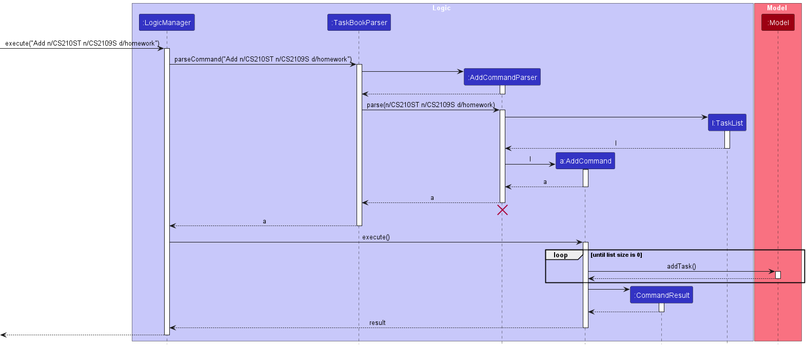
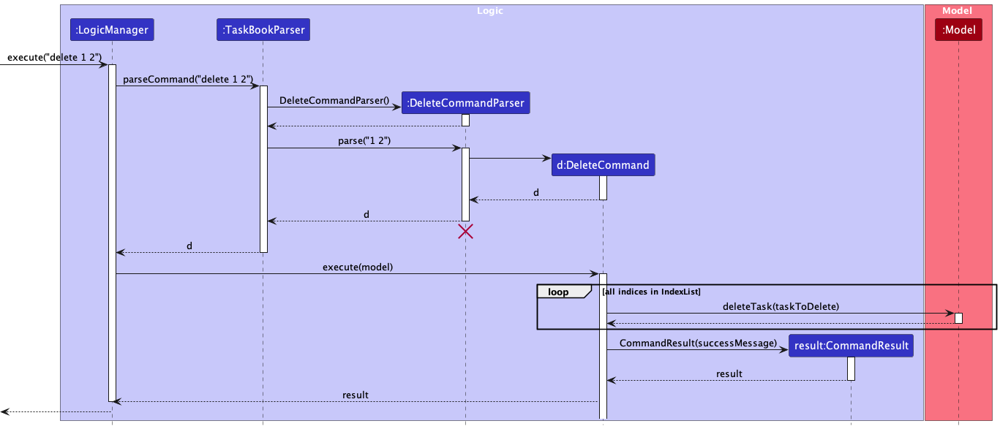
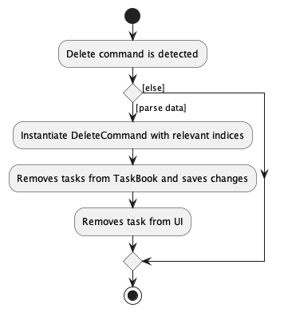
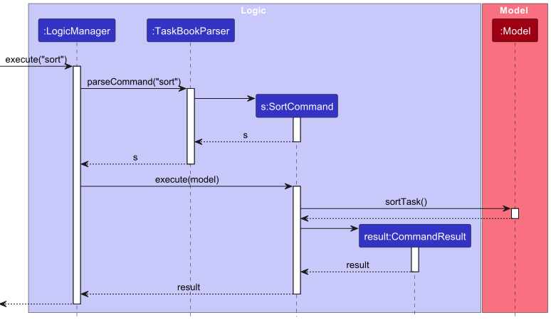

* Table of Contents
  * [1. Introduction](#1-introduction)
    * [1.1 Acknowledgements](#11-acknowledgements)
    * [1.2 Setting up, getting started](#12-setting-up-getting-started)
  * [2. Design](#2-design)
    * [2.1 Architecture](#21-architecture)
    * [2.2 UI Component](#22-ui-component)
    * [2.3 Logic Component](#23-logic-component)
    * [2.4 Model Component](#24-model-component)
    * [2.5 Storage Component](#25-storage-component)
    * [2.6 Common Classes](#26-common-classes)
  * [3. Implementation](#3-implementation)
    * [3.1 Add Feature](#31-add-feature)
    * [3.2 Clear Feature](#32-clear-feature)
    * [3.3 Delete Feature](#33-delete-feature)
    * [3.4 Edit Feature](#34-edit-feature)
    * [3.5 Find Feature](#35-find-feature)
    * [3.6 List Feature](#36-list-feature)
    * [3.7 Help Feature](#37-help-feature)
    * [3.8 Stats Feature](#38-stats-feature)
    * [3.9 Sort Feature](#39-sort-feature)
    * [3.10 Alert Feature](#310-alert-feature)
    * [3.11 Plan Feature](#311-plan-feature)
  * [4. Documentation, Logging, Testing, Configuration, DevOps](#4-documentation-logging-testing-configuration-dev-ops)
  * [5. Appendix: Requirements](#5-appendix-requirements)
  * [6. Appendix: Instructions for manual testing](#6-appendix-instructions-for-manual-testing)

--------------------------------------------------------------------------------------------------------------------

## 1. Introduction

This Developer Guide details Clock-Work's design and implementation details.

### 1.1 **Acknowledgements**

* Tag's color code examples courtesy of https://sashamaps.net/docs/resources/20-colors/.

### 1.2 **Setting up, getting started**

Refer to the guide [_Setting up and getting started_](SettingUp.md).

--------------------------------------------------------------------------------------------------------------------

## 2. **Design**

:bulb: **Tip:** The `.puml` files used to create diagrams in this document can be found in the [diagrams](https://github.com/se-edu/addressbook-level3/tree/master/docs/diagrams/) folder. Refer to the [_PlantUML Tutorial_ at se-edu/guides](https://se-education.org/guides/tutorials/plantUml.html) to learn how to create and edit diagrams.

### 2.1 Architecture

The ***Architecture Diagram*** given above explains the high-level design of the App.

Given below is a quick overview of main components and how they interact with each other.

**Main components of the architecture**

**`Main`** has two classes called [`Main`](https://github.com/se-edu/addressbook-level3/tree/master/src/main/java/seedu/address/Main.java) and [`MainApp`](https://github.com/se-edu/addressbook-level3/tree/master/src/main/java/seedu/address/MainApp.java). It is responsible for,
* At app launch: Initializes the components in the correct sequence, and connects them up with each other.
* At shut down: Shuts down the components and invokes cleanup methods where necessary.

[**`Commons`**](#common-classes) represents a collection of classes used by multiple other components.

The rest of the App consists of four components.

* [**`UI`**](#ui-component): The UI of the App.
* [**`Logic`**](#logic-component): The command executor.
* [**`Model`**](#model-component): Holds the data of the App in memory.
* [**`Storage`**](#storage-component): Reads data from, and writes data to, the hard disk.

**How the architecture components interact with each other**

The *Sequence Diagram* below shows how the components interact with each other for the scenario where the user issues the command `delete 1`.

Each of the four main components (also shown in the diagram above),

* defines its *API* in an `interface` with the same name as the Component.
* implements its functionality using a concrete `{Component Name}Manager` class (which follows the corresponding API `interface` mentioned in the previous point.

For example, the `Logic` component defines its API in the `Logic.java` interface and implements its functionality using the `LogicManager.java` class which follows the `Logic` interface. Other components interact with a given component through its interface rather than the concrete class (reason: to prevent outside component's being coupled to the implementation of a component), as illustrated in the (partial) class diagram below.

The sections below give more details of each component.

### 2.2 UI component

The **API** of this component is specified in [`Ui.java`](https://github.com/se-edu/addressbook-level3/tree/master/src/main/java/seedu/address/ui/Ui.java)

The UI consists of a `MainWindow` that is made up of parts e.g.`CommandBox`, `ResultDisplay`, `TaskListPanel`, `StatusBarFooter` etc. All these, including the `MainWindow`, inherit from the abstract `UiPart` class which captures the commonalities between classes that represent parts of the visible GUI.

The `UI` component uses the JavaFx UI framework. The layout of these UI parts are defined in matching `.fxml` files that are in the `src/main/resources/view` folder. For example, the layout of the [`MainWindow`](https://github.com/se-edu/addressbook-level3/tree/master/src/main/java/seedu/address/ui/MainWindow.java) is specified in [`MainWindow.fxml`](https://github.com/se-edu/addressbook-level3/tree/master/src/main/resources/view/MainWindow.fxml)

The `UI` component,

* executes user commands using the `Logic` component.
* listens for changes to `Model` data so that the UI can be updated with the modified data.
* keeps a reference to the `Logic` component, because the `UI` relies on the `Logic` to execute commands.
* depends on some classes in the `Model` component, as it displays `Task` object residing in the `Model`.

### 2.3 Logic component

**API** : [`Logic.java`](https://github.com/se-edu/addressbook-level3/tree/master/src/main/java/seedu/address/logic/Logic.java)

Here's a (partial) class diagram of the `Logic` component:

How the `Logic` component works:
1. When `Logic` is called upon to execute a command, it uses the `TaskBookParser` class to parse the user command.
1. This results in a `Command` object (more precisely, an object of one of its subclasses e.g., `AddCommand`) which is executed by the `LogicManager`.
1. The command can communicate with the `Model` when it is executed (e.g. to add a task).
1. The result of the command execution is encapsulated as a `CommandResult` object which is returned back from `Logic`.

The Sequence Diagram below illustrates the interactions within the `Logic` component for the `execute("delete 1")` API call.

:information_source: **Note:** The lifeline for `DeleteCommandParser` should end at the destroy marker (X) but due to a limitation of PlantUML, the lifeline reaches the end of diagram.

Here are the other classes in `Logic` (omitted from the class diagram above) that are used for parsing a user command:

How the parsing works:
* When called upon to parse a user command, the `TaskBookParser` class creates an `XYZCommandParser` (`XYZ` is a placeholder for the specific command name e.g., `AddCommandParser`) which uses the other classes shown above to parse the user command and create a `XYZCommand` object (e.g., `AddCommand`) which the `AddressBookParser` returns back as a `Command` object.
* All `XYZCommandParser` classes (e.g., `AddCommandParser`, `DeleteCommandParser`, ...) inherit from the `Parser` interface so that they can be treated similarly where possible e.g, during testing.

### 2.4 Model component
**API** : [`Model.java`](https://github.com/se-edu/addressbook-level3/tree/master/src/main/java/seedu/address/model/Model.java)

The `Model` component,

* stores the address book data i.e., all `Task` objects (which are contained in a `UniqueTaskList` object).
* stores the currently 'selected' `Task` objects (e.g., results of a search query) as a separate _filtered_ list which is exposed to outsiders as an unmodifiable `ObservableList<Task>` that can be 'observed' e.g. the UI can be bound to this list so that the UI automatically updates when the data in the list change.
* stores a `UserPref` object that represents the user’s preferences. This is exposed to the outside as a `ReadOnlyUserPref` objects.
* * stores the generated plan, i.e. all `DailyPlan` objects (which are contained within a `MonthlyPlan` object)
* does not depend on any of the other three components (as the `Model` represents data entities of the domain, they should make sense on their own without depending on other components)

:information_source: **Note:** An alternative (arguably, a more OOP) model is given below. It has a `Tag` list in the `AddressBook`, which `Task` references. This allows `AddressBook` to only require one `Tag` object per unique tag, instead of each `Task` needing their own `Tag` objects. 

### 2.5 Storage component

**API** : [`Storage.java`](https://github.com/se-edu/addressbook-level3/tree/master/src/main/java/seedu/address/storage/Storage.java)

The `Storage` component,
* can save both address book data, user preference data, and planner data in json format, and read them back into corresponding objects.
* inherits from `AddressBookStorage`, `UserPrefStorage` and `PlannerStorage`, which means it can be treated as either one (if only the functionality of only one is needed).
* depends on some classes in the `Model` component (because the `Storage` component's job is to save/retrieve objects that belong to the `Model`)

### 2.6 Common classes

Classes used by multiple components are in the `seedu.addressbook.commons` package.

--------------------------------------------------------------------------------------------------------------------

## 3. **Implementation**

This section describes some noteworthy details on how certain features are implemented.

### 3.1 Add Feature

The add feature now supports three types of additions: simple tasks, events and deadlines. The AddCommandParser will handle the multiple prefixes in the input before the AddCommand adds a list of tasks into the taskbook.
Also, our feature allows the user to input multiple tasks with the same descriptions and tags but with different names. This makes it easier for user to add repetitive tasks with similar details.

You can find the specific implementation in the 'AddCommandParser' class and the 'AddCommand' class

Given below is a scenario of how the add command is used and behaves.

Step 1. The user inputs an `add` Command with parameters `n/CS2109S n/CS2103T n/homework`.

Step 2. The AddCommandParser recognises that the input command has two names and one description as the parameters. Since there is no deadline prefix 'D' and event prefixes 'f' and 't', the parser will create tasks that are simple tasks. The tasks will have the same description but different names

Step 3. All the tasks are added to a temporary task list and the list is stored in the add command.

Step 4. The add command is returned to the logic manager for execution.

Step 5. For each of the task in the temporary task list, we add them to the task list in the model.

Step 6. The result of execution is returned to the logic manager and the UI will display the result as a message.

The following diagram summarises the sequence of events happening during the execution.

The following diagram summarises how the activities unfold after the user types 'Find' Command.

### 3.2 Clear Feature

Replaces the current taskBook to be a completely new TaskBook with no tasks.

Given below is an example usage scenario and how clear is executed.

Step 1. The user inputs `clear` command. The parser recognises the command word and calls `ClearCommand`.

Step 2. `ClearCommand` is executed, and a fresh new TaskBook replaces the current TaskBook.

Step 3. Results are shown immediately on UI.

The following diagram summarises the sequence of events happening during the execution. 

### 3.3 Delete Feature
Deletes a task based on index(es) of tasks from the list currently being shown to users.
In the previous iteration of AB3, deletion of task must be done 1 index at a time, but this feature is extended to support deletion at multiple indices in Clock-Work to improve the efficiency of the program.
Input index(es) is checked for validity (has a task at supposed index), and an error prompt will be displayed to users should the input be invalid.

Multiple deletions within a single command must be done in the following manner:
1. Indices must be separated by whitespace, such as `delete 1 2 3`
2. Indices must be entered in ascending order

In the event where one of the multiple indices entered is invalid, the entire command is rejected and no deletion is executed, and users will be informed about the non-execution.
This is to enforce atomicity and date safety, as deletion is irreversible, so it should only be executed when it is certain that the user is clear about the intended behavior of the command.

Given below is an example usage scenario and how `delete` is executed.

Step 1. The user inputs a `delete` command with parameter `1 2`. The parser recognises the command word and calls DeleteCommandParser.

Step 2. The `DeleteCommandParser` interprets the indices and saves it as an IndexList.

Step 3. `DeleteCommandParser` calls `DeleteCommand`.

Step 4. `DeleteCommand` is executed and all relevant tasks are removed from TaskBook.

Step 5. Results are shown immediately on UI.

The following sequence diagram summarizes what happens in this example usage scenario:

The following activity diagram summarizes what happens when a user executes a new `delete` command:

### 3.4 Edit Feature

### 3.5 Find Feature

Before, the `find` feature on AB3 would find persons whose names contain any of the given keywords. This limited the search functionality to purely names. With our new enhancement, `find` can now search via any field.
The FindCommandParser does the heavy lifting where it will automatically create appropriate predicates based on user input.

You can find the specific implementation in the `FindCommandParser` class and the `FindCommand` class.

Given below is an example usage scenario and how the find mechanism behaves.

Step 1. The user inputs a `find` command with parameter `n/read`. The parser recognises the command word and calls the FindCommandParser.

Step 2. The `FindCommandParser` recognises that the parameter is being searched is the name field.

Step 3. `FindCommandParser` calls `FindCommand` with appropriate predicate (`NameContainsAllKeywordsPredicate`).

Step 4. `FindCommand` is executed and model filters with the predicate passed.

Step 5. The result of the filtered list is passed back to the UI.

The following sequence diagram summarizes what happens in this example usage scenario:

The following activity diagram summarizes what happens when a user executes a new `find` command:

#### 3.5.1 Design Consideration

#### Option 1 (current choice):
* Find can search any attribute
* It searches via matched substring
* In the case of a sample search term `n/read book`, the whole string must be in the name of the task.
* Only accepts 1 attribute at a time.
* Can accept multiple of same attribute search terms along with a flag to indicate type of searching.
* e.g. `all/`

Pros: Simple for users while still being flexible and powerful.
Cons: Cannot find by multiple attributes at a time for more powerful functionality.

#### Option 2:
* Allow mix-and-matching of attributes for searching
* Can still have a flag to indicate any or all search term matching

Pros: More powerful functionality
Cons: More complicated to implement and unwieldy for users.

### 3.6 List Feature

The list feature shows every task and its associated fields to the user. In scenarios whereby the user has used commands like `sort` or `find`, The user will use `list` to get back to the original page.

Given below is an example usage scenario for the `list` command.

Step 1. The user inputs `list` command. The parser recognises the command word and calls `listCommand`.

Step 2. `listCommand` is executed. A full list of all tasks are displayed.

Step 3. Results are shown immediately on UI.

### 3.7 Help Feature

In a scenario whereby the user does not know how to proceed, `help` is intended to assist the user by giving them the link to the User Guide for the project.

Given below is an example usage scenario for the `help` command.

Step 1. The user inputs `help` command. The parser recognises the command word and calls `HelpCommand`.

Step 2. `HelpCommand` is executed. A pop-up with the link to our User Guide is shown.

Step 3. Results are shown immediately on UI.

The sequence diagram below summarizes what happens during this usage scenario:

### 3.8 Stats Feature
Statistics is a useful way for users to get an overview of all open tasks in the TaskBook. Currently, `stats` supports 1 view - categorise by tags. 
The number of tasks that fall under each tag is counted, and displayed in descending order, for up to a maximum of 10 tags.

Given below is an example usage scenario for the `stats` command.

Step 1. User inputs `stats` and presses enter.

Step 2. The application displays a list of tags and the corresponding number of times it appears in the application.

The following sequence diagram provides an overview of how `stats` works:

The following activity diagram summarizes what happens when a user executes a new command:

### 3.9 Sort Feature

Given below is an example usage scenario and how the sort command behaves at each step

Step 1. The user launches the application.

Step 2. The application displays a list of tasks (that can also be empty).

Step 2. The user executes `sort` command to sort the list. Look at [Sort Design Consideration](#391-design-consideration) for the sorting logic.

Step 3. The sequence diagram below shows how the sort operation works:

The following activity diagram summarizes what happens when a user executes a new command:

#### 3.9.1 Design Consideration

Sorts the list using the following format:

Aspect: How are tasks sorted:

#### Option 1(current choice):

* SimpleTask is listed above Deadline and Event.
* Deadline is  listed below SimpleTask and above Event.
* Event is  listed below SimpleTask and Event.
* When comparing 2 tasks of the same class:

  * SimpleTask
    * The task with lesser tags is listed above the task with more tags.
    * Else if both tasks have the same number of tags, the task with a smaller lexicographical name is listed above the other.
  * Deadline
    * The task with the earlier deadline is listed above the task with later deadline.
    * Else if both tasks have the same deadline, the task with lesser tags is listed above the task with more tags.
    * Else if both tasks have the same number of tags, the task with a smaller lexicographical name is listed above the other.
  * Event
    * The task with the earlier `from` attribute is listed above the task with a later `from` attribute.
    * Else if both task have the same `from` attribute, the task with the earlier `to` attribute is listed above the task with later `to` attribute.
    * Else if both task have the same `to` attribute, the task with lesser tags is listed above the task with more tags.
    * Else if both tasks have the same number of tags, the task with a smaller lexicgraphical name is listed above the other.

Pros: Neater and more intuitive
Cons: Will have to scroll down to see the order for Events if there are too many SimpleTasks.

#### Option 2:

Same as above, but:
* Event is listed above SimpleTask and Deadline.
* Deadline is  listed below Event and above SimpleTask.
* SimpleTask is listed below Deadline and Event.

Pros: Able to see the Events happening close to date.
Cons: Have to scroll down to see SimpleTasks.

### 3.10 Alert Feature

The `alert` feature is a new feature that when called will display tasks which fall within the specified **alert window**.  
You can find the specific implementation in the `AlertCommandParser` class and the `AlertCommand` class.  
:bulb: Note: The addition of the `alert` feature includes a new attribute to all tasks `alertWindow`. 

Given below is an example usage scenario and how the find mechanism behaves.

Step 1. The user inputs a `alert` command with parameter `48`. The parser recognises the command word and calls the AlertCommandParser.

Step 2. The `AlertCommandParser` processes the parameter and notices it is not empty.

Step 3. `AlertCommandParser` calls `AlertCommand` with the timeframe specified.

Step 4. `AlertCommand` is executed and model filters the `AlertTaskList` with the predicate `TaskWithinTimelinePredicate(timeframe)`.

Step 5. The result of the filtered list is passed back to the UI.

The following sequence diagram summarizes what happens in this example usage scenario:

The following activity diagram summarizes what happens when a user executes a new `alert` command:

### 3.11 Plan Feature

### 3.12 Tag color codes

Color coded tags are a new feature aimed at providing a better User experience such that users are able to identify similar tags easily.

It is important to note that there are currently only 20 colors available and colors are assigned by the program (within TaskCard.java) and not the user.

The color is decided by calculating the hashcode of the tag's name then module 20 (the current size of the available colors).

The color of this tag is then decided by looking up the result in an array of colors and taking its corresponding color.

--------------------------------------------------------------------------------------------------------------------

## 4. **Documentation, logging, testing, configuration, dev-ops**

* [Documentation guide](Documentation.md)
* [Testing guide](Testing.md)
* [Logging guide](Logging.md)
* [Configuration guide](Configuration.md)
* [DevOps guide](DevOps.md)

--------------------------------------------------------------------------------------------------------------------

## 5. **Appendix: Requirements**

### Product scope

**Target user profile**:

* needs to manage a significant number of assignments/tasks.
* prefer desktop apps over other types (eg. mobile apps)
* can type fast
* prefers typing to mouse interactions
* is reasonably comfortable using CLI apps
* gains familiarity with specific command input formats easily

**Value proposition**: manage tasks faster than a typical mouse/GUI driven app and has convenient features bundled in.

### User stories

Priorities: High (must have) - `* * *`, Medium (nice to have) - `* *`, Low (unlikely to have) - `*`

| Priority | As a …​         | I want to …​                                  | So that I can…​                                 |
|----------|-----------------|-----------------------------------------------|-------------------------------------------------|
| `* * *`  | user            | add a task                                    |                                                 |
| `* * *`  | user            | delete a task                                 | delete a task that I erroneously added          |
| `* * *`  | user            | find a task                                   | perform queries more efficiently                |
| `* * *`  | user            | view my tasks                                 | plan my time more efficiently                   |
| `* *`    | user            | sort my tasks by deadline                     | So that I can see which tasks are due sooner    |
| `* *`    | fickle user     | edit a task                                   | correct mistakes without deleting a task        |
| `* *`    | user            | have a project folder                         | look at only my projects at a glance            |
| `* *`    | organized user  | add tags to tasks                             | organize them better                            |
| `* *`    | indecisive user | know what tasks to prioritise                 | not have to dedicate time to thinking about it  |
| `* *`    | user            | keep track of how many tasks I have completed | keep track of my projects                       |
| `* *`    | forgetful user  | be prompted when assignments are due          | don't miss deadlines                            |
| `*`      | organized user  | organize tasks by modules/subjects            | easily find my tasks                            |
| `*`      | user            | see motivational quotes                       | be motivated to do my tasks                     |
| `*`      | lazy user       | automate typing in repetitive tasks           | save time entering similar entries              |
| `*`      | lazy user       | have a schedule planned out for me            | not have to dedicate time to administration     |
| `*`      | busy user       | add colour codes                              | easily identify my tasks at a glance            |
| `*`      | forgetful user  | view my previously generated schedule         | continue working on what i was doing previously |

*{More to be added}*

### Use cases

(For all use cases below, the **System** is the `Clock-Work` and the **Actor** is the `user`, unless specified otherwise)

**Use case: Add a task**

**MSS**

1. User requests to add a task 
2. TaskBook adds a task based on parameters supplied.

    Use case ends.

**Extensions**

* 1a. The input syntax is invalid

    * 1a1. TaskBook shows an error message.

      Use case resumes at step 1.

* 1b. The supplied name already exists in the TaskBook. 

    * 3a2. TaskBook shows an error message

      Use case resumes at step 1.

**Use case: Delete a task**

**MSS**

1.  User requests to list tasks
2.  AddressBook shows a list of tasks
3.  User requests to delete a specific task in the list
4.  AddressBook deletes the task

    Use case ends.

**Extensions**

* 2a. The list is empty.

  Use case ends.

* 3a. The given index is invalid.

    * 3a1. AddressBook shows an error message.

      Use case resumes at step 2.

**Use case: Edit a task**

**MSS**

1.  User requests to list tasks
2.  TaskBook shows a list of tasks
3.  User requests to edit a specific task in the list
4.  TaskBook edits the task based on the parameters supplied.

    Use case ends.

**Extensions**

* 2a. The list is empty.

  Use case ends.

* 3a. The given index is invalid.

  * 3a1. TaskBook shows an error message.

    Use case resumes at step 2.
  
* 3b. The input syntax is invalid

  * 3a2. TaskBook shows an error message

    Use case resumes at step 2.

### Non-Functional Requirements

1.  Should work on any _mainstream OS_ as long as it has Java `11` or above installed.
2.  Should be able to hold up to 1000 tasks without a noticeable sluggishness in performance for typical usage.
3.  A user with above average typing speed for regular English text (i.e. not code, not system admin commands) should be able to accomplish most of the tasks faster using commands than using the mouse.

*{More to be added}*

### Glossary

* **Mainstream OS**: Windows, Linux, Unix, OS-X
* **Private contact detail**: A contact detail that is not meant to be shared with others

--------------------------------------------------------------------------------------------------------------------

## 6. **Appendix: Instructions for manual testing**

Given below are instructions to test the app manually.

:information_source: **Note:** These instructions only provide a starting point for testers to work on;
testers are expected to do more *exploratory* testing.

### Launch and shutdown

1. Initial launch

   1. Download the jar file and copy into an empty folder

   1. Double-click the jar file Expected: Shows the GUI with a set of sample contacts. The window size may not be optimum.

1. Saving window preferences

   1. Resize the window to an optimum size. Move the window to a different location. Close the window.

   1. Re-launch the app by double-clicking the jar file. 
       Expected: The most recent window size and location is retained.

1. _{ more test cases …​ }_

### Deleting a task

1. Deleting a task while all tasks are being shown

   1. Prerequisites: List all tasks using the `list` command. Multiple tasks in the list.

   1. Test case: `delete 1` 
      Expected: First contact is deleted from the list. Details of the deleted contact shown in the status message. Timestamp in the status bar is updated.

   1. Test case: `delete 0` 
      Expected: No task is deleted. Error details shown in the status message. Status bar remains the same.

   1. Other incorrect delete commands to try: `delete`, `delete x`, `...` (where x is larger than the list size) 
      Expected: Similar to previous.

1. _{ more test cases …​ }_

### Saving data

1. Dealing with missing/corrupted data files

   1. _{explain how to simulate a missing/corrupted file, and the expected behavior}_

1. _{ more test cases …​ }_
