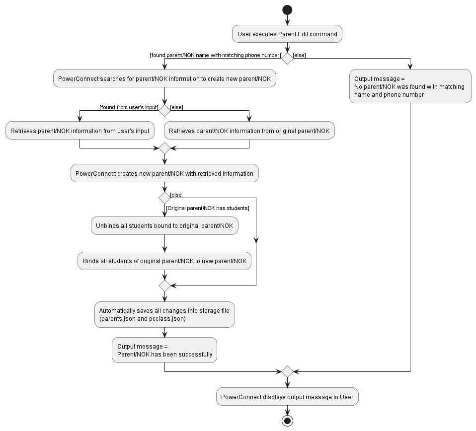

## PowerConnect Developer Guide

PowerConnect is a fully customized offline application for tuition and school teachers to manage students' and parents' administrative details. While it has limited features at this stage, plans for future PowerConnect releases to update features and usage capabilites have been made with detailed timeline.
The aim of this product is to eventually be a useful tool that is used in conjunction with Learning Managment System (LMS) tools currently in the market to aid teachers in managing students.  

PowerConnect is optimized for use via a Command Line Interface (CLI) while still having the benefits of a Graphical User Interface (GUI). PowerConnect helps teachers in tracking and updating students' particulars.

--------------------------------------------------------------------------------------------------------------------
<a name = "table-of-contents"/>

## **Table of Contents**
1. [Acknowledgements](#acknowledgements)
2. [Setting Up, Getting Started](#setting-up-getting-started)
3. [Design](#design)
   1. [Architecture](#architecture)
   2. [Ui Component](#ui-component)
   3. [Logic Component](#logic-component)
   4. [Model Component](#model-component)
   5. [Storage Component](#storage-component)
   6. [Common Classes](#common-classes)
4. [Implementation](#implementation)
   1. [Student Delete Feature](#delete-student-feature)
   2. [Attendance Feature](#attendance-feature)
   3. [Grade Feature](#grade-feature)
   4. [Parent/NOK Add Feature](#parentnok-add-feature)
   4. [Parent/NOK Edit Feature](#parentnok-edit-feature)
   5. [Binding Parent/NOK and Student](#binding-student-and-parentnok-feature)
5. [Proposed Features](#proposed-features)
   1. [Undo/redo feature](#proposed-undoredo-feature)
   2. [Data archiving](#proposed-data-archiving)
6. [Documentation, Logging, Testing, Configuration, Dev-ops](#documentation-logging-testing-configuration-dev-ops)
7. [Appendix](#appendix-requirements)
   1. [Appendix-Requirements](#appendix-requirements)
      1. [Product Scope](#product-scope)
      2. [User Stories](#user-stories)
      3. [Use Cases](#use-cases)
         1. [UC01 - Adding a new student](#use-case-uc01---adding-a-new-student-to-an-existing-class)
         2. [UC02 - Adding a grade for a student](#use-case-uc02---adding-grade-for-a-student)
         3. [UC03 - Adding a comment for a student](#use-case-uc03---adding-comment-for-a-student)
         4. [UC04 - Listing all students in a class](#use-case-uc04---listing-all-students-in-the-selected-class)
         5. [UC05 - Finding a student in a class](#use-case-uc05---finding-a-student-in-a-class)
         6. [UC06 - Deleting a student from a class](#use-case-uc06---deleting-student-from-class)
         7. [UC07 - Adding a new parent/NOK](#use-case-uc07---adding-a-new-parentnok-to-the-system)
         8. [UC08 - Editing a parent/NOK](#use-case-uc08---editing-an-existing-parentnok-in-the-system)
         9. [UC09 - Deleting a parent/NOK](#use-case-uc09---deleting-a-parentnok-from-the-system)
      4. [Non-Functional Requirements](#non-functional-requirements)
      5. [Glossary](#glossary)
   2. [Appendix-Instructions for Manual Testing](#appendix-instructions-for-manual-testing)
      1. [Launch and Shutdown](#launch-and-shutdown)
      2. [Saving data](#saving-data)

--------------------------------------------------------------------------------------------------------------------
<a name = "acknowledgements"/>

## **Acknowledgements**

* This project is based on the AddressBook-Level3 project created by the [SE-EDU initiative](https://se-education.org).

--------------------------------------------------------------------------------------------------------------------
<a name = "setting-up-getting-started"/>

## **Setting Up, Getting Started**

Refer to the guide [_Setting up and getting started_](SettingUp.md).

[Back to Table of Contents](#table-of-contents)

--------------------------------------------------------------------------------------------------------------------
<a name = "design"/>

## **Design**

:bulb: **Tip:** The `.puml` files used to create diagrams in this document can be found in the [diagrams](https://github.com/se-edu/addressbook-level3/tree/master/docs/diagrams/) folder. Refer to the [_PlantUML Tutorial_ at se-edu/guides](https://se-education.org/guides/tutorials/plantUml.html) to learn how to create and edit diagrams.

--------------------------------------------------------------------------------------------------------------------
<a name = "architecture"/>

### Architecture

The ***Architecture Diagram*** given above explains the high-level design of the App.

Given below is a quick overview of main components and how they interact with each other.

**Main components of the architecture**

**`Main`** has two classes called [`Main`](https://github.com/se-edu/addressbook-level3/tree/master/src/main/java/seedu/address/Main.java) and [`MainApp`](https://github.com/se-edu/addressbook-level3/tree/master/src/main/java/seedu/address/MainApp.java). It is responsible for,
* At app launch: Initializes the components in the correct sequence, and connects them up with each other.
* At shut down: Shuts down the components and invokes cleanup methods where necessary.

[**`Commons`**](#common-classes) represents a collection of classes used by multiple other components.

The rest of the App consists of four components.

* [**`UI`**](#ui-component): The UI of the App.
* [**`Logic`**](#logic-component): The command executor.
* [**`Model`**](#model-component): Holds the data of the App in memory.
* [**`Storage`**](#storage-component): Reads data from, and writes data to, the hard disk.

**How the architecture components interact with each other**

The *Sequence Diagram* below shows how the components interact with each other for the scenario where the user issues the command `delete 1`.

Each of the four main components (also shown in the diagram above),

* defines its *API* in an `interface` with the same name as the Component.
* implements its functionality using a concrete `{Component Name}Manager` class (which follows the corresponding API `interface` mentioned in the previous point.

For example, the `Logic` component defines its API in the `Logic.java` interface and implements its functionality using the `LogicManager.java` class which follows the `Logic` interface. Other components interact with a given component through its interface rather than the concrete class (reason: to prevent outside component's being coupled to the implementation of a component), as illustrated in the (partial) class diagram below.

The sections below give more details of each component.

[Back to Table of Contents](#table-of-contents)

--------------------------------------------------------------------------------------------------------------------
<a name = "ui-component"/>

### UI component

The **API** of this component is specified in [`Ui.java`](https://github.com/se-edu/addressbook-level3/tree/master/src/main/java/seedu/address/ui/Ui.java)

The UI consists of a `MainWindow` that is made up of parts e.g.`CommandBox`, `ResultDisplay`, `PersonListPanel`, `StatusBarFooter` etc. All these, including the `MainWindow`, inherit from the abstract `UiPart` class which captures the commonalities between classes that represent parts of the visible GUI.

The `UI` component uses the JavaFx UI framework. The layout of these UI parts are defined in matching `.fxml` files that are in the `src/main/resources/view` folder. For example, the layout of the [`MainWindow`](https://github.com/se-edu/addressbook-level3/tree/master/src/main/java/seedu/address/ui/MainWindow.java) is specified in [`MainWindow.fxml`](https://github.com/se-edu/addressbook-level3/tree/master/src/main/resources/view/MainWindow.fxml)

The `UI` component,

* executes user commands using the `Logic` component.
* listens for changes to `Model` data so that the UI can be updated with the modified data.
* keeps a reference to the `Logic` component, because the `UI` relies on the `Logic` to execute commands.
* depends on some classes in the `Model` component, as it displays `Person` object residing in the `Model`.

[Back to Table of Contents](#table-of-contents)

--------------------------------------------------------------------------------------------------------------------
<a name = "logic-component"/>

### Logic component

**API** : [`Logic.java`](https://github.com/se-edu/addressbook-level3/tree/master/src/main/java/seedu/address/logic/Logic.java)

Here's a (partial) class diagram of the `Logic` component:

How the `Logic` component works:
1. When `Logic` is called upon to execute a command, it uses the `AddressBookParser` class to parse the user command.
1. This results in a `Command` object (more precisely, an object of one of its subclasses e.g., `AddCommand`) which is executed by the `LogicManager`.
1. The command can communicate with the `Model` when it is executed (e.g. to add a person).
1. The result of the command execution is encapsulated as a `CommandResult` object which is returned back from `Logic`.

The Sequence Diagram below illustrates the interactions within the `Logic` component for the `execute("delete 1")` API call.

:information_source: **Note:** The lifeline for `DeleteCommandParser` should end at the destroy marker (X) but due to a limitation of PlantUML, the lifeline reaches the end of diagram.

Here are the other classes in `Logic` (omitted from the class diagram above) that are used for parsing a user command:

How the parsing works:
* When called upon to parse a user command, the `AddressBookParser` class creates an `XYZCommandParser` (`XYZ` is a placeholder for the specific command name e.g., `AddCommandParser`) which uses the other classes shown above to parse the user command and create a `XYZCommand` object (e.g., `AddCommand`) which the `AddressBookParser` returns back as a `Command` object.
* All `XYZCommandParser` classes (e.g., `AddCommandParser`, `DeleteCommandParser`, ...) inherit from the `Parser` interface so that they can be treated similarly where possible e.g, during testing.

[Back to Table of Contents](#table-of-contents)

--------------------------------------------------------------------------------------------------------------------
<a name = "model-component"/>

### Model component
**API** : [`Model.java`](https://github.com/se-edu/addressbook-level3/tree/master/src/main/java/seedu/address/model/Model.java)

The `Model` component,

* stores the address book data i.e., all `Person` objects (which are contained in a `UniquePersonList` object).
* stores the currently 'selected' `Person` objects (e.g., results of a search query) as a separate _filtered_ list which is exposed to outsiders as an unmodifiable `ObservableList<Person>` that can be 'observed' e.g. the UI can be bound to this list so that the UI automatically updates when the data in the list change.
* stores a `UserPref` object that represents the user’s preferences. This is exposed to the outside as a `ReadOnlyUserPref` objects.
* does not depend on any of the other three components (as the `Model` represents data entities of the domain, they should make sense on their own without depending on other components)

:information_source: **Note:** An alternative (arguably, a more OOP) model is given below. It has a `Tag` list in the `AddressBook`, which `Person` references. This allows `AddressBook` to only require one `Tag` object per unique tag, instead of each `Person` needing their own `Tag` objects. 

[Back to Table of Contents](#table-of-contents)

--------------------------------------------------------------------------------------------------------------------
<a name = "storage-component"/>

### Storage component

**API** : [`Storage.java`](https://github.com/se-edu/addressbook-level3/tree/master/src/main/java/seedu/address/storage/Storage.java)

The `Storage` component,
* can save both address book data and user preference data in json format, and read them back into corresponding objects.
* inherits from both `AddressBookStorage` and `UserPrefStorage`, which means it can be treated as either one (if only the functionality of only one is needed).
* depends on some classes in the `Model` component (because the `Storage` component's job is to save/retrieve objects that belong to the `Model`)

[Back to Table of Contents](#table-of-contents)

--------------------------------------------------------------------------------------------------------------------
<a name = "common-classes"/>

### Common classes

Classes used by multiple components are in the `seedu.addressbook.commons` package.

[Back to Table of Contents](#table-of-contents)

--------------------------------------------------------------------------------------------------------------------
<a name = "implementation"/>

## **Implementation**

This section describes some noteworthy details on how certain features are implemented.

--------------------------------------------------------------------------------------------------------------------
<a name = "delete-student-feature"/>

## Delete student feature

### Current Implementation
PowerConnect allows users to delete a student from the `UniqueStudentList` of `Class`.

When the user enters the delete student command, `MainWindow#executeCommand()` will be called. It will then call
`Logic#execute` which will return a `CommandResult`. The `execute` method is facilitated by `StudentDeleteCommand`
class. When `StudentDeleteCommand#execute` is called, it will call `deleteStudent()` method from model. This would call
`removeStudent` method from Class which in turn deletes the student from the `UniqueStudentList`.

#### General Flow for StudentDeleteCommand

The flow for StudentDeleteCommand#execute is as such:

The `StudentClass` and `IndexNumber` to be used for deleting is retrieved from the user input

The user inputs will be parsed into the `StudentCommandParser` which will then return a new `StudentDeleteCommand`

The StudentDeleteCommand will then be immediately executed to delete the student from their UniqueStudentList via class and index number

The delete success message and result list of students will then be shown back to the user via the dashboard

Full implementation sequence diagram

### Design considerations
We want to keep it simple for the user to delete students, using students' class and index number is sufficient to
identify the student that needs to be deleted.

1.Exception is thrown immediately if either student class or index number is invalid
2.Remove the student from the parent's list of children too so the necessary changes will be displayed

#### Aspect: How to delete students

* **Alternative 1 (current choice):** Having a studentList for each class
    * Pros: When deleting students, we do not have to go through all the students stored, improving its time complexity
    * Pros: More flexible to add more class related features
    * Pros: Displayed list of students will be neater
    * Cons: Difficult to manage
    * Cons: Harder to implement
    * Cons: Uses more memory
    * Cons: Harder to access and manipulate student data

* **Alternative 2:** Allowing the users to delete a particular field of the student
    * Pros: More flexibility for users
    * Cons: Hard to implement, need to check the different prefixes to determine which field to delete

[Back to Table of Contents](#table-of-contents)

--------------------------------------------------------------------------------------------------------------------
<a name = "attendance-feature"/>

## Attendance feature

### Current Implementation

The attendance feature is facilitated by `Attendance`. It is composed by a `Person` with an `Attendance` object.

Given below is an example usage scenario and how the attendance mechanism behaves at each step

Step 1. The user launches the application for the first time
Step 2. The user creates a student using the Add command. The `Attendance` of `Students` will be initialized with the initial attendance state (F) indicating that the student is absent.

[//]: # (![Student Add Command]&#40;images/StudentAddCommand.png&#41;)
Step 3. The user wants to mark a particular student as present. The user executes the `Attendance` command with the index of the student and att/T. The `Attendance` of the student will be updated to the current date.

Step 4. The attendance is saved to the storage file automatically after each command. Attendance is saved as the string representation of LocalDate in JsonAdaptedAttendance.

Full implementation sequence diagram

### Design considerations
We want to make it easy for the user to set current date as present. Thus we allowed the user to set attendance as T which will automatically register as present today

#### Aspect: How to store attendance

* **Alternative 1 (current choice):** Store attendance as a JsonAdaptedAttendance object that records the string representation of LocalDate
    * Pros: Easy to access and manipulate attendance data
    * Pros: Easy to read and write to storage
    * Pros: Flexible to add more features if more features are added eg. mark as MC, Late..
    * Cons: Hard to implement

* **Alternative 2:** Store attendance as a string representation of LocalDate
    * Pros: Easy to implement
    * Pros: Use less memory
    * Cons: Hard to access and manipulate attendance data
    * Cons: Hard to read and write to storage
    * Cons: Hard to add more features if more features are added eg. mark as MC, Late..
  

[Back to Table of Contents](#table-of-contents)

--------------------------------------------------------------------------------------------------------------------
<a name = "grade-feature"/>

## Grade feature

### Current Implementation

The grade feature is facilitated by `grade`. It is composed by a `Student` with an `Assignment` object.

Given below is an example usage scenario and how the attendance mechanism behaves at each step

Step 1. The user launches the application for the first time
Step 2. The user creates a student using the Add command. The `Test` and `Homework` which extends `Assignment` of `Students` will be initialized with the initial name: Insert student test/homework here!, Score: -100, Weightage: -100, Deadline: No Deadline and Is Done(Homework): false.

[//]: # (![Student Add Command]&#40;images/StudentAddCommand.png&#41;)
Step 3. The user wants to add a test to a student. The user executes the `grade` command with the index of the student and test/TEST_NAME. The `test` of the student will be updated to the name.

Step 4. The test/homework is saved to the storage file automatically after each command.

Full implementation sequence diagram

### Design considerations
We want to make it easy for the user to set tests without inputting all the details at one go, with the test/homework name being the only field compulsory.

#### Aspect: How to store test

* **Alternative 1 (current choice):** Store test as a JsonAdaptedTest object
    * Pros: Easy to access and manipulate attendance data
    * Pros: Easy to read and write to storage
    * Pros: Flexible to add more features if more features are added
    * Cons: Hard to implement

* **Alternative 2:** Store attendance as a string representation of Test details
    * Pros: Easy to implement
    * Pros: Use less memory
    * Cons: Hard to access and manipulate attendance data
    * Cons: Hard to read and write to storage
    * Cons: Hard to add more features if more features are added
  

[Back to Table of Contents](#table-of-contents)

--------------------------------------------------------------------------------------------------------------------
<a name = "parentnok-add-feature"/>

## Parent/NOK Add Feature

### Current Implementation
The add feature for parent/NOK is facilitated by `parent add`.

Given below are example usage scenarios and how the add mechanism behaves at each step.  
Scenario 1:
1. User launches the application.
2. User wants to add a new `Parent / NOK`.
3. User keys in the parent add command to add a new `Parent / NOK` to PowerConnect.
4. PowerConnect creates a new `Parent / NOK` and automatically saves its data into its storage file (parents.json).

Scenario 2:
1. As user executes the `Student Add` command, PowerConnect cannot locate the `Parent / NOK` to bind to the `Student`.
2. PowerConnect hence **AUTOMATICALLY** creates a new `Parent / NOK`.
3. PowerConnect retrieves the information required for `Parent Add` command from `Student Add` command.
4. PowerConnect automatically saves all changes into its storage files (parents.json & pcclass.json).   

**Activity Diagram**

**Full implementation sequence diagram**

**Reference to get parent particulars sequence diagram**

### Design considerations
We want to make it simple for users to add a new `Parent / NOK` to PowerConnect without having the need to include students attached to him/her.   
We also want to have a centralized way and adopt defensive coding practices for binding of `Student` and `Parent / NOK`.   
Furthermore, we do not want to trouble users by forcing them to have **ALL** particulars of a `Parent / NOK`. Hence, we made the command such that it **ONLY** requires minimal information from users:  
1. Parent's / NOK's `Name`
2. Parent's / NOK's `Phone number`   

#### Aspect: How Parent Add executes
* **Alternative 1 (current choice):** Users provide **COMPULSORY** details about the parent / NOK only + binding of student and parent / NOK is done at `Student` side **ONLY**
    * Pro: Defensive coding is applied, reducing chances of bugs
    * Pro: Users are **NOT FORCED** to come up with arbitrary values to fill up **OPTIONAL** details for the parent / NOK to create a new `Parent / NOK`.
    * Con: Hard to implement
* **Alternative 2:** Users provide **ALL** particulars of the `Parent / NOK` + binding of student and parent / NOK is done at `Student` side **ONLY**
    * Pro: Slightly easier to implement as compared to Alternative 1
    * Pro: Defensive coding is applied, reducing chances of bugs
    * Con: Users are **FORCED** to come up with arbitrary values to fill up any missing values for **OPTIONAL** section.
* **Alternative 3:** Users provide **ALL** particulars of the `Parent / NOK` + binding of student and parent / NOK are done at **BOTH** `Student` and `Parent / NOK`
    * Pro: Slightly easier to implement as compared to Alternative 2
    * Con: Defensive coding is **NOT** applied, increasing chances of bugs
    * Con: Users are **FORCED** to come up with arbitrary values to fill up any missing values for **OPTIONAL** section.
    * Con: Need to test the feature exhaustively / create sufficient automated tests to ensure `Students` and `Parents / NOKs` are properly bound together.

[Back to Table of Contents](#table-of-contents)

--------------------------------------------------------------------------------------------------------------------
<a name = "parentnok-edit-feature"/>

## Parent/NOK Edit Feature

### Current Implementation
The edit feature for parent / NOK is facilitated by `parent edit`.  

Given below is an example usage scenario and how the edit mechanism behaves at each step.
 
1. User launches the application for the first time.  
2. User creates a new `Parent` using ***Parent Add Command*** or gets a new `Parent` created by PowerConnect while executing the ***Student Add Command***.  
3. During creation of `Parent`, User encountered one of the two scenarios and requires to edit the `Parent`:
   1. Did not include certain particulars of the `Parent`.
   2. Keyed in wrong particulars for the `Parent`.
4. User wants to edit the `Parent` particulars and hence executes the `parent edit` command with the `Name` and `Phone Number` of the corresponding `Parent` and the `Particulars` to be edited. 
   Example of parent edit command: `"parent edit n/Tan Ah Niu pnP/91234567 npnP/65656565"`  
5. Edited `Parent` is saved to the storage file automatically after the command.   

**Activity Diagram**

**Full implementation sequence diagram**

**Reference to get parent particulars sequence diagram**

### Design considerations
We want to make it easy for users to edit `Parent / NOK` particulars without manually deleting the `Parent / NOK` and creating a new `Parent / NOK` and reassigning each `Student` attached to original `Parent / NOK` with the new `Parent / NOK`.
  
We also do not want to trouble user with inputting multiple **PREFIXES** to edit `Parent / NOK`. Hence, users only need to input ***PREFIXES*** belonging to the edited information and the following:
1. Parent's / NOK's `Name`
2. Parent's / NOK's `Phone Number`
3. Particulars that are being amended  

#### Aspect: How Parent Edit executes
* **Alternative 1 (current choice):** Run the command with `parent edit n/<NAME> pnP/<PARENT_PHONE_NUMBER>` + PREFIXES and details of information that are being changed
    * Pro: Easy to use
    * Pro: Minimal input by user to edit `Parent / NOK` particulars
    * Con: Slightly harder than Alternative 2 to implement
    * Con: Need to test the ***Parent Edit Command*** exhaustively / come up with automated tests to ensure when creating the new `Parent / NOK`, system takes input from original `Parent / NOK` for particulars that are not amended.
* **Alternative 2:** User provides **ALL** particulars of the `Parent / NOK` to be edited even if **SOME** of the particulars are the **SAME** as original. From these details, system will create a new `Parent / NOK` and replace the original copy of `Parent / NOK` with it.
    * Pro: Easy to implement
    * Pro: Makes use of existing features **Parent Add** and **Parent Delete**
    * Con: Troublesome for the user as there is a need to input **ALL** particulars of a `Parent / NOK` even if he/she is just amending one of the particulars of the `Parent / NOK`.
    * Con: It may cause regressions, user may key in wrong details for some of the `Parent / NOK` particulars as he/she is keying in the command. This will cause much inconvenience for Users especially when the `Parent / NOK` they are amending has **TONS** of information.
    * Con: It is no longer **FAST** and **EASY** for the user to use.

[Back to Table of Contents](#table-of-contents)

--------------------------------------------------------------------------------------------------------------------
<a name = "binding-student-and-parentnok-feature"/>

## Binding Student and Parent/NOK Feature

### Current Implementation
The binding feature is created with the consideration of defensive coding in mind. It is executed by PowerConnect when the following commands are executed: `Student Add`, `Student Edit`, `Student Delete`, `Parent Edit` commands.

Given below is an example usage scenario and how the edit mechanism behaves at each step.
 
1. User executes `Student Edit` command and decides to change the parent's/NOK's `Name`.
2. As PowerConnect executes the `Student Edit` command, PowerConnect will also retrieve the corresponding `parent/NOK` and perform similar behaviors to `Parent Edit` command to update the `parent/NOK` info in PowerConnect's database.
3. PowerConnect will also perform similar behaviors of `Student Edit` command to edit the `parent/NOK` information for all `Students` that are bound to the `Parent/NOK`.

### Design considerations
We wanted to adopt defensive coding for this feature to reduce any unwanted bugs. It is also complex when determining which party (students or parents/NOKs) should be the one performing the binding and unbinding and whether to allow both parties to perform.

#### Aspect: How Parent Edit executes
* **Alternative 1 (current choice):** Perform the binding and unbinding **MAINLY** on the `Student` end as the main concern of this binding is to allow users to know the parent/NOK of a particular student.
    * Pro: Logical and solves the issue of pairing `students` and `parents/NOKs`.
    * Pro: Defensive coding used.
    * Pro: Less likely to cause bugs as compared to other Alternatives.
    * Con: Difficult to implement.
* **Alternative 2:** Perform the binding and unbinding on the `Parent/NOK` end when commands pertaining to `Parents/NOKs` are executed.
    * Pro: Less information required for `Student Add` command.
    * Con: More information required for `Parent Add` command, resulting in requiring a long input from users.
    * Con: Troublesome for users.
    * Con: More likely to cause bugs as compared to Alternative 1.
    * Con: Difficult to implement.
* **Alternative 3:** Perform the binding and unbinding at **BOTH** `Student` and `Parent/NOK` commands.
    * Pro: Easy to implement.
    * Con: Most likely to cause bugs among the Alternatives.
    * Con: Did not adopt Defensive Coding.
    * Con: Requires exhaustive testing and automated tests to reduce bugs.

[Back to Table of Contents](#table-of-contents)

--------------------------------------------------------------------------------------------------------------------
<a name = "proposed-features"/>

## Proposed Features

<a name = "proposed-undoredo-feature"/>

### \[Proposed\] Undo/redo feature

#### Proposed Implementation

The proposed undo/redo mechanism is facilitated by `VersionedAddressBook`. It extends `AddressBook` with an undo/redo history, stored internally as an `addressBookStateList` and `currentStatePointer`. Additionally, it implements the following operations:

* `VersionedAddressBook#commit()` — Saves the current address book state in its history.
* `VersionedAddressBook#undo()` — Restores the previous address book state from its history.
* `VersionedAddressBook#redo()` — Restores a previously undone address book state from its history.

These operations are exposed in the `Model` interface as `Model#commitAddressBook()`, `Model#undoAddressBook()` and `Model#redoAddressBook()` respectively.

Given below is an example usage scenario and how the undo/redo mechanism behaves at each step.

Step 1. The user launches the application for the first time. The `VersionedAddressBook` will be initialized with the initial address book state, and the `currentStatePointer` pointing to that single address book state.

Step 2. The user executes `delete 5` command to delete the 5th person in the address book. The `delete` command calls `Model#commitAddressBook()`, causing the modified state of the address book after the `delete 5` command executes to be saved in the `addressBookStateList`, and the `currentStatePointer` is shifted to the newly inserted address book state.

Step 3. The user executes `add n/David …​` to add a new person. The `add` command also calls `Model#commitAddressBook()`, causing another modified address book state to be saved into the `addressBookStateList`.

:information_source: **Note:** If a command fails its execution, it will not call `Model#commitAddressBook()`, so the address book state will not be saved into the `addressBookStateList`.

Step 4. The user now decides that adding the person was a mistake, and decides to undo that action by executing the `undo` command. The `undo` command will call `Model#undoAddressBook()`, which will shift the `currentStatePointer` once to the left, pointing it to the previous address book state, and restores the address book to that state.

:information_source: **Note:** If the `currentStatePointer` is at index 0, pointing to the initial AddressBook state, then there are no previous AddressBook states to restore. The `undo` command uses `Model#canUndoAddressBook()` to check if this is the case. If so, it will return an error to the user rather
than attempting to perform the undo.

The following sequence diagram shows how the undo operation works:

:information_source: **Note:** The lifeline for `UndoCommand` should end at the destroy marker (X) but due to a limitation of PlantUML, the lifeline reaches the end of diagram.

The `redo` command does the opposite — it calls `Model#redoAddressBook()`, which shifts the `currentStatePointer` once to the right, pointing to the previously undone state, and restores the address book to that state.

:information_source: **Note:** If the `currentStatePointer` is at index `addressBookStateList.size() - 1`, pointing to the latest address book state, then there are no undone AddressBook states to restore. The `redo` command uses `Model#canRedoAddressBook()` to check if this is the case. If so, it will return an error to the user rather than attempting to perform the redo.

Step 5. The user then decides to execute the command `list`. Commands that do not modify the address book, such as `list`, will usually not call `Model#commitAddressBook()`, `Model#undoAddressBook()` or `Model#redoAddressBook()`. Thus, the `addressBookStateList` remains unchanged.

Step 6. The user executes `clear`, which calls `Model#commitAddressBook()`. Since the `currentStatePointer` is not pointing at the end of the `addressBookStateList`, all address book states after the `currentStatePointer` will be purged. Reason: It no longer makes sense to redo the `add n/David …​` command. This is the behavior that most modern desktop applications follow.

The following activity diagram summarizes what happens when a user executes a new command:

#### Design considerations:

**Aspect: How undo & redo executes:**

* **Alternative 1 (current choice):** Saves the entire address book.
    * Pros: Easy to implement.
    * Cons: May have performance issues in terms of memory usage.

* **Alternative 2:** Individual command knows how to undo/redo by
  itself.
    * Pros: Will use less memory (e.g. for `delete`, just save the person being deleted).
    * Cons: We must ensure that the implementation of each individual command are correct.

_{more aspects and alternatives to be added}_

[Back to Table of Contents](#table-of-contents)

--------------------------------------------------------------------------------------------------------------------
<a name = "proposed-data-archiving"/>

### \[Proposed\] Data archiving

_{Explain here how the data archiving feature will be implemented}_

[Back to Table of Contents](#table-of-contents)

--------------------------------------------------------------------------------------------------------------------
<a name = "documentation-logging-testing-configuration-dev-ops"/>

## **Documentation, Logging, Testing, Configuration, Dev-ops**

* [Documentation guide](Documentation.md)
* [Testing guide](Testing.md)
* [Logging guide](Logging.md)
* [Configuration guide](Configuration.md)
* [DevOps guide](DevOps.md)

[Back to Table of Contents](#table-of-contents)

--------------------------------------------------------------------------------------------------------------------
<a name = "appendix-requirements"/>

## **Appendix: Requirements**

<a name = "product-scope"/>

### Product Scope

**Target user profile**:

* This product mainly targets tuition teachers and in the future, secondary school teachers that prefer CLI over GUI,  manage large groups of students and require ease of access to students' information.

**Value proposition**:  
Provides teachers with the ability to manage students administration and academics efficiently by operating on CLI, to complement existing LMS.
* Our product uses CLI instead of GUI
* Simple application for teachers to keep track of many students in different classes / co-curricular activities (CCAs) that have different phone numbers
* Our application can be used individually without internet connection (currently supports single user usage ONLY)
* Helps to keep track of students’ parents / next-of-kins’ contact information for emergency purposes
* Teachers may not be able to match students names and faces well and so this app serves as an easy way to identify students (since there are too many students)
* Streamline administration processes because there’s plenty of students’ information to keep track of (eg. attendance, assignments, grades, contact details)

[Back to Table of Contents](#table-of-contents)

--------------------------------------------------------------------------------------------------------------------
<a name = "user-stories"/>

### User Stories

| No  | As a...                     | I can...                                                                    | So that...                                                                                                                                 | Notes                                                                                                                                     | Priority |
|-----|-----------------------------|-----------------------------------------------------------------------------|--------------------------------------------------------------------------------------------------------------------------------------------|-------------------------------------------------------------------------------------------------------------------------------------------|----------|
| 1   | Teacher                     | Record student’s attendance                                                 | I know that my student is present in class (in school).                                                                                    |                                                                                                                                           | High     |
| 2   | Teacher                     | Record students’ assessment and test grades.                                | I am able to manage my students’ performance                                                                                               |                                                                                                                                           | High     |
| 3   | Teacher                     | Have an efficient way to view and track my students’ attendance.            | I will have an easier time managing my students’ attendance over the year                                                                  |                                                                                                                                           | High     |
| 4   | Teacher                     | Have the option to leave some details empty                                 | I am able to key in my students’ information when there’s missing information                                                              |                                                                                                                                           | High     |
| 5   | Teacher                     | Document students’ progress                                                 | I am able to record easily the students’ performance                                                                                       |                                                                                                                                           | High     |
| 6   | Teacher                     | Organise my students by class                                               | I am able to identify which class they belong to                                                                                           | Determine whether to create separate classes: “class” class and “student” class or merge                                                  | High     |
| 7   | Non tech-savvy teacher      | Learn about new commands                                                    | I am able to use the application effectively and save unnecessary time and effort in recording students’ particulars and searching for it. | Provide User Guide that is easy to understand                                                                                             | High     |
| 8   | Teacher                     | Recognise my students from different classes through their photos           | I am able to recognise my students' looks                                                                                                  | Long setup process for user as they need to manually input images for individual student

 Keeping separate file / folder for images | Medium   |
| 9   | Caring Teacher              | Provide comments for each student                                           | I am able to keep track of students who need meaningful feedback and support.                                                              | (comments section on each student)                                                                                                        | Medium   |
| 10  | Teacher / teacher assistant | Have an efficient way to retrieve my students’ contact details.             | I am able to contact them easily                                                                                                           | Assumption: student details are known to teachers / TAs                                                                                   | Medium   |
| 11  | Teacher                     | Keep track of students who have submitted assignment                        | I am aware of which student missed the deadline for their work                                                                             |                                                                                                                                           | Medium   |
| 12  | Motivational teacher        | Sort my students by overall grades                                          | I am able to foster a positive and supportive learning environment                                                                         |                                                                                                                                           | Medium   |
| 13  | Teacher                     | Use an application that is easy to navigate about and has a nice interface. | I am able to save unnecessary time and effort in recording students’ particulars and searching for it.                                     | Issue under designs                                                                                                                       | Low      |
| 14  | Responsible Teacher         | Access student records, such as grades and attendance                       | I will be able to make informed decisions about student progress                                                                           | Summary of all students grades for a particular test / class                                                                              | Low      |
| 15  | Busy teacher                | Have a todo list                                                            | I am able to keep track of what to do                                                                                                      |                                                                                                                                           | Low / NA |
| 16  | Teacher                     | Use an application with a reminder system                                   | I am able to track the things that needs to be done                                                                                        |                                                                                                                                           | NA       |
| 17  | Teacher                     | Efficiently and effectively assign assessments and assignments              | I am able to better assess my students’ learning and progress                                                                              |                                                                                                                                           | NA       |
| 18  | Teacher                     | Managing students’ behaviours and actions                                   | I am able to promote a safe and productive learning space for all                                                                          |                                                                                                                                           | NA       |
| 19  | Teacher                     | Add individual feedback to students                                         | I am able to provide feedback to parents/guardians effectively                                                                             | Duplicate point to Point 7                                                                                                                | NA       |
| 20  | Teacher                     | Access my students contacts conveniently                                    | I am able to build a closer relationship with my students and their next of kin                                                            | Too vague                                                                                                                                 | NA       |
| 21  | Busy Teacher                | Keep track of my teaching feedback                                          | I can keep improving my teaching practices                                                                                                 | Hard to get school admin team on board                                                                                                    | NA       |
| 22  | Efficient Teacher           | Integrate technology into my teaching                                       | I am able to enrich my student learning                                                                                                    | Vague                                                                                                                                     | NA       |
| 23  | Teacher assistant           | Retrieve my students contact                                                | I am able to look them up easily                                                                                                           | Duplicate Point to Point 10                                                                                                               | NA       |
| 24  | Teacher                     | Track the date and time of my classes                                       | I will be able to reach my classes on time                                                                                                 |                                                                                                                                           | NA       |
| 25  | Forgetful teacher           | Record attendance                                                           | I am able to keep track of my students                                                                                                     | Duplicate to Point 5                                                                                                                      | NA       |
| 26  | Teacher                     | Identify weaker students                                                    | I can give them more attention in class                                                                                                    | Duplicate to Point 20                                                                                                                     | NA       |
| 27  | Teacher                     | Manage my consultation timings                                              | I am able to organise my schedule                                                                                                          |                                                                                                                                           | NA       |
| 28  | Teacher                     | Set reminders for my consultation timings                                   | I am able to ensure I am not late for consultations                                                                                        |                                                                                                                                           | NA       |
| 29  | Teacher                     | Marks my students’ assignments automatically                                | I am able to use time and effort spent on it on other use, such as thinking of ways to improve my students’ learning                       | Difficult to implement Autograder                                                                                                         | NA       |
| 30  | Teacher                     | Have an application that is used as CLI instead of GUI                      | I am able to make use of my fast typing speed to sort out all the administrative work                                                      | Too Vague                                                                                                                                 | NA       |
| 31  | Busy Teacher                | Easily manage my schedule                                                   | I am able to spend more time on other things                                                                                               | Out of scope                                                                                                                              | NA       |
| 32  | Busy Teacher                | Know which tasks to prioritise                                              | I am able to ensure all of my responsibilities are taken care of in a timely and efficient manner.                                         |                                                                                                                                           | NA       |
| 33  | Teacher                     | Track the date and time of the classes that I have                          | I am able to reach on time and teach the correct module for the particular lesson slot.                                                    | Out of scope                                                                                                                              | NA       |
| 34  | Teacher                     | Amend date and time of certain lesson timings                               | I am able to change lesson dates and timings easily when lessons shift                                                                     |                                                                                                                                           | NA       |

[Back to Table of Contents](#table-of-contents)

--------------------------------------------------------------------------------------------------------------------
<a name = "use-cases"/>

### Use Cases

***For all use cases below, the System is PowerConnect and the Actor is the teacher, unless specified otherwise.***

<a name = "use-case-uc01---adding-a-new-student-to-an-existing-class"/>

#### Use Case: UC01 - Adding a new `student` to an existing `class`.

**Preconditions:** User knows the `index number` for the `student` and the `class` the student belongs to has already been created.

**MSS:**
1. User keys in **ALL COMPULSORY** details and any other **OPTIONAL** details for student’s particulars.
2. System creates and adds student to respective `class` and indicates success.
   System creates and binds `parent` to the student if parent does not exist.  

**Extensions:**

+ 1a. User did not enter **ALL COMPULSORY** details.
    + 1a1. System displays an error message to the user indicating that there is insufficient information given to create the new `student` and provides an example of what to include.  
      Use case ends.   
+ 1b. User keys in invalid **COMPULSORY** or **OPTIONAL** information.
    + 1b1. User keys in invalid `SEX` type not supported by system. (m/f/M/F)
    + 1b2. User keys in `age` or `phone number` that are not of an integer.
    + 1b3. User keys in invalid path to `image`.
    + 1b4. System displays an error message to the user indicating that he/she has keyed in wrong information for the `student` along with a sample of the correct way to key in information for a new `student`.  
      Use case ends.   
+ 2a. User is trying to create a new `student` whose index number belongs to an existing `student` in the class.
    + 2a1. System displays an error message to the user indicating that a student with the same index number already exists in the class.  
      Use case ends.  
+ 2b. Parent already exists.
    + 2b1. System locates and binds the parent to the student.  
      Use case ends.  

[Back to Table of Contents](#table-of-contents)

--------------------------------------------------------------------------------------------------------------------
<a name = "use-case-uc02---adding-grade-for-a-student"/>

#### Use Case: UC02 - Adding `grade` for a `student`.

**Preconditions:** User knows `index number` and `class` of the `student` he/she wishes add `grade` for.

**MSS:**
1. User keys in the `test` name, `class`, `index number` of student and corresponding `grade`.
2. System displays feedback to the user that grade has been successfully added for the student.  
   Use case ends.

**Extensions:**

+ 1a. User keyed in an invalid `index number` or `class`.
    + 1a1. System displays an error message indicating the student does not exist.
    + 1a2. User checks for the index number and class of the student via the student list displayed on the application and keys in the correct value. 
      Use case ends.  
+ 1b. Test name is duplicate.
    + 1b1. System displays an error message indicating duplicated test name.
    + 1b2. User adds a new test name.
    + Use case resumes at step 2.  
+ 1c. User gave a `Grade` value that is not of an integer.
    + 1c1. System displays an error message indicating the wrong grade given.
    + 1c2. User checks and adds the grade input again.  
      Use case resumes at step 2.  

[Back to Table of Contents](#table-of-contents)

--------------------------------------------------------------------------------------------------------------------
<a name = "use-case-uc03---adding-comment-for-a-student"/>

#### Use Case: UC03 - Adding `comment` for a `student`.

**Preconditions:** User knows `index number` and `class` of the `student` he/she wishes to add `comment`.

**MSS:** Similar to UC02
1. User keys in the `index number` and `class` of student and the corresponding `comment` for the student.
2. System adds the comment for the student and indicates success.  
   Use case ends.

**Extensions:** Similar to UC02

+ 1a. User keyed in invalid `index number` or `class`.
    + 1a1. System displays an error message indicating the student does not exist.
    + 1a2. User checks for the index number and class of the student via the student list displayed on the application and keys in the correct value. 
      Use case ends.   

+ 2a. There is an existing comment for the student.
    + 2a1. System overrides the existing comment with the new comment.  
      Use case ends.   

[Back to Table of Contents](#table-of-contents)

--------------------------------------------------------------------------------------------------------------------
<a name = "use-case-uc04---listing-all-students-in-the-selected-class"/>

#### Use Case: UC04 - Listing all `students` in the selected `class`.

**MSS:**
1. User keys in the command to view the list of all `students` in the selected `class`.
2. System displays all `students` particulars in the `class`. 
   Use case ends.

**Extensions:** 
+ 1a. User keys in an invalid `class`.
    + 1a1. System displays an error message to the user informing him/her the `class` is invalid. 
      Use case ends.  
+ 2a. Selected `class` does not have any `students`.
    + 2a1. System displays an empty list. 
      Use case ends.  

[Back to Table of Contents](#table-of-contents)

--------------------------------------------------------------------------------------------------------------------
<a name = "use-case-uc05---finding-a-student-in-a-class"/>

#### Use Case: UC05 - Finding a `student` in a class.

**Preconditions:** User knows the `class` of the `student` he/she wishes to locate.

**MSS:**
1. User keys in a section of student’s name (eg Mary Goh - `Mary`) along with the `class` where the user wishes to find from.
2. System finds matching students and displays it to user. 
   Use case ends.

**Extensions:**
+ 1a. User did not enter **ALL COMPULSORY** details.
    + 1a1. System displays an error message to the user indicating that there is insufficient information given to create the new `student` and provides an example of what to include.  
      Use case ends.   
+ 2a. Student does not exist in the specified `class`.
    + 2a1. System displays an empty list. 
      Use case ends.   

[Back to Table of Contents](#table-of-contents)

--------------------------------------------------------------------------------------------------------------------
<a name = "use-case-uc06---deleting-student-from-class"/>

#### Use Case: UC06 - Deleting `student` from class.

**Preconditions**: User knows the `index number` for the `student` and the `class` the student belongs to has already been created.

**MSS:**
1. User keys in the student `index number` and `class`.
2. System deletes the student from that class and indicates success. 
   Use case ends.

**Extensions:**
+ 1a. User keyed in invalid `index number` or `class`.
    + 1a1. System displays an error message indicating the student does not exist.
    + 1a2. User checks for the index number and class of the student via the student list displayed on the application and keys in the correct value. 
      Use case ends.

[Back to Table of Contents](#table-of-contents)

--------------------------------------------------------------------------------------------------------------------
<a name = "use-case-uc07---adding-a-new-parentnok-to-the-system"/>

#### Use Case: UC07 - Adding a new `parent/NOK` to the system.

**MSS:** Similar to UC01
1. User keys in **ALL COMPULSORY** details and any other **OPTIONAL** details for parent’s / NOK's particulars
2. System creates parent/NOK and adds its data into system's storage and indicates success to user.  
   Use case ends.

**Extensions:**

+ 1a. User did not enter **ALL COMPULSORY** details.
    + 1a1. System displays an error message to the user indicating that there is insufficient information given to create the new `parent/NOK` and provides an example of what to include.  
      Use case ends.   
+ 1b. User keys in invalid **COMPULSORY** or **OPTIONAL** information.
    + 1b1. User keys in invalid `SEX` type not supported by system. (m/f/M/F)
    + 1b2. User keys in `age` or `phone number` that are not of an integer.
    + 1b3. User keys in invalid path to `image`.
    + 1b4. System displays an error message to the user indicating that he/she has keyed in wrong information for the `parent/NOK` along with a sample of the correct way to key in information for a new `parent/NOK`.  
      Use case ends.   
+ 2a. User is trying to create a new `parent/NOK` whose `phone number` belongs to an existing `parent/NOK` in the system.
    + 2a1. System displays an error message to the user indicating that a `parent/NOK` with the same `phone number` already exists in the system.  
      Use case ends.  

[Back to Table of Contents](#table-of-contents)

--------------------------------------------------------------------------------------------------------------------
<a name = "use-case-uc08---editing-an-existing-parentnok-in-the-system"/>

#### Use Case: UC08 - Editing an existing `parent/NOK` in the system.

**MSS:**
1. User keys in parent’s / NOK's name and phone number along with the details that are being amended.
2. System retrieves the original parent/NOK, creates a **NEW** parent/NOK with the amended details and original particulars. At the same time, system will automatically unbind and bind all students bound to **ORIGINAL** parent/NOK and bind them accordingly to the **NEW** parent/NOK.
3. System replaces the ***original*** parent/NOK with the ***new*** parent/NOK.
4. System proceeds to indicate success to user.  
   Use case ends.

**Extensions:**
+ 1a. User keyed in invalid `phone number` or `name` of the parent/NOK to be edited.
    + 1a1. System displays an error message indicating the parent does not exist.
    + 1a2. User checks for the `phone number` and `name` of the parent/NOK via the parent/NOK list displayed on the application and keys in the correct value. 
      Use case ends.

+ 1b. User keys in invalid **COMPULSORY** or **OPTIONAL** information.
    + 1b1. User keys in invalid `SEX` type not supported by system. (m/f/M/F)
    + 1b2. User keys in `age` or `phone number` that are not of an integer.
    + 1b3. User keys in invalid path to `image`.
    + 1b4. System displays an error message to the user indicating that he/she has keyed in wrong information for the `parent/NOK` along with a sample of the correct way to key in information for a new `parent/NOK`.  
      Use case ends.   
+ 2a. User is trying to edit the `parent's/NOK's` `phone number` to an existing `parent/NOK` in the system.
    + 2a1. System displays an error message to the user indicating that a `parent/NOK` with the same `phone number` already exists in the system.  
      Use case ends.  

[Back to Table of Contents](#table-of-contents)

--------------------------------------------------------------------------------------------------------------------
<a name = "use-case-uc09---deleting-a-parentnok-from-the-system"/>

#### Use Case: UC09 - Deleting a `parent/NOK` from the system.

**MSS:**
1. User keys in parent’s / NOK's `name` and `phone number`.
2. System locates the parent / NOK with matching `name` and `phone number` and removes him/her from the system.
3. System proceeds to indicate success to user along with deleted `parent/NOK` details.  
   Use case ends.

**Extensions:**
+ 1a. User keyed in invalid `phone number` or `name` of the parent/NOK to be delete.
    + 1a1. System displays an error message indicating the parent does not exist.
    + 1a2. User checks for the `phone number` and `name` of the parent/NOK via the parent/NOK list displayed on the application and keys in the correct value. 
      Use case ends.

+ 2a. User is trying to delete a `parent/NOK` that currently has students attached.
    + 2a1. System displays an error message to the user indicating that the `parent/NOK` currently has students attached to him/her and hence **CANNOT** be removed from the system.  
      Use case ends.  

*{More to be added}*   

[Back to Table of Contents](#table-of-contents)

--------------------------------------------------------------------------------------------------------------------
<a name = "non-functional-requirements"/>

## Non-Functional Requirements

1. Should work on any mainstream OS as long as it has Java `11` or above installed.
2. Should be able to handle up to 400 students without a noticeable sluggishness in performance for typical usage.
3. Should package it as a JAR file that is smaller than 50mb
4. Should store data in a txt/csv file
5. PowerConnect should be able to work without any internet access.
6. PowerConnect should only be used by a single user per installation and not by multiple users.
7. Users with above average typing speed for regular English text (i.e. not code, not system admin commands) should be
   able to accomplish the majority of the tasks faster using CLI commands than using the mouse.
8. PowerConnect should be able to handle all user input errors gracefully.
9. PowerConnect should be able to display all error messages in a user-friendly manner.
10. PowerConnect should be able to run on a 32-bit system with 8GB of RAM.
11. PowerConnect should be able to display all success messages within 1 second.

*{More to be added}*   

[Back to Table of Contents](#table-of-contents)

--------------------------------------------------------------------------------------------------------------------
<a name = "glossary"/>

## Glossary

**Attributes**: Information of a student / parent.  
For example, name, phone number, email address etc   
**CCA**: Co-curricular activities   
**CLI**: Command Line Interface   
**Hard disk**: Non-volatile data storage device, your OS's storage in short   
**LMS**: Learning Management System, application used by schools to provide students a platform to access their lessons materials online.  
Examples of LMS: Canvas, LumiNUS, Blackboard, Google Classroom, Quizlet   
**NOK**: Refers to Next-of-Kin, could be either blood related or a guardian   
**OS**: Operating Systems  
Examples of OS: Windows, Linux, Unix, OS-X   
**Parameters**: The actual information of a student/parent
For example, Tan Ah Kow, 91234567 etc.

*{More to be added}*

[Back to Table of Contents](#table-of-contents)

--------------------------------------------------------------------------------------------------------------------
<a name = "appendix-instructions-for-manual-testing"/>

## **Appendix: Instructions for manual testing**

Given below are instructions to test the app manually.

:information_source: **Note:** These instructions only provide a starting point for testers to work on;
testers are expected to do more *exploratory* testing.

<a name = "launch-and-shutdown"/>

### Launch and shutdown

1. Initial launch
   1. Ensure you have Java `11` or above installed in your Computer.
   2. Download the latest `PowerConnect.jar` from [here](https://github.com/AY2223S2-CS2103T-T09-1/tp/releases).
   3. Copy the file to the folder you want to use as the _home folder_ for PowerConnect.
   4. In the same folder, create a new folder named “image” and store all images to be used for the program in this folder. eg student image and parent image. For the student image, it should be named `<STUDENT_NAME><CLASS><INDEX NUMBER>.png`. For the parent image, it should be named `<PARENT_NAME>.png`.
   5. Double click the jar file.
        **OR**  
      Open a command terminal, `cd` into the folder you put the jar file in, and use the `java -jar PowerConnect.jar` command to run the application.
   6. A GUI similar to the below should appear in a few seconds. Note how the app contains some sample data. The window size may not be optimum. 
      
     

2. Saving window preferences
   1. Resize the window to an optimum size. Move the window to a different location. Close the window.
   2. Re-launch the app by double-clicking the jar file. 
      Expected: The most recent window size and location is retained.   

3. Shutdown of Application
   1. Run the `exit` command: `exit` or press the `X` button located at the top right corner of the application.
   2. The application should close within 3 seconds.

:bulb: **Tip:** In the case, PowerConnect does not boot up with a similar UI display as the image above or PowerConnect is **NOT RESPONDING**, please kindly remove all files related and download the `jar` file again.

:information_source: **CAUTION:**  
Testers **AVOID** terminating the application abruptly via **Task Manager**, closing the application process or any other methods that is **NOT** mentioned in the section above on Shutdown!

[Back to Table of Contents](#table-of-contents)

--------------------------------------------------------------------------------------------------------------------
<a name = "saving-data"/>

### Saving data

**1. Dealing with corrupted files**   
Testers usually get corrupted files when they perform one of the **FOLLOWING** scenarios:
   1. Manually editing the storage files - `parents.json` and `pcclass.json`
   2. Stop the application abruptly without entering the `Exit` command.  

**Possible Fix**:  
Unfortunately there is no **FIX** for this issue at the moment. Tester will need to manually key in or input the data file again as PowerConnect will erase the data files (`parents.json` & `pcclass.json`) upon **NEXT** valid command execution.

:bulb: **Tip:** Always duplicate the data files being input into PowerConnect for testing for backup copies in case of file corruption.

:information_source: **CAUTION:**  
Testers should **AVOID** manually amending the storage files **UNLESS** there is an error in the `edit` commands **AND** they are sure of how to amend the storage files!

 

**2. Dealing with missing files**   
Testers usually get missing files when they perform one of the **FOLLOWING** scenarios:
1. Changing the file / folder names (eg changing `parents.json`, `pcclass.json`, `/images/`, images names)

**Possible Fix:**  
Testers can attempt to manually locate the files and folders and ensure they are named correctly as per PowerConnect's requirements.

:bulb: **Tip:**  
Follow PowerConnect Requirements:
1. Images should be stored as `.png` format and inside `/data/images/`.
2. Storages files should be named as `parents.json` & `pcclass.json`.

:information_source: **CAUTION:**  
Testers **SHOULD NOT** change directory name for `/data/images/`, **ANY CHANGE** to image renaming should also be updated via the `edit` commands and storage files (`parents.json & `pcclass.json`) **SHOULD NOT** be renamed.

 

[Back to Table of Contents](#table-of-contents)

--------------------------------------------------------------------------------------------------------------------

### Deleting a person

1. Deleting a person while all persons are being shown

    1. Prerequisites: List all persons using the `list` command. Multiple persons in the list.

    1. Test case: `delete 1` 
       Expected: First contact is deleted from the list. Details of the deleted contact shown in the status message. Timestamp in the status bar is updated.

    1. Test case: `delete 0` 
       Expected: No person is deleted. Error details shown in the status message. Status bar remains the same.

    1. Other incorrect delete commands to try: `delete`, `delete x`, `...` (where x is larger than the list size) 
       Expected: Similar to previous.

1. _{ more test cases …​ }_

[Back to Table of Contents](#table-of-contents)

