* Table of Contents
{:toc}

--------------------------------------------------------------------------------------------------------------------

## **Acknowledgements**

* COVID-19 vaccination data - [MOH ｜ COVID-19 Vaccination](https://www.moh.gov.sg/covid-19/vaccination)
* Chemical name synonyms - [PubChem](https://pubchem.ncbi.nlm.nih.gov/)
* Code snippet in [`ResultMessageBox`](https://github.com/AY2223S2-CS2103-F11-3/tp/blob/bd171c0108f75ff1c61c6bca63f618fb758eacda/src/main/java/seedu/vms/ui/ResultMessageBox.java#L44-L54) to size `TextArea` adapted and modified from - [StackOverflow - Javafx textfield resize to text length?](https://stackoverflow.com/a/25643696)
* CLI presentation format in UG adapted from - [Document command-line syntax](https://developers.google.com/style/code-syntax)

--------------------------------------------------------------------------------------------------------------------

## **Setting up, getting started**

Refer to the guide [_Setting up and getting started_](SettingUp.md).

--------------------------------------------------------------------------------------------------------------------

## **Design**

<div markdown="span" class="alert alert-primary">

:bulb: **Tip:** The `.puml` files used to create diagrams in this document can be found in the [diagrams](https://github.com/AY2223S2-CS2103-F11-3/tp/tree/master/docs/diagrams/) folder. Refer to the [_PlantUML Tutorial_ at se-edu/guides](https://se-education.org/guides/tutorials/plantUml.html) to learn how to create and edit diagrams.
</div>

### Architecture


The ***Architecture Diagram*** given above explains the high-level design of the App.

Given below is a quick overview of main components and how they interact with each other.

**Main components of the architecture**

**`Main`** has two classes called [`Main`](https://github.com/AY2223S2-CS2103-F11-3/tp/tree/master/src/main/java/seedu/vms/Main.java) and [`MainApp`](https://github.com/AY2223S2-CS2103-F11-3/tp/tree/master/src/main/java/seedu/vms/MainApp.java). It is responsible for,

* At app launch: Initializes the components in the correct sequence, and connects them up with each other.
* At shut down: Shuts down the components and invokes cleanup methods where necessary.

[**`Commons`**](#common-classes) represents a collection of classes used by multiple other components.

The rest of the App consists of four components.

* [**`UI`**](#ui-component): The UI of the App.
* [**`Logic`**](#logic-component): The command executor.
* [**`Model`**](#model-component): Holds the data of the App in memory.
* [**`Storage`**](#storage-component): Reads data from, and writes data to, the hard disk.

**How the architecture components interact with each other**

The _Sequence Diagram_ below shows how the components interact with each other for the scenario where the user issues the command `patient delete 1`.


Each of the four main components (also shown in the diagram above),

* defines its _API_ in an `interface` with the same name as the Component.
* implements its functionality using a concrete `{Component Name}Manager` class (which follows the corresponding API `interface` mentioned in the previous point.

For example, the `Logic` component defines its API in the `Logic.java` interface and implements its functionality using the `LogicManager.java` class which follows the `Logic` interface. Other components interact with a given component through its interface rather than the concrete class (reason: to prevent outside component's being coupled to the implementation of a component), as illustrated in the (partial) class diagram below.


The sections below give more details of each component.

### UI component

The **API** of this component is specified in [`Ui.java`](https://github.com/AY2223S2-CS2103-F11-3/tp/tree/master/src/main/java/seedu/vms/ui/Ui.java)

The `UI` is responsible for the GUI of VMS. It does so with the aid of JavaFX UI framework. To simplify the creation of GUI layouts of different parts, several classes extends `UiPart` which is responsible for the creation of JavaFX scene graph structures through `.fxml` files. The `.fxml` files of these UI parts are stored in `src/main/resources/view` in with matching names to the class using them. For example, the `.fxml` file of [`MainWindow`](https://github.com/AY2223S2-CS2103-F11-3/tp/blob/master/src/main/java/seedu/vms/ui/MainWindow.java) is specified in [`MainWindow.fxml`](https://github.com/AY2223S2-CS2103-F11-3/tp/blob/master/src/main/resources/view/MainWindow.fxml).

<div markdown="span" class="alert alert-info">
:information_source: **NOTE**: Not all UI classes responsible for displaying something graphically extends `UiPart`. `UiPart` is used as a tool to simplify the creation of complicated GUI layout. Simple GUI parts such as `DetailedView` and `ListViewPanel` do not extend `UiPart`.
</div>

Below shows a (partial) class diagram of the main parts of `Ui` component.


<div markdown="span" class="alert alert-info">
:information_source: **NOTE**: `UiPart` has been omitted as the purpose of this diagram is to show the structure between the main parts of the `UI` component.
</div>

As seen from the class diagram above, `MainWindow` has composition type relationship with several other classes. Namely,

* `DetailedView` - responsible for the graphical display of the **detail panels**.
  * 1 each for patients and vaccinations.
* `CommandBox` - responsible for gathering the user's command input.
* `HelpWindow` - responsible for the graphical display of the help window.
* `ListViewPanel` - responsible for the graphical display of the **list view panels**.
  * 1 each for patients, vaccinations and appointments
* `ResultDisplay` - responsible for displaying messages to the user.

The classes mentioned above are only initialized when `fillInnerParts()` method of `MainWindow` is called. The object diagram below show the state after `fillInnerParts()` has been called.

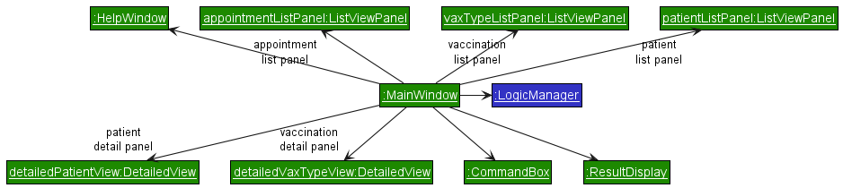

<div markdown="span" class="alert alert-info">
:information_source: **INFO**: `LogicManager` is a concrete implementation of `Logic`. `LogicManager` was not shown in the complementing class diagram as it is not involved in the structure of the UI component. see [Logic component](#logic-component) to learn more about `LogicManager`.
</div>

#### Refreshing

In order to maintain the responsiveness of the GUI, the FX Application thread is used solely for GUI related processes such as event handling and display updates. For parsing and the execution of commands, their processes are dispatched on a separate thread. To learn more about this, see [Logic component](#logic-component).

To handle display changes due to changes in the state of data that the different GUI parts are displaying, all classes of the `UI` component in the class diagram above with the exception of `HelpWindow` implements `Refreshable`. This is a functional interface whose functional method is `refresh()`. Calling this method will cause the implementing UI classes to check for changes in the data that they are displaying and update their display accordingly. To invoke the `refresh()` method continuously, a `ScheduledThreadPoolExecutor` is created in `MainApp` that is tasked to call `refresh()` of `UiManager` 30 times every second.

Unlike the implementation where the displays are updated as soon as it a change happens, this implementation is able to accumulate and differ the displaying of changes. This improves the responsiveness of the GUI in scenarios where there is a spike in the number of changes in data as the GUI does not update for every change. Such scenarios may happen when the use uses patient's `clear` command when there are a large number of patient.

#### `DetailedView`

To display its contents, `DetailedView` uses an observer pattern to observe for the data that it needs to display. It observes an `ObjectProperty` through a `ChangeListener`, both of which are defined by JavaFX. To convert the observed object to the `Node` object that JavaFX can display, `DetailedView` will also have a `Function`, that is provided on construction, which will handle this conversion.

To collect and store changes to be displayed, 2 private class fields are defined:

* `isUpdated` of type `boolean`.
  * Will be `true` if the change has been displayed and `false` otherwise.
* `value` of type `T` where `T` is the type of the object being detailed.
  * The object that has to be displayed.
  * Can be `null` which will signify that nothing should be displayed.

`isUpdated` is required as `value` can be `null`. Thus checks to see if `value` is `null` will not work.

Below shows the class diagram, showing the structure of `DetailedView`. Notice how that there are no external dependencies to other parts of VMS.

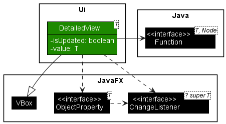

Below shows the object diagram showing the state after `fillInnerParts()` of `MainWindow` is called for the patient detail panel to highlight the listener pattern structure that `DetailView` implements. A similar object diagram can be drawn for the vaccination detail panel by changing the relevant variable names and types.

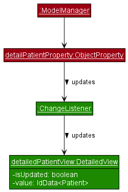

The activity diagram below shows the work flow of `DetailedDisplay` as it checks for changes and update its display when `refresh()` is invoked.


As seen, no display updates are done if `isUpdate` is `true`, which signifies that the display has already been updated. This improves efficiency as the display is only updated when necessary.

#### `ListViewPanel`

Similar to `DetailedView`, `ListViewPanel` also uses an observer pattern and a `Function` to convert the observed object to a `Node`. However, it observes an `ObservableMap` through a `MapChangeListener`, both of which also defined by JavaFX. Only the values of the observed map will be displayed and the `Function` of `ListViewPanel` is used to convert these values to their equivalent `Node` representations. The order in which the values of the observed map are displayed is defined by a `Comparator` by default is the comparator produced from `Comparator.naturalOrder()`. This comparator is stored in an `ObjectProperty` in `ListViewPanel`

To collect changes to be displayed for the refresh, the latest `MapChangeListener.Change` (referred to as `Change` in this section) is stored in an `ObjectProperty`. `Change` is an inner class of `MapChangeListener` and defines a method, `getMap()` which allows the retrieval of the state of the map to be displayed. Unlike `DetailedView`, a `null` check to the value of this `ObjectProperty` can be done to verify if a an update to the display is required as its value will only be `null` if there is nothing to update.

Below shows the class diagram of `ListViewPanel` to graphically view this structure.

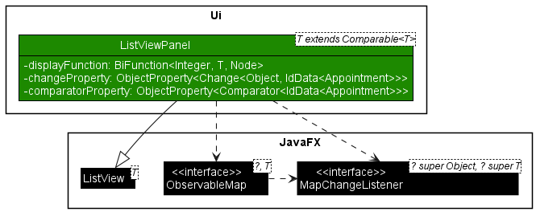

The complementing object diagram for appointment list view is shown below. Some `AppointmentManager` components are also added to detail the observer pattern structure of `ListViewPanel`. A similar diagram can be done for the patient list view panel.

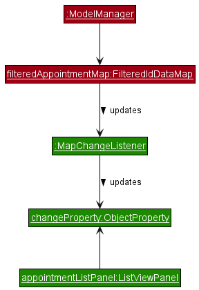

To be able to refer to vaccinations by the index that they are displayed in the vaccination list panel, `ModelManager` will need to have a list view that describes the order in which the vaccinations are displayed. To avoid coupling, `ModelManager` observes the `ListViewPanel`, that is responsible for displaying the vaccination list panel, through the observer pattern. The items and order in which `ListViewPanel` is displaying is kept in an `ObservableList` as defined by JavaFX `ListView` which `ListViewPanel` extends. As such, obtain the required list view, `ModelManager` keeps another `ObservableList` that is bounded to the `ObservableList` defined by `ListView` through the observer pattern. Refer to the object diagram below for a graphical visualization of the structure described. The object diagram shows the state after `fillInnerParts()` is called.

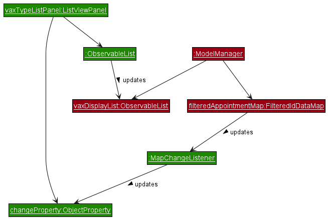

Below show the activity diagram when the `refresh()` method is invoked. The item list referred to in the diagram is the `ObservableList` that `ListView` defines. Updates to this list will update the display.

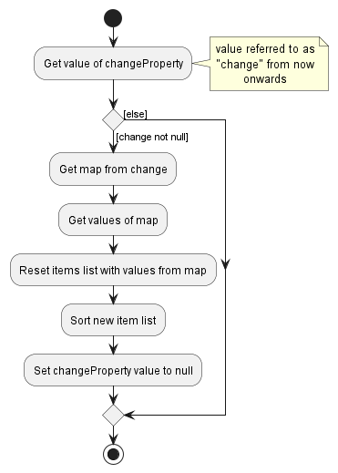

#### `ResultDisplay`

To display messages to the user after every command that they have inputted, a `Consumer`, that accepts a list of `CommandMessage`, is used to update `ResultDisplay` whenever `Logic` has completed the execution of a command regardless if it was successful. The `Consumer` only function is to call the `queueMessages(List<CommandMessage>)` method of `ResultDisplay`. This method will queue all `CommandMessage` to be displayed in the order of the given list. When the `refresh()` method is called, elements in the queue will be polled and converted to their `Node` representation until the queue is emptied. To understand more about when this `Consumer` is called within `Logic`, read [Executing a command](#executing-a-command).

Below shows the class diagram of the described structure. `Logic`, `LogicManager` and `Consumer` are not shown as there are no dependencies between these classes/interfaces and `ResultDisplay`.

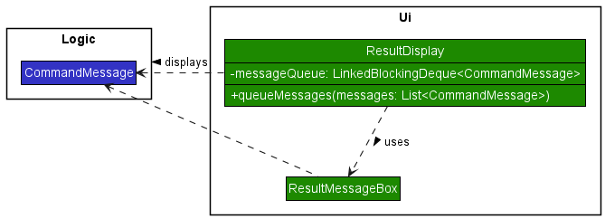

Below shows the object diagram of `ResultDisplay` after the `fillInnerParts()` method has been called. This diagram reveals the observer pattern structure which the class diagram does not.

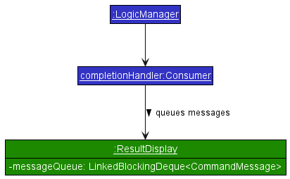

The following diagram shows the activity diagram when the `refresh()` method is called. On top of how messages are displayed, the procedure of how the 30 message history limit is maintained is shown as well.

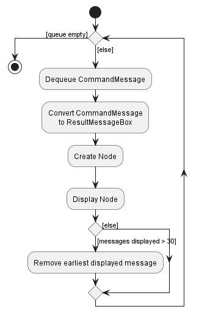

### Logic component

**API** : [`Logic.java`](https://github.com/AY2223S2-CS2103-F11-3/tp/tree/master/src/main/java/seedu/vms/logic/Logic.java)

Here's a (partial) class diagram of the `Logic` component:


`LogicManager` is a concrete implementation of `Logic` which handles the logical components of VMS. Its main responsibility is to handle the execution of user entered commands.

`LogicManager` handles command execution in the form of an execution queue. When the user enters a command, that command is queued into an execution queue in `LogicManager`. Both queueing and the execution of commands can happen in parallel. However, at any one time, at most one command will be executed at a time.

#### Command execution

For the entire command execution portion of the `Logic` component, only `queue(String)` method is exposed to the outside. As such, to queue and execute a user command, only the `queue(String)` method of `Logic` will have to be called. This method will queue the command for execution and execute it when it is its turn. Command inputs are stored and queued in an internal queue called the command queue (`cmdQueue`). To allow for parallel queuing and dequeuing, this queue has a type of `LinkedBlockingDeque`. The elements stored within the queue are the `String` of the command input that the user has entered.

To avoid dependencies with other classes, specifically UI related classes, `ModelManager` stores a `completionHandler`, which is a `Consumer<List<CommandMessage>>`. `completionHandler` can be set and changed by other classes and is called whenever a command execution is completed.

##### Queuing a command

When the `queue(String)` is called upon, the following happens.

1. The command input is added to the end of `cmdQueue`.
2. An attempt is then made to start the execute the next command in the queue through `startNext()`. This is described in detail in the next section.


##### Starting a command

The method `startNext()` is a private method in `LogicManager` that handles the starting of the execution of a command. When it is called upon, a check is done to check if there are any command still in execution and that there are still commands yet to be executed in `cmdQueue`. If this is not the case, nothing happens and the method returns silently. If not, the following happens.

1. The next command input in `cmdQueue` is polled.
2. A new `Thread` object is created whose task is to parse and execute the command input polled in step 1.
3. The created `Thread` objects is then started on a separate thread to perform its task of executing the command.


##### Executing a command

When the created `Thread` in `startNext()` is started, Java Virtual Machine will call its `run()` method at an appropriate time. This will start the parsing then execution of a command input by calling the `processCommand(String)` of `LogicManager`. The following sequence describes how a command input is executed when `processCommand(String)` is called.

1. The command input is passed to the stored instance of `Model` in `LogicManager` to be parsed. The returned result is a `ParseResult` which is an association class of the parsed `Command` and its corresponding `CommandMessage` if there are warnings while parsing. More accurately, the parsed `Command` is one of the concrete implementations of `Command`.
2. The `Command` in the returned `ParseResult` object of step 1 is then executed. It is given the stored instance of `Model` to perform its task and its interaction with model depends on the concrete implementation of `Command` parsed. This is represented as a **ref** frame in the sequence diagram below to highlight that the `Command` object and `Model` interacts with each other, but their interactions may vary depending on the implementation of the parsed `Command`. Once done it returns a `CommandMessage`.
3. The new state of `Model` is then saved into hard disk through `saveModel()` method. This will return a list of `CommandMessage` containing the error messages that occurred while saving.
4. All `CommandMessage`s that have been created from steps 1 to 3 are combined as a list and passed to `completeExecution(List<String>)` method.
5. The `completionHandler` is then passed the combined list of `CommandMessage` in step 5 to handle the completion of the command.
6. An attempt is then made to start the next command through `startNext()` as described in the section before.


<div markdown="span" class="alert alert-info">
:information_source: **INFO**: The parsing of commands are handled in `Model` to allow for user custom keywords.
</div>

### Model component

**API** : [`Model.java`](https://github.com/AY2223S2-CS2103-F11-3/tp/tree/master/src/main/java/seedu/vms/model/Model.java)

Here's a (partial) class diagram of the Model component:


`ModelManager` is a concrete implementation of `Model` which handles the model components of VMS.
The responsibilities of `Model` component,

* stores the runtime state of the other managers:
  * `PatientManager`
  * `VaxTypeManager`
  * `AppointmentManager`
  * `KeywordManager`
* stores the objects to be displayed as a separate filtered map which is exposed to outsiders as an unmodifiable
`ObservableMap<K, V>`, where `V` is the type of object being stored (eg. `IdData<Patient>`) and `K` is the type of the
key the stored object is mapped to (for `Patient` and `Appointment`, this is an `Integer` and as for `VaxType`, this
is a `String`).
* stores the object to be detailed as a `ObjectProperty<V>` where `V` is the type of the object to be displayed (eg.
`IdData<Patient>`).
* store a `UserPref` object that represents the user's preferences. This is exposed to the outside as a
`ReadOnlyUserPref` object.

### Patient component

**API** : [`Patient.java`](https://github.com/AY2223S2-CS2103-F11-3/tp/tree/master/src/main/java/seedu/vms/model/patient/Patient.java)

Here's a (partial) class diagram of the Patient component:


To represent a patient, `Patient` contains the Identity and Medical information using the following attributes:

* Identity:
  * The `name` of the patient
  * The `phone` of the patient
  * The `dateOfBirth` of the patient
* Medical:
  * The `bloodType` of the patient
  * The `allergies` of the patient
  * The `vaccines` of the patient

`Patient` have limitations on its attributes according to the [Non-Functional Requirements](#non-functional-requirements).

#### PatientManager

**API** : [`PatientManager.java`](https://github.com/AY2223S2-CS2103-F11-3/tp/tree/master/src/main/java/seedu/vms/model/patient/PatientManager.java)

On top of storing `Patient` objects, `PatientManager` ensures the patient's vaccination records are updated if the name of a vaccination changes. It also ensures that there is a maximum limit of `Patient` objects allowed to be stored according to the [Non-Functional Requirements](#non-functional-requirements).

### Vaccination component

Vaccinations are represented as `VaxType` objects and stored within `VaxTypeManager`.

#### VaxType

**API** : [`VaxType.java`](https://github.com/AY2223S2-CS2103-F11-3/tp/tree/master/src/main/java/seedu/vms/model/vaccination/VaxType.java)

Here's a (partial) class diagram of the VaxType component:


To represent a vaccination, `VaxType` contains the following attributes:

* A name represented as a `GroupName` object.
* A set of groups which the vaccination classifies under as a set of `GroupName` objects.
* A minimum age as an `Age` object.
* A maximum age as an `Age` object.
* A set ingredients of the vaccination as a set of `GroupName` objects.
* A list of requirements of vaccination groups that will have to be taken before this vaccination can be taken as a list of `Requirement` objects.

#### VaxTypeManager

**API** : [`VaxTypeManager.java`](https://github.com/AY2223S2-CS2103-F11-3/tp/tree/master/src/main/java/seedu/vms/model/vaccination/VaxTypeManager.java)

On top of storing `VaxType` objects, `VaxTypeManager` ensures the uniqueness of `VaxType`. It also ensures that there is a maximum limit of `VaxType` objects allowed to be stored according to the [Non-Functional Requirements](#non-functional-requirements).

### Appointment component

**API** : [`Appointment.java`](https://github.com/AY2223S2-CS2103-F11-3/tp/tree/master/src/main/java/seedu/vms/model/appointment/Appointment.java)

Here's a (partial) class diagram of the Appointment component:


The `Appointment` component,

* Contains the details of patients' appointment
  * The patients' `Patient id`
  * The duration of each appointment (Uses the `start time` and `end time`)
  * The type and dose of `vaccine` to be administered
  * The `status` of the appointment

#### AppointmentManager

**API** : [`AppointmentManager.java`](https://github.com/AY2223S2-CS2103-F11-3/tp/tree/master/src/main/java/seedu/vms/model/appointment/AppointmentManager.java)

On top of storing `Appointment` objects, `AppointmentManager` ensures the uniqueness of `Appointment`. It also ensures that there is a maximum limit of `Appointment` objects allowed to be stored according to the [Non-Functional Requirements](#non-functional-requirements).

### Keyword component

**API** : [`Keyword.java`](https://github.com/AY2223S2-CS2103-F11-3/tp/tree/master/src/main/java/seedu/vms/model/keyword/Keyword.java)

Here's a (partial) class diagram of the Keyword component:


The `Keyword` component,

* Contains the mapping of a custom keyword to a main keyword
  * The custom' `<keyword>`
  * The main `<keyword>`:
    * `appointment` for `Appointment` class
    * `patient` for `Patient` class
    * `vaccination` for `VaxType` class

#### KeywordManager

**API** : [`KeywordManager.java`](https://github.com/AY2223S2-CS2103-F11-3/tp/tree/master/src/main/java/seedu/vms/model/keyword/KeywordManager.java)

The `KeywordManager` main responsibility is the storing of `Keyword` objects.

### Storage component

**API** : [`Storage.java`](https://github.com/AY2223S2-CS2103-F11-3/tp/tree/master/src/main/java/seedu/vms/storage/Storage.java)


The `Storage` component is responsible for the reading and writing of the states of the different managers in `Model` to and from the hard disk. As shown in the diagram above, it inherits from `PatientManagerStorage`, `UserPrefsStorage`, `VaxTypeStorage`, `AppointmentStorage` and `KeywordStorage`. As such, it can be treated as either one (if only the functionality of only one is needed).

#### Cascading delete

The cascading delete feature is an important part of the VMS's design, as it helps to maintain data integrity and avoid orphaned records in the system. When a object is deleted from the VMS, any related records should also be deleted to ensure that the system remains consistent.

##### Relationship between `Patient` and `Appointment`

When a `Patient` record is deleted from the system, any associated `Appointment` records will be deleted as well. This is because `Appointment` records are directly linked to a specific `Patient`, and it would not make sense to keep these records around if the `Patient` is no longer in the system. The implementation can be found in [`AppointmentManager.java`](https://github.com/AY2223S2-CS2103-F11-3/tp/tree/master/src/main/java/seedu/vms/model/appointment/AppointmentManager.java).

##### Relationship between `VaxType` and `Appointment`

When a `VaxType` record is deleted from the system, any associated `Appointment` records will be deleted as well. This is because `VaxType` records are directly linked to a specific `Appointment`, and it would not make sense to keep these records around if the `VaxType` record is no longer offered by the VaxType center. The implementation can be found in [`AppointmentManager.java`](https://github.com/AY2223S2-CS2103-F11-3/tp/tree/master/src/main/java/seedu/vms/model/appointment/AppointmentManager.java).

##### Relationship between `Patient` and `VaxType`

On the other hand, `Patient` records are not deleted when a `VaxType` record is deleted from the system. This is because `Patient` records should not be modified if a `VaxType` is no longer offered. If a `VaxType` record is deleted, the associated `Appointment` records will be deleted, but any `Patient` records associated with those `VaxType` records will not be updated in the system. This is because the `Patient` records may still be relevant, even if the `VaxType` is no longer in the system.

#### Cascading Change

The cascading change feature is an important part of the VMS's design, as it helps to maintain data integrity and avoid orphaned records in the system. When a object is changed in the VMS, any related records should also be changed to ensure that the system remains consistent.

##### Relationship between `Patient` and `Appointment`

When a `Patient` record is updated in the system, any associated `Appointment` records will be updated as well. This is because `Appointment` records are directly linked to a specific `Patient`, and if the patient's information changes, it is important to update any related `appointment`s to reflect this change. The implementation can be found in [`AppointmentManager.java`](https://github.com/AY2223S2-CS2103-F11-3/tp/tree/master/src/main/java/seedu/vms/model/appointment/AppointmentManager.java).

##### Relationship between `VaxType` and `Patient`

When a `VaxType` record is updated in the system, any associated `Patient` records will be updated as well. This is because `VaxType` records contain information about the `VaxType`s that a `patient` has taken, and if the `VaxType` information changes, it is important to update any related `patient` records to reflect this change. The implementation can be found in [`PatientManager.java`](https://github.com/AY2223S2-CS2103-F11-3/tp/tree/master/src/main/java/seedu/vms/model/patient/PatientManager.java).

##### Relationship between `VaxType` and `Appointment`

Additionally, when a `VaxType` record is updated in the system, any associated `Appointment` records will be updated as well. This is because `VaxType` records are directly linked to a specific `Appointment`, and if the `VaxType` information changes, it is important to update any related `appointment` records to reflect this change. The implementation can be found in [`AppointmentManager.java`](https://github.com/AY2223S2-CS2103-F11-3/tp/tree/master/src/main/java/seedu/vms/model/appointment/AppointmentManager.java).

### Common classes

Classes used by multiple components are in the `seedu.vms.commons` package.

--------------------------------------------------------------------------------------------------------------------

## **Implementation**

This section describes some noteworthy details on how certain features are implemented.

### Patient

#### Adding a Patient

The **Adding a Patient** mechanism is facilitated by `VMS`. The Patient created is stored inside `PatientManager` object.

##### Execution Sequence

Given below is an example usage scenario when a user enter `patient add --n John Doe --p 98765432 --d 2001-03-19 --b B+ --a catfur --a pollen --v covax` as a command.

1. The user enters the command in the `UI component`
2. It will be passed to the `Logic component`
3. When `AddCommandParser` receives the information from `PatientParser`, it will invoke the following methods to help with the parsing.
    1. `ParserUtil#parseName` will be called to create a Name object using "John Doe".
    2. `ParserUtil#parsePhone` will be called to create a Phone object using "98765432".
    3. `ParserUtil#parseDob` will be called to create a Dob object using "2001-03-19".
    4. `ParserUtil#parseBloodType` will be called to create a BloodType object using "B+".
    5. `ParserUtil#parseGroups` will be called to create GroupName[] object named allergies using ["catfur", "pollen"].
    6. `ParserUtil#parseGroups` will be called to create GroupName[] object named vaccines using ["covax"].
4. After successfully parsing the args, `AddCommandParser` will create a Patient using the new Name, Phone, Dob, BloodType, Allergies<GroupName>, Vaccines<GroupName>. Then it will create an `AddCommand` with the new Patient object.
5. When `AddCommand#execute` is called, `model#addPatient` will be called to add the new Patient into the model. `AddCommand` will then return `CommandMessage` to indicate it's success.

Note that `Allergies` and `Vaccines` are optional, so the user does not need to include `--a` or `--v` if the it is not applicable.

The activity diagram below summarises the action when the patient `AddCommand` is executed.


Given below is an sequence diagram that illustrates the **Adding a Patient** parsing mechanism behaves at every step.


*Patient parsing detail here:*


#### Detailing Patients

The **Detailing Patients** mechanism is facilitated by `VMS`. It will update the UI with the Patient requested.

##### Execution Sequence

Given below is an example usage scenario when a user enter `patient detail 1` as a command.

1. The user enters the command in the `UI component`
2. It will be passed to the `Logic component`
3. When `DetailCommandParser` receives the information from `PatientParser`, it will invoke the `ParseUtil#parseIndex` to parse PATIENT_ID. It will throw a `ParseException` if there are no args present.
4. After successfully parsing the args, `FindCommandParser` will create an `DetailCommand` with the parsed index
5. When `DetailCommand#execute` is called, `model#setDetailedPatient` will be called to update the ui to display the Patient requested.

The activity diagram below summarises the action when the patient `DetailCommand` is executed.


<!-- Given below is an sequence diagram that illustrates the **Detailing Patients** mechanism behaves at every step.

 -->

#### Listing Patients

The **Listing Patients** mechanism is facilitated by `VMS`. It will list all the Patients that are stored in the `PatientManager`.

##### Execution Sequence

Given below is an example usage scenario when a user enter `patient list` as a command.

1. The user enters the command in the `UI component`
2. It will be passed to the `Logic component`
3. `PatientParser` will invoke `ListCommandParser`, which will create `ListCommand` directly as they do not use any args.
4. When `ListCommand#execute` is called, `model#updateFilteredPatientList` will be called to update the list with the `PREDICATE_SHOW_ALL_PATIENTS` to display all Patients.

The activity diagram below summarises the action when the patient `ListCommand` is executed.

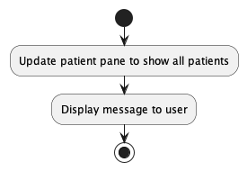

<!-- Given below is an sequence diagram that illustrates the **Listing Patients** mechanism behaves at every step.

 -->

#### Finding a Patient

The **Finding a Patient** mechanism is facilitated by `VMS`. It will find specific list of Patient objects from `PatientManager` inside `VMS` object with the keywords provided.

The user can choose to add flags when searching, to search for the specific attributes of a Patient. If no flags are present, the mechanism will assume that it is searching the Patient's name.

##### Execution Sequence

Given below is an example usage scenario when a user enter `patient find --n John Deer --p 98765431 --d 2001-03-19 --b B+ --a catfur --v covax` as a command.

1. The user enters the command in the `UI component`
2. It will be passed to the `Logic component`
3. When `FindCommandParser` receives the information from `PatientParser`, it will invoke the following methods to help with the parsing. It will throw a `ParseException` if there are no args present.
    1. `ParserUtil#parseName` will be called to create a Name object using "John Doe".
    2. `ParserUtil#parsePhone` will be called to create a Phone object using "98765432".
    3. `ParserUtil#parseDob` will be called to create a Dob object using "2001-03-19".
    4. `ParserUtil#parseBloodType` will be called to create a BloodType object using "B+".
    5. `ParserUtil#parseGroups` will be called to create GroupName[] object named allergies using ["catfur", "pollen"].
    6. `ParserUtil#parseGroups` will be called to create GroupName[] object named vaccines using ["covax"].
4. After successfully parsing the args, the following will happen
    1. `FindCommandParser` will create an FindPatientDescriptor using the new Name, Phone, Dob, BloodType, Allergies `<GroupName>`, Vaccines `<GroupName>`.
    1a. If none of the flags are present, it will take the entire arg as a `setNameSearch`.
    2. Then it will create an `FindCommand` with the new FindPatientDescriptor object.
5. When `FindCommand#execute` is called, the following will happen.
    1. It will check if the different attributes of FindPatientDescriptor is present.
    2. It will find the patient by creating different `Optional<AttributePredicate>`.
    3. The different predicates will be added into a `List<Predicate<Patient>>` and passed to `model#setPatientFilters` to display the filtered Patients.
    4. `FindCommand` will then return `CommandMessage` to indicate it's success and the number of patients found.

The activity diagram below summarises the action when the patient `FindCommand` is executed.


<!-- Given below is an sequence diagram that illustrates the **Finding a Patient** mechanism behaves at every step.

 -->

`FindCommandParser#parse` will call `String#trim` to trim the search request. If there is no additional flags, it will fall back to the default of using the search term to find Names.

#### Editing a Patient

The **Editing a Patient** mechanism is facilitated by `VMS`. It will read and modify a target Patient object from `PatientManger` inside `VMS` object.

##### Execution Sequence

Given below is an example usage scenario when a user enter `patient edit 5 --n John Deer --p 98765431 --d 2001-03-19 --b B+ --a catfur --a pollen --v covax` as a command.

1. The user enters the command in the `UI component`
2. It will be passed to the `Logic component`
3. When `EditCommandParser` receives the information from `PatientParser`, it will invoke the following methods to help with the parsing. It will short circuit and throw a `ParseException` if 1. is not fulfilled.
    1. `ParserUtil#parseIndex` will be called to create a Index object using "5".
    2. `ParserUtil#parseName` will be called to create a Name object using "John Doe".
    3. `ParserUtil#parsePhone` will be called to create a Phone object using "98765432".
    4. `ParserUtil#parseDob` will be called to create a Dob object using "2001-03-19".
    5. `ParserUtil#parseBloodType` will be called to create a BloodType object using "B+".
    6. `ParserUtil#parseGroups` will be called to create GroupName[] object named allergies using ["catfur", "pollen"].
    7. `ParserUtil#parseGroups` will be called to create GroupName[] object named vaccines using ["covax"].
4. After successfully parsing the args, `EditCommandParser` will create an editPatientDescriptor using the new Name, Phone, Dob, BloodType, Allergies `<GroupName>`, Vaccines `<GroupName>`. Then it will create an `EditCommand` with the new editPatientDescriptor object with the index.
5. When `EditCommand#execute` is called, the following will happen.
    1. It will ensure that the Index given is within the list, else it will throw a CommandException
    2. It will edit the patient by creating a new patient with the new values from the Parser as Patients are Immutable
    3. Then `model#setPatient` will be called to add the new Patient into the model.
    4. `EditCommand` will then return `CommandMessage` to indicate it's success.

The activity diagram below summarises the action when the patient `EditCommand` is executed.


<!-- Given below is an example usage scenario and how **Editing a Patient** mechanism behaves at each step.

 -->

#### Deleting a Patient

The **Deleting a Patients** mechanism is facilitated by `VMS`. It will delete specific Patient objects from `PatientManager` inside `VMS` object with using the index provided.

##### Execution Sequence

Given below is an example usage scenario when a user enter `patient delete 5` as a command.

1. The user enters the command in the `UI component`
2. It will be passed to the `Logic component`
3. When `DeleteCommandParser` receives the information from `PatientParser`, it will invoke the `ParseUtil#parseIndex` to parse PATIENT_ID. It will throw a `ParseException` if there are no args present.
4. After successfully parsing the args, `FindCommandParser` will create an `DeleteCommand` with the parsed index
5. When `DeleteCommand#execute` is called, `model#setDeletedPatient` will be called to update the ui to display the Patient requested.

The activity diagram below summarises the action when the patient `DeleteCommand` is executed.


<!-- Given below is an sequence diagram that illustrates the **Deleting a Patient** mechanism behaves at every step.

 -->

#### Clearing Patients

The **Clearing Patients** mechanism is facilitated by `VMS`. It will set the patient manager with a new empty patient manager, effectively clearing all the Patients

##### Execution Sequence

Given below is an example usage scenario when a user enter `patient clear` as a command.

1. The user enters the command in the `UI component`
2. It will be passed to the `Logic component`
3. `PatientParser` will invoke `ClearCommand` which will create `ClearCommand` as they do not use any args.
4. When `ClearCommand#execute` is called, `model#setPatientManager` will be called to update the list a new PatientManger() with no patients.

The activity diagram below summarises the action when the patient `ClearCommand` is executed.


<!-- Given below is an sequence diagram that illustrates the **Clearing Patients** mechanism behaves at every step.

 -->

### Appointment

#### Adding a Appointment

##### Execution Sequence

<!-- TODO


-->

#### Listing a Appointment

##### Execution Sequence

<!-- TODO


-->

#### Finding a Appointment

##### Execution Sequence

<!-- TODO


-->

### Keyword

#### Adding a Keyword

The **Keyword Adding** mechanism is facilitated by `VMS`. The Keyword created is stored inside `KeywordManager` object.

##### Execution Sequence

Given below is an example usage scenario when a user enters `keyword add --k patient --n p` as a command.

1. The user enters the command in the `UI Component`.
2. It will be passed to the `Logic component`.
3. When `AddCommandParser` receives the information from `KeywordParser`, it will invoke the following methods for parsing.
   1. `ParserUtil#parseMainKeyword` will be called to create a String object using `patient`.
   2. `ParserUtil#parseKeyword` will be called to create a String object using `p`.
4. After successfully parsing the args, `AddCommandParser` will create a Keyword using the new `patient` and `p`
strings created.
5. When `AddCommand#execute` is called, `model#addKeyword` will be called to add the new Keyword into the model.
`AddCommand` will then return `CommandMessage` to indicate it's success.

Note that `MainKeyword` and `Keyword` are required args, hence the user must include `--k` and `--n` in the command.

The activity diagram below summarises the action when the keyword `AddCommand` is executed.


Given below is a sequence diagram that illustrates the **Keyword Adding** parsing mechanism at every step.


*Keyword parsing detail here:*


#### Deleting a Keyword

The **Keyword Delete** mechanism is facilitated by `VMS`. It will delete specific Keyword objects from `KeywordManager`
inside `VMS` object using the string provided.


##### Execution Sequence

Given below is an example usage scenario when a user enters `keyword delete p` as a command.

1. The user enters the command in the `UI Component`.
2. It will be passed to the `Logic component`.
3. When `DeleteCommandParser` receives the information from `KeywordParser`, it will invoke the 
`ParserUtil#parseDeleteKeyword` to parse the string `p` provided. It will throw a `ParseException` if there are no
args present.
4. After successfully parsing the arg, `DeleteCommandParser` will create a `DeleteCommand` with the parsed `p` string.
5. When `DeleteCommand#execute` is called, `model#deleteKeyword` will be called to delete the specified Keyword from
the model. `DeleteCommand` will then return `CommandMessage` to indicate it's success.

The activity diagram below summarises the action when the keyword `DeleteCommand` is executed.


<!-- Below is given from AB3, commented out for ur own ref, our product does not have these features. -->
<!-- ### \[Proposed\] Undo/redo feature

#### Proposed Implementation

The proposed undo/redo mechanism is facilitated by `VersionedVms`. It extends `Vms` with an undo/redo history, stored internally as an `patientManagerStateList` and `currentStatePointer`. Additionally, it implements the following operations:

* `VersionedVms#commit()` — Saves the current patient manager state in its history.
* `VersionedVms#undo()` — Restores the previous patient manager state from its history.
* `VersionedVms#redo()` — Restores a previously undone patient manager state from its history.

These operations are exposed in the `Model` interface as `Model#commitVms()`, `Model#undoVms()` and `Model#redoVms()` respectively.

Given below is an example usage scenario and how the undo/redo mechanism behaves at each step.

Step 1. The user launches the application for the first time. The `VersionedVms` will be initialized with the initial patient manager state, and the `currentStatePointer` pointing to that single patient manager state.


Step 2. The user executes `delete 5` command to delete the 5th patient in the patient manager. The `delete` command calls `Model#commitVms()`, causing the modified state of the patient manager after the `delete 5` command executes to be saved in the `patientManagerStateList`, and the `currentStatePointer` is shifted to the newly inserted patient manager state.


Step 3. The user executes `add n/David …​` to add a new patient. The `add` command also calls `Model#commitVms()`, causing another modified patient manager state to be saved into the `patientManagerStateList`.


<div markdown="span" class="alert alert-info">:information_source: **Note:** If a command fails its execution, it will not call `Model#commitVms()`, so the patient manager state will not be saved into the `patientManagerStateList`.

</div>

Step 4. The user now decides that adding the patient was a mistake, and decides to undo that action by executing the `undo` command. The `undo` command will call `Model#undoVms()`, which will shift the `currentStatePointer` once to the left, pointing it to the previous patient manager state, and restores the patient manager to that state.


<div markdown="span" class="alert alert-info">:information_source: **Note:** If the `currentStatePointer` is at index 0, pointing to the initial Vms state, then there are no previous Vms states to restore. The `undo` command uses `Model#canUndoVms()` to check if this is the case. If so, it will return an error to the user rather
than attempting to perform the undo.

</div>

The following sequence diagram shows how the undo operation works:


<div markdown="span" class="alert alert-info">:information_source: **Note:** The lifeline for `UndoCommand` should end at the destroy marker (X) but due to a limitation of PlantUML, the lifeline reaches the end of diagram.

</div>

The `redo` command does the opposite — it calls `Model#redoVms()`, which shifts the `currentStatePointer` once to the right, pointing to the previously undone state, and restores the patient manager to that state.

<div markdown="span" class="alert alert-info">:information_source: **Note:** If the `currentStatePointer` is at index `patientManagerStateList.size() - 1`, pointing to the latest patient manager state, then there are no undone Vms states to restore. The `redo` command uses `Model#canRedoVms()` to check if this is the case. If so, it will return an error to the user rather than attempting to perform the redo.

</div>

Step 5. The user then decides to execute the command `list`. Commands that do not modify the patient manager, such as `list`, will usually not call `Model#commitVms()`, `Model#undoVms()` or `Model#redoVms()`. Thus, the `patientManagerStateList` remains unchanged.


Step 6. The user executes `clear`, which calls `Model#commitVms()`. Since the `currentStatePointer` is not pointing at the end of the `patientManagerStateList`, all patient manager states after the `currentStatePointer` will be purged. Reason: It no longer makes sense to redo the `add n/David …​` command. This is the behaviour that most modern desktop applications follow.


The following activity diagram summarizes what happens when a user executes a new command:


#### Design considerations:

**Aspect: How undo & redo executes:**

* **Alternative 1 (current choice):** Saves the entire patient manager.
  * Pros: Easy to implement.
  * Cons: May have performance issues in terms of memory usage.

* **Alternative 2:** Individual command knows how to undo/redo by
  itself.
  * Pros: Will use less memory (e.g. for `delete`, just save the patient being deleted).
  * Cons: We must ensure that the implementation of each individual command are correct.

_{more aspects and alternatives to be added}_

### \[Proposed\] Data archiving

_{Explain here how the data archiving feature will be implemented}_ -->

--------------------------------------------------------------------------------------------------------------------

## **Documentation, logging, testing, configuration, dev-ops**

* [Documentation guide](Documentation.md)
* [Testing guide](Testing.md)
* [Logging guide](Logging.md)
* [Configuration guide](Configuration.md)
* [DevOps guide](DevOps.md)

--------------------------------------------------------------------------------------------------------------------

## **Appendix: Requirements**

### Product scope

**Target user profile**:

* a receptionist of small size private clinics in charge of managing vaccination appointments.
* prefer desktop apps over other types.
* can type fast.
* prefers typing to mouse interactions.
* is reasonably comfortable using CLI apps for speed and efficiency.

**Value proposition**: Application will

* Validate the eligibility of patients to take vaccinations faster than manual means.
* Manage patients.
* Manage vaccinations.
* Manage appointments.
* All of which faster than a typical mouse/GUI driven app.

### User stories

Priorities: High (must have) - `* * *`, Medium (nice to have) - `* *`, Low (unlikely to have) - `*`

| Priority | As a …​        | I want to …​                                             | So that I can …​                                                       |
| -------- | -------------- | -------------------------------------------------------- | ---------------------------------------------------------------------- |
| `* * *`  | User           | get the patient's contact easily                         | contact them when needed.                                              |
| `* * *`  | User           | be able to key in people with the same name              | save the data of people with the same name                             |
| `* * *`  | User           | view patient details                                     | recall the details of a patient                                        |
| `* * *`  | User           | add a patient                                            |                                                                        |
| `* * *`  | User           | update a patient                                         |                                                                        |
| `* * *`  | User           | delete a patient                                         |                                                                        |
| `* * *`  | User           | view appointment details                                 | recall the details of an appointment                                   |
| `* * *`  | User           | add an appointment                                       |                                                                        |
| `* * *`  | User           | delete an appointment                                    |                                                                        |
| `* * *`  | User           | update an appointment                                    |                                                                        |
| `* * *`  | User           | view upcoming appointments                               | so that I know what appointments are coming soon                       |
| `* * *`  | User           | view vaccination details                                 | recall the details of a vaccination type                               |
| `* * *`  | User           | add a vaccination                                        |                                                                        |
| `* * *`  | User           | delete a vaccination                                     |                                                                        |
| `* * *`  | User           | update a vaccination                                     |                                                                        |
| `* * *`  | User           | check the eligibility of a patient to take a vaccination | verify if I can schedule the appointment that the patient requested    |
| `* *`    | Forgetful user | view the guide page of the application                   | understand of the parts of the application that I have forgotten works |
| `* *`    | Forgetful user | see the syntax of commands                               | know how to use the command                                            |
| `* *`    | New user       | see the app populated with sample data                   | use it as a tutorial for how the app will work                         |
| `* *`    | New User       | purge all the current data                               | get rid of sample data                                                 |
| `* *`    | User           | generate patient numbers                                 | uniquely identify a patient by their patient number                    |
| `* *`    | User           | generate appointment numbers                             | uniquely identify an appointment by its appointment number             |
| `* *`    | User           | find patients                                            | view details about the patient I am looking for faster                 |
| `* *`    | User           | list all patients                                        | clear my find filters for patients                                     |
| `* *`    | User           | find vaccinations                                        | view details about the vaccination I am looking for faster             |
| `* *`    | User           | list all vaccinations                                    | clear my find filters for vaccinations                                 |
| `* *`    | User           | find appointments                                        | view details about the appointment I am looking for faster             |
| `* *`    | User           | list all appointments                                    | clear my find filters for appointments                                 |
| `*`      | Forgetful user | see what commands there are                              | know what commands I can use                                           |
| `*`      | User           | check what is the next free appointment slot             | choose the best time for the patient quicker                           |
| `*`      | User           | undo my latest action                                    | undo my mistakes                                                       |

### Use cases

For all use cases below, the **System** is the `VMS` and the **Actor** is the `user`, unless specified otherwise.

--------------------------------------------------------------------------------------------------------------------

#### UC-PAT-001 - Add patient

##### MSS

1. User enters command to add a patient.
2. VMS adds the patient.

    Use case ends.

##### Extensions

* 1a. VMS detects error in the command entered.
  * 1a1. VMS shows an error message.

    Use case resumes from step 1.


#### UC-PAT-002 - Detail patient

##### MSS

1. User enters command to view details of a patient.
2. VMS shows the details of the patient requested.

  Use case ends.

##### Extensions

* 1a. VMS detects error in the command entered.
  * 1a1. VMS shows an error message.

    Use case resumes from step 1.

* 1b. User requested to detail a patient that does not exist.
  * 1a1. VMS shows an error message.

    Use case ends.

#### UC-PAT-003 - List patients

##### MSS

1. User enters command to list patients.
2. VMS shows the list of patients with their corresponding IDs.

  Use case ends.

#### UC-PAT-004 - Find patients

##### MSS

1. User enter command to find patients.
2. VMS shows the list of matched patients with their corresponding IDs.

  Use case ends.

##### Extensions

* 1a. VMS detects error in the command entered.
  * 1a1. VMS shows an error message.

    Use case resumes from step 1.

#### UC-PAT-005 - Edit patient

##### MSS

1. User enters command to edit a specific patient.
2. VMS edits the patients

    Use case ends.

##### Extensions

* 1a. VMS detects error in the command entered.
  * 1a1. VMS shows an error message.

    Use case resumes from step 1.

* 1b. User requested to edit a patient that does not exist.
  * 1a1. VMS shows an error message.

    Use case ends.

#### UC-PAT-006 - Delete patient

##### MSS

1. User requests to delete a specific patient in the list.
2. VMS deletes the patient.

    Use case ends.

##### Extensions

* 1a. VMS detects error in the command entered.
  * 1a1. VMS shows an error message.

    Use case resumes from step 1.

* 1b. User requested to delete a patient that does not exist.
  * 1a1. VMS shows an error message.

    Use case ends.

* 1c. VMS detects that some appointments will become invalid after deletion.
  * 1c1. VMS requests user to force the change.
  * 1c2. User enters command to force the change.
  * 1c3. VMS deletes the patient and all invalid appointments.

    Use case ends.

#### UC-PAT-007 - Clear patients

##### MSS

1. User requests to list patients.
2. VMS shows the list of patients with their corresponding IDs.

  Use case ends.


--------------------------------------------------------------------------------------------------------------------

#### UC-APT-001 - Add appointment

##### MSS

1. User request to add an appointment.
2. User enters the start and end timing of the appointment, and the associated patient.
3. VMS adds the appointment.

    Use case ends.

##### Extensions

* 2a. timing format or patient ID is invalid.
  * 2a1. VMS shows an error message.

      Use case resumes at step 1.

#### UC-APT-002 - List appointments

##### MSS

1. User requests to list appointments.
2. VMS shows a list of appointments.

    Use case ends.

#### UC-APT-003 - Edit appointment

##### MSS

1. User enters command to edit an appointment.
2. VMS edits the appointment.

   Use case ends.

##### Extensions

* 1a. VMS detects error in the command entered.
    * 1a1. VMS shows an error message.

      Use case resumes from step 1.

* 1b. User requested to edit an appointment that does not exist.
    * 1a1. VMS shows an error message.

      Use case ends.

#### UC-APT-004 - Delete appointment

##### MSS

1. User enters command to delete an appointment.
2. VMS deletes the appointment.

   Use case ends.

##### Extensions

* 1a. VMS detects error in the command entered.
    * 1a1. VMS shows an error message.

      Use case resumes from step 1.

* 1b. User requested to delete an appointment that does not exist.
    * 1a1. VMS shows an error message.

      Use case ends.

#### UC-APT-005 - Find appointments

##### MSS

1. User requests to find appointments.
2. VMS shows a list of appointments that matches search criteria.

   Use case ends.

##### Extensions

* 1a. The list is empty.
    * 1a1. VMS returns an empty list.

      Use case resumes at step 1.

* 1b. Some appointments match the search criteria.
    * 1b1. VMS returns the list of appointment that matches.

      Use case resumes at step 1.

* 1c. No appointment match the search criteria.
    * 1c1. VMS returns an empty list.

      Use case resumes at step 1.

#### UC-APT-006 - Mark appointments

##### MSS

1. User requests to mark a specified appointment.
2. VMS marks the appointment.

   Use case ends.

##### Extensions

* 1a. VMS detects error in the command entered.
    * 1a1. VMS shows an error message.

      Use case resumes from step 1.

* 1b. User requested to mark an appointment that does not exist.
    * 1a1. VMS shows an error message.

      Use case ends.

* 1b. User requested to mark an appointment that is already marked.
    * 1a1. If assertion is enabled
        * 1a11. VMS shows an error message.

          Use case ends.

    * 1b1. If assertion is disabled

    Use case resumes from step 1.

#### UC-APT-007 - Unmark appointments

##### MSS

1. User requests to unmark a specified appointment.
2. VMS changes the status of the appointment to not completed.

   Use case ends.

##### Extensions

* 1a. VMS detects error in the command entered.
    * 1a1. VMS shows an error message.

      Use case resumes from step 1.

* 1b. User requested to unmark an appointment that does not exist.
    * 1a1. VMS shows an error message.

      Use case ends.

* 1b. User requested to unmark an appointment that is already unmarked.
    * 1a1. If assertion is enabled
        * 1a11. VMS shows an error message.

          Use case ends.

    * 1b1. If assertion is disabled

      Use case resumes from step 1.

--------------------------------------------------------------------------------------------------------------------

#### UC-VAC-001 - Add vaccination

##### MSS

1. User enters command to add a vaccination.
2. VMS adds the vaccination.

    Use case ends.

##### Extensions

* 1a. VMS detects error in the command entered.
  * 1a1. VMS shows an error message.

    Use case resumes from step 1.

* 1b. User requested to add a vaccination that already exist.
  * 1a1. VMS shows an error message.

    Use case ends.

#### UC-VAC-002 - List vaccination

##### MSS

1. User enters the command to list vaccination.
2. VMS lists all vaccination.

    Use case ends.

#### UC-VAC-003 - Edit vaccination

##### MSS

1. User enters command to edit a vaccination.
2. VMS edits the vaccination.

    Use case ends.

##### Extensions

* 1a. VMS detects error in the command entered.
  * 1a1. VMS shows an error message.

    Use case resumes from step 1.

* 1b. User requested to edit a vaccination that does not exist.
  * 1a1. VMS shows an error message.

    Use case ends.

#### UC-VAC-004 - Delete vaccination

##### MSS

1. User enters command to delete a vaccination.
2. VMS deletes the vaccination.

    Use case ends.

##### Extensions

* 1a. VMS detects error in the command entered.
  * 1a1. VMS shows an error message.

    Use case resumes from step 1.

* 1b. User requested to delete a vaccination that does not exist.
  * 1a1. VMS shows an error message.

    Use case ends.

* 1c. VMS detects that some appointments will become invalid after deletion.
  * 1c1. VMS requests user to force the change.
  * 1c2. User enters command to force the change.
  * 1c3. VMS deletes the vaccination and all invalid appointments.

    Use case ends.

#### UC-VAC-005 - Clear vaccinations

1. User enters command to clear vaccinations.
2. VMS deletes all vaccinations.

    Use case ends.

##### Extensions

* 1a. VMS detects error in the command entered.
  * 1a1. VMS shows an error message.

    Use case resumes from step 1.

* 1b. VMS detects that some appointments will become invalid after clearing.
  * 1b1. VMS requests user to force the change.
  * 1b2. User enters command to force the change.
  * 1b3. VMS deletes all vaccinations and all invalid appointments.

    Use case ends.

#### UC-VAC-006 - Filter vaccinations

##### MSS

1. User enters command to filter vaccinations.
2. VMS shows only filtered vaccinations.

    Use case ends.

##### Extensions

* 1a. VMS detects error in the command entered.
  * 1a1. VMS shows an error message.

    Use case resumes from step 1.

* 1b. User requested to apply no filters.
  * 1b1. VMS shows an error message.

    Use case ends.

#### UC-VAC-007 - Detail a vaccination

##### MSS

1. User enters command to detail a vaccination.
2. VMS shows details about that vaccination.

    Use case ends.

##### Extensions

* 1a. VMS detects error in the command entered.
  * 1a1. VMS shows an error message.

    Use case resumes from step 1.

* 1b. User requested to detail a vaccination that does not exist.
  * 1a1. VMS shows an error message.

    Use case ends.

--------------------------------------------------------------------------------------------------------------------

#### UC-KEY-001 - Add keyword

##### MSS

1. User enters command to add a keyword.
2. VMS adds the keyword.

   Use case ends.

##### Extensions

* 1a. VMS detects error in the command entered.
    * 1a1. VMS shows an error message.

      Use case resumes from step 1.

* 1b. User requested to add a keyword that overrides a main component keyword.
    * 1a1. VMS shows an error message.

      Use case ends.

* 1c. User requested to add a keyword with a main keyword that is not `patient`, 
`appointment` or `vaccination`.
    * 1a1. VMS shows an error message.

      Use case ends.

#### UC-KEY-002 - Delete keyword

##### MSS

1. User requests to delete a specific keyword in the list.
2. VMS deletes the keyword.

   Use case ends.

##### Extensions

* 1a. VMS detects error in the command entered.
    * 1a1. VMS shows an error message.

      Use case resumes from step 1.

* 1b. User requested to delete a keyword that does not exist.
    * 1a1. VMS shows an error message.

      Use case ends.


### Non-Functional Requirements

1. Should work on any _mainstream OS_ as long as it has Java `11` or above installed.
2. Should be able to handle the following limits without any noticeable sluggishness in performance on typical usage:
   1. 1000 patients, each with a limit of:
      1. 100 allergies
      2. 30 vaccines
   2. 30 vaccination types, each with a limit of:
      1. 10 groups
      2. 30 ingredients
      3. 10 requirements
   3. 1000 appointments.
3. On top of 2, should also be able to handle these names up to 30 characters without any noticeable sluggishness in performance on typical usage:
   1. Allergy
   2. Vaccination name
   3. Vaccination group name
   4. Vaccination ingredient name
4. On top of 2, should also be able to handle requirement set of sizes up to 30.
5. A user with above average typing speed for regular English text (i.e. not code, not system admin commands) should be able to accomplish most of the tasks faster using commands than using the mouse.
6. Should auto save to prevent data loss if application crashes.
7. Should save its data in a human readable file.
8. All functional features should be accessible through CLI.
9. Should work without requiring an installer.
10. Should not depend on a remote server.
11. Should not cause any resolution related inconveniences to the user for:
    1. Screen resolutions 1920x1080 and higher.
    2. Screen scales 100% and 125%.
12. Application executable JAR file should be less than 100MB.

### Glossary

* **VMS**: Vaccination Management System
* **Mainstream OS**: Windows, Linux, Unix, OS-X
* **Private patient detail**: A patient detail that is not meant to be shared with others
* **Feature**: Group of feature commands
* **Vaccination**: The Covid-19 vaccine
* **Patient**: Someone receiving the vaccine
* **Command parameter**: Arguments that affect how the command work

## **Appendix: Instructions for manual testing**

Given below are instructions to test the app manually.

<div markdown="span" class="alert alert-info">:information_source: **Note**: These instructions only provide a starting point for testers to work on;
testers are expected to do more *exploratory* testing.
</div>

<div markdown="span" class="alert alert-info">
:information_source: **NOTE**: If copying and pasting commands exactly, it is important to execute them in the order instructed. If you wish to mix up the order, ID/index related arguments such as <code><var>PATIENT_ID</var></code> will have to be changed accordingly.
</div>

### Launch and shutdown

1. Initial launch

   1. Download the jar file and copy into an empty folder

   1. Double-click the jar file Expected: Shows the GUI with a set of sample contacts. The window size may not be optimum.

1. Saving window preferences

   1. Resize the window to an optimum size. Move the window to a different location. Close the window.

   1. Re-launch the app by double-clicking the jar file.<br>
       Expected: The most recent window size and location is retained.

1. _{ more test cases …​ }_

### Adding a patient

#### Prerequisites

Before every test case, ensure that the patient "John Doe" does not exist. This can be done by executing the following before every test case:

`patient clear --force true`

#### Test: All optional parameters omitted

`patient add --n John Doe --p 98765432 --d 2001-03-19 --b B+`

##### Expected


#### Test: Optional parameters present

`patient add --n John Doe --p 98765432 --d 2001-03-19 --b B+ --a catfur --a pollen --v covax`

##### Expected


### Patient attribute validation

Before every test case, ensure that the there are no patients. This can be done by executing the following before every test case:

`patient clear --force true`

#### Test: Name validation

##### Valid Name

* `patient add --n John Doe --p 98765432 --d 2001-03-19 --b B+`
* `patient add --n John   Doe --p 98765432 --d 2001-03-19 --b B+`
* `patient add --n John   Doe2 --p 98765432 --d 2001-03-19 --b B+`

##### Invalid Name {#invalid-patient-name}

* `patient add --n John-Doe --p 98765432 --d 2001-03-19 --b B+`
* `patient add --n    --p 98765432 --d 2001-03-19 --b B+`
* `patient add --n John D. --p 98765432 --d 2001-03-19 --b B+`
* `patient add --n John s/o Alex --p 98765432 --d 2001-03-19 --b B+`
* `patient add --n --p 98765432 --d 2001-03-19 --b B+`

#### Test: Phone validation

##### Valid Phone

* `patient add --n John Doe --p 98765432 --d 2001-03-19 --b B+`
* `patient add --n John Doe --p 999 --d 2001-03-19 --b B+`
* `patient add --n John Doe --p 12345678912345 --d 2001-03-19 --b B+`

##### Invalid Phone

* `patient add --n John Doe --p +65 98765432 --d 2001-03-19 --b B+`
* `patient add --n John Doe --p 99 --d 2001-03-19 --b B+`
* `patient add --n John Doe --p 123-456 --d 2001-03-19 --b B+`
* `patient add --n John Doe --p (123) 2345 --d 2001-03-19 --b B+`
* `patient add --n John Doe --p --d 2001-03-19 --b B+`

#### Test: Dob validation

##### Valid Dob

* `patient add --n John Doe --p 98765432 --d 2001-03-19 --b B+`
* `patient add --n John Doe --p 98765432 --d 2001-03-19 0800 --b B+`
* `patient add --n John Doe --p 98765432 --d 2001-03-19 1600 --b B+`

##### Invalid Dob

* `patient add --n John Doe --p 98765432 --d 2001-03-19T2000 --b B+`
* `patient add --n John Doe --p 98765432 --d 2001-03-50 --b B+`
* `patient add --n John Doe --p 98765432 --d 2040-03-19 --b B+`
* `patient add --n John Doe --p 98765432 --d --b B+`

#### Test: Blood Type validation

##### Valid Blood Type

*List of valid Blood Type test non exhaustive*

* `patient add --n John Doe --p 98765432 --d 2001-03-19 --b A+`
* `patient add --n John Doe --p 98765432 --d 2001-03-19 --b A-`
* `patient add --n John Doe --p 98765432 --d 2001-03-19 --b AB+`

##### Invalid Blood Type

* `patient add --n John Doe --p 98765432 --d 2001-03-19 --b C+`
* `patient add --n John Doe --p 98765432 --d 2001-03-19 --b C*`
* `patient add --n John Doe --p 98765432 --d 2001-03-19 --b`

#### Test: Group Name validation

`GroupName` validation will include both allergies and vaccination as their underlying type is the same `GroupName` type

##### Valid Group Name

* `patient add --n John Doe --p 98765432 --d 2001-03-19 --b B+ --a catfur --a pollen --v covax`
* `patient add --n John Doe --p 98765432 --d 2001-03-19 --b B+ --a catfur, pollen --v covax`
* `patient add --n John Doe --p 98765432 --d 2001-03-19 --b B+ --a cat(fur) --a pol-len --v covax`

##### Invalid Group Name

* `patient add --n John Doe --p 98765432 --d 2001-03-19 --b B+ --a catfur --a poll*en --v covax`
* `patient add --n John Doe --p 98765432 --d 2001-03-19 --b B+ --a catfurcatfurcatfurcatfurcatfurcatfur --v covax`

### Viewing details of a patient

#### Prerequisites

Before every test case, ensure that the there are no patients. This can be done by executing the following before every test case:

`patient clear --force true`

1. `patient add --n John Doe --p 98765432 --d 2001-03-19 --b B+ --a catfur --a pollen --v covax`
1. `patient detail 1`

#### Expected


### Listing all patients

#### Prerequisites

Before every test case, ensure that the there are no patients. This can be done by executing the following before every test case:

`patient clear --force true`

1. `patient add --n John Doe --p 98765432 --d 2001-03-19 --b B+ --a catfur --a pollen --v covax`
1. `patient add --n John Doe --p 98765432 --d 2001-03-19 --b B+ --a catfur --a pollen --v covax`
1. `patient add --n John Doe --p 98765432 --d 2001-03-19 --b B+ --a catfur --a pollen --v covax`
1. `patient list`

#### Expected


### Locating a patient

#### Prerequisites

Before every test case, ensure that the there are no patients. This can be done by executing the following before every test case:

`patient clear --force true`

1. Add patients with different Names, Blood Type
1. `patient add --n John Doe --p 98765432 --d 2001-03-19 --b A+ --a catfur --a pollen --v covax`
1. `patient add --n John Does --p 98765432 --d 2001-03-19 --b B+ --a catfur --a pollen --v covax`
1. `patient add --n John Po --p 98765432 --d 2001-03-19 --b AB+ --a catfur --a pollen --v covax`
1. Find patient with name "John Doe"<br>
  `patient find John Doe`<br>
  **Expected**: 2 patients listed! (John Doe, John Does)
1. Find patient with name "John Does"<br>
  `patient find John Does`<br>
  **Expected**: 1 patients listed! (John Does)
1. Find patient with name "John"<br>
  `patient find John`<br>
  **Expected**: 3 patients listed! (John Doe, John Does, John Po)
1. Find patient with "A+" Blood Type<br>
  `patient find --b A+`<br>
  **Expected**: 1 patients listed! (John Doe)
1. Find patient with "A+" Blood Type and named "John"<br>
  `patient find --b A+ --n John`<br>
  **Expected**: 1 patients listed! (John Doe)

### Adding a vaccination

In all cases, vaccination "a" will be added but its state is determined through the display.

#### Prerequisites

Before every test case, ensure that the vaccination "a" does not exist and that there are no vaccination filters applied. This can be done by executing the following before every test case:

* `vaccination clear --force true`
* `vaccination list`

#### Test: All optional parameters omitted

`vaccination add a`

##### Expected


#### Test: Optional parameters present

`vaccination add a --lal 45 --g a,b,c --i a,b,c --h all::all --h any::any --h none::none`

##### Expected


### Vaccination validation

#### Prerequisites

Before every test case, ensure that the there are no patients and vaccinations.

* `patient clear --force true`
* `vaccination clear --force true`

<div markdown="span" class="alert alert-info">
:information_source: **NOTE**: If copying and pasting commands exactly, it is important to execute them in the order instructed. If you wish to mix up the order, ID/index related arguments such as <code><var>PATIENT_ID</var></code> will have to be changed accordingly.
</div>

#### Test: History requirement - ALL

1. Add vaccination "TAKING" which will be the vaccination to be taken with `ALL` type history requirement.<br>
  `vaccination add TAKING --h ALL::G1, G2, G3`
1. Add vaccination "LACKING" that will lack a required group.<br>
  `vaccination add LACKING --g G1, G2`
1. Add vaccination "ALL" that will have all required groups.<br>
  `vaccination add ALL --g G1, G2, G3`
1. Add vaccination "EXTRA" that will have all required groups and extra.<br>
  `vaccination add EXTRA --g G1, G2, G3, G4`
1. Add patient "LACKING" who has taken a vaccination with lacking required groups.<br>
  `patient add --n LACKING --p 445 --d 0001-1-1 --b A+ --v LACKING`
1. Add patient "ALL" who has taken a vaccination with all required groups.<br>
  `patient add --n ALL --p 445 --d 0001-1-1 --b A+ --v ALL`
1. Add patient "EXTRA" who has taken a vaccination with all required groups and extra.<br>
  `patient add --n EXTRA --p 445 --d 0001-1-1 --b A+ --v EXTRA`
1. Schedule an appointment for patient "LACKING"<br>
  `appointment add --p 1 --v TAKING --s 9999-1-1 --e 9999-1-2`<br>
  **Expected**: Patient cannot take the vaccination
1. Schedule an appointment for patient "ALL"<br>
  `appointment add --p 2 --v TAKING --s 9999-1-1 --e 9999-1-2`<br>
  **Expected**: Appointment added
1. Schedule an appointment for patient "EXTRA"<br>
  `appointment add --p 3 --v TAKING --s 9999-1-1 --e 9999-1-2`<br>
  **Expected**: Appointment added

#### Test: History requirement - ANY

1. Add vaccination "TAKING" which will be the vaccination to be taken with `ANY` type history requirement.<br>
  `vaccination add TAKING --h ANY::G1, G2, G3`
1. Add vaccination "LACKING" that will lack required groups.<br>
  `vaccination add LACKING --g G1`
1. Add vaccination "ALL" that will have all required groups.<br>
  `vaccination add ALL --g G1, G2, G3`
1. Add vaccination "EXTRA" that will have all required groups and extra.<br>
  `vaccination add EXTRA --g G1, G2, G3, G4`
1. Add vaccination "NONE" that will have none of the required groups.<br>
  `vaccination add NONE --g G4, G5`
1. Add patient "LACKING" who has taken a vaccination with lacking required groups.<br>
  `patient add --n LACKING --p 445 --d 0001-1-1 --b A+ --v LACKING`
1. Add patient "ALL" who has taken a vaccination with all required groups.<br>
  `patient add --n ALL --p 445 --d 0001-1-1 --b A+ --v ALL`
1. Add patient "EXTRA" who has taken a vaccination with all required groups and extra.<br>
  `patient add --n EXTRA --p 445 --d 0001-1-1 --b A+ --v EXTRA`
1. Add patient "NONE" who has taken a vaccination with none of the required groups.<br>
  `patient add --n NONE --p 445 --d 0001-1-1 --b A+ --v NONE`
1. Schedule an appointment for patient "LACKING"<br>
  `appointment add --p 1 --v TAKING --s 9999-1-1 --e 9999-1-2`<br>
  **Expected**: Appointment added
1. Schedule an appointment for patient "ALL"<br>
  `appointment add --p 2 --v TAKING --s 9999-1-1 --e 9999-1-2`<br>
  **Expected**: Appointment added
1. Schedule an appointment for patient "EXTRA"<br>
  `appointment add --p 3 --v TAKING --s 9999-1-1 --e 9999-1-2`<br>
  **Expected**: Appointment added
1. Schedule an appointment for patient "NONE"<br>
  `appointment add --p 4 --v TAKING --s 9999-1-1 --e 9999-1-2`<br>
  **Expected**: Patient cannot take the vaccination

#### Test: History requirement - NONE

1. Add vaccination "TAKING" which will be the vaccination to be taken with `NONE` type history requirement.<br>
  `vaccination add TAKING --h NONE::G1, G2, G3`
1. Add vaccination "PRESENT" which will have a group that cannot be present.<br>
  `vaccination add PRESENT --g G1`
1. Add vaccination "PRESENT EXTRA" which will have a group that cannot be present and another that can.<br>
  `vaccination add PRESENT EXTRA --g G1, G4`
1. Add vaccination "NONE" that will have none of the groups that cannot be present.<br>
  `vaccination add NONE --g G4, G5`
1. Add patient "PRESENT" who has taken a vaccination with a group that cannot be present.<br>
  `patient add --n PRESENT --p 445 --d 0001-1-1 --b A+ --v PRESENT`
1. Add patient "PRESENT EXTRA" who has taken a vaccination with a group that cannot be present and another that can.<br>
  `patient add --n PRESENT EXTRA --p 445 --d 0001-1-1 --b A+ --v PRESENT EXTRA`
1. Add patient "NONE" who has taken a vaccination with a groups that can be present.<br>
  `patient add --n NONE--p 445 --d 0001-1-1 --b A+ --v NONE`
1. Schedule an appointment for patient "PRESENT"<br>
  `appointment add --p 1 --v TAKING --s 9999-1-1 --e 9999-1-2`<br>
  **Expected**: Patient cannot take the vaccination
1. Schedule an appointment for patient "PRESENT EXTRA"<br>
  `appointment add --p 2 --v TAKING --s 9999-1-1 --e 9999-1-2`<br>
  **Expected**: Patient cannot take the vaccination
1. Schedule an appointment for patient "NONE"<br>
  `appointment add --p 3 --v TAKING --s 9999-1-1 --e 9999-1-2`<br>
  **Expected**: Appointment added

### Adding a appointment
Adds an appointment to the VMS.

#### Prerequisites

Before every test case, ensure that the list of appointments is empty,
and the list of patients and vaccinations contains the patient and vaccine to be added.

Clears the list of patients and vaccines
```
patient clear --force true
vaccination clear --force true
```

Adds the necessary patient and vaccine
```
patient add --n John Doe --p 98765432 --d 2001-03-19 --b B+ --a catfur \
    --a pollen --v Moderna

vaccination add Dose 1 (Moderna)
```

#### Adding a valid appointment

``` text
appointment add --p 1 --s 2024-01-01 1330 --e 2024-01-01 1400 /
    --v Dose 1 (Moderna)
```

#### Prerequisites

* There must be a patient with an id of `<Index>` `#0001`.
* There must be a vaccine `Dose 1 (Moderna)`.

##### Expected


#### Adding an invalid appointment
Invalid appointments include:
* missing parameters
* existing upcoming appointment

#### Prerequisites

* There must be a patient with an id of `<Index>` `#0001`.
* There must be a vaccine `Dose 1 (Moderna)`.

#### Adding a invalid appointment - Missing parameters

``` text
appointment add --p 1 --s 2024-01-01 1330 --e 2024-01-01 1400
```

##### Expected


#### Adding a invalid appointment - Existing upcoming appointment

``` text
appointment add --p 1 --s 2024-01-01 1330 --e 2024-01-01 1400 \
    --v Dose 1 (Moderna)

appointment add --p 1 --s 2024-01-01 1330 --e 2024-01-01 1400 \
    --v Dose 1 (Moderna)
```

##### Expected


### Adding a keyword

#### Prerequisites

Before every test case, ensure that the keyword mapping of main keyword "patient" and keyword "pa" does not exist. This
can be done by executing the following before every test case:

`keyword delete pa`

#### Test:

`keyword add --k patient --n pa`

##### Expected


### Keyword attribute validation

Before every test case, ensure that keyword mapping of main keyword "patient" and keyword "pa", main keyword 
"appointment" and keyword "appo", and main keyword "vaccination" and keyword "vacci" does not exist. 
This can be done by executing all of the following commands before every test case:

`keyword delete pa`
`keyword delete appo`
`keyword delete vacci`

#### Test: Keyword validation

##### Valid Keyword

* `keyword add --k patient --n pa`
* `keyword add --k appointment --n appo`
* `keyword add --k vaccination --n vacci`

##### Invalid Keyword {#invalid-keyword-name}

* `keyword add --k patient --n patient`
* `keyword add --k vaccination --n appointment`
* `keyword add --k appointment --n ap pt`

#### Test: Main Keyword validation

##### Valid Main Keyword

* `keyword add --k patient --n pa`
* `keyword add --k appointment --n appo`
* `keyword add --k vaccination --n vacci`

##### Invalid Main Keyword

* `keyword add --k patientt --n pa`
* `keyword add --k help --n appo`
* `keyword add --k blank --n vacci`

## Appendix: Planned enhancements

#### Less strict patient name check

We plan to update NAME to allow for other possible name formats, not limited to the ones listed above (see [invalid patient name](#invalid-patient-name)). The VALIDATION_REGEX currently does not restrict the length of Name to accommodate patients with long names

#### Decrease the warning severity message of invalid appointment data file

On start up, in same cases, the `DEATH` severity (the highest due to an uncaught exception) will show if the loaded appointment file is invalid (eg. start time of an appointment after end time). We plan to decrease this severity.

#### ID count saving

We plan to save the current ID count to hard disk as well on every auto save. This will resolve the issue where the ID counts is forgotten when the application is closed and defaulted to the highest ID. Here are some examples on what may happen if the ID count is forgotten:

* User adds 100 patients and then deletes all of them. ID count is at 100. A restart of the application will cause the ID count to reset to 1.
* User adds 1000 patients, deletes the patients with IDs 11 to 20, adds 5 additional patients and deletes the added 5. ID count will be 15. A restart of the application will cause the ID count to reset to 1000 and the addition of the next patient will have an ID of 11.

#### Validation of requirements of type `NONE`

The validation checks for history requirements specifically the `NONE` type is planned to be enhanced. The enhancement will disallow the addition or creation of a history requirement if there exist a requirement of `NONE` that causes the entire history requirement to become meaningless. These cases are as follows:

* Duplicate requirements of `NONE` type (eg. 2 `NONE::G1`).
* Conflicting requirements with a `NONE` type (eg. `NONE::G1` and `ANY::G1`).

#### Ignore whitespace for name parsing

We plan to improve teh parsing of names such that any additional whitespace characters between non-whitespace characters are taken only to be 1. For example, the following names `A NAME`, `A  NAME` or `A   NAME` will be parsed to be `A NAME`. Extra spaces are likely to be an error by the user and in the real world, these extra whitespace characters are taken to be a single space. This enhancement applies to **patient names**, **vaccination names**, **allergy names** and **vaccination group names**.

#### Emptying vaccination history requirement

Currently when a vaccination has been added, there is no way to update its history requirement to become empty if it is not. The `--set true` argument flag is only able to replace the entire history requirement list with another that is not empty.

We plan to enhance this by adding an additional flag to vaccination's edit <code>--empty <var>SHOULD_EMPTY</var></code> where <code><var>SHOULD_EMPTY</var></code> is of `boolean` type with a default value of `false`. The presence of this argument in the vaccination `edit` command will cause the history requirement of the vaccination to be emptied.

The enhancement will also be implemented such that if both `--h` and `--empty` argument were to appear in the same `edit` command, the command will not be processed and an error message will be shown. This is the protect the user's data from unintended changes.
