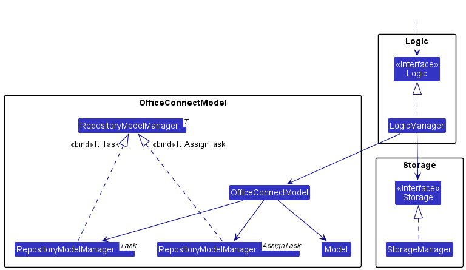
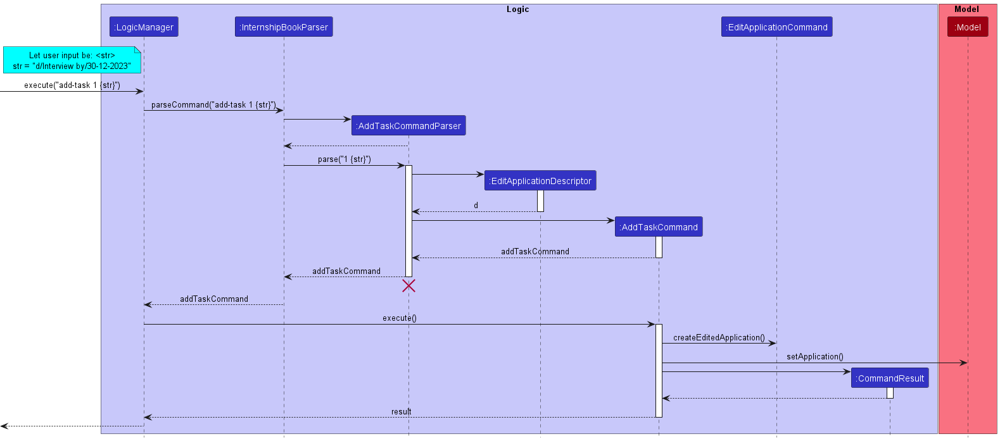
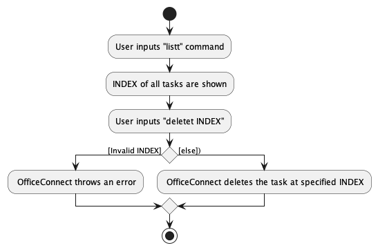
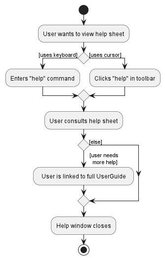
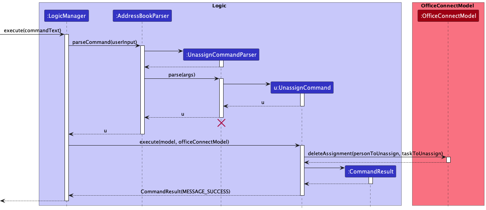
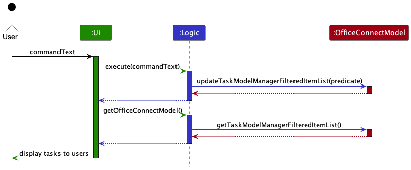
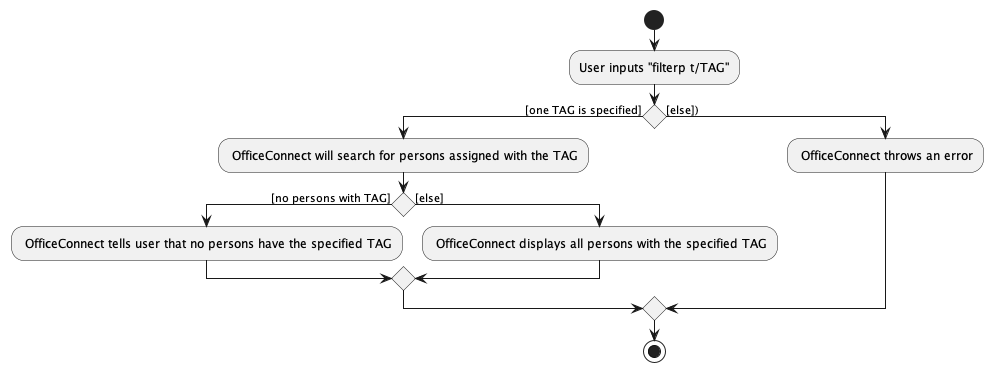

* Table of Contents 
{:toc}

--------------------------------------------------------------------------------------------------------------------

## 1. Introduction

### 1.1 Product Overview
OfficeConnect is a task management tool designed specifically for managerial role personnel at companies.

As managers in the current office environment, it is often not easy to grasp the workload of subordinates. This may result in:
* work overload among subordinates
* difficulties in coordinating tasks with a large number of employees
* inefficient, time-consuming administrative tasks like typing and sending emails.

OfficeConnect offers a solution to these problems by providing better visibility into subordinates’ workloads, allowing
managers to efficiently delegate tasks in an organised manner. 

### 1.2 Setting up, getting started

Refer to the guide [_Setting up and getting started_](SettingUp.md).

### 1.3 Acknowledgements

OfficeConnect is a brownfield Java project based on
the [AB3 project template](https://github.com/se-edu/addressbook-level3)
by [se-education.org](https://se-education.org).

* Libraries used include: [JavaFx](https://openjfx.io/), [Jackson](https://github.com/FasterXML/jackson),
* [JUnit5](https://junit.org/junit5/)

--------------------------------------------------------------------------------------------------------------------

### 1.4 Setting up, getting started

Refer to the guide [_Setting up and getting started_](SettingUp.md).

--------------------------------------------------------------------------------------------------------------------

## 2. Design

:bulb: **Tip:** The `.puml` files used to create diagrams in this document can be found in the [diagrams](https://github.com/AY2223S2-CS2103-F10-1/tp/tree/master/docs/diagrams) folder.
Refer to the [_PlantUML Tutorial_ at se-edu/guides](https://se-education.org/guides/tutorials/plantUml.html)
to learn how to create and edit diagrams.

### 2.1 Architecture

The ***Architecture Diagram*** given above explains the high-level design of the App.

Given below is a quick overview of main components and how they interact with each other.

#### 2.1.1 Main components of the architecture

**`Main`** has two classes called [`Main`](https://github.com/AY2223S2-CS2103-F10-1/tp/blob/master/src/main/java/seedu/address/Main.java)
and [`MainApp`](https://github.com/AY2223S2-CS2103-F10-1/tp/blob/master/src/main/java/seedu/address/MainApp.java).
It is responsible for,   At app launch: Initializes the components in the correct sequence, and connects them up with each other.   At shut down: Shuts down the components and invokes cleanup methods where necessary.
[**`Commons`**](#common-classes) represents a collection of classes used by multiple other components.

The rest of the App consists of four components.

* [**`UI`**](#22-ui-component): The UI of the App.
* [**`Logic`**](#23-logic-component): The command executor.
* [**`Model`**](#24-model-component): Holds the data of the App in memory.
* [**`Storage`**](#26-storage-component): Reads data from, and writes data to, the hard disk.

#### 2.1.2 How the architecture components interact with each other

The *Sequence Diagram* below shows how the components interact with each other for the scenario where the user issues
the command `deletep 1` to delete the person at index 1.

The *Sequence Diagram* below shows how the components interact with each other for the scenario where the user issues
the command `deletet 1` to delete the task at index 1.

Each of the four main components (excluding OfficeConnectModel), defines its *API* in an `interface` with the same name as the Component. implements its functionality using a concrete `{Component Name}Manager` class (which follows the corresponding API `interface` mentioned in the previous point).

For example, the `Logic` component defines its API in the `Logic.java` interface and implements its functionality
using the `LogicManager.java` class which follows the `Logic` interface. Other components interact with a given
component through its interface rather than the concrete class (reason: to prevent outside component's being coupled
to the implementation of a component), as illustrated in the (partial) class diagram below.

As can be seen from the diagram above, OfficeConnectModel is instead a class that contains two repository model managers, one used 
to keep track of tasks (i.e. `Task` objects) and the other used to keep track of the assignment of tasks to persons (i.e `AssignTask` objects).

### 2.2 UI component

The **API** of this component is specified in
[`Ui.java`](https://github.com/AY2223S2-CS2103-F10-1/tp/blob/master/src/main/java/seedu/address/ui/Ui.java)

The UI consists of a `MainWindow` that is made up of parts e.g.`CommandBox`, `ResultDisplay`, `PersonListPanel`,
`StatusBarFooter` etc. All these, including the `MainWindow`, inherit from the abstract `UiPart` class which captures
the commonalities between classes that represent parts of the visible GUI.

The `UI` component uses the JavaFx UI framework. The layout of these UI parts are defined in matching `.fxml`
files that are in the `src/main/resources/view` folder. For example, the layout of the [`MainWindow`](https://github.com/se-edu/addressbook-level3/tree/master/src/main/java/seedu/address/ui/MainWindow.java)
is specified in [`MainWindow.fxml`](https://github.com/se-edu/addressbook-level3/tree/master/src/main/resources/view/MainWindow.fxml)

The `UI` component,
executes user commands using the `Logic` component. listens for changes to `Model` data so that the UI can be updated with the modified data. keeps a reference to the `Logic` component, because the `UI` relies on the `Logic` to execute commands. depends on some classes in the `Model` component, as it displays `Person` object residing in the `Model`.

### 2.3 Logic component

**API** : [`Logic.java`](https://github.com/AY2223S2-CS2103-F10-1/tp/blob/master/src/main/java/seedu/address/logic/Logic.java)

Here's a (partial) class diagram of the `Logic` component:

How the `Logic` component works:

1. When `Logic` is called upon to execute a command, it uses the `AddressBookParser` class to parse the user command.
2. This results in a `Command` object (more precisely, an object of one of its subclasses e.g., `AddCommand`) which is
3. executed by the `LogicManager`.
4. The command can communicate with the `Model` or `OfficeConnectModel` when it is executed (e.g. to add a person or
5. add a task or add an assignment).
6. The result of the command execution is encapsulated as a `CommandResult` object which is returned from `Logic`.

The Sequence Diagram below illustrates the interactions within the `Logic` component for the `execute("deletep 1")`
API call, which deletes the person located at index one.

:information_source: **Note:** The lifeline for `DeleteCommandParser`
should end at the destroy marker (X) but due to a limitation of PlantUML, the lifeline reaches the end of diagram.

Here are the other classes in `Logic` (omitted from the class diagram above) that are used for parsing a user command:

How the parsing works:

When called upon to parse a user command, the `AddressBookParser` class creates an 
`XYZCommandParser`(`XYZ` is a placeholder for the specific command name e.g., `AddCommandParser`) which uses the 
other classes shown above to parse the user command and create a `XYZCommand` object (e.g., `AddCommand`) which the 
`AddressBookParser` returns back as a `Command` object. All `XYZCommandParser` classes (e.g., `AddCommandParser`, 
`DeleteCommandParser`, ...) inherit from the `Parser` interface so that they can be treated similarly where possible e.g, during testing.

### 2.4 Model component

**API** : [`Model.java`](https://github.com/AY2223S2-CS2103-F10-1/tp/blob/master/src/main/java/seedu/address/model/Model.java)

The `Model` component 
* Stores the address book data for persons i.e., all `Person` objects (which are contained in a `UniquePersonList` object). 
* Stores the currently 'selected' `Person` objects (e.g., results of a search query) as a separate _filtered_ list,
which is exposed to outsiders as an unmodifiable `ObservableList<Person>` that can be 'observed' e.g. 
the UI can be bound to this list so that the UI automatically updates when the data in the list changes. 
* Stores a `UserPref` object that represents the user’s preferences. This is exposed to the outside as a`ReadOnlyUserPref` 
object. 
* Does not depend on any of the other three components (as the `Model` represents data entities of the domain, they should make sense on their own without depending on other components)

:information_source: **Note:** An alternative (arguably, a more OOP)
model is given below. It has a `Tag` list in the `AddressBook`, which `Person` references. This allows `AddressBook`
to only require one `Tag` object per unique tag, instead of each `Person` needing their own `Tag` objects. 

### 2.5 OfficeConnectModel component

**API** : [`OfficeConnectModel.java`](https://github.com/AY2223S2-CS2103-F10-1/tp/blob/master/src/main/java/seedu/address/model/OfficeConnectModel.java)

* Stores the task list data and taskAssignment data i.e., all `task` and `assignTask` objects (which are contained in a `UniqueItemList` object). 
* Stores the currently 'selected' `Task` and `AssignTask` objects (e.g., results of a search query) as a separate _filtered_ list 
which is exposed to outsiders as an unmodifiable `ObservableList<Task>` and `ObservableList<AssignTask>` that can be 
'observed' e.g. the UI can be bound to this list so that the UI automatically updates when the data in the list change. 
* Does not depend on any of the other three components (as the `OfficeConnectModel` represents data entities of the domain, they should make sense on their own without depending on other components)

### 2.6 Storage component

**API** : [`Storage.java`](https://github.com/AY2223S2-CS2103-F10-1/tp/blob/master/src/main/java/seedu/address/storage/Storage.java)

Original AddressBook Storage Component

OfficeConnect Storage Component

The initial storage component was specifically designed to accommodate the address book model. However, OfficeConnect
necessitates the inclusion of two additional storage types, namely task storage and assignment storage.

To address this requirement, a new generic class called RepositoryStorage has been introduced to the storage component.
This addition allows for increased extensibility and flexibility in the storage component's functionality.

The enhanced design is extendable and also capable of supporting the integration of additional databases into the
application in the future, if required.

The `Storage` component saves address book data, task list data, task assignment data and user preference data in json format 
and reads them back into corresponding objects. It inherits from both `AddressBookStorage` and `UserPrefStorage`, which 
means it can be treated as either (if the functionality of only one is needed). It depends on some classes in the `Model`
and `OfficeConnectModel` component (because the `Storage` component's job is to save/retrieve objects that belong to `Model` and `OfficeConnectModel`)

### 2.7 Common classes

Classes used by multiple components are in the `seedu.addressbook.commons` package.

--------------------------------------------------------------------------------------------------------------------

## 3. Implementation
This section describes some noteworthy details on how certain features are implemented.
Notation: inputs placed in closed brackets [] are optional.

### 3.1 Adding a task
Syntax: `addt t/TITLE c/CONTENT st/STATUS [dl/DEADLINE]`  
Purpose: Allows users to add tasks into OfficeConnect.

#### 3.1.1 Implementation
The implementation of this feature is supported by `AddTaskCommand` and `AddTaskCommandParser`.
Below is a sequence diagram that illustrates how a user adds new tasks into OfficeConnect.  

#### 3.1.2 Design Considerations
**Aspect: Setting deadline as optional input**

* **Alternative 1 (current choice):** Deadline is optional.
  * Pros: Increase convenience for users, as they will have to key in one less input. Not all tasks may have a set deadline.
  * Cons: Users may be lazy to key in specific deadlines as it is optional

* **Alternative 2:** Make deadline compulsory
  * Pros: Easier to implement
  * Cons: Inconveniences users, as they have to key in one more input to create a task, especially if there is no set deadline 
  for the task and they have to create a dummy deadline just to create a task.

#### 3.1.3 Constraints:
**Title must be unique:**  
We felt that the title should be unique as it improves organisation and visual clarity for the user. By mandating unique
titles, we encourage users to be specific in the title(purpose) of the task (e.g. they will set title as
"Complete slides for Mr X" rather than "Complete Slides"), which will benefit them greatly, as they will be
able to clearly distinguish the purpose of each task just by looking at the title.  
Suppose that the title was not unique. Users might have many tasks with the same title, which would impair their ability
to distinguish between the tasks unless they read each of the task content individually. It would also impair visual
clarity when searching for tasks, as tasks with similar titles might clutter up the GUI.
Hence, our approach in mandating unique titles are geared towards improving organisation and visual clarity for users in
both the short and long term.

### 3.2 Deleting a task
Syntax: `deletet INDEX`  
Purpose: Allows users to delete the task at the specified index in OfficeConnect.

#### 3.2.1 Implementation
The implementation of this feature is supported by `ListTaskCommand`, `DeleteTaskCommand` and `DeleteTaskCommandParser`.
Below are the steps required to delete a task in OfficeConnect.  

Step 1: User keys in `listt`, which will display the index of all tasks.
The user can thus obtain the index of the task that they want to delete.

Step 2: User keys in `deletet INDEX` to delete the task at the specified index.
If the index is invalid, an error will be thrown.

Below is an activity diagram showcasing the 2 steps:  

#### 3.2.2 Design Considerations
**Aspect: Implementation of Delete Task Command**

* **Alternative 1 (current choice):** Users have to call `listt` to find the index of the task they wish to delete.
  * Pros: Increase convenience for users, as they do not have to remember the index of each task while being easier to implement.
  * Cons: Increases coupling within OfficeConnectModel, as any bug with `listt` could render users incapable of
    obtaining the index needed for `deletet`.

* **Alternative 2:** Allow users to key in the index of each task when creating tasks, after which they can
  use this index when deleting tasks
  * Pros: If the user remembers the index of each task, they will not need to call `listt`. Hence, it will be less
    troublesome for them to delete tasks as the number of steps required is reduced by one.
    Also reduces coupling, as `deletet` will not have to depend on `listt` to function properly.
  * Cons: The cons of this alternative lies in the difficulty of managing indexes when adding and deleting tasks.  
    If the user does not keep track of the indexes they have used for previous tasks, they may have to still
    call `listt` to find the index of the task they wish to delete or to find unused indexes to add tasks, which will not
    give it an advantage over the first alternative.  
    It would also be harder to keep track of invalid indexes. When tasks are deleted, their index should be invalid. Using
    this alternative, we would have to constantly update a list of invalid indexes when adding or deleting tasks, which
    would be troublesome and could lead to bugs. In alternative 1, all indexes are flushed to the front (i.e. first task
    has index 1, second task has index 2 etc.) and thus the invalid indexes can be easily obtained.
  
### 3.3 Find a Person's Assigned Task
Syntax: `findp NAME`  
Purpose: Allow users to search and review the list of tasks assigned to the specified person in OfficeConnect.

#### 3.3.1 Implementation
The implementation of this feature is supported by `FindCommand` and `FindCommandParser`.

Below is an activity diagram that illustrates the control flow for the Find feature.  

### 3.4 Find a Task's Assignees
Syntax: `findt TASKNAME`  
Purpose: Allow users to search and review the group of individuals assigned to the specified task in OfficeConnect.

#### 3.4.1 Implementation
The implementation of this feature is supported by `FindTaskCommand` and `FindTaskCommandParser`.

Below is an activity diagram that illustrates how a user finds who are assigned to a task.  

#### 3.4.2 Design Considerations

**Aspect: Form of query**

* **Alternative 1 (current choice):** Query using TASK_TITLE
    * Pros: More intuitive as users do not have to keep track of the list index of the tasks.
      Able to query for tasks that are already logged in OfficeConnect using the title of the task.
    * Cons: Length of commands are dependent on length of title. Users have to remember the name of the tasks.

* **Alternative 2:** Query using INDEX
    * Pros: Shorter command to type out.
    * Cons: Less intuitive and less user-friendly. Users would be forced to list all the tasks before being able
      to execute the findt command if the current display is empty.

### 3.5 Edit a Task
Syntax: `editt INDEX title/TITLE c/CONTENT st/STATUS`  
Purpose: Allow users to edit tasks that are currently listed in OfficeConnect.

#### 3.5.1 Implementation
The implementation of this feature is supported by `EditTaskCommand` and `EditTaskCommandParser`.

### 3.6 Assign a Task
Syntax: `assign pi/INDEX ti/INDEX`  
Purpose: Allows users to assign a person to a task in OfficeConnect.

#### 3.6.1 Implementation
The implementation of this feature is supported by `AssignCommand`, `AssignCommandParser`, `ListCommand`,
`ListTaskCommand`, `ListAllCommand`, `FindCommand` and `FindTaskCommand`. Below are the steps required to assign a task
to a person in OfficeConnect.  

Step 1: User executes `listall` to list all the people and tasks in OfficeConnect.
* Alternative steps to Step 1:
  * User executes `findp David` to search for David in the contact list followed by `listt` to lists all the tasks.
  * User executes `findt slides`to search for a task containing the word `slides` in its title followed by `listp`
    to list all the persons.
  * User executes `viewunassignedall` to list all the persons that have not been assigned to any tasks and all tasks
    that have not been assigned to any persons.
  * User executes `findp David` to search for David in the contact list followed by `viewunassignedt` to list all tasks
    that have not been assigned to any person.
  * User executes `findt slides` to search for a task containing the word `slides` in its title followed by 
    `viewunassignedp` to list all persons that have not been assigned to any tasks.
* After this step, the target task to assign and the target person to be assigned to said task will appear in the list
  of persons and tasks displayed.

Step 2: User executes `assign pi/1 ti/1` to assign the first task on the list of tasks to the first person on the list
of tasks.

The following activity diagram summarizes what happens when a user wants to execute an `assign` command:

#### 3.6.2 Design Considerations
**Aspect: Steps Leading to Execution of Assign Command**

* **Alternative 1 (current choice 1):** Users execute `listp` or `findp` to display a list of persons and `listt` or
  `findt` to display a list of tasks on the application.
  * Pros: Users can search for a specific person or task before assigning.
  * Cons: If `listp` and `listt` are used, users may have to scroll through a long list to search for the desired
    person or task. The results of `findp` and `findt` cannot be displayed simultaneously. Thus, if `findp` was executed
    to search for a person, the user will then have to execute `listt` to access the full list of tasks in order to
    identify the task that the user wants to be assigned to that person.

* **Alternative 2 (current choice 2):** Users can execute a command to display a list tasks that have not been
  assigned to any person or to display a people that have not been assigned to that task.
  * Pros: Users can easily view all the tasks that are currently unassigned at the same time, instead of having to execute
    `findt` to search for unassigned tasks one at a time.
  * Cons: None, because this is an additional feature proposed that will complement Alternative 1.

### 3.7 Help Window

Syntax: `help`
 
Purpose: Provides users with a bird's eye view of the various methods usable in OfficeConnect.

#### 3.7.1 Implementation

This window was made by the `HelpWindow` class, which ties in its respective `fxml` and `css` files to display the relevant UI to the user.
To provide the instructions to the user, a `HelpStrings` class is maintained to give instructions stored in lengthy strings.

A Help Window will be opened either by entering the `help` command, or by clicking on "Help" button in the toolbar.
The Activity Diagram below details the workflow of a user who wishes to access the HelpWindow. If the Help Window does not provide enough
information, the user can choose to view the comprehensive User Guide instead.

#### 3.7.2 Design Considerations

**Aspect: Contents of help window**

* **Alternative 1 (Current choice):** Display as a separate window, with concise details included in the sheet.
    * Pros: Serves as a quick reference for the user, without having to go online to view the full comprehensive User Guide.
    * Cons: Major updates in command implementations will have to be updated in the help sheet too, in addition to the online User Guide.

* **Alternative 2:** Provide the user with the link to access the online User Guide.
    * Pros: More comprehensive, able to give user the complete detailing of each command.
    * Cons: Troublesome, requires user to go online to view the User Guide. User may also be overwhelmed by length of guide.

**Aspect: Viewing of various command instructions**

* **Alternative 1 (Current choice):** Display all executable commands in a hierarchical tree, with description of method selected in a separate area.
    * Pros: Providing a hierarchical structure to the list of commands available. This provides users with more ease of visualising the various methods as different groups of commands.
    * Cons: More complex structures to be used when implementing the Ui of the help window. Restructuring of tree also may be necessary when big changes are made to structure of commands.

* **Alternative 2:** Display all executable commands in a list.
    * Pros: Adding/Restructuring of commands only involves deleting/modifying the line the command is on, no restructuring of the list needed
    * Cons: Design not too intuitive, user may need to eyeball through all the commands in order to find what he/she is looking for.

 

### 3.8 Unassigning a Task from a Person

Syntax: `unassign pi/PERSON_INDEX ti/TASK_INDEX`  
Purpose: Allows users to unassign a task from a person in OfficeConnect.

The following activity diagram summarizes what happens when a user executes a new command:

Below is a sequence diagram that illustrates how a user unassign a tasks from a person in the OfficeConnectModel. 

#### 3.8.1 Implementation

The implementation of this feature is supported by `UnassignTaskCommand` and `UnassignTaskCommandParser`.

#### 3.8.2 Design Considerations

**Aspect: Unassigning a task from a person**

- **Alternative 1 (current choice):** Unassign tasks using the index of the person and the index of the task.
    - Pros: Easier for users to locate the task and person they want to unassign, especially if the list of tasks or persons is long.
    - Cons: Requires users to first obtain the index of the task and person by listing them, which might increase the steps required for the user.

- **Alternative 2:** Unassign tasks using the task title and person name.
    - Pros: No need to obtain the index of the task and person, which could reduce the steps required for the user.
    - Cons: Task titles and person names might be long, making it more difficult for users to input the command. There could also be issues with names that are not unique.

### 3.9 List all tasks
Syntax: `listt`  
Purpose: Displays all tasks stored in OfficeConnect.

#### 3.9.1 Implementation
The implementation of this feature is supported by `OfficeConnectModel`.
Below is a sequence diagram that illustrates how a user can see all tasks stored in OfficeConnect.

### 3.10 Filter persons according to tag
Syntax: `filterp t/TAG`  
Purpose: Allows users to find all persons with the specified tag

#### 3.10.1 Implementation
The implementation of this feature is supported by `FilterCommand` and `FilterCommandParser`.
Below is an activity diagram that illustrates how a user finds all persons with the specified tag.

#### 3.10.2 Design Considerations
**Aspect: Number of tags that users can input**

* **Alternative 1 (current choice):** Only one tag is allowed.
  * Pros: Encourage users to be specific in the tag they are searching for. Easier implementation.
  * Cons: Users will have to use the command as many times as the number of tags they want to search.

* **Alternative 2:** Allow multiple tags
  * Pros: Allows users to search for more than one tag at once, which increases convenience and flexibility.
  * Cons: Could produce many search results which may clutter up the GUI (as opposed to searching for only one task). More prone to bugs.

### 3.11 Quickstart Window
Syntax: `quickstart`  
Purpose: Allows new users to better understand how OfficeConnect works.

#### 3.11.1 Implementation
Similar to Help Window in section 3.7, this window is maintained by `QuickstartWindow` class, which also maintains 
similarly named `fxml` and `css` to display the relevant quickstart information.

--------------------------------------------------------------------------------------------------------------------
## 4. Documentation, logging, testing, configuration, dev-ops

* [Documentation guide](Documentation.md)
* [Testing guide](Testing.md)
* [Logging guide](Logging.md)
* [Configuration guide](Configuration.md)
* [DevOps guide](DevOps.md)
--------------------------------------------------------------------------------------------------------------------
## 5. Appendix: Requirements

### 5.1 Product scope

**Target user profile**:
* Holds a managerial role
* Has a need to manage a significant number of subordinates
* Has a need to assign large number of tasks to subordinates
* Prefer desktop apps over other types
* Can type fast
* Prefers typing to mouse interactions
* Is reasonably comfortable using CLI apps

**Value proposition**:

* Manage tasks and contacts faster than a typical mouse/GUI driven app
* Able to view all upcoming tasks to be completed at one glance
* Allows efficient delegation of tasks to subordinates in an organised and centralised manner

### 5.2 User stories

Priorities: High (must have) - `* * *`, Medium (nice to have) - `* *`, Low (unlikely to have) - `*`

| Priority | As a …​         | I want to …​                                | So that I can…​                                                        |
|----------|-----------------|---------------------------------------------|------------------------------------------------------------------------|
| `* * *`  | new user        | see usage instructions                      | refer to instructions when I forget how to use the App                 |
| `* * *`  | manager         | add tasks                                   |                                                                        |
| `* * *`  | manager         | edit tasks                                  | keep the task updated with the most updated information                |
| `* * *`  | manager         | delete tasks                                | remove tasks that I no longer need                                     |
| `* * *`  | manager         | mark tasks as done and undone               | keep track of tasks that are completed                                 |
| `* * *`  | manager         | find tasks assigned to specific subordinate | better manage my subordinates workload                                 |
| `* * *`  | manager         | check all ongoing tasks available           | better delegate my tasks                                               |
| `* * *`  | manager         | assign tasks to a subordinate               | keep track of which subordinate is in charge of which task             |
| `* * *`  | manager         | unassign tasks from a subordinate           | assign this task to other subordinate                                  |
| `* * *`  | manager         | add a subordinate                           |                                                                        |
| `* * *`  | manager         | delete a subordinate                        | remove subordinates that I no longer need                              |
| `* * *`  | manager         | find a subordinate by name                  | locate details of persons without having to go through the entire list |
| `* * *`  | manager         | filter subordinates based on their department(tag) | locate subordinates based on their department(tag)                     |
| `* * *`  | manager         | view assigned tasks and persons             | have an overview of tasks and persons with assigned tasks              |
| `* * *`  | manager         | view unassigned tasks and persons           | have an overview of tasks and persons without assigned tasks           |

#### 5.3.1 Example Usage

> addt t/Draft proposal c/Complete proposal by 1st March st/false

- New task added: Draft proposal; Status: Undone; Content: Complete proposal by 1st March

> listt

1. Finish report; Status: Undone; Content: Complete report for Mr Chan by 2nd March
2. Send email to team; Status: Done; Content: Send an email regarding office hours

> findt report

1. Finish report

> deletet 1

- Deleted task: Draft proposal; Status: Undone; Content: Complete proposal by 1st March

> exit

In the example above, the user story is clearly defined at the top, followed by the acceptance criteria for the feature.
Below that, we have a series of example usages, shown in a code editor block to provide clarity and context for how the
feature would work in practice.

*{More to be added}*

### 5.4 Use cases

:information_source: **Note:** For all use cases below, the **System** is the `OfficeConnect` and the
**Actor** is the `user`, unless specified otherwise.

---
#### 5.4.1 Use case 1: Add a person

**Main Success Scenario (MSS):**

1. User requests to add a person.

2. OfficeConnect adds the person to the contact list.

3. OfficeConnect informs user has been successfully added.

   Use case ends.

**Extensions**

* 1a. User enters incomplete or invalid data.

    * 1a1. OfficeConnect shows an error message.

      Use case ends.

---
#### 5.4.2 Use case 2: Delete a person

**Main Success Scenario (MSS):**

1. User requests to list persons.

2. OfficeConnect shows a list of persons.

3. User requests to delete a specific person in the list.

4. OfficeConnect deletes the person.

   Use case ends.

**Extensions**

* 2a. The list is empty.

  Use case ends.

* 3a. The given index is invalid.

    * 3a1. OfficeConnect shows an error message.

      Use case resumes at step 2.

---
#### 5.4.3 Use case 3: Delete a task

**Main Success Scenario (MSS):**

1. User requests to list tasks.

2. OfficeConnect shows a list of tasks.

3. User requests to delete a specific task in the list.

4. OfficeConnect deletes the task.

   Use case ends.

**Extensions**

* 2a. The list is empty.

  Use case ends.

* 3a. The given index is invalid.

    * 3a1. OfficeConnect shows an error message.

      Use case resumes at step 2.

---
#### 5.4.4 Use case 4: Assign a task to a person

**Main Success Scenario (MSS):**

1. User requests to list all persons.

2. OfficeConnect shows a list of persons.

3. User requests to list all tasks.

4. OfficeConnect shows a list of tasks.

5. User requests to assign a specific task to a specific person.

6. OfficeConnect assigns the task to the person.

   Use case ends.

**Extensions**

* 1a. User requests to find persons according to their name.
  
  Use case resumes at step 2.

* 1b. User requests to list all persons and tasks at the same time.

  * 1b1. OfficeConnect shows a list of tasks and persons.
  
    Use case resumes at step 5.

* 2a. The list is empty.

  Use case ends.

* 3a. User requests to find tasks according to their title.

  User case resumes at step 4. 

* 4a. The list is empty.

  Use case ends.

* 5a. The given index is invalid.

    * 5a1. OfficeConnect shows an error message.

      Use case resumes at step 2.

---
#### 5.4.5 Use case 5: Remove assignment of task from a person

**Main Success Scenario (MSS):**

1. User requests to list persons.

2. OfficeConnect shows a list of persons.

3. User requests to list tasks.

4. OfficeConnect shows a list of tasks.

5. User requests to unassign a specific task from a specific person.

6. OfficeConnect unassign the task from the person.

   Use case ends.

**Extensions**

* 2a. The list is empty.

  Use case ends.

* 4a. The list is empty.

  Use case ends.

* 5a. The given index is invalid.

    * 5a1. OfficeConnect shows an error message.

      Use case resumes at step 2.

---

#### 5.4.6 Use case 6: Consulting Help Window

**Main Success Scenario (MSS):**

1. User requests for help.

2. OfficeConnect opens help interface with dedicated help instructions.

3. User navigates to command he wishes to get help on.

4. OfficeConnect presents information on said command to user.

5. User reads closes window after retrieving required info.

   Use case ends.

**Extensions**

* 4a. User requests for more info on command.

    * 4a1. Help interface provides link to user guide.

    * 4a2. User retrieves user guide providing more detail on command.

      Use case resumes at step 5.

---
#### 5.4.7 Use case 7: Add a task

**Main Success Scenario (MSS):**

1. User requests to add a task.

2. OfficeConnect adds the task to the task list.

3. OfficeConnect informs user has been successfully added.

   Use case ends.

**Extensions**

* 1a. User enters incomplete or invalid data.

    * 1a1. OfficeConnect shows an error message.

      Use case ends.

---
#### 5.4.8 Use case 8: List all tasks

**Main Success Scenario (MSS):**

1. User requests for a list of all tasks.

2. OfficeConnect displays all tasks stored.

   Use case ends.

---
#### 5.4.9 Use case 9: Mark a task

**Main Success Scenario (MSS):**

1. User requests for a list of all tasks.

2. OfficeConnect displays all tasks stored.

3. User requests to mark a specific task.

4. OfficeConnect marks the task as completed.

   Use case ends.

**Extensions**

* 1a. User requests to find tasks according to their titles.
  
  Use case resumes at step 2.

* 2a. The list is empty.

  Use case ends.

* 3a. The given index is invalid.

    * 3a1. OfficeConnect shows an error message.

      Use case resumes at step 2.

* 3b. The task at the given index is already marked as completed.

    * 3b1. OfficeConnect shows an error message.

      Use case ends.

---
#### 5.4.10 Use case 10: Unmark a task

**Main Success Scenario (MSS):**

1. User requests for a list of all tasks.

2. OfficeConnect displays all tasks stored.

3. User requests to unmark a specific task.

4. OfficeConnect unmarks the task as uncompleted.

   Use case ends.

**Extensions**

* 2a. The list is empty.

  Use case ends.

* 3a. The given index is invalid.

    * 3a1. OfficeConnect shows an error message.

      Use case resumes at step 2.

* 3b. The task at the given index is already marked as uncompleted.

    * 3b1. OfficeConnect shows an error message.

      Use case ends.

---
#### 5.4.11 Use case 11: Find tasks assigned to an individual

**Main Success Scenario (MSS):**

1. User requests for the list of tasks assigned to a specific person.

2. OfficeConnect displays all the tasks assigned to the person.

   Use case ends.

**Extensions**

* 2a. The list is empty.

  Use case ends.

---
#### 5.4.12 Use case 12: Find the group of individuals assigned to a task

**Main Success Scenario (MSS):**

1. User requests for the list of persons assigned to a specific task.

2. OfficeConnect displays all the individuals assigned to the task.

   Use case ends.

**Extensions**

* 2a. The list is empty.

  Use case ends.

---
#### 5.4.13 Use case 13: Filter persons based on tag

**Main Success Scenario (MSS):**

1. User requests to filter persons based on a specific tag

2. OfficeConnect displays all persons assigned to the tag

   Use case ends.

**Extensions**

* 1a. The tag is invalid
  
  * 1a1. OfficeConnect throws an error.

    Use case ends.
  
---
#### 5.4.14 Use case 14: View all assigned persons and tasks

**Main Success Scenario (MSS):**

1. User requests to view all assigned persons and tasks.
2. System displays a list of all assigned persons and tasks.

   Use case ends.

---
#### 5.4.15 Use case 15: View assigned persons

**Main Success Scenario (MSS):**

1. User requests to view assigned persons.
2. System displays a list of assigned persons.

   Use case ends.

---
#### 5.4.16 Use case 16: View assigned tasks

**Main Success Scenario (MSS):**

1. User requests to view assigned tasks.
2. System displays a list of assigned tasks.

   Use case ends.

---
#### 5.4.17 Use case 17: View a person's details

**Main Success Scenario (MSS):**

1. User requests to view a person's details by specifying their index.
2. System displays the details of the specified person.

   Use case ends.

---
#### 5.4.18 Use case 18: View a task's details

**Main Success Scenario (MSS):**

1. User requests to view a task's details by specifying its index.
2. System displays the details of the specified task.

   Use case ends.

---
#### 5.4.19 Use case 19: View all unassigned persons and tasks

**Main Success Scenario (MSS):**

1. User requests to view all unassigned persons and tasks.
2. System displays a list of all unassigned persons and tasks.

   Use case ends.

---
#### 5.4.20 Use case 20: View unassigned persons

**Main Success Scenario (MSS):**

1. User requests to view unassigned persons.
2. System displays a list of unassigned persons.

   Use case ends.

---
#### 5.4.21 Use case 21: View unassigned tasks

**Main Success Scenario (MSS):**

1. User requests to view unassigned tasks.
2. System displays a list of unassigned tasks.

   Use case ends.

---
### 5.5 Non-Functional Requirements

1. Performance: The system shall respond to user input within 2 seconds, even under peak load conditions.
2. Maintainability: The system shall be designed to allow for easy maintenance and updates, with clear documentation
   and modular architecture.
3. Compatibility: The system shall be compatible to operating systems with java 11 runtime (e.g. Windows, MacOS, Linux).
4. Interoperability: The system shall be able to exchange data with other systems using standard formats and protocols.
5. Usability: The system shall have a user interface that is intuitive and easy to use, with a learning curve of no more
   than 2 hours for a new user.

### 5.6 Glossary

#### *A*
* **addp**: Add a new person to the list.
* **addt**: Add a new task to the list.
* **assign**: Assign a task to a person.

#### *D*
* **deletep**: Delete a person from the list.
* **deletet**: Delete a task from the list.

#### *E*
* **editp**: Edit the details of a person.
* **editt**: Edit the details of a task.

#### *F*
* **filterp**: Filter persons by a specific tag.
* **findp**: Search for a person by their name.
* **findt**: Search for a task by its title.

#### *H*
* **help**: Display help information.

#### *L*
* **listall**: List all persons and tasks.
* **listp**: List all persons.
* **listt**: List all tasks.

#### *M*
* **mark**: Mark a task as completed.
* **Mainstream OS**: Windows, Linux, Unix, OS-X

#### *P*
* **pi**: View a person's details.
* **Private contact detail**: A contact detail that is not meant to be shared with others
* **quickstart**: Launch the application with sample data.

#### *T*
* **ti**: View a task's details.

#### *U*
* **unassign**: Unassign a task from a person.
* **unmark**: Unmark a completed task.

#### *V*
* **viewassignedall**: View all assigned persons and tasks.
* **viewassignedp**: View assigned persons.
* **viewassignedt**: View assigned tasks.
* **viewunassignedall**: View all unassigned persons and tasks.
* **viewunassignedp**: View unassigned persons.
* **viewunassignedt**: View unassigned tasks.

--------------------------------------------------------------------------------------------------------------------

## 6. Appendix: Instructions for manual testing

Given below are instructions to test the app manually.

:information_source: **Note:** These instructions only provide a starting
point for testers to work on;
testers are expected to do more *exploratory* testing.

### 6.1 Launch and shutdown

1. Initial launch

   1. Download the jar file and copy into an empty folder
   2. Double-click the jar file Expected: Shows the GUI with a set of sample contacts and sample tasks. The window size may not be
      optimum.

2. Saving window preferences

   1. Resize the window to an optimum size. Move the window to a different location. Close the window.
   2. Re-launch the app by double-clicking the jar file. 
      Expected: The most recent window size and location is retained.

3. _{ more test cases …​ }_

### 6.2 Deleting a person

1. Deleting a person while all persons are being shown

   1. Prerequisites: List all persons using the `listp` command. Multiple persons in the list.
   2. Test case: `deletep 1` 
      Expected: First contact is deleted from the list. Details of the deleted contact shown in the status message.
      Timestamp in the status bar is updated.
   3. Test case: `deletep 0` 
      Expected: No person is deleted. Error details shown in the status message. Status bar remains the same.
   4. Other incorrect delete commands to try: `deletep`, `deletep x` (where x is larger than the list size) 
      Expected: Similar to previous.

### 6.3 Assigning a task to a person

1. Assigning a task to a person while all tasks and persons are being shown

   1. Prerequisites: List all persons and tasks using the `listall` command. Multiple tasks and persons
      in the list.
   2. Test case: `assign pi/1 ti/1` 
      Expected: Details of the assigned person and task shown in the status message. The task assigned will
      be shown when after using `findp NAME`, where `NAME` is the full name of the first person in the list.  
      * Follow-up test case: `listall`, followed by `assign pi/1 ti/1` 
        Expected: Error details shown in status message indicating that the first person has already been 
        assigned to the first task.
   3. Test case: `assign pi/1` 
      Expected: No tasks or persons are assigned. Error details shown in status message.
   4. Other incorrect assign commands to try: `assign`, `assign 1 1`, `assign pi/x ti/y` (where x or y is
      larger than the number of persons or tasks contained in the list displayed) 
      Expected: similar to previous.

### 6.4 Marking a task as completed

1. Marking a task that has not been assigned to any persons as completed

   1. Prerequisites: List all tasks using the `listt` command. At least one task in the list. First task
      has not been assigned to any person, which can be verified by using `findt TITLE` (where `TITLE` is
      the title of the first task) which should display an empty list. First task is currently not marked as
      completed (red cross appears below task).
   2. Test case: `mark 1` 
      Expected: Details of the task that is marked shown in the status message. A green tick will appear
      under the task.
   3. Test case: `mark 0` 
      Expected: No tasks are marked. Error details shown in status message.
   4. Other incorrect mark commands to try: `mark`, `mark x` (where x is larger than the list size).
      Expected: Similar to previous.

2. Marking a task that has been assigned to one or more persons as completed

   1. Prerequisites: Find persons assigned to a task using the `findt TITLE` (where `TITLE` is the title of 
      a task). At least one person in the list. Task is not marked as completed (red cross appears below task).
   2. Test case: `mark 1` 
      Expected: Details of the task that is marked shown in the status message. A green tick will appear under the
      task. The progress indicator of the persons assigned to this task will be updated.

### 6.5 Unmarking a task as not completed

1. Unmarking a task that has not been assigned to any persons as not completed yet

   1. Prerequisites: List all tasks using the `listt` command. At least one task in the list. First task
      has not been assigned to any person, which can be verified by using `findt TITLE` (where `TITLE` is
      the title of the first task) which should display an empty list. First task is currently marked as
      completed (green tick appears below task).
   2. Test case: `ummark 1` 
      Expected: Details of the task that is unmarked shown in the status message. A red cross will appear
      under the task.
   3. Test case: `unmark 0` 
      Expected: No tasks are unmarked. Error details shown in status message.
   4. Other incorrect unmark commands to try: `unmark`, `unmark x` (where x is larger than the list size).
      Expected: Similar to previous.

2. Unmarking a task that has been assigned to one or more persons as not completed yet

   1. Prerequisites: Find persons assigned to a task using the `findt TITLE` (where `TITLE` is the title of
      a task). At least one person in the list. Task is marked as completed (red cross appears below task).
   2. Test case: `unmark 1` 
      Expected: Details of the task that is unmarked shown in the status message. A red cross will appear under the
      task. The progress indicator of the persons assigned to this task will be updated.

### 6.6 Adding a task

1. Adding a task with no deadline
   1. Prerequisites: There are no tasks with the same title present. 
   2. Test case: `addt t/Project X c/Complete slides for Mr X st/false` 
      Expected: Details of the task that is added is shown in the status message. A new task will appear in the taskbar of the GUI.
   3. Test case: `addt t/Project X c/Complete slides for Mr X st/hello` 
      Expected: No tasks are added. Error details shown in status message.
   4. Other incorrect add task commands to try: `addt t/Project X c/Complete slides for Mr X st/INPUT`, where INPUT is anything that is not true/false.
      Expected: Similar to previous.

2. Adding a task with deadline.
   1. Prerequisites: There are no tasks with the same title present.
   2. Test case: `addt t/Project X c/Complete slides for Mr X st/false dl/2023-01-01` 
      Expected: Details of the task that is added is shown in the status message. A new task will appear in the taskbar of the GUI.
   3. Test case: `addt t/Project X c/Complete slides for Mr X st/false dl/2023-01-01 02:05:00` 
      Expected: Details of the task that is added is shown in the status message. A new task will appear in the taskbar of the GUI.
   4. Test case: `addt t/Project X c/Complete slides for Mr X st/false dl/2023-01-01 02:05:0` 
      Expected: No tasks are added. Error details shown in status message.
   5. Other incorrect add task commands to try: `addt t/Project X c/Complete slides for Mr X st/false dl/2023-01-01 005:0` , or any input with incorrect datetime format (datetime format should be YYYY-MM-DD HH-MM-SS, where HH-MM-SS is optional).
      Expected: Similar to previous
    
### 6.7 Deleting a task

1. Deleting a task while all task are being shown

  1. Prerequisites: List all persons using the `listt` command. Multiple persons in the list.
  2. Test case: `deletet 1` 
     Expected: First task is deleted from the list. Details of the deleted task shown in the status message.
  3. Test case: `deletet 0` 
     Expected: No task is deleted. Error details shown in the status message. Status bar remains the same.
  4. Other incorrect delete task commands to try: `deletet`, `deletet x` (where x is larger than the list size) 
     Expected: Similar to previous.

### 6.8 Listing all tasks 

1. Listing all tasks
   1. Prerequisites: None
   2. Test case: `listt`
      Expected: All tasks stored in OfficeConnect are listed. "Listed all task" shown in status message.

### 6.9 Filtering persons by tag

1. There are persons in OfficeConnect with the specified tag.
   1. Prerequisites: Only one tag can be specified. 
   2. Test case: `filterp tag/Logistics`  
      Expected: All persons with the tag are displayed. "Filtered all persons with the tag: [tag]" shown in status message.
   3. Test case: `filterp `  
      Expected: No changes in GUI. Error details shown in status message.
   4. Other incorrect filter persons commands to try: `filterp tag/`) 
      Expected: Similar to previous.

2. There are no persons in OfficeConnect with the specified tag.
   1. Prerequisites: Only one tag can be specified.
   2. Test case: `filterp tag/Logistics`  
      Expected: No persons are displayed. "There are no persons with the tag: [tag]" shown in status message.
   3. Test case: `filterp `  
      Expected: No changes in GUI. Error details shown in status message.
   4. Other incorrect filter persons commands to try: `filterp tag/`) 
      Expected: Similar to previous.

### 6.9 Viewing assigned and unassigned tasks and persons

  1. There are assigned tasks and persons in OfficeConnect.
     1. Prerequisites: There are tasks and persons with assignments.
     2. Test case: `viewassignedall`  
        Expected: All assigned tasks and persons are displayed. "Displayed all assigned tasks and persons" shown in status message.
     3. Test case: `viewassignedp`  
        Expected: All assigned persons are displayed. "Displayed all assigned persons" shown in status message.
     4. Test case: `viewassignedt`  
        Expected: All assigned tasks are displayed. "Displayed all assigned tasks" shown in status message.

  2. There are no assigned tasks and persons in OfficeConnect.
     1. Prerequisites: There are no tasks and persons with assignments.
     2. Test case: `viewassignedall`  
        Expected: No tasks or persons are displayed. "There are no assigned tasks or persons" shown in status message.
     3. Test case: `viewassignedp`  
        Expected: No persons are displayed. "There are no assigned persons" shown in status message.
     4. Test case: `viewassignedt`  
        Expected: No tasks are displayed. "There are no assigned tasks" shown in status message.

     3. There are unassigned tasks and persons in OfficeConnect.
        1. Prerequisites: There are tasks and persons without assignments.
        2. Test case: `viewunassignedall`  
           Expected: All unassigned tasks and persons are displayed. "Displayed all unassigned tasks and persons" shown in status message.
     3. Test case: `viewunassignedp`  
        Expected: All unassigned persons are displayed. "Displayed all unassigned persons" shown in status message.
     4. Test case: `viewunassignedt`  
        Expected: All unassigned tasks are displayed. "Displayed all unassigned tasks" shown in status message.

  4. There are no unassigned tasks and persons in OfficeConnect.
     1. Prerequisites: There are no tasks and persons without assignments.
     2. Test case: `viewunassignedall`  
        Expected: No tasks or persons are displayed. "There are no unassigned tasks or persons" shown in status message.
     3. Test case: `viewunassignedp`  
        Expected: No persons are displayed. "There are no unassigned persons" shown in status message.
     4. Test case: `viewunassignedt`  
        Expected: No tasks are displayed. "There are no unassigned tasks" shown in status message.

### 6.10 Viewing task and person details

  1. Task and person details are available in OfficeConnect.
     1. Prerequisites: The specified task and person indices are valid.
     2. Test case: `ti INDEX` (replace INDEX with a valid task index)  
        Expected: Task details are displayed. "Displayed task details for task at index: [INDEX]" shown in status message.
     3. Test case: `pi INDEX` (replace INDEX with a valid person index)  
        Expected: Person details are displayed. "Displayed person details for person at index: [INDEX]" shown in status message.

  2. Task or person details are not available in OfficeConnect.
     1. Prerequisites: The specified task or person indices are invalid.
     2. Test case: `ti INDEX` (replace INDEX with an invalid task index)  
        Expected: No task details are displayed. "Task index is invalid" shown in status message.
     3. Test case: `pi INDEX` (replace INDEX with an invalid person index)  
        Expected: No person details are displayed. "Person index is invalid" shown in status message.
