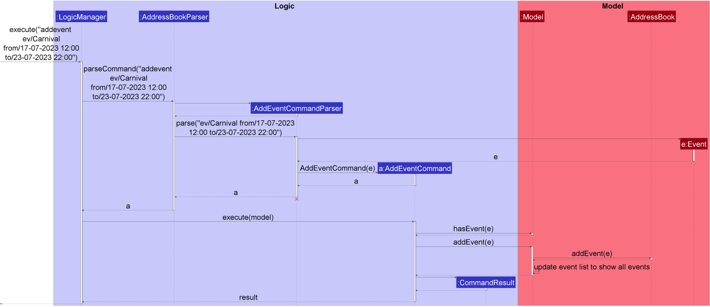
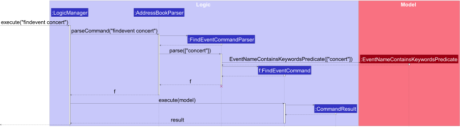
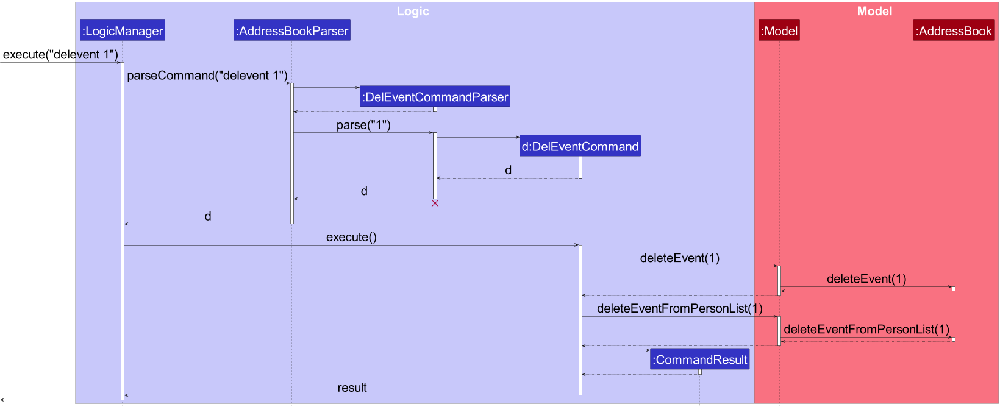
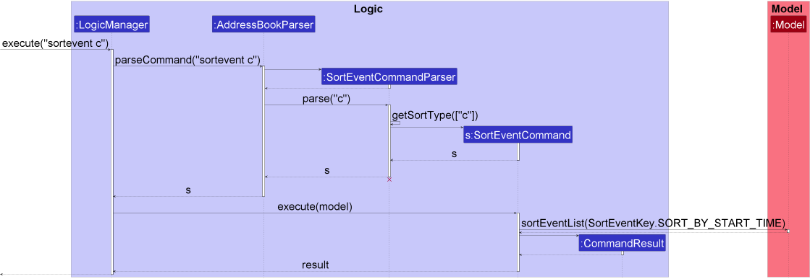
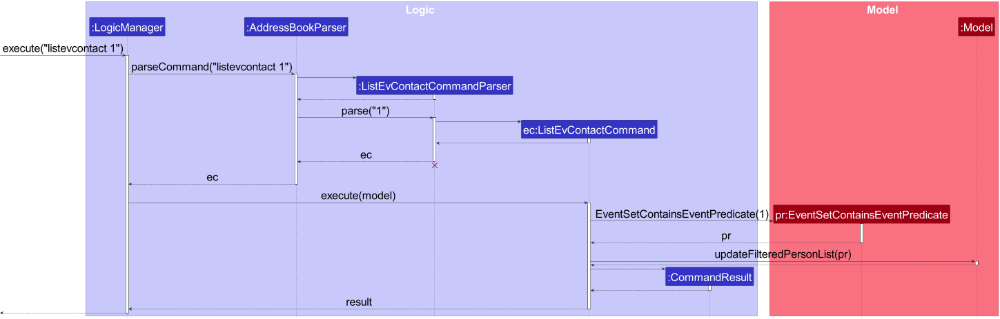

- Table of Contents
{:toc}

---

## **Acknowledgements**

- This project is based on the AddressBook-Level3 project created by the SE-EDU initiative.

---

## **Setting up, getting started**

Refer to the guide [_Setting up and getting started_](SettingUp.md).

---

## **Design**

:bulb: **Tip:** The `.puml` files used to create diagrams in this document can be found in the [diagrams](https://github.com/AY2223S2-CS2103-W16-3/tp/tree/master/docs/diagrams) folder. Refer to the [_PlantUML Tutorial_ at se-edu/guides](https://se-education.org/guides/tutorials/plantUml.html) to learn how to create and edit diagrams.

### Architecture

The **_Architecture Diagram_** given above explains the high-level design of the App.

Given below is a quick overview of main components and how they interact with each other.

**Main components of the architecture**

**`Main`** has two classes called [`Main`](https://github.com/AY2223S2-CS2103-W16-3/tp/blob/master/src/main/java/seedu/address/Main.java) and [`MainApp`](https://github.com/AY2223S2-CS2103-W16-3/tp/blob/master/src/main/java/seedu/address/MainApp.java). It is responsible for,

- At app launch: Initializes the components in the correct sequence, and connects them up with each other.
- At shut down: Shuts down the components and invokes cleanup methods where necessary.

[**`Commons`**](#common-classes) represents a collection of classes used by multiple other components.

The rest of the App consists of four components.

- [**`UI`**](#ui-component): The UI of the App.
- [**`Logic`**](#logic-component): The command executor.
- [**`Model`**](#model-component): Holds the data of the App in memory.
- [**`Storage`**](#storage-component): Reads data from, and writes data to, the hard disk.

**How the architecture components interact with each other**

The _Sequence Diagram_ below shows how the components interact with each other for the scenario where the user issues the command `delete 1`.

Each of the four main components (also shown in the diagram above),

- defines its _API_ in an `interface` with the same name as the Component.
- implements its functionality using a concrete `{Component Name}Manager` class (which follows the corresponding API `interface` mentioned in the previous point.

For example, the `Logic` component defines its API in the `Logic.java` interface and implements its functionality using the `LogicManager.java` class which follows the `Logic` interface. Other components interact with a given component through its interface rather than the concrete class (reason: to prevent outside component's being coupled to the implementation of a component), as illustrated in the (partial) class diagram below.

The sections below give more details of each component.

### UI component

The **API** of this component is specified in [`Ui.java`](https://github.com/AY2223S2-CS2103-W16-3/tp/blob/master/src/main/java/seedu/address/ui/Ui.java).

The user interface (UI) of the system is composed of a `MainWindow` that is made up of various parts such as `CommandBox`, `ResultDisplay`, `PersonListPanel`, `EventListPanel`, `StatusBarFooter` etc. All these, including the `MainWindow`, inherit from the abstract `UiPart` class which captures the commonalities among classes that represent parts of the visible GUI.

The `UI` component uses the JavaFx UI framework. The layout of these UI parts are defined in matching `.fxml` files that are in the `src/main/resources/view` folder. For example, the layout of the [`MainWindow`](https://github.com/AY2223S2-CS2103-W16-3/tp/blob/master/src/main/java/seedu/address/ui/MainWindow.java) is specified in [`MainWindow.fxml`](https://github.com/AY2223S2-CS2103-W16-3/tp/blob/master/src/main/resources/view/MainWindow.fxml).

The `UI` component,

- executes user commands by interacting with the `Logic` component.
- listens for changes to `Model` data and updates the UI with the modified data accordingly.
- holds a reference to the `Logic` component, because the `UI` relies on the `Logic` to execute commands.
- relies on some classes in the `Model` component, as it displays `Person` and `Event` object residing in the `Model`.

### Logic component

**API** : [`Logic.java`](https://github.com/AY2223S2-CS2103-W16-3/tp/blob/master/src/main/java/seedu/address/logic/Logic.java)

Here's a (partial) class diagram of the `Logic` component:

How the `Logic` component works:

1. When `Logic` is called upon to execute a command, it uses the `AddressBookParser` class to parse the user command.
1. This results in a `Command` object (more precisely, an object of one of its subclasses e.g., `AddCommand`) which is executed by the `LogicManager`.
1. The command can communicate with the `Model` when it is executed (e.g. to add a person).
1. The result of the command execution is encapsulated as a `CommandResult` object which is returned back from `Logic`.

The Sequence Diagram below illustrates the interactions within the `Logic` component for the `execute("delete 1")` API call.

:information_source: **Note:** The lifeline for `DeleteCommandParser` should end at the destroy marker (X) but due to a limitation of PlantUML, the lifeline reaches the end of diagram.

Here are the other classes in `Logic` (omitted from the class diagram above) that are used for parsing a user command:

How the parsing works:

- When called upon to parse a user command, the `AddressBookParser` class creates an `XYZCommandParser` (`XYZ` is a placeholder for the specific command name e.g., `AddCommandParser`) which uses the other classes shown above to parse the user command and create a `XYZCommand` object (e.g., `AddCommand`) which the `AddressBookParser` returns back as a `Command` object.
- All `XYZCommandParser` classes (e.g., `AddCommandParser`, `DeleteCommandParser`, ...) inherit from the `Parser` interface so that they can be treated similarly where possible e.g, during testing.

### Model component

**API** : [`Model.java`](https://github.com/AY2223S2-CS2103-W16-3/tp/blob/master/src/main/java/seedu/address/model/Model.java)

The `Model` component,

- stores the address book data i.e., all `Person` (which are contained in a `UniquePersonList` object) and `Event` (which are contained in a `UniqueEventList` object) objects.
- stores the currently 'selected' `Person` objects (e.g., results of a search query) as a separate _filtered_ list which is exposed to outsiders as an unmodifiable `ObservableList<Person>` that can be 'observed' e.g. the UI can be bound to this list so that the UI automatically updates when the data in the list change.
- stores the currently 'selected' `Event` objects, similar to how the currently 'selected' `Person` objects are stored and updated. It is stored as an unmodifiable `ObservableList<Event>`.
- stores a `UserPref` object that represents the user’s preferences. This is exposed to the outside as a `ReadOnlyUserPref` objects.
- does not depend on any of the other three components (as the `Model` represents data entities of the domain, they should make sense on their own without depending on other components).

### Storage component

**API** : [`Storage.java`](https://github.com/AY2223S2-CS2103-W16-3/tp/blob/master/src/main/java/seedu/address/storage/Storage.java)

The `Storage` component,

- can save both address book data and user preference data in json format, and read them back into corresponding objects.
- inherits from both `AddressBookStorage` and `UserPrefStorage`, which means it can be treated as either one (if only the functionality of only one is needed).
- depends on some classes in the `Model` component (because the `Storage` component's job is to save/retrieve objects that belong to the `Model`).

### Common classes

Classes used by multiple components are in the `seedu.addressbook.commons` package.

---

## **Implementation**

This section describes some noteworthy details on how certain features are implemented.

### \[Implemented] Add event feature

#### Current Implementation

Adding an event is a feature that uses the command `addevent ev/EVENT_NAME from/EVENT_START_DATE_TIME to/EVENT_END_DATE_TIME`.

The following sequence diagram shows how the add event operation works.

This operation is similar to that of adding a person. Adding an event involves calling `Model#addEvent(Event)`, which in turn calls `AddressBook#addEvent(Event)` to add the Event object to the existing `AddressBook`.

### \[Implemented] Find event feature

#### Current Implementation

Finding an event is a feature that uses the command `findevent KEYWORD [MORE_KEYWORDS]`. The implementation of `findevent` is similar to the `find` implementation but specific to events.
Below is the sequence diagram detailing how the `findevent` operation works.

Following the same initial steps of parsing commands, searching for an event involves further parsing the keywords into a `EventNameContainsKeywordsPredicate` object.
This `EventNameContainsKeywordsPredicate` object is used to instantiate a `FindEventCommand` object.
The `FindEventCommand` object is then executed in `LogicManager#execute` through `FindEventCommand#execute` which returns the output of the command.

### \[Implemented] Edit event feature

#### Current Implementation

Editing an event is a feature that uses the command `editevent EVENT_INDEX [ev/EVENT_NAME] [from/DATETIME] [to/DATETIME]`. The following activity diagram shows how the edit event operation works when given valid parameters or invalid parameters.

The event at the displayed list's `EVENT_INDEX` is denoted as `eventToEdit`. The edited version is denoted as `editedEvent`. 

Editing an event involves calling `Model#setEvent(eventToEdit, editedEvent)`, which in turn calls `AddressBook#setEvent(eventToEdit, editedEvent)` to edit the specified event, `eventToEdit`, in the `AddressBook`.

Additionally, this operation involves searching through all `Person` objects in the `AddressBook` and editing the specified event, `eventToEdit`. This is done by calling `Model#setEventFromPersonList(eventToEdit, editedEvent)`, which in turn calls `AddressBook#setEventFromPersonList(eventToEdit, editedEvent)`.

The `setEventFromPersonList` method will check through the full list of `Person` objects (i.e., not just the filtered list on display, if it is filtered) in order to completely edit the specified event in the `AddressBook`.

### \[Implemented] Delete event feature

#### Current Implementation

Deleting an event is a feature that uses the command `delevent [EVENT_INDEX]`. The following sequence diagram shows how the delete event operation works.

This operation is similar to that of deleting a person. Deleting an event involves calling `Model#deleteEvent(1)`, which in turn calls `AddressBook#deleteEvent(1)` to delete the event at index `1` in the `AddressBook`.

Additionally, this operation involves searching through all `Person` objects in the `AddressBook` and deleting the event at index `1`. This is done by calling `Model#deleteEventFromPersonList(1)`, which in turn calls `AddressBook#deleteEventFromPersonList(1)`.

The `deleteEventFromPersonList` method will check through the full list of `Person` objects (i.e., not just the filtered list on display, if it is filtered) in order to completely remove the specified event from the `AddressBook`.

### \[Implemented] Sort events feature

#### Current Implementation

Sorting a list of events is a feature that uses the command `sortevent a/b/c/d`.
The events can be sorted based on their:
- names in ascending ASCII order (using `sortevent a`)
- names in descending ASCII order (using `sortevent b`)
- start date times in ascending order (using `sortevent c`)
- end date times in ascending order (using `sortevent d`)

The following sequence diagram shows how the sort events operation works.

Sorting a list of events involves calling `Model#sortEventList(SortEventKey)`, which will sort the event list based on the `SortEventKey` object passed into the method.

This sorting feature can only be executed when there are more than 1 event listed on the UI.
It will only sort the event list based on the last String entered in the user input.

### \[Implemented] List persons from an event feature

#### Current Implementation

Listing persons from an event is a feature that uses the command `listevcontact [EVENT_INDEX]`. The following sequence diagram shows how the listing of persons from an event works.

The `listevcontact` constructs an `EventSetContainsEventPredicate` object first, then executes `Model#updateFilteredPersonList(EventSetContainsEventPredicate)` to update the list according to the predicate to list of persons whose event set contain the specified event.

The `EventSetContainsEventPredicate` object is created in `ListEvContactCommand` instead of `ListEvContactCommandParser` because the `EventSetContainsEventPredicate` object needs to take in the specified `Event` which can only be referenced by the `EVENT_INDEX` in `ListEvContactCommand` class.

---

## **Documentation, logging, testing, configuration, dev-ops**

- [Documentation guide](Documentation.md)
- [Testing guide](Testing.md)
- [Logging guide](Logging.md)
- [Configuration guide](Configuration.md)
- [DevOps guide](DevOps.md)

---

## **Appendix: Requirements**

### Product scope

**Target user profile**:

- has a need to manage a significant number of contacts and events
- prefers desktop apps over other types
- can type fast
- prefers typing to mouse interactions
- is reasonably comfortable using CLI apps
- does not have much storage space for multiple apps to support their work

**Value proposition**: Efficient centralised platform for users to manage their event planning work through typing.

### User stories

Priorities: High (must have) - `* * *`, Medium (nice to have) - `* *`, Low (unlikely to have) - `*`

| Priority | As a …​              | I want to …​                                            | So that I can…​                                                    |
| -------- |-------------------------|------------------------------------------------------------|--------------------------------------------------------------------------|
| `* * *`  | event planner           | add my own event                                           | refer to instructions when I forget how to use the App                   |
| `* * *`  | event planner           | view all my events                                         | track all the upcoming events I have                                     |
| `* * *`  | event planner           | delete an existing event                                   | delete event that have ended                                             |
| `* * *`  | event planner           | add an existing event to a new contact                     | -                                                                        |
| `* *`    | event planner           | search for events via names                                | locate events easily                                                     |
| `* *`    | forgetful event planner | be reminded that I have entered the event of the same name | avoid adding the same event name                                         |
| `* *`    | new event planner       | sort events according to dates                             | prioritize events when I am planning                                     |
| `* *`    | event planner           | sort events according to their names                       | browse through a large list of events in a logical and consistent order  |
| `* *`    | event planner           | list all contacts from a particular event                  | know the people associated to this event                                 |
| `* *`    | event planner           | edit events                                                | change details                                                           |
| `* *`    | event planner           | list all events and contacts                               | conveniently view everything                                             |
| `*`      | event planner           | add overall-in-charge for every event                      | know who to approach for issues related to the event                     |
| `*`      | event planner           | set up a checklist of customer’s requirements              | account for every need                                                   |
| `*`      | forgetful event planner | set reminders conveniently                                 | be on track with things                                                  |
| `*`      | forgetful event planner | receive reminders for upcoming events                      | avoid forgetting about the event                                         |
| `*`      | event planner           | archive old events                                         | view and take reference from old events                                  |

### Use cases

(For all use cases below, the **System** is the `PlanEase` and the **Actor** is the `user`, unless specified otherwise)

**Use case: Add a new event**

**MSS**

1.  User requests to add a new event.
2.  PlanEase shows a prompt to indicate that the event has been added successfully.

Use case ends.

**Extensions**

- 1a. PlanEase detects the event name is missing.

  - 1a1. PlanEase shows an error message.

  Use case ends.

- 1b. PlanEase detects that the datetime range or format is not valid.

  - 1b1. PlanEase shows an error message.

  Use case ends.

- 1c. PlanEase detects that the User of entered less than or more than 2 datetime inputs.

  - 1c1. PlanEase shows an error message.

  Use case ends.

- 1d. PlanEase detects that the User has used invalid prefix(es).

  - 1d1. PlanEase shows an error message.

  Use case ends.

- 1e. PlanEase detects that event already exists.

  - 1e1. PlanEase shows an error message.

  Use case ends.

 

**Use case: List all events**

**MSS**

1.  User requests to list all events.
2.  PlanEase shows a list of events.

Use case ends.

 

**Use case: Sorts current list of events**

**MSS**

1.  User requests to sort all events that are currently displayed based on a given sorting key.
2.  PlanEase shows the list of sorted events based on the user's choice of sorting key.

Use case ends.

**Extensions**

- 1a. The given character to represent the sorting key is invalid (i.e. not a, b, c, or d).

    - 1a1. PlanEase shows an error message.

  Use case ends.

- 1b. The current list of events displayed has less than 2 events.

    - 1b1. PlanEase shows an error message.

  Use case ends.

 

**Use case: Edit an event**

**MSS**

1.  User requests to edit an event.
2.  PlanEase shows a prompt to indicate that the event has been edited successfully.

Use case ends.

**Extensions**

- 1a. The given event index is invalid.

    - 1a1. PlanEase shows an error message.

  Use case ends.

- 1b. PlanEase detects that no fields are provided for the edit.

    - 1b1. PlanEase shows an error message.

  Use case ends.

- 1c. PlanEase detects the event name is empty or invalid.

    - 1c1. PlanEase shows an error message.

  Use case ends.

- 1d. PlanEase detects that the datetime range or format is not valid.

    - 1d1. PlanEase shows an error message.

  Use case ends.

- 1e. PlanEase detects that the User has used invalid prefix(es).

    - 1e1. PlanEase shows an error message.

  Use case ends.

- 1f. PlanEase detects that event already exists.

    - 1f1. PlanEase shows an error message.

  Use case ends.

 

**Use case: Find an event**

**MSS**

1.  User requests to find an event based on a given keyword.
2.  PlanEase shows the list of sorted events based on the user’s choice of keyword.

Use case ends.

**Extensions**

- 1a. PlanEase detects that no fields are provided for the keyword.

    - 1a1. PlanEase shows an error message.

  Use case ends.

 

**Use case: Delete an event**

**MSS**

1.  User requests to delete a specific event in the list
2.  PlanEase deletes the event in the list and deletes all occurrences of the event tied to person in the address book, if any.

Use case ends.

**Extensions**

- 1a. The given event index is invalid.

  - 1a1. PlanEase shows an error message.

  Use case ends.

 

**Use case: Add an existing event to a new contact**

**MSS**

1.  User requests to add a new contact.
2.  PlanEase shows a prompt to indicate that the contact has been added successfully.

Use case ends.

**Extensions**

- 1a. The given event index is invalid.

  - 1a1. PlanEase shows an error message.

  Use case ends.

- 1b. The given contact name exists in the address book.

  - 1b1. PlanEase shows an error message.

  Use case ends.

- 1c. The prefix(es) used are invalid.

  - 1c1. PlanEase shows an error message.

  Use case ends.

### Non-Functional Requirements

1.  Should work on any _mainstream OS_ as long as it has Java `11` or above installed.
2.  Should be able to hold up to 1000 persons without a noticeable sluggishness in performance for typical usage.
3.  A user with above average typing speed for regular English text (i.e. not code, not system admin commands) should be able to accomplish most of the tasks faster using commands than using the mouse.
4.  Support for a standard Gregorian calendar.
5.  Should be usable by a novice.
6.  Should minimally support ASCII characters.
7.  Must perform without failure in 95 percent of use cases during a month.
8.  GUI color scheme should have high contrast and font size must not be too small, to aid those with vision impairments.
9.  Application file size should not exceed (.jar/.zip) 100MB.
10. Should only allow for 1 instance of the application running each time to ensure that data saved is consistent.

### Glossary

- **Mainstream OS**: Windows, Linux, Unix, macOS.
- **Gregorian Calendar**: Solar calendar with 12 months of 28-31 days each, used in most parts of the world.
- **ASCII Characters**: A 7-bit character set containing 128 characters. It contains the numbers from 0-9, the upper and lower case English letters from A to Z, and some special characters.

---

## **Appendix: Instructions for manual testing**

Given below are instructions to test the app manually.

:information_source: **Note:** These instructions only provide a starting point for testers to work on;
testers are expected to do more *exploratory* testing.

### Launch and shutdown

1. Initial launch

   1. Download the jar file and copy into an empty folder.

   2. Double-click the jar file.
   
      1. Expected: Shows the GUI with a set of sample contacts and events. The window size may not be optimum.

2. Shutting down

   1. Enter `exit` in the app's input box or click on the cancel button on the top right of the app.

### Adding an event

1. No prerequisite.

2. Test case: `addevent ev/CEO's 50th Birthday Carnival from/17-07-2023 12:00 to/23-07-2023 22:00` 
   Expected: 1 event with the name `CEO's 50th Birthday Carnival` is added. Details of the added event shown in the status message.

3. Test case: `addevent ev/Wedding Dinner from/17-07-2023 12:00 to/13-07-2023 22:00` 
   Expected: No event is added. Error details shown in the status message.

4. Other incorrect addevent commands to try: `addevent`, `...` 
   Expected: Similar to previous.

### Listing Events

1. No prerequisite.

2. Test case: `listevent` 
   Expected: All events are displayed. Details of successful command execution shown in the status message.

### Listing all persons from an event

1. No prerequisite.

2. Test case: `listevcontact 1` 
   Expected: App will display the list of all persons from first event if any.

3. Other incorrect listevcontact commands to try: `listevcontact x`, `...` (where x is not a valid event index). 
   Expected: Error details shown in the status message.

### Sorting event list

1. Prerequisite: Current list of events has at least 2 events.

2. Test case: `sortevent a` 
   Expected: Current list of events is sorted according to their names in ascending order. Sorting details is shown in the status message.

3. Test case: `sortevent` 
   Expected: Event list is not sorted. Error details shown in the status message.

4. Other incorrect sortevent commands to try: `sortevent x`, `...` (where x is not a, b, c, or d). 
   Expected: Similar to previous.

### Editing an Event

1. Editing an event while all events are being shown

    1. Prerequisites: List all events using the `listevent` command. Multiple events in the list.

    2. Test case: `editevent 1 ev/Lana Del Rey Concert` 
       Expected: First event is edited from the event list, such that it now has the new event name. All person(s) with the specified event in their event tags will have that event edited accordingly as well. Details of the edited event shown in the status message.

    3. Test case: `editevent 0` 
       Expected: No event is edited. Error details shown in the status message.

    4. Other incorrect editevent commands to try: `editevent`, `editevent x` (where x is larger than the list size), `editevent 1 from/DATETIME_X to/DATETIME_Y` (where DATETIME_Y is earlier than DATETIME_X) 
       Expected: Similar to previous.

2. Editing an event while events with a specified keyword, i.e., `KEYWORD` of the user's choice, are being shown

    1. Prerequisites: List all events using the `listevent` command, then find all events with `KEYWORD` using the `findevent KEYWORD [MORE_KEYWORDS]` command. Multiple events in the list.

    2. Test case: `editevent 1 ev/Lana Del Rey Concert` 
       Expected: First event is edited from the displayed event list, such that it now has the new event name. All person(s) with the specified event in their event tags will have that event edited accordingly as well. Details of the edited event shown in the status message.

    3. Test case: `editevent 0` 
       Expected: No event is edited. Error details shown in the status message.

    4. Other incorrect editevent commands to try: `editevent`, `editevent x` (where x is larger than the displayed list size), `editevent 1 from/DATETIME_X to/DATETIME_Y` (where DATETIME_Y is earlier than DATETIME_X) 
       Expected: Similar to previous.

### Finding an event

1. Prerequisites: Current list of events has only one event with the word `Carnival` and no event with the word `Magic`.

2. Test case: `findevent Carnival` 
   Expected: 1 event with the word `Carnival` is found.

3. Test case: `findevent Magic` 
   Expected: No matching event is found.

4. Other incorrect findevent commands to try: `findevent`, `...`. 
   Expected: Error details shown in the status message.

### Deleting a person

1. Deleting a person while all persons are being shown

   1. Prerequisites: List all persons using the `list` command. Multiple persons in the list.
   
   2. Test case: `delete 1` 
      Expected: First contact is deleted from the list. Details of the deleted contact shown in the status message.

   3. Test case: `delete 0` 
      Expected: No person is deleted. Error details shown in the status message.

   4. Other incorrect delete commands to try: `delete`, `delete x`, `...` (where x is larger than the list size) 
      Expected: Similar to previous.

2. Deleting a person while persons with a specified keyword, i.e., `[KEYWORD]` of the user's choice, are being shown

    1. Prerequisites: List all persons using the `list` command, then find all persons with `[KEYWORD]` using the `find [KEYWORD]` command. Multiple persons in the list.

    2. Test case: `delete 1` 
       Expected: First contact is deleted from the displayed list. Details of the deleted contact shown in the status message.

    3. Test case: `delete 0` 
       Expected: No person is deleted. Error details shown in the status message.

    4. Other incorrect delete commands to try: `delete`, `delete x`, `...` (where x is larger than the displayed list size) 
       Expected: Similar to previous.

### Listing all persons and events

1. No prerequisite.

2. Test case: `listall` 
   Expected: App will display the list of all persons and events if any.

### Saving data

1. Dealing with missing data files

   1. Missing `/data/addressbook.json` file before running the app
   
      1. Expected: App will create this file after the user enters a valid input.

2. Dealing with corrupted data files

   1. Corrupted `/data/addressbook.json` file (file is not in valid json format) before running the app
   
      1. Expected: App will not list any contacts and events.
         It will clear all the contacts and events in the `/data/addressbook.json` file when a valid input is entered by the user.
         Format of `/data/addressbook.json` file becomes valid.

## **Appendix:** Planned Enhancements

### Person name will not be case-sensitive

Currently, the name of a Person is not case-sensitive.
Anyone with the same name but in different casing are considered different Persons.
For example, the user is allowed to enter these 2 commands and create 2 Persons in the list of Contacts:
* `add n/John Doe p/98765432 e/johnd@example.com a/311, Clementi Ave 2, #02-25 evt/1 evt/2` to add a person called **John Doe**.
* `add n/John doe p/98765432 e/johnd@example.com a/311, Clementi Ave 2, #02-25 evt/1 evt/2` to add a person called **John doe**.

For future enhancement, Person names with the same sequence of characters but different casing will be considered the same Person.
