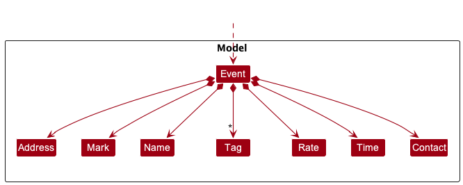
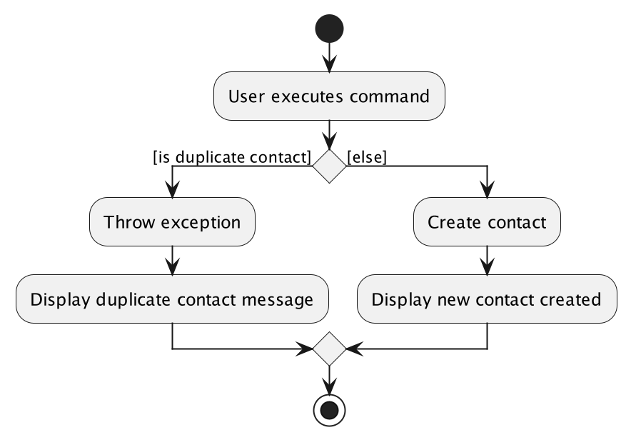
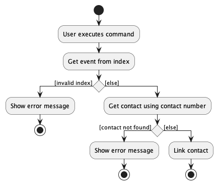

## Table of Contents
- [Acknowledgements](#acknowledgements)
- [Setting up, getting started](#setting-up-getting-started)
  <!-- 

  
Design

   -->
   - [Architecture](#architecture)
   - [UI component](#ui-component)
   - [Logic component](#logic-component)
   - [Model component](#model-component)
   - [Event component](#event-component)
   - [Contact component](#contact-component)
   - [Storage component](#storage-component)
<!-- 
  
 -->
- [Implementation](#implementation)
  <!-- 

  
Features
 
  -->
   - [New Contact feature](#new-contact-feature)
   - [Mark feature](#mark-feature)
   - [Unmark feature](#unmark-feature)
   - [Reminder feature](#reminder-feature)
   - [Linkcontact feature](#linkcontact-feature)
<!-- 
  
 -->
- [Appendix: Requirements](#appendix-requirements)
  <!-- 

  
more
 
  -->
   * [Product scope](#product-scope)
   * [User stories](#user-stories)
   * [Use cases](#use-cases)
   * [Non-Functional Requirements](#non-functional-requirements)
   * [Glossary](#glossary)
<!-- 
  
 -->
- [Appendix: Instructions for manual testing](#appendix-instructions-for-manual-testing)
- [Appendix: Planned Enhancements](#appendix-planned-enhancements)

--------------------------------------------------------------------------------------------------------------------

## Acknowledgements

* This project is based on the AddressBook-Level3 project created by the [SE-EDU initiative](https://se-education.org).

--------------------------------------------------------------------------------------------------------------------

## Setting up, getting started

Refer to the guide [_Setting up and getting started_](SettingUp.md).

--------------------------------------------------------------------------------------------------------------------

## Design

### Architecture

    <b>Figure 1.1</b> Architecture Diagram for the high-level design of the App

 
The ***Architecture Diagram*** given above explains the high-level design of the App.

Given below is a quick overview of main components and how they interact with each other.

**Main components of the architecture**

**`Main`** has two classes called [`Main`](https://github.com/AY2223S2-CS2103T-T11-3/tp/blob/master/src/main/java/seedu/event/Main.java) and [`MainApp`](https://github.com/AY2223S2-CS2103T-T11-3/tp/blob/master/src/main/java/seedu/event/MainApp.java). It is responsible for,
* At app launch: Initializes the components in the correct sequence, and connects them up with each other.
* At shut down: Shuts down the components and invokes cleanup methods where necessary.

[**`Commons`**](#common-classes) represents a collection of classes used by multiple other components.

The rest of the App consists of four components.

* [**`UI`**](#ui-component): The UI of the App.
* [**`Logic`**](#logic-component): The command executor.
* [**`Model`**](#model-component): Holds the data of the App in memory.
* [**`Storage`**](#storage-component): Reads data from, and writes data to, the hard disk.

**How the architecture components interact with each other**

The *Sequence Diagram* below shows how the components interact with each other for the scenario where the user issues the command `delete 1`.

    <b>Figure 1.2</b> Sequence Diagram of delete command

 

Each of the four main components (also shown in the diagram above),

* defines its *API* in an `interface` with the same name as the Component.
* implements its functionality using a concrete `{Component Name}Manager` class (which follows the corresponding API `interface` mentioned in the previous point.)

For example, the `Logic` component defines its API in the `Logic.java` interface and implements its functionality using the `LogicManager.java` class which follows the `Logic` interface. Other components interact with a given component through its interface rather than the concrete class (reason: to prevent outside component's being coupled to the implementation of a component), as illustrated in the (partial) class diagram below.

    <b>Figure 1.3</b> Class diagram of components

 
The sections below give more details of each component.

### UI component

The **API** of this component is specified in [`Ui.java`](https://github.com/AY2223S2-CS2103T-T11-3/tp/blob/master/src/main/java/seedu/event/ui/Ui.java)

    <b>Figure 1.4</b> Class diagram of UI

 
The UI consists of a `MainWindow` that is made up of parts e.g.`CommandBox`, `ResultDisplay`, `EventListPanel`, `StatusBarFooter` etc. All these, including the `MainWindow`, inherit from the abstract `UiPart` class which captures the commonalities between classes that represent parts of the visible GUI.

The `UI` component uses the JavaFx UI framework. The layout of these UI parts are defined in matching `.fxml` files that are in the `src/main/resources/view` folder. For example, the layout of the [`MainWindow`](https://github.com/AY2223S2-CS2103T-T11-3/tp/blob/master/src/main/java/seedu/event/ui/MainWindow.java) is specified in [`MainWindow.fxml`](https://github.com/AY2223S2-CS2103T-T11-3/tp/blob/master/src/main/resources/view/MainWindow.fxml)

The `UI` component,

* executes user commands using the `Logic` component.
* listens for changes to `Model` data so that the UI can be updated with the modified data.
* keeps a reference to the `Logic` component, because the `UI` relies on the `Logic` to execute commands.
* depends on some classes in the `Model` component, as it displays `Event` object residing in the `Model`.

### Logic component

**API** : [`Logic.java`](https://github.com/AY2223S2-CS2103T-T11-3/tp/blob/master/src/main/java/seedu/event/logic/Logic.java)
Here's a (partial) class diagram of the `Logic` component:

    <b>Figure 1.5</b> Class diagram of 'Logic' component

 

How the `Logic` component works:
1. When `Logic` is called upon to execute a command, it uses the `EventBookParser` class to parse the user command.
1. This results in a `Command` object (more precisely, an object of one of its subclasses e.g., `AddCommand`) which is executed by the `LogicManager`.
1. The command can communicate with the `Model` when it is executed (e.g. to add a event).
1. The result of the command execution is encapsulated as a `CommandResult` object which is returned back from `Logic`.

The Sequence Diagram below illustrates the interactions within the `Logic` component for the `execute("delete 1")` API call.

    <b>Figure 1.6</b> Sequence diagram of 'Logic' component

 

:information_source: **Note:** The lifeline for `DeleteCommandParser` should end at the destroy marker (X) but due to a limitation of PlantUML, the lifeline reaches the end of diagram.

Here are the other classes in `Logic` (omitted from the class diagram above) that are used for parsing a user command:

    <b>Figure 1.7</b> Class diagram of 'Logic''

 
How the parsing works:
* When called upon to parse a user command, the `EventBookParser` class creates an `XYZCommandParser` (`XYZ` is a placeholder for the specific command name e.g., `AddCommandParser`) which uses the other classes shown above to parse the user command and create a `XYZCommand` object (e.g., `AddCommand`) which the `EventBookParser` returns back as a `Command` object.
* All `XYZCommandParser` classes (e.g., `AddCommandParser`, `DeleteCommandParser`, ...) inherit from the `Parser` interface so that they can be treated similarly where possible e.g, during testing.

### Model component
**API** : [`Model.java`](https://github.com/AY2223S2-CS2103T-T11-3/tp/blob/master/src/main/java/seedu/event/model/Model.java)

    <b>Figure 1.8</b> Class diagram of 'Model'

 

The `Model` component,

* stores the event book data i.e., all `Event` objects (which are contained in a `UniqueEventList` object).
* stores the currently 'selected' `Event` objects (e.g., results of a search query) as a separate _filtered_ list which is exposed to outsiders as an unmodifiable `ObservableList<Event>` that can be 'observed' e.g. the UI can be bound to this list so that the UI automatically updates when the data in the list change.
* stores a `UserPref` object that represents the user’s preferences. This is exposed to the outside as a `ReadOnlyUserPref` objects.
* does not depend on any of the other three components (as the `Model` represents data entities of the domain, they should make sense on their own without depending on other components)

### Event component
**API** : [`Event.java`](https://github.com/AY2223S2-CS2103T-T11-3/tp/blob/master/src/main/java/seedu/event/model/event/Event.java)

    <b>Figure 1.9</b> Class diagram of 'Event'

 

The `Event` component,

* stores each category of information of an event in individual attributes and each attribute is an object.
* arrtibutes are:
   * `Address`
   * `Mark`
   * `Name`
   * `Tag`
   * `Rate`
   * `Time`
   * `Contact`
* when an event is created the above objects are created using user inputs and then the event object will be created.
* the event will be added to the UniqueEventList.

### Contact component
**API** : [`Contact.java`](https://github.com/AY2223S2-CS2103T-T11-3/tp/blob/master/src/main/java/seedu/event/model/contact/Contact.java)

    <b>Figure 2.0</b> Class diagram of 'Contact'

 

The `Contact` component,
- it is made up of 2 objects the `ContactName` and `ContactPhone`
- both objects are created using user input.
- the contact will be added into the UniqueContactList.

### Storage component

**API** : [`Storage.java`](https://github.com/AY2223S2-CS2103T-T11-3/tp/blob/master/src/main/java/seedu/event/storage/Storage.java)

The `Storage` component,
* can save both event book data and user preference data in json format, and read them back into corresponding objects.
* inherits from both `EventBookStorage` and `UserPrefStorage`, which means it can be treated as either one (if only the functionality of only one is needed).
* depends on some classes in the `Model` component (because the `Storage` component's job is to save/retrieve objects that belong to the `Model`)

### Common classes

Classes used by multiple components are in the `seedu.eventbook.commons` package.

--------------------------------------------------------------------------------------------------------------------

## Implementation

This section describes some noteworthy details on how certain features are implemented.

### New Contact feature

The `newcontact` feature allows for users to add new contacts to their contact list.

#### Implementation

The `newcontact` feature is facilitated by the `Contact` class. The feature is implemented as follows:
- encapsulate two attributes of a contact with the help of `ContactName` and `ContactPhone` class.
- Phone number should only be numerical and shall not be shorter than 8 digits.
- A contact is unique to its `ContactPhone`, having the same phone number will result in an error.
- Once a new contact is created it will be added to the contact list which will be saved in a JSON file.

#### Design considerations:

* **Alternative 1 (current choice):** Create a new contact through creating `ContactName` and `ContactPhone` attributes.
    * Pros: More levels of abstraction to prevent the accidental change of information.
    * Cons: Complicated code.
* **Alternative 2:** Created a new contact through storing strings input by user.
    * Pros: Easy to code.
    * Cons: Might be hard to keep track or do comparisons with.

    <b>Figure 3.1</b> Activity diagram of 'New Contact'

### Mark feature

The `mark` feature allows for marking of the 'Mark' attribute to indicate that the event is done.

#### Implementation

The `mark` feature is implemented with the following considerations:
- A `Mark` class facilitates the implementation of the mark feature. The class also contains a `isDone` attribute to indicate whether the event is done or not.'
- A valid `index` will be taken in as a parameter to facilitate marking of the correct event.
- Marking of a done event would not result in error or exceptions as this action does not reduce correctness of presented information.

#### Design considerations:

* **Alternative 1 (current choice):** Calls on `mark` method in 'Mark' class to set the tracked boolean variable 'isDone' to true
  * Pros: Easier to implement.
  * Cons: Results in higher coupling as it is editing a variable in an event instance, may lead to errors in runtime and testing.

* **Alternative 2:** Replace current instance of specified event with a new unmarked event instance
  * Pros: Results in less coupling and in turn lower possibility of unintended change cascades.
  * Cons: May have performance issues in terms of memory usage and runtime.

Below shows the activity diagram of the `mark` command:

    <b>Figure 3.2</b> Activity diagram of 'Mark'

### Unmark feature

The `unmark` feature allows for unmarking of the 'Mark' attribute in events should there be an accidental marking of an event.

#### Implementation

The `unmark` feature is implemented with the following considerations:

- A valid `index` will be taken in as a parameter to facilitate unmarking of the correct event.
- The unmark feature builds alongside the existing implementation of the 'Mark' class.
- Allows for undo of accidental marking by setting the 'isDone' boolean attribute of the 'Mark' class to false to signify an undone event.
- Unmarking of an undone event would not result in error or exceptions as this action does not reduce correctness of presented information.

#### Design considerations:

* **Alternative 1 (current choice):** Calls on `unmark` method in 'Mark' class to set the tracked boolean variable 'isDone' to false
  * Pros: Easier to implement.
  * Cons: Results in higher coupling as it is editing a variable in an event instance, may lead to errors in runtime and testing.

* **Alternative 2:** Replace current instance of specified event with a new unmarked event instance
  * Pros: Results in less coupling and in turn lower possibility of unintended change cascades.
  * Cons: May have performance issues in terms of memory usage and runtime.

Below shows the activity diagram of the `unmark` command:

    <b>Figure 3.3</b> Activity diagram of 'Unmark'

### Reminder feature
The `remind` feature allows for users to view upcoming events.

#### Implementation

The `reminder` feature is implemented with the following considerations:
* It is facilitated by `StartTimeWithinDaysPredicate`, that tests if an event's start date is within the inputted days of the current time.
* The current time is determined by a `Clock` that is created by `LogicManager`.
* The `RemindCommandParser` checks if the command argument has the correct format. The command argument represents days and should be a positive integer.

#### Design considerations:

**Aspect: How current time is determined:**

* **Alternative 1 (current choice):** Determine current time using a `Clock` created in `LogicManager`.
    * Pros: Easy to test. A fixed `Clock` can be created.
    * Cons: Coupling between classes that use `Clock`, even if the class only uses it to create an object that uses `Clock`

* **Alternative 2:** Determine current time using `LocalDateTime.now()` in `StartTimeWithinDaysPredicate`.
    * Pros: Less coupling between classes.
    * Cons: Difficult to test, as the current time is based on real time.

    <b>Figure 3.4</b> Object diagram of objects involved in the execution of a 'remind' command

### Linkcontact feature

The link contact feature allows users to link a contact to an event.

#### Implementation
The `linkcontact` feature is facilitated by `Event` class.
The feature is implemented as follows:
* When a user adds an event, he can optionally add a contact to the event.
* When a user edits an event, he can optionally add a contact to the event.
* When a user edits an event, he can optionally change the contact of the event.
* If the user specifies a contact that does not exist in the contact list, the event will not be added/edited.
* If the user specifies a contact that already exists in the contact list, the event will be added/edited with the contact.

The linkcontact feature will take in a contact number as a parameter. This parameter will be used to search for the contact in the contact list.
1. If the contact is found, the contact will be linked to the event.
2. If the contact is not found, the event will not be added/edited.

#### Design consideration:
* **Alternative 1 (current choice):** Add a `Contact` attribute to `Event` class.
    * Pros: Easy to implement.
    * Cons: May violate Single Responsibility Principle as `Event` class now has to handle both event and contact.
* **Alternative 2:** Add the `contact` as just a normal string attribute to `Event` class.
    * Pros: Even easier to implement.
    * Cons: Hard to implement filtering of events by contact in the future.

    <b>Figure 3.5</b> Activity diagram of 'linkcontact'

### Revenue feature

The `revenue` feature allows for calculating the total revenue earned so far.

#### Implementation

The `revenue` feature is implemented with the following considerations:
- The revenue takes into account whether the event is marked or not. It only sums up the rate if the event is marked as done.
- The revenue will display `0.00` and not result in any errors even if there are no events that are done yet.

#### Design considerations:

* **Alternative 1 (current choice):** Iterates through the event book when the revenue feature is called.
  * Pros: Easier to implement.
  * Cons: Runtime complexity scales as the event book increases in size.

* **Alternative 2:** Keep a static attribute of the revenue and increase accordingly as events are completed.
  * Pros: Will maintain a low runtime complexity.
  * Cons: Hard to implement in the case that events are unmarked or deleted.

Below shows the activity diagram of the `revenue` command:

    <b>Figure 3.6</b> Activity diagram of 'Revenue'

--------------------------------------------------------------------------------------------------------------------

## Appendix: Requirements

### Product scope

**Target user profile**:

* freelancer who wants to keep track of their events and contact person
* has a need to manage a significant number of events
* prefer desktop apps over other types
* can type fast
* prefers typing to mouse interactions
* is reasonably comfortable using CLI apps

**Value proposition**: manage events' information and respective contact person faster than a typical mouse/GUI driven app.

### User stories

Priorities: High (must have) - `* * *`, Medium (nice to have) - `* *`, Low (unlikely to have) - `*`

| Priority | As a/an...          | I can...                                         | so that...                                           |
| -------- |---------------------| ------------------------------------------------ | ---------------------------------------------------- |
| `* * *`     | User                | Access the software                              | I can use it                                         |
| `* * *`     | User                | Click X to exit                                  | I can stop it                                        |
| `* * *`     | User                | Add client contact to an event                    | I can refer to when needed                          |
| `* * *`     | User                | View all my contacts                             | I can see who I can contact                          |
| `* * *`     | User                | Link client contact to event                     | I can have quick reference to POC (Point of Contact) |
| `* * *`     | User                | See the rates I have discussed with the client   | I know how much money to collect                     |
| `* * *`     | User                | Mark the event that is done                      | I know what I don't have to do anymore               |
| `* * *`     | User                | Unmark an event                                  | I can undo an accidental mark.                       |
| `* * *`     | User                | Add events                                       | I can remember my events later                       |
| `* * *`     | User                | View events                                      | I can see what events I have done or am going to do  |
| `* * *`     | User                | Delete events                                    | I can remove unnecessary events                      |
| `* * *`     | User                | Add dates to my events                           | I know when the event is due                         |
| `* * *`     | User                | Save my events after closing the app             | I can save for when I use the app another time       |
| `* * *`     | User                | Load my saved events when opening the app        | I can see my events when I reopen the app            |
| `* * *`     | User                | Add a rate to an event                           | I can see how much I earn from an event              |
| `* * *`     | User                | View information associated to each event        | I can see its details                                |
| `* * *`     | User                | Edit my existing event details                   | I can change the details whenever there are changes  |
| `* * *`     | User                | See what I have added before                     | I don't need repeat myself                           |
| `* * *`     | User                | Change a contact linked to an event              | I can link a different contact if the POC changes    |
| `* * *`     | New user            | See usage instructions                           | I know how to use the software                       |
| `* * *`     | User                | View undone events                               | I can see what events I have to do                   |
| `* * *`     | Freelancer          | Link venue to event                              | I can have quick reference                           |
| `* * *`     | Forgetful User      | Be reminded of upcoming events                   | I can remember                                       |
| `* * *`     | User                | Delete contacts                                  | I can delete unnecessary contacts                    |
| `* *`   | User                | Filter the events that has not been paid         | I can collect money                                  |
| `* *`   | User                | View the total revenue I have earned this week   | I can manage my money                                |
| `* *`   | User                | Set notes for contacts                           | I can keep track about them and rmb what not to do   |
| `* *`   | User                | View timing of upcoming events                   | I know when to go                                    |
| `* *`   | User                | See the most urgent events                       | I know what to do first                              |
| `* *`   | Careless user       | Undo accidental deletion                         | I can undo deleted events                            |
| `* *`   | Impatient user      | Search contacts                                  | I can quick find specific POC                        |
| `* *`   | Impatient user     | Search events                                    | I can quick find specific event                      |
| `* *`   | Lazy user          | Filter events to find similar events             | I can find similar events easily                     |
| `* *`   | User                | Add all information to an event at the same time | I can save time on adding all the information        |
| `* *`   | User                | View events associated to each contact           | I know what events to contact the POC for            |
| `*`      | User                | Toggle between light and dark mode               | I can use the theme i prefer                         |
| `*`      | User                | Redo previous action                             | I can redo previous action                           |
| `*`      | User                | Use abbreviation                                 | I can quickly insert items                           |
| `*`      | Goal oriented user | Set goals                                        | I can look at my goals                               |
| `*`      | Forgetful User      | Set reminders/checklist for events               | I can remember things to bring etc.                  |

### Use cases

(For all use cases below, the **System** is `Paidlancers` and the **Actor** is the `user`, unless specified otherwise)

**Use case: UC1 - Add Event**

**MSS**

1.  User requests to add an event together with its information.
2.  System adds the event and displays information of the event added.

   Use case ends.

**Extensions**

* 1a. User enters the wrong command.
   * 1a1. System displays that the command is invalid and to try again.

      Use case resumes at step 1.

**Use case: UC2 - Delete Event**

**MSS**

1. User <u>lists events (UC5)</u>.
2. User requests to delete a specified event in the list.
3. System deletes the event and displays information of the event deleted.

   Use case ends.

**Extensions**

* 2a. User enters the wrong command.
   * 2a1. System displays that the command is invalid and to try again.

      Use case resumes at step 2.

* 2b. User enters an invalid index.
   * 2b1. System displays that the index is invalid and to try again.

      Use case resumes at step 2.

**Use case: UC3 - Mark Event**

**MSS**

1. User <u>lists events (UC5)</u>.
2. User requests to mark a specified event in the list.
3. System marks the event and displays information of the event marked.

   Use case ends.

**Extensions**

* 2a. User enters the wrong command.
   * 2a1. System displays that the command is invalid and to try again.

      Use case resumes at step 2.

* 2b. User enters an invalid index.
   * 2b1. System displays that the index is invalid and to try again.

      Use case resumes at step 2.

* 2c. User marks an event that is already marked.
   * 2c1. System displays that the event has already been marked.

      Use case ends.

**Use case: UC4 - Unmark Event**

**MSS**

1. User <u>lists events (UC5)</u>.
2. User requests to unmark a specified event in the list.
3. System unmarks the event and displays information of the event unmarked.

   Use case ends.

**Extensions**

* 2a. User enters the wrong command.
   * 2a1. System displays that the command is invalid and to try again.

      Use case resumes at step 2.

* 2b. User enters an invalid index.
   * 2b1. System displays that the index is invalid and to try again.

      Use case resumes at step 2.

* 2c. User marks an event that is already unmarked.
   * 2c1. System displays that the event has already been unmarked.

      Use case ends.

**Use case: UC5 - List Events**

**MSS**

1. User requests the system to list events.
2. System displays information of all events with their respective index.

   Use case ends.

**Extensions**

* 1a. User enters the wrong command.
   * 1a1. System displays that the command is invalid and to try again.

      Use case resumes at step 1.

* 2a. The list is empty.
   * 2a1. System displays an empty list.

      Use case ends.

**Use case: UC6 - Link contact and event**

**MSS**

1. User <u>lists events (UC5)</u>.
2. User requests to link a specified event and contact.
3. System links them and displays the event's and contact's information.

   Use case ends.

**Extensions**

* 2a. User enters the wrong command.
   * 2a1. System displays that the command is invalid and to try again.

      Use case resumes at step 3.

* 2b. User enters an invalid index.
   * 2b1. System displays that the index is invalid and to try again.

      Use case resumes at step 3.

* 2c. User enters an invalid contact information
   * 2c1. System displays that the contact information is invalid and to try again.

      Use case resumes at step 3.

* 3a. The event has a contact linked already.
   * 4a1. System replaces the previous contact with the new contact.

      Use case ends.

<!-- **Use case: UC7 - Display Rate**

**MSS**

1. User <u>lists events (UC5)</u>.
2. User requests to display the rate of a specified event in the list.
3. System displays the event and displays information of the rate.

   Use case ends.

**Extensions**

* 2a. User enters the wrong command.
   * 2a1. System displays that the command is invalid and to try again.

      Use case resumes at step 2.

* 2b. User enters an invalid index.
   * 2b1. System displays that the index is invalid and to try again.

      Use case resumes at step 2. -->

**Use case: UC7 - Add Contact**

**MSS**

1.  User requests to add a contact to an event.
2.  System adds the contact to the event and displays information of the contact and event.

   Use case ends.

**Extensions**

* 1a. User enters the wrong command.
   * 1a1. System displays that the command is invalid and to try again.

      Use case resumes at step 1.

* 1b. User enters invalid contact details.
   * 1b1. System displays that the input is invalid and to try again.

      Use case resumes at step 1.

**Use case: UC8 - Edit Event**

**MSS**

1. User <u>lists events (UC5)</u>.
2. User requests to edit a specified event in the list.
3. System updates the event with the edit and displays information of the event edited.

   Use case ends.

**Extensions**

* 2a. User enters the wrong command.
   * 2a1. System displays that the command is invalid and to try again.

      Use case resumes at step 2.

* 2b. User enters an invalid index.
   * 2b1. System displays that the index is invalid and to try again.

      Use case resumes at step 2.

* 2c. User enters an invalid argument format.
   * 2c1. System displays that the format is invalid and to try again.

      Use case resumes at step 2.

### Non-Functional Requirements

1. Should work on any _mainstream OS_ as long as it has Java `11` or above installed.
2. A user with above average typing speed for regular English text (i.e. not code, not system admin commands) should be able to accomplish most of the tasks faster using commands than using the mouse.
3. Should be able to hold up to 1000 contacts without a noticeable sluggishness in performance for typical usage.
4. Should be able to hold up to 1000 events without a noticeable sluggishness in performance for typical usage.
5. The system should work on both 32-bit and 64-bit environments.
6. The source code should be open source.
7. The product is offered as a free product.
8. The system should respond within two seconds for events and contacts up to 1000.
9. The user interface should be intuitive enough for users who are not as IT-savvy.
10. The dimensions should be at least `726px * 593px` so that it is readable for the user.

### Glossary

* **Mainstream OS**: Windows, Linux, Unix, OS-X

--------------------------------------------------------------------------------------------------------------------

## Appendix: Instructions for manual testing

Given below are instructions to test the app manually.

:information_source: **Note:** These instructions only provide a starting point for testers to work on;
testers are expected to do more *exploratory* testing.

### Launch and shutdown

1. Initial launch

   1. Download the jar file and copy into an empty folder

   1. Double-click the jar file Expected: Shows the GUI with a set of sample contacts. The window size may not be optimum.

1. Saving window preferences

   1. Resize the window to an optimum size. Move the window to a different location. Close the window.

   1. Re-launch the app by double-clicking the jar file. 
       Expected: The most recent window size and location is retained.

1. _{ more test cases …​ }_

### Deleting an event

1. Prerequisites: List all events using the list command. Multiple events in the list.

   1. Test case: `delete 1` 
      Expected: First event is deleted from the list. Details of the deleted event shown in the status message.

   1. Test case: `delete 0` 
      Expected: No event is deleted. Error details shown in the status message.

### Adding an event

   1. Test case: `newevent n/DJ at wedding r/100 a/311, Clementi Ave 2, #02-25 ds/11-03-2023 11:00 de/11-03-2023 17:00 t/friends t/dj` 
      Expected: New event created. Details of event created shown in the status message.

   1. Test case: `newevent n/ r/` 
      Expected: No event is created. Error details shown in the status message.

### Adding a contact

   1. Test case: `newcontact n/Deborah Tan p/91234567` 
   Expected: New contact created. Details of contact created shown in status message.

   1. Test case: `newcontact n/` 
   Expected: No new contact created. Error details shown in the status message.

### Link contact to Event

1. Prerequisites: List all events using the list command. Multiple events in the list.

   1. Test case: `linkcontact 2 91234567` 
   Expected: Contact linked to second event in the list. Details shown in status message.

   1. Test case: `linkcontact 1` 
   Expected: No contact linked. Error details shown in the status message.

### Mark Event

1. Prerequisites: List all events using the list command. Multiple events in the list.

   1. Test case: `mark 1` 
   Expected: First event in the list is marked. Details shown in the status message.

   1. Test case:  `mark` 
   Expected: No event marked. Error details shown in the status message.

### Unmark Event

1. Prerequisites: List all events using the list command. Multiple events in the list.

   1. Test case: `unmark 1` 
   Expected: First event in the list is unmarked. Details shown in the status message.

   1. Test case:  `unmark` 
   Expected: No event unmarked. Error details shown in the status message.

### Edit an Event

1. Prerequisites: List all events using the list command. Multiple events in the list.

   1. Test case: `edit 1 r/100` 
   Expected: Rate of first event in the list is edited. Details shown in message bar.

   1. Test case: `edit` 
   Expected: No event edited. Error details shown in the status message.

### View upcoming Event

   1. Test case: `remind 2` 
   Expected: Events that start within 2 days will be displayed.

   1. Test case: `remind -1`  
   Expected: No filtered display shown. Error details shown in the status message.

## Glossary
* **Command Line Interface (CLI)**: A text-based user interface (UI) used to run programs, manage computer files and interact with the computer
* **User Interface (UI)**: A form of user interface that allows users to interact with electronic devices through graphical icons
* **Mainstream OS**: Windows, Linux, Unix, OS-X
* **Event**: A freelancing gig

## Appendix: Planned Enhancements
1. The current `newevent` and `edit` commands allows an event's start time to be after its end time. We plan to only allow an event to be added or successfully edited if its start time is before or the same as its end time, with an error message `Start time must be before end time.` being shown otherwise.

2. The current `linkcontact` command does not recognise an inputted phone number if there are extra spaces around it. For example, `linkcontact 1      12345678` is not allowed. We plan to allow the extra spaces by ignoring extra spaces when splitting the input arguments.

3. Upon using the current `linkcontact` command on a contact that is already linked to a specified event, the application returns a `Successfully linked` message in the message display box. We plan to change the display message to `Contact already linked` instead for contacts that are already linked.

4. The current UI does not wrap text displayed into a new line, instead a scroll bar is used to scroll and view textual informations that are too long. We plan to add a text wrapping feature to provide better readability to users so that scrolling is not needed.

5. The current `edit` command is for editing events only, there is no way to edit the contact object details. We plan to implement an `edit` function for the contact objects.

6. The current contact book does not allow deleting of contacts. We plan to implement a `delete` method for deleting contacts.

  <a href="#top">Back to top</a>

 

