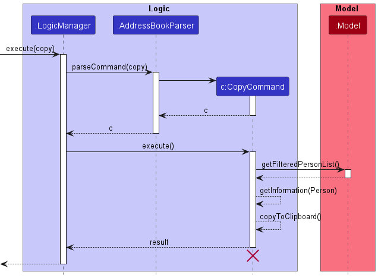
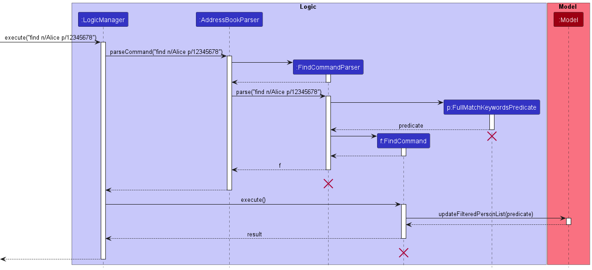
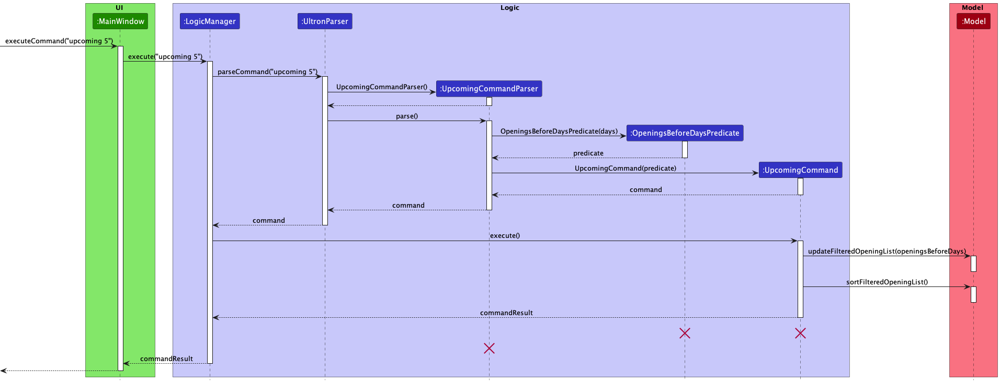
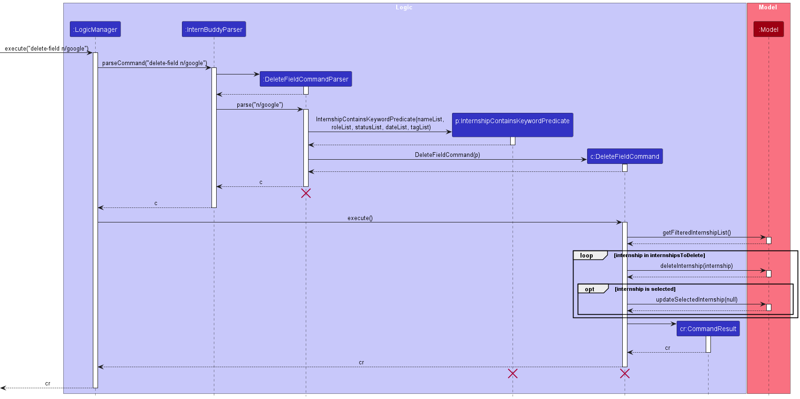
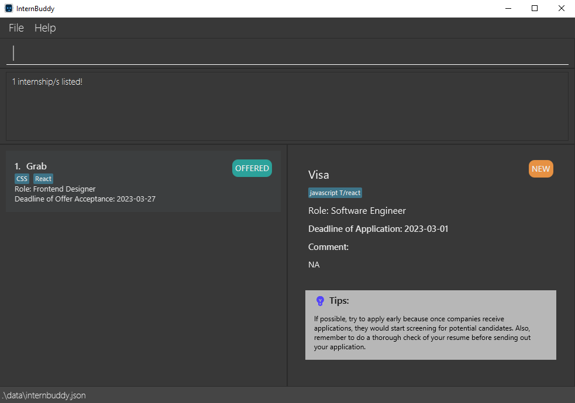
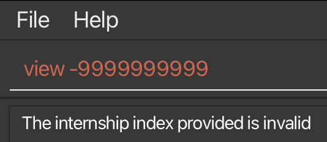

## **Table of Contents**
* Table of Contents
{:toc}

## **Introducing InternBuddy**

InternBuddy is a desktop application for Computing undergraduates to manage their internship applications.
It is optimized for typing where it allows you to complete internship management tasks much more efficiently
via the keyboard as compared to using traditional [Graphical User Interface](#glossary) (GUI) applications.
If you are a fast typist who is seeking a one-stop platform to systematically organise your internship applications,
then InternBuddy is the perfect buddy to accompany you during your internship hunt.

InternBuddy runs using Java 11, and is available on the Windows, macOS and Linux operating systems.

 

  

[//]: # (@@author eugenetangkj - reused with modifications)
[//]: # (Adapted from https://ay2223s1-cs2103t-w17-4.github.io/tp/UserGuide.html#navigating-the-user-guide)

## **About the Developer Guide**

### Objectives of the Developer Guide
This developer guide aims to provide developers with insights into the implementation of InternBuddy and to explain the
design considerations behind its features. It utilises Unified Modeling Language (UML) diagrams created using
[PlantUML](https://plantuml.com/) for a visual explanation of the implementation.

Apart from shedding light on InternBuddy's internal details, this developer guide also provides
information on how to conduct feature testing and showcases the user study component that we went through
in the initial development phase for requirements gathering.

Hopefully, this developer guide will enable you to easily set up the InternBuddy project and extend its
functionality if you are interested in doing so.

### Using the Developer Guide
This developer guide uses a set of formatting standards and syntax to better communicate
information.

**Information Box**

:information_source: **Info:** Provides useful information that supplements the main text

**Tip Box**

:bulb: **Tip:**  Suggestions on how to enhance your experience

**Warning Box**

:warning: **Warning:**  Warns of a dangerous action that you should be aware of and to consider
carefully before committing

**Syntax Highlighting**

[Commands](#glossary), [fields](#glossary), file paths and class names are highlighted.

`command`, `FIELD`, `filepath.json`, `ClassName`

**Keyboard Actions**

Keyboard keys are indicated using rounded buttons.

<button>Ctrl</button> <button>Alt</button> <button>Space</button> <button>Enter</button> <button>&uarr;</button>

## **Setting Up and Getting Started**

Refer to the guide [_Setting up and getting started_](SettingUp.md) for instructions on how to
set up the InternBuddy project in your personal computer. After launching InternBuddy, you would see a GUI.
Figure 1 illustrates the main parts
of InternBuddy's GUI and Table 1 explains their functions. We will be referencing
these different parts throughout this developer guide.

[//]: # (@@author eugenetangkj - reused with modifications)
[//]: # (Adapted from https://ay2223s1-cs2103t-w17-4.github.io/tp/UserGuide.html#navigating-the-user-guide)

  

Figure 1: InternBuddy's GUI

| Part           | Usage                                                                                        |
|----------------|----------------------------------------------------------------------------------------------|
| Command Box    | You can type in your commands here to interact with InternBuddy.                             |
| Result Display | This is where the results of your command will be displayed.                                 |
| List Panel     | Displays a list of internship entries.                                                       |
| View Panel     | Displays either the welcome message or detailed information of a specified internship entry. |
| Status Bar     | States where your InternBuddy data file is located on your computer.                         |

Table 1: Explanation of the different parts of InternBuddy's GUI

 

## **Design**

:bulb: **Tip:** The `.puml` files used to create diagrams in this developer guide can be found in the [diagrams](https://github.com/AY2223S2-CS2103T-T14-3/tp/tree/master/docs/diagrams) folder. Refer to the [_PlantUML Tutorial_ at se-edu/guides](https://se-education.org/guides/tutorials/plantUml.html) to learn how to create and edit these diagrams.

### Architecture
The ***Architecture Diagram*** shown in Figure 2 explains the high-level design of the App.

  

Figure 2: InternBuddy's architecture diagram

Given below is a quick overview of the main components and how they interact with each other.

**Main components of the architecture**

**`Main`** has two classes called [`Main`](https://github.com/AY2223S2-CS2103T-T14-3/tp/blob/master/src/main/java/seedu/internship/Main.java) and [`MainApp`](https://github.com/AY2223S2-CS2103T-T14-3/tp/blob/master/src/main/java/seedu/internship/MainApp.java). It is responsible for,
* At app launch: Initializes the components in the correct sequence, and connects them up with each other.
* At shut down: Shuts down the components and invokes cleanup methods where necessary.

[**`Commons`**](#common-classes) represents a collection of classes used by multiple other components.

The rest of the App consists of four components.

* [**`UI`**](#ui-component): The UI (User Interface) of the App.
* [**`Logic`**](#logic-component): The command executor.
* [**`Model`**](#model-component): Holds the data of the App in memory.
* [**`Storage`**](#storage-component): Reads data from, and writes data to, the hard disk.

**How the architecture components interact with each other**

Figure 3 is a *Sequence Diagram* that shows how the components interact with each other for the scenario where the user
issues the command `delete-index 1`.

  

Figure 3: Sequence diagram that shows interactions between components 

 

Each of the four main components (also shown in the Figure 3),

* defines its *API* in an `interface` with the same name as the Component.
* implements its functionality using a concrete `{Component Name}Manager` class (which follows the corresponding API `interface` mentioned in the previous point.

For example, the `Logic` component defines its API in the `Logic.java` interface and implements its
functionality using the `LogicManager.java` class which follows the `Logic` interface. Other components
interact with a given component through its interface rather than the concrete class
(reason: to prevent outside component's being coupled to the implementation of a component),
as illustrated in the (partial) class diagram shown in Figure 4.

  

Figure 4: Partial class diagram for the logic, model and storage components 

 

The sections below give more details of each component.

### UI Component

The **API** of this component is specified in
[`Ui.java`](https://github.com/AY2223S2-CS2103T-T14-3/tp/blob/master/src/main/java/seedu/internship/ui/Ui.java).
The class diagram for the UI component is shown in Figure 5.

  

Figure 5: Class diagram for the UI component 

 

The UI consists of a `MainWindow` that is made up of parts e.g.`CommandBox`, `ResultDisplay`,
`InternshipListPanel`, `StatusBarFooter` etc. All these, including the `MainWindow`,
inherit from the abstract `UiPart` class which captures the commonalities between classes that
represent parts of the visible GUI.

The `UI` component uses the JavaFx UI framework. The layout of these UI parts are defined in matching
`.fxml` files that are in the `src/main/resources/view` folder. For example, the layout of the
[`MainWindow`](https://github.com/AY2223S2-CS2103T-T14-3/tp/blob/master/src/main/java/seedu/internship/ui/MainWindow.java)
is specified in [`MainWindow.fxml`](https://github.com/AY2223S2-CS2103T-T14-3/tp/blob/master/src/main/resources/view/MainWindow.fxml)

The `UI` component,

* executes user commands using the `Logic` component.
* listens for changes to `Model` data so that the UI can be updated with the modified data.
* keeps a reference to the `Logic` component, because the `UI` relies on the `Logic` to execute commands.
* depends on some classes in the `Model` component, as it displays `Internship` object residing in the `Model`.

### Logic component

**API** : [`Logic.java`](https://github.com/AY2223S2-CS2103T-T14-3/tp/blob/master/src/main/java/seedu/internship/logic/Logic.java)

Figure 6 illustrates a (partial) class diagram of the `Logic` component:

  

Figure 6: Partial class diagram for the logic component 

 

How the `Logic` component works:
1. When `Logic` is called upon to execute a command, it uses the `InternBuddyParser` class to parse the user command.
2. This results in a `Command` object (more precisely, an object of one of its subclasses such as `AddCommand`) which is executed by the `LogicManager`.
3. The command can communicate with the `Model` when it is executed (e.g. to add an internship).
4. The result of the command execution is encapsulated as a `CommandResult` object which is returned back from `Logic`.

Figure 7 below illustrates the interactions within the `Logic` component for the `execute("delete-index 1 2")` API call.

Figure 7: Sequence diagram for the delete-index command 

 

:information_source: **Info:** The lifeline for
`DeleteIndexCommandParser` and `DeleteIndexCommand` should end at the destroy marker (X) but due to a
limitation of PlantUML, the lifeline reaches the end of diagram.

Figure 8 shows the other classes in `Logic` (omitted from Figure 6) that are used for parsing a user command:

  

Figure 8: Class diagram for parser classes in the logic component 

 

How the parsing works:
* When called upon to parse a user command, the `InternBuddyParser` class creates an `XYZCommandParser`
(`XYZ` is a placeholder for the specific command name e.g., `AddCommandParser`) which uses the other classes
shown above to parse the user command and create a `XYZCommand` object (e.g., `AddCommand`) which the
`InternBuddyParser` returns back as a `Command` object.
* All `XYZCommandParser` classes (e.g., `AddCommandParser`, `FindCommandParser`, ...) inherit from
the `Parser` interface so that they can be treated similarly where possible e.g, during testing.

### Model component
**API** : [`Model.java`](https://github.com/AY2223S2-CS2103T-T14-3/tp/blob/master/src/main/java/seedu/internship/model/Model.java)

Figure 9 is a class diagram for the `Model` component.

  

Figure 9: Class diagram for the model component

 

The `Model` component,

* stores the internsip data i.e., all `Internship` objects (which are contained in a `UniqueInternshipList` object).
* stores the currently 'selected' `Internship` objects (e.g., results of a search query) as a separate _filtered_ list
which is exposed to outsiders as an unmodifiable `ObservableList<Internship>` that can be 'observed'
(e.g. the UI can be bound to this list so that the UI automatically updates when the data in the list change.).
* stores a `UserPref` object that represents the user’s preferences. This is exposed to the outside as a `ReadOnlyUserPref` objects.
* does not depend on any of the other three components (as the `Model` represents data entities of the domain, they should make sense on their own without depending on other components)

:information_source: **Info:** An alternative (arguably, a more OOP)
model is shown in Figure 10. It has a `Tag` list in the `InternBuddy`, which `Internship` references. This allows `InternBuddy`
to only require one `Tag` object per unique tag, instead of each `Internship` needing their own `Tag` objects. 

  

Figure 10: Alternative model that is more OOP

 

### Storage component

**API** : [`Storage.java`](https://github.com/AY2223S2-CS2103T-T14-3/tp/blob/master/src/main/java/seedu/internship/storage/Storage.java)

Figure 11 is a class diagram for the `Storage` component.

  

Figure 11: Class diagram for the storage component

 

The `Storage` component,
* can save both internship data and user preference data in json format, and read them back into corresponding objects.
* inherits from both `InternBuddyStorage` and `UserPrefStorage`, which means it can be treated as either one (if only the functionality of only one is needed).
* depends on some classes in the `Model` component (because the `Storage` component's job is to save/retrieve objects that belong to the `Model`)

### Common classes

Classes used by multiple components are in the [`seedu.internship.commons`](https://github.com/AY2223S2-CS2103T-T14-3/tp/tree/master/src/main/java/seedu/internship/commons) package.

## **Implementation**

This section describes some noteworthy details on how certain features are implemented.

:information_source: **Info:** Due to a limitation of PlantUML, the lifeline
for objects in sequence diagrams would always reach the end of the diagrams. However, it is worthy to note that objects
with destroy markers (X) would have been destroyed at the markers.

[//]: # (@@author - eugenetangkj)
### Add an Internship - `add`

#### Implementation

Figure 12 shows how the `add` command works.

Figure 12: Sequence diagram for the add command

 

The following gives a more detailed explanation of the `add` command.

1. When the user enters an `add` command, the `AddCommandParser` parses the user's input.
2. It checks for the following:
   - `n/` followed by the company's name [Compulsory]
   - `r/` followed by the role applied [Compulsory]
   - `s/` followed by the status of the internship application [Compulsory]
   - `d/` followed by the date associated with the entry [Compulsory]
   - `c/` followed by the comment for the entry [Optional]
   - `t/` followed by tags for the entry [Optional]
3. If any of the compulsory fields is missing or any of the fields entered by the user
   does not meet the field requirements, a `ParseException` will be thrown.
4. An `Internship` will be created from the parsed user's input if Step 3 passes.
5. A check is done to see if the `Model` component, which stores all the `Internship` entries,
   contains the `Internship` created in Step 4.
6. If a duplicate `Internship` is found, a `CommandException` will be thrown.
7. Else if there is no duplicate `Internship`, the `Internship` created will be added into
   the `Model` component.
8. The currently selected `Internship` in the `Model` component will be updated to become
   this new `Internship` such that the [View Panel](#setting-up-and-getting-started) displays the information for
   this new `Internship`.

#### Design Considerations

- Whether to make all fields in the `add` command compulsory

1. **Alternative 1 (chosen): Make only essential fields compulsory**
    * Pros: More user-centric as not all users want to enter the optional information,
            which is not exactly critical in tracking internships.
    * Cons: More work needs to be done in code implementation. For example, the absence of optional
            fields should not cause a `ParseException`, and there is a need to include a
            default value of `NA` for input without any `Comment`.

2. **Alternative 2: Make all fields compulsory**
    * Pros: Easier to implement as there is no need to differentiate between compulsory
            and optional fields during command parsing, and it is easier to compare between
            different `Internship` since we just require an exact match of all fields.
    * Cons: Less user-centric where users who do not want to include `Comment` and `Tag`
            are forced to input something for the `Add` command to work.

 

- Whether to update the [View Panel](#setting-up-and-getting-started) according to the `add` command

1. **Alternative 1 (chosen): Update the [View Panel](#setting-up-and-getting-started) whenever a new** `Internship` **is added**
    * Pros: Better visual indication that the `add` command has been successfully executed.
      If the user has  a lot of `Internship` entries, when a new `Internship` is added,
      the new entry will be placed at the bottom of the [List Panel](#setting-up-and-getting-started),
      which is not visible  if the user's scroll position is at the top of the
      [List Panel](#setting-up-and-getting-started). Therefore, updating
      the [View Panel](#setting-up-and-getting-started) enhances visual indication to the user
      that the `Internship` has been successfully added.
    * Cons: An additional line of code is required in the `execute` method of `AddCommand`
      to update the selected `Internship` in the `Model` component in order to update
      the [View Panel](#setting-up-and-getting-started).

2. **Alternative 2: Do not update the [View Panel](#setting-up-and-getting-started) when a new** `Internship` **is added**
    * Pros: No additional code is required in the `execute` method of `AddCommand`.
    * Cons: When the user has a lot of `Internship` entries, the added entry in the
      [List Panel](#setting-up-and-getting-started) may not be visible since it is added to the bottom.
      Without scrolling, users have to rely on the [Result Display](#setting-up-and-getting-started) to
      determine if the `AddCommand` is successful.

[//]: # (@@author - seadragon2000341)
### Edit an Internship - `edit`

#### Implementation

Figure 13 shows how the `edit` command works.

Figure 13: Sequence diagram for the edit command

 

The following gives a more detailed explanation of the `edit` command.

1. When the user enters an `edit` command, the `EditCommandParser` parses the user's input.
2. If the internship index specified is invalid, a `ParseException` will be thrown and the specified `Internship` will not be edited.
3. If the company name, role, status, date, tag or comment fields are missing (at least one must be present) or invalid, a `ParseException` will be thrown and the specified `Internship` will not be edited.
4. After the successful parsing of user input into `EditCommandParser`, the `EditCommand` object is created with a new updated `Internship` object (to maintain immutability).
5. Following which, `EditCommand#execute(Model model)` method is called which eventually calls the `Model#setInternship(Internship toEdit, Internship edited)` method, replacing the old `Internship` object with the newly updated one.

#### Design considerations

- How `edit` executes

1. **Alternative 1 (chosen): Edit command will create a new** `Internship` **to replace the existing** `Internship` **object.**
    * Pros:
        * Maintains immutability of `Internship` class.
    * Cons:
        * May be less efficient than Alternative 2.

2. **Alternative 2: Edit command will directly edit the** `Internship` **by modifying its attributes**.
    * Pros:
        * Will use less memory (no new `Internship` object will be created).
        * Saves time since there is no need to create the new object.
    * Cons:
        * Reduces the defensiveness of the code and the class.

[//]: # (@@author - eugenetangkj)
### View an Internship - `view`

#### Implementation
Figure 14 shows how the `view` command works.

Figure 14: Sequence diagram for the view command

 

The following gives a more detailed explanation of the `view` command.

1. When the user enters a `view` command, the `ViewCommandParser` parses the user's input.
2. It checks for the following:
   - The `INDEX` entered by the user must be able to be converted into a numeric index.
3. If the user entered a value of `INDEX` that cannot be converted, a `ParseException` will
   be thrown.
4. An `Index` will be created from the user's input if Step 2 passes.
5. A check is done to see if the `Index` created in Step 4 is a valid index given the number
   of `Internship` entries in the filtered `Internship` list of the `Model` component.
6. If the `Index` is invalid, a `CommandException` will be thrown.
7. Else if the `Index` is valid, the `Internship` which belongs to that `Index` will be
   retrieved by accessing the filtered `Internship` list.
8. The currently selected `Internship` in the `Model` component will be updated to become
   the `Internship` obtained from Step 7 such that the [View Panel](#setting-up-and-getting-started) displays the
   information for this selected `Internship`.

#### Design Considerations

- Whether to separate the checking of valid user input into 2 classes

1. **Alternative 1: Allow** `ViewCommand` **to handle the checking of whether user input can be
   parsed into an index, and whether it is a valid index**
    * Pros: No need for a separate `ViewCommandParser` class and any problems with checking of
      user input can be isolated to the `ViewCommand` class.
    * Cons: Breaks the abstraction where parsing of user input should be done by a `Parser`
      class instead of a `Command` class.

2. **Alternative 2 (chosen): Allow** `ViewCommandParser` **to handle checking of whether user input
   can be parsed into an index, and `ViewCommand` to handle checking of whether it
   is a valid index**
    * Pros: Maintains the abstraction between the `Parser` and `Command` classes. Also, it
      makes it more maintainable for future extensions in the event that further checks
      to the user input are required.
    * Cons: Have to maintain code in 2 separate classes and in the event that there
      is an issue in processing user input for the `ViewCommand`, there is a need to
      identify and isolate which of the 2 checks does the problem originate from.

[//]: # (@@author DerrickSaltFish)
### Copy an Internship to Clipboard - `copy`
#### Implementation
Figure 15 shows how the `copy` command works.

Figure 15: Sequence diagram for the copy command

 

The following gives a more detailed explanation of the `copy` command.

1. When the user enters a `copy` command, the `CopyCommandParser` parses the user's input.
2. It checks for the following:
   - The `INDEX` entered by the user must be able to be converted into a numeric index.
3. If the user entered a value of `INDEX` that cannot be converted, a `ParseException` will
   be thrown.
4. An `Index` will be created from the user's input if Step 2 passes.
5. A check is done to see if the `Index` created in Step 4 is a valid index given the number
   of `Internship` entries in the filtered `Internship` list of the `Model` component.
6. If the `Index` is invalid, a `CommandException` will be thrown.
7. Else if the `Index` is valid, the `Internship` which belongs to that `Index` will be
   retrieved by accessing the filtered `Internship` list.
8. Following which, `CopyCommand#execute(Model model)` method is called which eventually calls the `Model#copyInternship(Internship target)` method. This copies the `toString()` representation of the `Internship` object onto the clipboard.

#### Design Considerations

- How to run the clipboard operation

1. **Alternative 1: Run the clipboard code directly.**
   * Will work if the testing framework is already running on the event dispatch thread (such as JUnit Swing or FEST-Swing). However, this is
     not the case for this project.

2. **Alternative 2: (chosen): Use the** `SwingUtilities.invokeLater()` **method to wrap the clipboard code in a Runnable object**
   * Ensures that the clipboard operation is safe to run from a test or a non-GUI context.

[//]: # (@@author kohkaixun)
### Find Internships - `find`
#### Implementation

Figure 16 shows how the `find` command works.

Figure 16: Sequence diagram for the find command

 

The following gives a more detailed explanation of the `find` command.

1. If the name, role, status, date and tag fields are all missing or one of their values are invalid, a `ParseException` will be thrown and the `FindCommand` will not be executed.
2. After the successful parsing of user input into `FindCommandParser`, an `InternshipContainsKeywordPredicate` object, containing the lists of keywords specified in the user input, is created, which in turn is used to create a `FindCommand` object.
3. Following which, the `FindCommand#execute(Model model)` method is called which eventually calls the `updateFilteredInternshipList(Predicate<Internship> predicate)` method with the `InternshipContainsKeywordPredicate` object, previously created by `FindCommandParser`, as its argument and updates the `FilteredList<Internship>` stored inside the `Model`.

#### Design Considerations

- How `find` command uses user input

1. **Alternative 1 (chosen): Find an internship by exact match of user input and the** `Internship` **object's corresponding attributes.**
    * Pros:
        * Instructions on how to use the find command will be clear and easily communicated to user.
    * Cons:
        * Restrictive for the user (e.g. An internship with the company name `Google Ltd` will not turn up for the command `find n/Google`).

2. **Alternative 2: Find an internship by match of user input and the substrings in the** `Internship` **object's attributes**.
    * Pros:
        * Command is much more flexible (e.g. An internship with the company name `Google` will turn up for the find command `find n/goo`).
    * Cons:
        * May be confusing for the user (e.g. The user assumes that the `find` command works for matching substrings of individual words. He inputs `find n/goo inc` for an `Internship` with company name `Google Incorporated`).

3. **Alternative 3: Find an internship by match of any word of user input and any word of the** `Internship` **object's corresponding attributes.**
    * Pros:
        * Command is much more flexible.
    * Cons:
        * Command becomes too flexible (e.g. A `find` command like `find n/google ltd` will return `Internship` objects that have either the word `google` or `ltd` in their company names. Internships with company names such as `Apple ltd` and `Meta Ltd` will be returned.

[//]: # (@@author - seadragon2000341)
### Get Upcoming Events and Deadlines - `upcoming`

#### Implementation
Figure 17 shows how the `upcoming` command works.

Figure 17: Sequence diagram for the upcoming command

 

The following gives a more detailed explanation of the `upcoming` command.
1. When the user enters an `upcoming` command, an `UpcomingCommand` object is created.
2. Following which, `FilteredList<Internship>` stored inside the model will be updated by checking each internship entry against a predicate.
3. The predicate checks whether both of the following conditions are met: 
- The `STATUS` of the internship must be one of the following:
  - `NEW`
  - `ASSESSMENT`
  - `INTERVIEW`
  - `OFFERED`
- The `DATE` must be within the upcoming week.

#### Design Considerations

- Whether to include all possible statuses of an internship

1. **Alternative 1 (chosen): The predicate for the** `upcoming` **command should be limited to internships that have the status** `NEW/ASSESSMENT/INTERVIEW/OFFERED`.
    * Pros: Makes more practical sense as these statuses have dates that are tied to an event or deadline:
      * `NEW` - Deadline of Application
      * `ASSESSMENT` - Date of Assessment
      * `INTERVIEW` - Date of Interview
      * `Offered` - Deadline of Offer Acceptance
    * Cons: If the instructions for using the command are not clearly explained in the user guide, users may have difficulty understanding the output that is generated.
   
2. **Alternative 2: Internships with any status would be accepted, even with statuses that are not tied to an upcoming event or deadline.**
    * Pros: May be more intuitive for users to understand.
    * Cons: This may cause users to forget the intended use case of the command, leading to confusion or misuse.

[//]: # (@@author - potty10)
### Delete Internship Entries by Fields - `delete-field`
#### Implementation
Figure 18 shows how the `delete-field` command works.

Figure 18: Sequence diagram for the delete-field command

 

The following gives a more detailed explanation of the `delete-field` command.

1. When the user enters a `delete-field` command, the  `DeleteFieldCommandParser` parses the user's input. It attempts to parse the arguments as a set of prefixed
fields (`[n/COMPANY_NAME] [r/ROLE] [s/STATUS] [d/DATE] [t/TAG]`).
2. A new `InternshipContainsKeywordPredicate` object is created. A `DeleteFieldCommand` object is then created.
3. When the `DeleteFieldCommand` object executes, a list of `Internship` objects is obtained with `model.getFilteredInternshipList()`.
4. For each `Internship` object in the list that matches with **at least one** value for
  **every** field type that is specified, it will be deleted using `model.deleteInternship(internshipToDelete)`

#### Design Considerations

- **Whether to use an AND relationship or an OR relationship between different fields**
   * For example, should `delete-field n\Google r\Software Engineer` delete internships that have company name of Google AND role as Software Engineer, or delete internships that have company name of Google OR role of Software Engineer?

1. **Alternative 1 (chosen):  Use an AND relationship**
    * Pros: More user-centric as users will be able to have more fine-grained control over what internships they want to delete. For example, they may want to delete all internship entries related to a certain company AND role.
    * Cons: If users want to delete internships based on an OR relationships, they need to call `delete-field` multiple times.

2. **Alternative 2: Use an OR relationship**
    * Pros: Much easier for the user to reason about which internships will be deleted.
    * Cons: Less fine-grained control over `delete`. For example, there is no way to delete internships that have company name of Google AND role of Software Engineer

 

- **Whether to add this enhancement to the** `clear` **or** `delete` **command, or to create a new command entirely**

1. **Alternative 1 (chosen):** Split the `delete` command into `delete-index` and `delete-field`. `delete-index` will delete only indices, while `delete-field` will only delete by fields.
    * Pros: Both commands now share the same prefix `delete`, so it is easier to remember.
    * Cons: Delete now has 2 formats, and this may be a source of confusion.
2. **Alternative 2: Enhance the** `delete` **command only. For example,** `delete 1 2 n/Google` **will delete any of the first 2 entries if they have a company name of** `Google`.
    * Pros: Combining all delete features into one command makes it easier to remember.
    * Cons: 
      * Very difficult to justify usage. It is unlikely for a user to require such absolute fine-grained control. A more likely use case is to mass delete internships that are no longer required.
      * Difficult to define a suitable interpretation of the fields. For example, in the command `delete 1 2 n/Google`, 
      the command should delete internships with (Index 1 OR 2) AND have a company name `Google`. Maintaining both AND and OR relationships can be confusing for the user.
      
3. **Alternative 3: Enhance the** `clear` **command**.
    * Pros: The current `clear` command takes in no arguments, so it is much easier to implement.
    * Cons: May be confusing to the user, since there will be no clear distinction between `delete` and `clear`.

   

## **Documentation, Logging, Testing, Configuration, Dev-ops**

* [Documentation guide](Documentation.md)
* [Testing guide](Testing.md)
* [Logging guide](Logging.md)
* [Configuration guide](Configuration.md)
* [DevOps guide](DevOps.md)

## **Appendix A: Requirements**

### Product scope

**Target user profile:**
[Computing Undergraduates](#glossary)

**Characteristics of user profile:**
* Has a need to manage many internship applications

Internships form an integral part of the undergraduate curriculum for Computing Undergraduates. 
In a technical field like Computing, it is especially important for undergraduates to practice what they have learnt in classrooms.
However, given the tight competition in the market, many undergraduates source for numerous internship opportunities
before being accepted for one. Therefore, many Computing undergraduates face the need to track many applications
where each could be in a different phase of the application process.

* Prefers typing to mouse interactions, with good typing speed

Computing undergraduates have great exposure to computer usage where coding assignments and projects in school require
extensive typing. This justifies a sufficiently good level of proficiency with regard to typing. In fact, with the
existence of keyboard shortcuts, many programmers prefer typing over using the mouse because of the efficiency gains.

* Reasonably comfortable in using [Command Line Interface](#glossary) (CLI) apps

CLI provides a simple way to interact with computers to run programs and manage files.
Computing undergraduates are taught how to use the CLI in their curriculums, and are often required to use it
to run system tasks that cannot be done over the GUI. Hence, this would imply a reasonable level of comfort in using
the CLI interface.

* Prefers desktop applications over other types

**Value proposition**:

InternBuddy aims to provide a 1-stop platform for a computing undergraduate to view and
manage his internship applications. Consolidating internship information, the application provides organisational
capabilities for easy tracking and follow-ups while eliminating the need to handle data across multiple platforms.

### User stories
Table 2 documents the user stories for InternBuddy.

Priorities: High (must have) - `* * *`, Medium (nice to have) - `* *`, Low (unlikely to have) - `*`

| Priority | As a …​                                                                                  | I want to …​                                                     | So that I can…​                                                                                     |
|----------|------------------------------------------------------------------------------------------|------------------------------------------------------------------|-----------------------------------------------------------------------------------------------------|
| `* * *`  | Computing undergraduate with many internship applications                                | list out all the entries                                         | browse through my list of applications.                                                             |
| `* * *`  | Computing undergraduate applying for many internships                                    | add a new entry                                                  | manage new applications using InternBuddy.                                                          |
| `* * *`  | Computing undergraduate managing many concurrent internship applications                 | add a status to each entry                                       | track the status of each application.                                                               |
| `* * *`  | Computing undergraduate who is planning to track internship applications in the long run | delete entries                                                   | remove outdated or irrelevant entries from InternBuddy.                                             |
| `* * *`  | Computing undergraduate who is planning to track internship applications in the long run | store data                                                       | resume from where I left off in my previous run of InternBuddy.                                     |
| `* * *`  | Computing undergraduate who is a new user of InternBuddy                                 | view the list of supported commands                              | refer to it when I am unsure about the usage of InternBuddy.                                        |
| `* *`    | meticulous Computing undergraduate                                                       | be notified that InternBuddy is exiting                          | be rest assured that InternBuddy has successfully terminated when I exit it.                        |
| `* *`    | careless Computing undergraduate                                                         | modify the details of an entry                                   | correct my typos without having to create a new entry from scratch.                                 |
| `* *`    | careless Computing undergraduate                                                         | be prompted with a confirmation message before I delete an entry | avoid accidental deletes.                                                                           |
| `* *`    | forgetful Computing undergraduate                                                        | rely on auto-saving of data                                      | avoid the problem of forgetting to save my entries when I make changes to them.                     |
| `* *`    | Computing undergraduate applying for technical roles                                     | tag each entry with its associated [tech stack](#glossary)       | identify the technical requirements associated with each application.                               |
| `* *`    | Computing undergraduate applying for technical roles                                     | filter internship entries by tags                                | narrow down the search to internship applications with the tech stack that I would like to work on. |
| `* *`    | Computing undergraduate managing many concurrent internship applications                 | filter internship entries by date                                | identify the upcoming tasks or deadlines.                                                           |
| `* *`    | Computing undergraduate with many internship applications                                | search an entry by name                                          | easily and swiftly locate the desired entry.                                                        |
| `* *`    | Computing undergraduate who is not extremely proficient with the command line interface  | have intuitive and simple-to-pick-up commands                    | use InternBuddy without much technical difficulties.                                                |
| `* *`    | detail-oriented Computing undergraduate                                                  | add custom remarks to each entry                                 | have the flexibility of documenting miscellaneous but relevant information.                         |
| `* *`    | Computing undergraduate managing many concurrent internship applications                 | obtain reminders                                                 | avoid forgetting about upcoming tasks or deadlines.                                                 |
| `* *`    | Computing undergraduate using multiple devices                                           | export my internship data into a file                            | view the same data when I am not using the device with InternBuddy installed.                       |
| `* *`    | Computing undergraduate who wants to share my internship details with others             | copy the details of an internship                                | send the details to other people.                                                                   |
| `*`      | Computing undergraduate who is slow in learning                                          | go through a step-by-step in-app tutorial                        | learn how to use InternBuddy in a guided and self-paced environment.                                |
| `*`      | analytical Computing undergraduate                                                       | have a summary overview of all the entries                       | analyse the composition of the entries, such as what percentage of applications were successful.    |
| `*`      | Computing undergraduate who is new to internships                                        | receive tips                                                     | use the tips to improve my experience during the internship application process.                    |
| `*`      | Computing undergraduate who is planning to track internship applications in the long run | archive old entries                                              | delete them from InternBuddy while maintaining a backup copy of the outdated data.                  |
| `*`      | Computing undergraduate who is experienced in using InternBuddy                          | have shortcuts to existing commands                              | carry out tasks in InternBuddy even more efficiently than previously.                               |

Table 2: List of user stories

### Use cases

(For all use cases below, the **System** is `InternBuddy` and the **Actor** is the `user`, unless specified otherwise)

**Use case: List all internships**

**Main Success Scenario**

1.  User requests for the list of all internship applications in InternBuddy.
2.  InternBuddy displays a list of all the internship entries.

    Use case ends.

 

**Use case: Add an internship**

**Main Success Scenario**

1.  User enters internship entry.
2.  InternBuddy adds an internship entry, updates the View Panel, and displays a success message.

    Use case ends.

**Extensions**

* 1a.  InternBuddy detects that one or more compulsory fields are missing.
    * 1a1. InternBuddy prompts the user for an `add` command of the correct format.

      Use case resumes from Step 1.

* 1b.  InternBuddy detects one or more fields are invalid.
    * 1b1. InternBuddy prompts the user for an `add` command of the correct format.

      Use case resumes from Step 1.

 

**Use Case: Edit an internship**

**Main Success Story**

1.  User edits an internship entry.
2.  InternBuddy updates that particular internship entry, updates the View Panel, and displays a success message.

    Use case ends.

**Extensions**

* 1a. InternBuddy detects that no fields are provided.
    * 1a1. InternBuddy prompts the user for an `edit` command of the correct format.

      Use case resumes from Step 1.

* 1b. InternBuddy detects one or more fields are invalid.
    * 1b1. InternBuddy prompts the user for an `edit` command of the correct format.

      Use case resumes from Step 1.

 

**Use Case: View an internship**

**Main Success Scenario**

1.  User views an internship entry.
2.  InternBuddy updates the View Panel with the details of the internship that is being viewed,
    and displays a success message.

    Use case ends.

**Extensions**

* 1a. InternBuddy detects that the required internship index is missing.
    * 1a1. InternBuddy prompts the user for an `view` command of the correct format.

      Use case resumes from Step 1.

* 1b. InternBuddy detects that the internship index entered is invalid.
    * 1b1. InternBuddy prompts the user for a `view` command of the correct format.

      Use case resumes from Step 1.

* 1c. InternBuddy detects that the index is out of range.
    * 1c1. InternBuddy informs the user that the index is out of range.

      Use case resumes from Step 1.

 

**Use Case: Copy an internship to clipboard**

**Main Success Scenario**

1.  User copies an internship entry to clipboard.
2.  InternBuddy displays a success message.

    Use case ends.

**Extensions**

* 1a. InternBuddy detects that the required internship index is missing.
    * 1a1. InternBuddy prompts the user for a `copy` command of the correct format.

      Use case resumes from Step 1.

* 1b. InternBuddy detects that the internship index entered is invalid.
    * 1b1. InternBuddy prompts the user for a `view` command of the correct format.

      Use case resumes from Step 1.

* 1c. InternBuddy detects that the index is out of range.
   * 1c1. InternBuddy informs the user that the index is out of range.

     Use case resumes from Step 1.

 

**Use Case: Find internships**

**Main Success Scenario**

1.  User finds internship entries based on the fields given.
2.  InternBuddy lists the internships that match the given fields and displays a success message indicating
    how many internships were found.

    Use case ends.

**Extensions**

* 1a. InternBuddy detects that no fields are provided.
    * 1a1. InternBuddy prompts the user for a `find` command of the correct format.

      Use case resumes from Step 1.

* 1b. InternBuddy detects that one or more fields given are invalid.
    * 1b1. InternBuddy prompts the user for a `find` command of the correct format.

      Use case resumes from Step 1.

 

**Use Case: Get internships with upcoming events or deadlines**

**Main Success Scenario**

1.  User requests for internship entries with upcoming events or deadlines.
2.  InternBuddy displays a list of internship entries with events or deadlines within the week.

    Use case ends.

 

**Use Case: Delete internships by indices**

**Main Success Scenario**

1.  User deletes internship entries based on specified indices.
2.  InternBuddy displays a success message that indicates how many internships were deleted.

    Use case ends.

**Extensions**

* 1a. InternBuddy detects that no index is given.
    * 1a1. InternBuddy prompts the user for a `delete-index` command of the correct format.

      Use case resumes from Step 1.

* 1b. InternBuddy detects that one or more fields given are invalid.
    * 1b1. InternBuddy prompts the user for a `delete-index` command of the correct format.

      Use case resumes from Step 1.

* 1c. InternBuddy detects that one or more of the given indices are out of range.
    * 1c1. InternBuddy informs the user that the index is out of range.

      Use case resumes from Step 1.

* 2a. InternBuddy detects that the internship whose details are currently displayed in the
  [View Panel](#setting-up-and-getting-started) has been deleted by this `delete-index` command.
    * 2a1. InternBuddy resets the [View Panel](#setting-up-and-getting-started) to display the
     welcome message.

      Use case resumes from Step 2.

 

**Use Case: Delete internships by fields**

**Main Success Scenario**

1.  User deletes internship entries based on specified fields.
2.  InternBuddy displays a success message that indicates how many internships were deleted.

    Use case ends.

**Extensions**

* 1a. InternBuddy detects that no field is given.
    * 1a1. InternBuddy prompts the user for a `delete-field` command of the correct format.

      Use case resumes from Step 1.

* 1b. InternBuddy detects that one or more fields given are invalid.
    * 1b1. InternBuddy prompts the user for a `delete-field` command of the correct format.

      Use case resumes from Step 1.

* 2a. InternBuddy detects that the internship whose details are currently displayed in the
  [View Panel](#setting-up-and-getting-started) has been deleted by this `delete-field` command.
    * 2a1. InternBuddy resets the [View Panel](#setting-up-and-getting-started) to display the
      welcome message.

      Use case resumes from Step 2.

 

**Use Case: Clear all internships**

**Main Success Scenario**

1.  User requests to clear all internship entries stored in InternBuddy.
2.  InternBuddy deletes all internship entries. It resets the [View Panel](#setting-up-and-getting-started) to display the welcome
    message and shows a success message.

    Use case ends.

 

**Use Case: Get Help**

**Main Success Scenario**

1.  User requests for help in using InternBuddy.
2.  InternBuddy opens up a new window that displays the list of commands supported by InternBuddy and provides
    the link to InternBuddy's user guide.

    Use case ends.

 

**Use case: Exit InternBuddy**

**Main Success Scenario**

1.  User requests to exit InternBuddy.
2.  InternBuddy closes.

    Use case ends.

### Non-Functional Requirements

1. InternBuddy should work on any [mainstream operating systems](#glossary) as long as it has Java `11` or above installed.
2. InternBuddy should be able to hold up to 500 internship entries without a noticeable sluggishness in performance for typical usage.
3. InternBuddy should be able to respond to user input within 6 seconds.
4. A Computing undergraduate with above average typing speed for regular English text (i.e. not code, not system admin commands) should be able to accomplish most of the tasks faster using commands than using the mouse.
5. Computing undergraduates who have never used command line applications to track internships before should be able to easily pick up InternBuddy.
6. InternBuddy is not required to handle concurrent users.
7. InternBuddy is not required to make data available online.

## **Appendix B: Instructions for Manual Testing**

Given below are instructions and test cases to test InternBuddy manually.

:information_source: **Note:** These instructions only provide a starting point for testers to work on.
Testers are expected to do more *exploratory* testing. Also, each test case is independent of the other test cases.

### Launch and Shutdown

1. **Initial launch**

    1. Download the [InternBuddy jar file](https://github.com/AY2223S2-CS2103T-T14-3/tp/releases) and copy into an empty folder.

    2. Double-click the jar file.

   **Expected**: Shows the GUI with a set of sample internships. The window size may not be optimal.

2. **Saving window preferences**

    1. Resize the window to an optimum size. Move the window to a different location. Close the window.

    2. Re-launch the app by double-clicking the jar file. 

   **Expected**: The most recent window size and location are retained.

### List all Internships

1. `list`

   **Expected**: All internship entries are listed out and displayed in the List Panel.

2. `list hello`

   **Expected**: All internship entries are listed out and displayed in the List Panel.

3. `list edit 1 n/Apples`

   **Expected**: All internship entries are listed out and displayed in the List Panel.

### Add an Internship

1. `add n/Visa r/Software Engineer s/New d/2023-03-01 c/Considering to apply t/Payment`

   **Expected**: A new internship entry is successfully added. The new internship entry will have company name
   `Visa`, role `Software Engineer`, status `New`, deadline of application `2023-03-01`, comment `Considering to apply`,
   and tag `Payment`. The View Panel displays the information for this new internship entry, and a success
   message is displayed in the Result Display.

2. `add n/Mastercard r/Software Engineer s/New d/2023-03-01`

   **Expected**: A new internship entry is successfully added. The new internship entry will have company name
   `Mastercard`, role `Software Engineer`, status `New`, deadline of application `2023-03-01`. The View Panel displays the information for this new internship entry, where the comment is shown as `NA`. A success message
   is displayed in the Result Display.

3. `add n/Visa s/New d/2023-03-01`

   **Expected**: No new internship is added. An error message is displayed in the Result Display.
   This is because the compulsory field for role is missing.
 
4. `add n/Visa r/Software Engineer s/Applying d/2023-03-01`

   **Expected**: No new internship is added. An error message is displayed in the Result Display.
   This is because `Applying` is not a valid value for the `STATUS` field.

5. `add n/Visa r/Software Engineer s/Applied d/1st March 2023`

   **Expected**: No new internship is added. An error message is displayed in the Result Display.
   This is because the field for `DATE` must be in the format of `YYYY-MM-DD`.

6. `add n/Visa r/Software Engineer s/Applied d/2023-02-32`

   **Expected**: No new internship is added. An error message is displayed in the Result Display.
   This is because `2023-02-32` is not a valid date (i.e. March does not have 32 days).

7. `add n/Visa r/Software Engineer s/Applied d/2023-02-15 c/`

   **Expected**: No new internship is added. An error message is displayed in the Result Display.
   This is because the `COMMENT` field cannot be left blank.

### Edit an Internship
Assumptions: The sample data provided by InternBuddy is used, where there is a total of 7 internship entries.

1. `edit 2 n/Amazon Technologies`

   **Expected**: The company name of the second internship entry is updated to `Amazon Technologies`.
   The View Panel displays the updated details of the second internship entry.

2. `edit 2 n/Amazon Technologies s/Applied`

   **Expected**: The company name and status of the second internship entry are updated to
   `Amazon Technologies` and `Applied` respectively. The View Panel displays the updated details
   of the second internship entry.

3. `edit 2 t/front-end`

   **Expected**: All previous tags for the second internship entry are removed, and a new tag
   `front-end` is added. The View Panel displays the updated details of the second internship
   entry.

4. `edit 2 c/`

   **Expected**: The comment of the second internship entry is updated to `NA`. The View Panel
   displays the updated details of the second internship entry.

5. Successful editing through the filtered internship list
    1. `find n/Apple n/Google`
    2.  `edit 2 n/Google Technologies`

   **Expected**: The company name of the internship entry whose original company name is `Google` is updated
   to become `Google Technologies`. The View Panel displays the updated details for this internship entry.

6. Unsuccessful editing through the filtered internship list
    1. `find n/Apple n/Google`
    2.  `edit 3 n/Google Technologies`

   **Expected**: An error message is displayed in the Result Display. This is because in the filtered
   internship list, there are only 2 internship entries, implying that`3` is not a valid value for the
   `INDEX` field.

7. `edit 2 n/Amazon Technologies s/Applying`

   **Expected**: No internship is edited. An error message is displayed in the Result Display.
     This is because `Applying` is an invalid status.

8. `edit`

   **Expected**: An error message is displayed in the Result Display. This is because a minimum of 1
   optional field must be specified.

9. `edit -2 n/Amazon Technologies`

   **Expected**: An error message is displayed in the Result Display. This is because the `INDEX`
   field must be a positive integer greater than or equal to 1.

10. `edit 12 n/Amazon Technologies`

    **Expected**: An error message is displayed in the Result Display. This is because there are only
    7 internship entries in the sample data. Index 12 is out of range.

### View an Internship
Assumptions: The sample data provided by InternBuddy is used, where there is a total of 7 internship entries.
1. `view 2`

   **Expected**: The View Panel displays the details for the second internship entry.

2. Successful viewing through the filtered internship list

    1. `find n/Apple n/Google`
    2. `view 2`

   **Expected**: The View Panel displays the details for the second internship entry in the
   filtered internship list. In this case, it displays the details for the entry whose company
   name is `Google`.

3. Unsuccessful viewing through the filtered internship list
    1. `find n/Apple n/Google`
    2.  `view 3`

   **Expected**: An error message is displayed in the Result Display. This is because in the filtered
   internship list, there are only 2 internship entries, implying that `3` is not a valid value for the
   `INDEX` field.

4. `view -1`

   **Expected**: An error message is displayed in the Result Display. This is because the `INDEX`
   field must be a positive integer greater than or equal to 1.

5. `view 1 2`

   **Expected**: An error message is displayed in the Result Display. This is because the `view`
   command does not support viewing of more than 1 internship entry simultaneously.

6. `view 12`

   **Expected**: An error message is displayed in the Result Display. This is because there are only
   7 internship entries in the sample data. Index 12 is out of range.

7. `view`

   **Expected**: An error message is displayed in the Result Display. This is because the compulsory
   `INDEX` field is missing.

### Copy an Internship to Clipboard
Assumptions: The sample data provided by InternBuddy is used, where there is a total of 7 internship entries.
1. `copy 2`

   **Expected**: The details of the second internship entry are copied to the clipboard.

2. Successful copying through the filtered internship list

    1. `find n/Apple n/Google`
    2. `copy 2`

   **Expected**: The details of the second internship shown in the List Panel will be copied to the
   clipboard. In this case, it copies the details for the entry whose company
   name is `Google`.

3. Unsuccessful copying through the filtered internship list
    1. `find n/Apple n/Google`
    2.  `copy 3`

   **Expected**: An error message is displayed in the Result Display. This is because in the filtered
   internship list, there are only 2 internship entries, implying that `3` is not a valid value for the
   `INDEX` field.

4. `copy -1`

   **Expected**: An error message is displayed in the Result Display. This is because the `INDEX`
   field must be a positive integer greater than or equal to 1.

5. `copy 1 2`

   **Expected**: An error message is displayed in the Result Display. This is because the `copy`
   command does not support copying of more than 1 internship entry simultaneously.

6. `copy 12`

   **Expected**: An error message is displayed in the Result Display. This is because there are only
   7 internship entries in the sample data. Index 12 is out of range.

7. `copy`

   **Expected**: An error message is displayed in the Result Display. This is because the compulsory
   `INDEX` field is missing.

### Find Internships
Assumptions: The sample data provided by InternBuddy is used, where there is a total of 7 internship entries.
1. `find n/Amazon`

   **Expected**: The List Panel shows the internship entry whose company name matches with
   `Amazon`. A success message is displayed in the Result Display.

2. `find n/Amazon n/Google`

   **Expected**: The List Panel shows the internship entries whose company name  matches with
   `Amazon` or `Google`. A success message is displayed in the Result Display.

3. Finding through the filtered internship list
    1. `find n/Apple n/Google`
    2. `find n/Amazon`

   **Expected**: The List Panel shows the internship entry whose company name matches with
   `Amazon`. This means that for the `find` command, the search is always done in the **unfiltered list**
   even if the List Panel was showing a filtered list.

4. `find`

   **Expected**: An error message is displayed in the Result Display. This is because a minimum of 1
   optional field must be specified.

5. `find s/Applied s/Interviewing`

   **Expected**: An error message is displayed in the Result Display. This is because `Interviewing`
   is not a valid value for the `STATUS` field.

6. `find n/Google n/Meta s/New s/Assessment`

   **Expected**: Only the internship entry with company name `Google` and status `Assessment` is
   filtered out. This is because all other internship entries do not have a matching value with both
   `CompanyName` and `Status`.

7. `find s/Assessment s/Interview t/Golang`

   **Expected**: Only the internship entry with status `Assessment` and tag `Golang` is filtered out.
   This is because all other internship entries do not have a matching value with both `Status` and
   `Tag`.

### Get Upcoming Events and Deadlines

1. `upcoming`

   **Expected**: All internship entries with events or deadlines in the upcoming week are
   listed out and displayed in the List Panel.

2. `upcoming hello`

   **Expected**: All internship entries with events or deadlines in the upcoming week are
   listed out and displayed in the List Panel.

3. `upcoming edit 1 n/Apples`

   **Expected**: All internship entries with events or deadlines in the upcoming week are
   listed out and displayed in the List Panel.

### Delete Internships by Indices
Prerequisites: List all internships using the `list` command. Multiple internships are present in the list.

1. `delete-index 1`

   **Expected**: The first internship entry in the List Panel is deleted. If the View Panel was displaying
   the details of the deleted internship entry, it defaults to displaying the welcome message.

2. `delete-index 1 2`

   **Expected**: The first and second internship entry in the List Panel are deleted. If the View
   Panel was displaying the details of either of the deleted internship entries, it defaults to displaying
   the welcome message.

3. `delete-index 3 1 3 3 1`

   **Expected**: The first and third internship entries in the List Panel are deleted. If the View Panel was
   displaying the details of either of the deleted internship entries, it defaults to displaying the
   welcome message.

4. `delete-index`

    **Expected**: An error message is displayed in the Result Display. This is because a minimum of 1
    index must be specified.

### Delete Internships by Fields
Assumptions: The sample data provided by InternBuddy is used, where there is a total of 7 internship entries.
1. `delete-field n/Amazon`

   **Expected**: The internship entry whose company name matches with `Amazon` is deleted.
   A success message is displayed in the Result Display.

2. `delete-field n/Amazon n/Google`

   **Expected**: The internship entries whose company name is either `Amazon` or `Google` are deleted.
    A success message is displayed in the Result Display.

3. Deleting through the filtered internship list
    1. `find n/Apple n/Google`
    2. `delete-field n/Amazon`

   **Expected**: No internship is deleted. This is because in the List Panel, there is no internship
   with company name `Amazon`. This shows that `delete-field` searches through the **filtered list**.

4. `delete-field`

   **Expected**: An error message is displayed in the Result Display. This is because a minimum of 1
   optional field must be specified.

5. `delete-field s/Applied s/Interviewing`

   **Expected**: An error message is displayed in the Result Display. This is because `Interviewing`
   is not a valid value for the `STATUS` field.

6. `delete-field n/Google n/Meta s/Assessment s/Applied`

   **Expected**: Only the internship with company name `Google` and status `Applied` is deleted,
   because all the other internships do not have a matching field for both `CompanyName` and `Status`.

7. `delete-field s/Assessment s/Interview t/Android`

   **Expected**: Only the internship with status `Assessment` and tag `Android` is deleted, because
   all the other internships do not have a matching field for both `Status` and `Tag`.

### Clear all Internships

1. `clear`

   **Expected**: All internship entries are deleted. The View Panel displays the welcome message.

2. `clear hello`

   **Expected**: All internship entries are deleted. The View Panel displays the welcome message.

3. `clear edit 1 n/Apples`

   **Expected**: All internship entries are deleted. The View Panel displays the welcome message.

### Get Help

1. `help`

   **Expected**: The help window opens.

2. `help hello`

   **Expected**: The help window opens.

3. `help edit 1 n/Apples`

   **Expected**: The help window opens.

### Exit InternBuddy

1. `exit`

   **Expected**: InternBuddy closes.

2. `exit hello`

   **Expected**: InternBuddy closes.

3. `exit edit 1 n/Apples`

   **Expected**: InternBuddy closes.

### Save Data

1. Missing Data File

   Prerequisite: There is no file called `internbuddy.json` in the `data` subfolder of the folder
   where InternBuddy is located.

    1. If you have an existing `internbuddy.json` file, delete the file.
    2. Double-click InternBuddy's jar file.

   **Expected**: InternBuddy launches with the sample internship data shown in the List Panel. There
   is a total of 7 internship entries.

2. Corrupted Data File

   Prerequisite: There is a file called `internbuddy.json` in the `data` subfolder where InternBuddy is located.

    1. Ensure that InternBuddy is not running. If it is running, close it.
    2. Open the file `internbuddy.json`.
    3. In `internbuddy.json`, locate any line that contains the word `CompanyName`.
    4. Highlight the line located in Step 4 and delete the entire line.
    5. Save the `internbuddy.json` file and close it.
    6. Launch InternBuddy.

   **Expected**: No entry is shown in the List Panel. InternBuddy starts afresh with 0 internship entry.

## **Appendix C: Planned Enhancements**
While we strive to make InternBuddy a perfect product for you, there are nevertheless areas of improvement.
Hence, we are constantly striving to make InternBuddy better. This appendix documents some of the areas
that our team is currently working on, and we would release them in the future once their functionalities
have been finalised.

### Make Prefixes Case-Insensitive
#### Problem
Prefixes are case-sensitive, hence command arguments such as `T/` will be interpreted as plain text. In InternBuddy, command prefixes are lowercase. For example, `add n/Visa r/Software Engineer s/New d/2023-03-01 t/javascript T/react` will add an internship entry with company name
`Visa`, role `Software Engineer`, status `New`, deadline of application `2023-03-01`, 
and tag `javascript T/react` (refer to Figure 19).
Therefore, it is possible to add substrings such as `T/`, `C/` or `R/` to any of the fields, even though the user could have intended to enter `t/`, `c/` or `r/`. 

  

Figure 19: Adding the tag 'javascript T/react'

Moreover, commands such as `find` and `delete-field` do not consider prefixes such as `c/`, although other commands such as `edit` and `add` do  use the prefix `c/`. In the case of `find` and `delete-field`, it is possible to add the substring `c/` to any of the fields, even though the user could have intended to enter `c/` as a command prefix.

We originally intended for this design to allow maximum flexibility for the user. If the user had entered something wrongly, it is possible to just use the command `edit`. However, this design could have an unintentional side-effect.

To illustrate this side effect, we use an example of the `find` command. `find t/javascript t/react` tries to find entries with either the tag `javascript` or `react` (refer to Figure 20). Tag matching is case-insensitive, so it also tries to find `Javascript` or `React` (refer to Figure 21). Similarly, `delete-field t/javascript t/react` tries to delete entries with either the tag `javascript` or `react` or `Javascript` or `React`.

  

Figure 20: Find the tags "javascript" and "react" 

  

Figure 21: Result of the find command in figure 20 

There could be another conflicting meaning of the command. In this case, instead of trying to find entries with either the tag `javascript` or `react`, the user could have intended to find the tag `javascript T/react`. This could lead to some confusion.

#### Proposed Design Tweak
Make prefixes for all commands with prefixes (`add`, `edit`, `find`, `delete-field`) case-insensitive. For example, `add n/Visa r/Software Engineer s/New d/2023-03-01 t/javascript t/react` should have the same result as `add n/Visa r/Software Engineer s/New d/2023-03-01 t/javascript T/react`, where `t/` and `T/` both refer to the tag field. The new internship entry will have company name `Visa`, role `Software Engineer`, status `New`, deadline of application `2023-03-01`, and the tags `javascript` and `react`. The View Panel displays the information for this new internship entry, and a success
message is displayed in the Result Display. Do refer to Figures 22 and 23 for an illustrated example.

  

Figure 22: Adding a new entry with case-insensitive prefix

  

Figure 23: Result of the add command in figure 22

A possible implementation is to change the `findPrefixPosition()` method in `seedu.internship.logic.parser.ArgumentTokenizer` as shown in Figure 24. Instead of finding the first exact match of the prefix, the method tries to find the first case-insensitive match of the prefix.

  

Figure 24: The parser checks for both lowercase prefix and uppercase prefix

This would address the above problem. For example, `find t/javascript t/react` should have the same result as `find T/javascript T/react`. This would remove the confusion as substrings such as `T/` cannot be entered in any of the fields. 

 

### Inaccurate Error Message for Integer Overflow
#### Problem
There are currently 4 types of commands that require internship indices: `edit`, `view` `copy` and `delete-index`.
However, the current implementation of the parsing of these indices does not take into account integer overflows, which is when the integer is too large or too small for InternBuddy to compute.

When trying to parse these integers, it recognises that they are either too large or too small and treats them as not an integer.
As a result, InternBuddy is unable to differentiate between internship index inputs that are not integers and are integer overflows. 

Thus, an invalid command format error message is displayed when these integer overflows are inputted (refer to Figure 25), instead of an index out of range error message when the integer is too large or an invalid index error message when the integer is too small.

  

   
Figure 25: Invalid command format error message is returned even though internship index is an integer

 

#### Proposed Design Tweak
We plan to display the invalid index and out of range index error messages even when there is a negative and positive integer overflow respectively.

* When InternBuddy recognises an input as not an integer, we can check if the input begins with the negative sign and is followed by only digits or contains only digits (refer to Figure 26).
   * If the latter is true, there is a negative integer overflow and InternBuddy can be configured to display an invalid index error message (refer to Figure 27).
   * If the former is true, there is a positive integer overflow and InternBuddy can be configured to display an index out of range error message (refer to Figure 28).

  

   
Figure 26: Checking of input added when InternBuddy recognises that it isn't an integer

 

  

   
Figure 27: Invalid index error message displayed when there is negative integer overflow

 

  

   
Figure 28: Out of range index error message displayed when there is positive integer overflow

 

## **Appendix D: Effort**
InternBuddy is a brownfield project adapted from
[AddressBook Level 3](https://github.com/se-edu/addressbook-level3). Our team morphed it from a contact 
management application to an internship tracker that is designed for Computing undergraduates. Development
took place over 4 sprints which spanned a period of 2-3 months.

### Difficulty Level
For most of our team members, InternBuddy is the first brownfield project that we have undertaken. Dealing
with a large code base is no simple feat. Therefore, our team went with a more conservative approach of
focusing our efforts on refactoring and enhancing existing features to suit our product. This enabled us
to create a functional product at the end of our sprints, with a lower likelihood of encountering bugs.

### Challenges
There are several challenges that we faced during the development phase.
1. **Understanding and Refactoring the Code Base**

   * [AddressBook Level 3](https://github.com/se-edu/addressbook-level3) is a project with around 6k lines of
code. Much effort was required in understanding how the different components (e.g. `Model` and `Logic`)
interact with one another. As our team decided to morph the project, we had to refactor a significant
amount of code.
   * For example, `Person` had to be refactored into `Internship`, and classes like `Phone`
and `Email` were no longer relevant, and we had to transform them into classes like `Role` and `Status`.

2. **Matching of Multiple Fields**
   * The original `find` command in [AddressBook Level 3](https://github.com/se-edu/addressbook-level3) 
     does matching by only one field, `Name`.
   * We wanted to extend the functionality of the `find` command to enable matching by multiple fields.
   * There were many possible options on how to implement it, and we struggled to find an implementation
     that is both simple-to-understand and intuitive to use.
   * We eventually decided on using exact matching and a mix of both OR and AND relationships, as explained
     in the implementation for the [`find`](#find-internships---find) command.
3. **Responsive User Interface**
   * It was challenging to set up the [View Panel](#setting-up-and-getting-started) to make it respond
     to both the `view` command and the user interactions with the [List Panel](#setting-up-and-getting-started),
     as programming the GUI is something new to many of us.
   * Furthermore, we had to ensure that the text wraps smoothly when the interface is resized. In other
     words, the wrapping width had to scale with screen size. It took us time to learn how to do it in code,
     and how to adjust our JavaFX components accordingly.
    
### Achievements
Our team is proud to have successfully morphed the project from a contact management application
to an internship tracker. InternBuddy offers a total of 13 different features.
- 3 features that are unmodified from [AddressBook Level 3](https://github.com/se-edu/addressbook-level3) (`list`, `clear`, `exit`).
- 6 features that are modified from [AddressBook Level 3](https://github.com/se-edu/addressbook-level3) (`add`, `edit`, `find`, `delete-index`, `delete-field`, `help`).
- 1 feature that is adapted from [HackNet](https://github.com/AY2122S2-CS2103T-W13-3/tp) (Navigating through Past Commands).
- 3 new features implemented by our team (`view`, `copy`, `upcoming`)

In the area of testing, our team has managed to increase code coverage to [79.55%](https://app.codecov.io/gh/AY2223S2-CS2103T-T14-3/tp).
This is made possible with GUI testing, where we received help from [AddressBook Level 4](https://github.com/se-edu/addressbook-level4)
and [Please Hire Us](https://github.com/AY2223S1-CS2103T-W17-4/tp).

## **Glossary**

Table 3 provides the glossary for the terms used in this developer guide.

| Term                           | Definition                                                                                                                                                                                                  |
|--------------------------------|-------------------------------------------------------------------------------------------------------------------------------------------------------------------------------------------------------------|
| Command                        | An instruction for InternBuddy to perform an action.                                                                                                                                                        |
| Command Line Interface (CLI)   | A CLI is the text-based interface that you can use to provide instructions to your computer. Examples of instructions include opening files and running programs.                                           |
| Computing undergraduate        | A university undergraduate pursuing a Computing degree.                                                                                                                                                     |
| Graphical User Interface (GUI) | A GUI is the visual interface that you see when an application launches, allowing you to interact with it by clicking on its various buttons and components.                                                |
| Mainstream Operating Systems   | Include Windows, macOS, Linux and Unix.                                                                                                                                                                     |
| Field                          | A part of the command where you have to supply a value for the command to be valid.                                                                                                                         |
| Prefix                         | A short form for the name of a field. It indicates which field does a value belongs to. For example, in `n/Apple`, the value `Apple` is supplied to the field `COMPANY_NAME` since the `n/` prefix is used. |
| Tech Stack                     | A set of technologies that an individual or company uses to create and/or maintain a software system or product.                                                                                            |

Table 3: Glossary for Developer Guide

## **Acknowledgements**

* InternBuddy is written in **Java 11**.
* It is adapted from the [AddressBook Level 3](https://github.com/se-edu/addressbook-level3) project created by
  the [SE-EDU initiative](https://se-education.org).
* Libraries and frameworks used: [JavaFX](https://openjfx.io/), [Jackson](https://github.com/FasterXML/jackson),
  [JUnit5](https://github.com/junit-team/junit5) and [TestFX](https://github.com/TestFX/TestFX).
* GUI testing was implemented with references from [AddressBook Level 4](https://github.com/se-edu/addressbook-level4)
  and [Please Hire Us](https://github.com/AY2223S1-CS2103T-W17-4/tp). We utilised code from these projects to set
  up GUI testing, then added our own test cases to test the UI components that we created ourselves.
* The feature of Navigating Through Past Commands was primarily adapted from  [HackNet](https://github.com/AY2122S2-CS2103T-W13-3/tp),
  but we added code modifications and test coverage.
* The sections on explaining the formatting standards and GUI interface in the User and Developer Guides are
  inspired by [Please Hire Us](https://github.com/AY2223S1-CS2103T-W17-4/tp).
