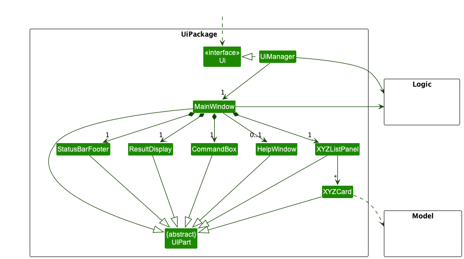
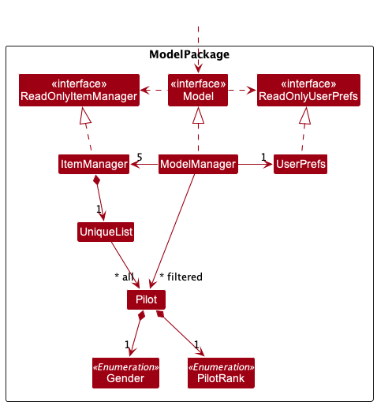
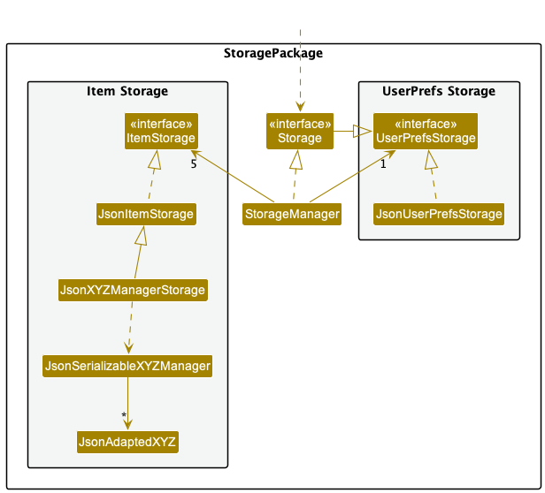

## Table of Contents

- **[Acknowledgements](#acknowledgements)**
- **[Setting up, getting started](#setting-up-getting-started)**
- **[Architecture](#architecture)**
    * [UI Component](#ui-component)
    * [Logic Component](#logic-component)
    * [Model Component](#model-component)
    * [Storage Component](#storage-component)
- **[Implementation](#implementation)**
    1. [Adding XYZ](#1-adding-xyz)
    2. [Deleting XYZ](#2-deleting-xyz)
    3. [Linking XYZ to a flight](#3-linking-xyz-to-a-flight)
    4. [Unlinking XYZ from a flight](#4-unlinking-xyz-from-a-flight)
    5. [Displaying flights across all modes](#5-displaying-item-list-of-all-modes)
- **[Additional Information](#additional-information)**
    - **[Service Locator](#service-locator)**
    - **[Functional Programming](#functional-programming)**
- **[Appendix: Requirements](#appendix--requirements)**

<div style="page-break-after: always;"></div>

## Acknowledgements

Wingman was built atop the codebase for AB3. Hence, it retains the 4 layers of
UI, Logic, Model, and Storage,
albeit involving different implementations and classes.

## Setting up, Getting started

Refer to the guide [_Setting up and getting started_](SettingUp.md).

<div style="page-break-after: always;"></div>

## Architecture

<p align="center">

</p>

The Architecture Diagram above explains the high-level design of Wingman which
is similar to AB-3.

Given below is a quick overview of main components and how they interact with
each other.

Main components of the architecture:

Main has two classes called Main and MainApp. It is responsible for,

* At app launch: Initializes the components in the correct sequence, and
  connects them up with each other.
* At shut down: Shuts down the components and invokes cleanup methods where
  necessary.
  Commons represents a collection of classes used by multiple other components.

The rest of the App consists of four components.

* UI: The UI of the App. The UI of Wingman is built using JavaFX with FXML.
* Logic: The command executor. This layer is responsible for parsing user
  input into executable commands, and executing them. It adopts the command
  pattern, the facade pattern, and the factory pattern.
* Model: Holds the data of the App in memory and defines the different
  entities.
* Storage: Reads data from, and writes data to, the hard disk.

<div style="page-break-after: always;"></div>

### UI Component

**API**
[`Ui.java`](https://github.com/AY2223S2-CS2103T-W11-1/tp/blob/master/src/main/java/seedu/address/ui/Ui.java)

<p align="center">

</p>

The UI consists of a `MainWindow` that is made up of parts
e.g.`CommandBox`, `ResultDisplay`, `FlightListPanel`, `StatusBarFooter` etc.
All these, including the `MainWindow`, inherit from the abstract `UiPart` class
which captures
the commonalities between classes that represent parts of the visible GUI.

<div style="border: 0px solid #ccc; background-color: #d9edff; color: darkblue; padding: 10px; margin-bottom: 10px;">
<strong>Note:</strong> XYZ in XYZListPanel and XYZCard is used to represent Flight, Pilot, Plane, Crew and Location.
All these resources are displayed in the Ui, but we have chosen to use the term XYZ to represent them in order to
to keep the diagram simple.
</div>

<br>

The `UI` component uses the JavaFx UI framework.
The layout of these UI parts are defined in matching `.fxml` files that are in
the `src/main/resources/view` folder.
For example, the layout of
the [`FlightListPanel`](https://github.com/AY2223S2-CS2103T-W11-1/tp/blob/master/src/main/java/seedu/address/ui/FlightListPanel.java)
is specified
in [`FlightListPanel.fxml`](https://github.com/AY2223S2-CS2103T-W11-1/tp/blob/master/src/main/resources/view/FlightListPanel.fxml)

The `UI` component,

* executes user commands using the `Logic` component.
* listens for changes to `Model` data so that the UI can be updated with the
  modified data.
* keeps a reference to the `Logic` component, because the `UI` relies on
  the `Logic` to execute commands.
* depends on some classes in the `Model` component, as it displays `Person`
  object residing in the `Model`.

<div style="page-break-after: always;"></div>

### Logic Component

**API** :
[`Logic.java`](https://github.com/AY2223S2-CS2103T-W11-1/tp/blob/master/src/main/java/wingman/logic/Logic.java)

<p align="center">

</p>

The `Logic` component does 3 very important things:

1. It parses the user input and returns the corresponding `Command` object.
2. It executes the command.
3. It persists the state to local persistent storage.

We shall be looking at the 3 parts one by one.

#### Command Parser

Wingman abandoned the use of the parser design in AB3. The main motivation
behind this is that we feel that AB3's parser design is too complicated.
Also, AB3's parser does not have the `mode` component, which is very
important to the design of Wingman.


> Just to give a brief explanation of Wingman's modal design. Essentially,
> just like vim, Wingman operates under different modes. When the user is in
> the `Flight` mode, then the user would be able to conduct flight-related
> operations. This design is inspired by the "spacial locality" idea in many
> computer science topics.

##### 2-level parsing

To make the parser more catered to Wingman's needs, we designed a 2-level
parsing scheme.

The outside parser is called
[`WingmanParser`](../src/main/java/wingman/logic/core/WingmanParser.java).
It can do two things:

- Pass a given command to a `CommandFactory` based on the command word
  that's stored to that `CommandFactory`.
- If no matching command words were to be found in the `CommandFactory`s
  stored at the `WingmanParser`, then the `WingmanParser` will pass the
  input to one `CommandGroup` to be parsed.

The inside parser is called a
[`CommandGroup`](../src/main/java/wingman/logic/core/CommandGroup.java).
What a `CommandGroup`. By design, only 1 `CommandGroup` can be active at any
time, and the active `CommandGroup` will take in a list of
[`CommandFactory`](../src/main/java/wingman/logic/core/CommandFactory.java)s,
which will be used to create a new `Command` object from the user input.

#### `FactoryParser` and `CommandParam`

Both `CommandGroup` and `WingmanParser` extends the
[`FactoryParser`](../src/main/java/wingman/logic/core/FactoryParser.java)
class, which is responsible for taking the user input as a `Deque<String>`
and converting it into a
[`CommandParam`](../src/main/java/wingman/logic/core/CommandParam.java).

A `CommandParam` essentially is a multi-map from `String` to `String` with an
optional
positional `String` value. The optional positional value will allow the user
to input something right after the command's first keyword. For example:

``` 
keyword something /someparam somevalue /someotherparam someothervalue
        ^^^^^^^^^ <- this is the positional value
```

One such use could be found in the
[`delete`](../src/main/java/wingman/logic/toplevel/delete/DeleteCommandFactory.java)
command:

```java
@Override
public DeleteCommand<T> createCommand(CommandParam param) throws ParseException{
    int index = param.getUnnamedIntOrThrow(); // Look at here
    return new DeleteCommand<>(index, getManagerFunction, deleteFunction);
}
```

The `param.getUnnamedIntOrThrow()` will return the positional value as an
integer, and throws a `ParseException` if the positional value is not an
integer. Note that unnamed and positional values are used interchangeably here.

##### Patterns used

From this, we can see that the parser design uses two design patterns:

- factory pattern;
- command pattern.

The factory pattern is used to create a new `Command` object from the user
input.

The benefit of having different instances of Commands rather than one
single instance that takes different parameters on each activation is that
by doing things this way, we would be able to store what actions are done if
needed. This part has not been implemented, but in the future, should we
implement a feature that allows the user to undo their actions, we could
just push command objects onto a stack and pop them off when the user wants
to undo.

The command pattern is used to execute the command. It is quite ordinary as
it does not differ significantly from the command pattern in AB3.

<div style="page-break-after: always;"></div>

### Model Component

**API** :
[`Model.java`](https://github.com/AY2223S2-CS2103T-W11-1/tp/blob/master/src/main/java/seedu/address/model/Model.java)
<p align="center">

</p>

The `Model` component,

* stores in memory Wingman data i.e., all `Item` objects (which are contained in
  a `UniquePersonList` object).
    * `Item` here refers to `Flight`, `Pilot`, `Plane`, `Location` and `Crew`
* stores in memory the currently 'selected' `Item` objects (e.g., results of a
  search query) as a separate _filtered_ list
  which is exposed to outsiders as an unmodifiable `ObservableList<Item>` that
  can be 'observed'
  e.g. the UI can be bound to this list so that the UI automatically updates
  when the data in the list change.
* stores in memory a `UserPref` object that represents the user’s preferences.
  This is exposed to the outside as a `ReadOnlyUserPref` objects.
* does not depend on any of the other three components
  (as the `Model` represents data entities of the domain,
  they should make sense on their own without depending on other components)

<div style="border: 0px solid #ccc; background-color: #d9edff; color: darkblue; padding: 10px; margin-bottom: 10px;">
<strong>Note:</strong> In the diagram above, we have used the Pilot class to give specific examples of the relations
between a resource class and its attributes as well as the relations between a resource class and
the UniqueList class. It must be noted however that different resource classes have different attributes and thus
will have some minor but important differences in their corresponding class diagrams.
Attributes of primitive types (e.g. age) have also been omitted from the diagrams for brevity.
</div>

Essentially, the `Model` component could be considered as the **domain**
layer of the application. It contains core application logic that should not
be altered even if we completely swap out the UI or storage components.

<div style="page-break-after: always;"></div>

### Storage Component

<p align="center">

</p>

The `Storage` component,

* can save both Wingman data and user preference data in json format,
  and read them back into corresponding objects.
* depends on some classes in the `Model` component (e.g. `UserPref`)
  because the `Storage` component's job is to save/retrieve objects that belong to the `Model`

<div style="border: 0px solid #ccc; background-color: #d9edff; color: darkblue; padding: 10px; margin-bottom: 10px;">
<strong>Note:</strong> XYZ in the diagram above is used to refer to Flight, Pilot, Plane, Crew and Location.
</div>

<div style="page-break-after: always;"></div>

### Overall Sequence

<p align="center">

</p>

This sequence diagram provides an overview of the different layers involved in
executing an example command.
The example used here is the command to add a plane of the following
specifications - (Model: A380, Age: 12).
This sequence is similar for most commands and the subsequent descriptions of
Wingman's features include more detailed
diagrams to depict the processes at each layer in greater detail.

<div style="page-break-after: always;"></div>

### Example Activity Diagram

<p align="center">

</p>

This activity diagram represents the path a user will take when trying to link a
resource entity, XYZ
to a flight. XYZ can be a `Flight`, `Plane`, `Location`, `Pilot` or `Crew`
entity.


<div style="page-break-after: always;"></div>

## Implementation

### 1. Adding XYZ

**How is this feature implemented?**

In our app, we have entities `Flight`, `Plane`, `Location`, `Pilot`, `Crew`, and
users can add new objects
into the database via `add` command.

This feature is enabled by the following classes:

* `AddCommand` - the command that can be executed and adds a new entity
  into the system
* `AddCommandFactory` - The factory class that creates `AddCommand`
  object, which can be executed to complete the task

When a user enters the command

```
add /XYZPrefix {} {XYZ identifier} [/OtherPrefixes {OtherAttributes}...]
```

Initially, when the input is received, it is processed by the UI layer, which
calls the logic.execute(input) function
and transfers the control to the logic layer. The execute(input) function in the
logic layer then utilizes the
WingmanParser to break down the input into tokens, determine the command's mode,
such as Crew, Flight, Location, Pilot,
or Plane, and identify the command's nature.

The WingmanParser's primary goal is to recognize the command type based on the
input and return the corresponding
command object. For instance, the AddXYZCommand object is returned with the {XYZ
identifier} after analyzing the input's
tokens.

To execute the DeleteXYZCommand, the appropriate XYZManager is employed.
Firstly, the getItem(id) function is used to
retrieve the corresponding XYZ that needs to be deleted. Next, the addXYZ(id)
function is called, which removes the
desired XYZ from the Wingman app using the item.removeItem(id) method.

Finally, the CommandResult message, indicating a successful deletion, is
returned to the user. GUI will display the
return message to the user.


**Why was it implemented this way?**

Our app has different operation `mode`, e.g., location and pilot. We wish to
share the common modules, but separate
different components. Here, we have a global logic manager that process the
input string with a parser, which
instantiate the command object corresponded to the mode. To execute
mode-specific command, we have a global manager that
routes commands to mode-specific managers all commands related to that mode.
These abstractions allow us to naturally
group functionalities among different groups and efficiently coordinate
different components.

**Alternatives considered for adding XYZ**

One alternative approach could be to use a more direct approach to add the new
entity without using a command pattern.
For instance, the UI layer could directly call the logic layer's addXYZ()
function, which would handle the addition of
the new entity. This approach, however, could make it more challenging to manage
the application's state, particularly
as the app grows more complex, and new features are added.

Another alternative is to use a different design pattern, such as the builder
pattern. In this approach, a builder
object is responsible for constructing an object in stages, and the construction
process can be further customized by
calling specific builder methods. This approach can be useful when the entity
being constructed has several configurable
attributes that need to be set. However, in our case, the entities have fixed
attributes, and the command pattern seems
to be a more natural fit.


<div style="page-break-after: always;"></div>

### 2. Deleting XYZ

**How is this feature implemented?**

The deleting feature is implemented in the same way for deleting crews, flights,
locations, pilots, and planes from the
Wingman app. Hence, in this description, the general term XYZ is used instead to
refer to all for simplicity.

This feature is enabled by the following classes in particular:

- `DeleteXYZCommand` - The command that deletes a XYZ from the Wingman app
- `DeleteXYZCommandFactory` - The factory class that creates a {@code
  DeleteXYZCommand}

When a user enters the command:

```
delete {XYZ identifier}
```

the input goes through the UI layer where `logic.execute(input)` is called which
passes control to the logic layer.

At the logic layer, `execute(input)` first parses the input using the
WingmanParser's `parse` function. The aim of
parsing is to determine what type of command the user's input is and determine
which mode - Crew, Flight, Location,
Pilot, or Plane - should handle the execution of said command.

The WingmanParser separates the input into tokens, determines what mode the
command is from, and then returns the
desired command type. In this case, the input allows the WingmanParser to
recognize it is a `DeleteXYZCommand` and as a
result, returns a new `DeleteXYZCommand` with the {XYZ identifier}.

The `DeleteXYZCommand` is executed using the corresponding `XYZManager`.
Firstly, the `XYZManager` uses `getItem(id)`
to find the corresponding XYZ to be deleted. Secondly, the `XYZManager` calls
the `deleteXYZ(id)` method. The
`deleteXYZ(id)` method uses the `item.removeItem(id)` method in order to remove
the desired XYZ from the Wingman app.

Finally, the `CommandResult` is returned which is the message the user will see
indicating a successful deletion.


**Why was it implemented this way?**

For the parsing logic in the Wingman app, the commands were split based on their
related "mode." This implementation
decision was made so that parsing would be more simple across the five modes. To
elaborate, each mode would handle their
related commands only.

**Alternatives considered for deleting XYZ:**

Description coming soon


<div style="page-break-after: always;"></div>

### 3. Linking XYZ to a flight

**Rationale**

The rationale behind creating a `Link` class is that only such affords us
the ability to describe a relationship between two objects in away that's safe.

**How is this feature implemented?**

This linking feature is implemented in a similar way to the unlinking
feature for crews, locations, pilots, and planes to flights.

Hence, in this description the general term XYZ is used instead.

This feature is enabled by the following classes in particular:

- `LinkXYZCommand` - The command that links a crew to a flight
- `LinkXYZCommandFactory` - The factory class that creates an {@code
  LinkCrewCommand}
- `Link` - The class defining a link to a target
- `Flight` - The class defining a flight object in Wingman

- When a user enters the command:

```
link /XYZprefix {XYZ identifier} /fl {flight identifier}
```

this command is passed from the UI layer to the logic layer similar to the
way described above, in the 'Unlinking XYZ' section.

At the logic layer, while the sequence of method calls is similar to what is
described in the 'Adding XYZ' section, the `LinkXYZCommand.execute(model)`
method is called instead of the `UnlinkXYZCommand.execute(model)` method.

This method then calls the `flight.XYZLink.add(entry.getKey(), entry.getValue
())` method where entry refers to one key-value pairing in a mapping of
`FlightXYZType` keys to `XYZ` values. At this point, the process is at the
model layer and continues with method calls similar to the ones described in
the 'Unlinking XYZ from a flight' section until the control is passed back
to the logic layer.

Subsequently, the control is passed to the storage layer through the
`logicManager.save()` method.
This method calls `storage.saveXYZManager(model.getXYZManager())` and
`storage.saveFlightManager(model.getFlightManager())`;, to save the updated
flight and XYZ objects in storage. Since
these 2 method calls work in the same way, we shall focus on just the latter,
to be succinct.

After `model.getFlightManager()` returns the model, the saveFlightManager
method calls the `saveFlightManager(flightManager, flightStorage.getPath())`
method in the same class. flightStorage is an ItemStorage<Flight> object
and flightManager is an `ReadOnlyItemManager<Flight>` object. This method
call uses the imported json package to store `JsonIdentifiableObject`
versions of the flightManager which in turn contains the `JsonAdaptedFlights`,
including the flight with the updated link represented as a
`Map<FlightXYZType, Deque<String>>` object.

**Why this way?**

In this way, we are able to make the link feature work in a very similar way
to the unlink feature, simply swapping
some methods to perform the opposite operation (particularly the execute
function of the LinkXYZCommand class).

**Alternatives that were considered:**

One alternative implementation that was considered was to set the link as an
attribute in the flight class and update
it directly with every change. However, this approach had a few limitations
as discussed in the previous section.


<div style="page-break-after: always;"></div>

### 4. Unlinking XYZ from a flight

**How is this feature implemented?**

This unlinking feature is implemented in the same way for unlinking crews,
locations, pilots and planes from flights.
Hence, in this description the general term XYZ is used instead.

This feature is enabled by the following classes in particular:

- `UnlinkXYZtoFlightCommand` - The command that unlinks a crew from a flight
- `XYZFlightLinkCommandFactory` - The factory class that creates an `UnlinkXYZtoFlightCommand`
- `Link` - The class defining a link to a target
- `Flight` - The class defining a flight object in Wingman

When a user enters the command:

```
unlink /XYZprefix {XYZ identifier} /fl {flight identifier}
```

this command is passed from the UI layer to the logic layer similar to the way
described above, in the
'Adding XYZ' section.

At the logic layer, while the sequence of method calls is similar to what is
described in the 'Deleting XYZ' section,
the `UnlinkXYZCommand.execute(model)` method is called instead of
the `DeleteXYZCommand.execute(model)` method.

This method then calls
the `flight.XYZLink.delete(entry.getKey(), entry.getValue())` method
where `entry` refers to
one key-value pairing in a mapping of FlightXYZType keys to XYZ values.
At this point, the process is at the model layer and continues with method calls
similar to the ones described in the
'Linking XYZ to a flight' section until the control is passed back to the logic
layer.

Subsequently, the control is passed to the storage layer through
the `logicManager.save()` method.
This method calls `storage.saveXYZManager(model.getXYZManager())` and
`storage.saveFlightManager(model.getFlightManager());`, to save the updated
flight and XYZ objects in storage. Since
these 2 method calls work in the same way, we shall focus on just the latter, to
be succinct.


After `model.getFlightManager()` returns the model, the `saveFlightManager`
method calls the
`saveFlightManager(flightManager, flightStorage.getPath())` method in the same
class.
`flightStorage` is an `ItemStorage<Flight>` object and flightManager is
an `ReadOnlyItemManager<Flight>` object.
This method call uses the imported json package to store '
JsonIdentifiableObject' versions of the flightManager
which in turn contains the JsonAdaptedFlights, including the flight with the
updated link represented as a
`Map<FlightXYZType, Deque<String>>` object.

**Why was it implemented this way?**

In this way, we are able to make the unlink feature work in a very similar way
to the link feature, simply swapping
some methods to perform the opposite operation (particularly the `execute`
function of the `UnlinkXYZCommand` class).

**Alternatives considered for unlinking XYZ from a flight:**

One alternative implementation that was considered was to set the link as an
attribute in the flight class and update
it directly with every change. However, this approach had a few limitations as
discussed in the previous section.


<div style="page-break-after: always;"></div>

### 5. Displaying item list of all modes

Initially, there is only one `ItemListPanel` that displays an item list storing
resource entities specific to each mode.
However, in order to link an object (pilot/crew/location/plane) to a flight, a
separate list panel displaying flights is
necessary for ease of selecting and linking to a specific flight.

To further simplify navigation between modes, lists
displaying flights, pilots, crew members, locations and planes are all shown in
one display window. While switching mode
is still necessary for adding/deleting/linking a resource entity of a specific
mode, viewing lists from other modes can
be done across all modes.

**Implementation of display of item lists**

In the implementation as seen in the image below, the `MainWindow` can be filled
by `FlightListPanel`, `CrewListPanel`,
`PlaneListPanel`,`PilotListPanel`,`LocationListPanel`:

`FlightListPanel`: displays information about each `Flight` using a `FlightCard`
in a `ListView`.

`CrewListPanel`: displays information about each `Crew` using a `CrewCard` in
a `ListView`.

`PlaneListPanel`: displays information about each `Plane` using a `PlaneCard` in
a `ListView`.

`PilotListPanel`: displays information about each `Pilot` using a `PilotCard` in
a `ListView`.

`LocationwListPanel`: displays information about each `Location` using
a `LocationCard` in a `ListView`.

<p align="center">

</p>

By having separate list panels, it will be easier to customise the display of
different Item types if required by ui
improvements.

In each `FlightCard` as seen in the image below, the flight’s code will be shown
together with the planes/pilots/crew
members/locations linked to it.

In each `CrewCard`, the crew member's name will be shown with his/her rank.

In each `PlaneCard`, the plane's model and its age are shown.

In each `PilotCard`, the pilot's name, rank, age, gender and flight hours are
shown.

In each `LocationCard`, the location and its linked planes, pilots and crew
members will be shown.

By modifying the layout and dividing into a left section which shows the
resources, and a right section which shows the
flights,
we can keep the information displayed organised and clear to the user.

**Alternatives considered for display of flights:**

* Alternative 1 (current choice): Has five panels to display items in one
  display window
* Pros: Easy to implement and can view all the information simultaneously after
  a command is executed.
    * Cons: Too cramped, which may lead to information overload.
* Alternative 2: Has one display window for items and a separate display window
  for flights
    * Pros: More organised and visually pleasant.
    * Cons: Hard to implement and unable to view 2 panels simultaneously without
      switching between windows

<div style="page-break-after: always;"></div>

## Additional Information

### Service Locator

Service locator is like a globel variable that can be accessed from anywhere in
the code. This reduces the hassle of passing the code from one place to
another, i.e. reducing the number of parameters in a method. However, it
also has its disadvantages. For example: it increases the coupling between
classes, and makes the code harder to test.

In this part, we will briefly introduce how we implemented the service
locator in the project. Further, we will discuss how we planned to conquer
the disadvantages of using a service locator.

#### Details

The service locator is implemented in the
[`GetUtil`](../src/main/java/wingman/commons/util/GetUtil.java) class.

It contains a `HashMap` that maps a `Class` object to a `Lazy` object
containing the corresponding instance of the class. Therefore, when the user
queries for an instance of a class, the service locator will return the
corresponding instance.

When the user puts an instance into the service locator, the service locator
will wrap the instance into a `Lazy` object and put it into the `HashMap`.
Alternatively, the user can put a `Supplier` object into the service locator.
The service locator will wrap the `Supplier` object into a `Lazy` object and
put it into the `HashMap`. The `Lazy` object will only be evaluated when the
user queries for the instance.

### Functional Programming

The `Lazy` object mentioned above utilizes functional programming. The goal
is to make illegal states unrepresentable.


## Appendix: Requirements

### Product scope

**Target user profile**:

* has a need to manage a significant number of flights, pilots and crews
* prefer desktop apps over other types
* can type fast
* prefers typing to mouse interactions
* is reasonably comfortable using CLI apps

**Value proposition**:

Airline managers will be able to take labor, welfare, and
resource optimization
into consideration such that they can assign tasks to the most appropriate crew
based on their location
and availability while optimizing their staff’s physical well-being.

<br>

### User stories

Priorities: High (must have) - `* * *`, Medium (nice to have) - `* *`, Low (
unlikely to have) - `*`

| Priority | As a …​         | I want to …​                                                    | So that I can…​                                            |
|----------|-----------------|-----------------------------------------------------------------|------------------------------------------------------------|
| `* * *`  | airline manager | add new locations to the list of locations where we operate     | I can assign new departing locations and arrival locations |
| `* * *`  | airline manager | list old locations from the locations where we were operating   | I can view all the locations                               |
| `* * *`  | airline manager | remove old locations from the locations where we were operating | I can update departing locations and arrival locations     |
| `* * *`  | airline manager | add crew to our workforce                                       | I can assign them to flights                               |
| `* * *`  | airline manager | list crew from our workforce                                    | I can view all the crew                                    |
| `* * *`  | airline manager | delete crew from our workforce                                  | I can remove them from flights                             |
| `* * *`  | airline manager | add new planes to our fleet                                     | I can assign them to flights                               |
| `* * *`  | airline manager | list planes from our fleet                                      | I can view all the planes in our fleet                     |
| `* * *`  | airline manager | remove old planes from our fleet                                | I can update planes which can be used for flights          |
| `* * *`  | airline manager | add new pilots to the crew list                                 | I can assign flights to pilots                             |
| `* * *`  | airline manager | remove pilots from the locations                                | I can retire some pilots                                   |
| `* * *`  | airline manager | add a new flight to the scheduled flights                       | know what flights are upcoming                             |
| `* * *`  | airline manager | remove a flight from the scheduled flights                      | know what flights are upcoming                             |
| `* * *`  | airline manager | list the scheduled flights                                      | view all the upcoming flights                              |
| `* * *`  | airline manager | link locations to flights                                       | know the departure and arrival locations for each flight   |
| `* * *`  | airline manager | link planes to flights                                          | know what plane is assigned to what flight                 |
| `* * *`  | airline manager | link pilots to flights                                          | know what pilots are flying which flights                  |
| `* * *`  | airline manager | link crew to flights                                            | know which crew are assigned to which flight               |
| `* * *`  | airline manager | unlink locations from flights                                   | change the departure and arrival locations for each flight |
| `* * *`  | airline manager | unlink planes from flights                                      | change what plane is assigned to what flight               |
| `* * *`  | airline manager | unlink pilots from flights                                      | change what pilots are flying which flights                |
| `* * *`  | airline manager | unlink crew from flights                                        | change which crew are assigned to which flight             |
| `* *`    | airline manager | link planes to locations                                        | know where each plane is located                           |
| `* *`    | airline manager | link pilots to locations                                        | know where each pilot is located                           |
| `* *`    | airline manager | link crew to locations                                          | know where each crew is located                            |
| `* *`    | airline manager | unlink planes from locations                                    | change where a plane is located                            |
| `* *`    | airline manager | unlink pilots from locations                                    | change where a pilot is located                            |
| `* *`    | airline manager | unlink crew from locations                                      | change where a crew is located                             |

*{More to be added}*


<div style="page-break-after: always;"></div>

### Use cases

(For all use cases below, the **System** is the `Wingman` and the **Actor**
is the `user`, unless specified otherwise)

**Use case: Delete a location**

**MSS**

1. User requests to list locations
2. Wingman shows a list of locations
3. User requests to delete a specific location in the list
4. Wingman deletes the location
5. User request to add a location
6. Wingman adds the location

   Use case ends.

**Extensions**

* 3a. The given location is invalid.
    * 3a1. AddressBook shows an error message.
      Use case resumes at step 2.

* 5b. The given location is a duplicate of an existing one
    * 5b1. Wingman shows an error message.
      Use case resumes at step 4.

**Use case: Delete a crew**

**MSS**

1. User requests to list crew
2. Wingman shows a list of crew
3. User requests to delete a specific crew in the list
4. Wingman deletes the crew
5. User request to add a crew
6. Wingman adds the crew

   Use case ends.

**Extensions**

* 2a. The list is empty.
  Use case ends.

* 3a. The given crew is invalid.
    * 3a1. AddressBook shows an error message.
      Use case resumes at step 2.

* 5b. The given crew is a duplicate of an existing one
    * 5b1. Wingman shows an error message.
      Use case resumes at step 4.
    * 5b1. Wingman shows an error message.
      Use case resumes at step 4.

**Use case: Delete a plane**

**MSS**

1. User requests to list planes
2. Wingman shows a list of planes
3. User requests to delete a specific plane in the list
4. Wingman deletes the plane
5. User request to add a plane
6. Wingman adds the plane

   Use case ends.

**Extensions**

* 2a. The list is empty.
  Use case ends.

* 3a. The given plane is invalid.
    * 3a1. The AddressBook shows an error message. Use case resumes at step 2.

* 5b. The given plane is a duplicate of an existing plane.
    * 5b1. Wingman shows an error message. Use case resumes at step 4.

**Use case: Add a pilot**

**MSS**

1. User requests to add a pilot
2. User specifies the basic information of the pilot
3. Wingman adds the pilot

   Use case ends.

**Extensions**

* 2a. The given pilot is invalid.
    * 2a1. Wingman shows an error message.
      Use case resumes at step 2.
* 3a. The given pilot is a duplicate of an existing one
    * 3a1. Wingman shows an error message.
      Use case resumes at step 2.

**Use case: Delete a pilot**

**MSS**

1. User requests to delete a specific pilot in the list
2. Wingman deletes the pilot
3. User request to add a pilot
4. Wingman adds the pilot

   Use case ends.

**Use case: Add a flight**

**MSS:**

1. User chooses 'flight' mode
2. Wingman shows a list of scheduled flights
3. User enters details of the new flight to add to schedule
4. Wingman adds the details of the new flight to list of scheduled flights
   Use case ends.

**Extensions:**

* 3a. The given flight details are invalid.

    * 3a1. Wingman shows an error message and an example of a correct command.

      Use case resumes at step 2.

*{More to be added}*


<div style="page-break-after: always;"></div>

### Non-Functional Requirements

1. Should work on any _mainstream OS_ as long as it has Java `11` or above
   installed.
2. Should be able to hold up to 100 flights, crews, and pilots without a
   noticeable sluggishness in performance for
   typical usage.
3. A user with above average typing speed for regular English text (i.e. not
   code, not system admin commands) should be
   able to accomplish most of the tasks faster using commands than using the
   mouse.
4. The system should respond within a second.
5. The data should be stored locally and should be in a human editable text
   file.
6. Should work without requiring an installer or a remote server
7. Should be for a single user and should not have any shared file storage
   mechanism

<br>

### Glossary

* **Location**: A unit place that flights may depart from or arrive at.
* **Crew**: A unit person who can be added to or deleted from a flight.
* **Pilot**: Someone that is certified to fly an aircraft.
* **Plane**: A unit plane which can be assigned to flights.
* **Flight**: An activity with start and end locations, to which pilots, planes
  and crew can be assigned.

