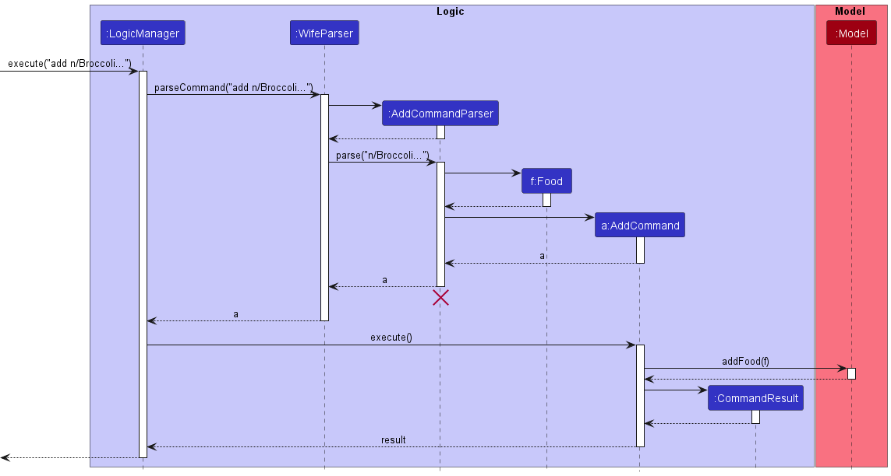
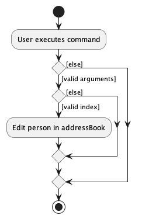
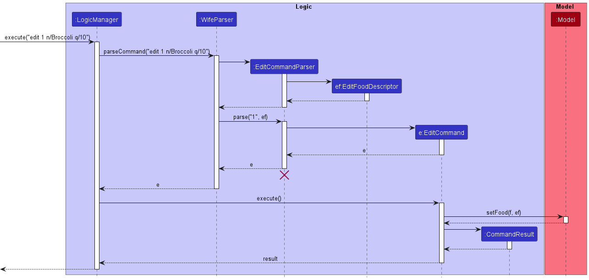
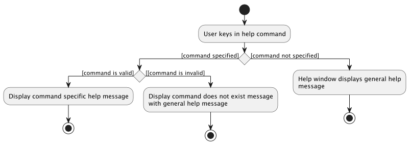
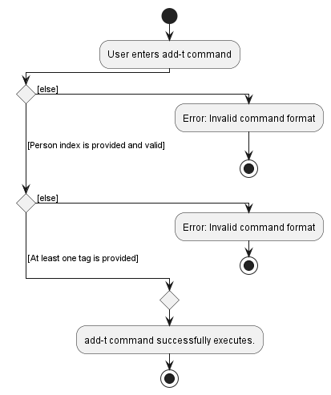
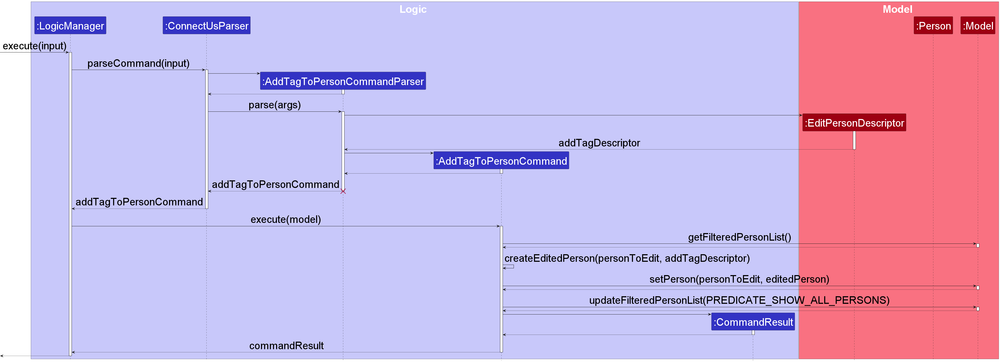
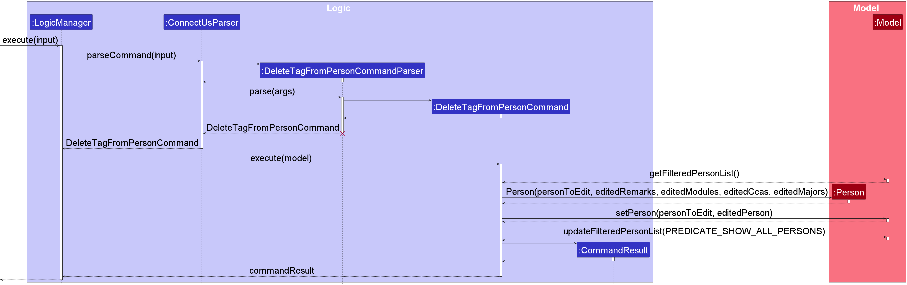
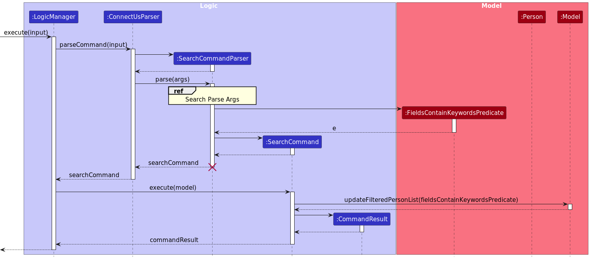
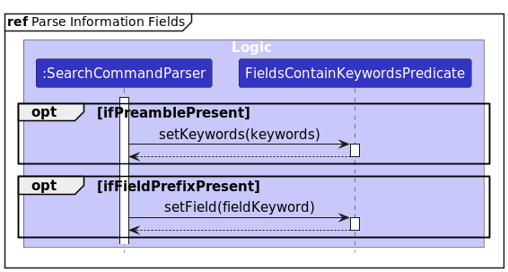
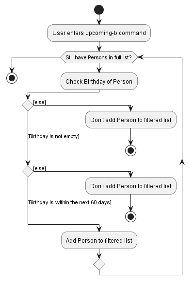

# Welcome to ConnectUS!

ConnectUS is a **contact management system** that enables NUS School of Computing (SoC) students to better manage their contact information. Users can leverage on ConnectUS' **contact management system** to view and edit their contact information. The **tagging system** also helps users better organize their contact information according to their needs.

ConnectUS focuses on:

- **Efficiency**: Optimized for use via a Command Line Interface (CLI), **easily view and edit contacts** with the **contact management system**.
- **User-friendliness**: With the benefits of having a Graphical User Interface (GUI), **users can easily navigate through contact information** to find exactly what they need to **connect** with others.

This Developer Guide provides an in-depth documentation on how ConnectUS is designed and implemented. It covers high-level details such as the architecture of ConnectUS, to detailed specifications on smaller pieces of the design such as how commands are implemented. It also includes a glossary for definitions of terms used in ConnectUS.

You can use this guide to help maintain, upgrade, and evolve ConnectUS.

---

# Table of Contents

- [1. Preface](#1-preface)
  - [1.1 Acknowledgements](#11-acknowledgements)
  - [1.2 Setting Up, Getting Started](#12-setting-up-getting-started)
- [2. How to Use the Developer Guide](#2-how-to-use-the-developer-guide)
  - [2.1 Notation](#21-notation)
  - [2.2 Navigation](#22-navigation)
- [3. Design](#3-design)
  - [3.1 Architecture](#31-architecture)
  - [3.2 UI Component](#32-ui-component)
  - [3.3 Logic Component](#33-logic-component)
  - [3.4 Model Component](#34-model-component)
  - [3.5 Storage Component](#35-storage-component)
  - [3.6 Common Classes](#36-common-classes)
- [4. Implementation](#4-implementation)
  - [4.1 Add Command](#41-add-command)
  - [4.2 Edit Command](#42-edit-command)
  - [4.3 Help Command](#43-help-command)
  - [4.4 Adding Additional Tags Command](#44-adding-additional-tags-command)
  - [4.5 Deleting Individual Tags Command](#45-deleting-individual-tags-command)
  - [4.6 Search Command](#46-search-command)
  - [4.7 Upcoming Birthdays Command](#47-upcoming-birthdays-command)
- [5. Planned Enhancements](#5-planned-enhancements)
  - [5.1 Improve Edit Command](#51-improve-edit-command)
  - [5.2 Better Information Field Validation](#52-better-information-field-validation)
  - [5.3 More Language Support](#53-more-language-support)
  - [5.4 More Social Media Support](#54-more-social-media-support)
  - [5.5 Improve UI](#55-improve-ui)
  - [5.6 Improve Tag Deletion Command](#56-improve-tag-deletion-command)
  - [5.7 Improve Consistency of Command Feedback](#57-improve-consistency-of-command-feedback)
  - [5.8 Removing of Optional Information Fields](#58-removing-of-optional-information-fields)
- [6. Documentation, Testing, and Other Guides ](#6-documentation-testing-and-other-guides)
- [7. Instructions for Manual Testing](#7-instructions-for-manual-testing)
  - [7.1 Launch and Shutdown](#71-launch-and-shutdown)
  - [7.2 Adding a Person](#72-adding-a-person)
  - [7.3 Editing a Person](#73-editing-a-person)
  - [7.4 Deleting a Person](#74-deleting-a-person)
  - [7.5 Adding Additional Tags to a Person](#75-adding-additional-tags-to-a-person)
  - [7.6 Deleting Tags from a Person](#76-deleting-tags-from-a-person)
  - [7.7 Searching for a Person](#77-searching-for-a-person)
  - [7.8 Opening a Person's social media links in app](#78-opening-a-persons-social-media-links-in-app)
  - [7.9 Opening a social media platform with prefilled message](#79-opening-a-social-media-platform-with-prefilled-message)
  - [7.10 Viewing Upcoming Birthdays](#710-view-upcoming-birthdays)
- [8. Requirements](#8-requirements)
  - [8.1 Product Scope](#81-product-scope)
  - [8.2 User Stories](#82-user-stories)
  - [8.3 Use Cases](#83-use-cases)
  - [8.4 Non-Functional Requirements](#84-non-functional-requirements)
- [9. Glossary](#9-glossary)

---

# 1. Preface

## 1.1 Acknowledgements

ConnectUS is a <u>brownfield</u> software project based on [AddressBook Level-3](https://se-education.org/addressbook-level3/) created by the [SE-EDU initiative](https://se-education.org), as part of the [CS2103T Software Engineering module](https://nus-cs2103-ay2223s2.github.io/website/index.html) by SoC at the National University of Singapore (NUS).

This project is a **part of the se-education.org** initiative. If you would like to contribute code to this project, see [se-education.org](https://se-education.org#https://se-education.org/#contributing) for more info.

Java libraries used in this project:

* [Jackson](https://github.com/FasterXML/jackson) for Storage,
* [JavaFX](https://openjfx.io/) for UI,
* [JUnit5](https://github.com/junit-team/junit5) for Testing.

## 1.2 Setting Up, Getting Started

Refer to the guide [_Setting up and getting started_](SettingUp.md).

[↑ Back to table of contents](#table-of-contents)

---

# 2. How to Use the Developer Guide

Thank you for your interest in ConnectUS! We aim to provide you with all the information necessary to understand, maintain, upgrade, and evolve ConnectUS.

While you do not need to read the Developer Guide in a sequential order, we recommend going through the [Design](#3-design) section to get a high-level overview of ConnectUS before looking for information that concerns you.

## 2.1 Notation

Some special notations are used throughout this guide:

- [Links in blue](#21-notation) will help you navigate through this document, or take you to places on the Internet.
- **Bolded words** are phrases that you should pay attention to.
- <u>Underlined words</u> can be found in the [Glossary](#9-glossary).

## 2.2 Navigation

The Developer Guide has six main sections:

1. [Design](#3-design)
2. [Implementation](#4-implementation)
3. [Planned Enhancements](#5-planned-enhancements)
4. [Documentation, Testing, and Other Guides](#6-documentation-testing-and-other-guides)
5. [Instructions for Manual Testing](#7-instructions-for-manual-testing)
6. [Requirements](#8-requirements)

- If you are a **developer**, the first four sections will be most applicable to you. [Design](#3-design) gives you a high-level overview of how ConnectUS is structured, and information on the key components of ConnectUS. [Implementation](#4-implementation) addresses how the features in ConnectUS are implemented. [Planned Enhancements](#5-planned-enhancements) provides insights on known bugs and issues in the latest release of ConnectUS, and plans we have to address and fix these issues. Finally, [Documentation, Testing, and Other Guides](#6-documentation-testing-and-other-guides) provides guides on creating documentation, logging, testing, configuring, and DevOps for ConnectUS.

- If you are a **tester**, the [Instructions for Manual Testing](#7-instructions-for-manual-testing) will provide you with a guide for testing. It covers how to launch and shut down the application, as well as how to test some commands in ConnectUS.

- If you are in the **marketing or product team**, or are interested in knowing why ConnectUS was created, the [Requirements](#8-requirements) section addresses our [Product Scope](#81-product-scope), [User Stories](#82-user-stories), [Use Cases](#83-use-cases), and [Non-Functional Requirements (NFRs)](#84-non-functional-requirements).

- Refer to the [Glossary](#9-glossary) for definitions of terms used in ConnectUS.

[↑ Back to top of section](#2-how-to-use-the-developer-guide)

[↑ Back to table of contents](#table-of-contents)

---

# 3. Design

This section will provide you with a high-level overview of how ConnectUS is structured, as well as information on the key components of ConnectUS.

Firstly, the [Architecture](#31-architecture) section gives an overview of how each of the main components in ConnectUS interact with each other.

ConnectUS has four main components, namely:

1. [UI](#32-ui-component)
2. [Logic](#33-logic-component)
3. [Model](#34-model-component)
4. [Storage](#35-storage-component)

Each section of these components will describe the smaller subcomponents within them.

Finally, the [Commons](#36-common-classes) section covers classes that are used by multiple components in ConnectUS.

:bulb: **Tip:**  

The `.puml` files used to create diagrams in this document can be found in the [diagrams](https://github.com/AY2223S2-CS2103T-W15-1/tp/tree/master/docs/diagrams) folder. Refer to the [_PlantUML Tutorial_ at se-edu/guides](https://se-education.org/guides/tutorials/plantUml.html) to learn how to create and edit diagrams.

## 3.1 Architecture

The **_Architecture Diagram_** given above explains the high-level design of the App.

Given below is a quick overview of main components and how they interact with each other.

**Main components of the <u>architecture</u>**

**`Main`** has two classes called [`Main`](https://github.com/AY2223S2-CS2103T-W15-1/tp/blob/master/src/main/java/seedu/address/Main.java) and [`MainApp`](https://github.com/AY2223S2-CS2103T-W15-1/tp/blob/master/src/main/java/seedu/address/MainApp.java). It is responsible for:

- At app launch: Initializes the components in the correct sequence, and connects them up with each other.
- At shut down: Shuts down the components and invokes cleanup methods where necessary.

[**`Commons`**](#36-common-classes) represents a collection of classes used by multiple other components.

The rest of the App consists of four components.

- [**`UI`**](#32-ui-component): The UI of the App.
- [**`Logic`**](#33-logic-component): The command executor.
- [**`Model`**](#34-model-component): Holds the data of the App in memory.
- [**`Storage`**](#35-storage-component): Reads data from, and writes data to, the hard disk.

**How the architecture components interact with each other**

The _Sequence Diagram_ below shows how the components interact with each other for the scenario where the user issues the command `delete 1`.

Each of the four main components (also shown in the diagram above):

- defines its _API_ in an `interface` with the same name as the Component.
- implements its functionality using a concrete `{Component Name}Manager` class (which follows the corresponding API `interface` mentioned in the previous point.

For example, the `Logic` component defines its API in the `Logic.java` interface and implements its functionality using the `LogicManager.java` class which follows the `Logic` interface. Other components interact with a given component through its interface rather than the concrete class (reason: to prevent outside component's being coupled to the implementation of a component), as illustrated in the (partial) class diagram below.

The sections below give more details of each component.

:memo: **Note:** 

In this Developer Guide, contacts that users add to the [ConnectUS contact list](https://ay2223s2-cs2103t-w15-1.github.io/tp/UserGuide.html#313-contact-list) will be referred to as `Person`.

[↑ Back to top of section](#3-design)

[↑ Back to table of contents](#table-of-contents)

## 3.2 UI component

The **API** of this component is specified in [`Ui.java`](https://github.com/AY2223S2-CS2103T-W15-1/tp/blob/master/src/main/java/seedu/connectus/ui/Ui.java)

The UI consists of a `MainWindow` that is made up of parts e.g.`CommandBox`, `ResultDisplay`, `PersonListPanel`, `StatusBarFooter` etc. All these, including the `MainWindow`, inherit from the abstract `UiPart` class which captures the commonalities between classes that represent parts of the visible GUI.

The `UI` component uses the JavaFx UI framework. The layout of these UI parts are defined in matching `.fxml` files that are in the `src/main/resources/view` folder. For example, the layout of the [`MainWindow`](https://github.com/AY2223S2-CS2103T-W15-1/tp/blob/master/src/main/java/seedu/connectus/ui/MainWindow.java) is specified in [`MainWindow.fxml`](https://github.com/AY2223S2-CS2103T-W15-1/tp/blob/master/src/main/resources/view/MainWindow.fxml)

The `UI` component:

- executes user commands using the `Logic` component.
- listens for changes to `Model` data so that the UI can be updated with the modified data.
- keeps a reference to the `Logic` component, because the `UI` relies on the `Logic` to execute commands.
- depends on some classes in the `Model` component, as it displays `Person` object residing in the `Model`.

[↑ Back to top of section](#3-design)

[↑ Back to table of contents](#table-of-contents)

## 3.3 Logic component

**API** : [`Logic.java`](https://github.com/AY2223S2-CS2103T-W15-1/tp/blob/master/src/main/java/seedu/connectus/logic/Logic.java)

Here's a (partial) class diagram of the `Logic` component:

How the `Logic` component works:

1. When `Logic` is called upon to execute a command, it uses the `ConnectUsParser` class to parse the user command.
1. This results in a `Command` object (more precisely, an object of one of its subclasses e.g., `AddCommand`) which is executed by the `LogicManager`.
1. The command can communicate with the `Model` when it is executed (e.g. to add a person).
1. The result of the command execution is encapsulated as a `CommandResult` object which is returned back from `Logic`.

The Sequence Diagram below illustrates the interactions within the `Logic` component for the `execute("delete 1")` API call.

:information_source: **Note:** 

The lifeline for `DeleteCommandParser` should end at the destroy marker (X) but due to a limitation of PlantUML, the lifeline reaches the end of diagram.

Here are the other classes in `Logic` (omitted from the class diagram above) that are used for parsing a user command:

How the parsing works:

- When called upon to parse a user command, the `ConnectUsParser` class creates an `XYZCommandParser` (`XYZ` is a <u>placeholder</u> for the specific command name e.g., `AddCommandParser`) which uses the other classes shown above to parse the user command and create a `XYZCommand` object (e.g., `AddCommand`) which the `ConnectUsParser` returns back as a `Command` object.
- All `XYZCommandParser` classes (e.g., `AddCommandParser`, `DeleteCommandParser`, ...) inherit from the `Parser` interface so that they can be treated similarly where possible e.g, during testing.

[↑ Back to top of section](#3-design)

[↑ Back to table of contents](#table-of-contents)

## 3.4 Model component

**API** : [`Model.java`](https://github.com/AY2223S2-CS2103T-W15-1/tp/blob/master/src/main/java/seedu/connectus/model/Model.java)

The `Model` component,

- stores the address book data i.e., all `Person` objects (which are contained in a `UniquePersonList` object).
- stores the currently 'selected' `Person` objects (e.g., results of a search query) as a separate _filtered_ list which is exposed to outsiders as an unmodifiable `ObservableList<Person>` that can be 'observed' e.g. the UI can be bound to this list so that the UI automatically updates when the data in the list change.
- stores a `UserPref` object that represents the user’s preferences. This is exposed to the outside as a `ReadOnlyUserPref` objects.
- does not depend on any of the other three components (as the `Model` represents data entities of the domain, they should make sense on their own without depending on other components)

:information_source: **Note:** 

An alternative (arguably, a more OOP) model is given below. It has a `Tag` list in `ConnectUS`, which `Person` references. This allows `ConnectUS` to only require either one `Module` object, `CCA` object, `Major` object, or `Remark` object per unique tag, instead of each `Person` needing their own tag type objects. It also ensures that no duplicate tags are created. 

[↑ Back to top of section](#3-design)

[↑ Back to table of contents](#table-of-contents)

## 3.5 Storage component

**API** : [`Storage.java`](https://github.com/AY2223S2-CS2103T-W15-1/tp/blob/master/src/main/java/seedu/connectus/storage/Storage.java)

The `Storage` component,

- can save both address book data and user preference data in json format, and read them back into corresponding objects.
- inherits from both `ConnectUsStorage` and `UserPrefStorage`, which means it can be treated as either one (if only the functionality of only one is needed).
- depends on some classes in the `Model` component (because the `Storage` component's job is to save/retrieve objects that belong to the `Model`)

[↑ Back to top of section](#3-design)

[↑ Back to table of contents](#table-of-contents)

## 3.6 Common classes

Classes used by multiple components are in the `seedu.connectus.commons` package.

**API** : [`Commons.java`](https://github.com/AY2223S2-CS2103T-W15-1/tp/tree/master/src/main/java/seedu/connectus/commons)

[↑ Back to top of section](#3-design)

[↑ Back to table of contents](#table-of-contents)

---

# 4. Implementation

This section describes some noteworthy details on how certain features are implemented.

## 4.1 Add Command

**Overview:**

The `add` command is used to create a new `Person` in ConnectUS with information fields specified by the user, namely the `Name`, `Phone`, `Email`, `Address`, `Birthday`, `Social Media` (i.e. Telegram, Instagram, WhatsApp), and [tags](https://ay2223s2-cs2103t-w15-1.github.io/tp/UserGuide.html#59-tags) such as <u><code>Module</code></u>, <u><code>CCA</code></u>, <u><code>Major</code></u> and `Remark` fields.

The format for the `add` command can be found [here](https://ay2223s2-cs2103t-w15-1.github.io/tp/UserGuide.html#adding-a-person-add).

**Feature Details:**

1. The user specifies a name for the `Person` to be added. The user can optionally specify the `Phone`, `Email`, `Address`, `Birthday`, `Social Media`, and tags such as `Module`, `CCA`, `Major`, and `Remark` fields.
2. If the person name is not provided, or if invalid command parameters are provided, the user will be prompted to re-enter the command correctly via an error message.
3. The `Person` is cross-referenced in the `Model` to check if it already exists. If it does, then an error is raised as feedback to the user.
4. If step 3 completes without exceptions, the new `Person` will be successfully added and stored inside the contact list.

The following activity diagram shows the logic of adding a `Person` into the contact list.

The sequence of the `add` command is as follows:

1. The command `add INPUT` is entered by the user (e.g. `add n/Jason`).
2. `Logic Manger` calls the `ConnectUsParser#parseCommand` with the `INPUT`.
3. `ConnectUsParser` parses the command word, creating an instance of `AddCommandParser` to `parse` the `informationFields` via the respective `ParserUtil` functions.
4. `AddCommandParser` creates the corresponding `Person` object. This `Person` object is taken as the input of a new `AddCommand` object created by `AddCommandParser`.
5. `Logic Manager` executes `AddCommand#execute`, adding the `Person` to the model through `AddCommand` calling `Model#addPerson`.
6. A `Command Result` is returned with the result of the execution.

If duplicate parameters are entered (e.g. `add n/Jason p/91234567 p/12345678`, where the phone parameter is entered twice), only the last instance, `p/12345678` will be taken.

The `AddCommandParser` creates the corresponding `Person` object, which is then taken as an input by the `AddCommand` object that it creates and returns. `Logic Manager` then runs `AddCommand`, which then adds the `Person` to the model.

The following sequence diagram shows how `add` works:

[↑ Back to top of section](#4-implementation)

[↑ Back to table of contents](#table-of-contents)

## 4.2 Edit Command

**Overview:**

The `edit` command is used to change the information of an existing `Person` in ConnectUS with the information fields specified by the user, namely the `Name`, `Phone`, `Email`, `Address`, `Birthday`, `Social Media` (i.e. Telegram, Instagram, WhatsApp), and `Birthday` fields.

The format for the `edit` command can be found [here](https://ay2223s2-cs2103t-w15-1.github.io/tp/UserGuide.html#45-editing-a-contact-edit).

**Feature Details:**

1. The user specifies a person index that represents a `Person` to be edited.
2. If a negative or zero index is provided, an error is thrown. The user is prompted to re-enter the command correctly.
3. At least one field to be edited must be provided. If no field is provided, an error is thrown. The user is prompted to re-enter the command correctly.
4. If the index is not in valid range of the contact list provided, an error is thrown. The user is prompted to re-enter the command correctly.
5. The `Person` is cross-referenced in the `Model` to check if it already exists. If it does, then an error is raised as feedback to the user.
6. If step 6 completes without exceptions, the new `Person` will be successfully edited and stored inside the contact list.

The following activity diagram shows the logic of editing an existing `Person` in the contact list.

The sequence of the `edit` command is as follows:

1. The command `edit INPUT` is entered by the user, where the `INPUT` is an integer index followed by fields to edit (e.g. `edit 1 n/John Doe`).
2. `Logic Manager` calls the `ConnectUsParser#parseCommand` with the given `INPUT`
3. `ConnectUsParser` parses the command word. creating an instance of `EditCommandParser` to `parse` the `informationFields` via the respective `ParserUtil` functions.
4. `EditCommandParser` creates the corresponding `EditPersonDescriptor` object. This `EditPersonDescriptor` object is taken as the input of a new `EditCommand` object created by `EditCommandParser`.
5. `Logic Manager` executes `EditPerson#execute`, creating a `Person` from the aforementioned`EditPersonDescriptor` object and adding this `Person` to the model through `Model#setPerson`.
6. `Model#updateFilteredPersonList` is called to update the list of `Person` objects.
7. A `Command Result` is returned with the result of the execution.

The following sequence diagram shows how `edit` works:

The following sequence diagram provides details on how the `informationFields` are being parsed:

[↑ Back to top of section](#4-implementation)

[↑ Back to table of contents](#table-of-contents)

## 4.3 Help Command

**Overview:**

The `help` command provides the user with instructions on how to access the User Guide, or how to use a specified command.

**Feature Details:**

1. The user specifies a command that they need help with using `help` followed by the word needed to execute a particular command available in ConnectUS.
2. If a command is not specified, the help window with the URL to access the ConnectUS User Guide will be shown, as well as a general feedback message to denote successful execution of the command.
3. If a command is specified, the provided command is cross-referenced with all available commands in ConnectUS. If the command specified by the user does not exist, an error is thrown. A `help` feedback message with instructions on accessing `help` command with the User Guide will be shown.
4. The command usage instructions will be shown in the command feedback box. There will also be a message to denote successful execution of the `help` command.

The following activity diagram shows the logic of the `help` command.

[↑ Back to top of section](#4-implementation)

[↑ Back to table of contents](#table-of-contents)

## 4.4 Adding Additional Tags Command

**Overview:**

The `add-t` command is used to add additional tags to an existing `Person` in ConnectUS specified by the user.

The format for the `add-t` command can be found [here](https://ay2223s2-cs2103t-w15-1.github.io/tp/UserGuide.html#46-adding-additional-tags-to-a-contact-add-t).

**Feature Details:**

1. The user specifies a person index that represents a `Person` to be edited, followed by the tag to be added.
2. If a negative or zero index is provided, an error is thrown. The user is prompted to re-enter the command correctly.
3. If the index is not in valid range of the contact list provided, an error is thrown. The user is prompted to re-enter the command correctly.
4. If step 3 completes without exceptions, the new `Person` will be successfully edited and stored inside the contact list.

The following activity diagram shows the logic of the `add-t` command.

The sequence of the `add-t` command is as follows:

1. The command `add-t INPUT` is entered by the user, where the `INPUT` is an integer index followed by a tag to add (e.g. `add-t 1 r/friend`).
2. `Logic Manager` calls the `ConnectUsParser#parseCommand` with the given `INPUT`
3. `ConnectUsParser` parses the command word. creating an instance of `AddTagToPersonCommandParser` to `parse` the tags via the respective `ParserUtil` functions.
4. `AddTagToPersonCommandParser` creates the corresponding `AddTagDescriptor` object. This `AddTagDescriptor` object is taken as the input of a new `AddTagToPersonCommand` object created by `AddTagToPersonCommandParser`.
5. `Logic Manager` executes `AddTagToPersonCommand#execute`, creating a `Person` from the aforementioned`AddTagDescriptor` object and adding this `Person` to the model through `Model#setPerson`.
6. `Model#updateFilteredPersonList` is called to update the list of `Person` objects.
7. A `Command Result` is returned with the result of the execution.

The following sequence diagram shows how `add-t` works:

[↑ Back to top of section](#4-implementation)

[↑ Back to table of contents](#table-of-contents)

## 4.5 Deleting Individual Tags Command

**Overview:**

The `delete-t` command is used to delete individual tags from an existing `Person` in ConnectUS specified by the user.

The format for the `delete-t` command can be found [here](https://ay2223s2-cs2103t-w15-1.github.io/tp/UserGuide.html#47-deleting-tags-from-a-contact-delete-t).

**Feature Details:**

1. The user specifies a person index that represents a `Person` to be edited, followed by the tag index to be deleted.
2. If a negative or zero index is provided, an error is thrown. The user is prompted to re-enter the command correctly.
3. If the index is not in valid range of the contact list provided, an error is thrown. The user is prompted to re-enter the command correctly.
4. If step 3 completes without exceptions, the tag of `Person` will be successfully deleted and this change will be stored inside the contact list.

The following activity diagram shows the logic of the `delete-t` command.

The sequence of the `delete-t` command is as follows:

1. The command `delete-t INPUT` is entered by the user, where the `INPUT` is an integer index followed by a tag index to delete (e.g. `delete-t 1 r/1`).
2. `Logic Manager` calls the `ConnectUsParser#parseCommand` with the given `INPUT`
3. `ConnectUsParser` parses the command word. creating an instance of `DeleteTagFromPersonCommandParser` to `parse` the tags via the respective `ParserUtil` functions.
4. `DeleteTagFromPersonCommandParser` parses the corresponding tag indices. They are taken as the constructor arguments of a new `DeleteTagFromPersonCommand` object.
5. `Logic Manager` executes `DeleteTagFromPersonCommand#execute`, creating a new `Person` with new tag lists from its parameters and replacing the original `Person` with this new `Person` in the model through `Model#setPerson`.
6. `Model#updateFilteredPersonList` is called to update the list of `Person` objects.
7. A `Command Result` is returned with the result of the execution.

The following sequence diagram shows how `delete-t` works:

[↑ Back to top of section](#4-implementation)

[↑ Back to table of contents](#table-of-contents)

## 4.6 Search Command

**Overview:**

The `search` command is used to search ConnectUS for all `Person`s for whom the specified keyword matches the specified field information in the `Name`, `Phone`, `Email`, `Address`, `Birthday`, `Social Media` (i.e. Telegram, Instagram, WhatsApp), `Birthday` and [tags](https://ay2223s2-cs2103t-w15-1.github.io/tp/UserGuide.html#59-tags) (`Module`, `CCA`, `Major`, `Remarks`) fields. If no field is specified, the command searches ConnectUS for all `Person`s for whom the specified keyword matches any of the information fields.

The format for the `search` command can be found [here](https://ay2223s2-cs2103t-w15-1.github.io/tp/UserGuide.html#49-searching-for-contact-information-search).

**Feature Details:**

1. The user specifies keywords to search ConnectUS with.
2. At least one keyword must be provided. If no keyword is provided, an error is thrown. The user is prompted to re-enter the command correctly.
3. All fields provided must have a keyword associated. If an empty field is provided, an error is thrown. The user is prompted to re-enter the command correctly.
4. Every `Person` in the `Model` is tested against the specified keywords. If all the keywords with fields match the corresponding information fields, and the keywords without fields match at least one information field, the `Person` is displayed. If any of the keywords do not match, the `Person` is filtered out.

The following activity diagram shows the logic of searching for in the contact list.

The sequence of the `search` command is as follows:

1. The command `search INPUT` is entered by the user, where the `INPUT` is optional keywords without fields followed by keywords with fields (e.g. `search alex cca/chess`).
2. `Logic Manager` calls the `ConnectUsParser#parseCommand` with the given `INPUT`
3. `ConnectUsParser` parses the command word. creating an instance of `SearchCommandParser` to `parse` the `informationFields` via the respective `ParserUtil` functions.
4. `SearchCommandParser` creates the corresponding `FieldsContainKeywordsPredicate` object. This `FieldsContainKeywordsPredicate` object is taken as the input of a new `SearchCommand` object created by `SearchCommandParser`.
5. `Logic Manager` executes `SearchCommand#execute`, updating the filtered person list of the model using the `model#updateFilteredPersonList` with the `FieldsContainKeywordsPredicate` object used to create the `SearchCommand` as the argument. 
6. The `FieldsContainKeywordsPredicate#test` matches each keyword with the information fields of the `Person` object being tested. If any keyword does not match, the `Person` object fails the test.
7. A `Command Result` is returned with the result of the execution.

The following sequence diagram shows how `search` works:

The following sequence diagram provides details on how the `informationFields` are being parsed by `ParserUtil`:

[↑ Back to top of section](#4-implementation)

[↑ Back to table of contents](#table-of-contents)

## 4.7 Upcoming Birthdays Command

**Overview:**
The `upcoming-b` command allows the user to view the birthdays of all contacts that are within the next 60 days.

**Feature Details:**
1. The user specifies the `upcoming-b` command to view the birthdays of all contacts that are within the next 60 days.
2. The command iterates through the contact list and checks the birthday of each contact, if present.
3. It then calculates the difference between the current date and the birthday of the contact by considering date of the year.
4. If the difference is less than or equal to 60 days, the contact is added to the list of contacts whose birthdays are within the next 60 days.
5. The list of contacts whose birthdays are within the next 60 days is then displayed to the user.

The following activity diagram shows the logic of the upcoming birthdays command.

[↑ Back to top of section](#4-implementation)

[↑ Back to table of contents](#table-of-contents)

---

# 5. Planned Enhancements

This section contains a list of known features that we plan to enhance in future iterations of the application.

## 5.1 Improve Edit Command

Currently, the edit command will not return the "Invalid Command Format" error message in the Command Result Feedback box. Instead, it states "At least one field to edit must be provided", which indirectly indicates that the command is of the correct format, when it is actually missing at least one information field to be edited.

The correct format should be: `edit INDEX [n/NAME] [p/PHONE] [a/ADDRESS] [e/EMAIL] [ig/INSTAGRAM] [tg/TELEGRAM] [wa/WHATSAPP] [b/BIRTHDAY]`, where at least one of the optional fields is indicated.

## 5.2 Better Information Field Validation

Currently, certain information fields can hold values that would be considered invalid in real life. Some other information fields cannot hold values that would be considered valid in real life.

**Emails**: Based on the current [format constraints on valid emails](https://ay2223s2-cs2103t-w15-1.github.io/tp/UserGuide.html#53-email-e), an email such as `jason@gmail` would be considered valid as it is:

- of the format local-part@domain, where
  - local-part contains only <u>alphanumeric</u> characters and these <u>special characters</u>:`+_.-`,
  - local-part does not start or end with any special characters,
- followed by a '@' and then a domain name, where the domain name
  - ends with a domain label at least 2 characters long,
  - starts and ends with alphanumeric characters,
  - consists of alphanumeric characters, separated only by hyphens, if any.

However, such an email would be considered invalid in real life, as they are of the following format: `local-part@domain.extension`, e.g. `jason@gmail.com`.

**Addresses**: Based on the current [format constraints on valid addresses](https://ay2223s2-cs2103t-w15-1.github.io/tp/UserGuide.html#54-address-a), an address such as `;` would be considered valid as it:

- can take any value, and should not be blank.

However, such an address would be considered invalid in real life, as it would at least include a block number, street name, and a postal code.

**Instagram Usernames**: Based on the current [format constraints on valid Instagram usernames](https://ay2223s2-cs2103t-w15-1.github.io/tp/UserGuide.html#55-instagram-ig), an Instagram username such as `john_doe` would be considered as invalid as:

- it contains the special character `_`, when it should only contain the special character `.`.

However, such an Instagram username would be considered valid in real life.

[↑ Back to top of section](#5-planned-enhancements)

[↑ Back to table of contents](#table-of-contents)

## 5.3 More Language Support

Currently, English is the only language that is supported by our application.

As we are aware that there are many international students studying in NUS SoC, we intend to add more language support (such as Chinese, French, Japanese, Korean etc.) so that international students can better enjoy our app!

We plan to address and improve language support in V1.6.

## 5.4 More Social Media Support

Currently, only Instagram, Telegram and WhatsApp are supported.

As we are aware that some students studying in NUS SoC may have other forms of social media (such as WeChat, LinkedIn, Reddit etc.), and may want to add them to contacts, we are currently working on bringing this feature to you!

We plan to address and fix all the current constraints mentioned above in the next iteration of this product (V1.5).

## 5.5 Improve UI

There are some known issues with the current UI.

For example, our testers have noted that:

- The feedback box is too small, and is unable to show the full feedback message without long scrolling.
- The scroll bar sometimes jumps and changes in size randomly.
- There is an amount of space on the right side of the contact card that is not being utilized.

We plan to address and improve our UI in V1.6.

[↑ Back to top of section](#5-planned-enhancements)

[↑ Back to table of contents](#table-of-contents)

## 5.6 Improve Tag Deletion Command

Currently, the `delete-t` command can only delete tags one at a time. This may be inefficient if a users wants to delete multiple tags of differing tag types, especially if said user has contacts with many assigned tags.

We plan to address this constraint in the next iteration of this product (V1.5).

## 5.7 Improve Consistency of Command Feedback

Currently, executing certain commands may return inconsistent feedback. For example, if there is an index overflow, the feedback returned is "Invalid command format!", when it should be "The person index provided is invalid", as is when an invalid index is provided to command parsers.

We plan to address this constraint in the next iteration of this product (V1.5).

## 5.8 Removing of Optional Information Fields

Currently, users are unable to edit an optional field back to `null`/remove an optional information field from a contact.

We plan to address this constraint in the next iteration of this product (V1.5).

[↑ Back to top of section](#5-planned-enhancements)

[↑ Back to table of contents](#table-of-contents)

---

# 6. Documentation, Testing, and Other Guides

- [Documentation guide](Documentation.md)
- [Testing guide](Testing.md)
- [Logging guide](Logging.md)
- [Configuration guide](Configuration.md)
- [DevOps guide](DevOps.md)

[↑ Back to table of contents](#table-of-contents)

---

# 7. Instructions for Manual Testing

Given below are instructions to test the app manually.

:information_source: **Note:** 

These instructions only provide a starting point for testers to work on;
testers are expected to do more _exploratory_ testing.

## 7.1 Launch and shutdown

1. Initial launch:

   1. Download the `ConnectUS.jar` file and copy into an empty folder

   1. Double-click the `ConnectUS.jar` file Expected: Shows the <u>GUI</u> with a set of sample contacts. The window size may not be optimum.

2. Saving window preferences:

   1. Resize the window to an optimum size. Move the window to a different location. Close the window.

   1. Re-launch the app by double-clicking the jar file. 
      **Expected:** The most recent window size and location is retained.

[↑ Back to top of section](#7-instructions-for-manual-testing)

[↑ Back to table of contents](#table-of-contents)

## 7.2 Adding a Person:

1. Adding a `Person` with just name, email and phone:

   1. **Test case:** `add n/John Doe e/email@example.com p/88291322` 
      **Expected:** a new `Person` named JohnDoe with given email and phone number is created. Details of the new `Person` shown in the status message. `Person` is visible in contact list.
   
   2. **Test case:** `add n/ e/email@example.com` 
      **Expected:** No `Person` is created. Error details shown in status message.

2. Adding a `Person` with additional fields such as address, birthday, social medias etc. (For a detailed list see [this](https://ay2223s2-cs2103t-w15-1.github.io/tp/UserGuide.html#5-information-fields--prefixes))

   1. **Test case:** `add n/Peter Davis e/peter@example.com p/92849132 b/11/09/1989 a/Road No. 12, Kent Ridge, Singapore ig/peterdavis cca/ICS mod/CS3230`. 
   **Expected:** A new `Person` named Peter Davis with given email, phone number, birthday, address and Instagram handle is created. It also adds two tags showing that he is in the `ICS` CCA and in the `CS3230` module.  Details of the new `Person` shown in the status message. `Person` is visible in the contact list.
   
[↑ Back to top of section](#7-instructions-for-manual-testing)

[↑ Back to table of contents](#table-of-contents)

## 7.3 Editing a Person:

1. Editing a `Person`'s details:

    1. **Prerequisites:** List all `Persons` using the `list` command. Multiple `Persons` in the list.
   
    2. **Test case:** `edit 1 b/12/10/2003 tg/example p/88923444` 
        **Expected:** The first `Person` in the list is edited to have the birthday `12/10/2003`, the phone number `88923444`. Details of the edited `Person` shown in the status message. If any of these fields were previously empty, they will be filled with the new information. If any of these fields were previously filled, they will be overwritten with the new information. 
   
2. To see if the `Person`'s details are edited, use the `list` command to verify the details of the edited `Person`.

3. For a detailed list of fields that can be edited, see [this](https://ay2223s2-cs2103t-w15-1.github.io/tp/UserGuide.html#5-information-fields--prefixes).

[↑ Back to top of section](#7-instructions-for-manual-testing)

[↑ Back to table of contents](#table-of-contents)

## 7.4 Deleting a Person:

1. Deleting a `Person` while all persons are being shown:

   1. **Prerequisites:** List all `Persons` using the `list` command. Multiple `Persons` in the list.

   2. **Test case:** `delete 1` 
      **Expected:** First `Person` is deleted from the list. Details of the deleted `Person` shown in the status message. Timestamp in the status bar is updated.

   3. **Test case:** `delete 0` 
      **Expected:** No person is deleted. Error details shown in the status message. Status bar remains the same.

   4. Other incorrect delete commands to try: `delete`, `delete x`, `...` (where x is larger than the list size). 
      **Expected:** Similar to previous.

[↑ Back to top of section](#7-instructions-for-manual-testing)

[↑ Back to table of contents](#table-of-contents)

## 7.5 Adding additional tags to a Person:

1. Adding tags to a `Person`:

    1. **Prerequisites:** List all `Persons` using the `list` command. Multiple `Persons` in the list.
   
    2. **Test case:** `add-t 1 r/friends mod/CS2103T` 
        **Expected:** The first `Person` in the list is edited to have the remark tag `friends` and module tag `CS2103T`. Trying the same command again on the same person will still show that the tags have been added but only unique tags are shown.

    3. **Test case:** `add-t 1029 r/friends` 
        **Expected:** No `Person` is edited. Error showing invalid index shown in the status bar. Assuming there are less than 1029 `Persons` in the list.

    4. **Test case:** `add-t`, `add-t 10` 
        **Expected:** No `Person` is edited. Error showing invalid command format shown in the status bar.
    
[↑ Back to top of section](#7-instructions-for-manual-testing)

[↑ Back to table of contents](#table-of-contents)

## 7.6 Deleting tags from a Person:

1. Deleting tags from a `Person`:

    1. **Prerequisites:** List all `Persons` using the `list` command. Multiple `Persons` in the list. Assuming the first `Person` in the list has the remark tag `friends` and module tag `CS2103T`.
   
    2. **Test case:** `delete-t 1 r/1` 
        **Expected:** The first `Person` in the list is edited to have the remark tag `friends` removed. 
   
    3. **Test case:** `delete-t 1 r/1 m/1` 
        **Expected:** The first `Person` in the list is edited to have the remark tag `friends` and module tag `CS2103T` removed.
   
    4. **Test case:** `delete-t 1 r/10` 
        **Expected:** No `Person` is edited. Error showing invalid index shown in the status bar. Assuming there are less than 10 remark tags in the first `Person`'s remark tag list.

[↑ Back to top of section](#7-instructions-for-manual-testing)

[↑ Back to table of contents](#table-of-contents)

## 7.7 Searching for a Person:

1. Searching for a `Person`:

    1. **Prerequisites:** List all `Persons` using the `list` command. Multiple `Persons` in the list. 
   
    2. **Test case:** `search cs` .
        **Expected:** All `Persons` whose information contains `cs` in any of the fields (name, email, address, Telegram etc.). For instance, if a person with a cca tag `ICS` would be shown in the list.

    3. **Test case:** `search alex may` 
        **Expected:** All `Persons` whose information contains `alex` and `may` in any of the fields (name, email, address, Telegram etc.). For instance, if a person with a name `Alex May` would be shown in the list.

    4. **Test case:** `search r/friends` 
        **Expected:** All `Persons` whose information contains `friends` in any of the remark tags.
        For instance, if a person with a remark tag `friends` would be shown in the list.

[↑ Back to top of section](#7-instructions-for-manual-testing)  

[↑ Back to table of contents](#table-of-contents)

## 7.8 Opening a Person's social media links in app:

1. Opening a `Person`'s social media links:

    1. **Prerequisites:** List all `Persons` using the `list` command. Multiple `Persons` in the list. 
   
    2. **Test case:** `open 1 tg/` for a `Person` with a valid Telegram account 
        **Expected:** The first `Person`'s Telegram account is opened in the app, assuming the first `Person` telegram field is not empty, is a valid Telegram username and the Telegram app is installed on the user's computer.
   
    3. **Test case:** `open 1 wa/` for a `Person` with a valid WhatsApp number 
        **Expected:** The first `Person`'s WhatsApp account is opened in the app, assuming the first `Person` WhatsApp field is not empty, is a valid WhatsApp number and the WhatsApp app is installed on the user's computer.
   
    4. **Test case:** `open 1 ig/` for a `Person` with no Instagram 
        **Expected:** Nothing happens. Error showing that the `Person`'s corresponding field is empty, assuming the first `Person` Instagram field is empty.

[↑ Back to top of section](#7-instructions-for-manual-testing)

[↑ Back to table of contents](#table-of-contents)

## 7.9 Opening a social media platform with prefilled message:

1. Opening a social media platform with prefilled message:

    1. **Prerequisites:** List all `Persons` using the `list` command. Multiple `Persons` in the list. 
   
    2. **Test case:** `open 1 wa/ m/Hello World` 
        Expected: The first `Person`'s WhatsApp account is opened in the app with the message `Hello World`. Assuming the first `Person` WhatsApp field is not empty, is a valid WhatsApp number and the WhatsApp app is installed on the user's computer.
   
    3. **Note:** Only WhatsApp is supported right now due to platform limitations.
    
[↑ Back to top of section](#7-instructions-for-manual-testing)  

[↑ Back to table of contents](#table-of-contents)

## 7.10 View upcoming birthdays:

1. View people whose birthday are in the next 60 days:

   1. **Prerequisites:** List all `Persons` using the `list` command. Multiple `Persons` in the list.
   
   2. **Test case:** `upcoming-b` 
       **Expected:** All `Persons` whose birthday is in the next 60 days are shown in the list.

[↑ Back to top of section](#7-instructions-for-manual-testing)

[↑ Back to table of contents](#table-of-contents)

---

# 8. Requirements

## 8.1 Product scope

**Target user profile**:

- <u>NUS School of Computing (SoC)</u> students
- especially those with many <u>CCAs</u>, <u>modules</u> or Team Projects
- has a need to manage a significant number of contacts
- prefer desktop apps over other types
- can type fast
- prefers typing to mouse interactions
- is reasonably comfortable using <u>CLI</u> apps

**Value proposition**: As students, we meet people everywhere, in CCAs, modules, events etc, and we may lose track of important information of people we network with. ConnectUS provides a platform for Computing students to easily manage their friends' information, saving time and effort as users can access this information at their fingertips.

[↑ Back to top of section](#8-requirements)

[↑ Back to table of contents](#table-of-contents)

## 8.2 User stories

In the user stories, **user** refers to an NUS student unless specified otherwise.

Priorities: High (must have) - `* * *`, Medium (nice to have) - `* *`, Low (unlikely to have) - `*`

| Priority | As a …​                                      | I want to …​                                                            | So that I can…​                                                                           |
|----------|----------------------------------------------|-------------------------------------------------------------------------|-------------------------------------------------------------------------------------------|
| `* * *`  | new user                                     | see usage instructions                                                  | refer to instructions when I forget how to use the App                                    |
| `* * *`  | user                                         | add a new contact                                                       |                                                                                           |
| `* * *`  | user                                         | delete a contact                                                        | remove entries that I no longer need                                                      |
| `* * *`  | user                                         | find a contact by name                                                  | locate details of persons without having to go through the entire list                    |
| `* * *`  | user with many different modules             | add module tags to a contact                                            | remember which module I met them from                                                     |
| `* * *`  | user with many different CCAs                | add CCA tags to a contact                                               | remember which CCA I met them from                                                        |
| `* * *`  | user with many different CCAs                | add CCA post tags to a contact                                          | remember which post they hold in the CCA                                                  |
| `* * *`  | user                                         | add a new contact without adding their email                            | add people when I don't know their email id                                               |
| `* * *`  | user                                         | add a new contact without adding their phone number                     | add people when I don't know their phone number                                           |
| `* * *`  | user                                         | add a new contact without adding their Telegram                         | add people when I don't know their telegram                                               |
| `* * *`  | user                                         | add a new contact without adding any tags                               | add people who don't have a common CCA or module with me                                  |
| `* * *`  | user                                         | easily add my friends' Telegram information to the app                  | quickly connect with them on the platform                                                 |
| `* * *`  | user                                         | easily add my friends' Instagram information to the app                 | quickly connect with them on the platform                                                 |
| `* * *`  | user                                         | easily add my friends' WhatsApp information to the app                  | quickly connect with them on the platform                                                 |
| `* * *`  | user                                         | add a birthday for my contacts                                          | remember them                                                                             |
| `* *`    | user                                         | open Instagram directly from the CLI                                    | message someone without having to find them on Instagram                                  |
| `* *`    | user                                         | open Telegram directly from the CLI                                     | message someone without having to find them on Telegram                                   |
| `* *`    | user                                         | open WhatsApp directly from the CLI                                     | message someone without having to find them on WhatsApp                                   |
| `* *`    | user with many CCAs                          | find the exco of a specific CCA                                         | submit a proposal for an event to them                                                    |
| `* *`    | user with many CCAs                          | find the friends of a specific CCA                                      | find their contact easily                                                                 |
| `* *`    | exco of a CCA who is also part of other CCAs | find the contacts of the CCA members (of which I am an exco of)         | find their contact easily to contact them regarding CCA events/other needs                |
| `* *`    | exco of a CCA                                | find the exco of my CCA                                                 | contact them to plan an event for the members of the CCA                                  |
| `* *`    | user with new friends                        | find their contact details                                              | easily ask them out to lunch to get to know them                                          |
| `* *`    | user taking many modules                     | find other friends who are taking the same modules as me                | study together with them                                                                  |
| `* *`    | user taking many modules                     | find other friends who are taking the same modules as me                | easily form groups with them prior to the start of the module                             |
| `* *`    | user who is a teaching assistant (TA)        | find the contact details of the students I am TA-ing                    | so that I can easily inform them about important information related to the module/class  |
| `* *`    | user                                         | receive notifications when my friends change their telegram information | stay up to date with their latest details                                                 |
| `* *`    | user                                         | search for my friends' telegram information within the app              | don't have to manually go through my contacts list every time I want to reach out to them |
| `* *`    | user                                         | view a list of upcoming birthdays for my contacts                       | plan ahead for their birthday                                                             |
| `* *`    | user with friends from different majors      | add major tags                                                          | remember which major they are in                                                          |
| `* *`    | user with friends from different majors      | find other friends who are taking the same major as me                  | easily form groups with them prior to the start of the module                             |
| `*`      | user with friends from different years       | add year tags to a contact                                              | remember which year they are in                                                           |
| `*`      | user                                         | receive notifications for my friends' birthday                          | prepare for it and wish them                                                              |
| `*`      | user with many contacts saved in the app     | search contacts by specific information fields                          | locate a contact easily                                                                   |
| `*`      | user                                         | send short messages on WhatsApp directly from the app                   | message someone without having to juggle between apps                                     |
| `*`      | user with friends from other schools         | add school tags to a contact                                            | remember which school they are from                                                       |
| `*`      | user with friends from companies             | add company tags to a contact                                           | remember which company they are from                                                      |

[↑ Back to top of section](#8-requirements)

[↑ Back to table of contents](#table-of-contents)

## 8.3 Use cases

(For all <u>use cases</u> below, the **System** is `ConnectUS` and the **Actor** is the `user`, unless specified otherwise). Use case will be referred to as UCXX, where XX is the use case numbering.

**UC01: Add a contact**

**<u>Main Success Scenario (MSS)</u>**

1. User requests to add a contact by giving name and some contact information.
2. ConnectUS adds a new contact with given information.
3. ConnectUS displays confirmation message.
4. The new contact is visible in the contacts list. 
   Use case ends.

**Extensions**

- 1a. There is an error in the given information.
  - 1a1. ConnectUS shows an error message. 
  Use case ends.

- 4a. User requests to add more information to the contact.
  - 4a1. ConnectUS adds the given information to the contact.
  - 4a2. ConnectUS displays confirmation message.
  - 4a3. Updated contact is visible in the contacts list. 
  Use case ends.

**UC02: Delete a contact**

**MSS**

1.  User requests to list persons.
2.  ConnectUS shows a list of persons.
3.  User requests to delete a specific person in the list.
4.  ConnectUS deletes the person. 
    Use case ends.

**Extensions**

- 2a. The list is empty. 
  Use case ends.

- 3a. The given index is invalid.
  - 3a1. ConnectUS shows an error message. 
    Use case resumes at step 2.

**UC03: Edit a contact**

**MSS**

1. User requests to list persons.
2. ConnectUS shows a list of persons.
3. User requests to edit a specific person's information from the list by giving the type of information to be updated, and the updated information.
4. ConnectUS edits the person's information. 
   Use case ends.

**Extensions**

- 2a. The list is empty. 
  Use case ends.

- 3a. The given index is invalid.
  - 3a1. ConnectUS shows an error message. 
    Use case resumes at step 2.

- 3b. There is an error in the given information.
  - 3b1. ConnectUS shows an error message. 
    Use case resumes at step 2.

**UC04: Add tags to a contact**

**MSS**

1. User requests to list persons.
2. ConnectUS shows a list of persons.
3. User requests to add tags to a specific person's information from the list by giving the tag type to be added, and the tag information.
4. ConnectUS adds tags to the person. 
   Use case ends.

**Extensions**

- UC04's extensions are the same as UC03: Edit a contact.

**UC05: Delete a tag from a contact**

**MSS**

1. User requests to list persons.
2. ConnectUS shows a list of persons.
3. User requests to delete tags from a specific person's information from the list by giving the tag type to be added, and the tag index.
4. ConnectUS deletes a tag from the person. 
   Use case ends.

**Extensions**

- UC05's extensions are similar to UC03: Edit a contact, excluding extension 3b.

- 3b. The given tag index is invalid.
  - 3b1. ConnectUS shows an error message. 
    Use case resumes at step 2.

**UC06: Search for a contact**

**MSS**

1. User requests to search for a contact by keywords.
2. ConnectUS displays confirmation message.
3. ConnectUS displays all contacts with keywords in name. 
   Use case ends.

**Extensions**

- 1a. No keywords are provided.
  - 1a1. ConnectUS displays error message. 
  Use case ends

- 1b. User requests to find a contact by specific tag type and information fields.
  - 1b1. ConnectUS displays confirmation message.
  - 1b2. ConnectUS displays all contacts with given tag type and information fields. 
  Use case ends.

**UC07: List all contacts**

**MSS**

1. User requests to list all contacts.
2. ConnectUS displays confirmation message.
3. ConnectUS displays all contacts. 
   Use case ends

**Extensions**

- 1a. There is an error in the request.
  - 1a1. ConnectUS displays error message. 
  Use case ends

**UC08: Viewing help for a specific command**

**MSS**

1. User requests for help regarding usage format of a specific command.
2. ConnectUS displays confirmation message.
3. ConnectUS displays usage format of the given command. 
   Use case ends

**Extensions**

- 1a. No keywords are provided.
  - 1a1. ConnectUS displays general help message. 
    Use case ends

**UC09: Open a contact's Social Media homepage**

**MSS**

1.  User requests to list persons.
2.  ConnectUS shows a list of persons.
3.  User requests to open a specified Social Media homepage of a specific person in the list.
4.  ConnectUS opens the desired Social Media homepage. 
    Use case ends

**Extensions**

- 3a. The person has no specified Social Media record.
  - 3a1. ConnectUS displays error message. 
    Use case ends.

**UC10: Open a contact's WhatsApp with prefilled message**

**MSS**

1. User requests to list persons.
2. ConnectUS shows a list of persons.
3. User requests to open the WhatsApp page of a specific person in the list with provided message.
4. ConnectUS launches desired WhatsApp with message prefilled. 
   Use case ends.

**Extensions**

- 3a. The person has no WhatsApp record.
  - 3a1. ConnectUS displays error message. 
    Use case ends.

- 4a. WhatsApp is launched, but it does not fill the message. 
  Use case resumes from step 3.

[↑ Back to top of section](#8-requirements)

[↑ Back to table of contents](#table-of-contents)

## 8.4 Non-Functional Requirements

1. Should work on any <u>mainstream OS</u> as long as it has <u>Java <code>11</code></u> installed.
2. Should be able to hold up to 1000 contacts without a noticeable sluggishness in performance for typical usage.
3. A user with above average typing speed for regular English text (i.e. not code, not system admin commands) should be able to accomplish most of the tasks faster using commands than using the mouse.
4. Should be for a single user i.e. (not a multi-user product).
5. Should have its data stored locally.
6. Should have its data be in a human editable text file.
7. Should not use a Database Management System (DBMS) to store data.
8. Should not depend on a remote server.
9. Should not cause have its <u>GUI</u> cause any resolution-related inconveniences to the user for standard screen resolutions (1920x1080 and higher), and resolutions of 1280x720 and higher.
10. Should be packaged into a single JAR file not exceeding 100MB.
11. Should not have any hard-to-test features or features that make it hard-to-test.

[↑ Back to top of section](#8-requirements)

[↑ Back to table of contents](#table-of-contents)

---

# 9. Glossary

### A
> **Alphanumeric:**
> English alphabet letters and numbers only.
>
> **Architecture:**
> The architecture of a system describes its major components, their relationships (structures), and how they interact with each other.

### B
> **Brownfield:**
> Brownfield software development refers to the development and deployment of a new software system in the presence of existing or legacy software systems. Brownfield application development usually happens when developing or improving upon an existing application.

### C
> **CCA:**
> Co-curricular activities that students participate in.
>
> **Command Line Interface (CLI):**
> A text-based user interface used to run programs.
>
> **Command:**
> Commands are actions that you want to perform using ConnectUS. Most commands will require user inputs, otherwise known as parameters, for ConnectUS to perform the action.
>
> **ConnectUS.jar:** > `.jar` is short for Java ARchive. A file format that contains the executable Java application for ConnectUS.
>
> **CS2103T:**
> The module code for a Software Engineering module in the National University of Singapore.

### F
> **Format:**
> In this Developer Guide, the format of a command is the correct input usage of a command.

### G
> **Graphical User Interface (GUI):**
> A form of user interface that allows users to interact with programs through graphical icons and audio indicators.

### J
> **Java `11`**: A feature release of the Java SE platform, used to run ConnectUS. The download link for this release can be found <a href="https://www.oracle.com/sg/java/technologies/javase/jdk11-archive-downloads.html">here</a>.
>
> **JavaFX:**
> A Java library used for creating and delivering desktop applications.
>
> **JSON:**
> Short for JavaScript Object Notation. A standard text-based format for representing structured data based on JavaScript object syntax. _Basically, it stores your data._
>
> **JUnit 5:**
> JUnit 5 is a unit testing framework for the Java programming language, and is important in the development of test-driven development.

### M
> **Mainstream OS:**
> Short for Mainstream Operating Systems. This refers to Windows, Linux, Unix, OS-X.
>
> **MSS:**
> Short for Main Success Scenario. It describes the most straightforward system-user interaction for a given use case, assuming that no errors occur.
>
> **Major:**
> Majors are the main programmes that students take at the National University of Singapore.
>
> **Module:**
> Modules are courses that students take at the National University of Singapore.

### N
> **NUS:**
> Short for the National University of Singapore.

### P
> **Parameter:**
> Parameters are user inputs that ConnectUS requires to perform certain commands.

### S
> **School of Computing:**
> Also known as SoC. A computing school in the National University of Singapore.
>
> **Special Characters:**
> Characters that are not alphabetic or numeric.

### U
> **Use Case:**
> A use case describes the interaction between the system and the user for a specific functionality of the system.
>
> **User Story:**
> User stories are short, simple descriptions of a feature told from the perspective of the person who desires the new feature. It is typically of the format: "As a [user type], I can [function] so that [benefit]."

[↑ Back to top of section](#9-glossary)

[↑ Back to table of contents](#table-of-contents)
