- Table of Contents
  {:toc}

---

## 1. **Acknowledgements**

- {list here sources of all reused/adapted ideas, code, documentation, and third-party libraries -- include links to the original source as well}

---

## 2. **Setting up, getting started**

Refer to the guide [_Setting up and getting started_](SettingUp.md).

---

## 3. **Design**

:bulb: **Tip:** The `.puml` files used to create diagrams in this document can be found in the [diagrams](https://github.com/se-edu/addressBook-level3/tree/master/docs/diagrams/) folder. Refer to the [_PlantUML Tutorial_ at se-edu/guides](https://se-education.org/guides/tutorials/plantUml.html) to learn how to create and edit diagrams.

### 3.1. Architecture

The \* \* _Architecture Diagram_ \* \* given above explains the high-level design of the App.

Given below is a quick overview of main components and how they interact with each other.

**Main components of the architecture**

**`Main`** has two classes called [`Main`](https://github.com/se-edu/addressBook-level3/tree/master/src/main/java/seedu/address/Main.java) and [`MainApp`](https://github.com/se-edu/addressBook-level3/tree/master/src/main/java/seedu/address/MainApp.java). It is responsible for,

- At app launch: Initializes the components in the correct sequence, and connects them up with each other.
- At shut down: Shuts down the components and invokes cleanup methods where necessary.

[**`Commons`**](#common-classes) represents a collection of classes used by multiple other components.

The rest of the App consists of four components.

- [**`UI`**](#ui-component): The UI of the App.
- [**`Logic`**](#logic-component): The command executor.
- [**`Model`**](#model-component): Holds the data of the App in memory.
- [**`Storage`**](#storage-component): Reads data from, and writes data to, the hard disk.

**How the architecture components interact with each other**

The _Sequence Diagram_ below shows how the components interact with each other for the scenario where the user issues the command `delete 1`.

Each of the four main components (also shown in the diagram above),

- defines its _API_ in an `interface` with the same name as the Component.
- implements its functionality using a concrete `{Component Name}Manager` class (which follows the corresponding API `interface` mentioned in the previous point.

For example, the `Logic` component defines its API in the `Logic.java` interface and implements its functionality using the `LogicManager.java` class which follows the `Logic` interface. Other components interact with a given component through its interface rather than the concrete class (reason: to prevent outside component's being coupled to the implementation of a component), as illustrated in the (partial) class diagram below.

The sections below give more details of each component.

### 3.2. UI component

The **API** of this component is specified in [`Ui.java`](https://github.com/se-edu/addressBook-level3/tree/master/src/main/java/seedu/address/ui/Ui.java)

The UI consists of a `MainWindow` that is made up of parts e.g.`CommandBox`, `ResultDisplay`, `EmployeeListPanel`, `StatusBarFooter` etc. All these, including the `MainWindow`, inherit from the abstract `UiPart` class which captures the commonalities between classes that represent parts of the visible GUI.

The `UI` component uses the JavaFx UI framework. The layout of these UI parts are defined in matching `.fxml` files that are in the `src/main/resources/view` folder. For example, the layout of the [`MainWindow`](https://github.com/se-edu/addressBook-level3/tree/master/src/main/java/seedu/address/ui/MainWindow.java) is specified in [`MainWindow.fxml`](https://github.com/se-edu/addressBook-level3/tree/master/src/main/resources/view/MainWindow.fxml)

The `UI` component,

- executes user commands using the `Logic` component.
- listens for changes to `Model` data so that the UI can be updated with the modified data.
- keeps a reference to the `Logic` component, because the `UI` relies on the `Logic` to execute commands.
- depends on some classes in the `Model` component, as it displays `Employee`, `Department` or `Leave` object residing in the `Model`.

### 3.3. Logic component

**API** : [`Logic.java`](./images/LogicClassDiagram.png)

Here's a (partial) class diagram of the `Logic` component:

How the `Logic` component works:

1. When `Logic` is called upon to execute a command, it uses the `SudoHRParser` class to parse the user command.
1. This results in a `Command` object (more precisely, an object of one of its subclasses e.g., `AddCommand`) which is executed by the `LogicManager`.
1. The command can communicate with the `Model` when it is executed (e.g. to add an employee).
1. The result of the command execution is encapsulated as a `CommandResult` object which is returned back from `Logic`.

The Sequence Diagram below illustrates the interactions within the `Logic` component for the `execute("delete 1")` API call.

:information_source: **Note:** The lifeline for `DeleteCommandParser` should end at the destroy marker (X) but due to a limitation of PlantUML, the lifeline reaches the end of diagram.

Here are the other classes in `Logic` (omitted from the class diagram above) that are used for parsing a user command:

How the parsing works:

- When called upon to parse a user command, the `SudoHRParser` class creates an `XYZCommandParser` (`XYZ` is a placeholder for the specific command name e.g., `AddCommandParser`) which uses the other classes shown above to parse the user command and create a `XYZCommand` object (e.g., `AddCommand`) which the `SudoHRParser` returns back as a `Command` object.
- All `XYZCommandParser` classes (e.g., `AddCommandParser`, `DeleteCommandParser`, ...) inherit from the `Parser` interface so that they can be treated similarly where possible e.g, during testing.

### 3.4. Model component

**API** : [`Model.java`](./images/ModelClassDiagram.png)

The `Model` component,

- stores the system data i.e., all `Employee`, `Department` and `Leave` objects (which are contained in `UniqueEmployeeList`, `UniqueDepartmentList` and `UniqueLeaveList` objects respectively).
- stores the currently 'selected' `Employee`, `Department` and `Leave` objects (e.g., results of a search query) as a separate _filtered_ list which is exposed to outsiders as an unmodifiable `ObservableList<Employee>`, `ObservableList<Department>` or `ObservableList<Leave>`, that can be 'observed' e.g. the UI can be bound to this list so that the UI automatically updates when the data in the list change.
- stores a `UserPref` object that represents the user’s preferences. This is exposed to the outside as a `ReadOnlyUserPref` objects.
- does not depend on any of the other three components (as the `Model` represents data entities of the domain, they should make sense on their own without depending on other components)

### 3.5. Storage component

**API** : [`Storage.java`](./images/StorageClassDiagram.png)

The `Storage` component,

- can save both SudoHR data and user preference data in json format, and read them back into corresponding objects.
- inherits from both `SudoHRStorage` and `UserPrefStorage`, which means it can be treated as either one (if only the functionality of only one is needed).
- depends on some classes in the `Model` component (because the `Storage` component's job is to save/retrieve objects that belong to the `Model`)

### 3.6. Common classes

Classes used by multiple components are in the `seedu.SudoHR.commons` package.

---

## 4. **Implementation**

This section describes some noteworthy details on how certain features are implemented.

### 4.1. Employee-related features

The 'Employee' object represents an Employee in the company. They are all stored in a `UniqueEmployeeList`.

The attributes of an Employee are:

- `Id`: The employee id, which is their unique identifier in the company.
- `Name`: The name of the employee.
- `Email`: The email of the employee, which should be unique.
- `Phone`: The phone of the employee, which should be unique.
- `Address`: The address of the employee.
- `Tags`: The tags assigned to the employee.

### 4.2. Department-related features

The `Department` object represents a department in the company. They are all stored in a `UniqueDepartmentList` managed by SudoHr.

The attributes of a department are:

- `DepartmentName`: The name of the department, which is also the unique identifier for a department.
- `UniqueEmployeeList`: The employees in a department, the list must not contain duplicate employees.

The uniqueness of each department in `UniqueDepartmentList` is enforced by checking against the `DepartmentName`. This will be explained in the _Adding a department_ section.

#### 4.2.1. Adding a department

The `adep` command adds a new `Department` in SudoHr.

Activity Diagram:

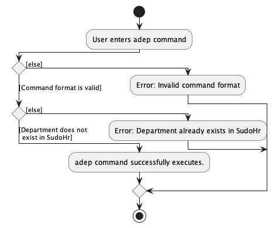

Sequence Diagram:

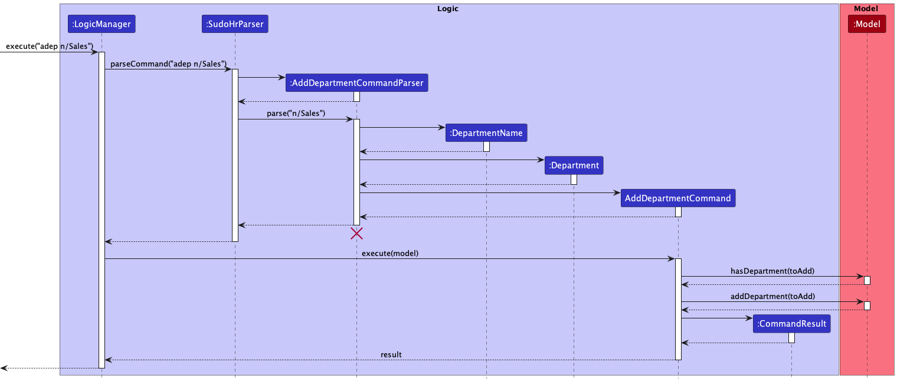

##### Flow

1. The user enters the command, eg. `adep n/Sales`
2. The parser will instantiate a new `DepartmentName` object constructed from the input of the argument `/n` which represents the department name.
3. A `Department` object is constructed from the `DepartmentName` and handed over to the `AddDepartmentCommand`.
4. The command is executed. It first checks if the department contains the employee being added. This is done to prevent the addition of duplicate
   employees in the same department.
5. If there is no duplicate, the model adds the department to SudoHR.

After that, the command result is returned.

##### Feature considerations

When checking for duplicates in the `UniqueDepartmentList`, the `DepartmentName` of the department is used to uniquely
identify each department. This is because it is illogical to have 2 departments with the same name, as the application
is meant for use by a single company.

If duplicate arguments are present in the same command, the last instance of the duplicated argument is taken in by the parser.

#### 4.2.2. Editing a department

The `edep` command edits the department-level details of an existing `Department` in SudoHr. Currently, you can only
edit the department name field as it is the only existing department-level detail.

Activity Diagram:

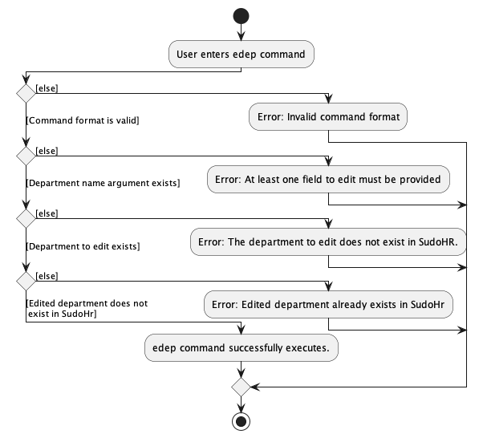

Sequence Diagram:

##### Flow

1. The user enters the command, eg. `edep Marketing n/Sales`. Marketing is the new department name and Sales is the old department name.
2. The parser will instantiate a new `DepartmentName` object constructed from the input of the argument `/n` which represents the new department name.
3. A `EditDepartmentDescriptor` object is constructed from the `DepartmentName` and handed over to the `EditDepartmentCommand`.
4. The command is executed. It first tries to find the department called Marketing.
5. If the Marketing department exists, the command will then create the new department called Sales using the EditDepartmentDescriptor.
   The non-edited attributes from Marketing will be passed down to Sales.
6. The command then checks if the edited department exists in SudoHR.
7. If there is no duplicate, the model adds the department to SudoHR.

After that, the command result is returned.

##### Feature considerations

The `EditDepartmentDescriptor` is used to store the details to be edited. This abstraction is used as not all fields
may be edited for the `EditDepartmentCommand`, hence we use this class to figure out what to pass down during the
construction of the new edited department. As of now, this class may be trivial but will prove more useful in the future
when more department-level details are added (e.g. creation date, director, work type, etc.).

It is also important to check if the name of the newly edited department clashes with any existing departments in
SudoHR, as the name is the unique identifier for a department.

#### 4.2.3. Deleting a department

The `deldep` command deletes an existing `Department` in SudoHR.

Activity Diagram:

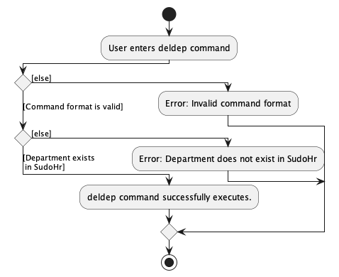

Sequence Diagram:

##### Flow

1. The user enters the command, eg. `deldep n/Sales`. Sales is the department to be deleted.
2. The parser will instantiate a new `DepartmentName` object constructed from the input of the argument `/n` which represents the new department name.
3. The `DepartmentName` is passed down to the command.
4. The command is executed. It first tries to find the department called Sales.
5. If the Sales department exists, it will be deleted from SudoHR.

After that, the command result is returned.

#### 4.2.4. Listing all departments

The `listdep` command lists all the departments in SudoHR.

The call stack is the same as a typical command except that it has no specified parser. Instead, `SudoHrParser` directly returns the command containing the required predicate.

Upon execution, it updates the `filteredDepartmentList` in SudoHR.

After that, the command result is returned.

#### 4.2.5. Adding an employee to a department

The `aetd` command adds an existing `Employee` to an existing `Department` in SudoHR.

Activity Diagram:

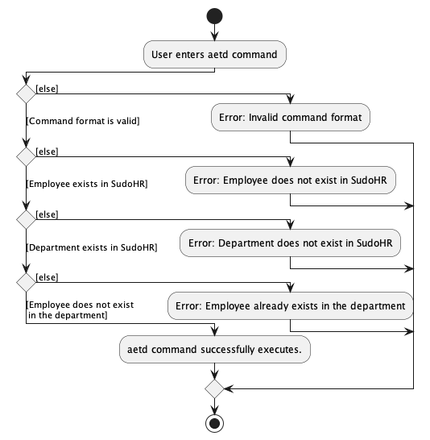

Sequence Diagram:

##### Flow

1. The user enters the command, eg. `aetd eid/100 n/Software Engineering`. It represents that the employee with ID 100
   is supposed to be added to the Software Engineering department.
2. The parser instantiates a new `Id` and `DepartmentName` object constructed from the input of arguments `eid/` and `n/` respectively.
3. The command is executed. It first tries to find the employee with ID 100 and department called Software Engineering.
4. If the employee and department exists, the command checks if the same employee exists in the department.
5. If there is no duplicate employee in the department, the model adds the employee to the department.

After that, the command result is returned.

##### Feature considerations

There was a major design decision, which is to use `UniqueEmployeeList` for the employee list inside a `Department`.
The idea is that a department should not contain duplicate employees. Hence, we made use of the existing
`UniqueEmployeeList` class in `SudoHr`, instead of creating a new employee list class for Department. This logic is
reused in `Leaves` as well.

It should be noted that we still used defensive checks such as `department.hasEmployee` despite the
`UniqueEmployeeList` having such checks internally already.

#### 4.2.6. Removing an employee from a department

The `refd` command removes an `Employee` from an existing `Department` in SudoHR.

Activity Diagram:

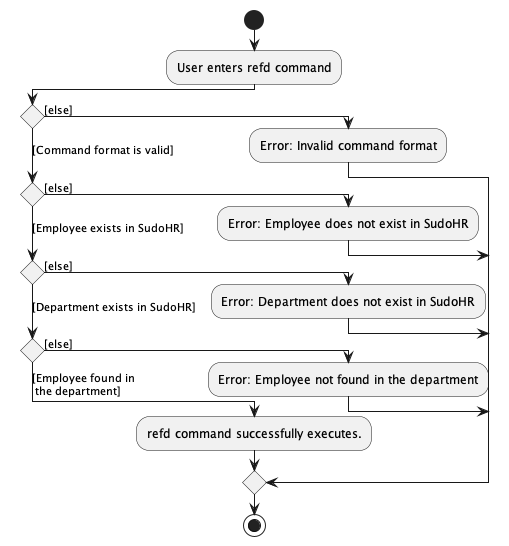

Sequence Diagram:

##### Flow

1. The user enters the command, eg. `refd eid/100 n/Software Engineering`. It represents that the employee with ID 100
   is supposed to be removed from the Software Engineering department.
2. The parser instantiates a new `Id` and `DepartmentName` object constructed from the input of arguments `eid/` and `n/` respectively.
3. The command is executed. It first tries to find the employee with ID 100 and department called Software Engineering.
4. If the employee and department exists, the command checks if the same employee exists in the department.
5. If the employee exists in the department, the model removes the employee from the department.

After that, the command result is returned.

#### 4.2.7. Listing an employee's departments

The `led` command

Activity Diagram:

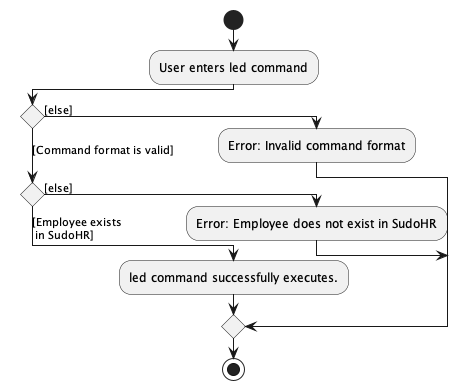

Sequence Diagram:

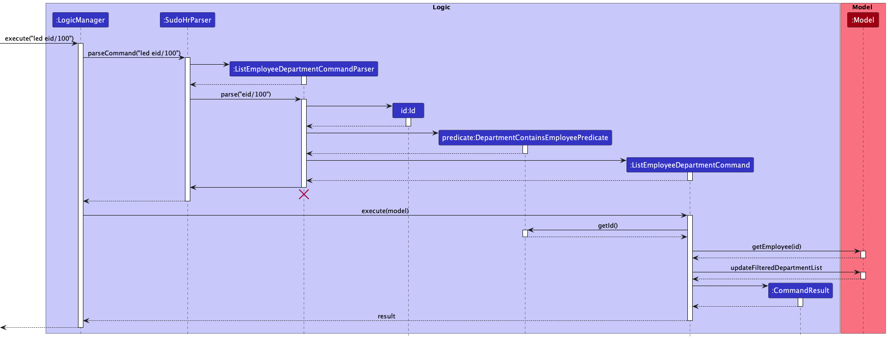

##### Flow

1. The user enters the command, eg. `led eid/100`. It represents listing all departments that contain employee
   with ID 100.
2. The parser instantiates a new `Id` object constructed from the input of argument `eid/`.
3. The `Id` object is used to instantiate the `DepartmentContainsEmployeePredicate`, which will be used to filter
   the `FilteredDepartmentList` later on.
4. The command is executed. It first tries to find the employee with ID 100.
5. If the employee exists, the `FilteredDepartmentList` will be updated and SudoHR will display all the departments
   that employee with ID 100 is in.

After that, the command result is returned.

### 4.3. Leave-related features

The `Leave` object represents a leave date in the company. They are all stored in a `UniqueLeaveList`.

The attributes of a leave are:

- `date`: The date of the leave, which is also the unique identifier for a leave
- `employees`: The employees who applied for this leave, the list must not contain duplicate employees. It is implemented by reusing the `UniqueEmployeeList` datatype.

#### 4.3.1. Adding an employee's leave

The `aetd` command adds an employee's leave on a specific day:

Activity Diagram:

Sequence Diagram:

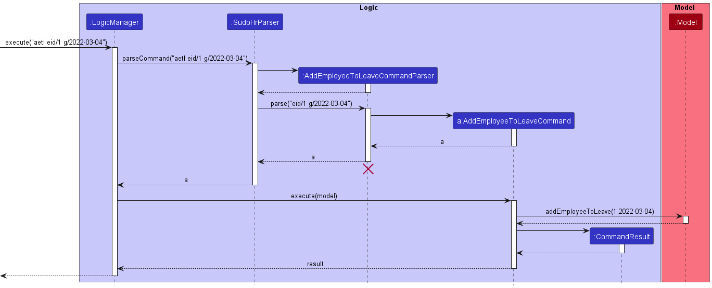

##### Flow

1. The user enters the command `aetl eid/1 d/2022-03-04` where 1 is the employee id and 2022-03-04 is the leave date.
2. The parser would initialise a new `Id` and `LeaveDate` object constructed from the input of argument `eid/` and `d/` respectively
3. The `Id` and `LeaveDate` are passed down to the command.
4. The command is executed. It first tries to find the `Employee` with ID 1 and the `Leave` that represents the date on which the leave is taken. If the `Leave` does not exist, a new one is created and added to `SudoHR`. If the `Employee` does not exist, an error message will be displayed.
5. If the employee already exists in `Leave`, an error message will be displayed.
6. Assuming if Step 5 completes without exception, the employee would be added to the `Leave`.
7. `FilteredEmployeeList` will be updated to only display all employees having leave on the input date.

##### Feature considerations

We decided to throw an exception when the employee has already taken leave on the same day as the input date, since the user may have accidently provided a wrong date and hence the exception would be more suitable as it would be more noticeable than the success message.

#### 4.3.2. Deleting an employee's leave

The `defl` command delete an employee's leave on a specific day:

Activity Diagram:

Sequence Diagram:

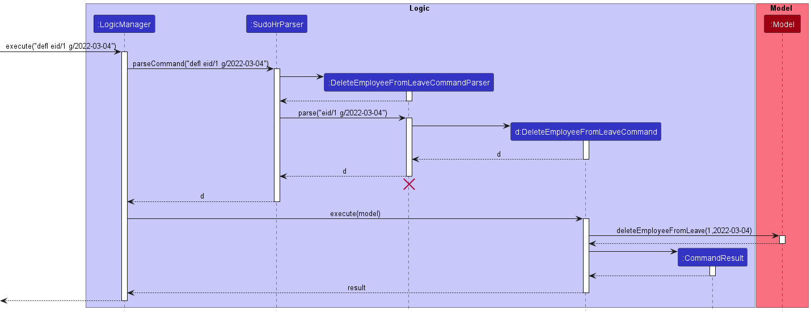

##### Flow

1. The user types and enters the command `defl eid/1 d/2022-03-04` where 1 is the employee id and 2022-03-04 is the leave date.
2. The parser would initialise a new `Id` and `LeaveDate` constructed from the input of argument `eid/` and `d/` respectively
3. The `Id` and `LeaveDate` are passed down to the newly created command.
4. The command is executed. It first tries to find the `Employee` with ID 1 and the `Leave` that represents the date on which the leave is taken. If the `Employee` does not exist, an error message will be displayed.
5. If the employee does not exists in `Leave` (The employee has yet take leave on the input date), an error will be thrown too.
6. Assuming if Step 5 completes without exception, the employee would be added to the `Leave`.
7. `FilteredEmployeeList` will be updated to only display all employees having leave on the input date.

#### 4.3.3. Adding an employee's leave in a range

The `aelr` command adds an employee's leave on all the days between the range of a start date to an end date inclusive.

Activity Diagram:

Sequence Diagram:

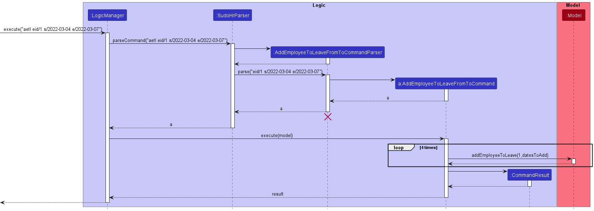

##### Flow

1. The user types and enters the command `aelr eid/1 s/2022-03-04 e/2022-03-06` where 1 is the employee id, 2022-03-04 is the start date and 2022-03-06 is the end date.
2. The parser checks that the end date `e/` is after the start date represented by `s/`.The end date `e/` also must be less than 7 days away from the start date `s/`. If both conditions are not satisfied, an error message will be shown.
3. The parser would initialise a `Id` constructed from the input of argument `eid/` and a list of `LeaveDate` objects representing every single day in the range between `s/` and `e/` with the end and start dates inclusive.
4. The `Id` and list of `LeaveDate` are passed down to the newly created command.
5. The command is executed. The command first tries to find the `Employee` with ID 1. If the `Employee` does not exist, an error message will be displayed.
6. The command then checks if the employee has taken leave on any of the days in the range between the start date `s/` and end date `e/` inclusive. If this is the case, an error message would be thrown.
7. Assuming step 6 completes with no exception, `Employee` is added to `Leave` on all the days in the range of the start day to end date inclusive
8. SudoHr will show all the days on which the employee has successfully taken leave.

##### Feature considerations

We intentionally decide to limit the range of days to be added to be 1 week. This is because we wanted to prevent excessively large ranges that are illogical such as taking leaves throughout multiple years. Hence we decided that 1 week would be the most appropriate number as it is the typical length of leave taken when people go on vacation.

We also decided to not add leaves on all of the days in the range if the employee has taken leave on any of the days. We decided to do this to keep the behavior consistant with AddEmployeeToLeave command. In the case that the user would actually like to extend the leave for an employee, the addition would only require two additional commands so this would be of minimal inconvenience to the user.

#### 4.3.4. Listing all employees taking leave on a specific day

The `leol` command lists employees taking leave on a specific date.

1. The user types and enters the command `leol 2022-04-02` where 2022-04-02 is the date input provided.
2. The parser would initialise a `LeaveDate` object constructed from the input argument.
3. The command is executed. It initializes a new `LeaveContainsEmployeePredicate` that will filter out employees that have not taken leaves on the specified date.
4. The command uses the `LeaveContainsEmployeePredicate` to filter the employees and display the employees that have taken leave on the specified day.

### 4.4. Design considerations:

#### 4.4.1. Employee

An important design consideration to note for Employee is the multiple different fields that qualify as a primary key (unique identity).

An employee is identified by his ID field, and this field is used to get an employee object.

However, there are other fields to guard against duplication, specifically email and phone number fields.
For instance, two employees should not share email field or phone number as those two fields are known to be unique.

##### Cascading employee updates and deletion to department and leave

An important functionality is to ensure updates to employee is cascaded down to department-level and leave-level because
each department and leave has its own list of employees. This issue becomes more prominent during loading of storage files
where employee objects are separately created for department's and leave's employee lists.
Hence, any modification to an employee after SudoHR is initialized from storage needs to be cascaded down to modify the equivalent employee object.

#### 4.4.2. Departments

[//]: # "To be done by Kenneth"

#### 4.4.3. Leaves

[//]: # "To be done by Jer En"

---

## 5. **Documentation, logging, testing, configuration, dev-ops**

- [Documentation guide](Documentation.md)
- [Testing guide](Testing.md)
- [Logging guide](Logging.md)
- [Configuration guide](Configuration.md)
- [DevOps guide](DevOps.md)

---

## 6. **Appendix: Requirements**

### 6.1. Product scope

**Target user profile**: HR in company who has a need to manage a significant number of employees

**Value proposition**: data management for employees faster than a typical mouse/GUI driven app

### 6.2. User stories

Priorities: High (must have) - `* * *`, Medium (nice to have) - `* *`, Low (unlikely to have) - `*`

| Priority | As a …​      | I want to …​                                                   | So that I can…​                                                            |
| -------- | ------------ | -------------------------------------------------------------- | -------------------------------------------------------------------------- |
| `* * *`  | new user     | see usage instructions                                         | refer to instructions when I forget how to use the App                     |
| `* * *`  | HR personnel | add a new employee                                             | ensure consolidation of information when an employee is hired              |
| `* * *`  | HR personnel | edit a new employee                                            | ensure consolidation of information when an employee has new details       |
| `* * *`  | HR personnel | delete an employee                                             | ensure consolidation of information when an employee left the company      |
| `* * *`  | HR personnel | find an employee by name                                       | locate details of employees without having to go through the entire list   |
| `* *`    | HR personnel | hide private contact details                                   | minimize chance of someone else seeing them by accident                    |
| `* * *`  | HR personnel | add an employee’s leave to SudoHR                              | ensure consolidation of information                                        |
| `* * *`  | HR personnel | remove an employee’s leave for SudoHR                          | ensure consolidation of information                                        |
| `* * *`  | HR personnel | view all leaves an employee has applied for                    | access an employee's availability easily                                   |
| `* * *`  | HR personnel | view all employees on leave today                              | know today's headcount                                                     |
| `* * *`  | HR personnel | view all leaves applied for a given day                        | better plan company events                                                 |
| `* * *`  | HR personnel | view all leaves applied for a given day for a given department | better plan depeartment events                                             |
| `* * *`  | HR personnel | add a department                                               | ensure consolidation of information when a new department is formed        |
| `* * *`  | HR personnel | edit a department                                              | ensure consolidation of information when a department's detail is changed  |
| `* * *`  | HR personnel | delete a department                                            | ensure consolidation of information when a department is disbanded         |
| `* * *`  | HR personnel | find a department by name                                      | locate details of departments without having to go through the entire list |
| `* * *`  | HR personnel | add an employee to a department                                | ensure consolidation of information when a department has a new employee   |
| `* * *`  | HR personnel | remove an employee from a department                           | ensure consolidation of information when an employee leaves a department   |
| `* * *`  | HR personnel | list all departments an employee is in                         |                                                                            |
| `* * *`  | HR personnel | list all employees in a department                             | view manpower size of a department                                         |

_{More to be added}_

### 6.3. Use cases

(For all use cases below, the **System** is `SudoHR` and the **Actor** is the `user`, unless specified otherwise)

**Use case: Listing all departments**

**MSS**

1. User requests to list all departments
2. SudoHr shows the list of all departments

   Use case ends.

**Extensions**

- 1a. The list of departments is empty.

  use case ends

**Use case: Finding a department using a keyword**

1. User requests to show the list of departments containing specified keywords
2. SudoHr shows the list of all departments with name that contains any of the keywords.

   Use case ends.

**Extensions**

- 1a. There are no departments with any of the keywords.

  Use case ends.

**Use case: Adding a department**

**MSS**

1. User requests to add a new department with a given name that is alphanumeric.
2. SudoHr adds the department with the given name.

   Use case ends.

**Extensions**

- 1a. User gives a name that is not alpha numeric

  - 1a1. SudoHr shows an error message.

    Use case resumes at step 1.

- 1b. User gives a name that is already used.

  - 1b1. SudoHr shows an error message.

    Use case resumes at step 1.

**Use case: Deleting a department**

**MSS**

1. User gives the name of the department to be deleted.
2. SudoHr deletes the department with the given name.

   Use case ends.

**Extensions**

- 1a. The department with the given name does not exist.

  - 1a1. SudoHr shows an error message.

    Use case resumes at step 1.

**Use case: Editing a department**

**MSS**

1. User requests to edit a department.
2. SudoHr edits the department.

   Use case ends.

**Extensions**

- 1a. User does not give any inputs.

  - 1a1. SudoHr shows an error message.

    Use case resumes at step 1.

- 1b. User tries to edit a department that does not exist.

  - 1b1. SudoHr shows an error message.

    Use case resumes at step 1.

- 1c. User tries to edit the department into a department that already exists.

  - 1c1. SudoHr shows an error message.

    Use case resumes at step 1.

**Use case: Adding an employee to department**

**MSS**

1. User requests to an an employee into a given department.
2. SudoHr adds the employee to the given department.

   Use case ends.

**Extensions**

- 1a. The employee to be added does not exist.

  - 1a1. SudoHr shows an error message.

    Use case resumes at step 1.

- 1b. The department for an employee to be added does not exist.

  - 1b1. SudoHr shows an error message.

    Use case resumes at step 1.

**Use case: Removing an employee from a department**

**MSS**

1. User requests to remove an employee from a given department.
2. SudoHr removes the employee from the given department.

   Use case ends.

**Extensions**

- 1a. Given employee does not exist.

  - 1a1. SudoHr shows an error message.

    Use case resumes at step 1.

- 1b. Given department does not exist.

  - 1b1. SudoHr shows an error message.

    Use case resumes at step 1.

- 1c. The given employee does not belong to the given department.

  - 1c1. SudoHr shows an error message.

    Use case resumes at step 1.

**Use case: Listing all employees in a given department**

1. User requests to list all employees in a given department.
2. SudoHr lists all the employees in the given department.

   Use case ends.

**Extensions**

- 1a. The given department does not exist.

  - 1a1. SudoHr shows an error message.

    Use case resumes at step 1.

- 1b. There are no employees in the given department.

  Use case ends.

**Use case: Listing all departments that an employee is in**

1. User requests to list all the departments that a given employee is in.
2. SudoHr lists all the department that the given employee is in.

**Extensions**

- 1a. The given employee does not exist.
  - 1a1. SudoHr shows an error message.
- 1b. The employee is not in any department.

  Use case ends.

**Use case: list the department headcount**

1. User requests to list all the employees present in a given department.
2. SudoHr lists all the employees present in the given department for the current date.

   Use case ends.

**Extensions**

- 1a. User requests to list employees present on a date that is before the current date.

  - 1a1. SudoHr shows an error message.

- 1b. User requests to list employees present on a date that is not within a year from the current date.

  - 1b1. SudoHr shows an error message.

- 1c. User requests to list employees present on a specified that is after the current date but within a year from the current date.

  - 1c1. SudoHr lists all the employees in the given department on the specified date.

    Use case ends.

- 1d. The department does not exist.

  - 1d1. SudoHr shows and error message.

    Use case resumes at step 1.

_{More to be added}_

### 6.4. Non-Functional Requirements

1. Should work on any _mainstream OS_ as long as it has Java `11` or above installed.
2. Should be able to hold up to 1000 employees without a noticeable sluggishness in performance for typical usage.
3. A user with above average typing speed for regular English text (i.e. not code, not system admin commands) should be able to accomplish most of the tasks faster using commands than using the mouse.
4. Comfortable working with CLI.

_{More to be added}_

### 6.5. Glossary

- **Mainstream OS**: Windows, Linux, Unix, OS-X
- **Private contact detail**: A contact detail that is not meant to be shared with others

---

## 7. **Appendix: Instructions for manual testing**

Given below are instructions to test the app manually.

:information_source: **Note:** These instructions only provide a starting point for testers to work on;
testers are expected to do more *exploratory* testing.

### 7.1. Launch and shutdown

1. Initial launch

   1. Download the jar file and copy into an empty folder

   2. Double-click the jar file Expected: Shows the GUI with a set of sample employees.
      The window size may not be optimum.

1. Saving window preferences

   1. Resize the window to an optimum size. Move the window to a different location. Close the window.

   1. Re-launch the app by double-clicking the jar file. 
      Expected: The most recent window size and location is retained.

### 7.2. Employee commands

#### 7.2.1. Adding an employee

1. Test case: `add id/777 n/John Doe p/98765432 a/311, Clementi Ave 2, #02-25 e/johnd@example.com t/friends t/owesMoney`  
   Expected: New employee is added. Details of the added employee is shown in the result display.
2. Test case: `add n/John Doe p/98765432 a/311, Clementi Ave 2, #02-25 e/johnd@example.com t/friends t/owesMoney` (incorrect format)  
   Expected: No employee is added. Result display shows correct command format and command constraints.
3. Other incorrect `add` commands to try: `add 777`, `add id/0`, `...` (incorrect email format, incorrect phone format, duplicate employee ID, etc)  
   Expected: Shows specific error message in result display.

#### 7.2.2. Listing all employees

1. Test case: `list`  
   Expected: Lists all employees in employee window.
2. Test case: `list x` (where x is any string)  
   Expected: Lists all employees in employee window.

#### 7.2.3. Editing an employee

1. Test case: `edit eid/1 p/9999999` (employee must exist)  
   Expected: Employee with ID 1 is edited. Details of the edited employee is shown in the result display.
2. Test case: `edit 1 p/88888888` (incorrect format)  
   Expected: No employee is edited. Result display shows correct command format and command constraints.
3. Other incorrect `edit` commands to try: `edit id/0`, `...` (incorrect email format, incorrect phone format, duplicate employee ID, etc)  
   Expected: Shows specific error message in result display.

#### 7.2.4. Find employees by name

1. Test case: `find Alex`  
   Expected: Employees with Alex in their name will be displayed in the employee window. Number of employees found is shown in the result display.
2. Test case: `find` (incorrect format)  
   Expected: No employee is found. Result display shows correct command format and command constraints.

#### 7.2.5. Find employees by ID

1. Test case: `feid eid/1`  
   Expected: Employee with ID 1 is shown in the employee window.
2. Test case: `feid 1` (incorrect format)  
   Expected: No employee is found. Result display shows correct command format and command constraints.
3. Other incorrect `feid` commands to try: `feid eid/x` (where x is a non-positive integer)
   Expected: Shows specific error message in result display.

#### 7.2.6. Deleting an employee

1. Test case: `del eid/1` 
   Expected: Employee with ID 1 is deleted from the list. Details of the deleted employee shown in the result display.
2. Test case: `del 1` 
   Expected: No employee is deleted. Result display shows correct command format and command constraints.
3. Other incorrect `del` commands to try: `del eid/x` (where x is a non-positive integer), `del eid/y` (where y is a non-existent employee ID), `...` 
   Expected: Shows specific error message in result display.

### 7.3. Department commands

#### 7.3.1. Adding a department

1. Test case: `adep n/Human Resources`  
   Expected: New department is added. Details of the added department is shown in the result display.
2. Test case: `adep Human Resources` (incorrect format)  
   Expected: No department is added. Result display shows correct command format and command constraints.
3. Other incorrect `adep` commands to try: `adep`, `adep n/***_`, `...` (incorrect name format, duplicate name, etc)  
   Expected: Shows specific error message in result display.

#### 7.3.2 Editing a department

1. Test case: `edep Human Resources n/HR` (department must exist)  
   Expected: Human Resources department is edited. Details of the edited department is shown in the result display.
2. Test case: `edep n/88888888` (department not specified)  
   Expected: No department is edited. Result display shows correct command format and command constraints.
3. Other incorrect `edep` commands to try: `edep`, `edep HR n/**_`,`...` (incorrect name format, duplicate name, etc)  
   Expected: Shows specific error message in result display.

#### 7.3.3. Find departments by name

1. Test case: `fdep Engineering`  
   Expected: Departments with Engineering in their name will be displayed in the department window. Number of departments found is shown in the result display.
2. Test case: `fdep` (incorrect format)  
   Expected: No department is found. Result display shows correct command format and command constraints.

#### 7.3.4. Deleting a department

1. Test case: `ddep n/HR` 
   Expected: Department named HR is deleted from the list. Details of the deleted department is shown in the result display.
2. Test case: `ddep HR` 
   Expected: No department is deleted. Result display shows correct command format and command constraints.
3. Other incorrect `ddep` commands to try: `ddep n/x` (where x contains non-alphanumeric characters), `...` (non-existent department, etc)  
   Expected: Shows specific error message in result display.

#### 7.3.5. Listing all departments

1. Test case: `ldep`  
   Expected: Lists all employees in employee window.
2. Test case: `ldep x` (where x is any string)  
   Expected: Lists all employees in employee window.

#### 7.3.6. Add employee to a department

1. Test case: `aetd eid/1 n/HR`  
   Expected: Lists all employees in the HR department in employee window. Shows only HR department in department window.
2. Test case: `aetd 1 n/HR` (incorrect command format)  
   Expected: No employee added to department. Result display shows correct command format and command constraints.
3. Other incorrect `aetd` commands to try: `aetd`, `...` (non-existent department/employee, duplicate employee, etc)  
   Expected: Shows specific error message in result display.

#### 7.3.7. Remove employee from a department

1. Test case: `refd eid/1 n/HR`  
   Expected: Lists all employees in the HR department in employee window. Shows only HR department in department window.
2. Test case: `refd 1 n/HR` (incorrect command format)  
   Expected: No employee removed from department. Result display shows correct command format and command constraints.
3. Other incorrect `refd` commands to try: `retd`, `...` (non-existent department/employee, etc)  
   Expected: Shows specific error message in result display.

#### 7.3.8. Listing an employee's departments

1. Test case: `led eid/1`  
   Expected: Lists all departments that employee with ID 1 is in, inside the department window.
2. Test case: `led 1` (incorrect command format)  
   Expected: No changes to the windows. Result display shows correct command format and command constraints
3. Other incorrect `led` commands to try: `led`, `...` (non-existent employee, etc)  
   Expected: Shows specific error message in result display.

#### 7.3.9. Listing all employees in a department

1. Test case: `leid n/HR`  
   Expected: Lists all employee in the HR department, inside the employee window.
2. Test case: `leid HR` (incorrect command format)  
   Expected: No changes to the windows. Result display shows correct command format and command constraints
3. Other incorrect `leid` commands to try: `leid`, `...` (non-existent department, etc)  
   Expected: Shows specific error message in result display.

#### 7.3.10. List department headcount on a specific day

1. Test case: `ldhc n/HR d/2023-04-01`  
   Expected:
   1. Lists all employees from HR department who are present on the given day, inside the employee window.
   2. Shows the given department in the department window.
   3. Shows the given leave in the leave window.
2. Test case: `ldhc n/HR`  
   Expected:
   1. Lists all employees from HR department who are present today, inside the employee window.
   2. Shows the given department in the department window.
   3. Shows the given leave in the leave window.
3. Test case: `ldhc HR` (incorrect command format)  
   Expected: No changes to the windows. Result display shows correct command format and command constraints
4. Other incorrect `ldhc` commands to try: `ldhc`, `...` (non-existent department, etc)  
   Expected: Shows specific error message in result display.

### 7.4 Leave commands

#### 7.4.1. Adding a leave

1. Test case: `aetl eid/1 d/2023-12-31`  
   Expected:
   1. Lists all employees taking leave on that date in the employee window.
   2. Shows only the given leave date in the leave window.
2. Test case: `aetl 1 d/2023-12-31` (incorrect command format)  
   Expected: No leave taken. Result display shows correct command format and command constraints.
3. Other incorrect `aetl` commands to try: `aetl`, `...` (non-existent employee, employee already taken leave on that date, etc)  
   Expected: Shows specific error message in result display.

#### 7.4.2. Adding all leaves with a range of dates

1. Test case: `aelr eid/1 s/2023-12-25 e/2023-12-30`  
   Expected: Shows all the leaves taken in the leave window.
2. Test case: `aelr 1 s/2023-12-25 e/2023-12-30` (incorrect command format)  
   Expected: No leave taken. Result display shows correct command format and command constraints.
3. Other incorrect `aelr` commands to try: `aelr`, `...` (non-existent employee, employee already taken leave on that date, etc)  
   Expected: Shows specific error message in result display.

#### 7.4.3. Deleting a leave taken by an employee

1. Test case: `defl eid/1 d/2023-12-31`  
   Expected:
   1. Lists all employees taking leave on that date in the employee window.
   2. Shows only the given leave date in the leave window.
2. Test case: `defl 1 d/2023-12-31` (incorrect command format)  
   Expected: No leave deleted. Result display shows correct command format and command constraints.
3. Other incorrect `defl` commands to try: `defl`, `...` (non-existent employee, employee did not take leave on that date, etc)  
   Expected: Shows specific error message in result display.

#### 7.4.4. Listing all employees on leave for a given date

1. Test case: `leol 2023-12-25`  
   Expected: Lists all employee taking leave on Christmas, inside the employee window.
2. Test case: `leol Christmas` (incorrect date format)  
   Expected: No changes to the windows. Result display shows correct command format and command constraints
3. Other incorrect `leol` commands to try: `leol`  
   Expected: No changes to the windows. Result display shows correct command format and command constraints

#### 7.4.5. Listing all leaves

1. Test case: `llve`  
   Expected: Lists all leaves taken in the leave window.
2. Test case: `llve x` (where x is any string)  
   Expected: Lists all employees in employee window.

#### 7.4.6. Listing an employee's leaves

1. Test case: `llbe eid/1`  
   Expected: Lists all leaves taken by employee with ID 1, inside the leave window.
2. Test case: `llbe 1` (incorrect command format)  
   Expected: No changes to the windows. Result display shows correct command format and command constraints
3. Other incorrect `llbe` commands to try: `llbe`, `...` (non-existent employee, etc)  
   Expected: Shows specific error message in result display.

### 7.5 General commands

#### 7.5.1. Viewing help

1. Test case: `help`  
   Expected: Shows help window containing list of commands and UG link.

#### 7.5.2. Refresh all lists

1. Test case: `sa`  
   Expected: Lists all employees, departments and leaves in their respective windows.
2. Test case: `sa x` (where x is any string)  
   Expected: Lists all employees, departments and leaves in their respective windows.

#### 7.5.3. Clearing all entries

1. Test case: `clear`  
   Expected: Should clear all entries in SudoHR.
2. Test case: `clear x` (where x is any string)  
   Expected: Should clear all entries in SudoHR.

#### 7.5.4. Exiting the application

1. Test case: `exit`  
   Expected: Should exit SudoHR.
2. Test case: `exit x` (where x is any string)  
   Expected: Should exit SudoHR.

### Saving data

1. Dealing with missing/corrupted data files

   1. _{explain how to simulate a missing/corrupted file, and the expected behavior}_

1. _{ more test cases …​ }_
