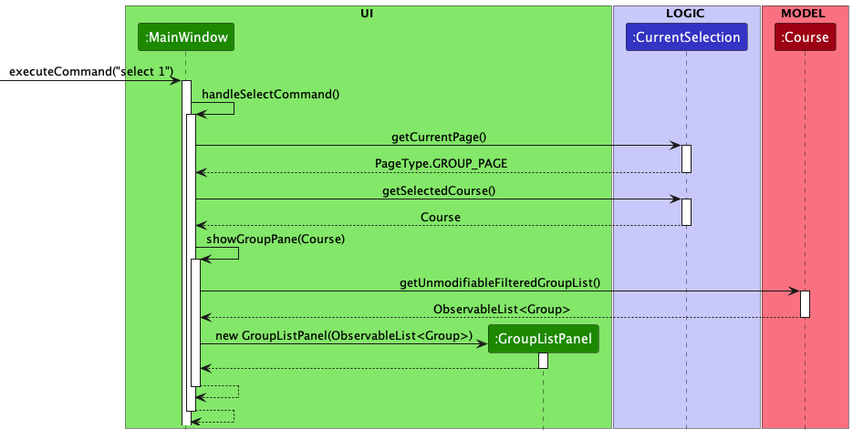
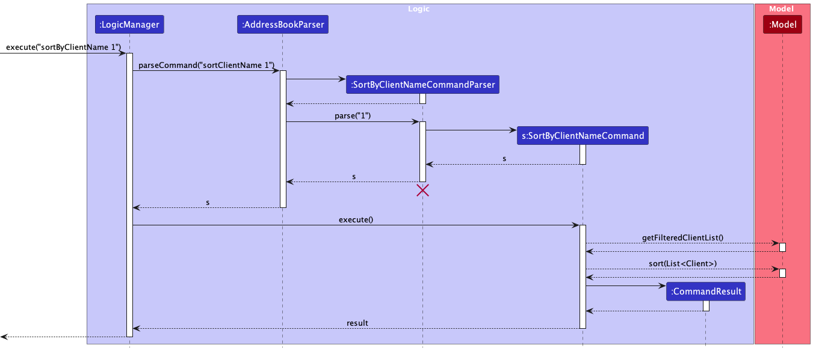
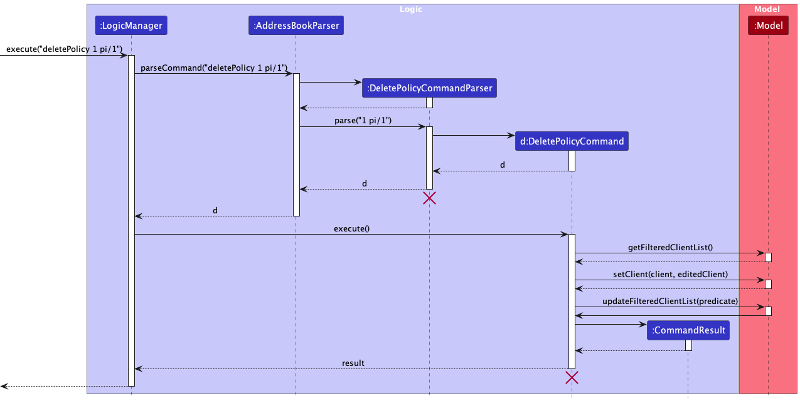
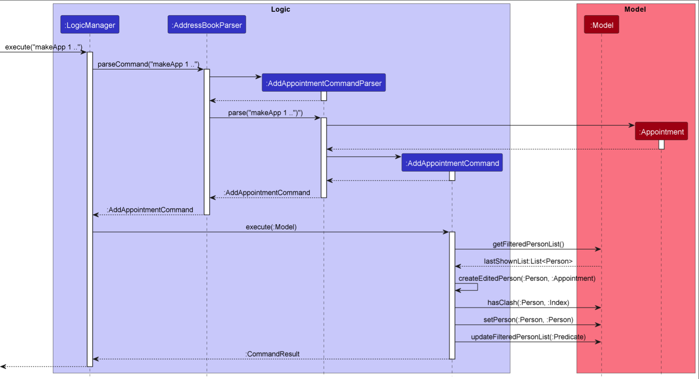

## Advisio

Advis.io (AIO) is a all-in-one solution for financial advisors to better manage their clientele and their clients respective policies. AIO is currently available on PC, and is optimized for use via a Command Line Interface (CLI) while still having the benefits of having a Graphical User Interface (GUI). If you can type fast, AIO will be the biggest boost in your productivity that you'll see in your career.

With AIO, financial advisors of all expertise are able to keep track their ever-growing clientele and always be prepared for the needs of their clients. AIO makes it easier for you to keep track of your clients' policies and appointment dates, providing them more time for you to focus on expanding your network and providing the best service for your beloved clients.

## Table of Contents

* [**Acknowledgements**](#acknowledgements)
* [**Setting up, getting started**](#setting-up-getting-started)
* [**Design**](#Design)
    * [Architecture](#architecture)
    * [UI component](#ui-component)
    * [Logic component](#logic-component)
    * [Model component](#model-component)
    * [Storage component](#storage-component)
    * [Common classes](#common-classes)
* [**Implementation**](#implementation)
    * [Add policy feature](#add-policy-feature)
    * [Delete policy feature](#delete-policy-feature)
    * [Edit policy feature](#edit-policy-feature)
    * [Add appointment feature](#add-appointment-feature)
    * [Delete appointment feature](#delete-appointment-feature)
    * [Undo/redo feature](#undoredo-feature)
    * [[Proposed] Upcoming Aggregated data feature](#proposed-aggregated-data-feature)
* [**Documentation**](#documentation-logging-testing-configuration-dev-ops)
* [**Appendix: Requirements**](#appendix-requirements)
    * [**Product scope**](#product-scope)
    * [**User stories**](#user-stories)
    * [**Use cases**](#use-cases)
    * [**Non-Functional Requirements**](#non-functional-requirements)
    * [**Glossary**](#glossary)
* [**Appendix: Instructions for manual testing**](#appendix-instructions-for-manual-testing)
* [**Appendix: Planned Enhancements**](#appendix-planned-enhancements)

--------------------------------------------------------------------------------------------------------------------

## **Acknowledgements**

* Adapted from [AB3](https://github.com/nus-cs2103-AY2223S1/tp)

<!-- {list here sources of all reused/adapted ideas, code, documentation, and third-party libraries -- include links to the
  original source as well} -->

--------------------------------------------------------------------------------------------------------------------

## **Setting up, getting started**

Refer to the guide [_Setting up and getting started_](SettingUp.md).

--------------------------------------------------------------------------------------------------------------------

## **Design**

:bulb: **Tip:** The `.puml` files used to create diagrams in this document can be found in
the [diagrams](https://github.com/se-edu/addressbook-level3/tree/master/docs/diagrams/) folder. Refer to the [_PlantUML
Tutorial_ at se-edu/guides](https://se-education.org/guides/tutorials/plantUml.html) to learn how to create and edit
diagrams.

### Architecture

The ***Architecture Diagram*** given above explains the high-level design of the App.

Given below is a quick overview of main components and how they interact with each other.

**Main components of the architecture**

**`Main`** has two classes
called [`Main`](https://github.com/AY2223S2-CS2103T-T09-4/tp/blob/master/src/main/java/seedu/address/Main.java)
and [`MainApp`](https://github.com/AY2223S2-CS2103T-T09-4/tp/blob/master/src/main/java/seedu/address/MainApp.java). It
is responsible for,

* At app launch: Initializes the components in the correct sequence, and connects them up with each other.
* At shut down: Shuts down the components and invokes cleanup methods where necessary.

[**`Commons`**](#common-classes) represents a collection of classes used by multiple other components.

The rest of the App consists of four components.

* [**`UI`**](#ui-component): The UI of the App.
* [**`Logic`**](#logic-component): The command executor.
* [**`Model`**](#model-component): Holds the data of the App in memory.
* [**`Storage`**](#storage-component): Reads data from, and writes data to, the hard disk.

**How the architecture components interact with each other**

The *Sequence Diagram* below shows how the components interact with each other for the scenario where the user issues
the command `delete 1`.

Each of the four main components (also shown in the diagram above),

* defines its *API* in an `interface` with the same name as the Component.
* implements its functionality using a concrete `{Component Name}Manager` class (which follows the corresponding
  API `interface` mentioned in the previous point).

For example, the `Logic` component defines its API in the `Logic.java` interface and implements its functionality using
the `LogicManager.java` class which follows the `Logic` interface. Other components interact with a given component
through its interface rather than the concrete class (reason: to prevent outside component's being coupled to the
implementation of a component), as illustrated in the (partial) class diagram below.

The sections below give more details of each component.

 
 

---

### UI component

**API**
: [`Ui.java`](https://github.com/AY2223S2-CS2103T-T09-4/tp/blob/master/src/main/java/seedu/address/ui/Ui.java)

The UI consists of a `MainWindow` that is made up of parts
e.g.`CommandBox`, `ResultDisplay`, `ClientListPanel`, `PolicyListPanel` etc. All these, including the `MainWindow`,
inherit from the abstract `UiPart` class which captures the commonalities between classes that represent parts of the
visible GUI.

The `UI` component uses the JavaFx UI framework. The layout of these UI parts are defined in matching `.fxml` files that
are in the `src/main/resources/view` folder. For example, the layout of
the [`MainWindow`](https://github.com/AY2223S2-CS2103T-T09-4/tp/blob/master/src/main/java/seedu/address/ui/MainWindow.java)
is specified
in [`MainWindow.fxml`](https://github.com/AY2223S2-CS2103T-T09-4/tp/blob/master/src/main/resources/view/MainWindow.fxml)

The `UI` component,

* executes user commands using the `Logic` component.
* listens for changes to `Model` data so that the UI can be updated with the modified data.
* keeps a reference to the `Logic` component, because the `UI` relies on the `Logic` to execute commands.
* depends on some classes in the `Model` component, as it displays `Client` object residing in the `Model`.

The Sequence Diagram below illustrates the interactions within the `Ui` component for the `start(primaryStage)` API
call.

**MainWindow**

The `MainWindow` controller class is composed of the following classes:

* `HelpWindow`
* `ClientListPanel`
* `PolicyListPanel`
* `Client`
* `ResultDisplay`

The `UiManager` controller class contains the `start` method which follows the sequence:

1. Instantiate a new `MainWindow` object.
2. `show` the `MainWindow` object.
3. Populate the subcomponents with the `fillInnerParts` method.

The `MainWindow#fillInnerParts` method is as follows:

1. Populate the `clientListPanel`.
2. Populate the `policyListPanel`
3. Populate the `resultDisplay`.
4. Populate the `commandBox`.

**ClientLabel**

The `ClientLabel` is composed of the labels: `name`, `id`, `phone`, `address`, `email`, `tags` which display the
information of the `Client`.

**ClientListPanel**

The `ClientListPanel` contains a `clientListView:ListView<Client>` to store the most updated list of `Client` objects.
The
constructor method takes in an `ObservableList<Client>` and sets it into the `clientListView`.

Each `Client` in the `ObservableList<Client>` is mapped to a `ClientListViewCell` which extends a `ListCell<Client>`.
This `ClientListViewCell` overides the `ListCell<T>#updateItem` method to register any changes made to a `Client`
within the `Model` and reflects it onto the `UI`.

**PolicyListPanel**

The `PolicyListPanel` works similarly to the `ClientListPanel`. The `PolicyListPanel` contains a
`policyListView:ListView<Client>` to store the most updated list of `Policy` objects. The constructor takes in an
`ObservableList<Policy>` and sets it into the `policyListView`.

Each `Policy` in the `ObservableList<Policy>` is mapped to a `PolicyListViewCell` which extends a `ListCell<Policy>`.
This `PolicyListViewCell` overides the `ListCell<T>#updateItem` method to register any changes made to a `Policy`
within the `Model` and reflects it onto the `UI`.

**Design considerations:**

Preview of the UI design.

The UI follows a simple dashboard layout with list panels to display the Clients, selected Clients, and the Policies of
the selected Clients. This layout was done such that the user would have quick and easy access to detailed information
of each of their Clients.

Each Client is labeled with a hashcode identifier, which can be used to select the Client for spotlighting.

We chose to limit the information shown on the Client list so that the user can have a wide overview of their list of
clientele. Since selecting each Client is conducted in a short and simple command, users may browse through each client
quickly.

Having a separate panel to display the Client information and Policies enables users to present the information clearly
to their clients.

**Alternatives considered:**

* We considered keeping to a consolidated panel where each `ClientCard` would display the client information as well as
  their list of `PolicyCard`. However, we found this design to be overwhelming and did not provide a layout that was
  quick and easy to comprehend.

<!--
#### Selecting a Client

The command `select INDEX` selects a given `Client` from the client list to be spotlighted in the GUI. The logic of
-->

 
 

---

### Logic component

**API**
: [`Logic.java`](https://github.com/AY2223S2-CS2103T-T09-4/tp/blob/master/src/main/java/seedu/address/logic/Logic.java)

Here's a (partial) class diagram of the `Logic` component:

How the `Logic` component works:

1. When `Logic` is called upon to execute a command, it uses the `AddressBookParser` class to parse the user command.
2. This results in a `Command` object (more precisely, an object of one of its subclasses e.g., `AddCommand`) which is
   executed by the `LogicManager`.
3. The command can communicate with the `Model` when it is executed (e.g. to add a person).
4. The result of the command execution is encapsulated as a `CommandResult` object which is returned back from `Logic`.

The Sequence Diagram below illustrates the interactions within the `Logic` component for the `execute("delete 1")` API
call.

:information_source: **Note:** The lifeline for `DeleteCommandParser` should end at the destroy marker (X) but due to a limitation of PlantUML, the lifeline reaches the end of diagram.

Here are the other classes in `Logic` (omitted from the class diagram above) that are used for parsing a user command:

How the parsing works:

* When called upon to parse a user command, the `AddressBookParser` class creates an `XYZCommandParser` (`XYZ` is a
  placeholder for the specific command name e.g., `AddCommandParser`) which uses the other classes shown above to parse
  the user command and create a `XYZCommand` object (e.g., `AddCommand`) which the `AddressBookParser` returns back as
  a `Command` object.
* All `XYZCommandParser` classes (e.g., `AddCommandParser`, `DeleteCommandParser`, ...) inherit from the `Parser`
  interface so that they can be treated similarly where possible e.g, during testing.

 
 

---

### Model component

**API**
: [`Model.java`](https://github.com/AY2223S2-CS2103T-T09-4/tp/blob/master/src/main/java/seedu/address/model/Model.java)

The `Model` component,

* stores the address book data i.e., all `Client` objects (which are contained in a `UniqueClientList` object).
* stores the currently 'selected' `Client` objects (e.g., results of a search query) as a separate _filtered_ list which
  is exposed to outsiders as an unmodifiable `ObservableList<Client>` that can be 'observed' e.g. the UI can be bound to
  this list so that the UI automatically updates when the data in the list change.
* stores a `UserPref` object that represents the user’s preferences. This is exposed to the outside as
  a `ReadOnlyUserPref` objects.
* stores the previous address book data after modifying data in the `AddressBook` through the use of Linked List
  in `VersionedAddressBook`.
* does not depend on any of the other three components (as the `Model` represents data entities of the domain, they
  should make sense on their own without depending on other components).

The `Client` component,

* Contains 6 classes : `Name`, `Phone`, `Address`, `Email`, `UniquePolicyList`, `Appointment`
* All `Policy` objects are stored in a `UniquePolicyList` object, similar to `UniqueClientList` object.
* Stores the currently 'selected' `Policy` objects as a separate filtered list which is exposed to outsiders as an
  unmodifiable `ObservableList<Policy>` that can be 'observed' e.g. the UI can be bound to this list so that the UI
  automatically updates when the data in the list change.

**Alternative considered:**

* Considered using simple `ArrayList<Policy>` to store all `Policy` objects, but it would make UI's automatic updates
  access harder.
* Instead of treating each object in a `Policy` as a string, `CustomDate` is in the form of a `LocalDate` class,
  while `Premium` is in the form of `double`. This allows for future addition of features such as sorting, finding or
  aggregating of specific data.

:information_source: **Note:** An alternative (arguably, a more OOP) model is given below. It has a `Tag` list in the `AddressBook`, which `Client` references. Likewise, it has a `Policy` list in the `AddressBook`, which `Client` can reference. This allows `AddressBook` to only require one `Tag` object per unique tag and one `Policy` object per unique policy, instead of each `Client` needing their own `Tag` and `Policy` objects. 

 
 

---

### Storage component

**API**
: [`Storage.java`](https://github.com/AY2223S2-CS2103T-T09-4/tp/blob/master/src/main/java/seedu/address/storage/Storage.java)

The `Storage` component,

* can save both address book data and user preference data in json format, and read them back into corresponding
  objects.
* inherits from both `AddressBookStorage` and `UserPrefStorage`, which means it can be treated as either one (if only
  the functionality of only one is needed).
* depends on some classes in the `Model` component (because the `Storage` component's job is to save/retrieve objects
  that belong to the `Model`)

### Common classes

Classes used by multiple components are in the `seedu.addressbook.commons` package.

--------------------------------------------------------------------------------------------------------------------

## **Implementation**

This section describes some noteworthy details on how certain features are implemented.

### Select Feature

The select mechanism is facilitated by `SelectCommand` and `SelectCommandParser`.

`SelectCommand` extends from `Command` by overriding methods from its parent class.
The logic of this class follows the sequence.

1. Get the `Client` based on the most updated client list in the `Model`.
2. The selected `Client` produced by the `CommandResult` is passed to the `MainWindow` controller class.
3. `ClientLabel` is updated with the selected `Client` and the `PolicyListPlaceholder` is populated with its
   `PolicyCards`

`SelectCommandParser` implements `Parser<SelectCommand>`.
The logic of this class follows this sequence.

1. Get the client index from the preamble of the input.

The following sequence diagram shows how the select operation works:

### Sort Feature

There are three sorting features available.

1. `SortByClientName`
2. `SortByClientEmail`
3. `SortByClientPhone`

Their mechanisms are similar. So only take `SortByClientName` as an example

The SortByClientName mechanism is facilitated by `SortByClientNameCommand`
and `SortByClientNameCommandParser`.

`SortByClientNameCommand` extends from `sortCommand` by overriding methods from its parent class.
The logic of this class follows the sequence.

1. Get the most updated client list in the `Model`.
2. Sort the list based on given `INDEX` details.
3. Updated the new sorted client List in the `Model`.

`SortByClientNameCommandParser` implements `Parser<SortByClientNameCommand>`.
The logic of this class follows this sequence.

1. Get the instruction index from the preamble of the input

The following sequence diagram shows how the sort operation works:

### Add Policy Feature

The add policy mechanism is facilitated by `AddPolicyCommand` and `AddPolicyCommandParser`.

`AddPolicyCommandParser` implements `Parser<AddPolicyCommand>`. `AddPolicyCommandParser#parse()` is exposed in
the `Parser` interface as `Parser#parse()` and the logic of this method follows the sequence.

1. Get the client index from the preamble of the input.
2. Get the policy details from the prefix `pn/`, `pd/`, `pp/`, `pf/`,
   which are the Policy Name, Policy Date, Policy Premium, and Policy Frequency respectively.

`AddPolicyCommand` extends from `Command` by overriding methods from its parent class. `AddPolicyCommand#execute()`
logic of this method follows the sequence.

1. `Model#getFilteredClientList()`: Get the `Client` based on the most updated client list in the `Model`.
2. Create a new `Policy` based on the given `Policy` details.
3. `Model#setClient(Client, Client)`: Add the `Policy` to the `Client` given, and update the `Client` in the `Model`.

**Example usage**: To add a policy to a client

* `Select 1`: selects the client at index 1 in the given client list.
* `addPolicy 1 pn/Travel Insurance pd/01.01.2024 pp/1000 pf/yearly`: Adds a policy to client indexed at 1.

The sequence diagram for the add policy operation works similarly to how the delete policy operation works
over [here](#delete-policy-feature)

### Delete Policy feature

The delete policy mechanism is facilitated by `DeletePolicyCommand` and `DeletePolicyCommandParser`. The feature is
implemented by getting the client index and the policy index in their respective list in the application. Once given, we
will retrieve the `Client` object from the model. Given the `Client`object we will retrieve the policies associated to
this `Client` and remove the policy based on the index given.

These classes are implemented this way because, like other commands, such as `DeleteCommand` we first have to retrieve
the client list followed by executing the delete feature.

`DeletePolicyCommandParser` implements `Parser<DeletePolicyCommand>`. `DeletePolicyCommandParser#parse()` is exposed in
the `Parser` interface as `Parser#parse()` and the logic of this class follows the sequence.

1. Get the client index from the preamble of the input.
2. Get the policy index from the prefix `pi/`.

`DeletePolicyCommand` extends from `Command` by overriding methods from its parent
class. `DeletePolicyCommand#execute()` logic of this method follows the sequence.

1. `Model#getFilteredClientList()`: Get the `Client` based on the most updated client list in the `Model`.
2. `Model#setClient(Client, Client)`: Delete the `Policy` associated to the given `Policy` index from the `Client`
   given.

The following sequence diagram shows how the delete policy operation works:

**Alternatives Considered**:

- We considered if we could receive the policies from the model instead of the client.
- We also considered to execute a `SelectCommand` in the process of `DeleteCommand` so that the user will automatically
  move to the targeted client that he or she wishes to delete a policy from.

### Edit Policy feature

The edit policy mechanism is facilitated by `EditPolicyCommand` and `EditPolicyCommandParser`. The feature is
implemented by getting the client index and the policy index in their respective list in the application. Once given, we
will retrieve the `Client` object from the model. Given the `Client` object we will retrieve the policies associated to
this `Client` and edit the policy based on the user input given.

These classes are implemented this way because, like other commands, such as `EditCommand` we first have to retrieve the
client list followed by executing the edit feature.

`EditPolicyCommandParser` implements `Parser<EditPolicyCommand>`. `EditPolicyCommandParser#parse()` is exposed in
the `Parser` interface as `Parser#parse()` and the logic of this class follows the sequence.

1. Get the client index from the preamble of the input.
2. Get the policy index from the prefix `pi/`.
3. Get the policy name from the prefix `pn/`, policy start date from the prefix `pd/`, policy premium from the
   prefix `pf/`, policy frequency from the prefix `pf/`

`EditPolicyCommand` extends from `Command` by overriding methods from its parent class. `EditPolicyCommand#execute()`
logic of this class follows the sequence.

1. `Model#getFilteredClientList()`: Get the `Client` based on the most updated client list in the `Model`.
2. Edit the`Policy` associated to the given `Policy` index from the `Client` given.
3. `Model#setClient(Client, Client)`: The `Policy` is edited based on the prefixes given by the user input.

:exclamation: **Note:**
Entering `PolicyName`, `CustomDate`, `Premium` and `Frequency` are completely optional.

The sequence diagram for the edit policy operation works similarly to how the delete policy operation works
over [here](#delete-policy-feature)

### Add Appointment feature

The add appointment mechanism is facilitated by `AddAppointmentCommand` and `AddAppointmentCommandParser`.

`AddAppointmentCommandParser` implements `Parser<AddAppointmentCommand>`. `AddAppointmentCommandParser#parse()` is
exposed in the `Parser` interface as `Parser#parse()` and the logic of this method follows the sequence.

1. Get the client index from the preamble of the input.
2. Get the appointment details from the prefix `an/`, `ad/`, which represents the `AppointmentName` and `MeetupDate`
   classes respectively.

`AddAppointmentCommand` extends from `Command` by overriding methods from its parent
class. `AddAppointmentCommand#execute()` logic of this method follows the sequence.

1. `Model#getFilteredClientList()`: Get the `Client` based on the most updated client list in the `Model`
2. Create a new `Appointment` based on the given `Appointment` details
3. `Model#setClient(Client, Client)`: Add the `Appointment` to the `Client` given, and update the `Client` in
   the `Model`.

The following sequence diagram shows how the add appointment operation works:

### Delete Appointment feature

The delete appointment mechanism is facilitated by `DeleteAppointmentCommand` and `DeleteAppointmentCommandParser`.

`DeleteAppointmentCommandParser` implements `Parser<DeleteAppointmentCommand>`. `DeleteAppointmentCommandParser#parse()`
is exposed in the `Parser` interface as `Parser#parse()` and the logic of this method follows the sequence.

1. Get the client index from the preamble of the input.

`DeleteAppointmentCommand` extends from `Command` by overriding methods from its parent
class. `DeleteAppointmentCommand#execute()` logic of this method follows the sequence.

1. `Model#getFilteredClientList()`: Get the `Client` based on the most updated client list in the `Model`
2. `Model#setClient(Client, Client)`: Delete the `Appointment` from the `Client` given, and update the `Client` in
   the `Model`.

The sequence diagram for the delete appointment operation works similarly to how the add policy operation works
over [here](#add-appointment-feature). The only difference are the name of the classes and the parameter passed into the
methods.

### Undo/redo feature

#### Implementation

The undo/redo mechanism is facilitated by `VersionedAddressBook`. It stored internally as an `addressBookStateList`
and `currentStatePointer`. Additionally, it implements the
following operations:

* `VersionedAddressBook#commit()`— Saves the current address book state in its history.
* `VersionedAddressBook#undo()`— Restores the previous address book state from its history.
* `VersionedAddressBook#redo()`— Restores a previously undone address book state from its history.
* `VersionedAddressBook#canUndo()`- Returns true if undo is possible
* `VersionedAddressBook#canRedo()`- Returns true if redo is possible

These operations are exposed in the `Model` interface as `Model#commitAddressBook()`, `Model#undoAddressBook()`
and `Model#redoAddressBook()` respectively.

Given below is an example usage scenario and how the undo/redo mechanism behaves at each step.

Step 1. The user launches the application for the first time. The `VersionedAddressBook` will be initialized with the
initial address book state, and the `currentStatePointer` pointing to that single address book state.

Step 2. The user executes `delete 5` command to delete the 5th person in the address book. The `delete` command
calls `Model#commitAddressBook()`, causing the modified state of the address book after the `delete 5` command executes
to be saved in the `addressBookStateList`, and the `currentStatePointer` is shifted to the newly inserted address book
state.

Step 3. The user executes `add n/David …​` to add a new person. The `add` command also
calls `Model#commitAddressBook()`, causing another modified address book state to be saved into
the `addressBookStateList`.

:information_source: **Note:** If a command fails its execution, it will not call `Model#commitAddressBook()`, so the address book state will not be saved into the `addressBookStateList`.

Step 4. The user now decides that adding the person was a mistake, and decides to undo that action by executing
the `undo` command. The `undo` command will call `Model#undoAddressBook()`, which will shift the `currentStatePointer`
once to the left, pointing it to the previous address book state, and restores the address book to that state.

:information_source: **Note:** If the `currentStatePointer` is at index 0, pointing to the initial AddressBook state, then there are no previous AddressBook states to restore. The `undo` command uses `Model#canUndoAddressBook()` to check if this is the case. If so, it will return an error to the user rather
than attempting to perform the undo.

The following sequence diagram shows how the undo operation works:

:information_source: **Note:** The lifeline for `UndoCommand` should end at the destroy marker (X) but due to a limitation of PlantUML, the lifeline reaches the end of diagram.

The `redo` command does the opposite — it calls `Model#redoAddressBook()`, which shifts the `currentStatePointer` once
to the right, pointing to the previously undone state, and restores the address book to that state.

:information_source: **Note:** If the `currentStatePointer` is at index `addressBookStateList.size() - 1`, pointing to the latest address book state, then there are no undone AddressBook states to restore. The `redo` command uses `Model#canRedoAddressBook()` to check if this is the case. If so, it will return an error to the user rather than attempting to perform the redo.

Step 5. The user then decides to execute the command `list`. Commands that do not modify the address book, such
as `list`, will usually not call `Model#commitAddressBook()`, `Model#undoAddressBook()` or `Model#redoAddressBook()`.
Thus, the `addressBookStateList` remains unchanged.

Step 6. The user executes `clear`, which calls `Model#commitAddressBook()`. Since the `currentStatePointer` is not
pointing at the end of the `addressBookStateList`, all address book states after the `currentStatePointer` will be
purged. Reason: It no longer makes sense to redo the `add n/David …​` command. This is the behavior that most modern
desktop applications follow.

The following activity diagram summarizes what happens when a user executes a new command:

#### Design considerations:

**Aspect: How undo & redo executes:**

* **current choice:** Saves the entire address book.
    * Pros: Easy to implement.
    * Cons: May have performance issues in terms of memory usage.

**Issue: Pass by reference:**

* **what:** You may find previous versions of Address Books stored in `VersionedAddressBook#addressBookStateList` are
  changed also when current addressBook are being updated.
* **Why:**
    * Objects (eg. Client, Policy) are passed by reference
    * Objects are not deep copied.
* **How to solve:**
    * Implement clone method for objects (`Client#cloneClient` and `UniquePolicyList#clone` are already implemented)
    * When commands are making changes to Address Book in model, make sure changes are only made upon new deep copied
      objects.
    * Don't directly make changes on original objects (e.g. Client and Policy)

### \[Proposed\] Aggregated data feature

_{Explain here how the data archiving feature will be implemented}_

--------------------------------------------------------------------------------------------------------------------

## **Documentation, logging, testing, configuration, dev-ops**

* [Documentation guide](Documentation.md)
* [Testing guide](Testing.md)
* [Logging guide](Logging.md)
* [Configuration guide](Configuration.md)
* [DevOps guide](DevOps.md)

--------------------------------------------------------------------------------------------------------------------

## **Appendix: Requirements**

### Product scope

**Target user profile**:

* For student financial advisors managing a growing client base
* Need to keep track of individual client information
* Need to keep track of clients' policies
* Need to keep track of clients' appointments
* Prefer desktop apps over other types
* Can type fast
* Prefers typing to mouse interactions
* Is reasonably comfortable using CLI apps

**Value proposition**:

* Provide a way to view all clients' records easily and compare and analyze their financial information.
* Keep track of client information such as financial goals and current financial status through the use of policies
* Make it easier to remind financial advisors on follow-up tasks and future advising sessions.
* Personalized recommendations: propose personalized financial advice and recommendations tailored to the student’s
  unique needs and circumstances

### User stories

Priorities: High (must have) - `* * *`, Medium (nice to have) - `* *`, Low (unlikely to have) - `*`

#### [Epic] As a financial advisor, I can easily find my client

| Priority | As a …​                | I can …​                                            | So that I can…​                  |
|----------|------------------------|-----------------------------------------------------|----------------------------------|
| `***`    | As a financial advisor | easily search for clients by name or other criteria | quickly access their information |

#### [Epic] As a financial advisor, I can manage my client’s financial goals

| Priority | As a …​                | I can …​                                                | So that I can…​                                     |
|----------|------------------------|---------------------------------------------------------|-----------------------------------------------------|
| `***`    | As a financial advisor | create and store client profiles                        | easily access their information                     |
| `***`    | As a financial advisor | view all my clients' financial information in one place | make comparisons and analyze their financial status |
| `***`    | As a financial advisor | add and update client financial goals                   | have a clear understanding of their objectives      |
| `***`    | As a financial advisor | remove client’s information from my client list         | have a well-updated contact list                    |
| `**`     | As a financial advisor | track my client interactions and notes                  | have a clear history of my advising sessions        |

##### [Epic] As a financial advisor, I can manage my client investment and insurance plans

| Priority | As a …​                | I can …​                                                 | So that I can…​                                                                             |
|----------|------------------------|----------------------------------------------------------|---------------------------------------------------------------------------------------------|
| `***`    | As a financial advisor | keep track of my clients' investment and insurance plans | provide relevant advice                                                                     |
| `***`    | As a financial advisor | input my clients' insurance and investment plans         | ensure they have adequate coverage and help them find more cost-effective options if needed |
| `***`    | As a financial advisor | remove my client’s insurance and investment plans        | have a well-updated plan list                                                               |

#### [Epic] As a financial advisor, I can create reminders for myself and clients

| Priority | As a …​                | I can …​                                                       | So that I can…​                       |
|----------|------------------------|----------------------------------------------------------------|---------------------------------------|
| `***`    | As a financial advisor | set reminders for follow-up tasks and future advising sessions | don't miss any important appointments |

### **General**

| Priority | As a …​                | I can …​                                               | So that I can…​                                                          |
|----------|------------------------|--------------------------------------------------------|--------------------------------------------------------------------------|
| `***`    | As a financial advisor | generate reports on client financial information       | analyze trends and make informed decisions                               |
| `***`    | As a financial advisor | share client information with colleagues               | collaborate and provide the best advice.                                 |
| `***`    | As a financial advisor | store client financial documents securely              | ensure their sensitive information is protected                          |
| `***`    | As a financial advisor | access the platform on any device                      | manage my clients' information on any device that supports the platform  |
| `***`    | As a financial advisor | create custom categories for client information        | I can organize and categorize their data in a way that makes sense to me |
| `***`    | As a financial advisor | view a summary of my clients' overall financial health | I can quickly assess their current situation and make recommendations    |

### **Novice**

| Priority | As a …​                | I can …​                                                   | So that I can…​                                                             |
|----------|------------------------|------------------------------------------------------------|-----------------------------------------------------------------------------|
| `***`    | As a financial advisor | view clients' information in a visual and intuitive format | quickly understand their financial situation and recommend a plan of action |
| `***`    | As a financial advisor | track my clients' policies performance                     | monitor the success of my advice and identify areas for improvement.        |

### **Expert**

| Priority | As a …​                | I can …​                                                                            | So that I can…​                               |
|----------|------------------------|-------------------------------------------------------------------------------------|-----------------------------------------------|
| `***`    | As a financial advisor | customize the financial planning software to fit my specific advising methodologies | provide clients with the best possible advice |

### Use cases

(For all use cases below, the **System** is `Advis.io` and the **Actor** is the `user (Financial Advisor)`, unless
specified otherwise)

**Use case: Manage client’s personal information**

**MSS**

1. User inputs the client’s personal information
2. Advis.io confirms and creates the client profile

    Use case ends.

**Extensions**

* 1a. The user inputs the wrong format for the client’s information.
  * 1a1. Advis.io requests for the user to input the correct data format.
  * 1a2. User inputs correct data

    Steps 1a1-1b are repeated until the data entered are correct.

    Use case resumes from step 2.

**Use case: Manage client’s policy information**

**MSS**

1. User inputs the client’s policy information
2. Advis.io confirms and creates the policy under the client's profile

      Use case ends.

**Extensions**

* 1a. The user inputs the wrong format for the policy’s information.
  * 1a1. Advis.io requests for the user to input the correct data format.
  * 1a2. User inputs correct data

    Steps 1a1-1b are repeated until the data entered are correct.

    Use case resumes from step 2.

**Use case: Find Client**

**MSS**

1. The user enters the name, phone number or any other identifying information of the client.
2. Advis.io searches for the client based on the entered information.
3. Advis.io displays a list of clients matching the entered information.
4. The user selects the desired client from the list.
5. Advis.io displays the client's information and policy details.

    Use case ends.

**Extensions**

* 2a. Advis.io does not find any clients matching the entered information.
  * 2a1. Advis.io displays a message indicating that no clients were found.

    Use case resumes from step 1.

**Use case: Undo and redo actions**

**MSS**

1. The user performs an action within Advis.io.
2. The user selects the "undo" command within Advis.io.
3. Advis.io undoes the last action taken by the user.
4. The user selects the "redo" command within Advis.io.
5. Advis.io redoes the previously undone action.

   Use case ends.

**Extensions**

* 2a. The user has not performed any actions within Advis.io that can be undone.
  * 2a1. Advis.io displays a message indicating that there is no action to be undone.

    Use case ends

* 4a. The user has not undone any actions within Advis.io that can be redone.
  * 4a1. Advis.io displays a message indicating that there is no action to be redone.
 
    Use case ends

**Use case: Creating Appointment for Client**

**MSS**

1. The user creates a new appointment for a client, with an appointment name and date.
2. Advis.io confirms the appointment creation and saves it to the client's profile.

   Use case ends.

**Extensions**

* 1a. The user does not enter an appointment name or date.
  * 1a1. Advis.io displays a message indicating that the appointment name and date are required.
  * 1a2. The user enters a new appointment name and date.

  Use case ends

* 1b. Advis.io adds an invalid appointment date.
  * 1b1. Advis.io displays a message indicating that the appointment date is invalid.
  * 1b2. The user inputs a new appointment date.

  Steps 1b1-1b2 are repeated until the date entered is valid.

  Use case ends.

### Non-Functional Requirements

1. Should work on any _mainstream OS_ as long as it has Java `11` or above installed.
2. Should be able to hold up to 1000 persons without a noticeable sluggishness in performance for typical usage.
3. A user with above average typing speed for regular English text (i.e. not code, not system admin commands) should be
   able to accomplish most of the tasks faster using commands than using the mouse.
4. Should be accessible offline so financial advisors can manage client information without internet connection
5. Should have a user-friendly interface so that target users can navigate the platform with ease without any
   technological knowledge.
6. Should be a safe and secure platform to prevent sensitive client information from being hacked or leaked out.

### Glossary

* **Mainstream OS**: Windows, Linux, Unix, OS-X
* **CLI**: Command line interface
* **GUI**: Graphical user interface
* **MSS**: Main success scenario
* **AddressBook**: This term is used to represent where we store all the clients' information and their respect policies
* **Private contact detail**: A contact detail that is not meant to be shared with others

--------------------------------------------------------------------------------------------------------------------

## **Appendix: Instructions for manual testing**

Given below are instructions to test the app manually.

:information_source: **Note:** These instructions only provide a starting point for testers to work on;
testers are expected to do more *exploratory* testing.

### Launch and shutdown

1. Initial launch

    1. Download the jar file and copy into an empty folder

    2. Double-click the jar file Expected: Shows the GUI with a set of sample contacts. The window size may not be
       optimum.

2. Saving window preferences

    1. Resize the window to an optimum size. Move the window to a different location. Close the window.

    2. Re-launch the app by double-clicking the jar file. 
       Expected: The most recent window size and location is retained.

3. _{ more test cases …​ }_

### Deleting a person

1. Deleting a person while all persons are being shown

    1. Prerequisites: List all persons using the `list` command. Multiple persons in the list.

    1. Test case: `delete 1` 
       Expected: First contact is deleted from the list. Details of the deleted contact shown in the status message.
       Timestamp in the status bar is updated.

    1. Test case: `delete 0` 
       Expected: No person is deleted. Error details shown in the status message. Status bar remains the same.

    1. Other incorrect delete commands to try: `delete`, `delete x`, `...` (where x is larger than the list size) 
       Expected: Similar to previous.

1. _{ more test cases …​ }_

### Saving data

1. Dealing with missing/corrupted data files

    1. _{explain how to simulate a missing/corrupted file, and the expected behavior}_

1. _{ more test cases …​ }_

## **Appendix: Planned Enhancements**

1. We plan to make message results more intuitive and helpful to users. Currently, inputting an invalid command will
   prompt the user with a series of instructions printed in text. We plan to improve this by abstracting out the error
   message functionality and improving the readability of the message prompts using syntax highlighting.
2. We plan to improve the UI by accommodating to long names or text on the UI. Currently, blocks of text will be
   truncated with the use of ellipses when the text length is too long or when the application window is resized too
   small. We will use flex-boxes to display texts such that it maintains readability regardless of the application's
   window size.
3. We plan to better accommodate the application when the client list is empty. Currently, when the client list is
   empty, there is placeholder data to represent an empty client label and policy list. We will reformat the client
   label and policy list such that it allows for null entries to be displayed (i.e. when no client is selected)
4. We also plan to have more specific error messages to guide our users when they make incorrect inputs. For example, if
   the index is greater than the max int, we would inform the user that "the index must be within the bounds of
   2,147,483,647", instead of currently only informing the user that the command has an invalid format. This would be
   done by throwing another Parse Exception in the case that the index is more than the MAX_INT value, and outputting a
   specific exception message in the message box.
5. We plan on implementing a log-in/sign-up feature where users can log into personal accounts. This will require the
   use of maintaining a cloud-based server such that users may retrieve their own data on the go.
6. We plan on implementing an administrative user interface. This administrative control will allow management of the company to control the types of policies which users (financial advisors) my key into the application.
7. We plan to the ability to `clear` the filtered list from `find`. Now if we call `find` to get the filtered clientl ist and call `clear` we will clear the entire original client list which might not be very intuitive for the user.
