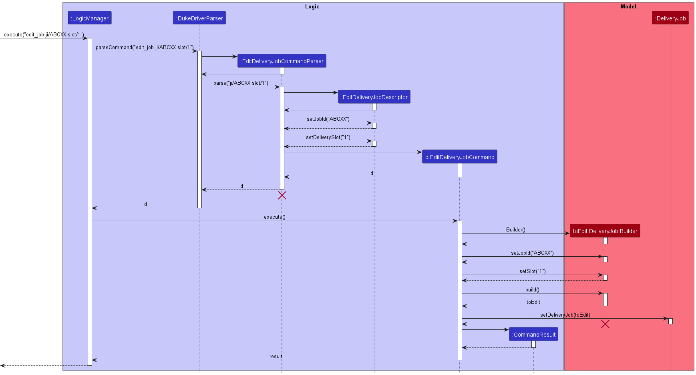
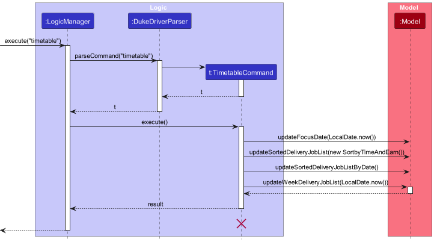
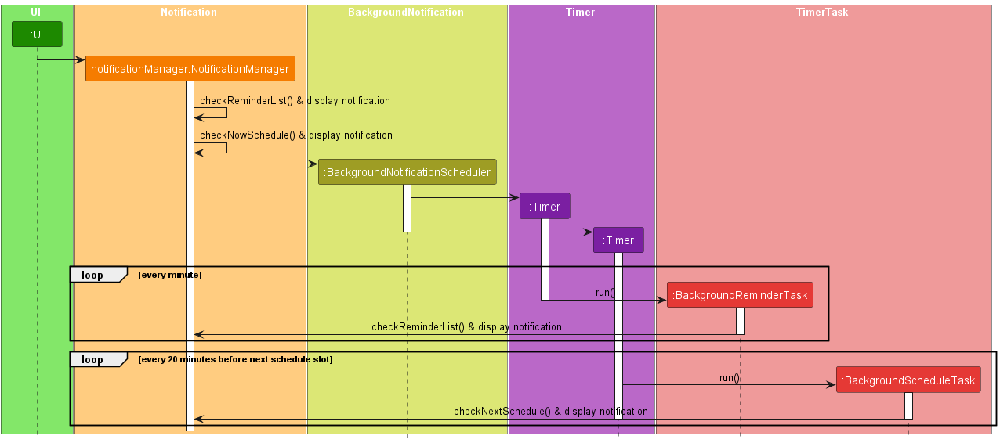

* Table of Contents
{:toc}

--------------------------------------------------------------------------------------------------------------------

## **Acknowledgements**

* ControlsFX [https://github.com/controlsfx/controlsfx](https://github.com/controlsfx/controlsfx)
* AddressBook 3

--------------------------------------------------------------------------------------------------------------------

## **Setting up, getting started**

Refer to the guide [_Setting up and getting started_](SettingUp.md).

--------------------------------------------------------------------------------------------------------------------

## **Design**

:bulb: **Tip:** The `.puml` files used to create diagrams in this document can be found in the [diagrams](https://github.com/AY2223S2-CS2103-F11-2/tp/tree/master/docs/diagrams/) folder. Refer to the [_PlantUML Tutorial_ at se-edu/guides](https://se-education.org/guides/tutorials/plantUml.html) to learn how to create and edit diagrams.

### Architecture

The ***Architecture Diagram*** given above explains the high-level design of the App.

Given below is a quick overview of main components and how they interact with each other.

**Main components of the architecture**

**`Main`** has two classes called [`Main`](https://github.com/AY2223S2-CS2103-F11-2/tp/blob/master/src/main/java/seedu/address/Main.java) and [`MainApp`](https://github.com/AY2223S2-CS2103-F11-2/tp/blob/master/src/main/java/seedu/address/MainApp.java). It is responsible for,
* At app launch: Initializes the components in the correct sequence, and connects them up with each other.
* At shut down: Shuts down the components and invokes cleanup methods where necessary.

[**`Commons`**](#common-classes) represents a collection of classes used by multiple other components.

The rest of the App consists of four components.

* [**`UI`**](#ui-component): The UI of the App.
* [**`Logic`**](#logic-component): The command executor.
* [**`Model`**](#model-component): Holds the data of the App in memory.
* [**`Storage`**](#storage-component): Reads data from, and writes data to, the hard disk.

**How the architecture components interact with each other**

The *Sequence Diagram* below shows how the components interact with each other for the scenario where the user issues the command `delete 1`.

Each of the four main components (also shown in the diagram above),

* defines its *API* in an `interface` with the same name as the Component.
* implements its functionality using a concrete `{Component Name}Manager` class (which follows the corresponding API `interface` mentioned in the previous point.

For example, the `Logic` component defines its API in the `Logic.java` interface and implements its functionality using the `LogicManager.java` class which follows the `Logic` interface. Other components interact with a given component through its interface rather than the concrete class (reason: to prevent outside component's being coupled to the implementation of a component), as illustrated in the (partial) class diagram below.

The sections below give more details of each component.

### UI component
#### General
The **API** of this component is specified in [`Ui.java`](https://github.com/AY2223S2-CS2103-F11-2/tp/blob/master/src/main/java/seedu/address/ui/Ui.java)

The UI layer consist of multiple UIWindows from different components. All windows inherits the abstract `UiPart` class which captures the commonalities between classes that represent parts of the visible GUI.

The `UI` component uses the JavaFx UI framework. The layout of these UI parts are defined in matching `.fxml` files that are in the `src/main/resources/view` folder. For example, the layout of the [`MainWindow`](https://github.com/AY2223S2-CS2103-F11-2/tp/blob/master/src/main/java/seedu/address/ui/MainWindow.java) is specified in [`MainWindow.fxml`](https://github.com/AY2223S2-CS2103-F11-2/tp/blob/master/src/main/resources/view/MainWindow.fxml)

The `UI` component,

* executes user commands using the `Logic` component.
* listens for changes to `Model` data so that the UI can be updated with the modified data (using `addEventListener`).
* calls predefined event handlers when an action, `button`, `mouse` or `keyboard` etc, is performed by the user.
* some window keeps a reference to the `Logic` component, because the `UI` relies on the `Logic` to execute commands.
* depends on some classes in the `Model` component, as it displays `DeliveryJob` or `Person` object residing in the `Model`.
* Although not represented in the diagram, the UI component starts the Notification function as soon as the app runs.

#### Main Window

On start, the `UIManager` will display the `MainWindow` that is made up of parts e.g.`CommandBox`, `ResultDisplay`, `DeliveryJobListPanel`, `StatusBarFooter` etc. The `MainWindow` serve as a main interaction and entry point to other windows for users.

#### Timetable Window

Timetable Window displays timetable of the specific week - which is specified by user. The "main" timetable window only contains scheduled jobs (jobs that are scheduled and not yet completed). However, we also have separated windows for completed and unscheduled jobs (`UnscheduleWindow` and `CompleteWindow`). Timetable Window helps users to stay organized and structure their plans for the week.

`Timetable Window`:
* gets the sorted job list by date and slot using `Logic` component
* displays the corresponding job list with the correct date and slot
* returns command execution result.
* remains up-to-date with the job list by adding `addListener` to `Logic#getFilteredDeliveryJobList()`.

`Unschedule Window`:
* displays the list of unscheduled jobs
* remains up-to-date with the job list by adding `addListener` to `Logic#getFilteredDeliveryJobList()`.

`Complete Window`:
* displays the list of completed jobs
* remains up-to-date with the job list by adding `addListener` to `Logic#getFilteredDeliveryJobList()`.

Structure of `UnscheduleWindow` and `CompleteWindow` can be shown using the Main Window UI Class diagram.

However, for `TimetableWindow`, the structure is more complicated than those 2 - it contains a few more parts such as `CommandBox`, `ResultDisplay`, etc.

Below is the structure of Timetable Window through class diagram:

#### Job System component

The `Job System` component,  

* executes create/edit delivery job commands using the `Logic` component.
* it can handle both create and edit mode for delivery jobs.
* it returns the command execution result through a callback handler.
* it opens a address book dialog for user to choose the sender and recipient for the job.

### Logic component

**API** : [`Logic.java`](https://github.com/AY2223S2-CS2103-F11-2/tp/blob/master/src/main/java/seedu/address/logic/Logic.java)

Here's a (partial) class diagram of the `Logic` component:

How the `Logic` component works:
1. When `Logic` is called upon to execute a command, it uses the `AddressBookParser` class to parse the user command.
1. This results in a `Command` object (more precisely, an object of one of its subclasses e.g., `AddCommand`) which is executed by the `LogicManager`.
1. The command can communicate with the `Model` when it is executed (e.g. to add a person).
1. The result of the command execution is encapsulated as a `CommandResult` object which is returned back from `Logic`.

The Sequence Diagram below illustrates the interactions within the `Logic` component for the `execute("delete_job ABCDEF")` API call (accessed from Main Window):

Another example would be `execute("delete 1")` - accessed from Customers' Window:

:information_source: **Note:** The lifeline for `DeleteCommandParser` should end at the destroy marker (X) but due to a limitation of PlantUML, the lifeline reaches the end of diagram.

Here are the other classes in `Logic` (omitted from the class diagram above) that are used for parsing a user command:

How the parsing works:
* When called upon to parse a user command, the `AddressBookParser` class creates an `XYZCommandParser` (`XYZ` is a placeholder for the specific command name e.g., `AddCommandParser`) which uses the other classes shown above to parse the user command and create a `XYZCommand` object (e.g., `AddCommand`) which the `AddressBookParser` returns back as a `Command` object.
* All `XYZCommandParser` classes (e.g., `AddCommandParser`, `DeleteCommandParser`, ...) inherit from the `Parser` interface so that they can be treated similarly where possible e.g, during testing.

### Model component
**API** : [`Model.java`](https://github.com/AY2223S2-CS2103-F11-2/tp/blob/master/src/main/java/seedu/address/model/Model.java)

The `Model` component,

* stores the address book data i.e., all `Person` objects (which are contained in a `UniquePersonList` object) and `Reminder` Objects (which are contained in a `ReminderList` object).
* store the delivery job system data (all `DeliveryJob` objects are contained in a `UniqueDeliveryJobList` object).
* stores the currently 'selected' `DeliveryJob` objects (e.g., results of a search query) as a separate _filtered_ list which is exposed to outsiders as an unmodifiable `ObservableList<DeliveryJob>` that can be 'observed' e.g. the UI can be bound to this list so that the UI automatically updates when the data in the list change.
* stores a `UserPref` object that represents the user’s preferences. This is exposed to the outside as a `ReadOnlyUserPref` objects.
* does not depend on any of the other three components (as the `Model` represents data entities of the domain, they should make sense on their own without depending on other components)
* The address book structure largely remains the same.

:information_source: **Note:** An alternative (arguably, a more OOP) model is given below. It has a `Tag` list in the `AddressBook`, which `Person` references. This allows `AddressBook` to only require one `Tag` object per unique tag, instead of each `Person` needing their own `Tag` objects. 

### Storage component

**API** : [`Storage.java`](https://github.com/AY2223S2-CS2103-F11-2/tp/blob/master/src/main/java/seedu/address/storage/Storage.java)

The `Storage` component,
* can save delivery job system, address book data and user preference data in json format, and read them back into corresponding objects.
* inherits from `DeliveryJobSystemStorage`, `AddressBookStorage` and `UserPrefStorage`, which means it can be treated as either one (if only the functionality of only one is needed).
* depends on some classes in the `Model` component (because the `Storage` component's job is to save/retrieve objects that belong to the `Model`)

### Common classes

Classes used by multiple components are in the `seedu.address.commons` package.

--------------------------------------------------------------------------------------------------------------------

## **Implementation**

This section describes some noteworthy details on how certain features are implemented.

### \[Proposed\] Undo/redo feature

#### Proposed Implementation

The proposed undo/redo mechanism is facilitated by `VersionedAddressBook`. It extends `AddressBook` with an undo/redo history, stored internally as an `addressBookStateList` and `currentStatePointer`. Additionally, it implements the following operations:

* `VersionedAddressBook#commit()` — Saves the current address book state in its history.
* `VersionedAddressBook#undo()` — Restores the previous address book state from its history.
* `VersionedAddressBook#redo()` — Restores a previously undone address book state from its history.

These operations are exposed in the `Model` interface as `Model#commitAddressBook()`, `Model#undoAddressBook()` and `Model#redoAddressBook()` respectively.

Given below is an example usage scenario and how the undo/redo mechanism behaves at each step.

Step 1. The user launches the application for the first time. The `VersionedAddressBook` will be initialized with the initial address book state, and the `currentStatePointer` pointing to that single address book state.

Step 2. The user executes `delete 5` command to delete the 5th person in the address book. The `delete` command calls `Model#commitAddressBook()`, causing the modified state of the address book after the `delete 5` command executes to be saved in the `addressBookStateList`, and the `currentStatePointer` is shifted to the newly inserted address book state.

Step 3. The user executes `add n/David …​` to add a new person. The `add` command also calls `Model#commitAddressBook()`, causing another modified address book state to be saved into the `addressBookStateList`.

:information_source: **Note:** If a command fails its execution, it will not call `Model#commitAddressBook()`, so the address book state will not be saved into the `addressBookStateList`.

Step 4. The user now decides that adding the person was a mistake, and decides to undo that action by executing the `undo` command. The `undo` command will call `Model#undoAddressBook()`, which will shift the `currentStatePointer` once to the left, pointing it to the previous address book state, and restores the address book to that state.

:information_source: **Note:** If the `currentStatePointer` is at index 0, pointing to the initial AddressBook state, then there are no previous AddressBook states to restore. The `undo` command uses `Model#canUndoAddressBook()` to check if this is the case. If so, it will return an error to the user rather
than attempting to perform the undo.

The following sequence diagram shows how the undo operation works:

:information_source: **Note:** The lifeline for `UndoCommand` should end at the destroy marker (X) but due to a limitation of PlantUML, the lifeline reaches the end of diagram.

The `redo` command does the opposite — it calls `Model#redoAddressBook()`, which shifts the `currentStatePointer` once to the right, pointing to the previously undone state, and restores the address book to that state.

:information_source: **Note:** If the `currentStatePointer` is at index `addressBookStateList.size() - 1`, pointing to the latest address book state, then there are no undone AddressBook states to restore. The `redo` command uses `Model#canRedoAddressBook()` to check if this is the case. If so, it will return an error to the user rather than attempting to perform the redo.

Step 5. The user then decides to execute the command `list`. Commands that do not modify the address book, such as `list`, will usually not call `Model#commitAddressBook()`, `Model#undoAddressBook()` or `Model#redoAddressBook()`. Thus, the `addressBookStateList` remains unchanged.

Step 6. The user executes `clear`, which calls `Model#commitAddressBook()`. Since the `currentStatePointer` is not pointing at the end of the `addressBookStateList`, all address book states after the `currentStatePointer` will be purged. Reason: It no longer makes sense to redo the `add n/David …​` command. This is the behavior that most modern desktop applications follow.

The following activity diagram summarizes what happens when a user executes a new command:

#### Design considerations:

**Aspect: How undo & redo executes:**

* **Alternative 1 (current choice):** Saves the entire address book.
  * Pros: Easy to implement.
  * Cons: May have performance issues in terms of memory usage.

* **Alternative 2:** Individual command knows how to undo/redo by
  itself.
  * Pros: Will use less memory (e.g. for `delete`, just save the person being deleted).
  * Cons: We must ensure that the implementation of each individual command are correct.

### Delivery Job System
#### Implementation

##### 1. Edit job command
Given below is an example usage scenario and how the update job mechanism behaves at each step. The other job system commands follow a similar execution pattern with their own command logics.

GUI Mode:
Step 1. The user launches the application for the first time.
Step 2. The user selects a job to be updated.
Step 3. The user edits preexisting inputs to update the job.

The command pattern was followed closely with difference only in the execution layer where the `EditDeliveryJobCommand` constructs a `DeliveryJob` object through a builder pattern.

The builder construct was initially introduced to handle optional and null arguments from `find_job` command and GUI. Here, we are reusing the builder to construct a `DeliveryJob` class.

The builder class returns a `DeliveryJob` object only when `EditDeliveryJobCommand` calls the `DeliveryJob.Builder#build()` method.

Operation resume to standard process from this point onwards.

The following sequence diagram shows how the update operation works:

##### 2. Delete job command
Similarly to `edit_job`, we have an example for the implementation for Delete Delivery Job command:

Given below is an example usage scenario and how the delete job mechanism behaves at each step. The logic is quite similar to `edit_job` command.

GUI Mode:
Step 1. The user launches the application for the first time.
Step 2. The user selects a job to delete.
Step 3. The user deletes the job by using the corresponding button.

The command pattern was followed closely with difference only in the execution layer where the `DeleteDeliveryJobCommand` prompts `Model` to delete the job.

Operation resume to standard process from this point onwards.

The following sequence diagram shows how the update operation works:

_In this example, user input is `delete_job ABCDEF`. The logic for `add_job` command is similar to this._

### Timetable feature
#### Implementation
#### 1. Display timetable of specific week (current week or week specified by users)
Given below is an example usage scenario and how the timetable mechanism behaves at each step.

Step 1. The user launches the application for the first time.

Step 2. The user inputs a series of commands to modify the state of the deliveryJobList.

:information_source: **Note:** If a command fails its execution, it will not call `Model#commitDeliveryJob()`, so the delivery job list state will not be saved into the `deliveryJobListSystem`.

Step 4. The user now wants to view timetable of the current week by executing the `timetable` command. The `timetable` command will call `Model#updateFocusDate(LocalDate.now())`, `Model#updateSortedDeliveryJobList()`, `Model#updateSortedDeliveryJobListByDate()` and `Model#updateWeekDeliveryJobList`. The sorter functions will re-sort the most updated delivery job list by date. Then, `Model#updateWeekDeliveryJobList` will update the week job list to the specific week's job list.

The `timetable_date` command is quite similar — it calls `Model#updateFocusDate()` using the date specified by user, before calling `Model#updateSortedDeliveryJobList()`, `Model#updateSortedDeliveryJobListByDate()` and `Model#updateWeekDeliveryJobList`, which will update the job list in the week according to the given date.

The following sequence diagram shows how the timetable operation works:

The following sequence diagram shows how the timetable_date operation works:

:information_source: **Note:** The lifeline for `TimetableCommand` should end at the destroy marker (X) but due to a limitation of PlantUML, the lifeline reaches the end of diagram.

#### Design considerations:

**Aspect: How timetable executes:**

* **Alternative 1 (current choice):** Timetable uses sorted job list which saves the entire delivery job list system.
    * Pros: Easy to implement.
    * Cons: May have performance issues in terms of memory usage.

* **Alternative 2:** Individual command knows which date to show timetable of specific week - timetable will only need to use job list of specific week.
    * Pros: Will use less memory.
    * Cons: We must ensure that the implementation of each individual command are correct.

#### 2. Display list of unscheduled or completed jobs
Given below is an example usage scenario and how the mechanism for showing list of unscheduled or completed jobs behaves at each step.

Step 1. The user launches the application for the first time.

Step 2. The user inputs a series of commands to modify the state of the deliveryJobList.

:information_source: **Note:** If a command fails its execution, it will not call `Model#commitDeliveryJob()`, so the delivery job list state will not be saved into the `deliveryJobListSystem`.

Step 4. The user now wants to view list of unscheduled or completed jobs by executing the `timetable_unscheduled` or `timetable_completed` command.

The `timetable_unscheduled`/`timetable_completed` command will call `Model#updateSortedDeliveryJobList()` and `Model#getUnscheduledDeliveryJobList()` or `Model#getCompletedDeliveryJobList()` correspondingly. 

The sorter functions will re-sort the most updated delivery job list by date. Then, the model will proceed to update the lists of unscheduled or completed jobs.

The following sequence diagram shows how the `timetable_unscheduled` operation works:

The following sequence diagram shows how the `timetable_completed` operation works:

:information_source: **Note:** The lifeline for `TimetableCommand` should end at the destroy marker (X) but due to a limitation of PlantUML, the lifeline reaches the end of diagram.

### Statistics feature
#### Implementation

Given below is an example usage scenario and how the statistics mechanism behaves at each step.

Step 1. The user launches the application for the first time.

Step 2. The user inputs a series of commands to modify the state of the deliveryJobList.

Step 3. The user now wants to view a summary of the statistics of the jobs in the deliveryJobList.
The `stats` command will open up the statistics window, where a list of statistics will be shown.

The `stats` command will call `Logic#getFilteredDeliveryJobList()` which will return a list of delivery jobs.
The statistics is then generated based on the list of delivery jobs and shown to the user in the Statistics Window.

The following sequence diagram shows how the statistics operation works:

#### Design considerations:

**Aspect: How statistics are stored:**

* **Alternative 1 (current choice):** Saves each statistic as a Statistic object in the list
    * Pros: Easy to store and display statistics
    * Cons: May have performance issues in terms of memory usage and execution delay.

* **Alternative 2:** Display each statistic individually
    * Pros: Will use less memory and faster to execute
    * Cons: Will make code longer and increases coupling

_{more aspects and alternatives to be added}_

### Notification feature
#### Implementation

The Notification feature is facilitated by an external library, [ControlsFx](https://github.com/controlsfx/controlsfx).
It is an open source project for JavaFX that aims to provide really high quality UI controls and other tools to
complement the core JavaFX distribution. The mechanism is handled by `NotificationManager`, which implements the
following operations:

* `NotificationManager#checkReminderList()` — Check against the `reminderList` found in `Model` and display a reminder notification with `NotificationManager#show()`.
* `NotificationManager#checkNowSchedule()` — Check against the timetable to create a notification of scheduled jobs to be carried out at in the present scheduled slot. Displays notification with `NotificationManager#show()`.
* `NotificationManager#checkNextSchedule()` — Check against the timetable to create a notification of upcoming scheduled jobs to be carried out in the next scheduled slot. Displays notification with `NotificationManager#show()`.
* `NotificationManager#show()` — Creates the actual notification with details picked up by the other methods, and displays it on the screen.

Additionally, to allow notifications to display even when the app is running in the background, `TimerTask` and `Timer` from `java.util` is utilised. This mechanism is started by
`BackgroundNotificationScheduler`, which schedules 2 `TimerTask`:

* `BackgroundReminderTask` — Runs `NotificationManager#checkReminderList()`. This task is scheduled every minute after the app has run. It will not show notifications of reminders that it has already shown (this check resets after the app shutdown).
* `BackgroundScheduleTask` — Runs `NotificationManager#checkNextSchedule()`. This task is scheduled 20 minutes before the next scheduled slot to display upcoming scheduled jobs. If the current time is
after the last slot timing, no notification for upcoming jobs will be displayed until the end of the day.

Given below is an example of the usage scenario and how the Notification feature behaves at each step.

Step 1. The user launches the application. `UiManager` will create an instance of `NotificationManager`.

Step 2. The instance of `NotificationManager` will then call `NotificationManager#checkReminderList()` and `NotificationManager#checkNowSchedule()`, which will display the corresponding notifications

Step 3. An instance of `BackgroundNotificationScheduler` will be created and its `BackgroundNotificationScheduler#run()` function will be called to schedule the 2 `TimerTask`.

Step 4. At the appropriate timings, `NotificationManager#checkReminderList()` and `NotificationManager#checkNextSchedule()` will run and display the appropriate notifications accordingly.

:information_source: **Note:** Users can click on the notification to dismiss the reminders. This effectively snoozes the reminder until another
new reminder is active. This is implemented by counting the number of active reminder through the `hasShown` attribute in `Reminder` and tracking the 
`isDismissed` variable in `NotificationManager`.

The following sequence diagram shows how the Notification feature works:

Design considerations:

**Aspect: How background notifications run its checks:**
* **Alternative 1 (current choice):** `TimerTask` and `Timer`
  * Pros: Easy to implement. Better OOP.
  * Cons: Cannot run random checks against the current time or date.
* **Alternative 2**: `Thread`
  * Pros: Allows random checks against the current time or date.
  * Cons: May slow down the app, or worst case scenario, hang the app.

--------------------------------------------------------------------------------------------------------------------

## **Documentation, logging, testing, configuration, dev-ops**

* [Documentation guide](Documentation.md)
* [Testing guide](Testing.md)
* [Logging guide](Logging.md)
* [Configuration guide](Configuration.md)
* [DevOps guide](DevOps.md)

--------------------------------------------------------------------------------------------------------------------

## **Appendix: Requirements**

### Product scope

**Target user profile: Delivery man**

* has a need to manage a significant number of contacts
* prefer desktop apps over other mediums
* can type fast
* prefers typing over mouse interactions
* is reasonably comfortable using CLI apps
* delivery man with >50 deliveries in a day
* drives constantly with a laptop in the van
* lazy, doesn't like to micromanage
* forgetful

**Value proposition**: 
* Manage contacts faster than a typical mouse/GUI driven app. 
* Helps delivery men to stay on track with their delivery schedule.
* Assists delivery men to structure their upcoming tasks.
* Manage job lists and customers' contacts - keep their information descriptive and updated/concise information.

### User stories

Priorities: High (must have) - `* * *`, Medium (nice to have) - `* *`, Low (unlikely to have) - `*`

| Priority | As a …​                                                         | I want to …​                                                       | So that I can…​                                                                      |
|----------|-----------------------------------------------------------------|--------------------------------------------------------------------|--------------------------------------------------------------------------------------|
| `* * *`  | new delivery driver and Duke Driver user                        | see usage instructions                                             | refer to instructions when I forget how to use the App                               |
| `* * *`  | delivery driver                                                 | add/delete jobs                                                    | keep track of my upcoming and old jobs                                               |
| `* * *`  | delivery driver                                                 | mark/unmark jobs                                                   | keep track of completed jobs                                                         |
| `* * *`  | organised and busy delivery driver                              | search for jobs in my Duke Driver job list                         | easily find the information that I need without having to go through the entire list |
| `* * *`  | busy delivery driver                                            | mass import job list from file to Duke Driver                      | easily move my data between devices or other apps.                                   |
| `* * *`  | delivery driver                                                 | add a new person                                                   | keep in touch with my clients                                                        |
| `* * *`  | delivery driver                                                 | delete a person                                                    | remove entries that I no longer need                                                 |
| `* * *`  | organised delivery driver                                       | find a person by their information                                 | locate details of persons without having to go through the entire list               |
| `* * *`  | busy Duke Driver user                                           | edit existing contacts in my address book                          | update their information if it changes                                               |
| `* * *`  | busy Duke Driver user                                           | edit existing jobs in my Duke Driver job list                      | update their information if it changes                                               |
| `* * *`  | forgetful person                                                | received notifications/be reminded of upcoming tasks and deadlines | complete all my jobs on time and not forget a task                                   |
| `* * *`  | forgetful person                                                | add reminders to the app                                           | complete all my jobs on time and not forget a task                                   |
| `* * *`  | organised person                                                | delete reminders from the app                                      | keep myself updated to my progress                                                   |
| `* * *`  | busy person                                                     | snooze reminders                                                   | ignore/forget about jobs that I am not able to complete at the scheduled time        |
| `* * *`  | busy person                                                     | view list of reminders                                             | keep track of my progress                                                            |
| `* * *`  | organised user                                                  | be prepared for upcoming tasks and deadlines                       | plan for my next schedule                                                            |
| `* * *`  | busy and organised person                                       | view schedule of my tasks in a week                                | organise my timetable/to-do list and keep track/complete everything on time          |
| `* * *`  | busy  and organised person                                      | view list of completed and unscheduled jobs                        | keep track of my work                                                                |
| `* * *`  | productive and motivated delivery driver                        | view statistics of my jobs and earnings                            | keep track of my work and get motivated to work harder                               |
| `* *`    | delivery driver                                                 | hide private contact details                                       | minimize chance of someone else seeing them by accident                              |
| `* *`    | delivery driver who wants to learn how to maximise his earnings | view my aggregated information                                     | track my earnings and other statistics                                               |
| `*`      | delivery driver with many jobs in Duke Driver                   | sort and filter jobs                                               | locate jobs easily and thus increase delivery efficiency                             |
| `*`      | user                                                            | adjust how my notifications are shown                              | have a clutter free desktop                                                          |

### Use cases

(For all use cases below, the **System** is the `Duke Driver` and the **Actor** is the `user`, unless specified otherwise)

#### [ST1] View statistics
_**MSS**_
1. User is on homepage of list of jobs.
2. User requests to view overall statistics.
3. System shows total earnings, monthly earnings,
   weekly earnings, daily earnings and top customers visited.
   Use case ends.

_**Extensions**_
* 2a. The list is empty.
      Use case ends.

#### [DE1] View delivery job detailsummary>
_**MSS**_
1. User opens the system.
2. System list all pending jobs.
3. User selects the job for details.
4. System displays the full detail of the delivery job.

#### [DE2] Add a delivery job
_**MSS**_
1. User is on homepage of list of jobs.
2. User requests to add a job in the list.
3. System adds job and job appears in list of jobs.
   Use case ends.

#### [DE3] Delete a delivery job
_**MSS**_
1. User is on homepage of list of jobs.
2. System shows a list of jobs.
3. User requests to delete a specific job in the list.
4. System deletes the job.
   Use case ends.

_**Extensions**_
* 2a. The list is empty.
  Use case ends.
* 3a. The given index is invalid.
    * 3a1. System shows an error message.
      Use case resumes at step 2.

#### [DE4] Edit a delivery job

_**MSS**_
1. User is on homepage of list of jobs.
2. System shows a list of jobs.
3. User requests to edit a specific job in the list.
4. User fill in and submit the changes.
4. System update the job and list the new information.
   Use case ends.

_**Extensions**_
* 2a. The list is empty.
  Use case ends.
* 3a. The given index is invalid.
    * 3a1. System shows an error message.
      Use case resumes at step 2.

#### [DE5] Find a delivery job
_**MSS**_
1. User is on homepage of list of jobs.
2. System shows a list of jobs.
3. User requests search for a job with options.
4. System displays search results that matches the query.
   Use case ends.

_**Extensions**_
* 3a. Invalid search option given.
    * 3a1. System shows an error message.
      Use case resumes at step 2.
* 4a. No item matches the query options.
    * 4a. System shows empty list.
      Use case resumes at step 2.

#### [TT1] Display timetable of scheduling tasks of current week

_**MSS**_
1. User requests to display timetable by selecting Timetable option on homepage.
2. System displays timetable of uncompleted/upcoming jobs in current week in Timetable Window.
   Use case ends.

#### [TT2] Display timetable of scheduling tasks of week containing a specific date
_**MSS**_
1. User requests to display timetable of specific week containing a specific date.
2. System displays timetable of uncompleted/upcoming jobs in the week in Timetable Window.
   Use case ends.

#### [TT3] Display list of unscheduled/completed jobs

_**MSS**_
1. User requests to display list of unscheduled/completed jobs.
2. System displays list of unscheduled/completed jobs in Unscheduled/Completed Window.
   Use case ends.

#### [RE1] Alert scheduled jobs

_**MSS**_

1. User starts up System.
2. System checks the time. 
3. If the current timing falls more than 20 mins before a timetable slot, System will check if there is any current job. 
If yes, it will count and alert the user through the notification feature.
4. System runs in the background to only check the timetable for upcoming jobs.
   System will repeat step 2 every hour, 20 mins before the next timetable slot.
   Use case ends.

_**Extensions**_
* 3a. If the current time is within 20 mins before the next timetable slot
    * 3a1. System will check the next timetable slot and count number of upcoming jobs.
    * 3a2. Alert the user through the notification feature.
* 3b. If the current time is before the first timetable slot.
    * 3b1. System will check in the first timetable slot and count number of upcoming jobs.
    * 3b2. Alert the user through the notification feature.
* 3c. If the current time is after the last timetable slot
    * 3c1. System will not check for any or upcoming scheduled jobs.
      Use case resumes from step 4.

#### [RE2] Alert reminders
_**MSS**_
1. User starts up System.
2. System loads address book from memory.
3. System checks from address book, list of reminders. If the current date and time has pass or is equal to the date 
specified in a reminder, System will count it as an active reminder. 
4. System will display the number of active notifications.
5. System runs in the background to check against the list of reminders after every minute.
   System will repeat the check at step 3.
   Use case ends.

_**Extensions**_
* 4a. User can dismiss the reminder. Doing will prevent the app from showing anymore notifications.
    * 4a1. A new reminder is activated.
      Use case resumes from step 4.
    * 4a2. No new reminder is activated.
      Use case resumes from step 5

#### [RE3] Add reminders
_**MSS**_

1. User details the description, date and time of a reminder to the System.
2. System adds the reminder into the reminder list.
   Use case ends.

_**Extensions**_
* 2a. date and time of reminder is not provide.
    * 2a1. System will prompt user again.
           Use case resumes from step 1.

#### [RE4] Delete reminders

_**MSS**_

1. User specifies a reminder to be deleted based on its index number.
2. System finds the corresponding reminder, and deletes it from the reminder list.
   Use case ends.

_**Extensions**_
* 2a. Index provided by user is not found in reminder list.
    * 2a1. System will prompt user again.
      Use case resumes from step 1.

#### [RE5] List reminders

_**MSS**_

1. User request System to show all reminders in reminder list.
2. System displays all reminders.
   Use case ends.

### Non-Functional Requirements

1.  Should work on any _mainstream OS_ as long as it has Java `11` or above installed.
2.  Should be used for a single user only i.e. (not a multi-user product).
3.  The system should respond within two seconds (after receiving input from user).
4.  A user with above average typing speed for regular English text (i.e. not code, not system admin commands) should be able to accomplish most of the tasks faster using commands than using the mouse.

### Glossary

* **Mainstream OS**: Windows, Linux, Unix, OS-X
* **Private contact detail**: A contact detail that is not meant to be shared with others
* **Customer/Client**: Those who placed orders and created work for delivery men.
* **GUI**: Graphical User Interface
* **PlantUML**: An open-source tool allowing users to create diagrams from a plain text language.
* **CLI**: Command Line Interface

--------------------------------------------------------------------------------------------------------------------

## **Appendix: Instructions for manual testing**

Given below are instructions to test the app manually.

:information_source: **Note:** These instructions only provide a starting point for testers to work on;
testers are expected to do more *exploratory* testing.

### Launch and shutdown

1. Initial launch
   1. Download the jar file and copy into an empty folder
   1. Double-click the jar file Expected: Shows the GUI with a set of sample contacts. The window size may not be optimum.

1. Saving window preferences
   1. Resize the window to an optimum size. Move the window to a different location. Close the window.
   1. Re-launch the app by double-clicking the jar file. 
       Expected: The most recent window size and location is retained.

### Deleting a person

1. Deleting a person while all persons are being shown
   1. Prerequisites: List all persons in Customers Window using the `list` command. Multiple persons in the list.
   1. Test case: `delete 1` 
      Expected: First contact is deleted from the list. Details of the deleted contact shown in the status message. 
   1. Test case: `delete 0` 
      Expected: No person is deleted. Error details shown in the status message. Status bar remains the same.
   1. Other incorrect delete commands to try: `delete`, `delete x`, `...` (where x is larger than the list size) 
      Expected: Similar to previous.

### Adding a delivery job 

1. Add a job through command
   1. Prerequisites: User is in the main window. Valid recipient and sender id. 
   1. Test case: `add_job si/DAVSAM ri/CHASAM earn/1` 
      Expected: A delivery job is created without delivery schedule.  
                The sender should be DAVSAM and recipient should be CHASAM.  
                With earning value of $1.
   1. Test case: `add_job si/DAVSAM ri/CHASAM earn/1 date/2024-05-01 slot/1` 
      Expected: A delivery job is created with delivery schedule.  
                Similar to previous.
   1. Other incorrect add job commands to try:  
      - `add_job si/invalid_id ri/invalid_id earn/empty` invalid argument supply.  
      - `add_job si/... ri/... earn/... [date/...] [slot/...]` with either date or slot given.  

1. Add a job through GUI
   1. Prerequisites: User have access to GUI. Select `menu` > `Delivery Job System` > `Create Job`.  
   1. Test case: fill in mandatory fields only (recipient/sender/earning) 
      Expected: Similar to `1.ii`
   1. Test case: fill in all fields 
      Expected: Similar to `1.iii`
   1. Other incorrect approach to try:  
      - `sender/recipient`, invalid person id.
      - `earning`, multiple decimal points.  
      - `date`, invalid date.  

### Notifications

1. Display a notification for a reminder
   1. Prerequisites: Added a reminder using the `add_reminder` command. Make sure the `time/` field is set to an appropriate time.
   2. Test case: Current time has pass indicated time for Reminder   Expected: After adding reminder, notification for that reminder should pop up at the next clock minute.
   3. Test case: Current time has not pass indicated time for Reminder   Expected: No notification should show, unless clock minute has pass time indicated for reminder.

2. Snooze reminder notification
    1. Prerequisites: Reminder has been added, current time has pass time indicated in reminder, and notification is showing.
   2. Test case: Clicking on body of notification should open up the Reminder List Window, and dismiss the notification. Notification should not show up again at next clock minute, unless a new reminder
has been activated. 
   3. Due to the in-built nature of ControlsFX's notification and how reminders are checked at every minute, expect the notification to disappear and appear again every minute.

3. Display a notification for next Scheduled slot
   1. Prerequisites: Assign a job to an appropriate timetable slot.
   2. Test case: Once current time is 20 minutes before the next timetable slot (e.g. 10:40 to 10:59), a notification would pop up for the number of jobs assigned to the next timetable slot.

### Timetable

1. Display timetable for specific week containing a specific date from Main Window
    1. Prerequisites: None.
    2. Command: `timetable` (Show timetable of current week - LocalDate.now()) or `timetable date date/YYYY-mm-DD`. The date should not be left empty. Alternative, for `timetable` command, user can use GUI mode instead: Menu bar > Timetable > Scheduled jobs.
    3. The output box in the window should show a message confirming that Timetable window is opened for the specific week containing the input date.
    4. The system should open Timetable for the specific week, showing job list in respective day and slot (if there are any jobs for that day - else, the column for the day will be empty).

2. Display list of unscheduled jobs (i.e. jobs with invalid date and slot)
    1. Prerequisites: None.
    2. Command: `timetable_unscheduled` or GUI mode: Menu bar > Timetable > Unscheduled jobs.
    3. The output box in the Main window should show a message confirming that Unscheduled job is opened for the specific week.
    4. The system should open the Unscheduled Window, showing list of unscheduled jobs and total number of unscheduled jobs.

3. Display list of completed jobs 
    1. Prerequisites: None.
    2. Command: `timetable_completed` or GUI mode: Menu bar > Timetable > Completed jobs.
    3. The output box in the Main window should show a message confirming that Completed job is opened for the specific week.
    4. The system should open the Completed Window, showing list of completed jobs and total number of completed jobs.

4. Display timetable for specific week containing a specific date from Timetable Window
    1. Prerequisites: Opened Timetable window using `timetable` command from Main Window. Timetable of current week is shown in current Timetable Window.
    2. Command: `timetable date date/YYYY-mm-DD`. The date should not be left empty. 
    3. The output box in the Timetable window should show a message confirming that Timetable window is opened for the specific week which contains the input date.
    4. The system should display Timetable for the specific week, showing job list in respective day in the week and slot (if there are any jobs for that day - else, the column for the day will be empty).

### Appendix: Effort
As our application contains different windows and features, such as Timetable Window, Statistics Window, Reminder Window,.. - one challenge that we had to face was deciding on the UI and design of our app. We learnt to work with JavaFX to open different windows when needed, and decide on the structure/design of each and every window that we have to maintain good design principles. In order to make sure that Duke Driver is friendly to users who prefer typing, asides from including buttons on GUI mode, we also include commands (typing-preferred) for users to switch to different windows. 

Moreover, AB3 code base only consists of features supporting only `Person` class, meanwhile for Duke Driver, we had to work with and update the code base to support different entity types - for example, `Delivery Job` and `Reminder`. With the extensions that we planned to do, we also had to update the Parser to support a much larger set of commands, as we were working with numerous commands from different windows (Timetable, Reminder, Statistics,...).

For Delivery Job Management System, as the job details were very long and could not be viewed inside a small cell in the job list, we wanted to add a feature for users to use mouse or arrow keys and click on the job to view its detail correspondingly. This was challenging as we need to learn how to make use of the UI and keyboard clicks. 

We also added a GUI mode for our app - to speed up the speed of each command and thus, help to enhance users' experience. Throughout this process, we learn how to use various JavaFX classes and interfaces.

We wanted to introduce a notification function to the app, so that users could be reminded of their jobs and upcoming tasks more easily. It was challenging to implement this function as JavaFx did not have any native notification feature. Hence, we had to find an external library that did so. We decided to used ControlFX, an open source project for JavaFX that serves to provide high quality UI controls on top of the existing JavaFX distribution. Through abstraction, this feature can be used by other portions of the applications (i.e. reminders, scheduling, etc). Hence, the implementation extended the functionalities and benefits of the application.

For Timetable Window, we wanted users to be able to structure their plans for the week, thus we added a Timetable feature. However, as Timetable is directly linked with the delivery job list, thus changes made in the existing functions could affect the features directly and it required changes to the existing commands. We also had to decide on the design/structure of the Timetable Window, and learn to use the `ListView` class in our timetable.

Overall, the Team Project for us was quite challenging, as it requires us to learn to work together and help each other. We had to divide the work among ourselves so that everyone can get a grasp of and understand the code base. Understanding and updating the code base was quite tough at first, due to high levels of abstraction and the amount of classes that AB3 has. We tried to break it down into small tasks and understand it little by little each week. These small improvements day-by-day helped us get used to the codebase and the workload eventually. 

We also learnt to work as a team and contributed, reviewed and helped to debug each other's work through weekly meetings and constant updates. Distributing the work and assigning small task to each member helped us gain more confidence throughout the project. 
