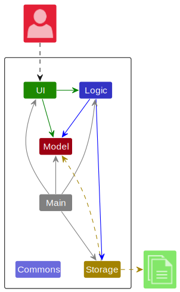
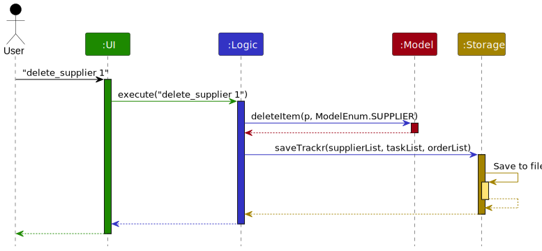
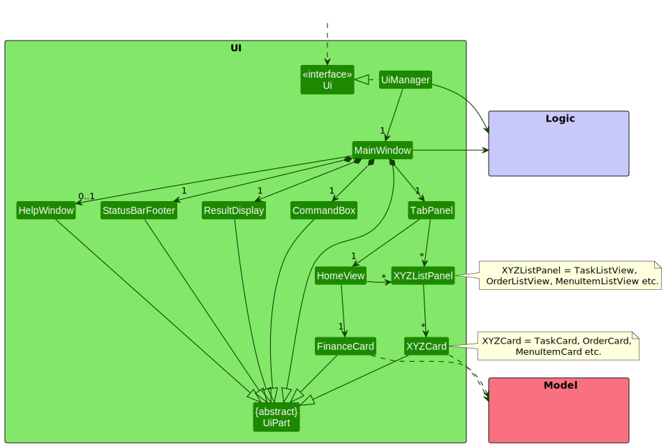
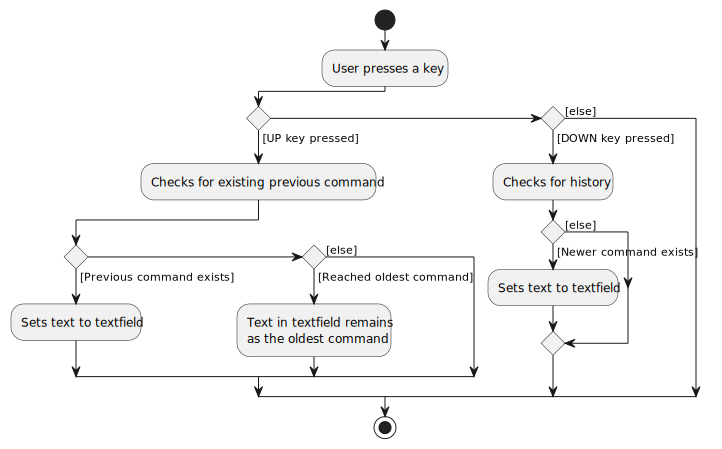
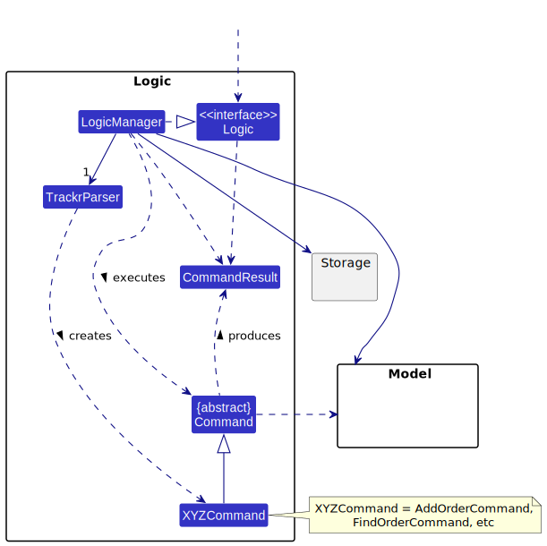
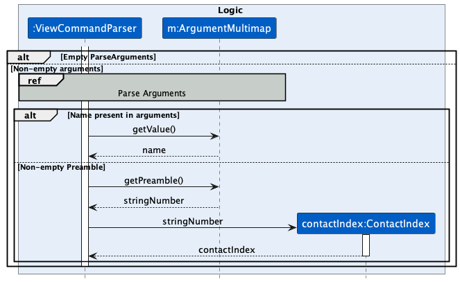
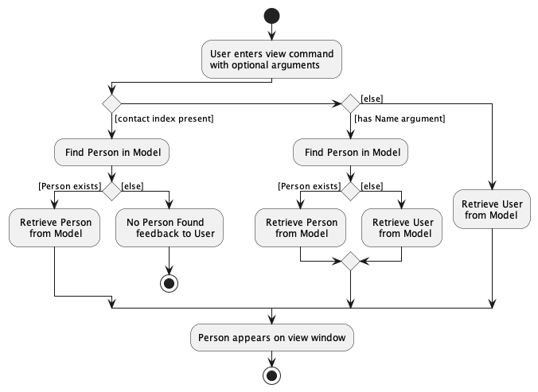

# **Table of Contents**
1. [Introduction](#1-introduction)
   * [Software Overview](#software-overview)
   * [Intended Audience](#intended-audience)
   * [Using the Guide](#using-the-guide)
   * [Content Overview](#content-overview)
   * [About Us](#about-us)
   * [Getting Help](#getting-help)
   * [Core Technologies](#core-technologies)
   * [Acknowledgements](#acknowledgements)
   * [Version Control](#version-control)
   * [Issue Tracker](#issue-tracker)
2. [Development Environment](#2-development-environment)
3. [Tips](#3-tips)
   * [Sample Data](#sample-data)
4. [Design](#4-design)
   * [Architecture](#architecture)
     * [Main Components of the Architecture](#main-components-of-the-architecture)
     * [How the Architecture Components Interact with Each Other](#how-the-architecture-components-interact-with-each-other)
   * [UI Component](#ui-component)
   * [Key_Mapping](#key-mapping)
   * [Model Component](#model-component)
     * [Person](#person)
         * [Name](#name)
         * [Address](#address)
         * [Phone](#phone)
         * [Email](#email)
         * [Telegram Handle](#telegram-handle)
         * [Group Tag Set](#group-tag-set)
         * [Module Tag Set](#module-tag-set)
     * [Tag](#tag)
         * [Group Tag](#group-tag)
         * [Module Tag](#module-tag)
     * [Time](#time)
       * [Day](#day)
       * [TimePeriod](#timeperiod)
     * [Timetable](#timetable)
       * [Module](#module)
     * [Utils](#utils)
       * [Sample Data Util](#sample-data-util)
   * [Logic Component](#logic-component)
     * [Commands](#commands)
         * [Add Command](#add-command)
         * [Edit Command](#edit-command)
         * [Delete Command](#delete-command)
         * [Tag Command](#tag-command)
         * [View Command](#view-command)
         * [Find Command](#find-command)
         * [Sort Command](#sort-command)
         * [List Command](#list-command)
         * [Exit Command](#exit-command)
         * [Meet Command](#meet-command)
     * [Parsers](#parsers)
       * [Argument Multimap](#argument-multimap)
       * [Prefix](#prefix)
     * [Recommenders](#recommenders)
       * [Timing Recommender](#timingRecommender)
       * [Location Recommender](#location-recommender)
   * [Storage Component](#storage-component)
   * [Commons Component](#common-classes)
     * [MathUtil](#math-util)
5. [Testing](#5-testing)
   * [Unit Tests](#unit-tests)
   * [Testing Models](#testing-models)
   * [Testing Commands](#testing-commands)
   * [Testing Parsers](#testing-parsers)
   * [Measuring Coverage of Integration Tests](#measuring-coverage-of-integration-tests)
   * [Create Code Coverage Report](#create-code-coverage-report)
   * [Read Code Coverage Report](#read-code-coverage-report)
   * [Continuous Integration](#continuous-integration)
6. [Documentation](#6-documentation)
   * [Using PlantUML](#using-plantuml)
7. [Appendix](#7-appendix)
   * [Project Requirements](#project-requirements)
   * [Product Scope](#product-scope)
     * [Target User Profile](#target-user-profile)
     * [Value Proposition](#value-proposition)
   * [Use Cases](#use-cases)
   * [Non-Functional Requirements](#non-functional-requirements)
   * [Instructions for Manual Testing](#instructions-for-manual-testing)
     * [Launch and shutdown](#launch-and-shutdown)
     * [Add a new person to EduMate](#add-a-new-person-to-edumate)
     * [View a person in EduMate](#view-a-person-in-edumate)
     * [Edit a person in EduMate](#edit-a-person-in-edumate)
     * [Delete a person in EduMate](#delete-a-person-in-edumate)
     * [Add a tag to a person](#add-a-tag-to-a-person)
     * [Remove a tag from a person](#remove-a-tag-from-a-person)
     * [Filter persons by keywords](#filter-persons-by-keywords)
     * [Arrange persons by criteria](#arrange-persons-by-criteria)
     * [Generate a sample EduMate](#generate-a-sample-edumate)
   * [Glossary](#glossary)
   * [Documentation, logging, testing, configuration, dev-ops](#documentation-logging-testing-configuration-dev-ops)

# **1. Introduction**

---

## **Software Overview**
EduMate is a desktop app designed for NUS students to manage their academic and social lives. It is optimized for use through a Command Line Interface (CLI) while still providing the benefits of a Graphical User Interface (GUI). If you type quickly, eduMate can complete contact and module management tasks faster than traditional GUI apps.

---

## **Intended Audience**
This guide is intended primarily for developers who want to work on the **EduMate** Software code base at [https://github.com/AY2223S2-CS2103T-W14-2/tp](https://github.com/AY2223S2-CS2103T-W14-2/tp).

:information_source: To get started, you'll want to set up your [Development Environment](#2-development-environment) and make sure you understand the branching strategy described in the [Version Control](#version-control) section and how to make a pull request. Thorough [testing](#5-testing) is expected for all pull requests, such that all testable methods are amply tested.

---

## **Using the Guide**
### **What Do the Emojis Mean**

| Emoji                | GFMD form              | What does it mean                                                   |
|----------------------|------------------------|---------------------------------------------------------------------|
| :construction:       | `:construction:`       | Feature under construction                                          |
| :question:           | `:question:`           | Frequently asked question (FAQ)                                     |
| :heavy_check_mark:   | `:heavy_check_mark:`   | What the developer should do                                        |
| :warning:            | `:warning:`            | Warning to the developer, number of warning signs show the severity |
| :bulb:               | `:bulb:`               | Tip for the developer                                               |
| :information_source: | `:information_source:` | Information for the developer                                       |

---

## **Content Overview**
Here is a brief overview of the guide's content, so that it is easier for you to understand the software and our development workflow:

* [**Development Environment**](#2-development-environment) - what you need to do before you can start writing code
* [**Tips**](#3-tips) - useful tips that make the developmental process easier
* [**Design**](#4-design) - how **EduMate** is currently implemented
* [**Testing**](#5-testing) - expectations and workflow for the testing process
* [**Documentation**](#6-documentation) - expectations and workflow for the documentation process
* [**Appendix**](#7-appendix) - additional information you may find useful

---

## **About Us**
Please refer to the [About Us](AboutUs.md) page for information about the developers.

---

## **Getting Help**
Should you require assistance in any form with regards to EduMate, please head over to our
[Github](https://github.com/AY2223S2-CS2103T-W14-2/tp) page and file an issue with a tag *developer-assistance-required*.
A member of our core team will attend to you as soon as possible.

---

## **Core Technologies**
* Libraries used: [JavaFX](https://openjfx.io/), [Jackson](https://github.com/FasterXML/jackson), [JUnit5](https://github.com/junit-team/junit5), [Joda-Time](https://www.joda.org/joda-time/index.html).

---

## **Acknowledgements**
* This project is based on the [AddressBook Level 3 (AB3)](https://se-education.org/addressbook-level3/) project created by the [SE-EDU initiative](https://se-education.org/).
* Libraries used: [JavaFX](https://openjfx.io/), [JUnit5](https://github.com/junit-team/junit5), [Joda-Time](https://www.joda.org/joda-time/index.html)

---

## **Version Control**
### **The `master` Branch**

The `master` branch represents stable released versions of the **EduMate** software. It is expected that this version always works as expected.

:warning::warning: You must not merge a PR into the branch if it fails some tests.

:heavy_check_mark: Instead, you should fork from this master branch into your own repo and work on new features on a branch off your own repo. Your `master` branch should always be synced with the upstream `master` branch.

### **How to Make a Pull Request**

Once you've made changes to your branch, create a Pull Request (PR) on the upstream `master` branch and link the PR with any relevant issues and milestones.

:warning::warning: You must not review and merge your own PR. Instead, wait for somebody else to review it for you. In this way, we can cross-check each others' code, leading to fewer errors.

---

## **Issue Tracker**

We use GitHub Issues as our issue tracker, and here is how to use the issue labels:

| Issue Label Name               | Description                                                             |
|--------------------------------|-------------------------------------------------------------------------|
| `deliverables.Individual`      | Individual submission requirements (for the module)                     |
| `deliverables.Team`            | Team submission requirements (for the module)                           |
| `documentation.DeveloperGuide` | Improvements or additions to the Developer Guide                        |
| `documentation.UserGuide`      | Improvements or additions to the User Guide                             |
| `modify`                       | Existing feature needs to be modified                                   |
| `new`                          | New feature needs to be implemented                                     |
| `priority.High`                | The task needs to be completed immediately                              |
| `priority.Medium`              | The task needs to be completed in the near future                       |
| `priority.Low`                 | The task can be postponed                                               |
| `severity.High`                | The bug needs to be fixed immediately                                   |
| `severity.Medium`              | The bug needs to be fixed in the near future                            |
| `severity.Low`                 | The bug can be fixed later                                              |
| `type.Bug`                     | Something is not working and needs to be fixed                          |
| `type.Discuss`                 | Something needs to be discussed with the rest of the team               |
| `type.Investigate`             | Something needs to be investigated, but is not a bug                    |
| `type.Task`                    | Something needs to be done                                              |
| `type.Story`                   | A feature which addresses a user story                                  |
| `type.Epic`                    | A big feature which can be broken down into smaller stories e.g. search |
| `type.Testing`                 | Test cases need to be written                                           |

# **2. Development Environment**

:information_source: Refer to the guide [_Setting up and getting started_](SettingUp.md) to know what you need to do before you can start writing code.

# **3. Tips**

---

## **Sample Data**

Sample data for **EduMate** can be found [here](https://github.com/AY2223S2-CS2103T-W14-2/tp/blob/master/src/main/java/seedu/address/model/util/sampleData.txt). It is a set of 100 persons with procedurally-generated fields.

:information_source: Each row represents a person's information, with the `|` separating the different fields.

In order, they are: `name|phone|email|address|telegram|groups|modules`. Note that groups and modules are separated by a space.

For example, `Bee Shan|81121128|beeshan@gmail.com|200 Bishan Road|@beeshan|NS CCA|CS3242 BT3101 CS1010E CS3219 CE3165` provides information for a person with the following details:

| Field           | Value                                   |
|-----------------|-----------------------------------------|
| Name            | Bee Shan                                |
| Phone           | 81121128                                |
| Email           | beeshan@gmail.com                       |
 | Address         | 200 Bishan Road                         |
 | Telegram Handle | @beeshan                                |
 | Groups          | NS, CCA                                 |
 | Modules         | CS3242, BT3101, CS1010E, CS3219, CE3165 |

:information_source: These names were chosen so that we can easily extract more information such as Location (as coordinates) for use in future features.

:warning: Try not to alter this data too much, as some persons (like Albert Park) are used in testing.

# **4. Design**

---

## **Architecture**

    <b>Figure 4.1.1</b> Architecture Diagram for the high-level design of the App

 

Given below is a quick overview of main components and how they interact with each other.

### **Main components of the architecture**

**`Main`** has two classes called [`Main`](https://github.com/AY2223S2-CS2103T-W14-2/tp/blob/master/src/main/java/seedu/address/Main.java) and [`MainApp`](https://github.com/AY2223S2-CS2103T-W14-2/tp/blob/master/src/main/java/seedu/address/MainApp.java). It is responsible for,
* At app launch: Initializes the components in the correct sequence, and connects them up with each other.
* At shut down: Shuts down the components and invokes cleanup methods where necessary.

[**`Commons`**](#common-classes) represents a collection of classes used by multiple other components.

The rest of the App consists of four components.

* [**`UI`**](#ui-component): The UI of the App.
* [**`Logic`**](#logic-component): The command executor.
* [**`Model`**](#model-component): Holds the data of the App in memory.
* [**`Storage`**](#storage-component): Reads data from, and writes data to, the hard disk.

### **How the architecture components interact with each other**

The *Sequence Diagram* below shows how the components interact with each other for the scenario where the user issues the command `delete 1`.

    <b>Figure 4.1.2</b> Sequence Diagram for the command <code>delete 1</code>

 

Each of the four main components (also shown in the diagram above),

* defines its *API* in an `interface` with the same name as the Component.
* implements its functionality using a concrete `{Component Name}Manager` class (which follows the corresponding API `interface` mentioned in the previous point.

For example, the `Logic` component defines its API in the `Logic.java` interface and implements its functionality using the `LogicManager.java` class which follows the `Logic` interface. Other components interact with a given component through its interface rather than the concrete class (reason: to prevent outside component's being coupled to the implementation of a component), as illustrated in the (partial) class diagram below.

    <b>Figure 4.1.3</b> Class Diagram for Component Managers

 

The sections below give more details of each component.

---

## **UI Component**

The **API** of this component is specified in [`Ui.java`](https://github.com/AY2223S2-CS2103T-W14-2/tp/blob/master/src/main/java/seedu/address/ui/Ui.java)

    <b>Figure 4.2.1</b> Class Diagram for UI Components

 

The UI consists of a `MainWindow` that is made up of parts e.g.`CommandBox`, `ResultDisplay`, `PersonListPanel`, `UserProfilePanel` etc. All these, including the `MainWindow`, inherit from the abstract `UiPart` class which captures the commonalities between classes that represent parts of the visible GUI.

The `UI` component uses the JavaFx UI framework. 

To start making changes to the UI:

- The layout of these UI parts can be found in matching `.fxml` files in the [`src/main/resources/view`](https://github.com/AY2223S2-CS2103T-W14-2/tp/blob/master/src/main/resources/view) folder. 
- The controller classes of these UI parts can be found in matching `.java` files in the [`src/main/java/seedu/address/ui`](https://github.com/AY2223S2-CS2103T-W14-2/tp/blob/master/src/main/java/seedu/address/ui)folder.
- The stylesheets for these UI parts can be found in `Extensions.css` and `MainWindow.css`, except `UserProfilePanel` and `HelpWindow` with separate CSS files in matching `.css` files in the [`src/main/resources/view`](https://github.com/AY2223S2-CS2103T-W14-2/tp/blob/master/src/main/resources/view) folder.
- For example, the layout of `UserProfilePanel` is specified in [`UserProfilePanel.fxml`](https://github.com/AY2223S2-CS2103T-W14-2/tp/blob/master/src/main/resources/view/UserProfilePanel.fxml), with controller class at [`UserProfilePanel.java`](https://github.com/AY2223S2-CS2103T-W14-2/tp/blob/master/src/main/java/seedu/address/ui/UserProfilePanel.java) and stylesheet at [`UserProfilePanel.css`](https://github.com/AY2223S2-CS2103T-W14-2/tp/blob/master/src/main/resources/view/UserProfilePanel.css).

The `UI` component,

* executes user commands using the `Logic` component.
* listens for changes to `Model` data so that the UI can be updated with the modified data.
* keeps a reference to the `Logic` component, because the `UI` relies on the `Logic` to execute commands.

## **Key Mapping**

    <b>Figure 4.3.1</b> Activity Diagram for UP and DOWN keys

The `UP` and `DOWN` keys have been mapped to return previously typed commands by the user.

---

## **Model Component**

**API** : [`Model.java`](https://github.com/AY2223S2-CS2103T-W14-2/tp/blob/master/src/main/java/seedu/address/model/Model.java)

    <b>Figure 4.3.1</b> Class Diagram for Model Components

The `Model` component,

* stores the address book data i.e., all `Person` objects (which are contained in a `UniquePersonList` object).
* stores the command history i.e., all command strings (which are contained in a `ArrayList<String>` object).
* stores the currently 'selected' `Person` objects (e.g., results of a search query) as a separate _filtered_ list which is exposed to outsiders as an unmodifiable `ObservableList<Person>` that can be 'observed' e.g. the UI can be bound to this list so that the UI automatically updates when the data in the list change.
* stores a `UserPref` object that represents the user’s preferences. This is exposed to the outside as a `ReadOnlyUserPref` objects.
* does not depend on any of the other three components (as the `Model` represents data entities of the domain, they should make sense on their own without depending on other components)

### **Person**

**API** : [`Person.java`](https://github.com/AY2223S2-CS2103T-W14-2/tp/blob/master/src/main/java/seedu/address/model/person/Person.java)

    <b>Figure 4.3.2</b> Class Diagram for Person Components

#### **Name**
#### **Address**
#### **Phone**
#### **Email**
#### **Telegram Handle**
#### **Group Tag Set**
#### **Module Tag Set**

### **Tag**
#### **Group Tag**
#### **Module Tag**

### **Time**

We use `org.joda.time.LocalTime` as the very basis of how we construct our time-related
objects which is then used elsewhere in the codebase.

    <b>Figure 4.3.3</b> Class Diagram for classes in Time Package.

#### **Day**

`Day` is an enumeration class in Java and it only contains the 5 weekdays: `MONDAY`,
`TUESDAY`, `WEDNESDAY`, `THURSDAY`, `FRIDAY`.

#### **HourBlock**

`HourBlock` is an object which represents an hour of time.

#### **TimeBlock**
`TimeBlock` is an object which can represent any (non-negative) hour of time.

### **Timetable**

### **Utils**
#### **Sample Data Util**

---

## **Logic Component**

**API** : [`Logic.java`](https://github.com/AY2223S2-CS2103T-W14-2/tp/blob/master/src/main/java/seedu/address/logic/Logic.java)

Here's a (partial) class diagram of the `Logic` component:

    <b>Figure 4.4.1</b> Class Diagram for Logic Components

 

How the `Logic` component works:
1. When `Logic` is called upon to execute a command, it uses the `EduMateParser` class to parse the user command.
2. If needed, a command-specific parser (like `AddCommandParser`) will be called to parse the arguments of the user input.
3. This results in a `Command` object (more precisely, an object of one of its subclasses e.g., `AddCommand`) which is executed by the `LogicManager`.
4. The command can communicate with the `Model` when it is executed (e.g. to add a person).
5. The result of the command execution is encapsulated as a `CommandResult` object which is returned back from `Logic`.

### **Commands**

#### **Add Command**

Links: [Command](https://github.com/AY2223S2-CS2103T-W14-2/tp/blob/master/src/main/java/seedu/address/logic/commands/AddCommand.java), [Parser](https://github.com/AY2223S2-CS2103T-W14-2/tp/blob/master/src/main/java/seedu/address/logic/parser/AddCommandParser.java)

The `add` command allows users to create a new person and insert them into the application.

**Parsing the inputs** - When the user types an input, the parser will extract out the relevant arguments and [check whether they are valid](#model-component).

:information_source: **Command Formats:**  

* `add n/NAME p/PHONE a/ADDRESS e/EMAIL t/TELEGRAM [g/GROUP]…​ [m/MODULE]…​`

:bulb: **Tip:** 
The arguments for `AddCommand` are unordered, so the user can type them in any order. They are all handled in [Argument Multimap](#argument-multimap).

**Computing the common modules** - One of our sort keys is to use the *number of common modules* that the person has with the user. As such, we cache these modules to optimise performance.

**Assigning a Contact Index** - After the inputs have been parsed and extracted, EduMate will look to fill the *first* gap in contact index. i.e. it will find the **lowest positive integer** that isn't already the contact index of a person. Refer to the example given below:

| Current state of EduMate           | New Contact Index | Explanation                                                 |
|:-----------------------------------|:-----------------:|-------------------------------------------------------------|
| 1. Gwon Se Rang 2. Lao Ming Da |         3         | 3 is the next number in the sequence.                       |
| 1. Gwon Se Rang 3. Lao Ming Da |         2         | 2 is the lowest number that is not already a contact index. |

:information_source: **For Your Information**
The User has the default `ContactIndex` of 0.

In summary, the activity diagram is as such:

    <b>Figure 4.4.2a</b> Activity Diagram for a typical <code>add</code> command

#### **Edit Command**

Links: [Command](https://github.com/AY2223S2-CS2103T-W14-2/tp/blob/master/src/main/java/seedu/address/logic/commands/EditCommand.java), [Parser](https://github.com/AY2223S2-CS2103T-W14-2/tp/blob/master/src/main/java/seedu/address/logic/parser/EditCommandParser.java)

The `edit` command allows the user to edit an existing contact in EduMate.

**Parsing the inputs** - When the user types an input, the parser will extract out the relevant arguments and [check whether they are valid](#model-component).

:information_source: **Command Formats:**  

* `edit z/FIELD`: Edits the user details.

* `edit INDEX z/FIELD`: Edits the details of the contact at the specified `INDEX`.

**Distinguishing between contact and user** - As specified in the command formats, if the user wants to edit their own details, they can just leave out the index. On our end, the `ArgumentMultimap` has been modified to accept null as a valid index, which will handle such a use case.

:bulb: **Tip:**
Similar to [`AddCommand`](#add-command), the arguments for `EditCommand` are unordered.

**Computing the common modules** - One of our sort keys is to use the *number of common modules* that the person has with the user. As such, we cache these modules to optimise performance.

:information_source: **Info**:
When editing a contact, we only need to update the common modules for **that person**. However, when editing the user, we need to update common modules for **every person** in EduMate.

**Creating a person descriptor** - When we are editing a person, we need two things:

* The edited details: These are specified by the user as arguments in the `edit` command.
* The person's original details: If the user does not specify to edit a particular field, we take the *current* data stored in the field.

From these two sources of information, we can create a `descriptor` that keeps track of what the new person *should* be, which gives us lines such as:

* `editPersonDescriptor.getName().orElse(userToEdit.getName())`.

:warning: **Warning**:
If no fields have been changed, an exception is thrown. This is handled in the `EditCommandParser`.

In summary, the activity diagram is as such:

    <b>Figure 4.4.3a</b> Activity Diagram for a typical <code>edit</code> command

#### **Delete Command**

The Sequence Diagram below illustrates the interactions within the `Logic` component for the `execute("delete 1")` API call.

    <b>Figure 4.4.4</b> Sequence Diagram for a typical <code>delete</code> command

 

:information_source: **Note:**
The lifeline for `DeleteCommandParser` should end at the destroy marker (X) but due to a limitation of PlantUML, the lifeline reaches the end of diagram.

#### **Tag Command**

Links: [Command](https://github.com/AY2223S2-CS2103T-W14-2/tp/blob/master/src/main/java/seedu/address/logic/commands/EditCommand.java), [Parser](https://github.com/AY2223S2-CS2103T-W14-2/tp/blob/master/src/main/java/seedu/address/logic/parser/EditCommandParser.java) 

The `tag` command allows user to tag a ModuleTag and Lessons to an existing contact in EduMate.

**Parsing the inputs** - When the user types in an input, the parser will extract out the relevant arguments.

:information_source: **Command Formats**:  

* `tag m/MODULE`: Tags a module to user.

* `tag INDEX m/MODULE`: Tags a module to the contact at specified index.

* `tag m/MODULE DAY START END`: Tags a lesson to the user with the specified parameters, and tags the module if not already done so.

**Distinguishing between contact and user** - As specified in the command formats, if the user wants to edit their own details, they can just leave out the index. On our end, the `ArgumentMultimap` has been modified to accept null as a valid index, which will handle such a use case.

{to be filled by Kenny}

#### **View Command**

Links: [Command](https://github.com/AY2223S2-CS2103T-W14-2/tp/blob/master/src/main/java/seedu/address/logic/commands/ViewCommand.java), [Parser](https://github.com/AY2223S2-CS2103T-W14-2/tp/blob/master/src/main/java/seedu/address/logic/parser/ViewCommandParser.java)

The view command allows users to view their information or their contact's information on the profile panel on the lower right side of the application, above the command box. A single `view` command defaults to displaying the profile of the user. On the other hand, we can display
a contact's information appending their assigned `ContactIndex` or by adding `n/NAME` behind the `view` command.

:information_source: **For Your Information**
The last viewed profile will remain displayed on the profile panel should there be any exceptions thrown during the parsing process.

:information_source: **Command Formats**  

* `view` : Displays user's profile on the display panel.

* `view n/XYZ` : Display XYZ's profile on the display panel.

* `view <INDEX>` : Display the contact's whose `ContactIndex` is `INDEX` on the display panel.

**Parsing the inputs** - When the user enters the input, the `ViewCommandParser` will first check if the arguments are empty.
- If it is not empty, then `ViewCommandParser` will try to extract tokens that were prefixed `n/` (for the name). 
- If a name is not present in the arguments, it will search for an index (of `int` type) instead in the preamble.  

    The parser, using the arguments (if they exist), creates the `ViewCommand` to be executed.

Below is a Sequence Diagram which summarises the behaviour of `ViewCommandParser`.

    <b>Figure 4.4.6a</b> Sequence Diagram for a typical <code>ViewCommandParser</code>

 
Below is an Activity Diagram for the execution of the `ViewCommand`.

    <b>Figure 4.4.6b</b> Sequence Diagram for a typical <code>ViewCommand</code> execution 

#### **Find Command**

Links: [Command](https://github.com/AY2223S2-CS2103T-W14-2/tp/blob/master/src/main/java/seedu/address/logic/commands/FindCommand.java), [Parser](https://github.com/AY2223S2-CS2103T-W14-2/tp/blob/master/src/main/java/seedu/address/logic/parser/FindCommandParser.java)

The `find` command allows users to search for their contacts with partial information. 

For example, if the user wants to search for a person but does not know the full name, they can simply search the name and get a list of people matching the name. This applies to all information a Person contains. Additionally, it can accept multiple keywords for the search but is limited to the same type of information.

**Parsing the inputs** - When the user types an input, the parser will extract out the relevant arguments and check if there is only one type of information.

:information_source: **Command Formats:**  

* `find [z/FIELD MORE_FIELD]`: Finds the contacts matching the field found in the 'z' field.

:bulb: **Tip:**
This command can be used before the other commands to return a list of contacts the user wants to work with. 

**Describing the find** - `ContainsKeywordPredicate` class which extends from `Predicate` handles storing the `Prefix` and `keywords` to pass into the `ModelManager` class. It then uses the Java `FilteredList` Library to handle the `Predicate` to return a list of people the user requested.

In summary, the activity diagram is as such:

    <b>Figure 4.4.3a</b> Activity Diagram for a typical <code>find</code> command

#### **Sort Command**

Links: [Command](https://github.com/AY2223S2-CS2103T-W14-2/tp/blob/master/src/main/java/seedu/address/logic/commands/SortCommand.java), [Parser](https://github.com/AY2223S2-CS2103T-W14-2/tp/blob/master/src/main/java/seedu/address/logic/parser/SortCommandParser.java)

The `sort` command allows users to arrange their contacts in the order they desire. To be more robust in their arrangement, users are allowed to chain comparators together to break ties. 

For example, if the user wants to sort by groups, and break ties with name, they can simply type `sort g/ n/`.

**Parsing the inputs** - When the user types an input, the parser will *scan* through the arguments. Then, it checks whether the field needs to be sorted in **ascending** or **descending** order. Finally, it combines all the comparators together so that we get a single comparator.

:information_source: **Command Formats:**  

* `sort`: Sorts the contacts by their index.

* `sort [z/a]…ZWSP`: Sorts the contacts by the `z` field in **ascending** order.

* `sort [z/d]…ZWSP`: Sorts the contacts by the `z` field in **descending** order.

* `sort [z/]…ZWSP`: Sorts the contacts by the `z` field in their **default** order.

:bulb: **Tip:**
Unlike the other commands, the ordering of the arguments **does matter**. For example, `sort g/d n/a` is different from `sort n/a g/d`.

**Describing the sort** - The `Comparator` class in Java does not have a `toString()` method. As such, we have to pass a descriptor when we are creating our `SortCommand`. Additionally, we needed a mapping from the prefixes (`n/`) to their descriptors (`Name`). As such, we transformed the `Prefix` class to an `Enum` to easily get the descriptors.

:bulb: **Tips**:
JavaFX works with `ObservableList` to populate the UI components. However, we can wrap this `ObservableList` inside a `SortedList` which accepts a `Comparator` as an argument. In this way, we only need to set this argument if we want to sort something in the UI.

#### **List Command**

Links: [Command](https://github.com/AY2223S2-CS2103T-W14-2/tp/blob/master/src/main/java/seedu/address/logic/commands/ListCommand.java)

The `list` command will allow users to view all the contacts saved in `EduMate`.

:information_source: **Command Formats:**  

* `list`: lists all contacts in the EduMate Application.

#### **Exit Command**

Links: [Command](https://github.com/AY2223S2-CS2103T-W14-2/tp/blob/master/src/main/java/seedu/address/logic/commands/ExitCommand.java)

The `exit` command allows users to exit the EduMate Application via the command line.

:information_source: **Command Formats:**  

* `exit`: Exits the EduMate Application.

:information_source: **Info**:
Sets the `isExit` boolean in the `CommandResult` class to `true` which is passed through multiple classes to the `MainWindow` class to handle the exit.

### **Meet Command**

Links: [Command](https://github.com/AY2223S2-CS2103T-W14-2/tp/blob/master/src/main/java/seedu/address/logic/commands/MeetCommand.java), [Parser](https://github.com/AY2223S2-CS2103T-W14-2/tp/blob/master/src/main/java/seedu/address/logic/parser/MeetCommandParser.java)

The `meet` command allows users to get recommendations of optimal meeting timings and locations with their contacts.

:information_source: **Sub-Commands**  
The `meet` command has 2 different sub-commands : `eat`, `study`.
However, we will be referring to all 3 commands generally as `meet`.

All 3 commands (`meet`, `study` and `eat`) only differ in the location
recommendations as certain locations are only appropriate for certain activities.

Running `meet` will recommend studying, eating locations and other general locations together with their recommended timings.

This feature is utilises the [`Recommender`](#recommenders)

:information_source: **Command Formats:**  

* `meet 2 7 8 10`: Recommends a meeting time and location for all the participants with contact index of 2, 7, 8, 10 (including the user).

* `eat 2 7 8 10` : Recommends a time and eating place where all participants with contact index of 2, 7, 8, 10 (including the user) can have a meal together.

* `study 2 7 8 10` : Recommends a time and study spot where all participants with contact index of 2, 7, 8, 10 (including the user) can study together.

### **Organise Command**

    :construction: Slated for release in v1.3b.

The `organise` command will set a meetup with the time and place for all participants and the user himself/herself.

The [`TimingRecommender`](#timing-recommender) will check if the timing is a suitable for every participant to meet.

## **Parsers**

Here are the other classes in `Logic` (omitted from the class diagram above) that are used for parsing a user command:

    <b>Figure 4.4.x</b> Class Diagram for Parser Components

 

How the parsing works:
* When called upon to parse a user command, the `EduMateParser` class creates an `XYZCommandParser` (`XYZ` is a placeholder for the specific command name e.g., `AddCommandParser`) which uses the other classes shown above to parse the user command and create a `XYZCommand` object (e.g., `AddCommand`) which the `EduMateParser` returns back as a `Command` object.
* All `XYZCommandParser` classes (e.g., `AddCommandParser`, `DeleteCommandParser`, ...) inherit from the `Parser` interface so that they can be treated similarly where possible e.g, during testing.

#### **Argument Multimap**

The `ArgumentMultimap` utilises a `HashMap` to store an `ArrayList<String>` of arguments from the user, mapped to the `Prefix` that precedes the arguments.

#### **Prefix**

The `Prefix` is an `enum` consisting of `n/` ,`a/`, `p/`, `t/`, `e/`, `g/`, `m/` and a blank `Prefix` which is an empty String. The Prefixes listed previously correspond to [Name](#name), [Address](#address), [Phone](#phone), [Telegram Handle](#telegram-handle), [Email](#email), [Group Tags](#group-tag) and [Module Tags](#module-tag)).

## **Recommenders**

**API** : `Recommender.java` {to be filled in}

    <b>Figure 4.6</b> Class Diagram for Recommender Module

 

The `Recommender` component,
* consists of 2 sub-components (modules) : `LocationRecommender` and `TimingRecommender`
* recommends timing and location of meetups for relevant participants and the user.

How the `Recommender` Component works:
1. User enters a `meet/eat/study` command.
2. Triggers the `TimingRecommender` to recommend common available timings amongst users and participants.
3. `TimingRecommender` passes the recommended timings to `LocationRecommender`
4. `LocationRecommender` recommends optimal meeting points paired with suitable timings based on
   their `Location` at that particular timing.
5. Feedbacks to user the recommended meetup locations and timings.

#### Timing Recommender
The `TimingRecommender`'s role is to recommend timings in which the user and all participants are available.
The `TimingRecommedner` uses the participants' schedule to find common time periods that everyone
will be free so that a meetup could be scheduled.

    <b>Figure 4.6.1</b> Activity Diagram for <code>TimingRecommender</code>

:information_source: **Very Important Re-emphasis**
The `TimingRecommender` will always recommend timeslots and **ranks them in descending time** duration that
the participants could meet up.

#### Location Recommender

{to be filled by Hafeez}

---

## **Storage Component**

**API** : [`Storage.java`](https://github.com/AY2223S2-CS2103T-W14-2/tp/blob/master/src/main/java/seedu/address/storage/Storage.java)

    <b>Figure 4.5.1</b> Class Diagram for Storage Components

 

The `Storage` component,
* can save both address book data and user preference data in json format, command history in text format, and read them back into corresponding objects.
* inherits from both `EduMateStorage` and `UserPrefStorage`, which means it can be treated as either one (if only the functionality of only one is needed).
* depends on some classes in the `Model` component (because the `Storage` component's job is to save/retrieve objects that belong to the `Model`)

---

## **Common Classes**

Classes used by multiple components are in the `seedu.address.commons` package.

# **5. Testing**

---

## **Unit Tests**

{to be filled}

### **Testing Models**
{to be filled}
### **Testing Commands**
{to be filled}
### **Testing Parsers**
{to be filled}

---

## **Measuring Coverage of Integration Tests**
{to be filled}
### **Create Code Coverage Report**
{to be filled}
### **Read Code Coverage Report**
{to be filled}

---

## **Continuous Integration**
{to be filled}

# **6. Documentation**

---

## **Useful Text Boxes**

:bulb: Use `alert-primary` to show tips for the developer

  

:heavy_check_mark: Use `alert-success` to tell the developer what should be done

:information_source: Use `alert-info` to show information for the developer

:warning: Use `alert-warning` to warn the user about performing a certain action

:warning::warning:  Use `alert-danger` to _**strongly**_ warn the user about performing a certain action

:construction: Use `alert-dark` to indicate a feature under development

---

## **Using PlantUML**

:bulb: **Tip:**  
The `.puml` files used to create diagrams in this document can be found in the [diagrams](https://github.com/se-edu/addressbook-level3/tree/master/docs/diagrams/) folder. Refer to the [_PlantUML Tutorial_ at se-edu/guides](https://se-education.org/guides/tutorials/plantUml.html) to learn how to create and edit diagrams.

# **7. Appendix**

---

## **Project Requirements**

### **Product Scope**

#### **Target user profile**

* has a need to manage a significant number of contacts
* frustrated in the struggle to find suitable meetup venues and timings
* prefer desktop apps over other types
* can type fast
* prefers typing to mouse interactions
* is reasonably comfortable using CLI apps
* is an NUS student

#### **Value proposition**

Help NUS students maintain both their social and academic life by lowering the barriers to meet up and make new friends within modules.

### **User Stories**

Priorities: High (must have) - `***`, Medium (nice to have) - `**`, Low (unlikely to have) - `*`

| Priority | As a …​   | I want to …​                                           | So that I can…​                                             |
|----------|-----------|--------------------------------------------------------|-------------------------------------------------------------|
| `***`    | student   | view all my modules in one place                       | be more organised in my work                                |
| `***`    | student   | decide a meeting place and time with my friends conveniently | plan meetups for social and academic purposes efficiently|
| `***`    | user      | use this app quickly with the command line             | quickly plan my modules                                     |
| `***`    | user      | view my personal information                           | share it to whoever needs it                                |
| `***`    | user      | update my profile                                      | personalise my experience                                   |
| `***`    | user      | add module tags to new contacts                        | track what modules my friends are taking                    |
| `***`    | user      | tag and untag modules from existing contacts           | be flexible in recording my friends' modules                |
| `***`    | user      | filter my contacts based on module tag                 | find friends taking the same module as me                   |
| `**`     | user      | sort my contacts based on the number of shared modules | find out who are likely my close friends                    |

### **Use Cases**

(For all use cases below, the **System** is the `EduMate` and the **Actor** is the `user`, unless specified otherwise)

**Use case: UC01 - View the list of all contacts**

**MSS**

1. User requests to list contacts.
2. EduMate shows a list of all contacts.

   Use case ends.

**Extensions**

* 2a. The list is empty.

  Use case ends.

**Use case: UC02 - Add a contact**

**MSS**

1. User requests to add a person to the contact list with their details.
2. EduMate shows the list of contacts with the newly added person.

   Use case ends.

**Extensions**

* 1a. The given details are invalid.
    * 1a1. EduMate shows an error message.

  Use case resumes at step 1
* 1b. The person already exists in the contact list.
    * 1b1. EduMate shows an error message.

  Use case resumes at step 1

**Use case: UC03 - Edit a contact**

**MSS**

1. User requests to edit a person's details with new information.
2. EduMate edits the person's information.

   Use case ends.

**Extensions**

* 1a. The given index is invalid.
    * 1a1. EduMate shows an error message.

  Use case resumes at step 1.
* 1b. The given details are invalid.
    * 1b1. EduMate shows an error message.

  Use case resumes at step 1.

**Use case: UC04 - Delete a contact**

1. User requests to delete a person from the contact list.
2. EduMate deletes the person from the contact list.

   Use case ends.

**Extensions**

* 1a. The given index is invalid.
    * 1a1. EduMate shows an error message.

  Use case resumes at step 1.

**Use case: UC05 - Tag a module to a contact**

1. User requests to add a module tag to a contact.
2. EduMate tags the module to the contact.

   Use case ends.

**Extensions**

* 1a. The given index is invalid.
    * 1a1. EduMate shows an error message.

  Use case resumes at step 1.

* 1b. The given details is invalid.
    * 1b1. EduMate shows an error message.

  Use case resumes at step 1.

**Use case: UC06 - Untag a module from a contact**

1. User requests to remove a module tag from a contact.
2. EduMate untags the module from the contact.

   Use case ends.

**Extensions**

* 1a. The given index is invalid.
    * 1a1. EduMate shows an error message.

  Use case resumes at step 1.

* 1b. The given details is invalid.
    * 1b1. EduMate shows an error message.

  Use case resumes at step 1.

**Use case: UC07 - Tag a group to a contact**

1. User requests to add a group tag to a contact.
2. EduMate tags the group to the contact.

   Use case ends.

**Extensions**

* 1a. The given index is invalid.
    * 1a1. EduMate shows an error message.

  Use case resumes at step 1.

* 1b. The given details is invalid.
    * 1b1. EduMate shows an error message.

  Use case resumes at step 1.

**Use case: UC08 - Untag a group from a contact**

1. User requests to remove a group tag from a contact.
2. EduMate untags the group from the contact.

   Use case ends.

**Extensions**

* 1a. The given index is invalid.
    * 1a1. EduMate shows an error message.

  Use case resumes at step 1.

* 1b. The given details is invalid.
    * 1b1. EduMate shows an error message.

  Use case resumes at step 1.

**Use case: UC09 - Find contacts based on search criteria**

1. User requests to <u>view the list of contacts (UC01)</u>.
2. User requests to find contacts based on search criteria.
3. EduMate shows a list of contacts satisfying the search criteria.

   Use case ends.

**Extensions**

* 2a. The given details are invalid.
    * 2a1. EduMate shows an error message.

* 3a. The filtered list is empty.

  Use case ends

**Use case: UC10 - Sort contacts based on matching modules**

1. User requests to <u>view the list of contacts (UC01)</u>.
2. User requests to sort contacts.
3. EduMate shows a list of contacts sorted by their number of shared modules.

   Use case ends.

**Extensions**

* 3a. The sorted list is empty.

  Use case ends.

**Use case: UC11 - View user profile**

1. User requests to view their user profile.
2. EduMate shows the user information.

   Use case ends.

**Extensions**

* 2a. User information is empty.

  Use case ends.

### **Non-Functional Requirements**

1. Should work on any _mainstream OS_ as long as it has Java `11` or above installed.
2. Should be able to hold up to 1000 persons without a noticeable sluggishness in performance for typical usage.
3. A user with above average typing speed for regular English text (i.e. not code, not system admin commands) should be able to accomplish most of the tasks faster using commands than using the mouse.
4. Any user action should be parsed and executed within 1 second.
5. Each person should be able to hold up to 10 group and module tags without a noticeable sluggishness in performance for typical usage.
6. The product does not require internet connection to function.
7. The code should be open source.

---

## **Instructions for Manual Testing**

Given below are instructions to test the app manually.

:information_source: **Note:**  
These instructions only provide a starting point for testers to work on;
testers are expected to do more *exploratory* testing.

### **Launch and shutdown**

1. Initial launch

    * 1a. Download the jar file and copy into an empty folder

    * 1b. Double-click the jar file Expected: Shows the GUI with a set of sample contacts. The window size may not be optimum.

2. Saving window preferences

    * 2a. Resize the window to an optimum size. Move the window to a different location. Close the window.

    * 2b. Re-launch the app by double-clicking the jar file. 
      Expected: The most recent window size and location is retained.

### **Add a new person**

`add n/Thomas a/Bedok p/12345678 e/thomas@gmail.com t/@thomas`

Expected Output in the Person List: New person added to EduMate.

`add n/Edward`

Expected Output in the Command Output Box: Error message for invalid command format.

### **View a person**
`view`

Expected Output in the Profile Panel: The user's (you) profile is shown.

`view 5`

Expected Output in the Profile Panel: The fifth person's profile is shown.

`view n/Thomas`

Expected Output in the Profile Panel: Thomas' profile is shown.

### **Edit a person**

`edit 3 n/Henry`

Expected Output in the Person List: The third person's name is changed to Henry.

`edit n/Gordon`

Expected Output in Profile Panel: The user's name is changed to Gordon.

### **Delete a person**

`delete 4`

Expected Output in the Person List: The fourth person has been removed, and there is no fourth index.

`delete 4`, `add n/James e/james@gmail.com t/@james a/Bishan p/87654321`

Expected Output in the Person List: New person has been added to EduMate, with an index of 4.

`delete`

Expected Output in the Command Output Box: Error message for invalid command format.

### **Add a tag to a person**

{to be filled}

### **Remove a tag from a person**

{to be filled}

### **Filter persons by keywords**

{to be filled}

### **Arrange persons by criteria**

`sort`

Expected Output in Person List: Contacts are sorted by index.

`sort n/a`

Expected Output in Person List: Contacts are sorted by name in ascending order.

`sort g/d n/`

Expected Output in Person List: Contacts are sorted by number of groups in descending order, with names as tiebreaks.

### **Generate a sample EduMate**

`sample 50`

Expected Output in Person List: A random sample of 50 contacts is generated. Running it multiple times should result in different EduMates.

`sample 101`

Expected Output in Command Output Box: Error message for Invalid Size.

### **Suggest meetup locations and times**

`meet 1 4 5`

Expected Output in Command Output Box: Suggestions on where and when to meet.

`eat 1 4 5`

Expected Output in Command Output Box: Suggestions on where and when to eat.

`study 1 4 5`

Expected Output in Command Output Box: Suggestions on where and when to study.

---

## **Glossary**

* **Command Line Interface (CLI)**: A text-based user interface (UI) used to run programs, manage computer files and interact with the computer
* **Graphical User Interface (GUI)**: A form of user interface that allows users to interact with electronic devices through graphical icons
* **Mainstream OS**: Windows, Linux, Unix, OS-X
* **NUS**: National University of Singapore
* **Private contact detail**: A contact detail that is not meant to be shared with others
* **Pull Request (PR)**: An event that takes place in software development when a contributor/developer is ready to begin the process of merging new code changes with the main project repository
* **Repo (Repository)**: A storage location for software packages, mainly residing on GitHub

---

## **Documentation, logging, testing, configuration, dev-ops**

* [Documentation guide](Documentation.md)
* [Testing guide](Testing.md)
* [Logging guide](Logging.md)
* [Configuration guide](Configuration.md)
* [DevOps guide](DevOps.md)

---
