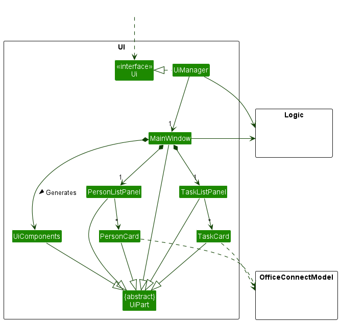
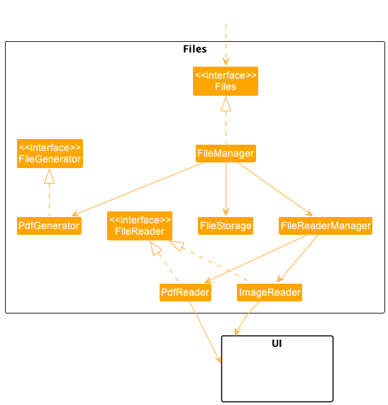

* Table of Contents
{:toc}

--------------------------------------------------------------------------------------------------------------------

## **Acknowledgements**

* {list here sources of all reused/adapted ideas, code, documentation, and third-party libraries -- include links to the original source as well}
* External API: [`pdfbox-app-2.027`](https://pdfbox.apache.org/)
* Reused code from [`AY2223S1-CS2103T-T17-1`](https://github.com/AY2223S1-CS2103T-T17-1/tp/tree/master/src/main/java/seedu/address/ui) for UI design
* Reused code from [`AY2223S1-CS2103T-W11-3`](https://github.com/AY2223S1-CS2103T-W11-3/tp) for UI design
--------------------------------------------------------------------------------------------------------------------

## **Setting up, getting started**

Refer to the guide [_Setting up and getting started_](SettingUp.md).

--------------------------------------------------------------------------------------------------------------------

## **Design**

:bulb: **Tip:** The `.puml` files used to create diagrams in this document can be found in the [diagrams](https://github.com/AY2223S2-CS2103T-W11-4/tp/tree/master/docs/diagrams/) folder. Refer to the [_PlantUML Tutorial_ at se-edu/guides](https://se-education.org/guides/tutorials/plantUml.html) to learn how to create and edit diagrams.

### Architecture

The ***Architecture Diagram*** given above explains the high-level design of the App.

Given below is a quick overview of main components and how they interact with each other.

**Main components of the architecture**

**`Main`** has two classes called [`Main`](https://github.com/AY2223S2-CS2103T-W11-4/tp/blob/master/src/main/java/seedu/address/Main.java) and [`MainApp`](https://github.com/AY2223S2-CS2103T-W11-4/tp/blob/master/src/main/java/seedu/address/MainApp.java). It is responsible for,
* At app launch: Initializes the components in the correct sequence, and connects them up with each other.
* At shut down: Shuts down the components and invokes cleanup methods where necessary.

[**`Commons`**](#common-classes) represents a collection of classes used by multiple other components.

The rest of the App consists of four components.

* [**`UI`**](#ui-component): The UI of the App.
* [**`Logic`**](#logic-component): The command executor.
* [**`Model`**](#model-component): Holds the data of the App in memory.
* [**`Storage`**](#storage-component): Reads data from, and writes data to, the hard disk.
* [**`Files`**](#files-component): Manage the uploaded and created files to the hard disk.

**How the architecture components interact with each other**

The *Sequence Diagram* below shows how the components interact with each other for the scenario where the user issues the command `delete 1`.

Each of the five main components (also shown in the diagram above),

* defines its *API* in an `interface` with the same name as the Component.
* implements its functionality using a concrete `{Component Name}Manager` class (which follows the corresponding API `interface` mentioned in the previous point.

For example, the `Logic` component defines its API in the `Logic.java` interface and implements its functionality using the `LogicManager.java` class which follows the `Logic` interface. Other components interact with a given component through its interface rather than the concrete class (reason: to prevent outside component's being coupled to the implementation of a component), as illustrated in the (partial) class diagram below.

The sections below give more details of each component.

### UI component

The **API** of this component is specified in [`Ui.java`](https://github.com/se-edu/addressbook-level3/tree/master/src/main/java/seedu/address/ui/Ui.java)

The UI consists of a `MainWindow` that is made up of parts e.g.`CommandBox`, `ResultDisplay`, `PersonListPanel`, `StatusBarFooter`, `DetailDisplay`etc. All these, including the `MainWindow`, inherit from the abstract `UiPart` class which captures the commonalities between classes that represent parts of the visible GUI.

The `UI` component uses the JavaFx UI framework. The layout of these UI parts are defined in matching `.fxml` files that are in the `src/main/resources/view` folder. For example, the layout of the [`MainWindow`](https://github.com/se-edu/addressbook-level3/tree/master/src/main/java/seedu/address/ui/MainWindow.java) is specified in [`MainWindow.fxml`](https://github.com/se-edu/addressbook-level3/tree/master/src/main/resources/view/MainWindow.fxml)

The `UI` component,

* executes user commands using the `Logic` component.
* listens for changes to `Model` data so that the UI can be updated with the modified data.
* keeps a reference to the `Logic` component, because the `UI` relies on the `Logic` to execute commands.
* depends on some classes in the `Model` component, as it displays `Person` object residing in the `Model`.

### Logic component

**API** : [`Logic.java`](https://github.com/AY2223S2-CS2103T-W11-4/tp/blob/master/src/main/java/seedu/address/logic/Logic.java)

Here's a (partial) class diagram of the `Logic` component:

How the `Logic` component works:
1. When `Logic` is called upon to execute a command, it uses the `AddressBookParser` class to parse the user command.
1. This results in a `Command` object (more precisely, an object of one of its subclasses e.g., `AddCommand`) which is executed by the `LogicManager`.
1. The command can communicate with the `Model` when it is executed (e.g. to add a person).
1. The result of the command execution is encapsulated as a `CommandResult` object which is returned back from `Logic`.

The Sequence Diagram below illustrates the interactions within the `Logic` component for the `execute("delete 1")` API call.

:information_source: **Note:** The lifeline for `DeleteCommandParser` should end at the destroy marker (X) but due to a limitation of PlantUML, the lifeline reaches the end of diagram.

Here are the other classes in `Logic` (omitted from the class diagram above) that are used for parsing a user command:

How the parsing works:
* When called upon to parse a user command, the `AddressBookParser` class creates an `XYZCommandParser` (`XYZ` is a placeholder for the specific command name e.g., `AddCommandParser`) which uses the other classes shown above to parse the user command and create a `XYZCommand` object (e.g., `AddCommand`) which the `AddressBookParser` returns back as a `Command` object.
* All `XYZCommandParser` classes (e.g., `AddCommandParser`, `DeleteCommandParser`, ...) inherit from the `Parser` interface so that they can be treated similarly where possible e.g, during testing.

### Model component
**API** : [`Model.java`](https://github.com/AY2223S2-CS2103T-W11-4/tp/blob/master/src/main/java/seedu/address/model/Model.java)

The `Model` component,

* stores the address book data i.e., all `Person` objects (which are contained in a `UniquePersonList` object).
* stores the currently 'selected' `Person` objects (e.g., results of a search query) as a separate _filtered_ list which is exposed to outsiders as an unmodifiable `ObservableList<Person>` that can be 'observed' e.g. the UI can be bound to this list so that the UI automatically updates when the data in the list change.
* stores a `UserPref` object that represents the user’s preferences. This is exposed to the outside as a `ReadOnlyUserPref` objects.
* does not depend on any of the other three components (as the `Model` represents data entities of the domain, they should make sense on their own without depending on other components)

:information_source: **Note:** An alternative (arguably, a more OOP) model is given below. It has a `Tag` list in the `AddressBook`, which `Person` references. This allows `AddressBook` to only require one `Tag` object per unique tag, instead of each `Person` needing their own `Tag` objects. 

### Storage component

**API** : [`Storage.java`](https://github.com/AY2223S2-CS2103T-W11-4/tp/blob/master/src/main/java/seedu/address/storage/Storage.java)

The `Storage` component,
* can save both address book data and user preference data in json format, and read them back into corresponding objects.
* inherits from both `AddressBookStorage` and `UserPrefStorage`, which means it can be treated as either one (if only the functionality of only one is needed).
* depends on some classes in the `Model` component (because the `Storage` component's job is to save/retrieve objects that belong to the `Model`)

### Files component
**API** : [`Files.java`](https://github.com/AY2223S2-CS2103T-W11-4/tp/blob/master/src/main/java/seedu/address/files/Files.java)

The `Files` component,
* Multiple file handling capabilities: The Files component is designed to handle various file types, such as PDF and images. 
* It is capable of processing these files, rendering them for display, and managing their storage.
* Inheritance: By implementing both `FileReader` and `FileGenerator` interfaces, 
* the Files component provides a flexible foundation for specialized file handling classes, such as `PdfReader` and `ImageReader`. 
* This modular design allows the component to extend its functionality when needed.
* Dependency on `FileReaderManager` and `FileManager`: The Files component relies on the `FileReaderManager` class to determine which specialized file handler to use based on the input file type. 
* The `FileManager` class, in turn, utilizes the `FileReaderManager` to manage and process different file types effectively.
* Interaction with the UI component: The `PdfReader` and `ImageReader` classes are responsible for rendering the files in a format suitable for display. 
* They return the rendered files to the UI component, which then presents the content to the user.
### Common classes

Classes used by multiple components are in the `seedu.addressbook.commons` package.

--------------------------------------------------------------------------------------------------------------------

## **Implementation**

This section describes some noteworthy details on how certain features are implemented.

### 1.Making appointment
This feature servers as one of the core features of Medimate, so how is it implemented?

This feature is achieved by the following classes:
* `AddAppointmentCommand` - when executed, will add a new appointment to a specified patient
* `AddAppointmentCommandParser` - will parser user's input and return a valid `AddAppointmentCommand` for execution

The format of commandline input is as follows:
`makeApp {patientIndex} /from {startTime} /to {endTime}`

Initially, when the input is received, it is processed by the UI layer, which calls the
logic.execute(input) function and transfers the control to the logic layer. The execute(input)
function in the logic layer then utilizes the `AddressBookParser` to break down the input into tokens,
determine the commandʼs mode and calls relevant commandParser for further parsing. In this feature, specifically, 
`AddAppointmentCommandParser` will be called.

Then, inside this parser, there are mainly three information being parsed:
* patientIndex - parsed by `parserIndex` method in `ParserUtil` class
* startTime - parsed by `parserDate` methond in `ParserUtil` class
* endTime - parsed by `parserDate` methond in `ParserUtil` class

After all these pieces of information is being parserd, the parser class will create a new `AddAppointmentCommand` class
and transfer all information to it for further execution.

Then inside this command class, it will use all the information input by user to create a new patient with all other 
details the same and only change in its `appointment` and calls model manager to substitute previous patient
with the new one by calling `model.setPerson(previousPerson, newPerson)`

Finally, `ModelManager` will be connected to storage and save this change accordingly. Also, UI will detect this change
and refresh the whole patient list with new appointment added.

### 2. Uploading Medical file for a Patient
This feature servers as one of the core features of Medimate, so how is it implemented?

#### Note:
* There are two ways to upload medical files for a patient within the application. 
* Users can either utilize a command (similar to 1.Marking Appointment using UploadFileCommand) or click the `upload button` in the user interface.
* Medical files should be in PDF, JPG, or PNG format, and can contain additional information about the patient, such as medical history, test results, or treatment plans.
* This section will delve deeper into the implementation of the file uploading functionality when the user click `upload button` and calling the `FileManager` object.

This feature is achieved by the following classes:
* `FileManager` - offers an `addFile` method that is invoked by `UploadFileCommand` and the `upload button`
* `FileStorage` - offers an `uploadFile` method that is invoked by `addFile` method in `FileManager`

Initially when user click the `upload button`, FileManger is initialised with the given `Person` Object and `addFile` method is called invoking `uploadFile` method.
* The uploadFile() method uses the `SwingUtilities.invokeLater()` method to ensure that it runs on the `Event Dispatch Thread (EDT)` for proper GUI interaction.
* Within the `invokeLater()` method, a `JFileChooser` object is created and configured using the `configFileChooser()` method. The file chooser is set to allow multiple file selections and filter files based on their extensions: PDF, JPG, JPEG, and PNG.
* The file chooser dialog is displayed, and the user can select multiple files. The method then checks if the user has approved the file selection.
* If the user has approved the file selection, an array of selected files is obtained. The target directory path is created using the `"reports/{username}/"` format, where `{username}` is replaced with the username of the current user.
* If the file meets the requirements, it is copied to the target directory. `Existing files with the same name in the target directory are replaced`. If a file has an `unsupported extension` or `exceeds the maximum file size`, an `IOException` is thrown with a relevant error message.
* After successfully uploading all the allowed files, a `success message` is displayed to the user through a `JOptionPane`.

### 3. Create medical certificate PDF file

#### Note:
* There are two ways to create medical certificate for a patient within the application.
  Users can either utilize a command (similar to 1.Marking Appointment using CreateCommand ) or click the `create button` in the user interface.
* PDF file generated will be a copy of [`MC.pdf`](https://github.com/AY2223S2-CS2103T-W11-4/tp/blob/master/src/main/resources/MC.pdf).
* External API: [`pdfbox-app-2.027`](https://pdfbox.apache.org/) used to read and write [`MC.pdf`](https://github.com/AY2223S2-CS2103T-W11-4/tp/blob/master/src/main/resources/MC.pdf).
* This section will delve deeper into the implementation of the medical certificate creation functionality when the user click `create button` filling up with correct information and called the `FileManager` object.

This feature is achieved by the following classes:
* `FileManager` - offers an `generateMc` method that is invoked by `CreateCommand` and the `create button`
* `PdfGenerator` - offers an `generate` method that is invoked by `generateMC` method in `FileManager`

After the user click `create button` and filled up with the correct information (doctor name, medical condition, and days), FileManger is initialised with the given `Person` Object and `generateMc` method is called invoking `generate` method.
* The generate method creates a customized Medical Certificate (MC) PDF for a patient by loading a template, filling in the form fields, saving the filled form with a unique filename, updating the patient's medical condition, and displaying a success message.

## **Documentation, logging, testing, configuration, dev-ops**

* [Documentation guide](Documentation.md)
* [Testing guide](Testing.md)
* [Logging guide](Logging.md)
* [Configuration guide](Configuration.md)
* [DevOps guide](DevOps.md)

--------------------------------------------------------------------------------------------------------------------

## **Appendix: Requirements**

### Product scope

**Target user profile**:

* private doctor or doctor's receptionist
* requires to manage large amount of patients details
* wants to organise and access patients data easily
* prefer desktop apps over other types
* prefers typing to mouse interactions
* is reasonably comfortable using CLI apps

**Value proposition**:
The problem addressed is to assist in digitizing patient details. By converting traditional paper records into
electronic ones, healthcare providers can easily and efficiently organize and manage patient data.
This not only saves time and reduces the risk of errors, but it also makes it easier to retrieve and update the
information when needed.
Additionally, with the use of electronic scheduling systems, healthcare providers can easily schedule and reschedule
appointments, improving the overall experience for both patients and staff.
Overall, digitizing patient details helps to improve the quality of care and make the healthcare delivery process more
streamlined and efficient.

### User stories

Priorities: High (must have) - `* * *`, Medium (nice to have) - `* *`, Low (unlikely to have) - `*`

| Priority   | As a …​ | I want to …​                                                                       | So that I can…​                                                                                                                |
|------------|---------|------------------------------------------------------------------------------------|--------------------------------------------------------------------------------------------------------------------------------|
| `* * *`    | User    | Record a person's age                                                              | Keep track of their basic profile                                                                                              |
| `* * *`    | User    | Record a person's gender                                                           | Assign the male or female doctor when necessary                                                                                |
| `* * *`    | User    | Record a person's phone number                                                     | Contact them conveniently                                                                                                      |
| `* * *`    | User    | Record a person's email/address                                                    | Efficiently manage the communication and consultation process with patients                                                    |
| `* * *`    | User    | Give patients zero or more tags                                                    | Easily classify different groups of patients by their illness, medication, and other information to serve their specific needs |
| `* * *`    | User    | Add a certain medical condition and add the relevant patients in the same category | Organize patients based on their medical conditions                                                                            |
| `* * *`    | User    | Add new types of medications and assign them to patients                           | Keep track of patients' medications and prescriptions                                                                          | 
| `* * *`    | User    | Generate Medical Certificate for a patient                                         | Quickly provide comprehensive PDF medical certificate during consultation                                                      |
| `* * *`    | User    | Upload local medical document of a patient                                         | Efficiently manage each patient files in a centralized digital location                                                        |
| `* * *`    | User    | View patient's medical documents                                                   | Quickly find the specific information needed from the patient for further diagnosis and treatment                              |
| `* * *`    | User    | List all current contacts                                                          | View general information, update list, and add filters/classifications                                                         |
| `* * *`    | User    | Rank patients by schedule, name, and medical conditions                            | Manage consultation time and content efficiently                                                                               | 
| `* * *`    | User    | Search for a medication and get the number of patients taking it                   | Determine how much medication to order for the clinic                                                                          | 
| `* * *`    | User    | Edit patient information (phone number, name, location, medical condition)         | Update patient records                                                                                                         | 
| `* * *`    | User    | Edit a patient contact                                                             | Modify patient contact information                                                                                             | 
| `* * *`    | User    | Schedule appointments                                                              | Book and manage appointments to reduce workload                                                                                | 
| `* * *`    | User    | Update appointment timing                                                          | Modify appointment times                                                                                                       | 
| `* * *`    | User    | Mark appointments as done                                                          | Indicate when appointments are completed                                                                                       | 
| `* *`      | User    | Edit available medication amount                                                   | Maintain inventory and stock levels                                                                                            | 
| `* * *`    | User    | Search for patients by name                                                        | Locate patient records by name                                                                                                 | 
| `* * *`    | User    | Search for patients by phone number                                                | Locate patient records by phone number                                                                                         | 
| `* * *`    | User    | Search for patients by location                                                    | Locate patients by location                                                                                                    | 
| `* * *`    | User    | Search for patients by medical condition                                           | Locate patients by medical condition                                                                                           | 
| `* * *`    | User    | Search for appointments by date                                                    | View appointments on a specific date                                                                                           | 
| `* * *`    | User    | Access help function                                                               | Get information on using the software                                                                                          | 
| `* * *`    | User    | Access patient health information                                                  | View patient medical history                                                                                                   | 
| `* * *`    | User    | Access patient prescriptions                                                       | View patient medication history                                                                                                | 
| `*`        | User    | Check available medication stock                                                   | Determine when to order more medication                                                                                        | 
| `*`        | User    | Clear all contacts                                                                 | Delete all patient records                                                                                                     | 
| `*`        | User    | Clear contacts by tags                                                             | Delete patient records based on tags                                                                                           | 
| `*`        | User    | Clear contacts by location                                                         | Delete patient records based on location                                                                                       | 
| `***`      | User    | Delete medication                                                                  | Remove a medication from the system                                                                                            | 
| `***`      | User    | Delete appointment                                                                 | Remove an appointment from the system                                                                                          | 
| `***`      | User    | Delete a patient file                                                              | Remove outdated or wrongly updated file from the system                                                                        |
*{More to be added}*

### Use cases

(For all use cases below, the **System** is the `AddressBook` and the **Actor** is the `user`, unless specified otherwise)

**Use case: Delete a patient**

**MSS**

1.  User requests to list patients.
2.  Medimate shows a list of patients.
3.  User requests to delete a specific patient in the list.
4.  Medimate deletes the patient.

    Use case ends.

**Extensions**

* 2a. The list is empty.

  Use case ends.

* 3a. The given index is invalid.
  * 3a1. Medimate shows an error message.

    Use case resumes at step 2.

**Use case: Edit a patient particulars**

**MSS**

1. User requests to Edit a patient details.
2. MediMate asks for type of details.
3. User chooses the type and enters the new details.
4. MediMate records the details.
   
   Use case ends.

**Extensions**

* 1a. User enters wrong input format. 
  * 1a1. Medimate gives correct format and asks user to input again.
  * 1a2. User enters the input with correct format.
    
    Use Case ends.
  
* 1b. Patient does not exist.
    * 1b1. Medimate reminds user to check for patient name.
    * 1b2. User enters the input with correct format
      
      Use Case ends.
      
* 3a. User enters Invalid type.
    * 3a1. Medimate gives the available types and asks user to input again.
      
      Use Case ends.

**Use case: Find a patient particulars**

**MSS**

1. User requests to find a patient using her/his details.
2. Medimate asks for the type of details.
3. User chooses the type of details.
4. Medimate displays the patient.
   
   Use case ends.

**Extensions**

* 1a. User enters wrong input format.
    * 1a1. Medimate gives correct format and asks user to input again.
    * 1a2. User enters the input with correct format.
      
      Use Case ends.

* 1b. Patient does not exist.
    * 1b1. Medimate reminds user to check for patient name.
    * 1b2. User enters the input with correct format. 
   
      Use Case ends.

*  3a. User chooses Invalid type
   * 3a1. Medimate gives the available types and asks user to input again
     Use Case ends.

**Use case:  Add a patient**

**MSS**

1. User requests to add a new patient.
2. user enters the required patient information, including name, phone number, email, and address.
3. user submits the patient information.
4. Medimate adds a patient and stores the information in the database.

   Use Case ends.

**Extensions**

* 2a. user enters medical condition, age, appointment time, NRIC fields optionally.
    * 2a1. user submits the patient information.
    * 2a2. Medimate adds a patient and stores the information in the database.

      Use case ends.

* 3a. User input format is wrong.
    * 3a1. Medimate asks User for another correct input of the patient’s information.
    * 3a2. User inputs patient’s information with the correct format.

      Use Case resumes at step 2.
  
**Use case: View patients' document**

**MSS**

1. User requests to view patient's file.
2. Medimate retrieves the correspondent PDF document.
3. Medimate displays the PDF document to the user in a new window.

   Use case ends.

* 1a. User enters wrong input format.
    * 1a1. Medimate gives correct format and ask user to input again.
    * 1a2. User inputs a new line of correct format.

      Use Case resumes at step 2.

* 1b. Patient does not exist.
    * 1b1. Medimate gives error message to remind user to check for patient index.
    * 1b2. User inputs valid patient index with correct format.
  
      Use Case resumes at step 2.

*  2a. File does not exist.
    * 2a1. Medimate gives error message to remind user to check for file index.
    * 2a2. User inputs valid file index with correct patient index and format.
     
      Use Case resumes at step 3.

**Use case:  List patients by name**

**MSS**

1. User requests to list all patients based on their names.
2. Medimate displays a list of all patients sorted in order based on names.
   
   Use case ends.

**Extensions**

* 1a. The list is empty.

  Use case ends.

**Use case:  Upload reports for a patient**

**MSS**

1. User requests to upload reports for given patient.
2. Medimate allows user to choose files.
3. User uploads those selected files.
4. Medimate stores the uploaded files at patient's directory.

   Use Case ends.

**Extensions**

* 1a. User input format is wrong.
    * 1a1.  Medimate asks User for another correct input upload.
    * 1a2. User inputs a new line of upload format.

      Use Case resumes at step 2.
  
* 3a. User uploads unacceptable types of files
    * 3a1. Medimate informs the user invalid file type can not be uploaded.
  
      Use Case ends.

**Use case:  Generate MCs for given patient**

**MSS**

1. User requests to generate MC for given patients.
2. Medimate generates MC with user desired information and stores at patient directory.

   Use case ends.

**Extensions**

* 1a. The list is empty.

  Use case ends.

* 1b. User enters the wrong input format (eg: doctor name/medical condition exceeds length, invalid duration...)
    * 1a1. Medimate informs the user the use of incorrect format.
    * 1a2. User inputs valid format.
    
      Use case resumes at step 2.

**Use case:  Display the detailed information of the patient**

**MSS**

1. User requests to display a specific patient's detailed information.
2. Medimate displays the patient's detailed information in the detail display pane.

   Use case ends.

**Extensions**

* 1a. Index of the User input is out of bound of the current Person List.
  * 1a1.  Medimate asks the user for another correct input of the index.
  * 1a2.  User inputs a new valid index.

    Use Case resumes at step 2.

**Use case: Make an appointment for a patient**

**MSS**
1. User requests to make an appointment for the selected patient.
2. Medimate asks for the date, starting time and ending time for the appointment.
3. User inputs the date, starting time and ending time for the appointment.
4. Medimate makes the appointment for the patient.

   Use case ends.

**Extensions**

* 3a. Starting time is before current time.
  * 3a1. Medimate asks User for new valid appointment time.
  * 3a2. User inputs valid appointment time.
    Use Case resumes at step 4.

* 3b. Starting time is after ending time.
  * 3b1. Medimate asks User for new valid appointment time.
  * 3b2. User inputs valid appointment time.
    Use Case resumes at step 4.

* 3c. User input appointment time has clash with the doctor's schedule.
  * 3c1. Medimate asks User for new valid appointment time.
  * 3c2. User inputs valid appointment time.
    Use Case resumes at step 4.

**Use case: Check the doctor's availability on the given date**

**MSS**
1. User requests to check the doctor's availability on the given date.
2. Medimate lists all the doctor's current appointments on this day.

   Use case ends.

* 1a. There is no appointment on this date.
  Use case ends.

**Use case: Mark an appointment with a patient as done**

**MSS**
1. User requests to mark the appointment as done.
2. Medimate marks the appointment as done and resets to no-appointment status.

   Use case ends.

### Non-Functional Requirements

1.  Should work on any _mainstream OS_ as long as it has Java `11` or above installed.
2.  Should be able to hold up to 1000 patients without a noticeable sluggishness in performance for typical usage.
3.  A user with above average typing speed for regular English text (i.e. not code, not system admin commands) should be able to accomplish most of the tasks faster using commands than using the mouse.

*{More to be added}*

### Glossary

* **Mainstream OS**: Windows, Linux, Unix, OS-X
* **Private contact detail**: A contact detail that is not meant to be shared with others

--------------------------------------------------------------------------------------------------------------------

## **Appendix: Instructions for manual testing**

Given below are instructions to test the app manually.

:information_source: **Note:** These instructions only provide a starting point for testers to work on;
testers are expected to do more *exploratory* testing.

### Launch and shutdown

1. Initial launch

   1. Download the jar file and copy into an empty folder

   1. Double-click the jar file Expected: Shows the GUI with a set of sample contacts. The window size may not be optimum.

1. Saving window preferences

   1. Resize the window to an optimum size. Move the window to a different location. Close the window.

   1. Re-launch the app by double-clicking the jar file. 
       Expected: The most recent window size and location is retained.

### Adding a patient

1. Adding a patient while all patients are being shown

   1. Prerequisites: List all patients using the list command. Multiple recipes in the list.

   2. Test case: add n/John Doe p/98765432 e/johnd@example.com a/John street, block 123, #01-01
      Expected: John Doe is added into the list. Success message shown in the result display.

   3. Test case: add n/James Ho p/22224444 e/jamesho@example.com a/123, Clementi Rd, 1234665 ag/20 n/Flu nric/S9524050Y t/friend t/colleague
      Expected: James Ho is added. Success message shown in the result display.
   
   4. Test case: add n/James Lu p/22224444 e/example.com a/123, Clementi Rd, 1234665 ag/20 n/Flu nric/S9524050Y t/friend t/colleague
      Expected: No patient is added. Error message shown in the result display indicating wrong email format.
   
### Editing a patient

1. Editing a recipe while all recipes are being shown

   1. Prerequisites: List all patients using the list command. Multiple patients in the list.

   2. Test case: edit 1 n/James Lee e/jameslee@example.com 
      Expected: The name of the first patient is changed to James Lee and its email changed to jameslee@example.com. Success message shown in the result display.
   
   3. Test case: edit 1 Expected: The first patient remains the same. Error message shown in the result display.
    
   4. Test case: edit 0 t/friend Expected: No patient is edited. Error message shown in the result display.

### Deleting a patient

1. Deleting a patients while all persons are being shown

   1. Prerequisites: List all persons using the `list` command. Multiple persons in the list.

   2. Test case: `delete 1` 
      Expected: An alert window will prompt up and ask user to confirm this deletion. Once confirmed, the first patient is deleted from the list. Details of the deleted contact shown in the status message. Timestamp in the status bar is updated.

   3. Test case: `delete 0` 
      Expected: No person is deleted. Error details shown in the status message. Status bar remains the same.

   4. Other incorrect delete commands to try: `delete`, `delete x`, `...` (where x is larger than the list size) 
      Expected: Similar to previous.

### Saving data

1. Dealing with corrupted data files

   1. Open data/addressbook.json in the directory where Medimate is located at.
   2.  On line 4, edit the word phone to phon.
   3.  Relaunch Medimate.jar.
       Expected: Data is corrupted and the system will recognise the mismatch. Medimate starts with an empty data file.

2. Dealing with missing data files

   1. Delete the file addressbook.json in the data directory where Medimate is located at.
   2. Relaunch Medimate.jar.
   3. Expected: Data file is missing. Medimate starts with an initial data file.
