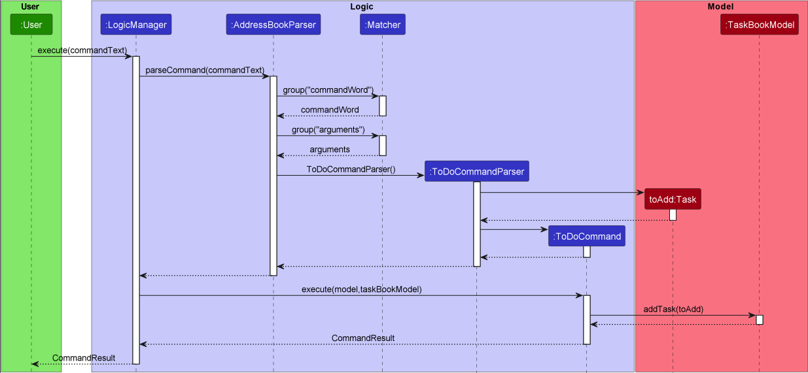
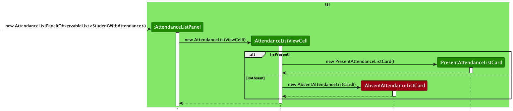

# Pied Piper

Pied Piper is a user-friendly task management application tailored for current and future university student leaders.
The app helps them stay organised and prepare for real-world situations by helping them manage project groups, and
simulate the real world review system. Key features include creating tasks, assigning tasks to team members, setting
due dates, rating completed tasks out of 5, and providing feedback through comments. The ability to seamlessly toggle
between a person list and task list also helps team leaders easily identify each team members' roles and their assigned
task to complete. Ideal for personal projects and team collaboration, Pied Piper aims to improve productivity and equip
university students with valuable skills for their future careers.

Some of our main features:
- **Adding tasks with or without due dates.**
- **Adding team members and assigning them to created tasks.**
- **Mark tasks as complete and give a rating to gauge the performance of each member.**
- **Review each member's overall performances based on the tasks completed.**

This user guide provides a broad overview of how the various features work and how to use them properly. We hope you
have fun using Pied Piper and may all your future endeavors be elevated with our product!

---

# Table of Contents
- [1. Acknowledgements](#1-acknowledgements)
- [2. Setting up, getting started](#2-setting-up-getting-started)
- [3. Design](#3-design)
  - [3.1 Architecture](#31-architecture)
  - [3.2 UI component](#32-ui-component)
  - [3.3 Logic component](#33-logic-component)
  - [3.4 Model component](#34-model-component)
  - [3.5 Storage component](#35-storage-component)
  - [3.6 Common classes](#36-common-classes)
- [4. Implementation](#4-implementation)
  - [4.1 Feature implementations](#41-feature-implementations)
    - [4.1.1 Add task feature](#411-add-task-feature)
    - [4.1.2 Add person feature](#412-add-person-feature)
    - [4.1.3 Delete/deletetask feature](#413-deletedeletetask-feature)
    - [4.1.4 Assign Task feature](#414-assign-task-feature)
    - [4.1.5 Mark/Unmark Task feature](#415-markunmark-task-feature)
    - [4.1.6 Review feature](#416-review-feature)
  - [4.2 Future features](#42-proposed-implementation-of-future-features)
- [5. Other guides](#5-documentation-logging-testing-configuration-dev-ops)
- [6. Appendix: Requirements](#6-appendix-requirements)
  - [6.1 Product scope](#61-product-scope)
  - [6.2 User stories](#62-user-stories)
  - [6.3 Use cases](#63-use-cases)
  - [6.4 Non-functional requirements](#64-non-functional-requirements)
  - [6.5 Glossasry](#65-glossary)
- [7. Manual testing](#7-appendix-instructions-for-manual-testing)
  - [7.1 Launch and shutdown](#71-launch-and-shutdown)
  - [7.2 Deleting a person](#72-deleting-a-person)
  - [7.3 Clear people data](#73-clearing-people-data)
  - [7.4 Edit a person](#74-editing-a-person)
---

# 1. Acknowledgements

* Pied Piper is a brownfield project that builds on [AB-3](https://se-education.org/addressbook-level3/).
* This project is a part of the [se-education.org](https://se-education.org) initiative.

The libraries used are as follows:
- [Jackson](https://github.com/FasterXML/jackson) was used for storage.
- [JavaFX](https://openjfx.io/) was used to render the UI.
- [PlantUML](https://plantuml.com/) was used to create UML diagrams.
- [JUnit](https://junit.org/junit5/) was used to make test scripts for testing.

[↑ Return to table of contents](#table-of-contents)

---

# 2. Setting up, getting started

Refer to the guide [_Setting up and getting started_](SettingUp.md).

[↑ Return to table of contents](#table-of-contents)

---

# 3. Design

:bulb: **Tip:** The `.puml` files used to create diagrams in this document can be found in the [diagrams](https://github.com/se-edu/addressbook-level3/tree/master/docs/diagrams/) folder. Refer to the [_PlantUML Tutorial_ at se-edu/guides](https://se-education.org/guides/tutorials/plantUml.html) to learn how to create and edit diagrams.

## 3.1 Architecture

The ***Architecture Diagram*** given above explains the high-level design of the App.

Given below is a quick overview of main components and how they interact with each other.

**Main components of the architecture**

**`Main`** has two classes called [`Main`](https://github.com/AY2223S2-CS2103T-W15-3/tp/tree/master/src/main/java/seedu/address) and [`MainApp`](https://github.com/AY2223S2-CS2103T-W15-3/tp/blob/master/src/main/java/seedu/address/MainApp.java). It is responsible for,
* At app launch: Initializes the components in the correct sequence, and connects them up with each other.
* At shut down: Shuts down the components and invokes cleanup methods where necessary.

[**`Commons`**](#36-common-classes) represents a collection of classes used by multiple other components.

The rest of the App consists of four components.

* [**`UI`**](#32-ui-component): The UI of the App.
* [**`Logic`**](#33-logic-component): The command executor.
* [**`Model`**](#34-model-component): Holds the data of the App in memory.
* [**`Storage`**](#35-storage-component): Reads data from, and writes data to, the hard disk.

**How the architecture components interact with each other**

The *Sequence Diagram* below shows how the components interact with each other for the scenario where the user issues the command `delete 1`.

Each of the four main components (also shown in the diagram above),

* defines its *API* in an `interface` with the same name as the Component.
* implements its functionality using a concrete `{Component Name}Manager` class (which follows the corresponding API `interface` mentioned in the previous point.

For example, the `Logic` component defines its API in the `Logic.java` interface and implements its functionality using the `LogicManager.java` class which follows the `Logic` interface. Other components interact with a given component through its interface rather than the concrete class (reason: to prevent outside component's being coupled to the implementation of a component), as illustrated in the (partial) class diagram below.

The sections below give more details of each component.

[↑ Return to start of section](#3-design)

[↑ Return to table of contents](#table-of-contents)

## 3.2 UI component

The **API** of this component is specified in [`Ui.java`](https://github.com/AY2223S2-CS2103T-W15-3/tp/blob/master/src/main/java/seedu/address/ui/Ui.java)

The UI consists of a `MainWindow` that is made up of parts e.g.`CommandBox`, `ResultDisplay`, `PersonListPanel`, `StatusBarFooter` etc. All these, including the `MainWindow`, inherit from the abstract `UiPart` class which captures the commonalities between classes that represent parts of the visible GUI.

The `UI` component uses the JavaFx UI framework. The layout of these UI parts are defined in matching `.fxml` files that are in the `src/main/resources/view` folder. For example, the layout of the [`MainWindow`](https://github.com/se-edu/addressbook-level3/tree/master/src/main/java/seedu/address/ui/MainWindow.java) is specified in [`MainWindow.fxml`](https://github.com/se-edu/addressbook-level3/tree/master/src/main/resources/view/MainWindow.fxml)

The `UI` component,

* executes user commands using the `Logic` component.
* listens for changes to `Model` data so that the UI can be updated with the modified data.
* keeps a reference to the `Logic` component, because the `UI` relies on the `Logic` to execute commands.
* depends on some classes in the `Model` component, as it displays `Person` object residing in the `Model`.

**Note**:
- Above describes the UI component for the `PersonList`.
- For our `TaskList`, the way it works is the same, but `Model` is changed to `TaskBookModel`, and `Person` is changed to `Task`.

[↑ Return to start of section](#3-design)

[↑ Return to table of contents](#table-of-contents)

## 3.3 Logic component

**API** : [`Logic.java`](https://github.com/AY2223S2-CS2103T-W15-3/tp/blob/master/src/main/java/seedu/address/logic/Logic.java)

Here's a (partial) class diagram of the `Logic` component:

How the `Logic` component works:
1. When `Logic` is called upon to execute a command, it uses the `AddressBookParser` class to parse the user command.
2. This results in a `Command` object (more precisely, an object of one of its subclasses e.g., `AddCommand`) which is executed by the `LogicManager`.
3. The command can communicate with the `Model` when it is executed (e.g. to add a person).
4. The result of the command execution is encapsulated as a `CommandResult` object which is returned from `Logic`.

The Sequence Diagram below illustrates the interactions within the `Logic` component for the `execute("delete 1")` API call.

:information_source: **Note:** The lifeline for `DeleteCommandParser` should end at the destroy marker (X) but due to a limitation of PlantUML, the lifeline reaches the end of diagram.

Here are the other classes in `Logic` (omitted from the class diagram above) that are used for parsing a user command:

How the parsing works:
* When called upon to parse a user command, the `AddressBookParser` class creates an `XYZCommandParser` (`XYZ` is a placeholder for the specific command name e.g., `AddCommandParser`) which uses the other classes shown above to parse the user command and create a `XYZCommand` object (e.g., `AddCommand`) which the `AddressBookParser` returns back as a `Command` object.
* All `XYZCommandParser` classes (e.g., `AddCommandParser`, `DeleteCommandParser`, ...) inherit from the `Parser` interface so that they can be treated similarly where possible e.g, during testing.

**Note**:
- Our app also has a `TaskBook`, which works the same as `AddressBook`, except that it interacts with the classes that handle tasks, such as `TaskBookModel` and `DeleteTaskCommandParser`.

[↑ Return to start of section](#3-design)

[↑ Return to table of contents](#table-of-contents)

## 3.4 Model component
**API** : [`Model.java`](https://github.com/AY2223S2-CS2103T-W15-3/tp/blob/master/src/main/java/seedu/address/model/Model.java)

**API** : [`TaskBookModel.java`](https://github.com/AY2223S2-CS2103T-W15-3/tp/blob/master/src/main/java/seedu/address/model/TaskBookModel.java)

The `Model` component,

* stores all `Person` objects (which are contained in a `UniquePersonList` object).
* stores the currently 'selected' `Person` objects (e.g., results of a search query) as a separate _filtered_ list which is exposed to outsiders as
an unmodifiable `ObservableList<Person>` that can be 'observed' e.g. the UI can be bound to this list so that the UI automatically updates when the data in the list change.
* stores a `UserPref` object that represents the user’s preferences. This is exposed to the outside as a `ReadOnlyUserPref` objects.
* does not depend on any of the other three components (as the `Model` represents data entities of the domain, they should make sense on their own
without depending on other components)

:information_source: **Note:**Tasks are handled in a similar way in the `TaskBookModel` component. It interacts with components like `UniqueTaskList` and is 'observed' as an unmodifiable `ObservableList<Task>`.

:information_source: **Note:** An alternative (arguably, a more OOP) model is given below. It has a `Role` list in Pied Piper, which `Person` references. This allows `Pied Piper` to only require one `Role` object per unique role, instead of each `Person` needing their own `Role` objects. 

[↑ Return to start of section](#3-design)

[↑ Return to table of contents](#table-of-contents)

##  3.5 Storage component

**API** : [`Storage.java`](https://github.com/AY2223S2-CS2103T-W15-3/tp/blob/master/src/main/java/seedu/address/storage/Storage.java)

The `Storage` component,
* can save both address book data and user preference data in json format, and read them back into corresponding objects.
* inherits from both `AddressBookStorage`, `TaskStorage` and `UserPrefStorage`, which means it can be treated as either one (if only the functionality of only one is needed).
* depends on some classes in the `Model` component (because the `Storage` component's job is to save/retrieve objects that belong to the `Model`)

[↑ Return to start of section](#3-design)

[↑ Return to table of contents](#table-of-contents)

## 3.6 Common classes

Classes used by multiple components are in the `seedu.addressbook.commons` package.

[↑ Return to start of section](#3-design)

[↑ Return to table of contents](#table-of-contents)

---

# 4. Implementation

This section describes some noteworthy details on how certain features are implemented.

## 4.1 Feature implementations

### 4.1.1 Add Task feature

The implementation of the add task function is facilitated by `LogicManager`. It takes user input depending on the task user wants to add. 
- For a `todo` task, the user input consists of 2 arguments, the command word being "todo". The second argument is a description of the task.
- For a `deadline` task, the user input consists of 3 arguments, the command word being "deadline". The second argument is a description of the task, and the third argument is the deadline of the task.
- For an `event` task, the user input consists of 4 arguments, the command word being "event". The second argument is a description of the task, the third argument is the start date of the task, and the fourth argument is the end date of the task.

The format is as follows:
- `todo task/TASK_DESCRIPTION`
- `deadline task/TASK_DESCRIPTION by/DEADLINE`
- `event task/TASK_DESCRIPTION from/START_DATE to/END_DATE`

Given below is an example scenario and how the adding task function works at each step.

Step 1. The user executes `todo task/organise pantry` command to add the task in Pied Piper. The command is read by `LogicManager`, which parses the user's input into a `commandText`.

Step 2. `LogicManager` then calls `parseCommand` on the commandText in `AddressBookParser`.

Step 3. `AddressBookParser` then uses `Matcher` to group the commandText into `commandWord` and `arguments`.

Step 4. A `ToDoCommandParser` is created, which generates a new `toAdd:Task` and a new `ToDoCommand`.

Step 5. `LogicManager` then calls `execute` in `ToDoCommand`, which carries out the addition if the task is valid. It then returns a `CommandResult` to be displayed to the user to acknowledge whether the addition has taken place.

<i>Similarly, the above implementation applies to `deadline` and `event` tasks but with different arguments.</i>

:information_source: **Note:**The command can only work if a task with the same description is not already present in Pied Piper. Additionally, the above implmentation comes with the `edittask` feature, which allows the user to edit the details of a task in the task book.

The following sequence diagram shows how the addition operation works:

[↑ Return to start of section](#4-implementation)

[↑ Return to table of contents](#table-of-contents)

### 4.1.2 Add Person feature

The implementation of the add person function is facilitated by `LogicManager`. It takes user input as 5 arguments, the command word being either `add`. The second argument is the `name`, the third argument is the `phone number`, the fourth argument is the `email`, and the fifth argument is the `address`. The `role` argument is optional and can be added by adding the argument `r/ROLE`.

The format is as follows:
- `add n/NAME p/PHONE e/EMAIL a/ADDRESS [r/ROLE]`

Given below is an example scenario and how the adding person function works at each step.

Step 1. The user executes `add n/Jane Roe p/98123456 e/janer@nus.com a/Jane street, block 321 r/Member` command to add the person in Pied Piper address book. The command is read by `LogicManager`, which parses the user's input into a `commandText`.

Step 2. `LogicManager` then calls `parseCommand` on the commandText in `AddressBookParser`.

Step 3. `AddressBookParser` then uses `Matcher` to group the commandText into `commandWord` and `arguments`.

Step 4. A `AddCommandParser` is created, which generates a new `toAdd:Person` and a new `AddCommand`.

Step 5. `LogicManager` then calls `execute` in `AddCommand`, which carries out the addition if the person details aer valid. It then returns a `CommandResult` to be displayed to the user to acknowledge whether the addition has taken place.

:information_source: **Note:**The command can only work if a task with the same details is not already present in Pied Piper. Additionally, the above implmentation comes with the `edit` feature, which allows the user to edit the details of a person in the address book.

The following sequence diagram shows how the addition operation works:

[↑ Return to start of section](#4-implementation)

[↑ Return to table of contents](#table-of-contents)

### 4.1.3 Delete/deletetask feature

The implementation of the delete/deletetask function is facilitated by `LogicManager`. It takes user input as 2 arguments, the command word being either `delete` or `deletetask`, depending on whether the user wants to delete a person or task respectively. The second argument is an index, denoting the index of the person or task the user wishes to delete.

The format is as follows:
- `delete PERSON_INDEX`
- `deletetask TASK_INDEX`

Given below is an example scenario and how the delete function works at each step.

Step 1. The user executes `deletetask 1` command to delete the 5th task in Pied Piper. The command is read by `LogicManager`, which parses the user's input into a `commandText`.

Step 2. `LogicManager` then calls `parseCommand` on the commandText in `AddressBookParser`.

Step 3. `AddressBookParser` then uses `Matcher` to group the commandText into `commandWord` and `arguments`.

Step 4. A `DeleteTaskCommandParser` is created, which generated a new `DeleteTaskCommand`.

Step 5. `LogicManager` then calls `execute` in `DeleteTaskCommand`, which carries out the deletion if the task exists. It then returns a `CommandResult` to be displayed to the user to acknowledge whether the deletion has taken place.

:information_source: **Note:**The command can only work if there is at least 1 person or task present in Pied Piper, and the specified index must not be greater than the index of the last item on the list.
In case of deleting a person, all the tasks assigned to that particular person must be handled (unassigned). The same sequence as above applies to the deletion of a person from address book, but the following classes are different:
1. `DeleteTaskCommandParser` &rarr; `DeleteCommandParser`
2. `DeleteTaskCommand` &rarr; `DeleteCommand`

The following sequence diagram shows how the delete operation works:

[↑ Return to start of section](#4-implementation)

[↑ Return to table of contents](#table-of-contents)

### 4.1.4 Assign Task feature

The implementation of the assign function is facilitated by `LogicManager`. It takes user input as 3 arguments, 
the command word being `assign`. The second argument is an task index, denoting the index of task the user wishes to assign.
The third argument is an person index, denoting the index of the person the task is supposed to be assigned.

The format is as follows:
- `assign t/TASK_INDEX i/PERSON_INDEX`

Given below is an example scenario and how the assign function works at each step.

Step 1. The user executes `assign t/1 i/2` command to assign the first task in Pied Piper to second person in the address book. 
The command is read by `LogicManager`, which parses the user's input into a `commandText`.

Step 2. `LogicManager` then calls `parseCommand` on the commandText in `AddressBookParser`.

Step 3. `AddressBookParser` then uses `Matcher` to group the commandText into `commandWord` and `arguments`.

Step 4. A `AssignTaskCommandParser` is created, which generated a new `AssignTaskCommand`.

Step 5. `LogicManager` then calls `execute` in `AssignTaskCommand`, which carries out the functionality of the command.
This method creates a new `Task` object with the same description as the task to be assigned, but with the person assigned to it. 
This new instance of `Task` is then replaced with the existing instance in the `UniqueTaskList` in `TaskBook`. 
It then returns a `CommandResult` to be displayed to the user to acknowledge whether the assignment has taken place.

:information_source: **Note:**Multiple tasks can be assigned to a single person. 
The command can only work if the person to be assigned has been given a role. 

The following sequence diagram shows how the assignment operation works:

[↑ Return to start of section](#4-implementation)

[↑ Return to table of contents](#table-of-contents)

### 4.1.5 Mark/Unmark Task feature

The implementation of the mark function is facilitated by `LogicManager`. It takes user input as 3 arguments, 
the command word being `mark`. The second argument is an task index, denoting the index of task the user wishes to mark as complete.
The third argument is an score, denoting the score of the task alloted by the leader.
 
On the other hand, the implementation of the unmark function takes user input as 2 arguments, 
the command word being `unmark`. The second argument is an task index, denoting the index of task the user wishes to mark as incomplete.

The format is as follows:
- `mark t/TASK_INDEX s/PERFORMANCE_SCORE`
- `unmark t/TASK_INDEX`

Given below is an example scenario and how the mark function works at each step.

Step 1. The user executes `mark t/1 s/3` command to mark the first task in Pied Piper as complete with a score of 3. 
The command is read by `LogicManager`, which parses the user's input into a `commandText`.

Step 2. `LogicManager` then calls `parseCommand` on the commandText in `AddressBookParser`.

Step 3. `AddressBookParser` then uses `Matcher` to group the commandText into `commandWord` and `arguments`.

Step 4. A `MarkCommandParser` is created, which generated a new `MarkCommand`.

Step 5. `LogicManager` then calls `execute` in `MarkCommand`, which carries out the functionality of the command.
This method creates a new `Task` object with the same description as the task to be marked, but with the status marked as complete.
This new instance of `Task` is then replaced with the existing instance in the `UniqueTaskList` in `TaskBook`. 
It then returns a `CommandResult` to be displayed to the user to acknowledge whether the task has been marked as complete.

:information_source: **Note:**Any task cannot be marked if it not assigned to a person. Additionally, the user can mark the task again to give a different score. The score will be updated to the new score.
The implemention of the unmark function is similar to the mark function, except that the status of the task is marked as incomplete.

The following sequence diagram shows how the mark/unmark operation works:

[↑ Return to start of section](#4-implementation)

[↑ Return to table of contents](#table-of-contents)

### 4.1.6 Review feature

The implementation of the mark function is facilitated by `LogicManager`. It takes user input as 1 arguments, 
the command word being `review`.

The format is as follows:
- `review`

Given below is an example scenario and how the review function works at each step.

Step 1. The user executes `review` command to mark the first task in Pied Piper as complete with a score of 3. 
The command is read by `LogicManager`, which parses the user's input into a `commandText`.

Step 2. `LogicManager` then calls `parseCommand` on the commandText in `AddressBookParser`.

Step 4. A `ReviewCommand` is created.

Step 5. `LogicManager` then calls `execute` in `ReviewCommand`, which carries out the functionality of the command.
This method goes through the `UniqueTaskList` in `TaskBook` and checks for any tasks that are marked as complete, or score is not given. After, it checks for any tasks that are assigned to a person and calculates the average score of the tasks assigned to each person.
It then returns a `CommandResult` to be displayed to the user to acknowledge whether the averge score of each person has been calculated.

The following sequence diagram shows how the review operation works:

[↑ Return to start of section](#4-implementation)

[↑ Return to table of contents](#table-of-contents)

## 4.2 Proposed implementation of future features:

**Aspect: How to undo & redo executes:**

* **Alternative 1 (current choice):** Saves the entire address book.
  * Pros: Easy to implement.
  * Cons: May have performance issues in terms of memory usage.

* **Alternative 2:** Individual command knows how to undo/redo by
  itself.
  * Pros: Will use less memory (e.g. for `delete`, just save the person being deleted).
  * Cons: We must ensure that the implementation of each individual command are correct.

**Aspect: How to sort my tasks/members:**

* **Proposed Implementation (current choice):** Display a temporary list of tasks/members sorted by the user's preference.
  * Pros: Better user experience.
  * Cons: Difficult to implement in terms of memory usage and different criterias for sorting.
    
[↑ Return to start of section](#4-implementation)

[↑ Return to table of contents](#table-of-contents)

---

# 5. Documentation, logging, testing, configuration, dev-ops

* [Documentation guide](Documentation.md)
* [Testing guide](Testing.md)
* [Logging guide](Logging.md)
* [Configuration guide](Configuration.md)
* [DevOps guide](DevOps.md)

[↑ Return to table of contents](#table-of-contents)

--------------------------------------------------------------------------------------------------------------------

# 6. Appendix: Requirements

## 6.1 Product scope

**Target user profile**:

- University Students
- has a need to manage a project with significant complexity
- prefer desktop apps over other types
- can type fast
- prefers typing to mouse interactions
- is reasonably comfortable using CLI apps

**Value proposition**:

- Adding of various tasks with descriptions.
- Get an overview via the List view so that you can find the event that you need easily.

[↑ Return to start of section](#6-appendix-requirements)

[↑ Return to table of contents](#table-of-contents)

## 6.2 User Stories

**Priorities**: High (must have) - `* * *`, Medium (nice to have) - `* *`, Low (unlikely to have) - `*`

| Priority | As a …​ | I want to …​                          | So that I can…​                                                     |
|----------|---------|---------------------------------------|---------------------------------------------------------------------|
| `* * *`  | user    | create tasks                          | keep track of the tasks I need to accomplish                        |
| `* * *`  | user    | delete tasks                          | remove tasks that are outdated or specified incorrectly             |
| `* * *`  | user    | view each team member's tasks         | have a clear and easily understandable list of what they have to do |
| `* * *`  | user    | assign tasks                          | keep track of who is responsible for which task                     |
| `* * *`  | user    | assign roles                          | remember the responsibilities of each member                        |
| `* * *`  | user    | create tasks with a deadline          | see the due date of the task easily                                 |
| `* * *`  | user    | create tasks that are events          | keep track of events we conduct as a group                          |
| `* * *`  | user    | comment on tasks                      | record my feedback for each accomplished task                       |
| `* * *`  | user    | mark a task as completed              | have a clear view of what tasks are accomplished                    |
| `* * *`  | user    | unmark a task as uncompleted          | undo any possible false marking of tasks                            |
| `* * *`  | user    | assign scores for each completed task | better evaluate overall performance of teammates                    |

[↑ Return to start of section](#6-appendix-requirements)

[↑ Return to table of contents](#table-of-contents)

## 6.3 Use cases

(For all use cases below, the **System** is `Pied Piper` and the **Actor** is the `user`, unless specified otherwise)

**Use case 1: Add a person**

**MSS**

1.  User requests to list persons
2.  Pied Piper shows a list of persons
3.  User requests to delete a specific person in the list
4.  Pied Piper deletes the person

    Use case ends.

**Extensions**

* 2a. The list is empty.

  Use case ends.

* 3a. The given index is invalid.

    * 3a1. Pied Piper shows an error message.

      Use case resumes at step 2.

**Use case 2: Create a task**

**MSS**

1. User requests to add a specific task in the list.
2. Pied Piper adds the task.

    Use case ends.

**Extensions**

* 1a. The task already exists.

  Use case ends.

* 1a. The given specifications are invalid.

    * 1a1. Pied Piper shows an error message.

      Use case resumes at step 2.

**Use case 3: Delete a task**

**MSS**

1. User requests to delete a specified task in the list.
2. Pied Piper removes the task.

    Use case ends

**Extensions**

* 1a. The list is empty.

    Use case ends

* 1a. The given index is invalid.
  * 1a1. Pied Piper shows an error message.

    Use case resumes at step 2.

**Use Case 4: view tasks**

**MSS**
1. User requests to view all tasks
2. Pied Piper displays all existing tasks as a numbered list

    Use case ends

**Extensions**
* 1a. No existing tasks
  * 1a1. Display message to user that there are no existing tasks

    Use case ends

**Use case: mark a task**

**MSS**

1. User requests to mark a specified task in the list with a score.
2. Pied Piper marks the task with a valid score.

    Use case ends

**Extensions**

* 1a. The task is not assigned.

    Use case ends

* 1a. The given index is invalid.
  * 1a1. Pied Piper shows an error message.

    Use case resumes at step 1.

[↑ Return to start of section](#6-appendix-requirements)

[↑ Return to table of contents](#table-of-contents)

## 6.4 Non-Functional Requirements

1.  Should work on any _mainstream OS_ as long as it has Java `11` or above installed.
2.  Should be able to hold up to 1000 persons without a noticeable sluggishness in performance for typical usage.
3.  A user with above average typing speed for regular English text (i.e. not code, not system admin commands) should be able to accomplish most of the tasks faster using commands than using the mouse.
4.  The response to any use action should become visible within 2 seconds.
5.  The user interface should be intuitive enough for users who are not IT-savvy.

[↑ Return to start of section](#6-appendix-requirements)

[↑ Return to table of contents](#table-of-contents)

## 6.5 Glossary

* **Mainstream OS**: Windows, Linux, Unix, OS-X
* **Private contact detail**: A contact detail that is not meant to be shared with others

[↑ Return to start of section](#6-appendix-requirements)

[↑ Return to table of contents](#table-of-contents)

--------------------------------------------------------------------------------------------------------------------

# 7. Appendix: Instructions for manual testing

Given below are instructions to test the app manually.

**Note** These instructions only provide a starting point for testers to work on;
testers are expected to do more *exploratory* testing.

## 7.1 Launch and shutdown

1. Initial launch

   1. Download the jar file and copy into an empty folder

   1. Double-click the jar file Expected: Shows the GUI with a set of sample contacts. The window size may not be optimum.

2. Saving window preferences

   1. Resize the window to an optimum size. Move the window to a different location. Close the window.

   2. Re-launch the app by double-clicking the jar file. 
       Expected: The most recent window size and location is retained.

[↑ Return to start of section](#7-appendix-instructions-for-manual-testing)

[↑ Return to table of contents](#table-of-contents)

## 7.2 Deleting a person

1. Deleting a person while all persons are being shown

   1. Prerequisites: List all persons using the `list` command. Multiple persons in the list.

   1. Test case: `delete 1` 
      Expected: First contact is deleted from the list. Details of the deleted contact shown in the status message. Timestamp in the status bar is updated.

   1. Test case: `delete 0` 
      Expected: No person is deleted. Error details shown in the status message. Status bar remains the same.

   1. Other incorrect delete commands to try: `delete`, `delete x`, `...` (where x is larger than the list size) 
      Expected: Similar to previous.

1. _{ more test cases …​ }_

[↑ Return to start of section](#7-appendix-instructions-for-manual-testing)

[↑ Return to table of contents](#table-of-contents)

## 7.3 Saving data

1. Dealing with missing/corrupted data files

   1. _{explain how to simulate a missing/corrupted file, and the expected behavior}_

1. _{ more test cases …​ }_

[↑ Return to start of section](#7-appendix-instructions-for-manual-testing)

[↑ Return to table of contents](#table-of-contents)

## 7.3 Clearing people data

1. Clearing data of all people while list of all people is being shown
    1. Prerequisites: List all persons using the `list` command.

    1. Test case: `clear` 
       Expected: Every person is removed. Status message is displayed.

[↑ Return to start of section](#7-appendix-instructions-for-manual-testing)

[↑ Return to table of contents](#table-of-contents)

## 7.4 Editing a person

1. Editing details of person
    1. Prerequisites: List all persons using the `list` command. Multiple persons on the list.

    1. Test case: `edit 1 n/James Lee e/jameslee@example.com` 
       Expected: Person name and email is updated. Status message is shown.

    1. Test case: `edit 0 n/John Doe p/22224444` 
       Expected: No person is edited. Error details are shown in the status message.

[↑ Return to start of section](#7-appendix-instructions-for-manual-testing)

[↑ Return to table of contents](#table-of-contents)
