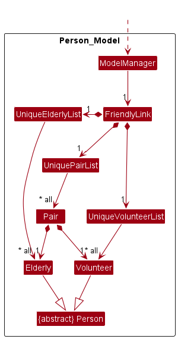
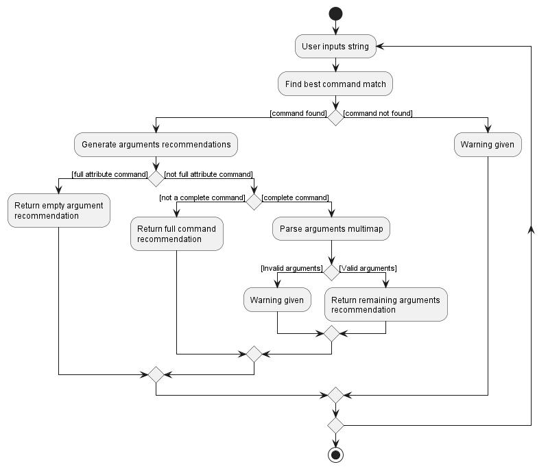
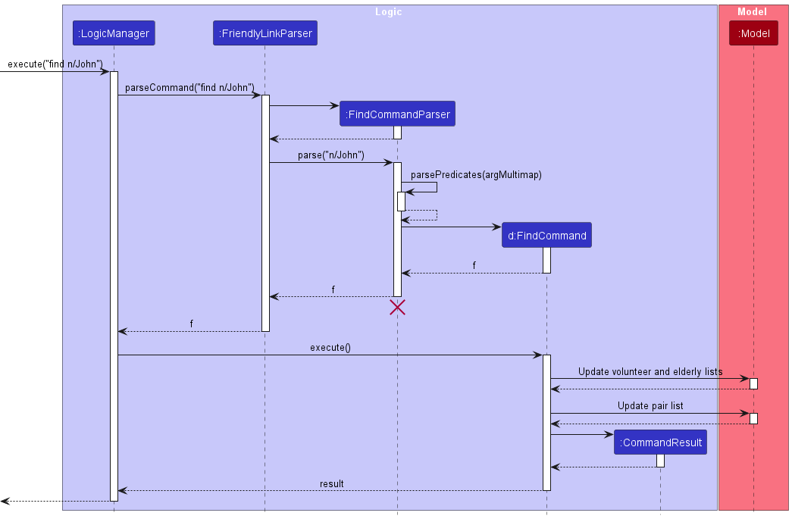

* Table of Contents
{:toc}

--------------------------------------------------------------------------------------------------------------------

## **Acknowledgements**

[//]: # (list here sources of all reused/adapted ideas, code, documentation, and third-party libraries -- include links to the original source as well)

* AddressBook Level-3 [documentation](https://se-education.org/addressbook-level3/)
* AddressBook Level-3 [code](https://github.com/nus-cs2103-AY2223S2/tp)
* Agolia [Documentation](https://www.algolia.com/doc/guides/solutions/ecommerce/search/autocomplete/predictive-search-suggestions)

--------------------------------------------------------------------------------------------------------------------

## **Setting up, getting started**

Refer to the guide [_Setting up and getting started_](SettingUp.md).

--------------------------------------------------------------------------------------------------------------------

## **Design**

<div markdown="span" class="alert alert-primary">

:bulb: **Tip** The `.puml` files used to create diagrams in this document can be found in [here](https://github.com/AY2223S2-CS2103T-W12-1/tp/tree/master/docs/diagrams/) folder. Refer to the [_PlantUML Tutorial_ at se-edu/guides](https://se-education.org/guides/tutorials/plantUml.html) to learn how to create and edit diagrams.
</div>

### Architecture

The General Architecture of FriendlyLink follows that of [AddressBook3](https://se-education.org/addressbook-level3/DeveloperGuide.html).


The ***Architecture Diagram*** given above explains the high-level design of the App.

Given below is a quick overview of main components and how they interact with each other.

**Main components of the architecture**

**`Main`** has two classes called [`Main`](https://github.com/AY2223S2-CS2103T-W12-1/tp/blob/master/src/main/java/seedu/address/Main.java) and [`MainApp`](https://github.com/AY2223S2-CS2103T-W12-1/tp/blob/master/src/main/java/seedu/address/MainApp.java). It is responsible for,
* At app launch: Initializes the components in the correct sequence, and connects them up with each other.
* At shut down: Shuts down the components and invokes cleanup methods where necessary.

[**`Commons`**](#common-classes) represents a collection of classes used by multiple other components.

The rest of the App consists of four components.

* [**`UI`**](#ui-component): The UI of the App.
* [**`Logic`**](#logic-component): The command executor.
* [**`Model`**](#model-component): Holds the data of the App in memory.
* [**`Storage`**](#storage-component): Reads data from, and writes data to, the hard disk.

**How the architecture components interact with each other**

The *Sequence Diagram* below shows how the components interact with each other for the scenario where the user issues the command `delete_elderly S1234567G`.


Each of the four main components (also shown in the diagram above),

* defines its *API* in an `interface` with the same name as the Component.
* implements its functionality using a concrete `{Component Name}Manager` class (which follows the corresponding API `interface` mentioned in the previous point).

For example, the `Logic` component defines its API in the `Logic.java` interface and implements its functionality using the `LogicManager.java` class which follows the `Logic` interface. Other components interact with a given component through its interface rather than the concrete class (reason: to prevent outside component's being coupled to the implementation of a component), as illustrated in the (partial) class diagram below.


The sections below give more details of each component.

### UI component

The **API** of this component is specified
in [`Ui.java`](https://github.com/AY2223S2-CS2103T-W12-1/tp/blob/master/src/main/java/seedu/address/ui/Ui.java)


The UI consists of a `MainWindow` that is made up of parts e.g.`CommandBox`, `ResultDisplay`, `ElderlyListPanel`
, `StatusBarFooter` etc. All these, including the `MainWindow`, inherit from the abstract `UiPart` class which captures
the commonalities between classes that represent parts of the visible GUI.

The `UI` component uses the JavaFx UI framework. The layout of these UI parts are defined in matching `.fxml` files that are in the `src/main/resources/view` folder. For example, the layout of the [`MainWindow`](https://github.com/AY2223S2-CS2103T-W12-1/tp/blob/master/src/main/java/seedu/address/ui/MainWindow.java) is specified in [`MainWindow.fxml`](https://github.com/AY2223S2-CS2103T-W12-1/tp/blob/master/src/main/resources/view/MainWindow.fxml)

The `UI` component,

* executes user commands using the `Logic` component.
* listens for changes to `Model` data so that the UI can be updated with the modified data.
* keeps a reference to the `Logic` component, because the `UI` relies on the `Logic` to execute commands.
* depends on some classes in the `Model` component, as it displays `Elderly`, `Volunteer` and `Pair` objects residing in
  the `Model`.

### Logic component

**API** : [`Logic.java`](https://github.com/AY2223S2-CS2103T-W12-1/tp/blob/master/src/main/java/seedu/address/logic/Logic.java)

Here's a (partial) class diagram of the `Logic` component:


How the `Logic` component works:
1. When `Logic` is called upon to execute a command, it uses the `FriendlyLinkParser` class to parse the user command.
1. This results in a `Command` object (more precisely, an object of one of its subclasses e.g., `AddPairCommand`) which is executed by the `LogicManager`.
1. The command can communicate with the `Model` when it is executed (e.g. to add a pair).
1. The result of the command execution is encapsulated as a `CommandResult` object which is returned back from `Logic`.

The Sequence Diagram below illustrates the interactions within the `Logic` component for the `execute("delete_elderly S1234567I")` API call.


<div markdown="span" class="alert alert-info">:information_source: **Note:** The lifeline for `DeleteElderlyCommandParser` should end at the destroy marker (X) but due to a limitation of PlantUML, the lifeline reaches the end of diagram.
</div>

Here are the other classes in `Logic` (omitted from the class diagram above) that are used for parsing a user command:


How the parsing works:
* When called upon to parse a user command, the `FriendlyLinkParser` class creates an `XYZCommandParser` (`XYZ` is a placeholder for the specific command name e.g., `AddPairCommandParser`) which uses the other classes shown above to parse the user command and create a `XYZCommand` object (e.g., `AddPairCommand`) which the `FriendlyLinkParser` returns back as a `Command` object.
* All `XYZCommandParser` classes (e.g., `AddPairCommandParser`, `DeletePairCommandParser`, ...) inherit from the `Parser` interface so that they can be treated similarly where possible e.g, during testing.

### Model component
**API** : [`Model.java`](https://github.com/se-edu/addressbook-level3/tree/master/src/main/java/seedu/address/model/Model.java)


The `Model` component,

* stores the address book data i.e., all `Elderly`, `Volunteer` and `Pair` objects (which are contained in a `UniqueElderlyList`, `UniqueVolunteerList` and `UniquePairList` objects respectively).
* stores the currently 'selected' `Elderly`, `Volunteer` and `Pair` objects (e.g., results of a search query) as a separate _filtered_ list which is exposed to outsiders as an unmodifiable `ObservableList<Elderly>`,  `ObservableList<Volunteer>` and `ObservableList<Pair>` respectively  that can be 'observed' e.g. the UI can be bound to this list so that the UI automatically updates when the data in the list change.
* stores a `UserPref` object that represents the user’s preferences. This is exposed to the outside as a `ReadOnlyUserPref` objects.
* depends on some classes in the `Storage` component (because the `Model` component requires `Storage` to save/retrieve objects that belong to the `Model`)


This is the detailed implementation of `Person` in `Model`. 
* Both `Elderly` and `Volunteer` inherit from the abstract class `Person`.
* A `Pair` makes reference to one `Elderly` and one `Volunteer` each.

<br>




### Storage component

**API** : [`Storage.java`](https://github.com/AY2223S2-CS2103T-W12-1/tp/blob/master/src/main/java/seedu/address/storage/Storage.java)


The `Storage` component,
* can save `Elderly`, `Volunteer`, `Pair` and `UserPrefs` data in JSON format, and read them back into corresponding objects.
* inherits from `ElderlyStorage`, `VolunteerStorage`, `PairStorage` and `UserPrefStorage`, which means it can be treated as either one (if only the functionality of only one is needed).
* does not depend on any of the other three components (as the `Storage` represents data entities on disk, they should make sense on their own without depending on other components)

### Common classes

Classes used by multiple components are in the `seedu.address.commons` package.

--------------------------------------------------------------------------------------------------------------------

## **Implementation**

This section describes some noteworthy details on how certain features are implemented.

### Add and Delete Elderly and Volunteer

In FriendlyLink, `Elderly` and `Volunteer` are both implemented as subclasses of the abstract class `Person`.

The `add_elderly` and `add_volunteer` commands accept attributes of `Elderly` and `Volunteer` through prefixes.
Each prefix is followed by the information of one attribute.
Some prefixes, such as `availableDates`, `tags`, are optional.

* This grants greater flexibility of user input, as the user can key in the attributes in any order.
* The unspecified optional fields will return `null` value.
* The `NRIC` attribute for Elderly and Volunteer will be cross-checked to ensure no duplicates.
* When the `add` command format is invalid, or the user tries to add a duplicated person,
  the add operation will be aborted.

The Elderly and Volunteers are stored in separate `UniquePersonList` lists.

* Allows for filtering to display a subset of Elderly or Volunteers in UI.
* Allows for easy retrieval of information for pairing.

The `delete_elderly` and `delete_volunteer` commands make use of `NRIC`
attribute of Elderly and Volunteer.
FriendlyLink retrieves the target person uniquely identified by its NRIC,
and removes it from the database.

* Allows more efficient deletion compare to index-based deletion.
* The user don't need to check the index of the target person before deletion.

If the deleted Elderly or Volunteer has existing pairing, the associated
pairs will be automatically removed as well.

### Command Recommendation and Autocompletion of Field's Prefixes

Both autocompletion and recommendation is facilitated by `CommandRecommendationEngine.java`. The Logic component registers 
individual command parsers, which implement the Parser interface, to enable recommendations of command inputs. Each parser,
such as `{XYZ}CommandParser`, specifies how recommendation should differ for a specific command by overriding the 
`Parser#getCommandInfo` method. When the user types a valid command, the `CommandBox` UI component detects the keystroke 
through its `KeyPressedHandler` and triggers the `CommandRecommendationEngine#generateCommandRecommendations` method. 
This method then returns the relevant recommendations. When a `KeyEvent.TAB` event is triggered, autocompletion builds 
on the method and replaces the user input with the recommended values. 

Using the longest prefix match algorithm, the engine first **identifies** the related command and then **verifies** the 
fields associated with it. If there are ambiguities in the recommendations, the recommendation will rank the commands 
using lexicographical ordering. 

In order to simplify implementation, we differentiate between two types of commands: "Full Attribute" commands and "Complete" commands. 
A "Full Attribute" command is one in which all the fields, both optional and required, have been specified. 
A "Complete" command, on the other hand, means that the command has been fully typed, but the fields may or may not
have been entered. This distinction assists the engine in giving more precise suggestions based on the user's input.

The following activity diagram describes the activity flow:



#### Design considerations

Aspect: How recommendation executes:

**Alternative 1 (current choice)**: Custom recommendations for each command 
  - Requires each `{XYZ}CommandParser` to override the `Parser#getCommandInfo` method, specifying the exact behaviour on how recommendations should behave.
  - Recommendations will be more relevant to the current command, and user input can be validated against the set of possible prefixes specified in the overridden method.

**Alternative 2**: Store all possible prefixes and recommends based on user input 
  - Cannot enforce that user only inputs relevant prefixes as there is no reference as to what the "correct" prefixes are.
  - Likewise, such design is unable to recommend all relevant attributes, which can greatly reduce the user experience. 

### Edit by index & NRIC

In FriendlyLink, there are 2 methods to  choose which elderly/volunteer to edit:
- via **index** using the `edit_elderly` and `edit_volunteer` commands
- via **NRIC** using the `edit` command

Similar to adding elderly/volunteers, editing is done by specifying the desired field(s) to edit using their prefixes, 
and then providing the new value for the field(s). For consistency, the prefixes between the adding and 
editing commands are kept the same.

For the editing of fields that accept multiple arguments (i.e. `AvailableDate`, `Tag` and `MedicalQualificationTag`),
the specified behaviour is to leaves them unchanged if no new values are provided, else overwrite the existing values 
with the newly provided values.

Retrieving of the desired `Elderly`/`Volunteer` to edit is done differently 
depending on whether `edit_elderly`/`edit_volunteer`
or `edit` is called:
- `edit_elderly`/`edit_volunteer`: The `Elderly`/`Volunteer` is retrieved directly from
the `filteredElderly`/`filteredVolunteer` of `Model`
- `edit`: We first check if an `Elderly` with the specified NRIC exists in `Model`. 
If so, we retrieve it; Otherwise, we perform a similar check for `Volunteer`, and retrieve it if 
such a `Volunteer` exists.

These edits are performed primarily through the `EditDescriptor` class. This class
contains `Optional` types of the **union** of the fields between `Elderly` and `Volunteer`. In order to "transform"
a given volunteer/elderly with the edited fields, 2 important static methods are provided:
- `createEditedElderly(Elderly, EditDescriptor)`: returns a new `Elderly` representing the given `Elderly` modified 
with the values specified in the `EditDescriptor`
- `createEditedVolunteer(Volunteer, EditDescriptor)`: returns a `Volunteer` representing the given `Volunteer` modified 
with the values specified in the `EditDescriptor`

The `Elderly`/`Volunteer` and then edited in the model using the `setElderly`/`setVolunteer` methods
of `Model` respectively.

Design decisions:
- The reason behind the `editDescriptor` class, as opposed to directly using an `Elderly` or `Volunteer` class, is that
  it better encapsulates the logic behind editing. That is, with the same `editDescriptor` object, we can easily "edit" multiple
  `Elderly` and `Volunteer` objects simply through the `createEditedElderly`/`createEditedVolunteer` methods.
- Initially, we had created 2 separate descriptor classes `ElderlyEditDescriptor` and `VolunteerEditDescriptor`. However,
  we felt that this was simply unnecessary, and combined them into a single `editDescriptor` class instead.

As an example, the following sequence diagram shows the sequence for the command `edit S1234567I n/Shaun ag/21`, where
the NRIC `S1234567I` belongs to an existing **volunteer**:


:information_source: **Note:** The lifeline for `EditCommandParser` should end at the destroy marker (X) but due to a limitation of PlantUML, the lifeline reaches the end of diagram.

### Find by keyword

The ```find``` command allows users to easily filter and locate the relevant elderly and volunteers, together with their related parings.
The results of the ```find``` command are displayed as the filtered version of the elderly, volunteers and pairs lists, 
together with the number of entities listed being shown in the command result box.

Volunteers and elderly who match all the provided attributes that they have are filtered out and displayed in their respective list.
For each filtered person, Any pairing that they are involve in would be filtered and displayed in the pair list.

Arguments for the ```find``` command involves at least one of the attributes belonging to an elderly or a volunteer.
Any number of attributes can be specified but if multiple of the same attribute is specified then only the last one will be
used in the search.

The Sequence Diagram below illustrates the execution of the ```find``` command.



The command execution flow is as given below
1. The ```LogicManager``` will begin the execution of the command.
2. Input parsed by ```FriendlyLinkParser``` which creates and return a ```FindCommandParser```.
3. The ```FindCommandParser``` parses the arguments and returns a ```FindCommand``` with the relevant predicates.
4. The ```LogicManager``` executes the ```FindCommand```.
5. The ```FindCommand``` combines the relevant predicates for elderly and volunteers and calls ```updateFilteredElderlyList``` and ```updateFilteredVoolunteerList``` of ```Model```.
6. Based on the filtered elderly and volunteers a predicate to get the related pairs is created and ```updateFilteredPairList``` of ```Model``` is called.
7. ```CommandResult``` with the sizes of the 3 filtered lists is created and returned.

Design decisions:
- Name, address, email, phone, tags and medical qualification attributes allow substring searching.
  - Easier to search with only partial information available.
- When multiple attributes and stated, the result must match all instead of any.
  - The search should narrow the field with each additional new attribute for a more targeted result.
- Related pairings are also shown during the search.
  - Provides a comprehensive search results where all information related to the people found are shown.
- People with Available dates that contain the specified dates or have no available dates will be found when searching with the specified dates.
  - They are found because they are available on the specified dates.

### Pairing and unpairing of elderly and volunteers

Pairs are implemented as a class with 2 referenced attributes, `Elderly` and `Volunteer`.
* This allows the NRIC of a person in the pair to be automatically updated when the person is updated.

The pairs are stored in a list similar to persons.

* Allows for filtering to display a subset of pairs in the UI.
* Allows for identifying a pair by index.

Two pairs are identical if they have the same elderly and volunteer NRIC.

* Just like persons, we do not allow duplicate pairs (due to add or edit pair)
* Elderly and volunteer NRIC is used to identify a pair for deletion.

### Summary Statistics

The `stats` command displays summary statistics about FriendlyLink, such as the total number of elderly, volunteers and unpaired persons.

It is implemented using the `Summary` and `AggregateFunction` class.

The `AggregateFunction`
* describes a particular statistic of FriendlyLink with a number.
* is an abstract class that requires concrete classes to override the `getDescription()` and `getResult()` method.

The `Summary` object
* formats the results to be displayed to the user.
* takes in 0 or more `AggregateFunction`s to show their description and results.


 
### Storage
This section specifies how entities such as `Elderly`, `Volunteer` and `Pair` are stored on disk.

Elderly, volunteers and pairs are stored in separate files to reduces the impact of a corrupted file, since it will only affect either elderly or volunteers.

#### Persons

Persons saved contains all their attributes such as name, NRIC, in JSON format.
* Single value attributes are stored as key value pairs, such as name and NRIC.
* Multiple value attributes such as tag and available date sets are stored as JSON lists.

#### Pairs

Pairs saved only contains the NRIC of the elderly and volunteer in JSON format.

**Reasons**
* Reduce space needed to store pairs
* Reduce chance of inconsistent data between a person and the corresponding pair,
* Reduce number of files to amend manually when updating person information.

**Implications**
* A pair is reconstructed on startup by searching the model for the corresponding person.
* Elderly and volunteer files need to be read into the model before pair files.

--------------------------------------------------------------------------------------------------------------------

## **Documentation, logging, testing, configuration, dev-ops**

* [Documentation guide](Documentation.md)
* [Testing guide](Testing.md)
* [Logging guide](Logging.md)
* [Configuration guide](Configuration.md)
* [DevOps guide](DevOps.md)

--------------------------------------------------------------------------------------------------------------------

## **Appendix: Planned Enhancements**

### Editing a pair by index: `edit_pair`

Proposed usage: Edits an existing pair based on their index in the pairs list.

Currently, editing a pair by index has not been implemented. This feature can increase the efficiency of using FriendlyLink.
This feature was originally deemed low priority, since a pair only has 2 fields: elderly and volunteer, and thus users can reasonably still achieve this by deleting a pair and adding a new pair. Through user feedback, we acknowledge that this is still a useful feature to have to improve efficiency and user experience.

Proposed format: `edit_pair INDEX [eic/ELDERLY_NRIC] [vic/VOLUNTEER_NRIC]`

Proposed behaviour:
* Edits the pair at the specified `INDEX` in the displayed pair list.
* Any combination of the optional fields is possible but **at least one** optional field must be specified.
* Existing values will be updated to the input values.

Examples:
* `edit_pair 1 eic/T0245267I` Edits the 1st pair so that the volunteer is paired to the elderly with NRIC `T0245267I` instead.

### Deleting a pair by index: `delete_pair`

Proposed usage: Deletes an existing pair based on their index in the pairs list.

Currently, pairs are deleted by specifying NRIC of both elderly and volunteer. This feature can increase the efficiency of using FriendlyLink, if we allow users to simply specify the index of the pair.
This feature is originally implemented as such to prevent accidental deletion of pairs, as it is easy to enter the wrong index but hard to accidentally enter a pair of incorrect NRICs and delete the wrong pair. Through user feedback, we acknowledge that we should implement it to delete by index and support this with an `undo` feature to minimise impact of accidental deletions.

Proposed format: `edit_pair INDEX [eic/ELDERLY_NRIC] [vic/VOLUNTEER_NRIC]`

Proposed behaviour:
* Edits the pair at the specified `INDEX` in the displayed pair list.
* Any combination of the optional fields is possible but **at least one** optional field must be specified.
* Existing values will be updated to the input values.

--------------------------------------------------------------------------------------------------------------------

## **Appendix: Requirements**

### Product scope

**Target user profile**:

* single administrator of a Voluntary Welfare Organisation (VWO) who needs to track volunteers and their assigned elderly.
* works alone in managing volunteer and elderly information.
* adequately tech-savvy.
* has a need to manage a significant number of volunteers and elderly.
* prefers desktop applications over other types.
* can type fast.
* prefers typing to mouse interactions.
* comfortable using CLI applications.

**Value proposition**: FriendlyLink streamlines volunteer and elderly management for single administrators of VWOs.
With its easy-to-use text-based interface and contact management features, say goodbye to manual record-keeping and hello
to a more efficient and organised way of managing volunteers’ and elderly’s contact details.


### User stories

Priorities: High (must have) - `* * *`, Medium (nice to have) - `* *`, Low (unlikely to have) - `*`

| Priority | As a …​                                                                               | I want to …​                                                                                      | So that I can…​                                                                   |
|----------|---------------------------------------------------------------------------------------|---------------------------------------------------------------------------------------------------|-----------------------------------------------------------------------------------|
| `* * *`  | single administrator of a VWO                                                         | view the list of volunteers                                                                       | see all the volunteers and their information readily                              |
| `* * *`  | single administrator of a VWO                                                         | add a new volunteer to the system                                                                 | track and manage new volunteers                                                   |
| `* * *`  | single administrator of a VWO                                                         | remove an existing volunteer from the system                                                      | stop tracking volunteers that have left                                           |
| `* * *`  | single administrator of a VWO                                                         | edit the particulars of a volunteer, such as names or addresses                                   | keep their information up to date and rectify any error                           |
| `* * *`  | single administrator of a VWO                                                         | view the list of elderly                                                                          | see all the elderly and their information readily                                 |
| `* * *`  | single administrator of a VWO                                                         | add a new elderly member to the system                                                            | track and manage new elderly                                                      |
| `* * *`  | single administrator of a VWO                                                         | remove an existing elderly member from the system                                                 | stop tracking elderly that have left                                              |
| `* * *`  | single administrator of a VWO                                                         | edit the particulars of an elderly, such as names or addresses                                    | keep their information up to date and rectify any error                           |
| `* * *`  | single administrator of a VWO                                                         | find a particular volunteer or elderly by NRIC                                                    | uniquely identify and access their information                                    |
| `* * *`  | single administrator of a VWO                                                         | remove pairings that elderly and volunteers are involved in when they are removed from the system | maintain accurate and error-free records of pairings                              |
| `* * *`  | single administrator of a VWO                                                         | add a pair of a volunteer and an elderly                                                          | track and manage pairings of volunteer and elderly                                |
| `* * *`  | single administrator of a VWO                                                         | find and list unpaired volunteers and elderly                                                     | prioritise pairing volunteers and elderly who are unpaired                        |
| `* * *`  | single administrator of a VWO                                                         | remove pairings                                                                                   | to remove pairs that are no longer valid                                          |
| `* * `   | single administrator of a VWO                                                         | search for particular volunteers by keywords                                                      | quickly see the volunteer's details                                               |
| `* *`    | single administrator of a VWO                                                         | view nursing / medical courses that volunteers have taken in the past                             | pair an elderly with a more suitable volunteer                                    |
| `* *`    | single administrator of a VWO                                                         | filter and list elderly members by keyword search of name                                         | increasing efficiency of finding elderly with certain names                       |
| `* *`    | single administrator of a VWO                                                         | filter pairs by involved elderly members                                                          | to quickly find involved volunteers when elderly members are in need of attention |
| `* *`    | single administrator of a VWO                                                         | filter and list elderly members by age group                                                      | dedicate more attentions to older members                                         |
| `* *`    | single administrator of a VWO                                                         | filter and list elderly members by risk level                                                     | dedicate more attentions to members with higher risks                             |
| `* *`    | single administrator of a VWO                                                         | filter and list elderly members by region and community                                           | pair volunteers who can better reach out to elderly living close-by               |
| `* *`    | single administrator of a VWO                                                         | search elderly members by tags                                                                    | access the information of elderly members with specific tags                      |
| `* *`    | single administrator of a VWO                                                         | autocomplete commands                                                                             | know what are some possible commands and fields that I need to type               |
| `* *`    | single administrator of a VWO                                                         | rank elderly members in the order of their medical risk level                                     | better pair volunteers with more medical knowledge with higher-risk elderly       |
| `* *`    | single administrator of a VWO                                                         | keep track of the region and community of the elderly members                                     | reach out to the elderly members conveniently                                     |
| `* *`    | single administrator of a VWO                                                         | view the last visited time/date of the elderly                                                    | know when to plan the next visit                                                  |
| `* *`    | single administrator of a VWO                                                         | set up reminder system for elderly                                                                | plan volunteers to assist on those days                                           |
| `* *`    | single administrator of a VWO                                                         | find a pair by keyword                                                                            | to quickly look up important information when required                            |
| `* *`    | single administrator of a VWO                                                         | view overlapping pairs between the same volunteers or elderly members                             | to take note of overlapping work.                                                 |
| `* *`    | single administrator of a VWO                                                         | filter pairs by tags                                                                              | to quickly find certain groups of elderly members for events or routine checkups  |
| `* *`    | single administrator of a VWO                                                         | see summaries of number of elderly members assigned to each volunteer                             | to evenly distribute workload of volunteers                                       |
| `* *`    | single administrator of a VWO                                                         | see min, max and average number of elderly buddies per volunteer                                  | to evenly distribute workload of volunteers or to request for more resources      |
| `*`      | single administrator of a VWO                                                         | filter volunteers by tags                                                                         | access relevant groups of volunteers quickly                                      |
| `*`      | single administrator of a VWO                                                         | manage volunteers by region                                                                       | arrange the volunteers such that they can conveniently reach out to the elderly   |
| `*`      | single administrator of a VWO                                                         | record the community information of volunteers, but not their specific address                    | ensure that the volunteers' privacy is not compromised                            |
| `*`      | single administrator of a VWO                                                         | manage the volunteers' available dates and time                                                   | efficiently find volunteers available for activities                              |
| `*`      | single administrator of a VWO                                                         | see how long a volunteer has been with the program                                                | assess their experience                                                           |
| `*`      | single administrator of a VWO                                                         | track the befriending history of a volunteer                                                      | audit past involvements easily                                                    |
| `*`      | single administrator of a VWO                                                         | rank elderly members in the order of their loneliness situation                                   | arrange more frequent volunteer visits for more lonely elderly                    |
| `*`      | single administrator of a VWO                                                         | track the befriending history of an elderly                                                       | audit past involvements easily                                                    |
| `*`      | single administrator of a VWO                                                         | view past pairings                                                                                | to pair up members familiar with each other                                       |
| `*`      | single administrator of a VWO                                                         | making recurring pairings                                                                         | to handle recurrent changes in pairs.                                             |
| `*`      | single administrator of a VWO                                                         | adjust frequency and period limit of pairings                                                     | to facilitate regular swaps of volunteers and elderly members.                    |
| `*`      | single administrator of a VWO                                                         | track important dates                                                                             | to facilitate regular volunteer check ins on elderly members.                     |
| `*`      | single administrator of a VWO                                                         | set up reminders                                                                                  | to remind volunteers of their commitments                                         |
| `*`      | single administrator of a VWO                                                         | set up version control of the application                                                         | trace commands that are executed throughout the lifetime of the application       | 
| `*`      | lazy single administrator of a VWO                                                    | automatically pair up available volunteers to elderly                                             | quickly assign a volunteer to an elderly                                          | 
| `*`      | efficient single administrator of a VWO                                               | use natural language dates                                                                        | quickly assign add a volunteer availability into the database                     |  
| `*`      | organized single administrator of a VWO                                               | add tags to volunteer, elderly and pairs                                                          | filter the entities by tags                                                       |  
| `*`      | organized single administrator of a VWO                                               | assign a random integer ID to each entry                                                          | retrieve, modify and delete them directly without looking through the list        |  
| `*`      | organized single administrator of a VWO who have used the application for a long time | retrieve summary statistics of elderly, volunteers, and pairs in the database                     | have a better understanding of the organisation and it's clients                  |  

### Use cases

(For all use cases below, the **System** is the `FriendlyLink (FL)` and the **Actor** is the `Admin`, unless specified otherwise)

**Use case: UC01- Pair Volunteer and Elderly**

**MSS**

1.  User enters the details of elderly and volunteer to be paired into the application.
2.  FL adds the pair into the database, and feedbacks the successful addition of the pair.
3.  User see the pair details appear in the pair list.

    Use case ends.

**Extensions**

* 1a. FL detects that the elderly is not in the current database.
    * 1a1. FL informs User that the elderly has not been created.

    Use case ends.

* 1b. FL detects that volunteer is not in the current database.
    * 1b1. FL informs User that the volunteer has not been created.

    Use case ends.

* 1c. FL detects missing arguments or an error in the entered data.
    * 1c1. FL feedbacks that entered data is in a wrong format.

    Use case ends.

* 1d. FL detects duplicate pair records in the entered data.
    * 1d1. FL feedbacks that it is a duplicate record.

    Use case ends.

**Use case: UC02- Add Elderly**

**MSS**

1.  User enters the details of elderly to be added into the application.
2.  FL adds the elderly into the database, and feedbacks the successful addition of the elderly.
3.  User see the elderly details appear in the elderly list.

    Use case ends.

**Extensions**

* 1a. FL detects missing arguments or an error in the entered data.
    * 1a1. FL feedbacks that entered data is in a wrong format.
    
    Use case ends.

* 1b. FL detects duplicate elderly records in the entered data.
    * 1b1. FL informs it is a duplicate record.

    Use case ends.

**Use case: UC03- Add Volunteer**

**MSS**

1.  User enters the details of volunteer to be added into the application.
2.  FL adds the volunteer into the database, and feedbacks the successful addition of the volunteer.
3.  User see the volunteer details appear in the volunteer list.

    Use case ends.

**Extensions**

* 1a. FL detects missing arguments or an error in the entered data.
  * 1a1. FL feedbacks that entered data is in a wrong format.

  Use case ends.

* 1b. FL detects duplicate volunteer records in the entered data.
  * 1b1. FL informs it is a duplicate record.

  Use case ends.

**Use case: UC04- Unpair Volunteer and Elderly**

**MSS**

1.  User enters the pair details (elderly & volunteer) to be deleted into FL.
2.  FL deletes the pair from the database, and feedbacks the successful unpairing.
3.  User see the pair details removed from the joint list.

    Use case ends.

**Extensions**

* 1a. FL detects that the pair is not in the current database.
    * 1a1. FL informs User that the pair has not been created.

  Use case ends.

* 1b. FL detects missing arguments or an error in the entered data.
    * 1b1. FL feedbacks that entered data is in a wrong format.

  Use case ends.

**Use case: UC05- Delete Volunteer**

**MSS**

1.  User enters the NRIC of the volunteer to be deleted.
2.  FL deletes the volunteer from the database, and feedbacks the successful deletion of the volunteer.
3.  User see the volunteer details removed from the volunteer list.

    Use case ends.

**Extensions**

* 1a. FL detects missing arguments or an error in the entered data.
    * 1a1. FL feedbacks that entered data is in a wrong format.

  Use case ends.

* 1b. FL detects that the volunteer is not inside the records.
    * 1b1. FL informs that the volunteer does not exist.

* 1c. FL detects the provided NRIC does not match any volunteer in the database.
    * 1c1. FL feedbacks that no volunteer matches the provided NRIC.

      Use case ends.

  Use case ends.

**Use case: UC06-  Delete Elderly**

**MSS**

1.  User enters the NRIC of the elderly to be deleted.
2.  FL deletes the elderly from the database, and feedbacks the successful deletion of the elderly.
3.  User see the elderly details removed from the elderly list.

    Use case ends.

**Extensions**

* 1a. FL detects missing arguments or an error in the entered data.
  * 1a1. FL feedbacks that entered data is in a wrong format.

  Use case ends.

* 1b. FL detects that the elderly is not inside the records.
  * 1b1. FL informs that the elderly does not exist.

  Use case ends.

* 1c. FL detects the provided NRIC does not match any elderly in the database.
    * 1c1. FL feedbacks that no elderly matches the provided NRIC.

      Use case ends.

**Use case: UC07- Edit Elderly**

**MSS**

1. User enters the index of the elderly to be edited, together with the details of the fields to be edited.
2. FL edits the corresponding elderly in the database, and feedbacks the successful edit of the elderly.
3. User see the updated elderly details appear in the elderly list.

    Use case ends.

**Extensions**

* 1a. FL detects the provided index is out of bound for the current elderly list.
  * 1a1. FL feedbacks that the entered index is invalid.
  
    Use case ends.

* 1b. FL detects that no field is specified for edit.
  * 1b1. FL feedbacks that at least one field must be specified for edit.

    Use case ends.

* 1c. FL detects an error in the new attribute data.
    * 1c1. FL feedbacks that entered data is in a wrong format.

      Use case ends.

**Use case: UC08- Edit Volunteer**

**MSS**

1. User enters the index of the volunteer to be edited, together with the details of the fields to be edited.
2. FL edits the corresponding volunteer in the database, and feedbacks the successful edit of the volunteer.
3. User see the updated volunteer details appear in the elderly list.

   Use case ends.

**Extensions**

* 1a. FL detects the provided index is out of bound for the current volunteer list.
    * 1a1. FL feedbacks that the entered index is invalid.

      Use case ends.

* 1b. FL detects that no field is specified for edit.
    * 1b1. FL feedbacks that at least one field must be specified for edit.

      Use case ends.

* 1c. FL detects an error in the new attribute data.
    * 1c1. FL feedbacks that entered data is in a wrong format.

      Use case ends.

**Use case: UC09- Edit Person identified by NRIC**

**MSS**

1. User enters the NRIC of the person to be edited, together with the details of the fields to be edited.
2. FL edits the corresponding fields of the person (be an elderly or a volunteer), and feedbacks the successful edit of the person.
3. User see the updated person details appear in the corresponding elderly or volunteer list.

   Use case ends.

**Extensions**

* 1a. FL detects the provided NRIC does not match any person in the database.
    * 1a1. FL feedbacks that no person matches the provided NRIC.

      Use case ends.

* 1b. FL detects that no field is specified for edit.
    * 1b1. FL feedbacks that at least one field must be specified for edit.

      Use case ends.

* 1c. FL detects an error in the new attribute data.
    * 1c1. FL feedbacks that entered data is in a wrong format.

      Use case ends.

**Use case: UC09- Find person and related pairs**

**MSS**

1. User enters the details of all the fields to be matched.
2. FL searches for the existing person and pair database, and return lists of matching elderly, volunteer and pairs.
3. User see the matching persons and pairs appearing in the UI.

   Use case ends.

**Extensions**

* 1a. FL detects that no field is specified for matching.
    * 1a1. FL feedbacks that at least one field must be specified for finding records.

      Use case ends.

* 1b. FL detects an error in the data to be searched.
    * 1b1. FL feedbacks that entered data is in a wrong format.

      Use case ends.
      

**Use case: UC10- Listing persons**

**MSS**

1. User types `list` in the input text box.
2. FL return all the current elderly, volunteers and pairs in the database.
3. User see all the persons and pairs on the interface.

   Use case ends.


**Use case: UC11- View person statistics**

**MSS**

1. User types `stats` in the input text box.
2. FL returns the number of elderly, volunteer, pairs and their pairing situations.
3. User see the summary statistics in the feedback box.

   Use case ends.


**Use case: UC12- Look up Help Page**

**MSS**

1. User types `help` in the input text box.
2. FL returns the pop-up whose link directs user to the user guide.
3. User see the pop-up message.

   Use case ends.

**Use case: UC13- Exit the app**

**MSS**

1. User types `exit` in the input text box.
2. FL saves the current data and exits.
3. User see the software interface closes.

   Use case ends.


### Non-Functional Requirements

1. FriendlyLink should work on Microsoft Windows, macOS, and Linux that has `Java 11` is installed.
1. FriendlyLink Should be able to hold up to 100 person (elderly and volunteer) without incurring a delay larger than 3 second for any command.
1. A user with above average typing speed (40wpm) for regular English text (i.e. not code, not system admin commands) should be able to perform at least 75% of use cases faster using commands instead of using the mouse.
1. FriendlyLink will perform minimal checks on correctness of details entered into FriendlyLink (as specified in the user guide advanced section).
1. FriendlyLink will not be responsible for the privacy and security of the data stored in FriendlyLink.
1. FriendlyLink will not recover from corrupted data files.
1. FriendlyLink will only available in English.
1. FriendlyLink does not require internet connection to work.
1. FriendlyLink is meant for VWOs in Singapore to contain information of and pair elderly and volunteers.

### Glossary

| Term                  | Definition                                                                                                                                                  |
|-----------------------|-------------------------------------------------------------------------------------------------------------------------------------------------------------|
| Command               | An instruction given by you to FriendlyLink to perform a specific task.                                                                                     |
| Date                  | A date representing the timestamp of an event, in the format `YYYY-MM-DD`                                                                                   |
| Duplicate Pairs       | Two pairs having the same elderly and volunteer are considered a duplicate entry in FriendlyLink                                                            |
| Duplicate Persons     | Two persons having the same NRIC are considered a duplicate entry in FriendlyLink                                                                           |
| Elderly               | Elderly are people under the care of your VWO                                                                                                               |
| Email                 | The email of a person, in the `localPart@domain` format, containing the `@`                                                                                 |
| FriendlyLink          | The name of our application                                                                                                                                 |
| Field                 | A field is the information following the slash in a command.                                                                                                |
| Index                 | An index represents the position of the referred item in a displayed list of persons. It must be a positive integer.                                        |
| Medical Qualification | The level of care taking or first aid of a volunteer. It consists of the type of skill (E.g. CP, AED) and a skill level (`BASIC`, `INTERMEDIATE` or `HIGH`) |
| NRIC                  | A unique identifier given to all Singaporeans. It is case-insensitive.                                                                                      |
| Pair                  | A pair consists of an elderly and a volunteer assigned to accompany and take care of the elderly                                                            | 
| Phone number          | The phone number of a person. Must be numeric and has more than 3 digits                                                                                    |
| Prefixes              | Prefixes are the characters appearing before a slash in a command. Prefixes describe the field that they represent.                                         |
| Region                | The general portion of area in Singapore. Must be one of the following values: `NORTH`, `NORTHEAST`, `CENTRAL`, `WEST` or `EAST`                            |
| Risk level            | The susceptibility level of an elderly to injury or sickness. Must be one of the following values: `LOW`, `MEDIUM` or `HIGH`                                |
| Tag                   | A generic description for a group of people. Must contain only alphanumeric characters                                                                      |
| Volunteer             | Volunteers that signed up to pair up with and accompany elderly members                                                                                     |
| VWO                   | Voluntary Welfare Organisations such as yourself                                                                                                            |

--------------------------------------------------------------------------------------------------------------------

## **Appendix: Instructions for manual testing**

Given below are instructions to test the app manually. You are recommended to start with an empty FriendlyLink and follow the instructions sequentially
in order for the example commands provided to be relevant. You can refer to the user guide for more details on the features.

<div markdown="span" class="alert alert-info">:information_source: **Note:** These instructions only provide a starting point for testers to work on;
testers are expected to do more *exploratory* testing.

</div>

### Launch

1. Initial launch
   * Download the jar file and copy it into an empty folder. 
   * Double-click the jar file.
   * Expected: The program runs and shows the GUI. Note that the window size may not be optimum.

### Viewing help

1. Opening the help window
    * Type the following help command into the text field.<br>
      `help`
    * Press enter.
    * Expected: The GUI shows a popup with a message and a link to the user guide.

### Adding records

1. Adding an elderly
   * Type the following add elderly command into the text field.<br>
     `add_elderly n/John Doe ic/S5583628H bd/1955-11-24 re/NORTH r/LOW p/93456688 e/Jdoe@gmail.com a/Coral street t/single dr/2023-06-03, dr/1933-06-25`
   * Press enter.
   * Expected: The GUI shows the added elderly in the elderly list.

1. Adding a volunteer
    * Type the following add volunteer command into the text field.<br>
      `add_elderly n/Jane Doe ic/T0058345F bd/2000-05-14 re/EAST p/91157884 e/Jane45@gmail.com a/Kings street t/strong mt/cpr BASIC dr/2023-05-03, dr/1933-09-25`
    * Press enter.
    * Expected: The GUI shows the added volunteer in the volunteer list.

1. Pairing a volunteer to an elderly
    * Type the following pair command into the text field.<br>
      `pair eic/S5583628H vic/T0058345F`
    * Press enter.
    * Expected: The GUI shows the pairing in the pair list.

### Editing records

1. Editing an elderly by index
    * Type the following edit elderly command into the text field.<br>
      `edit_elderly 1 p/98337512 r/HIGH`
    * Press enter.
    * Expected: The GUI shows the new fields for the elderly at the specified index. (pair list is updated if applicable)

1. Editing a volunteer by index
    * Type the following edit volunteer command into the text field.<br>
      `edit_volunteer 1 a/Max street`
    * Press enter.
    * Expected: The GUI shows the new fields for the volunteer at the specified index. (pair list is updated if applicable)

1. Editing a person by NRIC
    * Type the following edit command into the text field.<br>
      `edit T0058345F e/guest@gmail.com`
    * Press enter.
    * Expected: The GUI shows the new fields for the person with the specified NRIC. (pair list is updated if applicable)

### Finding records

1. Finding people and their related pairs
    * Type the following find command into the text field.<br>
      `find n/John`
    * Press enter.
    * Expected: The elderly, volunteer and pair list are filtered based on the find command.

1. Listing people who are paired
    * Type the following list command into the text field.<br>
      `list paired`
    * Press enter.
    * Expected: The GUI shows elderly and volunteers who have a pairing in their respective lists. (all pairs are shown)

1. Listing people who are not paired
    * Type the following list command into the text field.<br>
      `list unpaired`
    * Press enter.
    * Expected: The GUI shows elderly and volunteers who do not have a pairing in their respective lists. (all pairs are shown)

1. Listing everyone
    * Type the following list command into the text field.<br>
      `list`
    * Press enter.
    * Expected: The GUI shows all elderly, volunteers and pairs that are in FriendlyLink.

### Show summary statistics

1. View the statistics of of the displayed elderly, volunteers and pairs
    * Type the following stats command into the text field.<br>
      `stats`
    * Press enter.
    * Expected: Statistics are shown in the command result box in the GUI.

### Deleting records

1. Unpair volunteer and elderly
    * Type the following unpair command into the text field.<br>
      `unpair eic/S5583628H vic/T0058345F`
    * Press enter.
    * Expected: The pairing of the elderly and volunteer with the specified NRICs is removed from the pair list in the GUI.

1. Deleting an elderly
    * Type the following delete elderly command into the text field.<br>
      `delete_elderly S5583628H`
    * Press enter.
    * Expected: The elderly with the specified NRICs is removed from the elderly list in the GUI.

1. Deleting a volunteer
    * Type the following delete volunteer command into the text field.<br>
      `delete_volunteer T0058345F`
    * Press enter.
    * Expected: The volunteer with the specified NRICs is removed from the volunteer list in the GUI.

### Exit

1. Exiting the app
    * Use the `exit` command or click the 'X' button in the top right corner.<br>
    * Expected: The app closes.

### Saving

1. Saving window preferences
    * Resize the window to an optimum size, preferably full screen. Close the window.
    * Re-launch the app by double-clicking the jar file.
    * Expected: The most recent window size and location is retained.
    * Note: The window looks best under 1920x1200 resolution, 125% scale.

1. Saving data
    * Launch the app by double-clicking the jar file.
    * Execute an add command to add an `elderly` or `volunteer` in the database.
    * Close the app.
    * Expected: A `data` folder is created under the current repository where the jar file is located.

------------------------------------------------------------

## Appendix: Feature Flaws

When creating software, there are always areas that can be improved upon.
In the interest of transparency and keeping our users informed, we have identified some aspects
of our product that we recognise as feature flaws. We appreciate your patience as
we are actively working to find the best solution to address these feature flaws.

1. Depending on whether or not any record is present in the section, the width of the Elderly, Volunteer and Pair UI may vary slighly.
2. When users provide a birth date for an Elderly or Volunteer profile, only the person's current age is displayed in the app. To view the specific birth date, users must refer to the respective JSON file. 
3. In order to give users maximum flexibility in adding tags, we do not impose any limits on the number of tags or the character limit for each tag.
   However, if tags with excessively long names are used, they could potentially affect the UI display and impact user experience.
4. Our auto_pair algorithm for pairing up volunteers and elderly users employs a greedy approach, which may not always 
be the most optimal in terms of time efficiency or number of pairings.
5. Allow users to enter hours into the available dates fields to provide greater flexibility in specifying availability period.
6. A command to view pairing details, instead of hovering over the pair item, and reading from the popover card.

