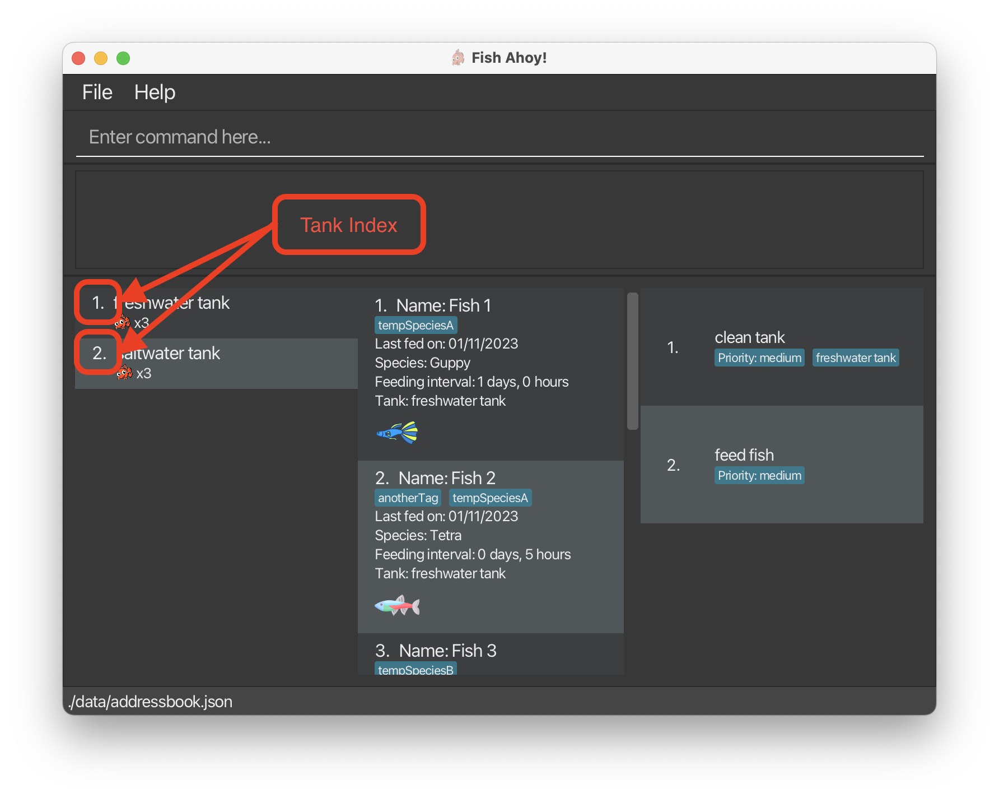
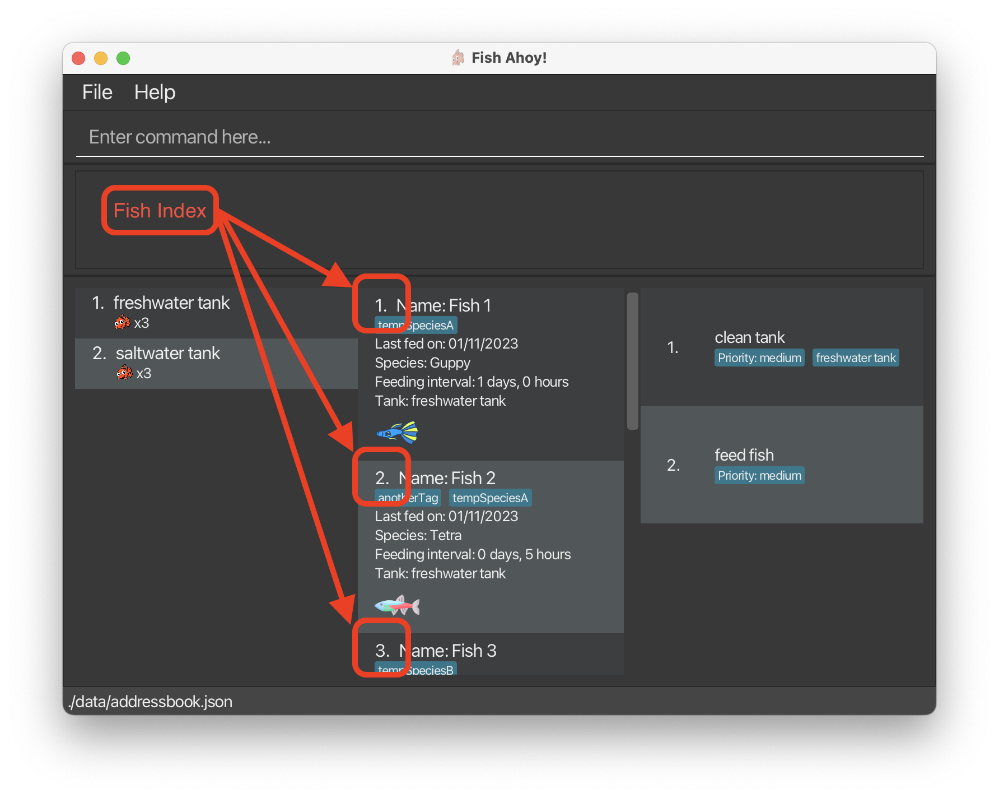
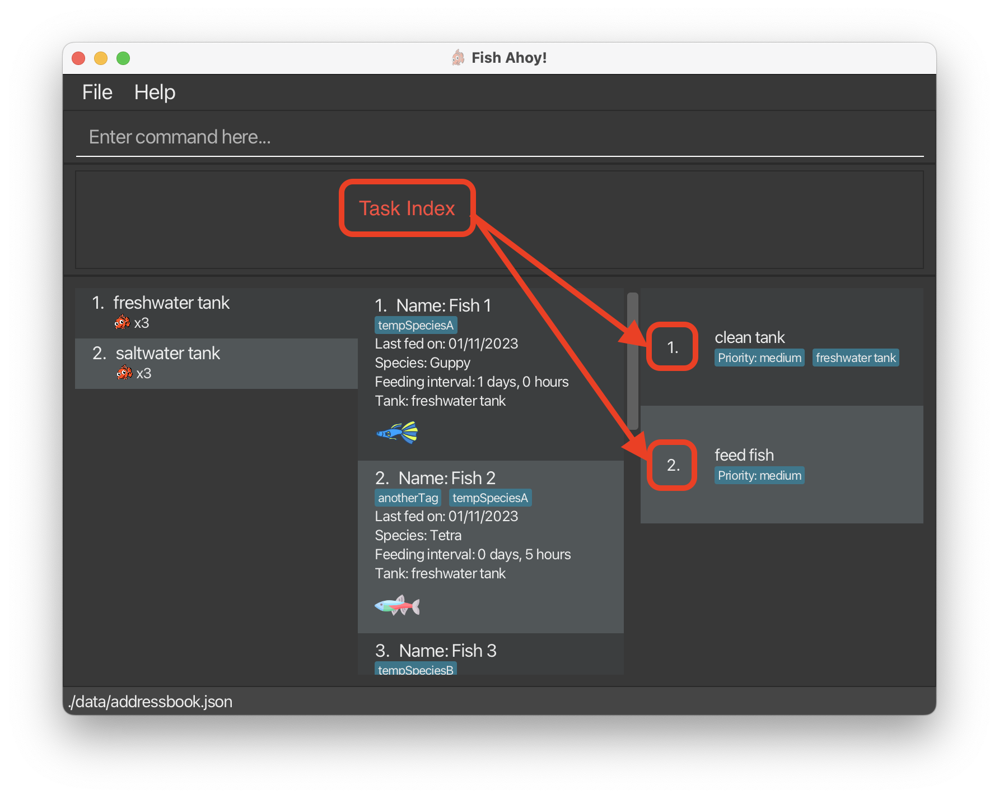

# Table of Contents
  * [Introduction](#introduction)
  * [Quickstart](#quick-start)
  * [Features](#features)
    * [Tanks](#tanks)
      * [Adding a tank `tank add`](#adding-a-tank-tank-add)
      * [Deleting a tank `tank delete`](#deleting-a-tank-tank-delete)
      * [Feeding a tank `tank feed`](#feeding-a-tank-tank-feed)
      * [Viewing a tank `tank view`](#viewing-a-tank-tank-view)
      * [Listing tanks `list tanks`](#listing-tanks-list-tanks)
      * [Tank readings](#tank-readings)
        * [Adding a set of readings `tank addReadings`](#adding-a-set-of-readings-tank-addreadings)
        * [Deleting a most recent set of readings `tank delLastReadings`](#deleting-the-most-recent-set-of-readings-tank-dellastreadings)
    * [Fishes](#fishes)
      * [Adding a fish `fish add`](#adding-a-fish-fish-add)
      * [Deleting a fish `fish delete`](#deleting-a-fish-fish-delete)
      * [Sorting fishes `fish sort`](#sorting-fishes-fish-sort)
      * [Viewing fishes `fish view`](#viewing-a-fish-fish-view)
      * [Listing fishes `list fishes`](#listing-fishes-list-fishes)
    * [Tasks](#tasks)
      * [Adding a task `task add`](#adding-a-task-task-add)
      * [Deleting a task `task delete`](#deleting-a-task-task-delete)
      * [Listing tasks `list task`](#listing-tasks-list-task)
      * [Feeding reminders](#feeding-reminders)
    * [Storage](#storage)
    * [Help](#help)
  * [FAQ](#faq)
  * [Summary of commands](#command-summary)
  * [Summary of prefixes in commands](#command-prefix-summary)

--------------------------------------------------------------------------------------------------------------------

# Introduction

Welcome to the *Fish Ahoy! User Guide*!  

*Fish Ahoy!* Is a **desktop app for managing your fish, fish tanks, and relevant tasks, optimized for use via a Command
Line Interface** (CLI) while still having the benefits of a Graphical User Interface (GUI).  

*Fish Ahoy!* **simplifies** the fish keeping experience by helping you keep track of your many **fishes**, **tanks** and 
**weekly tasks**, such as feeding and cleaning. 

*Fish Ahoy!* **abstracts** commands to revolve around **fish**, **tank** and **task**. When you want to, for example,
perform an action on **tanks**, the commands all begin with `tank`.

Choose a feature from our table of contents above to find answers and get step-by-step instructions on how to make 
*Fish Ahoy!* work for you! Else, follow our [Quick Start Guide](#quick-start) below to get started.

This guide will explain how you can use *Fish Ahoy!* for your own fish keeping activities. It is designed to 
cater to all levels of fish keeping expertise, from novice to expert fish keepers. It does not assume any prior 
knowledge of fish keeping, only the simplest components of an aquarium such as a tank, fish, and basic fish keeping 
equipment.

--------------------------------------------------------------------------------------------------------------------

# Quick start

1. Ensure you have Java 11 or above installed in your Computer.
2. Download the latest FishAhoy.jar from [here](https://github.com/AY2223S2-CS2103T-T17-4/tp/releases).
3. Copy the file to the folder you want to use as the home folder for Fish Ahoy!.
4. Open a command terminal, `cd` into the folder you put the jar file in, and use the `java -jar FishAhoy.jar` command to run the application.

A GUI similar to the below should appear in a few seconds. Note how the app contains some sample data.

5. Type a command in the command box and press Enter to execute it.
   Some examples:
  * `fish add n/bobby lfd/01/01/2023 s/guppy fi/0d5h tk/1`: Add a fish to your fish book.

6. Refer to the [Features](#Features) below for details of each command.

--------------------------------------------------------------------------------------------------------------------

# Features

**:information_source: Notes about the command format:** 

## Tanks

Tanks form the basis of *Fish Ahoy!*, as most, if not all our activities revolve around them. Aquarium tanks are the 
first requirement of fish keeping. (Can't have a fish without a tank!) Similarly, *Fish Ahoy!* also requires you to add
a tank first, before allowing you to add in any fishes. These tanks directly represent your tanks in real life, so 
customize them with their own names and add in their respective fishes!
In the list, each tank has an [index](#faq). Use these indexes to perform certain operations on them.
 

Currently, there are five operations around tanks:
* [Adding a tank `tank add`](#adding-a-tank-tank-add)
* [Deleting a tank `tank delete`](#deleting-a-tank-tank-delete)
* [Feeding a tank `tank feed`](#feeding-a-tank-tank-feed)
* [Viewing a tank `tank view`](#viewing-a-tank-tank-view)
* [Listing tanks `list tanks`](#listing-tanks-list-tanks)

### Adding a tank: `tank add`

Adds a tank to *Fish Ahoy!*  

Use this command to add your own tank with a customized name to *Fish Ahoy!* This will start your journey into managing 
your aquarium.

Format: `tank add d/<TANK_NAME>`

Prefixes:
* `d/` - Specifies the name of the tank

### Deleting a tank: `tank delete`

Delete a tank entry from *Fish Ahoy!*

Use this command to remove tanks from the system, if you happen to change your existing tanks.

Format: `tank delete <TANK_INDEX>`

:exclamation: **Note:**
You can't delete a tank that has fishes and tasks attached to it. Remove those first before deleting the tank.

### Feeding a tank: `tank feed`

Feed a tank for the present day (i.e. today), which updates `lastFedDate` of all fishes in that tank to the present day.

Use this command when you feed your fishes, so you can easily update their last fed date!

Format: `tank feed <TANK_INDEX>`

### Viewing a tank: `tank view`

View a tank, which displays relevant attributes of the selected tank.

Use this command to view a specific tank, and the fish contained inside! 

Format: `tank view <TANK_INDEX>`

### Listing tanks: `list tanks`

Lists all tanks created.

This command will list all the existing tanks.

Format: `list tanks`

## Tank readings
:exclamation: Experienced fish-keepers

If the species of fish you are keeping require close monitoring of environmental conditions, this feature is for you. Each 
tank keep tracks of 3 types of reading levels- `AmmoniaLevel`, `PH` and `Temperature`. Use the following commands
to log down the respective readings.

:bulb: You are required to log all 3 types of readings when addings a set of readings! If you do not
own equipment to track that type of reading, enter `0` for that type of reading!

Currently, there are two operations around tanks readings:
* [Adding a set of readings `tank addReadings`](#adding-a-set-of-readings-tank-addreadings)
* [Deleting a most recent set of readings `tank delLastReadings`](#deleting-the-most-recent-set-of-readings-tank-dellastreadings)

### Adding a set of readings: `tank addReadings`

Adds a set of `AmmoniaLevel`, `PH` and `Temperature` readings to the specified tank.

:exclamation: Experienced fish-keepers

If your tanks have ammonia level, pH and temperature tracking equipment, use this command to log down the current readings.
The date and time of the readings logged will be the current date and time.

:exclamation: While adding readings, take note that you **cannot add more than 1 reading per minute**. Trying to do so
will replace the previous reading made in the same minute!

Format: `tank addReadings <TANK_INDEX>`

### Deleting the most recent set of readings: `tank delLastReadings`

Deletes the most recent set of readings from a specified tank

:exclamation: Experienced fish-keepers

If you accidentally inputed a wrong set of readings, use this command to undo the mistake.

Format: `tank delLastReadings <TANK_INDEX>`
## Fishes

Fishes are yet another core aspect of *Fish Ahoy!* This app is built around helping you keep these little guys healthy, 
so many important details such as species, last fed date, feeding intervals are being recorded. *Fish Ahoy!* features 
images for common species of fish currently, and aims to expand to include more fishes in the future!
In the list, each fish has an [index](#faq). Use these indexes to perform certain operations on them.
 

Currently, there are five operations around fishes:
* [Adding a fish `fish add`](#adding-a-fish-fish-add)
* [Deleting a fish `fish delete`](#deleting-a-fish-fish-delete)
* [Sorting fishes `fish sort`](#sorting-fishes-fish-sort)
* [Viewing fishes `fish view`](#viewing-a-fish-fish-view)
* [Listing fishes `list fishes`](#listing-fishes-list-fishes)

### Adding a fish: `fish add`

Adds a fish to *Fish Ahoy!* .

Use this command to add fishes to tanks. By adding fish in tanks that you own, you can easily categorise them and store
important information about them.

Format: `add fish n/<FISH_NAME> lfd/<LAST_FED_DATE> s/<SPECIES> fi/<FEEDING_INTERVAL> tk/<TANK_INDEX> [tg/<TAG>]`

:bulb: **Tip:**
A fish must belong to a tank.

Prefixes:
* `n/` - The fish's name.
* `lfd/` - The last date the fish was fed.
* `s/` - The species of the fish.
* `fi/` - The feeding intervals of the fish.
* `tk/` - The tank this fish belongs to.

Optional Prefixes:
* `tg/` - These tags can be used to add additional information to the fish

### Deleting a fish: `fish delete`

Deletes a fish entry from *Fish Ahoy!* .

Use this command when you want to move a fish from one tank to another, or remove it entirely. 

Format: `fish delete <FISH_INDEX>`

### Sorting fishes: `fish sort`

Sorts fishes by attributes and displays the results. This does not affect the data permanently.  

Use this command to view the fish at once by the attribute you want. This can be helpful if you need to see which fish 
has not been fed in a long time, or see which fish you need to attend to first. It can also be used to organize the 
results to your liking.  

Format: `fish sort by/<ATTRIBUTE> [tk/<TANK_INDEX>]`

Prefixes:
* `by/` - Specifies attribute by which to sort fish. Possible attributes:
  * `n`- Name
  * `lfd` - Last Fed Date
  * `s` - Species
  * `fi` - Feeding Interval
  * `tk` - Tank Name

Optional Prefixes:
* `tk/` - If added, will display a sorting by tank. For example, `fish sort by/n` will sort **all** the fishes by name 
  and display the results. In comparison,`fish sort by/n tk/2` will **only** sort the fishes in the 2nd tank by name and 
  display the results.

### Viewing a fish: `fish view`

View a fish, which displays relevant attributes of the selected fish.

This command will only display a single fish, making it easier for you to see it's information.

Format: `fish view <FISH_INDEX>`

### Listing fishes: `list fishes`

Lists all fishes owned.

Use this command to see all the fishes you own across all tanks.

Format: `list fishes`

## Tasks
These are the routine tasks that all fish keepers have to undertake to keep their fish bright and healthy. Create tasks 
to remind you and help you in your fish keeping. *Fish Ahoy!* will automatically generate feeding reminders for you 
based off your fishes' last fed date. These will have a **high** priority to remind you to feed them!
In the list, each fish has an [index](#faq). Use these indexes to perform certain operations on them.

Currently, there are three operations around tasks:
* [Adding a task `task add`](#adding-a-task-task-add)
* [Deleting a task `task delete`](#deleting-a-task-task-delete)
* [Listing tasks `list tasks`](#listing-tasks-list-task)

### Adding a task: `task add`

Adds a task to *Fish Ahoy!* .

Use this command to add your weekly tasks into *Fish Ahoy!* such as tank cleaning and equipment maintenance.

Format: `task add d/<TASK_NAME> [tk/<TANK_INDEX> p/<PRIORITY_LEVEL>]`

Prefixes:
* `d/` - The task description.

Optional Prefixes:
* `tk/` - The tank that this task involves.
* `p/` - The priority level of the task. Note that PRIORITY_LEVEL is **only** accepted as `low` / `medium` / `high`

### Deleting a task: `task delete`

Delete a task entry from *Fish Ahoy!* .

Use this command to delete a task from *Fish Ahoy!*, when you have completed the task or would like to change it.

Format: `task delete <TASK_INDEX>`

### Listing tasks: `list tasks`

Lists all tasks created.

Use this command to list all tasks.

Format: `list task`

### Feeding reminders

Feeding reminders are a special type of tasks that **can only be automatically** created. Everytime you open the app,
a feeding reminder is created for each tank which have fish that need to be fed, based on the `Last Fed Date Time` and
`Feeding Interval`.

If you see these reminders, it might be time to feed your fish!

Format: _cannot be created manually_

:bulb: Get rid of this reminder and feed your fish at the same time with the [`tank feed` command!](#feeding-a-tank-tank-feed) 

## Storage
### Saving the data

App data is saved in the hard disk automatically after any command that changes the data. There is no need to save manually.

### Editing the data file

:exclamation: Advanced users

App data are saved as a JSON file `[JAR file location]/data/fishahoy.json`. Advanced users are welcome to update data directly by editing that data file.

:bulb: If you have a set of ammonia, pH and temperature readings you want to input in bulk,
you might want to insert it directly in the `readings.json` file!

:exclamation: **Caution:**
If your changes to the data file makes its format invalid, Fish Ahoy! will discard all data and start with an empty data file at the next run.

### Archiving data files `[coming in v2.0]`

_Details coming soon ..._

## Help
### Viewing help : `help`

Opens up a web-viewer showing this user guide!

:bulb: If you do not have internet connection, an offline version will still be loaded!

Format: `help`

--------------------------------------------------------------------------------------------------------------------

## FAQ

**Q**: Whats a tank index? 
**A**: Tank indexes are used to perform operations on certain tanks. Below, highlighted in red, are the tank indexes.

**Q**: Whats a fish index? 
**A**: Fish indexes are used to perform operations on certain fish. Below, highlighted in red, are the fish indexes.

**Q**: Whats a task index? 
**A**: Task indexes are used to perform operations on certain tasks. Below, highlighted in red, are the task indexes.

**Q**: How do I transfer my data to another Computer? 
**A**: Install *Fish Ahoy!*  in the other computer and overwrite the empty data file it creates with the file that contains the data of your previous Fish Ahoy! home folder.

--------------------------------------------------------------------------------------------------------------------

## Command summary

| Action     | Format, Examples                                                                                                        |
|------------|-------------------------------------------------------------------------------------------------------------------------|
| **Add**    | `fish add` `tank add` `task add`  `tank addReadings`                                                                 |
| **Clear**  | `clear` **Coming soon**                                                                                                 |
| **Delete** | `fish delete INDEX` `tank delete INDEX` `task delete INDEX`  `tank delLastReadings INDEX`   e.g., `tank delete 3` |
| **Edit**   | **Coming soon**                                                                                                         |
| **Find**   | `find KEYWORD [MORE_KEYWORDS]`  **Coming soon**                                                                      |
| **Sort**   | `fish sort KEYWORD [TANK]`  e.g., `fish sort by/n tk/2`                                                              |
| **List**   | `list tanks` `list fishes`                                                                                              |
| **Help**   | `help`                                                                                                                  |

## Command prefix summary

| Type     | Attribute                 | Prefix   |
|----------|---------------------------|----------|
| **Fish** | **Name**                  | **n/**   |
| **Fish** | **Last fed date**         | **lfd/** |
| **Fish** | **Species**               | **s/**   |
| **Fish** | **Feeding Interval**      | **fi/**  |
| **Fish** | **Tag**                   | **tg/**  |
| **Fish** | **Sorting**               | **by/**  |
| **Tank** | **Description**           | **d/**   |
| **Tank** | **Ammonia level reading** | **al/**  |
| **Tank** | **PH reading**            | **ph/**  |
| **Tank** | **Temperature reading**   | **tp/**  |
| **All**  | **Tank**                  | **tk/**  |
