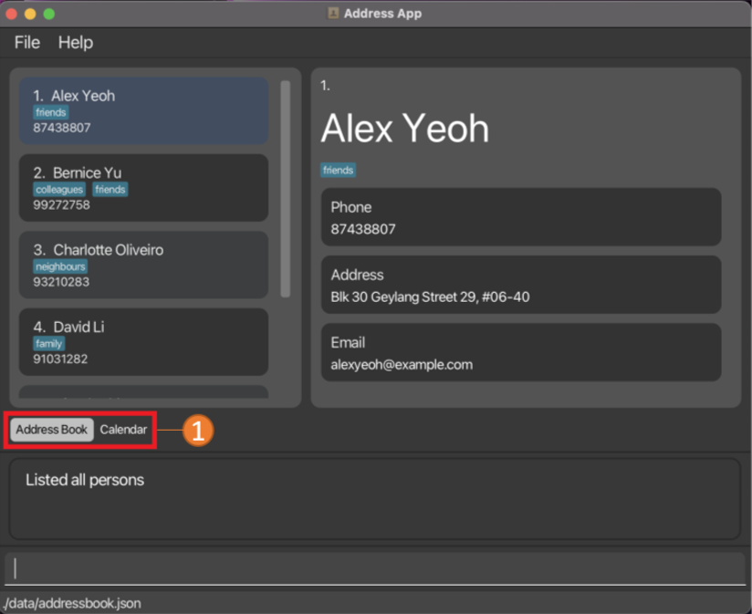
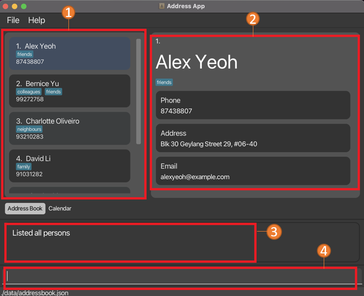
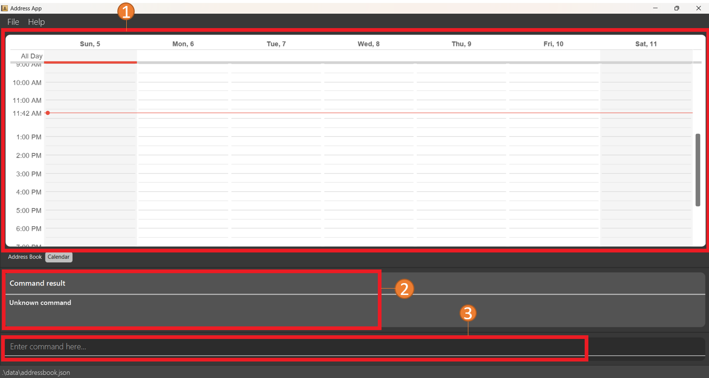

AddressBook Neo is a **desktop app for managing contacts, optimized for use via a Command Line Interface** (CLI) while still having the benefits of a Graphical User Interface (GUI). If you can type fast, it can get your contact management tasks done faster than traditional GUI apps.

Apart from being your all-encompassing address book, AddressBook Neo also has a calendar function for you to keep track of your daily schedule.

* Table of Contents
{:toc}

--------------------------------------------------------------------------------------------------------------------

## Getting started

1. Ensure you have Java `11` or above installed in your Computer.

2. Download the latest `addressbook.jar` from [here](https://github.com/se-edu/addressbook-level3/releases).

3. Copy the file to the folder you want to use as the _home folder_ for your AddressBook.

4. Open a command terminal, `cd` into the folder you put the jar file in, and use the `java -jar addressbook.jar` command to run the application. 
   A GUI similar to the below should appear in a few seconds. Note how the app contains some sample data. 
   

5. Type the command in the command box and press Enter to execute it. e.g. typing **`help`** and pressing Enter will open the help window. 
   Some example commands you can try:

   * `list` : Lists all contacts.

   * `add n/John Doe p/98765432 e/johnd@example.com a/John street, block 123, #01-01` : Adds a contact named `John Doe` to the Address Book.

   * `delete 3` : Deletes the 3rd contact shown in the current list.

   * `clear` : Deletes all contacts.

   * `exit` : Exits the app.

6. Refer to the [Address Book Features](#address-book-features) below for details of each command.

--------------------------------------------------------------------------------------------------------------------
## User Interface

1. Use these tabs to toggle between the Address Book and Calendar!

### UI Breakdown For `Address Book`

1. Current Displayed List
   * show contacts based on command input
   * contains the `index` you should use to refer to each contact
2. Information Of Specific Contact
   * displays all the saved information related to contact
   * toggle between different contacts by _clicking on them in the displayed list_
3. Command Results:
   * displays the result of input command
4. Command Line:
   * type command and press enter to execute it
   * refer to the [Address Book Features](#address-book-features ) below for possible commands to execute

### UI Breakdown For `Calendar`

1. Calender Display
   * displays all lessons and events you have saved
2. Command Results:
   * displays the result of input command
3. Command Line
   * type command and press enter to execute it
   * refer to the [Calendar Features](#calendar-features) below for possible commands to execute

____________________________________________________________________________________________________________________
## Address Book Features

**:information_source: Notes about the command format:** 

* Words in `UPPER_CASE` are the parameters to be supplied by the user. 
  e.g. in `add n/NAME`, `NAME` is a parameter which can be used as `add n/John Doe`.

* Items in square brackets are optional. 
  e.g `n/NAME [t/TAG]` can be used as `n/John Doe t/friend` or as `n/John Doe`.

* Items with `…`​ after them can be used multiple times including zero times. 
  e.g. `[t/TAG]…​` can be used as ` ` (i.e. 0 times), `t/friend`, `t/friend t/family` etc.

* Parameters can be in any order. 
  e.g. if the command specifies `n/NAME p/PHONE_NUMBER`, `p/PHONE_NUMBER n/NAME` is also acceptable.

* If a parameter is expected only once in the command but you specified it multiple times, only the last occurrence of the parameter will be taken. 
  e.g. if you specify `p/12341234 p/56785678`, only `p/56785678` will be taken.

* Extraneous parameters for commands that do not take in parameters (such as `help`, `list`, `exit` and `clear`) will be ignored. 
  e.g. if the command specifies `help 123`, it will be interpreted as `help`.

### Viewing Help : `help`

Don't know how to get started? Don't worry!

Simply use this command to get access to our help page!

>Command: `help`

### Adding A New Contact: `add`

Met a new friend?
Use this command to add him/her to your address book.

> Command: `add n/NAME p/PHONE_NUMBER e/EMAIL a/ADDRESS [t/TAG]…​`

Here are all the specifiers that can be used:

| Specifier | Name of Field                   | Optional? |
|-----------|---------------------------------|-----------|
| n         | name                            | No        |
| e         | Email address                   | Yes       |
| a         | Address                         | Yes       |
| m         | Major                           | Yes       |
| mt        | Mods Taken                      | Yes       |
| f         | Faculty                         | Yes       |
| p         | Photo                           | Yes       |
| g         | Gender                          | Yes       |
| t         | Tags                            | Yes       |
| c         | Preferred Communication Channel | Yes       |

:bulb: **Tip:**
A person can have any number of tags and modules taken(including 0). 

IMPT: If you want to add multiple tags or modules in one statement,
every tag or module has to have its corresponding specifier.

In the future, only modules that are a part of NUS' mod systems will be allowed. This is
to prevent any messiness and also allows for syncing with the calendar.

Examples:
* `add n/John Doe p/98765432 e/johnd@example.com a/John street, block 123, #01-01`
* `add n/Betsy Crowe t/friend e/betsycrowe@example.com mt/CS2030s mt/CS2103T`

### Listing All Contacts : `list`

Want to see all your contacts?

Use this command to gain access to all of them!

> Command: `list`

### Favourite A Contact : `fav`

Contact someone very frequently?

Use this command to favourite it so that you have easy access to it!

> Command: `fav INDEX`

Here are some important requirements for you to take note:

* `INDEX` refers to the index of the contact you wish to edit in the current displayed list.
  * `INDEX` must be a **positive integer**.

### Unfavourite A Contact : `unfav`

No longer contact someone as frequently as you used to?

Use this command to unfavourite it!

> Command: `unfav INDEX`

Here are some important requirements for you to take note:

* `INDEX` refers to the index of the contact you wish to edit in the current displayed list.
  * `INDEX` must be a **positive integer**.

### Editing a contact's details : `edit`

Learnt something new about your friend? Or perhaps he/she changed a particular detail?

Use this command to edit his/her details easily!

> Command: `edit INDEX [{SPECIFIER}/{DATA}]`

Here are some important requirements for you to take note:

* `INDEX` refers to the index of the contact you wish to edit in the current displayed list.
  * `INDEX` must be a **positive integer**.
* At least one field must be provided.
  * Note that when editing tags/mods taken, the existing tags/mods taken of/by the person will be removed

  _[i.e  adding of tags and mods taken are not cumulative]_
  * If you wish to remove all tags/mods from the person, simply type `t/` / `mt/`.
* We plan to make a new function in the future to make both tags and mods taken cumulative, stay tuned!

| Specifier | Name of Field                   | Optional? |
|-----------|---------------------------------|-----------|
| n         | name                            | No        |
| e         | Email address                   | Yes       |
| a         | Address                         | Yes       |
| m         | Major                           | Yes       |
| mt        | Mods Taken                      | Yes       |
| f         | Faculty                         | Yes       |
| p         | Photo                           | Yes       |
| g         | Gender                          | Yes       |
| t         | Tags                            | Yes       |
| c         | Preferred Communication Channel | Yes       |

Examples:
*  `edit 1 p/91234567 e/johndoe@example.com` Edits the phone number and email address of the 1st person to be `91234567` and `johndoe@example.com` respectively.
*  `edit 2 n/Betsy Crower t/` Edits the name of the 2nd person to be `Betsy Crower` and clears all existing tags.

### Finding Particular Contacts: `find`

Want to narrow down your displayed contacts to a certain few?

Use this command to find contacts whose names contain any of the given keywords!

> Command: `find KEYWORD [MORE_KEYWORDS]`

Here are some important requirements for you to take note:
* Only the name is searched.
* The search is **case-insensitive**.

    _[e.g `hans`,`Hans`, `HANS` are all equivalent]_
* The order of the keywords does not matter.

    _[e.g. `Hans Bo` will match `Bo Hans`]_

* Only full words will be matched

    _[e.g. `Han` will not match `Hans`]_
* Persons matching at least one keyword will be returned (i.e. `OR` search)

    _[e.g `Hans Bo` will return both `Hans Gruber`, `Bo Yang`]_

Examples:
* `find John` returns `john` and `John Doe`
* `find alex david` returns `Alex Yeoh`, `David Li`

### Deleting A Contact : `delete`

No longer interact with someone in your contacts?

Use this command to delete the specified contact from your address book.

> Command: `delete INDEX`

Here are some important requirements for you to take note:
* `INDEX` refers to the index of the contact you wish to delete in the current displayed list.
  * `INDEX` must be a **positive integer**.

Examples:
* `list` followed by `delete 2` deletes the 2nd person in the displayed list.
* `find Betsy` followed by `delete 1` deletes the 1st person in the results of the `find` command.

### Clearing all contacts : `clear`

Want to start from a clean slate?

Simply use this command to clear all contacts from your address book.

> Command: `clear`

### Switching between UI tabs: `tab`

Looking for a faster way to switch between the address book and the calendar?

Use this command to navigate to the specified tab.

> Command: `tab INDEX`

Here are some important requirements for you to take note:
* `INDEX` refers to the index of the tab to navigate to, shown before the name in the tab.
  * `INDEX` must be a positive integer.

Examples:
* `tab 1` switches to the address book tab.
* `tab 2` switches to the calendar tab.

### Exiting AddressBookNeo : `exit`

Finished what you needed to do?

Use this command to exit the application!

> Command: `exit`

### Address Book Command Summary

| Action     | Format, Examples                                                                                                                                                         |
|------------|--------------------------------------------------------------------------------------------------------------------------------------------------------------------------|
| **Add**    | `add n/NAME p/PHONE_NUMBER e/EMAIL a/ADDRESS [t/TAG]…​`   e.g., `add n/James Ho p/22224444 e/jamesho@example.com a/123, Clementi Rd, 1234665 t/friend t/colleague` |
| **Clear**  | `clear`                                                                                                                                                                  |
| **Delete** | `delete INDEX`  e.g., `delete 3`                                                                                                                                      |
| **Edit**   | `edit INDEX [n/NAME] [p/PHONE_NUMBER] [e/EMAIL] [a/ADDRESS] [t/TAG]…​`  e.g.,`edit 2 n/James Lee e/jameslee@example.com`                                           |  
| **Fav**    | `fav INDEX`  e.g., `fav 2`                                                                                                                                            |
| **Unfav**  | `unfav INDEX`  e.g., `unfav 2`                                                                                                                                        |
| **Find**   | `find KEYWORD [MORE_KEYWORDS]`  e.g., `find James Jake`                                                                                                               |
| **List**   | `list`                                                                                                                                                                   |
| **Help**   | `help`                                                                                                                                                                   |
| **Tab**    | `tab INDEX`  e.g., `tab 2`                                                                                                                                            |
| **Exit**   | `exit`                                                                                                                                                                   |

--------------------------------------------------------------------------------------------------------------------
## Calendar Features

**:information_source: Development of calendar commands is still a work in progress. Stay tune!** 

--------------------------------------------------------------------------------------------------------------------
## Data

### Saving the data

AddressBook data are saved in the hard disk automatically after any command that changes the data. There is no need for you to save manually.

### Editing the data file

AddressBook data are saved as a JSON file `[JAR file location]/data/addressbook.json`.

You are welcome to update the data directly by editing that data file.

:exclamation: **Caution:**
If your changes to the data file makes its format invalid, AddressBook Neo will discard all data and start with an empty data file at the next run.

--------------------------------------------------------------------------------------------------------------------
## FAQ

**Q**: How do I transfer my data to another Computer? 
**A**: Install the app in the other computer and overwrite the empty data file it creates with the file that contains the data of your previous AddressBook home folder.

--------------------------------------------------------------------------------------------------------------------
