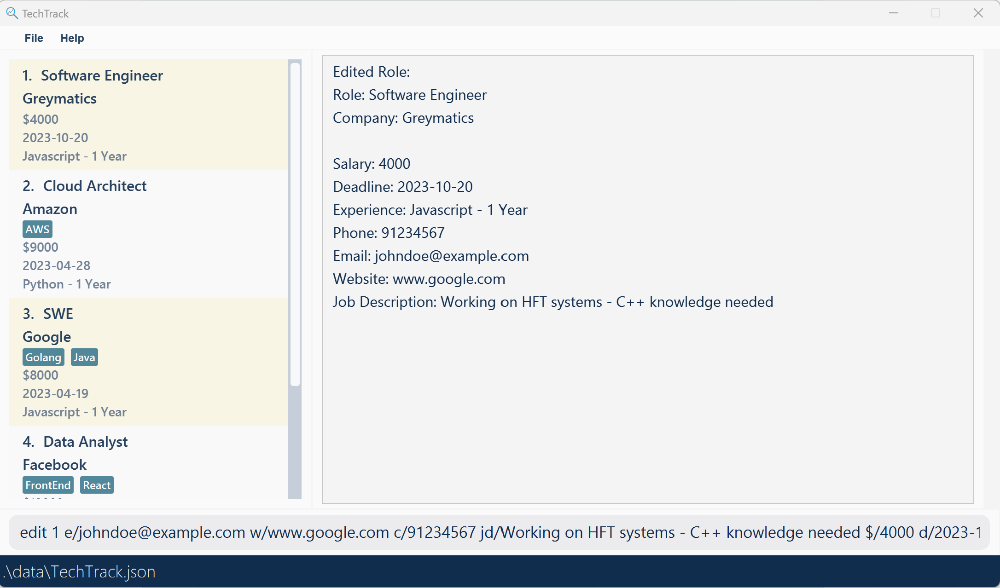
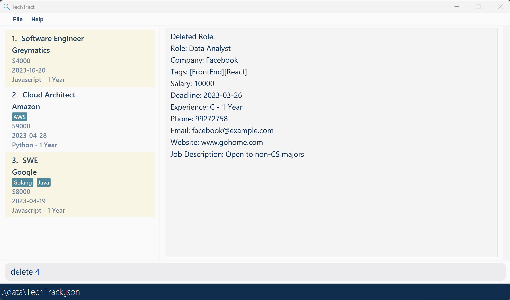
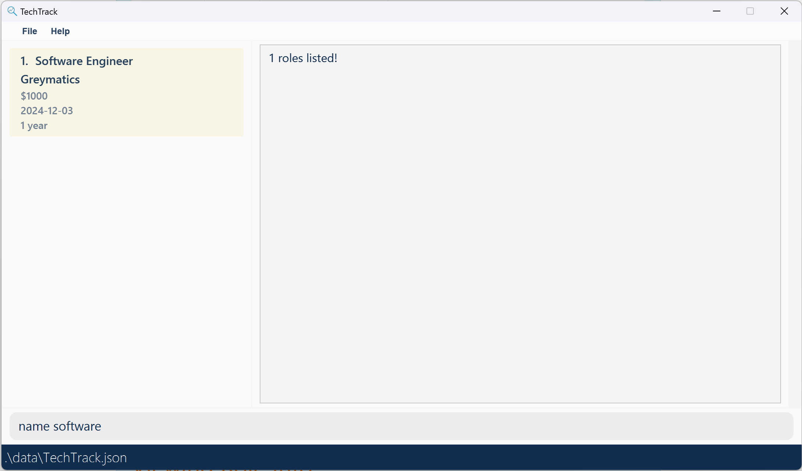
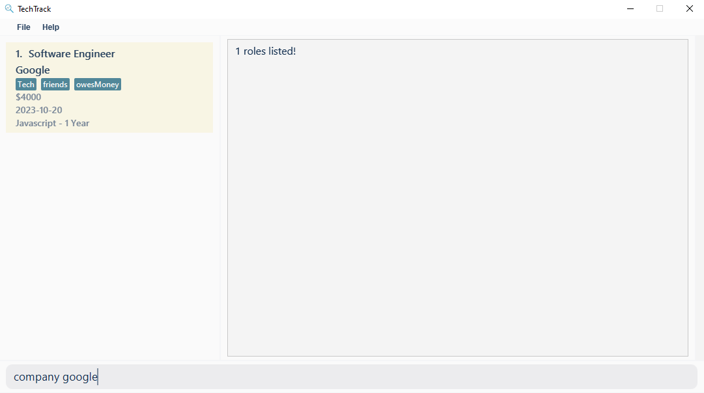
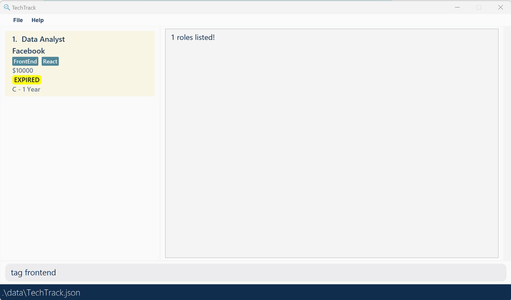

TechTrack is a powerful internship/job tracking application that combines the flexibility of a Command Line Interface (CLI) with the benefits of a Graphical User Interface (GUI).

Designed for computing students and professionals, TechTrack helps you manage your internship/job search project by tracking deadlines and information regarding various roles.
Its CLI interface is optimized for speed, efficiency, and ease of use, making it a valuable tool for students who are already familiar with CLI environments.

1. [Quick Start](#quick-start)
2. [Features](#features)
   1. [Creating Role Info](#creating-role-info)
      1. [Add Roles: `add`](#adding-a-role-add)
      2. [Edit Role: `edit`](#editing-a-role-edit)
      3. [Delete Role: `delete`](#deleting-a-role-delete)
   2. [Viewing Role Info](#viewing-role-info)
      1. [Find roles by name `name`](#find-roles-by-name-name)
      2. [Find roles by company `company`](#find-roles-by-company-company)
      3. [Find roles by tag `tag`](#find-roles-by-tag-tag)
      4. [Sorting a role by deadline `deadline`](#sorting-by-deadline-deadline)
      5. [Sorting a role by salary `salary`](#sorting-by-salary-salary)
      6. [Viewing a role `view`](#viewing-a-role-view)
   3. [General Commands](#general-commands)
      1. [List all roles `list`](#list-list)
      2. [Clear all roles `clear`](#clear-clear)
      3. [Help (Display command format) `help`](#help-help)
      4. [Exit TechTrack `exit`](#exit-exit)
   4. [Editing raw data](#editing-raw-data)
5. [FAQ](#faq)
6. [Command Summary](#command-summary)

# Quick Start
1. Ensure you have Java `11` or above installed in your Computer.
2. Download the latest [TechTrack.jar](https://github.com/AY2223S2-CS2103-W16-2/tp/releases) from here.
3. Copy the file to the folder you want to use as the home folder for TechTrack.
4. Open a command terminal, `cd` into the folder you put the jar file in, and use the `java -jar TechTrack.jar` command to run the application.
5. A GUI similar to the below should appear in a few seconds. Note how the app contains some sample data.

## Features

This section guides you on how to use features available in TechTrack.

**The features of TechTrack can be split into 3 main categories:**

* [Creating Role Info](#creating-role-info)
* [Viewing Role Info](#viewing-role-info)
* [General Commands](#general-commands)

## Creating Role Info
The commands in this segment are focused on creating, editing and removing data to and from the application.
These commands are:

* [Adding a Role](#adding-a-role-add)
* [Editing a Role](#editing-a-role-edit)
* [Deleting a Role](#deleting-a-role-delete)

### Adding a role: `add`

Adds a role to TechTrack.

Format: `add {Prefix}/{Parameter}…​`

Example: `add n/Software Engineer c/98765432 e/google@example.com coy/Google t/Java t/Golang w/www.google.com jd/Data Engineering team - penultimate students preferred $/4000 d/2023-10-20 x/Javascript - 1 Year `

- Adding multiple similar parameters will take the details of latter command.

   Example: `add n/Software Engineer c/98765432 e/google@example.com coy/Google t/Java t/Golang w/www.google.com jd/Data Engineering team - penultimate students preferred $/4000 d/2023-10-20 x/Javascript - 1 Year n/Frontend Developer`
   
   In this case, the name 'Software Engineering' will be replaced by 'Frontend Developer'.

**The prefixes and their respective parameters are as follows:**

| Required | Prefix | Parameter            | Restrictions                                                      |
|----------|--------|----------------------|-------------------------------------------------------------------|
| `Yes`    | n      | NAME                 | Alphanumeric characters and spaces only. Should not just contain a space.                           |
| `Yes`    | c      | CONTACT              | Numbers only and at least 3 digits.                               |
| `Yes`    | e      | EMAIL                | Must follow a valid email format. See below for more information. |
| `Yes`    | coy    | COMPANY              | Alphanumeric characters and spaces only. Should not just contain a space.                                             |
| `No`     | t      | TAG                  | Alphanumeric characters and spaces only. Should not just contain a space. Multiple tag can be added.                                          |
| `Yes`     | w      | WEBSITE              | Must be in www.(Any Characters).com                                |
| `Yes`    | jd     | JOB DESCRIPTION      | Alphanumeric characters and spaces only. Should not just contain a space.                                             |
| `Yes`    | $      | SALARY               | Positive integers only.                                           |
| `Yes`    | d      | APPLICATION DEADLINE | Follows YYYY-MM-DD format and must not be over current date.      |
| `Yes`    | x      | EXPERIENCE REQUIRED  | Alphanumeric characters and spaces only. Should not just contain a space.    

**Email Format**
* Emails should be of the format local-part@domain and adhere to the following constraints:
* 1. The local-part should only contain alphanumeric characters and these special characters, excluding the parentheses, (+_.-). The local-part may not start or end with any special characters.
* 2. This is followed by a '@' and then a domain name. The domain name is made up of domain labels separated by periods.
* The domain name must:
    * end with a domain label at least 2 characters long
    * have each domain label start and end with alphanumeric characters
    * have each domain label consist of alphanumeric characters, separated only by hyphens, if any.|

### Editing a Role: `edit`
Edit any parameters of a preexisting role. At least one filed must be provided `edit 1 n/Bob`

Format: `edit {index} {Prefix}/{Parameter}…​`

Example: `edit 1 e/johndoe@example.com w/www.google.com c/91234567 jd/Working on HFT systems - C++ knowledge needed 
$/4000 d/2023-10-20 x/Javascript - 1 Year`

| Required | Prefix | Parameter            | Restrictions                                                      |
|----------|--------|----------------------|-------------------------------------------------------------------|
| `No`    | n      | NAME                 | Alphanumeric characters and spaces only. Should not just contain a space.                           |
| `No`    | c      | CONTACT              | Numbers only and at least 3 digits.                               |
| `No`    | e      | EMAIL                | Must follow a valid email format. See below for more information. |
| `No`    | coy    | COMPANY              | Alphanumeric characters and spaces only. Should not just contain a space.                                             |
| `No`     | t      | TAG                  | Alphanumeric characters and spaces only. Should not just contain a space. Multiple tag can be added.                                          |
| `No`     | w      | WEBSITE              | Must be in www.(Any Characters).com                                |
| `No`    | jd     | JOB DESCRIPTION      | Alphanumeric characters and spaces only. Should not just contain a space.                                             |
| `No`    | $      | SALARY               | Positive integers only.                                           |
| `No`    | d      | APPLICATION DEADLINE | Follows YYYY-MM-DD format and must not be over current date.      |
| `No`    | x      | EXPERIENCE REQUIRED  | Alphanumeric characters and spaces only. Should not just contain a space.  

**Although it states all not required, at least a single field has to be present to edit the role.

**Email Format**
* Emails should be of the format local-part@domain and adhere to the following constraints:
* 1. The local-part should only contain alphanumeric characters and these special characters, excluding the parentheses, (+_.-). The local-part may not start or end with any special characters.
* 2. This is followed by a '@' and then a domain name. The domain name is made up of domain labels separated by periods.
* The domain name must:
    * end with a domain label at least 2 characters long
    * have each domain label start and end with alphanumeric characters
    * have each domain label consist of alphanumeric characters, separated only by hyphens, if any.|

Example 1:

Key in `edit 1 n/Software Engineer`.

### Deleting a role: `delete`
Deletes the role from the current list of roles. Uses a 1-based index.

Format: `delete {index}`

Example: `delete 1`

## Viewing Role Info
The commands in this segment are focused on viewing formats and details of the preexisting roles.
These commands are:

* [Find roles by name](#find-roles-by-name-name)
* [Find roles by company](#find-roles-by-company-company)
* [Find roles by tag](#find-roles-by-tag-tag)
* [Sorting a role by deadline](#sorting-by-deadline-deadline)
* [Sorting a role by salary](#sorting-by-salary-salary)
* [Viewing a role](#viewing-a-role-view)

### Find roles by Name: `name`
Searches for roles with the provided names. If multiple keywords inputted, there may be multiple results that contains these key words.

Format: `name {keywords}...`

Example: `name analyst engineer data`

### Find roles by Company: `company`
Searches for roles with the provided companies.

Format: `company {keywords}...`

Example: `company Google`

### Find roles by Tag: `tag`
Searches for roles with the provided tag.

Format: `tag {keyword}`

Example: `tag frontend`

### Sorting by Deadline: `deadline`
Sort roles based on deadline, in ascending/descending orderParser.

Format: `deadline asc/desc`

Example 1: `deadline asc`

Example 2: `deadline desc`

### Sorting by Salary: `salary`
Sort roles based on salary, in ascending/descending orderParser. For ascending, the role with the lowest salary will be displayed at the top, while for descending, the role with the highest salary will be displayed at the top.

Format: `salary asc/desc`

Example 1: `salary asc`

Example 2: `salary desc`

### Viewing a role: `view`
Displays more details about a particular role.

Format: `view {index}`

## General Commands

* [List all roles](#list-list)
* [Clear all roles](#clear-clear)
* [Help (Display command format)](#help-help)
* [Exit TechTrack](#exit-exit)

### List: `list`
Lists all roles available in TechTrack.

### Clear: `clear`
Deletes all roles available in TechTrack.

### Help: `help`
Display commands that are available in TechTrack and the proper format for usage. Also links to this user guide.

### Exit: `exit`
Exits and closes TechTrack.

## Editing raw data
You can directly edit TechTrack's data file after running and exiting the app. 

**Important Note:** if the data file is in an invalid format, TechTrack will discard that data file and start with an empty list of roles.

## FAQ
Q: How do I transfer my data to another Computer?
A: Install the app in the other computer and overwrite the empty data file it creates with the file that contains the data of your previous TechTrack home folder.

## Command Summary

| Action   | Format                                                             | Example                                                                                                                                                                                                   |
|----------|--------------------------------------------------------------------|-----------------------------------------------------------------------------------------------------------------------------------------------------------------------------------------------------------|
| add      | add {Prefix}/{Parameter}…​ (all parameters are required)           | `add n/Software Engineer c/98765432 e/google@example.com coy/Google t/Java t/Golang w/www.google.com jd/Data Engineering team - penultimate students preferred $/4000 d/2023-10-20 x/Javascript - 1 Year` |
| edit     | edit {index} {Prefix}/{Parameter}…​ (only 1 parameter is required) | `edit 1 e/johndoe@example.com w/www.google.com c/91234567 jd/Working on HFT systems - C++ knowledge needed $/4000 d/2023-10-20 x/Javascript - 1 Year`                                                     |
| delete   | delete {index}                                                     | `delete 1`                                                                                                                                                                                                |
| name     | name {keywords}...                                                 | `name analyst engineer data`                                                                                                                                                                              |
| company  | company {keywords}...                                              | `company Google`                                                                                                                                                                                          |
| tag      | tag  {keywords}...                                                 | `tag frontend`                                                                                                                                                                                            |
| deadline | deadline {asc/desc}                                                | `deadline asc`                                                                                                                                                                                            |
| salary   | salary {asc/desc}                                                  | `salary desc`                                                                                                                                                                                             |
| view     | view {index}                                                       | `view 1`                                                                                                                                                                                                  |
| list     | list                                                               | `list`                                                                                                                                                                                                    |
| clear    | clear                                                              | `clear`                                                                                                                                                                                                   |
| help     | help                                                               | `help`                                                                                                                                                                                                    |
| exit     | exit                                                               | `exit`                                                                                                                                                                                                    |

**The prefixes and their respective parameters are as follows:**

| Required | Prefix | Parameter            | Restrictions                                                      |
|----------|--------|----------------------|-------------------------------------------------------------------|
| `Yes`    | n      | NAME                 | Alphanumeric characters and spaces only. Should not just contain a space.                           |
| `Yes`    | c      | CONTACT              | Numbers only and at least 3 digits.                               |
| `Yes`    | e      | EMAIL                | Must follow a valid email format. See below for more information. |
| `Yes`    | coy    | COMPANY              | Alphanumeric characters and spaces only. Should not just contain a space.                                             |
| `No`     | t      | TAG                  | Alphanumeric characters and spaces only. Should not just contain a space.                                              |
| `No`     | w      | WEBSITE              | Must be in www.{Any character}.com                                |
| `Yes`    | jd     | JOB DESCRIPTION      | Alphanumeric characters and spaces only. Should not just contain a space.                                             |
| `Yes`    | $      | SALARY               | Positive integers only.                                           |
| `Yes`    | d      | APPLICATION DEADLINE | Follows YYYY-MM-DD format and must not be over current date.      |
| `Yes`    | x      | EXPERIENCE REQUIRED  | Alphanumeric characters and spaces only. Should not just contain a space.                                              |
