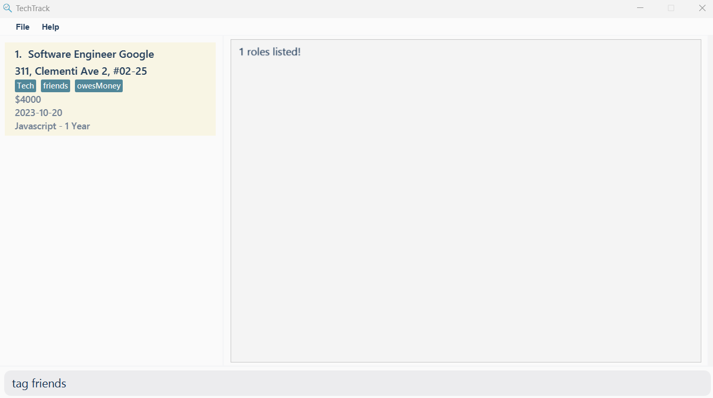
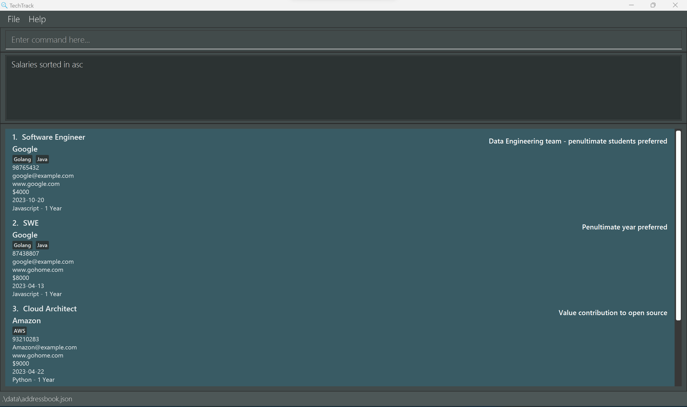
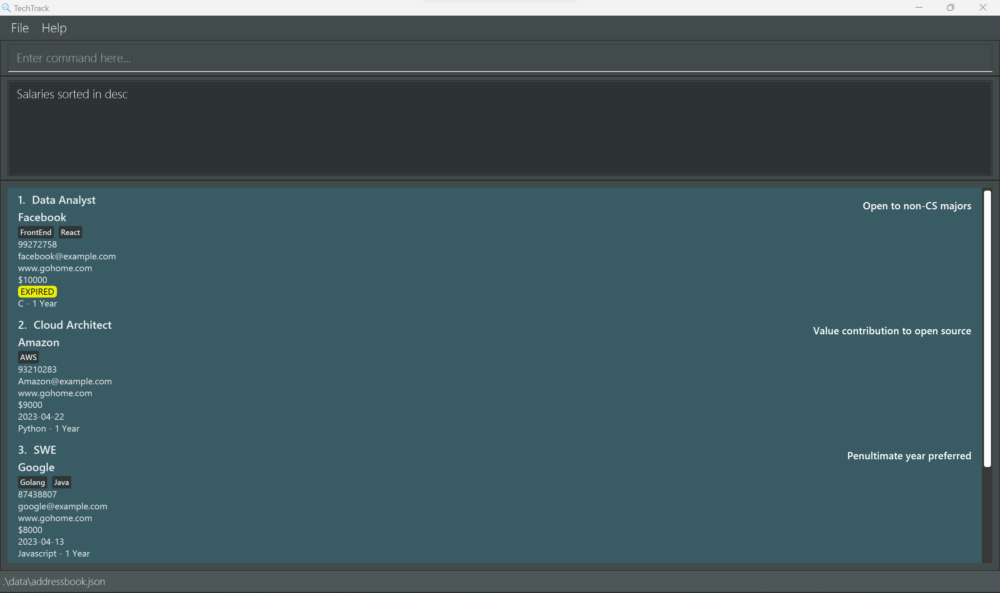
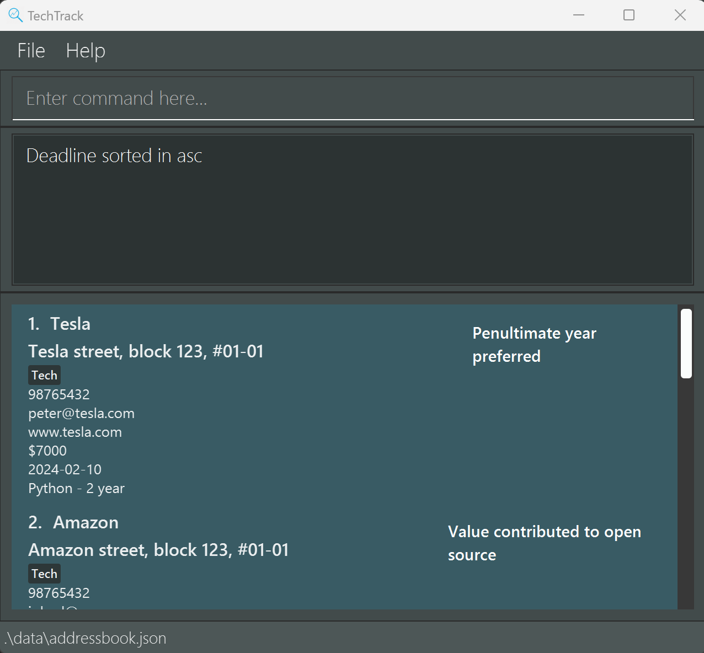
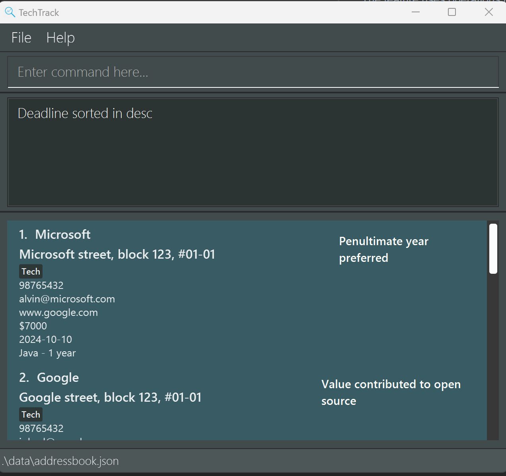

# TechTrack User Guide

TechTrack is a powerful internship/job tracking application that combines the flexibility of a Command Line Interface (CLI) with the benefits of a Graphical User Interface (GUI).

Designed for computing students and professionals, TechTrack helps you manage your internship search project by setting goals, tracking deadlines, and providing clear feedback on your progress. Its CLI interface is optimized for speed, efficiency, and ease of use.

1. [Quick Start](#quick-start)
2. [Features](#features)
   1. [Creating Role Info](#creating-role-info)
      1. [Add Roles: `add`](#adding-a-role-add)
      2. [Edit Role: `edit`](#editing-a-role-edit)
      3. [Delete Role: `delete`](#deleting-a-role-delete)
   2. [Viewing Role Info](#viewing-role-info)
      1. [Find roles by name](#find-roles-by-name)
      2. [Find roles by company](#find-roles-by-company)
      3. [Find roles by tag](#find-roles-by-tag)
      4. [Sorting a role by deadline](#sorting-by-deadline)
      5. [Sorting a role by salary](#sorting-by-salary)
      6. [Viewing a role](#viewing-a-role)
   3. [General Commands](#general-commands)
      1. [List all roles](#list-list)
      2. [Clear all roles](#clear-clear)
      3. [Help (Displays user guide)](#help-help)
      4. [Exit TechTrack](#exit-exit)
5. [FAQ](#faq)
6. [Command Summary](#command-summary)

# Quick Start
Ensure you have Java `11` or above installed in your Computer.
Download the latest `TechTrack.jar` from here.
Copy the file to the folder you want to use as the home folder for your RoleBook.
Open a command terminal, `cd` into the folder you put the jar file in, and use the `java -jar TechTrack.jar` command to run the application.
A GUI similar to the below should appear in a few seconds. Note how the app contains some sample data.

## Features

This section guides you on how to use features available in TechTrack.

**The features of TechTrack can be split into 3 main categories:**

* [Creating Role Info](#creating-role-info)
* [Viewing Role Info](#viewing-role-info)
* [General Commands](#general-commands)

[back to top](#techtrack-user-guide)

## Creating Role Info
The commands in this segment are focused on creating, editing and removing data to and from the application.
These commands are:

* [Adding a Role](#adding-a-role-add)
* [Editing a Role](#editing-a-role-edit)
* [Deleting a Role](#deleting-a-role-delete)

### Adding a role: `add`

Adds a role to TechTrack.

Format: `add {Prefix}/{Parameter}…​`

Example: `add n/Software Engineer c/98765432 e/google@example.com coy/Google t/Java t/Golang w/www.google.com jd/Data Engineering team - penultimate students preferred $/4000 d/2023-10-20 x/Javascript - 1 Year `

**The prefixes and their respective parameters are as follows:**

| Required | Prefix | Parameter            | Restrictions                                                        |
|----------|--------|----------------------|---------------------------------------------------------------------|
| `Yes`    | n      | NAME                 | Alphanumeric characters and spaces only.                            |
| `Yes`    | c      | CONTACT              | Numbers only and at least 3 digits.                                 |
| `Yes`    | e      | EMAIL                | Must follow a valid email format. See below for more information.   |
| `Yes`    | coy    | COMPANY              | At least 1 alphanumeric character.                                  |
| `Yes`    | jd     | JOB DESCRIPTION      | At least 1 alphanumeric character.                                  |
| `No`     | t      | TAG                  | -                                                                   |
| `Yes`    | $      | SALARY               | Positive integers only.                                             |
| `Yes`    | d      | APPLICATION DEADLINE | Follows YYYY-MM-DD format (i.e. `2023-10-20`). and must not be over |
| `Yes`    | x      | EXPERIENCE REQUIRED  | At least 1 character                                                |

### Editing a Role: `edit`:
Edit any parameters of a preexisting role.

Format: `edit {index} {Prefix}/{Parameter}…​`

Example: `edit 1 e/johndoe@example.com w/www.google.com c/91234567 jd/Working on HFT systems - C++ knowledge needed
$/4000 d/2023-10-20 x/Javascript - 1 Year`

### Deleting a role `delete`:
Deletes the role from the current list of roles. Uses a 1-based index.

Format: `delete {index}`

Example: `delete 1`

## Viewing Role Info
The commands in this segment are focused on viewing formats and details of the preexisting roles.
These commands are:

* [Find roles by name](#find-roles-by-name)
* [Find roles by company](#find-roles-by-company)
* [Find roles by tag](#find-roles-by-tag)
* [Sorting a role by deadline](#sorting-by-deadline)
* [Sorting a role by salary](#sorting-by-salary)
* [Viewing a role](#viewing-a-role)

### Find roles by name
Searches for roles with the provided names.

Format: `name {keywords}...`

Example: `name analyst engineer data`

### Find roles by company
Searches for roles with the provided companies.

Format: `company {keywords}...`

Example: `company Google`

### Find roles by tag
Searches for roles with the provided tag.

Format: `tag {keyword}`

Example: `tag Tech`

### Sorting by Salary
Sort roles based on salary, in ascending/descending order.

Format: `salary asc/desc`

Example 1: `salary asc`

Example 2: `salary desc`

### Sorting by Deadline
Sort roles based on deadline, in ascending/descending order.

Format: `deadline asc/desc`

Example 1: `deadline asc`

Example 2: `deadline desc`

### Viewing a role
Displays more details about a particular role.

Format: `view {index}`

## General Commands

* [List all roles](#list-list)
* [Clear all roles](#clear-clear)
* [Help (Displays user guide)](#help-help)
* [Exit TechTrack](#exit-exit)

### List: `list`
Lists all roles available in TechTrack.

### Clear: `clear`
Deletes all roles available in TechTrack.

### Help: `help`
Display commands that are available in TechTrack and the proper format for usage. Also links to this user guide.

### Exit: `exit`
Exits TechTrack.

## FAQ
Q: How do I transfer my data to another Computer?
A: Install the app in the other computer and overwrite the empty data file it creates with the file that contains the data of your previous TechTrack home folder.

## Command Summary

| Action   | Format, Examples                        |
|----------|-----------------------------------------|
| add      | add roleID (e.g. add 221574)            |
| delete   | delete roleID (e.g. delete 221574)      |
| view     | view roleID (e.g. view 221574)          |
| list     | list                                    |
| exit     | bye                                     |
| salary   | salary asc/desc (e.g. salary asc)       |
| deadline | deadline asc/desc (e.g. deadline asc)   |
| company  | company {keyword} (e.g. company google) |
| tag      | tag  {keyword} (e.g. tag tech)          |
