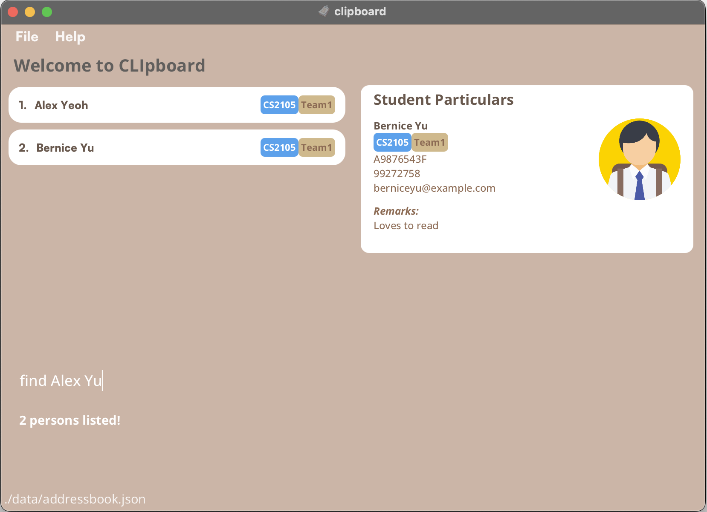

Group: AY2223S2-CS2103T-T15-4

# User Guide

## Introduction

CLIpboard is a desktop app that helps educators (like you!), especially those that tutor multiple classes, by managing their students’ particulars<strong> in an organised manner.</strong>

CLIpboard is optimized **for use via a Command Line Interface** (CLI) while still having the benefits of a Graphical User Interface (GUI). It can get your student management tasks done faster than traditional GUI apps. CLIpboard is optimised for keyboard users, so if you can type fast, CLIpboard can work even faster.
* Table of Contents
{:toc}


## <br>Quick Start

1. Ensure you have Java 11 or above installed in your Computer.
2. Download the latest clipboard.jar from [here](https://github.com/AY2223S2-CS2103T-T15-4/tp/releases).
3. Copy the file to the folder you want to use as the *home folder* for your CLIpboard.
4. Open a command terminal, cd into the folder you put the jar file in, and use the java -jar clipboard.jar command to run the application.&nbsp;

&emsp;&emsp;e.g. your clipboard.jar is stored in user/app/task/,&nbsp; you run cd user/app/task/
<br>&emsp;&emsp;A GUI similar to the above should appear in a few seconds. Note how the app contains some sample data.

5. Type the command in the command box and press Enter to execute it. e.g. typing <strong>help </strong>and pressing Enter will open the help window.
    <br>Some example commands you can try:
    1. `list` : Lists all students.
    2. `add n/John Doe p/98765432 e/johnd@example.com sid/A1234567X m/CS2103T` : Adds a student named John Doe with the particulars to the CLIpboard.
    4. `delete 3` : Deletes the 3rd student shown in the current list.
    5. `exit` : Exits the app.
6. Refer to the [<ins>Commands</ins>](https://docs.google.com/document/d/129glYXctEtL77of9dMmzea-TjVfZh727fVPrv_e9AyI/edit#bookmark=id.1r9lnvft19co) list below for a detailed description&nbsp; of of each command.

## Commands

List of commands:

- Adding
- Deleting
- Listing students
- Show
- Exit

### Adding a student: `add`

Adds a student into the student roster.

Format: 
```
add n/<NAME> p/<PHONE_NUMBER> e/<EMAIL> sid/<STUDENT_NUMBER> m/<MODULES> [t/<TAG>]
```

Examples:
- `add n/John Doe p/98765432 e/johnd@example.com sid/A1234567X m/CS2103T`

### Deleting a student: `delete`

Deletes a student from the student roster.

Format: 
```
delete <INDEX>
```

Examples:
- `delete 1`

### Editing a student: `edit`

Edits an existing student in the address book.

Format:
```
edit <INDEX> [n/<NAME>] [p/<PHONE_NUMBER>] [e/<EMAIL>] [sid/<STUDENT_NUMBER>] [m/<MODULES>] [t/<TAG>]
```

Examples:
- `delete 1`

### Listing all students: `list`

Lists all students in the student roster.

Format:
```
list
```


### View a student's information: `view`

Views personal information for a particular student.

Format:
```
view <INDEX>
```

Examples:
- `view 1`


### Finding students by name: `find`

Finds students whose names contain any of the given keywords.

Format:
```
find <KEYWORDS> [<MORE_KEYWORDS>]
```

Examples:
- `find John` returns John
- `find Alex Yu` returns `Alex Yeoh`, `Bernice Yu`


### Clearing all entries: `clear`

Format: 
```
clear
```

### Upload a student's photo: `upload`

Uploads a student's photo to be displayed on the student roster.

Format:
```
upload <FILE_PATH>
```
<div markdown="span" class="alert alert-primary">:bulb: **Tip:**
Only images of file type .png is accepted
</div>

Examples:
- `upload /Users/AlexYeoh/Desktop/A0123456X.png`

### Exiting the program: exit

Exits the program.

Format:
```
exit
```
