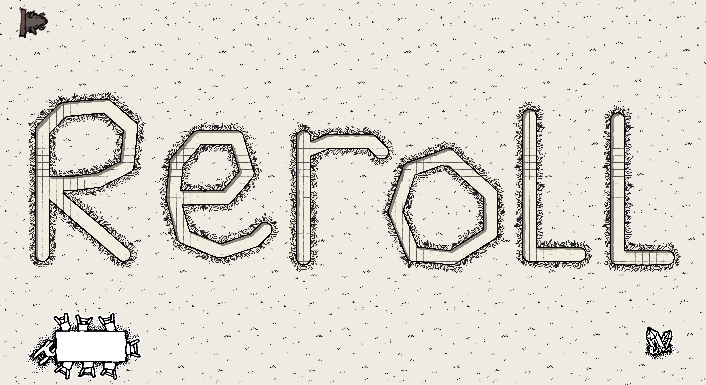

> A Desktop App for managing TTRPGs

 

  
<h3 align="center">Manage your TTRPGs easily.</h3>
  

    A simple yet powerful way to manage your next playthrough
     
    <a href="https://nus-cs2103-ay2223s2.github.io/tp/"><strong>Explore the docs »</strong></a>
     
     
    <a href="#tasks">Features</a>
    ·
    <a href="#summary">Commands</a>
    ·
    <a href="#FAQ">FAQ</a>
    ·
    <a href="https://github.com/AY2223S2-CS2103T-T15-1/tp/blob/master/docs/AboutUs.md">Meet the Team</a>
     
    🎉 Version 1.2.1 is out. Check out the latest release
    <a href="https://github.com/AY2223S2-CS2103T-T15-1/tp/releases/">here</a>.
     
     
    
    
    
  

Reroll is a **desktop app for managing tabletop RPG character, monster and item sheets, optimized for use via a Command Line Interface** (CLI) while still having the benefits of a Graphical User Interface (GUI). If you can type fast, Reroll can get your entity management tasks done faster than traditional GUI apps.

* Table of Contents
{:toc}

--------------------------------------------------------------------------------------------------------------------

## Quick start

1. Ensure you have Java `11` or above installed in your Computer.

1. Download the latest `reroll.jar` from [here](https://github.com/AY2223S2-CS2103T-T15-1/tp/releases/).

1. Copy the file to the folder you want to use as the _home folder_ for Reroll.

1. Open a command terminal, `cd` into the folder you put the jar file in, and use the `java -jar reroll.jar` command to run the application. 
   A GUI similar to the below should appear in a few seconds. Note how the app contains some sample data. 
   

1. Type the command in the command box and press Enter to execute it. e.g. typing **`help`** and pressing Enter will open the help window. 
   Some example commands you can try:

   * `make char John Cena` : Adds a character sheet named `John Cena` to the database.
   
   * `edit char John Cena` : Enters edit mode for a character named `John Cena`.

   * `delete char John Cena` : Deletes previously created character `John Cena`.

   * `list char` : Displays a list of all character entities.
   
   * `template orc John Cena`: Create a character sheet named `John Cena` based on 
   a pre-existing character template called `orc`.
   
   * `clear all` : Deletes all entity sheets.

   * `exit` : Exits the app.

1. Refer to the [Features](#features) below for details of each command.

--------------------------------------------------------------------------------------------------------------------

## Entity classifications
There are 3 different entity classifications in Reroll, each with their own set of fields to track.

`Character` or `char` in short refers to characters whose actions are controlled by players instead of the game master.

`Mob` refers to hostile non-playable characters which are controlled by the game master,
meant to be defeated by player characters.

`Item` refers to equipment such as armour, and miscellaneous tools. These are mainly dropped by mobs and
can be used by the player characters.

The definitive list of the different values each entity has:

| Character  | Mob              | Item   |
|----------------------|------------------|--------|
| Name                 | Name             | Name   | 
| Strength             | Strength         | Cost   |
| Dexterity            | Dexterity        | Weight | 
| Intelligence         | Intelligence     | Tags   |
| Level                | Challenge Rating |        |
| XP                   | Legendary        |        |
| Tags                 | Tags             |        |

## Templates

`Template` refers to pre-determined characters that can be used to quickly generate characters
with a preferred stat distribution. Templates are pre-determined and cannot be created/edited/deleted by the user.

<h2 id="tasks"></h2>

## Features

**:information_source: Notes about the command format:** 

* Words in `UPPER_CASE` are the parameters to be supplied by the user. 
  e.g. in `make CLASSIFICATION NAME`, `CLASSIFICATION` and `NAME` are parameters which can be used as `add item gilded dagger`.

* CLASSIFICATION can be the following: . 
  Item: `item`, Monster:`mob`, Character: `char`

* Extraneous parameters for commands that do not take in parameters (such as `help` or `exit`) will be ignored. 
  e.g. if the command specifies `help 123`, it will be interpreted as `help`.

* Entities in Reroll are identified by classification and name. Entities with the same name but different classification are valid.

### Viewing help : `help`

Shows a message explaning how to access the help page.

Format: `help`

### Making an entity: `make`

Adds a new entity into the database.

Format: `make CLASSIFICATION NAME`

Examples:
* `make char John Cena`
* `make item Sword`

### Listing all entities of a classification : `list`

Shows a list of all entities in Reroll's database.

Format: `list CLASSIFICATION`

Examples:
* `list char` shows a list of all characters

### View an entity's details: `view`

A detailed view of a single entity which shows all fields.

Examples:
* `view char John Cena` shows a detailed view of the character named John Cena.

Format: `view CLASSIFICIATION NAME`

Detailed view may be left by entering the command: `back` or `b` while in detailed view.

### Editing an entity : `edit`

Enter into edit mode for the specified entity.

Format: `edit CLASSIFICATION NAME`

* In edit mode, changes can be made with the following format:  
  * `FIELD NEW_VALUE`
  * e.g. `name gilded staff` or `level 9000`
  * If the specified field is unavailable (i.e. hp of an item), no values will be changed.
* Edit mode may be left by entering the command: `back` or `b` while in edit mode.

### Filter entities by tags : `filter`

Finds entities who contain the given tags

Format: `filter TAG [MORE_TAGS]`

### Locating Entity by name: `find`

Finds Entity whose names contain any of the given keywords.

Format: `find KEYWORD [MORE_KEYWORDS]`

* The search is case-insensitive. e.g `hans` will match `Hans`
* The order of the keywords does not matter. e.g. `Hans Bo` will match `Bo Hans`
* Only the name is searched.
* Only full words will be matched e.g. `Han` will not match `Hans`
* Persons matching at least one keyword will be returned (i.e. `OR` search).
  e.g. `Hans Bo` will return `Hans Gruber`, `Bo Yang`

### Deleting an entity : `delete`

Deletes the specified entity from Reroll's database.

Format: `delete CLASSIFICATION NAME`

* Deletes the entity with both the specified `CLASSIFICATION` and `NAME`.

Examples:
* `delete char John Cena` will delete a `Character` with the exact name `John Cena`.

### Show templates : `show`

Shows all template names.

### Make new character from a template: `template`

Creates a new Character from a pre-determined template

Format: `template TEMPLATE_NAME NAME`

Examples:
* `template orc John Cena` will create a new `Character` named `John Cena` using the template called `orc`

### Clearing all entries : `clear all`

Clears all entries from the database.

Format: `clear all`

### Clearing selected entries : `clear selected`

Clear all entries currently shown on Reroll.

Format: `clear selected`

### Exiting the program : `exit`

Exits the program.

Format: `exit`

### Saving the data

Reroll's database is saved in the hard disk automatically after any command that changes the data. There is no need to save manually.

### Editing the data file

Reroll's data is saved as a JSON file `[JAR file location]/data/reroll.json`. Advanced users are welcome to update data directly by editing that data file.

:exclamation: **Caution:**
If your changes to the data file makes its format invalid, Reroll will discard all data and start with an empty data file at the next run.

### Archiving data files `[coming in v2.0]`

_Details coming soon ..._

--------------------------------------------------------------------------------------------------------------------
<h2 id="FAQ"></h2>

## FAQ

**Q**: How do I transfer my data to another Computer? 
**A**: Install the app in the other computer and overwrite the empty data file it creates with the file that contains the data of your previous Reroll home folder.

--------------------------------------------------------------------------------------------------------------------
## Short-form commands 

To aid expert users, commonly used commands and fields have short-form variants that can be used instead.

| Reference | Full | Short-form |
| - | - | - |
| Make command | make | m |
| Edit command | edit | e |
| Delete command | delete | d |
| List command | list | l |
| Character | char | c |
| Mob | mob | m |
| Item | item | i |
| Template command | template | t |
| Strength | strength | s |
| Dexterity | dexterity | d |
| Level | level | lvl |
| Name | name | n |
| Tags | tags | t | 
| Inventory | inventory | inv |

Example: `make char John Cena` -> `m c John Cena`

--------------------------------------------------------------------------------------------------------------------
<h2 id="summary"></h2>

## Command summary

| Action                        | Format, Examples                                                    |
|-------------------------------|---------------------------------------------------------------------|
| **Make**                      | `make CLASSIFICATION NAME`   e.g., `make char BigMcLargeHuge`    |
| **Clear All**                 | `clear all`                                                         |
| **Clear Selected**            | `clear selected`                                                    |    
| **Delete**                    | `delete CLASSIFICATION NAME`  e.g., `delete char BigMcLargeHuge` |
| **Enter Edit Mode**           | `edit CLASSIFICATION NAME`  e.g.,`edit char BigMcLargeHuge`      |
| **Edit field (in Edit Mode)** | `FIELD NEW_VALUE`   e.g., `name SmallMcTinyMicro`                |
| **Find**                      | `find KEYWORD [MORE_KEYWORDS]`  e.g., `find Large`               |
| **Show templates**            | `show`                                                              |
| **Template**                  | `template TEMPLATE_NAME NAME`   e.g. `template orc John Cena`    |
| **View**                      | `view CLASSIFICATION NAME`   e.g. `view char John Cena`          |
| **List entities**             | `list CLASSIFICATION`   e.g., `list item`                        |
| **Help**                      | `help`                                                              |
| **Filter**                    | `filter TAG [MORE_TAG]`   e.g., `filter elite`                   |
