* Table of Contents
{:toc}

# **Introduction**

{{ site.data.techtrack.about.summary }}

# **Quick Start**
1. Ensure you have Java `11` or above installed in your Computer.
2. Download the latest [TechTrack.jar](https://github.com/AY2223S2-CS2103-W16-2/tp/releases) from here.
3. Copy the file to the folder you want to use as the home folder for TechTrack.
4. Open a command terminal, `cd` into the folder you put the jar file in, and use the `java -jar TechTrack.jar` command to run the application.
5. A GUI similar to the below should appear in a few seconds. Note how the app contains some sample data.

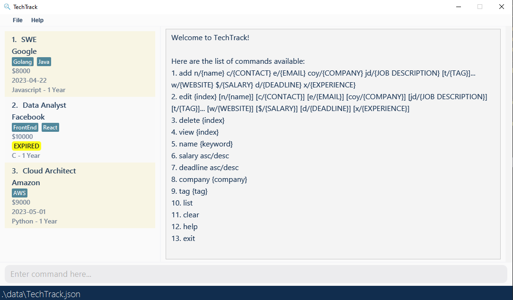

# **What is a Role?**

In TechTrack, users can manage their favourite roles through various commands. 
Here is what TechTrack can store per role:

**The prefixes and their respective parameters are as follows:**

| Required | Prefix | Parameter            | Restrictions                                                                                                                                                                                                                      |
|----------|--------|----------------------|-----------------------------------------------------------------------------------------------------------------------------------------------------------------------------------------------------------------------------------|
| `Yes`    | n      | NAME                 | The string must contain at least one alphanumeric character or space.  If the string consists of only one character, it cannot be a space.                                                                                    |
| `Yes`    | c      | CONTACT              | Numeric characters only. At least 3 numeric characters.                                                                                                                                                                           |
| `Yes`    | e      | EMAIL                | Must follow a valid email format. See below for more information.                                                                                                                                                                 |
| `Yes`    | coy    | COMPANY              | The string must contain at least one non-space character.                                                                                                                                                                         |
| `No`     | t      | TAG                  | The string must contain at least one alphanumeric character or space.  If the string consists of only one character, it cannot be a space. Note: Editing a role's tag to a space character removes the tag from that role |
| `Yes`    | w      | WEBSITE              | Must be in www.[any number of characters].com *Brackets between 'www.' and '.com' not neccessary.                                                                                                                                                                                              |
| `Yes`    | jd     | JOB DESCRIPTION      | The string must contain at least one non-space character.                                                                                                                                                                         |
| `Yes`    | $      | SALARY               | Must be a positive whole number that is larger than 0.                                                                                                                                                                            |
| `Yes`    | d      | APPLICATION DEADLINE | Follows YYYY-MM-DD format and must not be over current date.                                                                                                                                                                      |
| `Yes`    | x      | EXPERIENCE REQUIRED  | The string must contain at least one non-space character.                                                                                                                                                                         |

**Email Format**
* Emails should be of the format local-part@domain and adhere to the following constraints:
  1. The local-part should only contain alphanumeric characters and these special characters, excluding the parentheses, (+_.-). The local-part may not start or end with any special characters.
  2. This is followed by a '@' and then a domain name. The domain name is made up of domain labels separated by periods.
* The domain name must:
    * end with a domain label at least 2 characters long
    * have each domain label start and end with alphanumeric characters
    * have each domain label consist of alphanumeric characters, separated only by hyphens, if any.

💡 **Note:** TechTrack does not allow users to store duplicate Roles. Roles are considered duplicates if they have the same NAME and COMPANY (both are case-sensitive).

# **Features**

This section guides you on how to utilise features available in TechTrack.

**The features of TechTrack can be split into 3 main categories:**

* [Creating Role Info](#creating-role-info)
* [Viewing Role Info](#viewing-role-info)
* [General Commands](#general-commands)

**Notes about the command formatting:**

* Words in `UPPER_CASE` and surrounded by `{}` are the parameters to be supplied by the user.
  e.g. in `add n/{NAME}`, `{NAME}` is a parameter which can be used as `add n/Software Engineer`.

* Items in square brackets are optional.
  e.g `n/{NAME} [t/TAG]` can be used as `n/Software Engineer t/BigTech` or as `n/John Doe`.

* Items with `…`​ after them can be used multiple times including zero times.
  e.g. `[t/TAG]…​` can be used as ` ` (i.e. 0 times), `t/Tech`, `t/Applied t/InvitedForInterview` etc.

* Parameters can be in any order.
  e.g. if the command specifies `n/{NAME} c/{CONTACT}`, `n/{NAME} c/{CONTACT}` is also acceptable.

* If a parameter is expected only once in the command but you specified it multiple times, only the last occurrence of the parameter will be taken.
  e.g. if you specify `c/12341234 c/56785678`, only `c/56785678` will be taken.

* Extraneous parameters for commands that do not take in parameters (such as `help`, `list`, `exit` and `clear`) will be ignored. 
  e.g. if the command specifies `help 123`, it will be interpreted as `help`.

# Creating Role Info
The commands in this segment are focused on creating, editing and removing data to and from the application.
These commands are:

* [Adding a Role](#adding-a-role-add)
* [Editing a Role](#editing-a-role-edit)
* [Deleting a Role](#deleting-a-role-delete)

### Adding a role: `add`

Adds a role to TechTrack.

Format: `add n/{NAME} c/{CONTACT} e/{EMAIL} coy/{COMPANY} jd/{JOB DESCRIPTION} [t/{TAG}]... w/{WEBSITE} $/{SALARY} d/{DEADLINE} x/{EXPERIENCE}` 

Example: Adding a new role to a fresh installation of TechTrack

`add n/Software Engineer c/98765432 e/google@example.com coy/Google t/Java t/Golang w/www.google.com 
jd/Data Engineering team - penultimate students preferred $/4000 d/2023-10-20 x/Javascript - 1 Year`

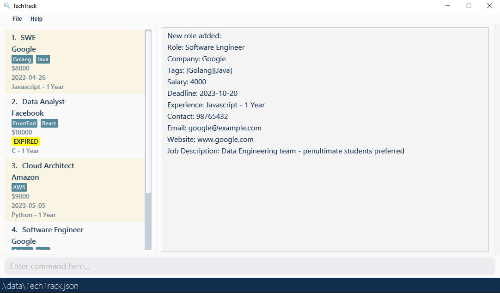

💡 **Note:** Refer to the attributes of a role [here](#what-is-a-role)

### Editing a Role: `edit`
Edit any parameters of a preexisting role. 

💡 **Note:** The user must provide at least one parameter to edit!

Format: `edit {index} [n/{NAME}] [c/{CONTACT}] [e/{EMAIL}] [coy/{COMPANY}] [jd/{JOB DESCRIPTION}] [t/{TAG}]... [w/{WEBSITE}]
[$/{SALARY}] [d/{DEADLINE}] [x/{EXPERIENCE}]`

* Edits the role at the specified `{INDEX}`. The index refers to the index number shown in the displayed role list. The index **must be a positive integer** 1, 2, 3, …​
* At least one of the optional fields must be provided.
* Existing values will be updated to the input values.
* When editing tags, the existing tags of the role will be removed i.e adding of tags is not cumulative.
* You can remove all the person’s tags by typing `t/` without
  specifying any tags after it.

Examples:

* `edit 1 n/Software Engineer` Changes the name of the 1st role to "Software Developer"

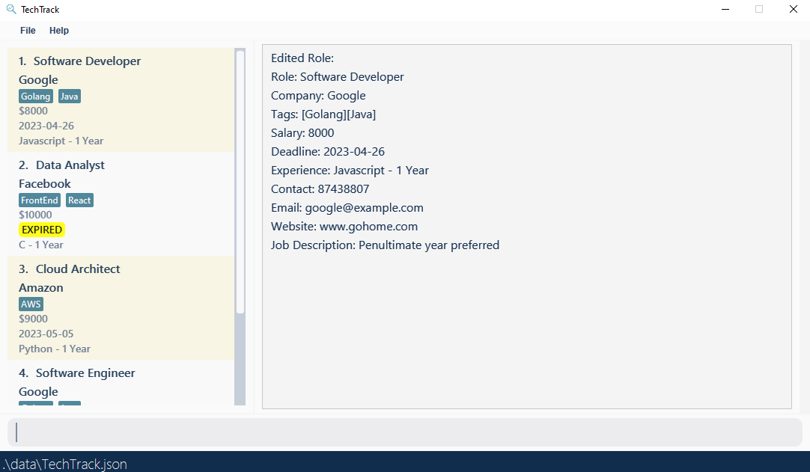

* `edit 2 coy/Meta t/ ` Changes the company of the 2nd role to "Meta" and removes all tags.

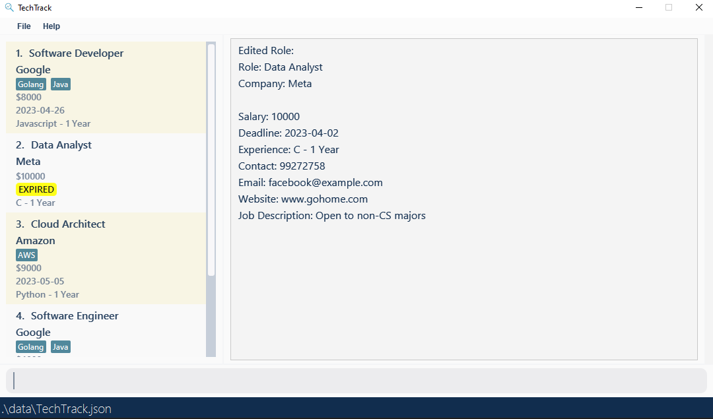

💡 **Note:** Refer to the attributes of a role [here](#what-is-a-role)

### Deleting a role: `delete`
Deletes the role from the current list of roles.

Format: `delete {index}`

* Deletes the role at the specified `{index}`. 
The index refers to the index number shown in the displayed role list. 
The index **must be a positive integer** 1, 2, 3, …​

Examples: 

* `list` followed by `delete 3` deletes the 3rd role from TechTrack

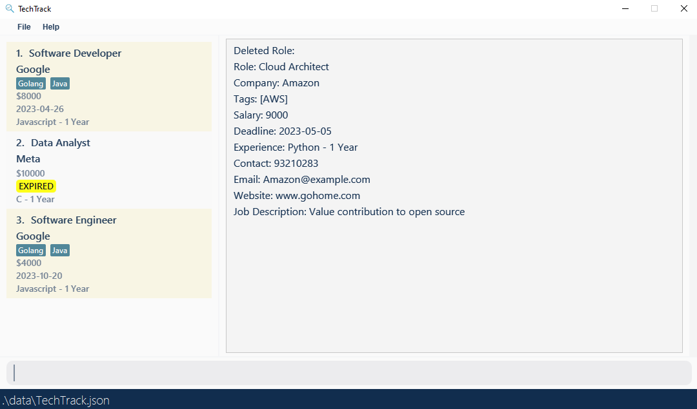

* `company google` then `delete 2` deletes the 2nd role in the results of the `company` command

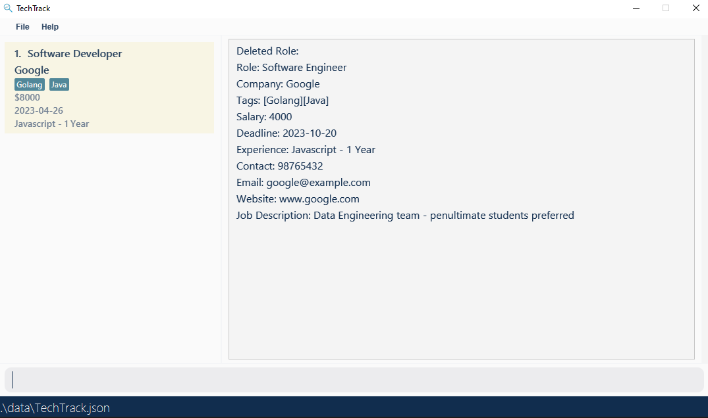
[link to `company` command](#find-roles-by-company-company)

# **Viewing Role Info**
The commands in this segment are focused on viewing formats and details of the preexisting roles.
These commands are:

* [Finding roles](#finding-roles)
  * [Find roles by name](#find-roles-by-name-name)
  * [Find roles by company](#find-roles-by-company-company)
  * [Find roles by tag](#find-roles-by-tag-tag)
* [Sorting roles](#sorting-roles)
  * [Sorting a role by deadline](#sorting-by-deadline-deadline)
  * [Sorting a role by salary](#sorting-by-salary-salary)
* [Viewing more details of a role](#viewing-more-details-of-a-role-view)

## Finding roles

The commands in this section returns roles where a certain attribute contains the given keywords. The property
differs based on the command (e.g., `name {keyword}` will search for roles based on their `name`).

* The search is case-insensitive. e.g `software` will match `Software`
* The order of the keywords does not matter. e.g. `Software Engineer` will match `Engineer Software`
* Only the name is searched.
* Only full words will be matched e.g. `Soft` will not match `Software`
* Roles matching at least one keyword will be returned (i.e. `OR` search).
  e.g. `Software Analyst` will return `Investment Analyst`, `Software Developer`

### Find roles by Name: `name`
Searches for roles whose name contains any of the given keywords.

Format: `name {keyword} [{more keywords}]...`

Examples: 

* `name analyst software` returns roles with names that include keywords "analyst" and "software"
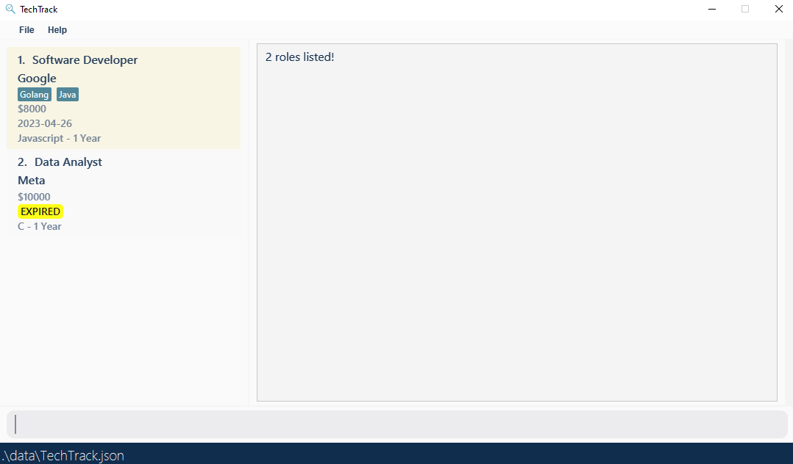
* `name developer` returns roles with names that include the "developer" keyword
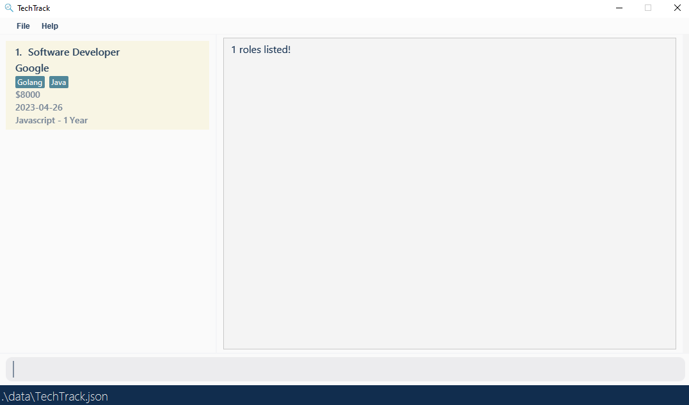

### Find roles by Company: `company`
Searches for roles whose company contains any of the given keywords.

Format: `company {keyword} [{more keywords}]...`

Examples:

* `company google meta` returns roles with company that include keywords "google" and "meta"
* `company google` returns roles with company that include the "google" keyword

[Image examples omitted as they're similar to the name command](#find-roles-by-name-name)

### Find roles by Tag: `tag`
Searches for roles whose tags contain any of the given keywords.

Format: `tag {keyword} [{more keywords}]...`

Examples:

* `tag golang java` returns roles with tags that include keywords "google" and "meta"
* `tag golang` returns roles with tags that include the "google" keyword

[Image examples omitted as they're similar to the name command](#find-roles-by-name-name)

## Sorting roles
The commands in this role sorts the **entire role list** based on an attribute, which differs per command.
For example, using the command `name SWE` followed by `deadline asc` would sort the filtered list of roles with 
`SWE` in its name, in ascending order by deadline. Afterwards, using the `list` command would display the 
original role list in its newly sorted order.

### Sorting by Deadline: `deadline`
Sort roles based on deadline in ascending or descending order.

Format: `deadline asc/desc`

Example 1: `deadline asc`
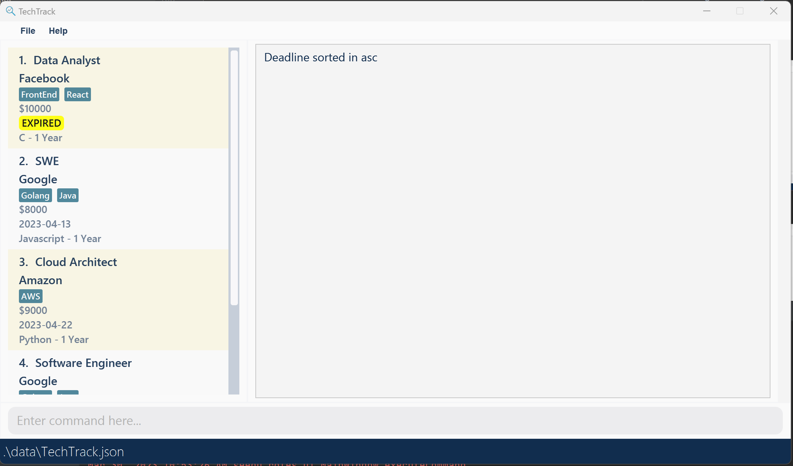

Example 2: `deadline desc`
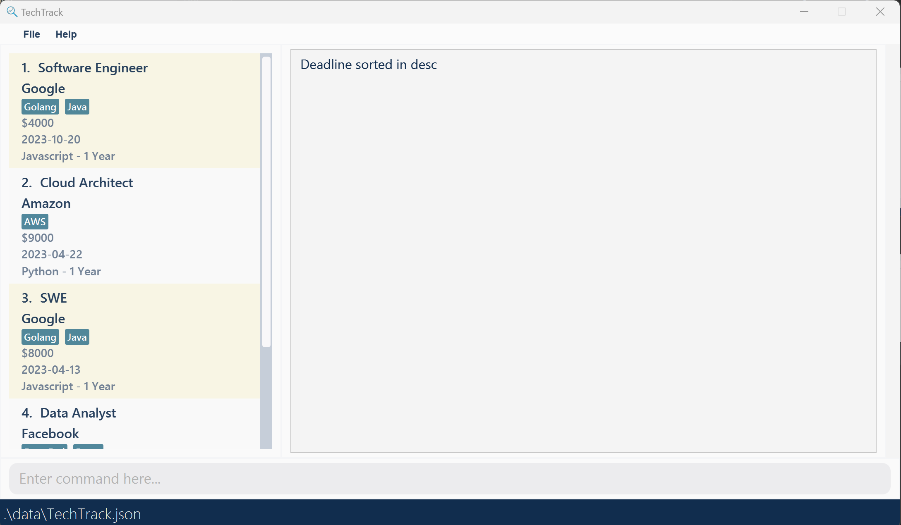

### Sorting by Salary: `salary`
Sort roles based on salary in ascending or descending order.

Format: `salary asc/desc`

Example 1: `salary asc`
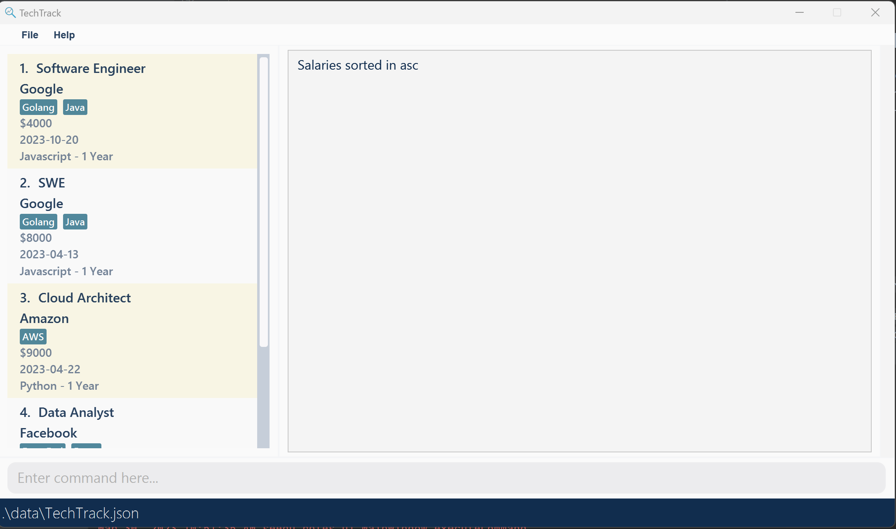

Example 2: `salary desc`
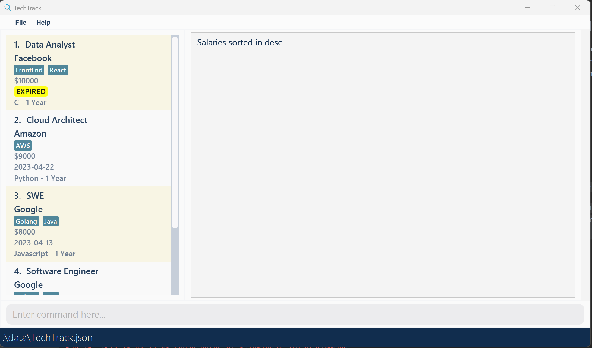

## Viewing more details of a role: `view`
The view command allows users to view more detailed information about a specific role. While the list of role cards 
on the left side of the GUI only displays key information such as the role's name, company, salary, deadline, and 
required experience, the view command generates a graphic on the right side of the GUI that presents additional 
details of the selected role.

Format: `view {index}`

* Views the role at the specified `{index}`.
  The index refers to the index number shown in the displayed role list.
  The index **must be a positive integer** 1, 2, 3, …​

Examples:
* `list` followed by `view 1`

* `company meta` followed by `view 1`
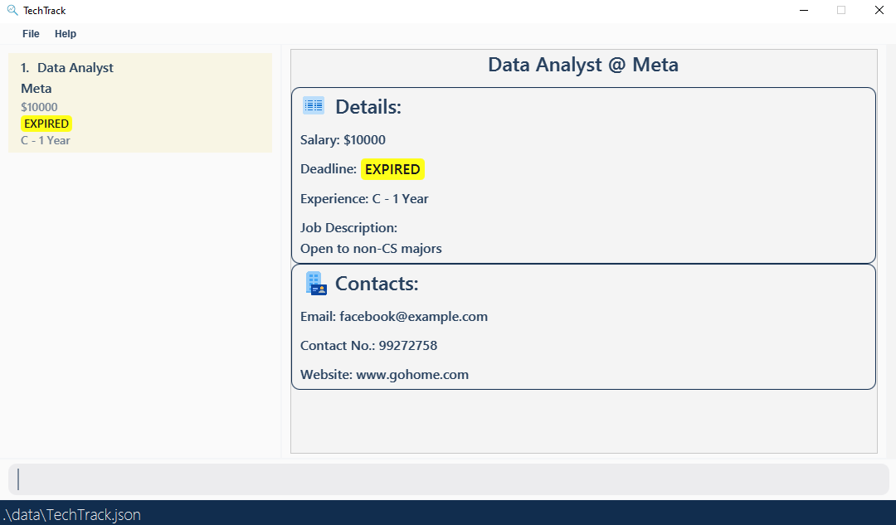

# **General Commands**

* [List all roles](#list-list)
* [Clear all roles](#clear-clear)
* [Help](#help-help)
* [Exit TechTrack](#exit-exit)

### List: `list`
Lists all roles available in TechTrack.

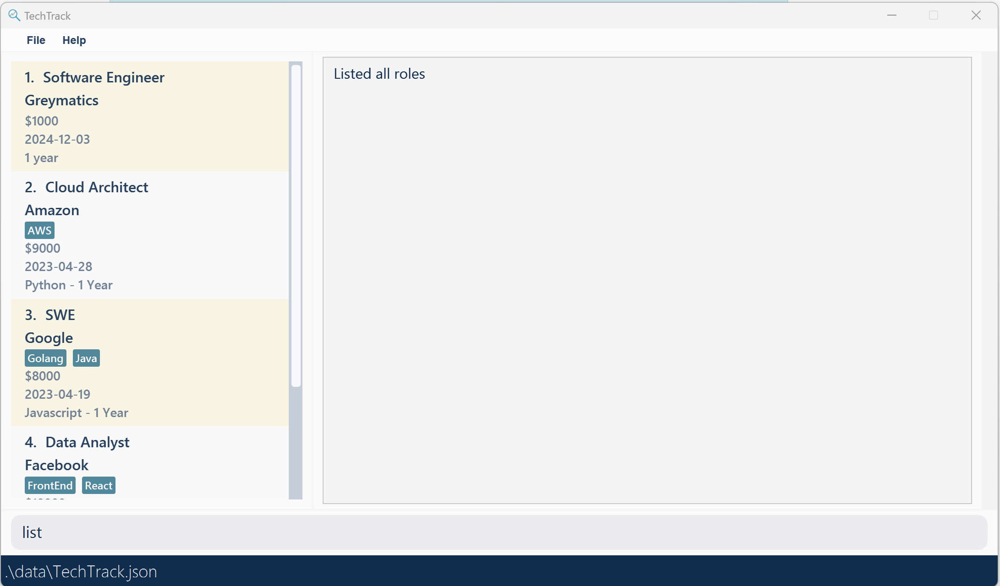

### Clear: `clear`
Deletes all roles available in TechTrack.

### Help: `help`
Display commands that are available in TechTrack and the proper format for usage. Also links to this user guide.

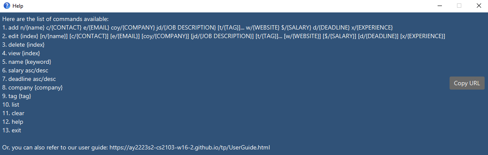

### Exit: `exit`
Exits and closes TechTrack.

# **Editing raw data**
You can directly edit TechTrack's data file after running and exiting the app. 

❗ **Caution:** If your changes to the data file makes its format invalid, TechTrack will discard that data file and start with an empty list of roles.

# **FAQ**
Q: How do I transfer my data to another Computer?

A: Install the app in the other computer and overwrite the empty data file it creates with the file that contains the data of your previous TechTrack home folder.

# **Command Summary**

| Command      | Format                                                                                                                                                             | Example                                                                                                                                                                                                   |
|--------------|--------------------------------------------------------------------------------------------------------------------------------------------------------------------|-----------------------------------------------------------------------------------------------------------------------------------------------------------------------------------------------------------|
| **add**      | `add n/{NAME} c/{CONTACT} e/{EMAIL} coy/{COMPANY} jd/{JOB DESCRIPTION} [t/{TAG}]... w/{WEBSITE} $/{SALARY} d/{DEADLINE} x/{EXPERIENCE}`                            | `add n/Software Engineer c/98765432 e/google@example.com coy/Google t/Java t/Golang w/www.google.com jd/Data Engineering team - penultimate students preferred $/4000 d/2023-10-20 x/Javascript - 1 Year` |
| **edit**     | `edit {index} [n/{NAME}] [c/{CONTACT}] [e/{EMAIL}] [coy/{COMPANY}] [jd/{JOB DESCRIPTION}] [t/{TAG}]... [w/{WEBSITE}] [$/{SALARY}] [d/{DEADLINE}] [x/{EXPERIENCE}]` | `edit 1 e/johndoe@example.com w/www.google.com c/91234567 jd/Working on HFT systems - C++ knowledge needed $/4000 d/2023-10-20 x/Javascript - 1 Year`                                                     |
| **delete**   | `delete {index}`                                                                                                                                                   | `delete 1`                                                                                                                                                                                                |
| **name**     | `name {keyword} [{more keywords}]...`                                                                                                                              | `name analyst engineer data`                                                                                                                                                                              |
| **company**  | `company {keyword} [{more keywords}]...`                                                                                                                           | `company Google`                                                                                                                                                                                          |
| **tag**      | `tag {keyword} [{more keywords}]...`                                                                                                                               | `tag frontend`                                                                                                                                                                                            |
| **deadline** | `deadline {asc/desc}`                                                                                                                                              | `deadline asc`                                                                                                                                                                                            |
| **salary**   | `salary {asc/desc}`                                                                                                                                                | `salary desc`                                                                                                                                                                                             |
| **view**     | `view {index}`                                                                                                                                                     | `view 1`                                                                                                                                                                                                  |
| **list**     | `list`                                                                                                                                                             | `list`                                                                                                                                                                                                    |
| **clear**    | `clear`                                                                                                                                                            | `clear`                                                                                                                                                                                                   |
| **help**     | `help`                                                                                                                                                             | `help`                                                                                                                                                                                                    |
| **exit**     | `exit`                                                                                                                                                             | `exit`                                                                                                                                                                                                    |

💡 **Note:** Refer to the attributes of a role [here](#what-is-a-role)

