

## Introduction
Welcome to ExecutivePro, an all-in-one solution for managing employees' information.
Are you tired of grappling with time-consuming tasks? Do you want to streamline your HR processes and boost your productivity?
Look no further! ExecutivePro is here to make it happen.

ExecutivePro is a **desktop app specifically designed for Human Resource managers to manage their employee information,
optimized for use via an easy-to-use Command Line Interface (CLI)** while still retaining the benefits of a
Graphical User Interface (GUI). With ExecutivePro, you can streamline your HR processes and free yourself from the drudgery of mundane tasks.

The purpose of this guide is to walk you through the comprehensive features of ExecutivePro and to help you troubleshoot any problems you may face while using ExecutivePro.
Read on to learn more and experience the game-changing benefits that ExecutivePro can bring to your work!

--------------------------------------------------------------------------------------------------------------------
## Using this Guide

Do check out [Quick Start](#quick-start) if this is your first time using ExecutivePro.

Refer to the [Table of Contents](#table-of-contents) to easily navigate around different sections of the User Guide.

If you have already set up ExecutivePro, feel free to navigate to [Features](#features) to learn how to use the features we offer.

Refer to the [Command Summary](#command-summary) if you just need some quick reminders of the command format.

If you encounter a term that you are unsure about, the [Glossary](#glossary) is where you want to go.

### Symbols and Syntax

Here are the symbols that you will see while reading this user guide:

| Symbol    | Meaning                                                                                                                                                                 |
|-----------|-------------------------------------------------------------------------------------------------------------------------------------------------------------------------|
| `code`    | Text relevant to commands or a filename.                                                                                                                                |
| [`code`]  | The brackets around the code indicate that the field is optional.                                                                                                       |
| :bulb:    | Tips for ExecutivePro users.                                                                                                                                            |
| :warning: | Be wary and proceed with caution.                                                                                                                                       |
| `...`     | Items with `...` after them can either be omitted or used one or more times.  Example:`[t/TAG]…` can be used as ` ` (omitted), `t/friend`, `t/friend t/family` etc. |

--------------------------------------------------------------------------------------------------------------------
## Table of Contents

* Table of Contents
{:toc}

--------------------------------------------------------------------------------------------------------------------
## Quick start
Follow these steps if this is your first time using ExecutivePro:

1. Ensure you have Java `11` or above installed in your Computer.
    1. If you have already installed Java, check that you have Java version `11`.
        - If you are using Windows, open up command prompt and type `java -version` and enter.
        - If you are using Mac, open up terminal and type `java -version` and enter.
    2. If you do not have Java `11`:
        - If you are using Windows/Linux/Intel-based Mac, you can download the latest version of Java from
          [here](https://www.oracle.com/java/technologies/downloads/).
        - If you are using an Apple Silicon Mac, you can install the Azul build of OpenJDK 11 version
          from [here](https://www.azul.com/downloads/?version=java-11-lts&os=macos&architecture=arm-64-bit&package=jdk-fx).
2. Download the latest `ExecutivePro.jar` from [here](https://github.com/AY2223S2-CS2103T-W09-4/tp/releases).

3. Copy the jar file to a folder you want to use as the _main folder_ for your ExecutivePro.
   This folder can be on your Desktop or any location you prefer.
   For example, we create a `test` folder on the Desktop.

  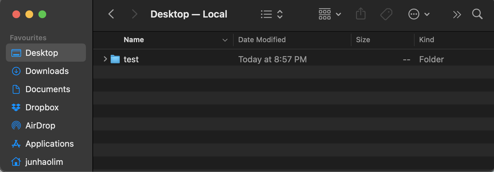
   
  <em>`test` folder</em>

Next, we place the `ExecutivePro.jar` file in the `test` folder as shown below.

  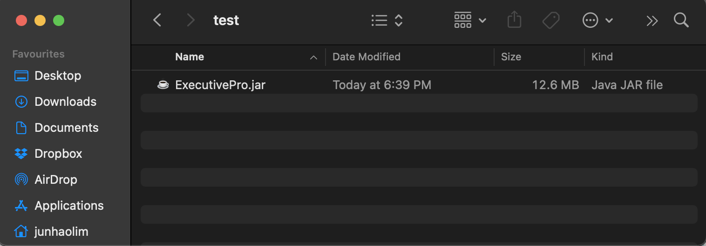
   
  <em>ExecutivePro jar file</em>

4. Now you are ready to use ExecutivePro, refer to the section [Starting ExecutivePro](#starting-executivepro) below for more details.

### Starting ExecutivePro
:warning: **Note:**
To get started with ExecutivePro, you will need to run the application using your terminal or command prompt. Follow the steps below:

Step 1 (Opening Terminal or Command Prompt) :

On Windows, press Windows + R, type cmd, and hit Enter to open the Command Prompt.
On macOS, press Cmd + Space, type terminal, and hit Enter to open Terminal.

Your Command Prompt/Terminal should show up like this:

  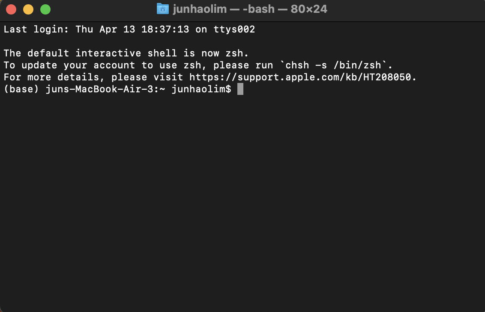
   
  <em>Terminal Page</em>

Step 2 (Navigating to the Jar File Location) :

Use the `cd` command to navigate to the folder where the `ExecutivePro.jar` file is located in.
This is the location where you have placed your jar file in, as done in [point 3 of Quick start section](#quick-start).
For example, if the file is located in the `test` folder on your Desktop, you can type `cd Desktop` and hit Enter, followed by
`cd test`and Enter to reach the `test` folder, just like the image below.

  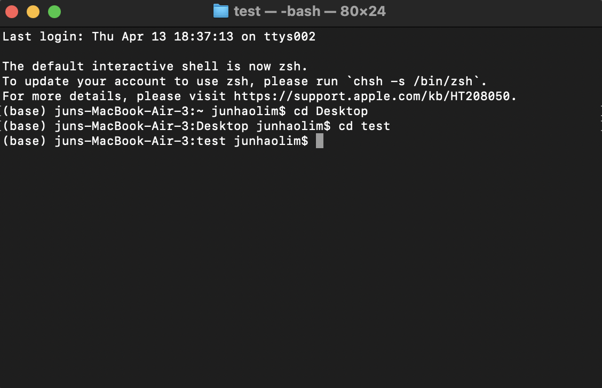
   
  <em>Changing Directory</em>

Step 3 (Running the Application) :
Once you are in the correct directory, type the following command,`java -jar ExecutivePro.jar`, in your terminal and hit Enter:

A window like below should appear in seconds.
Note how the app contains some sample data.

  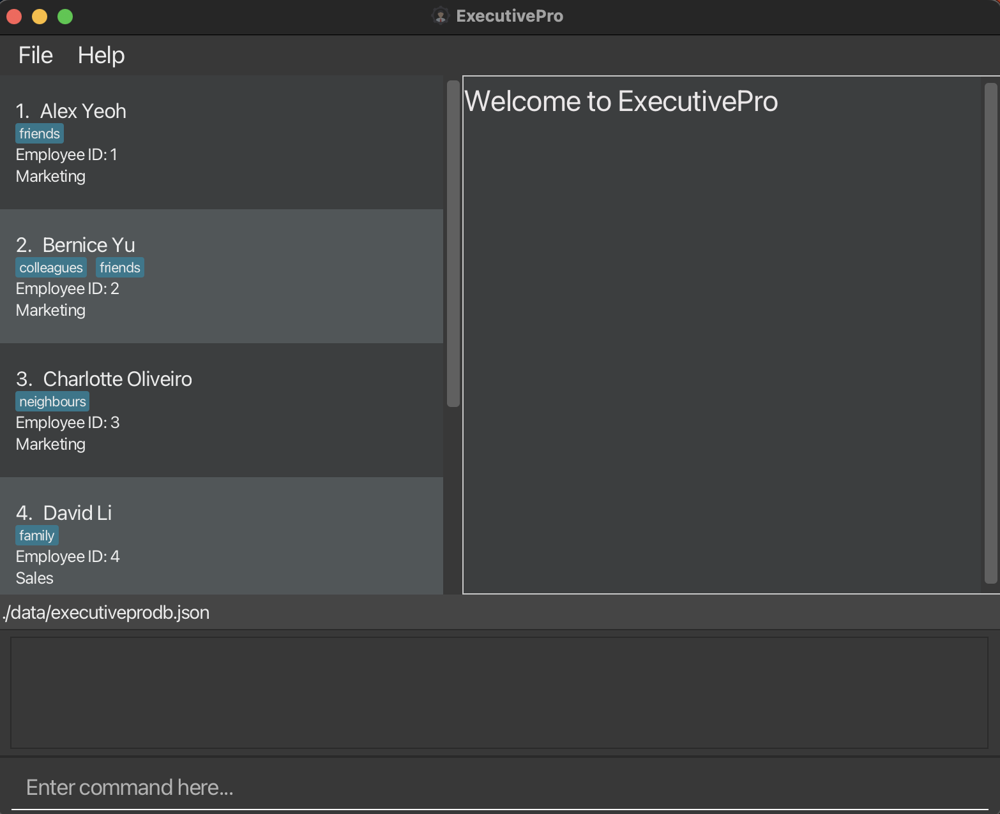
   
  <em>Starting Page</em>

A data folder should appear in the same folder as the `ExecutivePro.jar` file after the application is run successfully.

If the data folder is missing, simply create a folder named `data` in the same location as the `ExecutivePro.jar` file.

Congratulations, ExecutivePro is now running, you can refer to the [Features](#features) section below to learn all about the exciting features that ExecutivePro offer.

--------------------------------------------------------------------------------------------------------------------
## The User Interface

Below is the ExecutivePro User Interface with the main components labelled.

  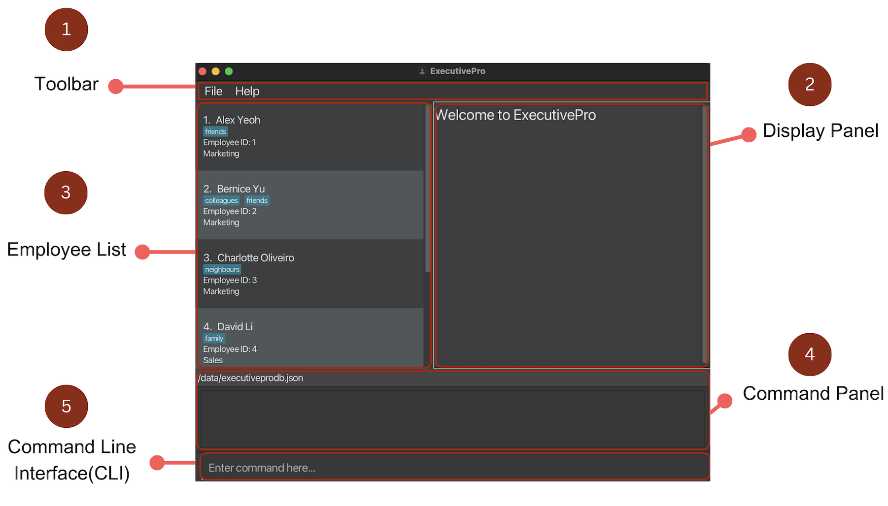
   
  <em>User Interface</em>

Main components of the ExecutivePro User Interface:

| No. | Component                    | Description                                                                                                                 |
|-----|------------------------------|-----------------------------------------------------------------------------------------------------------------------------|
| 1   | Toolbar                      | "File" button to exit program manually. "Help" button to display the _Help Window_.                                         |
| 2   | Display Panel                | Displays the full information of an employee, including personal details, department, payroll and leave information.        |
| 3   | Employee List                | Displays the entire list of employees, along with their basic information (`Name`, `Employee Id`, `Department` and `tags`). |
| 4   | Command Panel                | Displays the outcome of the entered command after execution, including error and success messages.                          |
| 5   | Command Line Interface (CLI) | This is where you enter the commands.                                                                                       |

#### 1. Toolbar

  
   
  <em>Toolbar</em>

This toolbar can be used to:

1. Exit ExecutivePro through the **File** button
2. Access the _Help Window_ through the **Help** button

#### 2. Display Panel

  
   
  <em>Display Panel</em>

This section shows the full information of the selected employee.

<u> Things to note: </u>

1. On startup of the application, this panel shows "Welcome to ExecutivePro"
2. To view an employee's particulars in this panel, click on one of the employees in the employee list.
3. If you delete an employee that you are currently viewing, the display panel will display the next employee's particulars.

#### 3. Employee List

  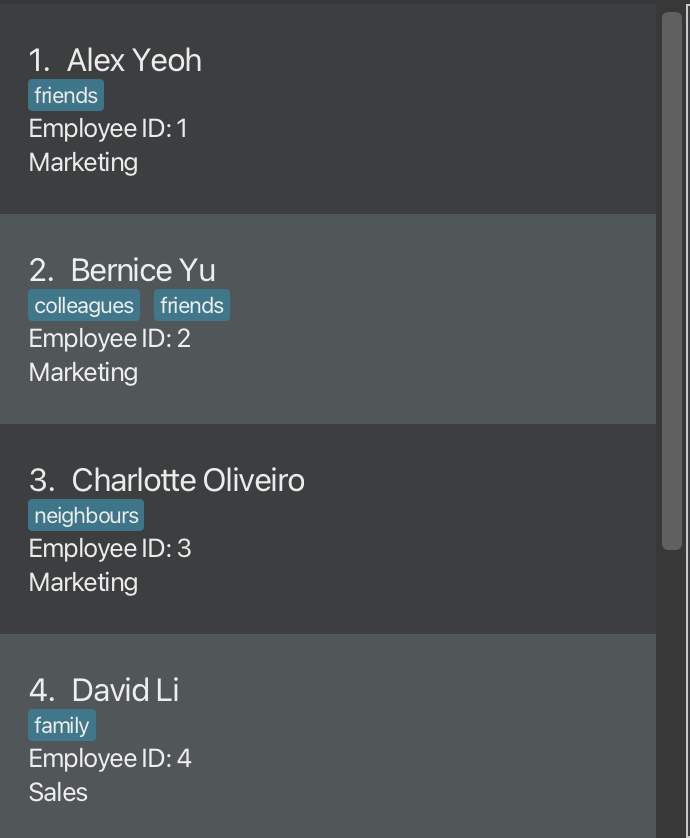
   
  <em>Employee List</em>

This shows the whole employee list with basic information such as _Name_, _Employee ID_, _Department_ and their respective tags highlighted in blue.

This will come in handy if:

1. You want a general overview of the employees in the company.
2. You want to quickly find out an employee's ID to edit their details.

#### 4. Command Panel

  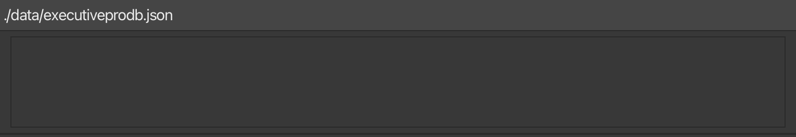
   
  <em>Command Panel</em>

This section displays relevant messages or errors after the command is entered.

#### 5. Command Line Interface (CLI)

In this section, you can enter your command in the text box and click enter on your keyboard to send it to the application. 

This is also known as a Command Line Interface or CLI for short. If you are new to CLI, a crash course is available below.

:bulb:
<u> What is CLI?</u>

To understand CLI better, here is an analogy:
Imagine being in a restaurant with a talented chef in the kitchen. The chef represents the computer while a waiter is a button on your screen. Instead of having to go through the waiter or "click" a button, the CLI helps you communicate directly with the chef by giving specific instructions or "orders" about what you want to eat. Hence, the CLI is a way to interact with your computer by giving precise, text-based instructions, much like talking directly to a chef to customize your meal.

<u> Why use CLI?</u>

Using a CLI can greatly enhance your efficiency as you no longer have to toggle between the mouse and your keyboard. Don't worry if this is your first time using the CLI, you'll get used to it in no time.

--------------------------------------------------------------------------------------------------------------------

## Employee Profiles

ExecutivePro makes it easy for you to add, remove, or edit employee information, to help you be an efficient and effective HR manager.
Each employee within ExecutivePro has an employee profile, where their personal particulars are stored.
These are the particulars that ExecutivePro can help you keep track of:

| Particular      | Description                                    | Compulsory?            |
|-----------------|------------------------------------------------|------------------------|
| Employee ID     | Unique numerical ID for each employee          | Automatically assigned |
| Name            | Name of employee                               | Compulsory             |
| Phone           | Phone number of employee                       | Compulsory             |
| Department      | Department of employee                         | Compulsory             |
| Salary          | Monthly salary of employee                     | Compulsory             |
| Day of Payment  | Day of the month that the employee is paid     | Compulsory             |
| Email           | Email address of employee                      | Optional               |
| Address         | Address of employee                            | Optional               |
| Leave           | Number of days of leave employee has remaining | Optional (Default: 21) |
| Date of Birth   | Date of birth of employee                      | Optional               |
| Date of Joining | Date the employee joined the company           | Optional               |
| Tag             | Used to record any other simple remarks        | Optional               |

In addition, you can upload a profile picture for each employee (see [here](#setting-an-employees-picture--setpicture)),
that will be shown in the display panel when the employee is selected.

:bulb:
Tags can be used to record any information about your employees that does not fall into any of the above categories.
For example, you could:

<ul>
    <li>Tag an employee as "Software Engineer" to record their role within their department.</li>
    <li>Tag an employee as "Vegetarian" to take note of their dietary requirements.</li>
</ul>

Tags give you more flexibility in building employee profiles, so you can use ExecutivePro to its fullest!

--------------------------------------------------------------------------------------------------------------------
## Features
This section lists the details of all the features of ExecutivePro.

### Help Command

#### Viewing help : `help`
We know that there can be a lot of information to take in for a new user, so if you ever _feel lost_ while using ExecutivePro, getting help is just a simple step away.

Entering the `help` command will open up the _Help Window_ that looks like this.

  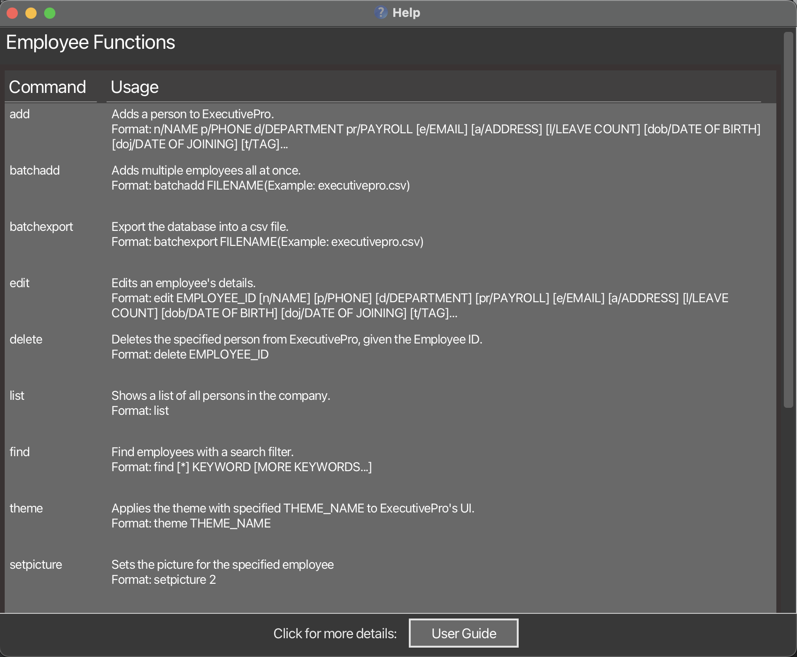
   
  <em>Help Window</em>

On the left column, you can find the full list of ExecutivePro commands and the right are the details for each command. If you require more information, the _Help Window_ also contains a button at the bottom to open up this User Guide in your browser.

Format: `help`

--------------------------------------------------------------------------------------------------------------------

### Import/Export of Employee Details

#### Adding an employee: `add`

How do we build an employee profile?

The first step is to add a new employee to the database,
so ExecutivePro can begin managing their particulars and profile for you.
To do this, use the `add` command, together with the employee particulars that you have available for this person.

Upon successfully adding a new employee, ExecutivePro will then keep track of the new profile and details in the
database, and you are free to access and modify the particulars with the [`edit`](#editing-an-employee--edit) command.

However, this function could fail (and ExecutivePro simply does not add any employee), if:

1. There are missing compulsory particulars. You can refer to the input format below for help, or find the list of compulsory particulars [here](#employee-profiles).
2. The particulars are in the wrong format, the program will prompt you on the correct format. Alternatively, you can find them [here](#field-formats).
3. The new employee added is a duplicate, i.e. there is someone in the database who already shares the same name, phone number
and email

Format: `add n/NAME p/PHONE_NUMBER d/DEPARTMENT pr/PAYROLL [e/EMAIL] [a/ADDRESS] [l/LEAVE_COUNT] [dob/DATE_OF_BIRTH] [doj/DATE_OF_JOINING] [t/TAG]...`

:bulb:
**For Tags:**
A person can have any number of tags (including 0)

Examples:
* `add n/John Doe p/98765432 d/Marketing pr/1000 15 e/johnd@example.com a/John street, block 123, #01-01`
* `add n/Betsy Crowe p/1234567 d/Sales pr/4000 1 e/betsycrowe@example.com a/Newgate street, block 576, #01-02 dob/2000-04-21 doj/2022-01-04 t/friend`

 

#### Adding multiple employees at once: `batchadd`

Tired of adding new employees one by one?
ExecutivePro allows you to add multiple employees at once from a `.csv` file.
This feature will come in handy when:

1. You are a new user and have your employee data stored in a `.csv` file.
2. There has been a recruitment cycle and the company has recruited multiple employees.

With this feature, you would not need to spend time to manually add each employee in!

Format: `batchadd FILENAME`

Example: `batchadd executivepro.csv`

Below are the steps to use this command:

**Step 1 (Creating CSV file) :**

Things to note:

- A header row is required to indicate the purpose of the field and must be the first row in the `.csv` file.
- For multiple tags for an employee, the tags should be separated by "/".

Sample `.csv` file:

:warning:
**Caution:** For the fields, do ensure that they follow the same specifications as in the [Field Formats below](#field-formats).

**Step 2 (Uploading CSV file) :**
Before we proceed to uploading the CSV file, you would need to have followed the instructions 
at the start of the user guide,  in order
to upload your csv file in the `data` folder

Once that is done,

1. Go to the folder where you stored the `jar` file.
2. Move your desired CSV file to the `data` folder.
   

**Step 3 (Running CSV file) :**

1. Once done, run `batchadd FILENAME` in the command panel.

If the command is successful, the employees in the file should be added to the database all at once,
and it should look something like the below image.

  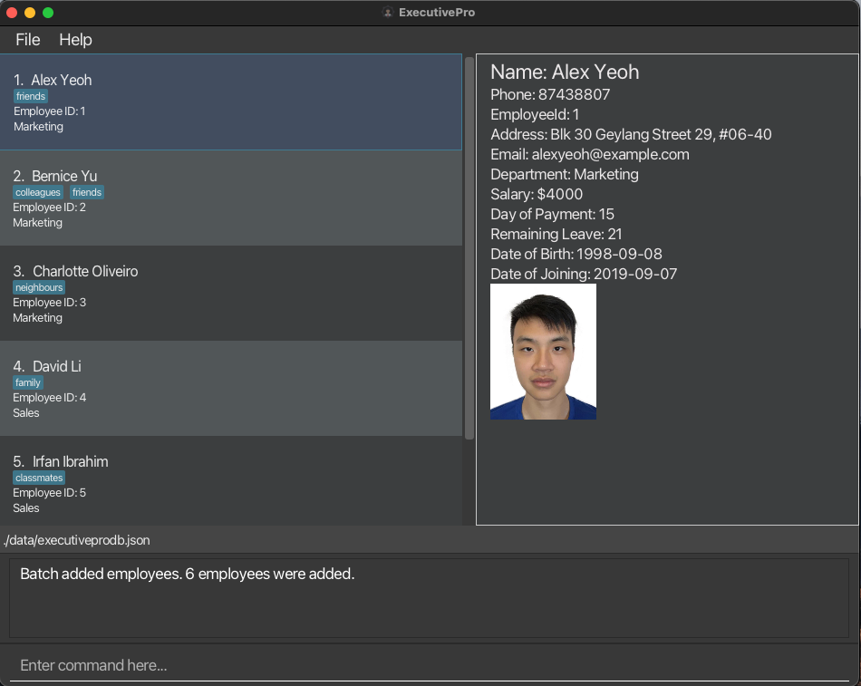
   

The command could be unsuccessful, and there are a few potential causes of this:

1. There could be a *duplicate* entry in the file, i.e. two employees sharing the same identity in the file.
2. If any of the particulars in the wrong format, ExecutivePro will not be able to read the file properly
   and the command will not run.
3. If you are using Excel to open your `.csv` file, the date formatting in Excel might not be set to the right format,
please refer to the instructions [here](#opening-csv-files-in-excel)

In the case of an unsuccessful Batch Add, **NONE** of the employees in the `.csv` will be added.
Also note that as of version `1.3` , this feature only supports `.csv` files and adding employees with the fields mentioned above.

##### Opening .csv files in Excel 

When using the `batchadd` feature, it is crucial to ensure that the dates in the CSV file are in the [correct format](#field-formats).
ExecutivePro expects dates to be in the following format: YYYY-MM-DD. If the dates in your CSV file are in a different format, you'll need to convert them before uploading the file to prevent errors and unsuccessful imports.

Follow the steps below to ensure the dates in Excel are following the correct format:

1. Firstly, you can select the two columns involving dates, `Date of Birth` and `Date of Joining`, just like the image below.
   

2. Next, right-click on the selected columns so that the following shows up:

   

3. Click on `Format Cells...` and the table below will appear:
   

4. Click on `Date`:
   

5. Select the correct date format ("YYYY-MM-DD"):
   

6. Click `OK` and the date in the file will be updated to the correct format:
   

Once the dates in your CSV file are in the correct format (YYYY-MM-DD),
you can proceed with the batchadd command in ExecutivePro.
This will ensure a smooth import process, and all employee information,
including dates, will be properly stored in the database.

 

#### Exporting database into CSV file: `batchexport`

ExecutivePro allows you to export the employees' data into a `.csv` file.

Format: `batchexport FILENAME`

Example: `batchexport exported_database.csv`

Below are the steps to use this command:

**Step 1 (Exporting to CSV file) :**

1. Run `batchexport FILENAME` in the command panel. The result should look like the image below.
   

2. Go to the folder where you stored the `jar` file.

3. Locate the CSV file in the `data` folder.

If the command is successful, there should be CSV file that contains all the employees' details from the database,
and it should look something like the below image.

:warning: Caution:
If you open the exported `.csv file` in `Excel`
and save it without ensuring that the date format is correct (YYYY-MM-DD), the dates might be saved in an incorrect format. 
This could lead to issues when importing the file using the batchadd command. 
To ensure the correct date format, please refer to the instructions [here](#opening-csv-files-in-excel)

:warning: Caution:
**Do take note to only export in `.csv file` and not any other file types.**

--------------------------------------------------------------------------------------------------------------------

### Editing Employee Details

#### Editing an employee : `edit`

There could be instances where you have to edit the details of an employee. It could be due to a typo or that your employee has changed their personal particulars. Simply follow the format given below to edit those details.

Format: `edit EMPLOYEE_ID [n/NAME] [p/PHONE_NUMBER] [d/DEPARTMENT] [pr/PAYROLL] [e/EMAIL] [a/ADDRESS] [l/LEAVE_COUNT] [dob/DATE_OF_BIRTH] [doj/DATE_OF_JOINING] [t/TAG]...`

* Edits the details of the employee with the specified `EMPLOYEE_ID`. If such an employee doesn’t exist, an error message will be shown.
* At least one of the optional fields (in brackets above) must be provided.
* Existing values will be updated to the input values.
* When editing tags, the existing tags of the person will be removed i.e. adding of tags is not cumulative.
* You can remove all the person’s tags by typing `t/` without specifying any tags after it.

Examples:
*  `edit 1 p/91234567 e/johndoe@example.com` Changes the phone number and email address of the employee with ID `1` to be `91234567` and `johndoe@example.com` respectively.

Below are the steps to use this command:

**Step 1 (Inputting the edit command) :**
You can use the command syntax to edit an employee's fields, the image below demonstrates the command `edit 1 p/91234567`.
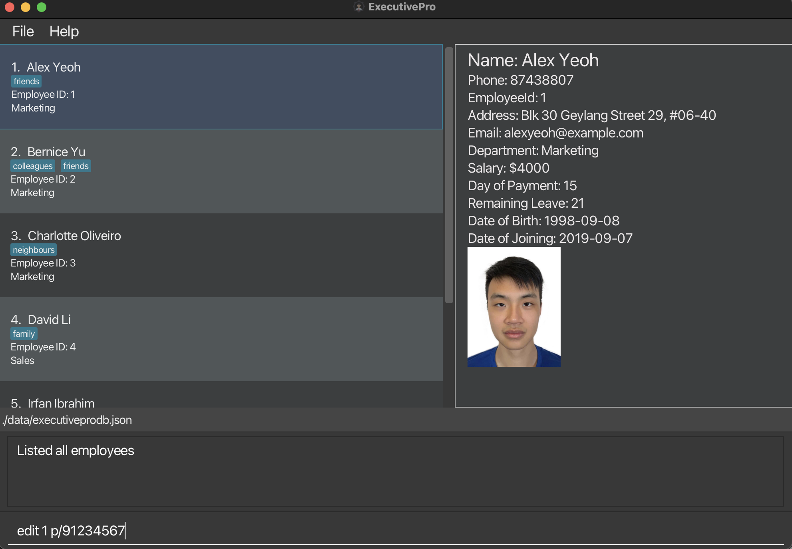

**Step 2 (Results displayed) :**
The employee with the provided employee ID would have their fields edited accordingly, in this example, `Alex Yeoh` with employee ID `1` his phone number edited to `91234567`.
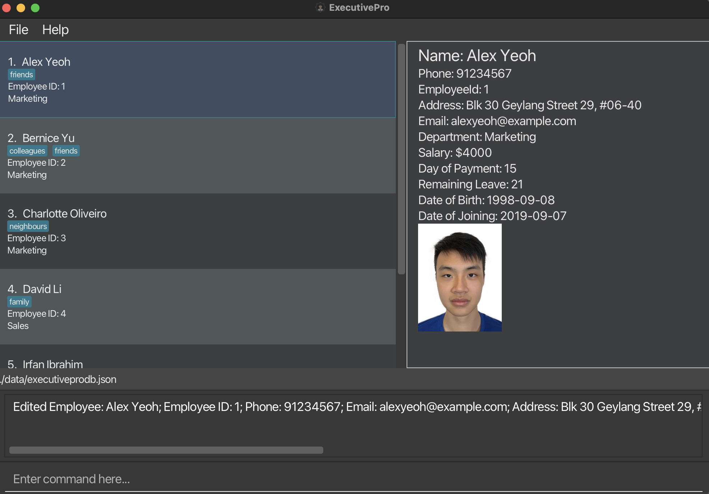

#### Taking leave : `leave`

There are plenty of instances where employees take leave, and it is such a tedious task to manage employee leaves. ExecutivePro allows you to help your employees take leave so you no longer have to manually track remaining leaves for each employee. Note that for resetting or increasing an employee's leave count use the `edit` command above instead. (`leave` can only help an employee take leave).

Format: `leave EMPLOYEE_ID l/LEAVE_COUNT`

* Helps the employee with the specified `EMPLOYEE_ID` take leave. If such an employee doesn’t exist, an error message will be shown.
* Number of days of leave is specified by `LEAVE_COUNT`. If the employee does not have enough remaining leave, an error message will be shown.
* Existing leave count will decrease by the number of days of leave taken.

Examples:
* `leave 1 l/3` Helps the employee with ID `1` take `3` days of leave.

#### Setting an employee's picture : `setpicture`

This feature allows you to set a picture for the specified employee, so that you can upload ID photos for each employee.

:warning: **Note:**
The selected image file must be in either the `.png`, `.jpg`, or `.jpeg` file formats.

Format: `setpicture EMPLOYEE_ID`

* Sets the picture of the employee with the specific `EMPLOYEE_ID`.
* The `EMPLOYEE_ID` refers to the id of an employee shown in the displayed employees list.
* The `EMPLOYEE_ID` **must be a positive integer** 1, 2, 3, …​

Examples:
To set the picture for the employee with EMPLOYEE_ID 1, enter `setpicture 1` into the command bar.
A file selector should appear, as shown below:

Search through your computer for the picture you want to set.
Click on the image in your file explorer to select it,
then open it by clicking the "Open" button on the file selector or by pressing the "Enter" key on your keyboard.

Click on the specified employee on the left, and your ExecutivePro should display their photo on the right like this.

:warning:
**Note:** If a file not originally in one of the valid file formats is renamed to a valid file format,
the file may not be properly displayed (e.g. renaming a `example.txt` file to a `example.png`). We encourage you to use an image converter to convert your image to the valid file format,
before uploading it to ExecutivePro.

#### Deleting an employee : `delete`

As time passes, you might run into instances where an employee leaves the company, and that their details have to be removed
from the database. `delete` would help to remove the details of the employee with the specified `EMPLOYEE_ID`
from the ExecutivePro database.

Format: `delete EMPLOYEE_ID`

* You can delete the details of the employee with the specific `EMPLOYEE_ID`.
* The `EMPLOYEE_ID` refers to the id of an employee shown in the displayed employees list.
* The `EMPLOYEE_ID` **must be a positive integer** 1, 2, 3, …​

Examples:
`delete 2` deletes the employee with EMPLOYEE_ID 2 in ExecutivePro.

#### Clearing the data: `clear`

Clears all the data currently stored in the database.

If you are a new user, you can use this command after you have experimented with ExecutivePro to start keying in your actual employee information.

:warning: **Caution:**
Once you run this command, you lose all data immediately.

Format: `clear`

--------------------------------------------------------------------------------------------------------------------

### Viewing Employee Details

#### Listing all employees : `list`

After searching for employees using the `find` command, you might realise that the employee list no longer shows all the employees.
In order to get the full list back, simply use the list command, and it will show a list of all employees and
their details in the ExecutivePro database.

Format: `list`

#### Locating employees by keyword: `find`

As your database gets larger, scrolling and finding a certain employee becomes harder. However, ExecutivePro will ease this process
through the `find` command. By following the format below, ExecutivePro will show
a list of all employees in ExecutivePro whose names or departments match the keyword provided.

Format: `find [*] KEYWORD [MORE_KEYWORDS]`

* If asterisk (`*`) is inputted, it displays list of employees matching _all_ the given keywords.
* If asterisk (`*`) is _not_ inputted, it displays list of employees matching _any_ of the given keywords.
* Even if the keyword just partially matches a part of employees full name, it is considered a match.
* For finding department, the keyword has to be a full match.
* Keyword is to search for the name and department of the employee only, not any other details.

Examples:
* `find John Sales` displays list of all employees whose full name contains a 'John' in it,
  or they are in the 'Sales' department
* `find * John Sales` displays list of all employees in the 'Sales' department who have a 'John' in their name

Below are the steps to use this command:

**Step 1 (Inputting the search keywords) :**
You can use the command syntax to input the search keywords, just like the image below.
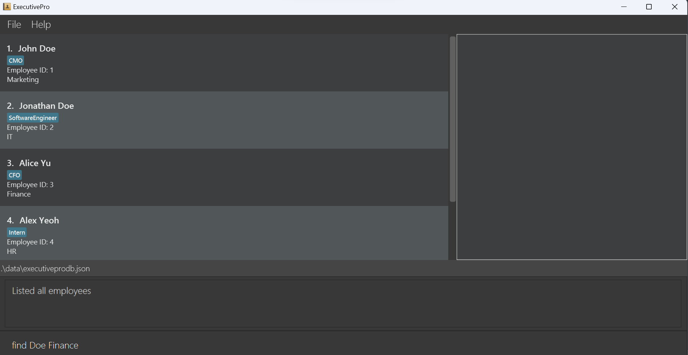

**Step 2 (Results displayed) :**
All the employees who match the keywords will be listed.
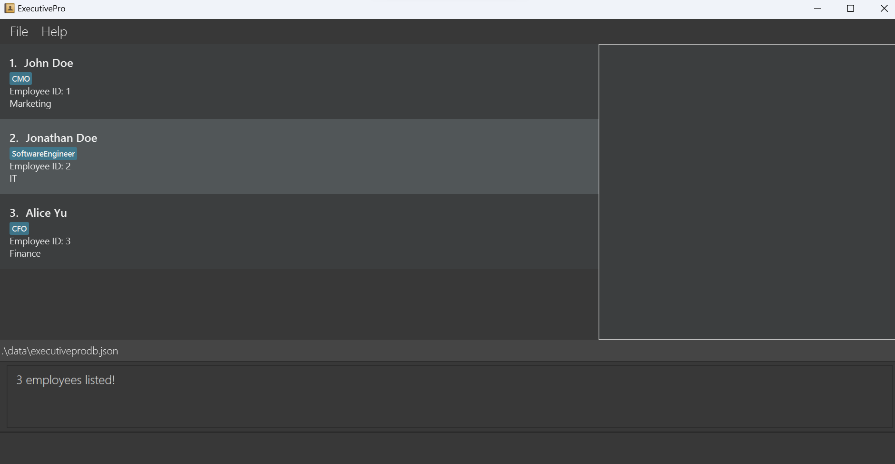

#### Filtering out employees: `filter`

As your database gets larger, searching through the whole database to find employees who satisfy a certain condition
becomes extremely tedious.
However, ExecutivePro has just the right feature for you! The `filter` command will list out all the employees
satisfying the given condition.

Format: `filter FILTER_PARAMETER BOOLEAN_OPERATOR COMPARISON_AMOUNT`

* The filtering condition can be based on Payroll(`pr`) value or the number of leaves remaining for an employee(`l`)
* The filtering condition checks the value of Payroll or number of leaves of an employee against a `COMPARISON_AMOUNT`
* The filtering condition can either be greater than(`>`), lesser than(`<`) or equal to(`=`) the `COMPARISON_AMOUNT`
* The `COMPARISON_AMOUNT` must be _non-negative_ and an _integer_

Examples:
* `filter pr > 1000` displays list of all employees whose payroll value is greater than 1000
* `filter l = 1` displays list of all employees who have only 1 leave left

Below are the steps to use this command:

**Step 1 (Creating the criteria) :**
You can use the command syntax to create the criteria, just like the image below.
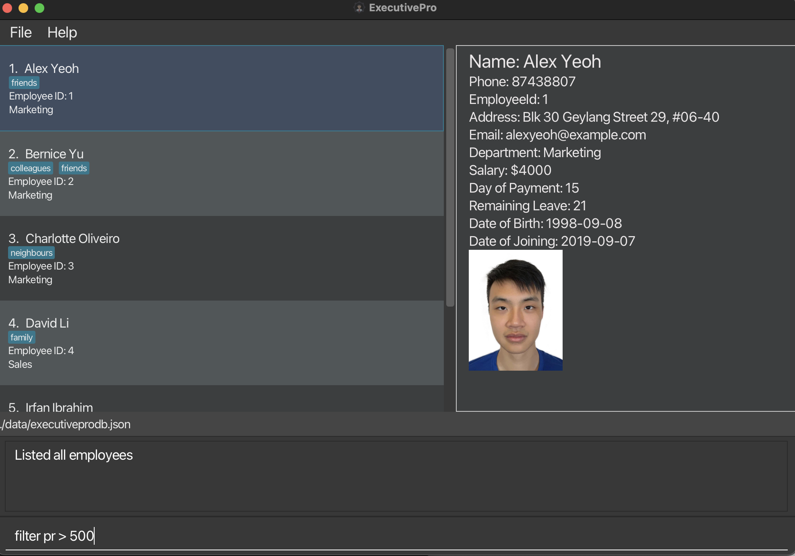

**Step 2 (Results displayed) :**
All the employees who satisfy the criteria will be listed.
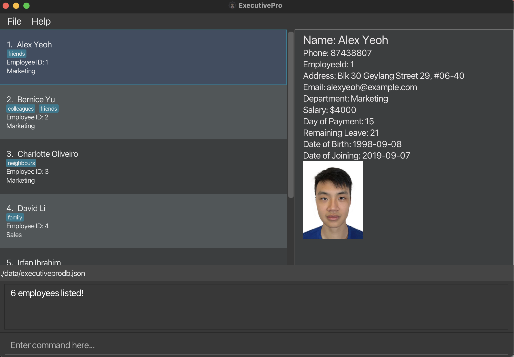

--------------------------------------------------------------------------------------------------------------------

### System commands

#### Changing the UI theme : `theme`

Want to tweak the look of ExecutivePro?
This feature allows you to choose one of two appearances for ExecutivePro to suit your needs.

The `light` theme (black text on light background) improves readability in well-lit surroundings.

The `dark` theme (white text on dark background) can reduce eye strain in low-light conditions.

Format: `theme THEME_NAME`
* `THEME_NAME` is either `dark` (white text on dark background) or `light` (black text on white background).

Example:
`theme light` applies the `light` theme to ExecutivePro.

:warning:
**Note:** Themes are not kept upon closing ExecutivePro.

 

#### Exiting the program : `exit`

Exits the program. Your data is automatically saved so ExecutivePro will look exactly the same the next time you open it up.

Format: `exit`

--------------------------------------------------------------------------------------------------------------------
### Saving/Editing the data file
ExecutivePro data are saved in the hard disk automatically after any command that changes the data. There is no need to save manually.

The employee data is saved as a JSON file `[JAR file location]/data/executivepro.json`. 
Advanced users can edit the JSON file directly but are strongly discouraged due to possible data corruption.

:warning: **Caution:**
If your changes to the data file makes its format invalid, ExecutivePro will discard all data and start with an empty data file at the next run.

--------------------------------------------------------------------------------------------------------------------
## FAQ

**Q**: How do I transfer my data to another Computer? 
**A**: Install the app on the other computer and overwrite the empty data file. This creates a new file that contains the data of your previous ExecutivePro home folder.

**Q**: Do I need internet access to use ExecutivePro?  
**A**: No, ExecutivePro does not require internet access

**Q**: Does ExecutivePro support different themes?  
**A**: Yes, ExecutivePro offers both light and dark themes for your preference.

**Q**: I have added the wrong details for my employee. How do I change it?  
**A**: Simply use ExecutivePro's [edit command](#editing-an-employee--edit) to change any details of the employee.

--------------------------------------------------------------------------------------------------------------------
## Planned Enhancements
1. In the near future, our team will be creating a login feature for ExecutivePro. This helps to enhance the security of ExecutivePro by ensuring that only you and your team members have access to the database.

--------------------------------------------------------------------------------------------------------------------

## Field Formats

This table describes the requirements for the input format of the fields.

| Field             | Prefix | Requirement                                                                                                                                                                                                                                                                                                                                                                                                    | Example                                  |
|-------------------|--------|----------------------------------------------------------------------------------------------------------------------------------------------------------------------------------------------------------------------------------------------------------------------------------------------------------------------------------------------------------------------------------------------------------------|------------------------------------------|
| `NAME`            | n/     | Only alphanumeric characters and spaces only.                                                                                                                                                                                                                                                                                                                                                                  | `John Doe`, `Shawn Lee`                  |
| `PHONE`           | p/     | Can contain numbers (0-9) only from 3 - 15 digits in length.                                                                                                                                                                                                                                                                                                                                                   | `80101126`, `973629831`, `999`           |
| `DEPARTMENT`      | d/     | Only alphanumeric characters.                                                                                                                                                                                                                                                                                                                                                                                  | `Sales`, `Engineering`                   |
| `PAYROLL`         | pr/    | Two integers (salary and day of payment) separated by a space.  Salary has to be an integer between `0` and `100000` (inclusive).  Day of payment has to be an integer between `1` and `28` (inclusive).                                                                                                                                                                                               | `1000 15`, `10000 3`                     |
| `EMAIL`           | e/     | Be in the format of local-part@domain.ending.   "local-part" should contain only alphanumeric characters and/or certain special characters (+\_.-), and cannot start or end with any special characters.  "domain" should start and end with alphanumeric characters, must be at least 2 characters long, and can contain hyphens.  "ending" part must be at least 2 characters long (e.g. ".com") | `johnd@example.com`, `shawn@example.edu` |
| `ADDRESS`         | a/     | Can take any value.                                                                                                                                                                                                                                                                                                                                                                                            | `311, Clementi Ave 2, #02-25`            |
| `LEAVE`           | l/     | Must be an integer between between `0` and `365` (inclusive).                                                                                                                                                                                                                                                                                                                                                  | `1`, `10`, `350`                         |
| `DATE_OF_BIRTH`   | dob/   | Date in YYYY-MM-DD format.                                                                                                                                                                                                                                                                                                                                                                                     | `2022-01-10`                             |
| `DATE_OF_JOINING` | doj/   | Date in YYYY-MM-DD format.                                                                                                                                                                                                                                                                                                                                                                                     | `2022-12-10`                             |
| `TAG`             | t/     | Only alphanumeric characters and spaces only.                                                                                                                                                                                                                                                                                                                                                                  | `Software Engineer`, `Manager`           |

If you came from the `add` command, [click here to return](#adding-an-employee-add). \
If you came from the `batchadd` command, [click here to return](#adding-multiple-employees-at-once-batchadd).

--------------------------------------------------------------------------------------------------------------------
## Command Summary

| Command         | Format, Examples                                                                                                                                                                                                                                                                                                |
|-----------------|-----------------------------------------------------------------------------------------------------------------------------------------------------------------------------------------------------------------------------------------------------------------------------------------------------------------|
| **Help**        | `help`                                                                                                                                                                                                                                                                                                          |
| **Add**         | `add n/NAME p/PHONE_NUMBER d/DEPARTMENT pr/PAYROLL [e/EMAIL] [a/ADDRESS] [l/LEAVE_COUNT] [dob/DATE_OF_BIRTH] [doj/DATE_OF_JOINING] [t/TAG]...`   e.g., `add n/John Doe p/98765432 d/Marketing pr/4000 15 e/johnd@example.com a/John street, block 123, #01-01 l/19 dob/2000-04-21 doj/2022-01-04 t/friends ` |
| **BatchAdd**    | `batchadd FILENAME`   e.g., `batchadd executivepro.csv`                                                                                                                                                                                                                                                      |
| **BatchExport** | `batchexport FILENAME`   e.g., `batchexport exported_database.csv`                                                                                                                                                                                                                                           |
| **List**        | `list`                                                                                                                                                                                                                                                                                                          |
| **Edit**        | `edit EMPLOYEE_ID [n/NAME] [p/PHONE_NUMBER] [d/DEPARTMENT] [pr/PAYROLL] [e/EMAIL] [a/ADDRESS] [l/LEAVE_COUNT] [dob/DATE_OF_BIRTH] [doj/DATE_OF_JOINING] [t/TAG]...`  e.g.,`edit 1 p/91234567 e/johndoe@example.com`                                                                                          |
| **Leave**       | `leave EMPLOYEE_ID l/LEAVE_COUNT`  e.g.,`leave 1 l/3`                                                                                                                                                                                                                                                        |
| **Find**        | `find [*] KEYWORD [MORE_KEYWORDS]`  e.g., `find * James Jake`                                                                                                                                                                                                                                                |
| **Delete**      | `delete EMPLOYEE_ID`  e.g., `delete 3`                                                                                                                                                                                                                                                                       |
| **Theme**       | `theme THEME_NAME`   e.g., `theme light`                                                                                                                                                                                                                                                                     |
| **SetPicture**  | `setpicture EMPLOYEEID`   e.g., `setpicture 2`                                                                                                                                                                                                                                                               |
| **Exit**        | `exit`                                                                                                                                                                                                                                                                                                          |
| **Clear**       | `clear`                                                                                                                                                                                                                                                                                                         |
| **Filter**      | `filter FILTER_PARAMETER BOOLEAN_OPERATOR COMPARISON_AMOUNT`   e.g., `filter pr > 1500`                                                                                                                                                                                                                      |

--------------------------------------------------------------------------------------------------------------------
## Glossary

- **HR**: _Human Resources_ department of a company responsible for managing employee life cycle and administering employee benefits.
- **HR Manager**: _Human Resource Manager_ will lead and direct the routine functions of the Human Resources (HR) department including hiring and interviewing staff, administering pay, benefits, and leave, and enforcing company policies and practices.
- **CLI**: _Command Line Interface (CLI)_ is a text-based user interface (UI) used to run programs, manage computer files and interact with the computer.
- **GUI**: _Graphical User Interface (GUI)_ is a digital interface in which a user interacts with graphical components such as icons, buttons, and menus.
- **Terminal/Command Prompt**: _Terminal_ and _Command Prompt_ are interfaces which let you access the command line.
- **Hard Disk**: _Hard Disk_ is a kind of technology that stores the operating system, applications, and data files such a documents, pictures and music that your computer uses.
- **JAR**: JAR stands for _Java ARchive_. It's a file format based on the popular ZIP file format and is used for aggregating many files into one.
- **CSV**: _Comma-Separated Values (CSV)_ file is a text file that has a specific format which allows data to be saved in a table structured format.
- **JSON**: _JavaScript Object Notation (JSON)_ is a standard text-based format for representing structured data and is commonly used for transmitting data in web applications.

<a href="#top">Back to top</a>
