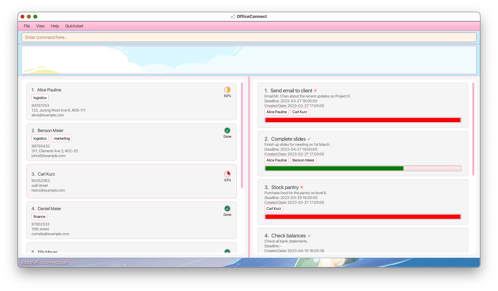

OfficeConnect is a task management tool designed specifically for managerial role personnels based in Singapore.

As managers in the current office environment, it is often not easy to grasp the workload of subordinates. This may result in:
* work overload among subordinates
* difficulties in coordinating tasks with a large number of employees
* inefficient, time-consuming administrative tasks like typing and sending emails.

OfficeConnect offers a solution to these problems by providing better visibility into subordinates’ workloads, allowing
managers to efficiently delegate tasks in an organised manner. 

* Table of Contents
{:toc}

--------------------------------------------------------------------------------------------------------------------

## 1. Getting started

#### 1.1 Accessing the app

1. For **Windows** users, ensure you have Java **11** or above installed in your Computer.  For **MacOS** users, ensure you have **OpenJDK Runtime Environment Zulu11.60+19-CA (build 11.0.17+8-LTS)** installed in your computer.

2. Download the latest **officeconnect.jar** from [OfficeConnect Release Page](https://github.com/AY2223S2-CS2103T-W10-1/tp/releases).

3. Copy the file to the folder you want to use as the _home folder_ for your OfficeConnect.

4. Open a command terminal, `cd` into the folder you put the jar file in, and use the `java -jar officeconnect.jar` command to run the application. 

5. A GUI similar to the below should appear in a few seconds. Note how the app contains some sample data.
   
    

    <em>Landing Page</em>
    
 

6. If you're a new user, we recommend checking out our [Tutorial](#2-tutorial) section to get yourself familiar with the
   commands. Otherwise, refer to the [Features](#3-features) below to learn more about each command in detail.

#### 1.2 Prefixes used in commands
Below are the prefixes we use in commands.

| Prefix     | Parameter    | Parameter Meaning         | Example Usage              | Input Restrictions                                                                                                                                                                                                               |
|------------|--------------|---------------------------|----------------------------|----------------------------------------------------------------------------------------------------------------------------------------------------------------------------------------------------------------------------------|
| **n/**     | NAME         | Name of person            | n/Peter                    | Names given to persons must be unique, should only contain alphanumeric characters and spaces and should not be blank.                                                                                                           |
| **p/**     | PHONE_NUMBER | Phone number of person    | p/94738484                 | Phone number entered must conform to Singapore numbers (8 digits) and start wth either 6. 8 or 9. It is also assumed +65 is not necessary.                                                                                       |
| **e/**     | EMAIL        | Email of person           | e/nancy@gmail.com          | Emails must contain an @.                                                                                                                                                                                                        |
| **a/**     | ADDRESS      | Address of person         | a/Sims Avenue 6            | NA                                                                                                                                                                                                                               |
| **tag/**   | TAG          | Tags given to person      | tag/Logistics              | NA                                                                                                                                                                                                                               |
| **t/**     | TITLE        | Title of task             | t/Work on Project X        | Titles given to tasks must be unique, should only contain alphanumeric characters and spaces and should not be blank.                                                                                                            |                                                                         
| **c/**     | CONTENT      | Content of task           | c/Complete slides for Mr Y | NA                                                                                                                                                                                                                               |
| **st/**    | STATUS       | Completion status of task | st/true                    | Only true or false values allowed.                                                                                                                                                                                               |
| **dl/**    | DEADLINE     | Deadline set for task     | dl/2023-05-23 20:00:00     | Date format for deadline is given by yyyy-mm-dd HH:MM:SS, time(HH:MM:SS) is optional but cannot be incomplete (i.e if time is included, it must follow HH:MM:SS format). There must be trailing zeros for digits lesser than 10. |
| **ti/**    | INDEX        | Index of task             | ti/2                       | Only indexes displayed in displayed task list are valid.                                                                                                                                                                         |
| **pi/**    | INDEX        | Index of person           | pi/4                       | Only indexes displayed in displayed person list are valid.                                                                                                                                                                       |

- After entering a Prefix and its Parameter, there should be a space before the next Prefix and its Parameter.  
  (e.g `addp n/Peterp/95748483e/pter@gmail.coma/Sims Drive 6` is an invalid command format. The valid command format should be `addp n/Peter p/95748483 e/pter@gmail.com a/Sims Drive 6`)

--------------------------------------------------------------------------------------------------------------------

## 2. Tutorial

Welcome to OfficeConnect! 

This section is designed specifically for newcomers like you who are looking to get started with our platform. 
Here, you'll find all the essential information you need to start using OfficeConnect and make the most out of 
its features.

So without any further ado, let's dive in!

:bulb: **Tip:**
OfficeConnect comes with preloaded data that aims to help you get familiar with the platform when you first launch it.

Let's first look at how you can add a new employee's contact to OfficeConnect. Enter this into the command line:   
`addp n/Johnny Ackles p/95967755 e/jensona@example.com a/Mary Streeth #01-01`.  
This command adds a person named `Johnny Ackles` who lives at `Mary Streeth #01-01` whose phone number is `95967755`
and email address is`jensona@example.com`. If you scroll down on the contact list, you will see that the new contact is
added.

<em>New contact added!</em>

 

:bulb: **Tip:**
With OfficeConnect, you can experience a real-time search functionality where the search results update dynamically
as you type into the input field.

Suppose now you want to find Alice's details and her assigned task. Simply type `find Alice` and you
should be able to see the list being updated as such:

<em>Alice found not slacking;)</em>

 

:bulb: **Tip:**
You may notice that there are progress bars of different 
   **c****o****l****o****r****s** within each task. Let's look at what each color means! Let's see an example with all the different types of progress bars below.  
   
 
 The **green** colored progress bar indicates that the task is done, and before the deadline.
 The **red** colored progress bar indicates that the task is undone, and that the deadline has passed.
 The **blue** colored progress bar indicates that the task is undone, but the deadline has not passed.

If you find yourself forgetting some commands over time, there's no need to worry. Memory leak happens to the best of 
us. You can simply access the help menu using a simple command: `help` to refresh your memory or even 
learn more about new features. 

<em>Help sent</em>

 

----------------------------------------------------------------

## 3. Features

**:information_source: Notes about the command format:**  

* Words in `UPPER_CASE` are the parameters to be supplied by the user. Refer to the [[Prefix](#12-prefixes-used-in-commands)] section to recap the meaning of these parameters and how they should be used! 
  e.g. in `addp n/NAME`, `NAME` is a parameter which can be used as `addp n/John Doe`.

* Parameters in square brackets are optional, while those not in square brackets are compulsory. 
  e.g. `n/NAME [tag/TAG]` can be used as `n/John Doe tag/friend` or as `n/John Doe`.

* For any command, all prefixes of **optional AND compulsory** parameters cannot be used as an input in **ANY** parameter of the **same** command. 
  e.g In `addt t/TITLE c/CONTENT st/STATUS [dl/DEADLINE]`, `CONTENT` cannot be `c/complete presentation t/by today` as **t/** is a prefix of a parameter.

* Items with `…` after them can be used multiple times including zero times. 
  e.g. `[tag/TAG]…` can be used as (i.e. 0 times), `tag/friend`, `tag/friend tag/family` etc.

* Parameters can be in any order. 
  e.g. if the command specifies `n/NAME p/PHONE_NUMBER`, `p/PHONE_NUMBER n/NAME` is also acceptable.

* If a parameter is expected only once in the command but you specified it multiple times, only the last occurrence of the parameter will be taken. 
  e.g. if you specify `p/12341234 p/56785678`, only `p/56785678` will be taken.

* Extraneous parameters for commands that do not take in parameters (such as `help`, `listp`, `exit` and `clear`) will be ignored. 
  e.g. if the command specifies `help 123`, it will be interpreted as `help`.

* For specific constraints of each parameter, refer back to the [[Prefix]((#12-prefixes-used-in-commands))] section.

* To differentiate between commands intended for a specific person or task, a tag (-t or -p) is added to the end of the keyword.

### 3.1 Utility commands

#### 3.1.1 Quickstart Guide: `quickstart`

:bulb: **Tip:**
The keyboard shortcut for the help function is assigned to the F5 key.

Gives you a simple and brief initial run-through of the OfficeConnect app.

If this is your first time using OfficeConnect, this window will be the first window to pop up. After being closed by the user, it is reaccesible by the calling the command `quickstart`.

Format: `quickstart`

<em>Virtual guide to app mastery</em>

 

#### 3.1.2 Viewing help : `help`

:bulb: **Tip:**
The keyboard shortcut for the help function is assigned to the F4 key.

Displays a comprehensive window detailing the outline of executable commands by user.

Presents a hierarchical view which lists the different available commands, along with the description of each of the commands.

Format: `help`

<em>Assistance at your fingertips</em>

 

### 3.2 Person Commands

#### 3.2.1 Adding a Person: `addp`

:bulb: **Tip:**
A person can have any number of tags (including 0).

Adds a person to OfficeConnect.

Format: `addp n/NAME p/PHONE_NUMBER e/EMAIL a/ADDRESS [tag/TAG]…`

Examples:
* `addp n/John Doe p/98765432 e/johnd@example.com a/John street, block 123, #01-01`
* `addp n/Betsy Crowe tag/friend e/betsycrowe@example.com a/Newgate Prison p/1234567 tag/criminal`

#### 3.2.2 Deleting a Person : `deletep`

Deletes the specified person from OfficeConnect.

Format: `deletep INDEX`

* Deletes the person at the specified `INDEX`.
* The index refers to the index number shown in the displayed person list.
* The index **must be a positive integer** 1, 2, 3, …

Examples:
* `listp` followed by `deletep 2` deletes the 2nd person in the address book.
* `findp Betsy` followed by `deletep 1` deletes the 1st person in the results of the `findp` command.

#### 3.2.3 Editing a Person : `editp`

Edits an existing person in OfficeConnect.

Format: `editp INDEX [n/NAME] [p/PHONE_NUMBER] [e/EMAIL] [a/ADDRESS] [tag/TAG]…`

* Edits the person at the specified `INDEX`. The index refers to the index number shown in the displayed person list. 
  The index **must be a positive integer** 1, 2, 3, …
* At least one of the optional fields must be provided.
* Existing values will be updated to the input values.
* When editing tags, the existing tags of the person will be removed i.e. adding of tags is not cumulative.
* You can remove all the person’s tags by typing `tag/` without specifying any tags after it.

Examples:
*  `editp 1 p/91234567 e/johndoe@example.com` Edits the phone number and email address of the 1st person to be `91234567` and `johndoe@example.com` respectively.
*  `editp 2 n/Betsy Crower tag/` Edits the name of the 2nd person to be `Betsy Crower` and clears all existing tags.

#### 3.2.4 Listing all Persons : `listp`

Shows a list of all persons in OfficeConnect.

Format: `listp`

#### 3.2.5 Locating Persons by name: `findp`

Finds persons whose names contain any of the given keywords.

Format: `findp KEYWORD [MORE_KEYWORDS]`

* The search is case-insensitive. e.g. `hans` will match `Hans`.
* Do not require full word to match e.g. `Han` will match `Hans`.
* Persons whose name contains the input will be returned.
  e.g. `Han` will return `Han Gruber`, `Han Sum`.
* Input is order-sensitive. e.g. `Han S` will match `Han Sum` but will not match `Han Gruber`.

Examples:
* `findp John` returns `john` and `John Doe`.
* `findp alice` returns `alice pauline`. 

<em>Find Alice's assigned tasks</em>

 

### 3.3 Task Commands

####  3.3.1 Adding a Task: `addt`

Adds a task to OfficeConnect. 

Format: `addt t/TITLE c/CONTENT st/STATUS [dl/DEADLINE]`

Examples:
- `addt t/Complete slides c/Finish slides for meeting st/false dl/2024-03-15 20:02:01` 

#### 3.3.2 Deleting a Task: `deletet`

Deletes the specified task from OfficeConnect

Format: `deletet INDEX`

* Deletes the task at the specified INDEX.
* The INDEX refers to the INDEX shown in the displayed task list.
* The INDEX must be a positive integer 1, 2, 3...

Examples:
- `listt` followed by `deletet 2` deletes the 2nd task in the task list.
- `findt book` followed by `deletet 1` deletes the 1st task in the results of the `findt` command.

#### 3.3.3 Editing a Task: `editt`

Edits the specified task from OfficeConnect.

Format: `editt INDEX [t/TITLE] [c/CONTENT] [st/STATUS] [dl/DEADLINE]`

* Edits the task at the specified INDEX.
* The INDEX refers to the INDEX shown in the displayed task list.
* The INDEX must be a positive integer 1, 2, 3...
* At least one of the optional fields must be provided.
* Existing values will be updated to the input values.

Examples:
- `listt` followed by `editt 2 t/Submit report` edits the title of the 2nd task in the task list.
- `findt book` followed by `editt 1 c/Claim $200 from Bob` edits the content of the 1st task in the results of the `findt` command.

#### 3.3.4 Listing all Tasks: `listt`

Shows a list of all tasks in OfficeConnect.

Format: `listt`

#### 3.3.5 Locating a Specific Task: `findt`

Finds the task based on given keyword.

Format: `findt KEYWORD [MORE_KEYWORDS]`

Examples:
- `findt complete`

#### 3.3.6 Marking a Task as completed: `mark`

Marks an existing task in OfficeConnect.

Format: `mark INDEX`

* Changes the status of the task at the specified index to completed.
* The index refers to the index number shown in the displayed task list.
* The index must be a positive integer 1, 2, 3...

Examples:
- `mark 2` marks task 2 as completed.

#### 3.3.7 Unmarking a Task: `unmark`

Unmarks a task in OfficeConnect

Format: `unmark INDEX`

* Changes the status of the task at the specified index to uncompleted.
* The index refers to the index number shown in the displayed task list.
* The index must be a positive integer 1, 2, 3...

### 3.4 Assignment and Marking Commands

#### 3.4.1 Assigning a Task to a Person: `assign`

Assigns an existing task to an existing person in OfficeConnect.

Format: `assign ti/INDEX pi/INDEX`

* Assigns the task at specified index to the person at specified index.
* The index refers to the index number shown in the displayed person/task list.
* The index must be a positive integer 1, 2, 3...

Examples:
- `assign ti/ 2 pi/ 3` assigns task 2 to person 3.

#### 3.4.2 Remove a Task assignment from a Person: `unassign`

Remove assignment of an existing task from an existing person in OfficeConnect.

Format: `unassign ti/INDEX pi/INDEX`

* Remove assignment of the task at specified index from the person at specified index.
* The index refers to the index number shown in the displayed person/task list.
* The index must be a positive integer 1, 2, 3...

Examples:
- `unassign ti/ 2 pi/ 3` unassigns task 2 from person 3.

### 3.5 Filter Commands

#### 3.5.1 List all Persons and Tasks: `listall`

Shows a list of all personals and tasks in OfficeConnect.

Format: `listall`

#### 3.5.2 View Assigned Persons: `viewassignedp`

Displays a list of all persons who have been assigned to a task.

Format: `viewassignedp`

Example:
- `viewassignedp` displays a list of all persons who have been assigned to a task.

#### 3.5.3 View Assigned Tasks: `viewassignedt`

Displays a list of all tasks that have been assigned to a person.

Format: `viewassignedt`

Example:
- `viewassignedt` displays a list of all tasks that have been assigned to a person.

#### 3.5.4 View Unassigned Persons: `viewunassignedp`

Displays a list of all persons who have not been assigned to any task.

Format: `viewunassignedp`

Example:
- `viewunassignedp` displays a list of all persons who have not been assigned to any task.

#### 3.5.5 View Unassigned Tasks: `viewunassignedt`

Displays a list of all tasks that have not been assigned to any person.

Format: `viewunassignedt`

Example:
- `viewunassignedt` displays a list of all tasks that have not been assigned to any person.

#### 3.5.6 View Assigned Person and Task: `viewassignedall`

Displays a list of all persons who have been assigned to a task and all tasks that have been assigned to a person.

Format: `viewassignedall`

Example:
- `viewassignedall` displays a list of all persons who have been assigned to a task and all tasks that have been assigned to a person.

#### 3.5.7 View Unassigned: `viewunassignedall`

Displays a list of all persons who have not been assigned to any task and all tasks that have not been assigned to any person.

Format: `viewunassignedall`

Example:
- `viewunassignedall` displays a list of all persons who have not been assigned to any task and all tasks that have not been assigned to any person.

#### 3.5.8 Filter Persons: `filterp`

Displays a list of all persons with the assigned tag. Only ONE tag can be keyed as input.

Format: `filterp tag/TAG`

Examples: `filterp tag/Logistics` shows all persons with the Logistics tag.

#### 3.5.9 Viewing a person : `pi`

Shows a list of tasks assigned to a person according to the displayed index.

Format: `pi INDEX`

* Views the person at the specified `INDEX`.
* The index refers to the index number shown in the displayed person list.
* The index **must be a positive integer** 1, 2, 3, …

Example:
- `pi 2` displays person 2 and all tasks assigned to that person

#### 3.5.10 Viewing a task : `ti`

Shows a list of persons assigned to a task according to the displayed index.

Format: `ti INDEX`

* Views the task at the specified `INDEX`.
* The index refers to the index number shown in the displayed task list.
* The index **must be a positive integer** 1, 2, 3, …

Example:
- `ti 1` displays task 1 and all persons assigned to that task

### 3.6 Others

#### 3.6.1 Exiting the program : `exit`

:bulb: **Tip:**
The keyboard shortcut for the help function is assigned to the F1 key.

Exits the program.

Format: `exit`

#### 3.6.2 Saving the data

OfficeConnect data are saved in the hard disk automatically after any command that changes the data. There is no need to save manually.

#### 3.6.3 Editing the data file

Data for OfficeConnect is stored in JSON format within the `[JAR file location]/data/` directory. Please do not tamper with the data as it might cause corruption of the data, which might cause the app to fail!

:exclamation: **Caution:**
If your changes to the data file makes its format invalid, AddressBook will discard all data and start with an empty data file at the next run.

#### 3.6.4 Light theme support

:bulb: **Tip:**
The keyboard shortcut for the help function is assigned to the F2 key.

Sets the overall theme of OfficeConnect to light mode. This mode is chosen as the default theme.

<em>The Days</em>

 

#### 3.6.5  Dark theme support

:bulb: **Tip:**
The keyboard shortcut for the help function is assigned to the F3 key.

Sets the overall theme of OfficeConnect to dark mode.

<em>The Nights</em>

 

### 3.7 Archiving data files `[coming in v1.5]`

_Details coming soon ..._

### 3.8 Clearing data files `[coming in v1.5]`

_Details coming soon ..._

--------------------------------------------------------------------------------------------------------------------

## 4. FAQ

**Q**: How do I transfer my data to another Computer? 
**A**: Install the app in the other computer and overwrite the empty data file it creates with the file that contains the data of your previous OfficeConnect home folder.

--------------------------------------------------------------------------------------------------------------------

## 5. Command summary

| Action                                                                   | Format, Examples                                                                                                                                                             |
|--------------------------------------------------------------------------|------------------------------------------------------------------------------------------------------------------------------------------------------------------------------|
| [Add Person](#321-adding-a-person-addp)                                  | `addp n/NAME p/PHONE_NUMBER e/EMAIL a/ADDRESS [tag/TAG]…`   e.g., `addp n/James Ho p/22224444 e/jamesho@example.com a/123, Clementi Rd, 1234665 tag/friend tag/colleague` |
| [Add Task](#331-adding-a-task-addt)                                      | `addt t/TITLE c/CONTENT st/STATUS [dl/DEADLINE]`   e.g., `addt t/Draft proposal c/Complete proposal by 1st March st/false dl/2024-01-03 23:02:03`                         |
| [Assign](#341-assigning-a-task-to-a-person-assign)                       | `assign ti/INDEX pi/INDEX` e.g. `assign ti/1 pi/2`                                                                                                                       |
| [Delete Person](#322-deleting-a-person--deletep)                         | `deletep INDEX`  e.g., `deletep 3`                                                                                                                                        |
| [Delete Task](#332-deleting-a-task-deletet)                              | `deletet INDEX`  e.g. `deletet 2`                                                                                                                                        |
| [Edit Person](#323-editing-a-person--editp)                              | `editp INDEX [n/NAME] [p/PHONE_NUMBER] [e/EMAIL] [a/ADDRESS] [tag/TAG]…`  e.g.,`editp 2 n/James Lee e/jameslee@example.com`                                               |
| [Edit Tasks](#333-editing-a-task-editt)                                  | `editt INDEX [t/TITLE] [c/CONTENT] [st/TRUE] [dl/DEADLINE]`  e.g.,`editt 2 t/Submit report st/true`                                                                       |
| [Exit](#361-exiting-the-program--exit)                                   | `exit`                                                                                                                                                                       |
| [Filter Person](#358-filter-persons-filterp)                             | `filterp tag/TAG`  e.g.,`filterp tag/Logistics`                                                                                                                           |
| [Find Person](#325-locating-persons-by-name-findp)                       | `findp NAME`  e.g., `findp James Jake`                                                                                                                                    |
| [Find Task](#335-locating-a-specific-task-findt)                         | `findt TITLE`  e.g., `findt CS2103 TP`                                                                                                                                    |
| [Help](#312-viewing-help--help)                                          | `help`                                                                                                                                                                       |
| [List All](#351-list-all-persons-and-tasks-listall)                      | `listall`                                                                                                                                                                    |
| [List Persons](#324-listing-all-persons--listp)                          | `listp`                                                                                                                                                                      |
| [List Tasks](#334-listing-the-tasks-listt)                               | `listt`                                                                                                                                                                      |
| [Mark Task](#336-marking-a-task-as-completed-mark)                       | `mark INDEX`  e.g. `mark 3`                                                                                                                                              |
| [Quick Start](#311-quickstart-guide-quickstart)                          | `quickstart`                                                                                                                                                                 |
| [Unassign](#342-remove-a-task-assignment-from-a-person-unassign)         | `unassign pi/INDEX ti/INDEX`  e.g. `unassign pi/1 ti/3`                                                                                                                  |
| [Unmark Task](#337-unmarking-a-task-unmark)                              | `unmark INDEX`   e.g. `unmark 2`                                                                                                                                         |
| [View Assigned All](#356-view-assigned-person-and-task--viewassignedall) | `viewassignedall`                                                                                                                                                            |
| [View Assigned Persons](#352-view-assigned-persons-viewassignedp)        | `viewassignedp`                                                                                                                                                              |
| [View Assigned Tasks](#353-view-assigned-tasks-viewassignedt)            | `viewassignedt`                                                                                                                                                              |
| [View Person](#359-viewing-a-person--pi)                                 | `pi INDEX`  e.g. `pi 2`                                                                                                                                                  |
| [View Task](#3510-viewing-a-task--ti)                                    | `ti INDEX`  e.g. `ti 2`                                                                                                                                                  |
| [View Unassigned All](#357-view-unassigned-viewunassignedall)            | `viewunassignedall`                                                                                                                                                          |
| [View Unassigned Persons](#354-view-unassigned-persons-viewunassignedp)  | `viewunassignedp`                                                                                                                                                            |
| [View Unassigned Tasks](#355-view-unassigned-tasks-viewunassignedt)      | `viewunassignedt`                                                                                                                                                            |

<a href="#top">Back to top</a>
