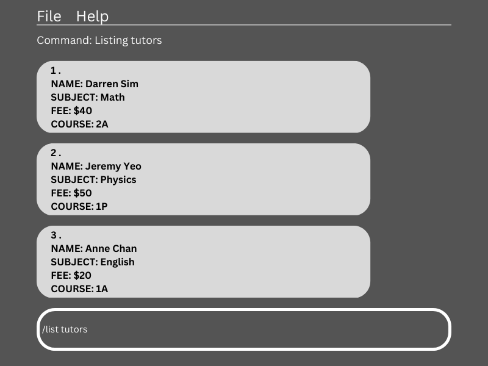
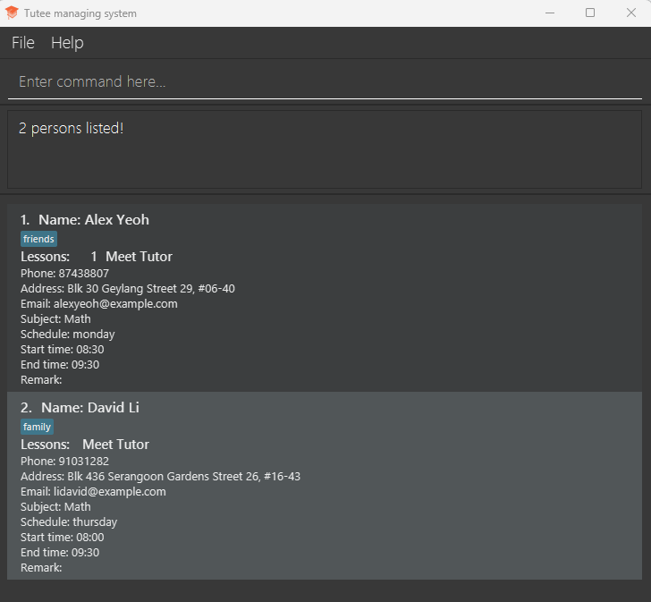

PlanEase is a **desktop app tailored for event planners to organise and manage their contacts**. It is optimised for use via a Command Line Interface (CLI), while still retaining the familiar GUI from the address book. If you are a fast typist, PlanEase will accelerate your current workflow compared to your traditional address books.
* Table of Contents
{:toc}

--------------------------------------------------------------------------------------------------------------------

## Quick start

1. Ensure you have Java `11` or above installed in your Computer.

1. Download the latest `planease.jar`(Coming soon!)

1. Copy the file to the folder you want to use as the _home folder_ for your PlanEase application.

1. Open a command terminal, `cd` into the folder you put the jar file in, and use the `java -jar planease.jar` command to run the application. 
   A GUI similar to the below should appear in a few seconds. Note how the app contains some sample data. 
   

1. Type the command in the command box and press Enter to execute it. e.g. typing **`help`** and pressing Enter will open the help window. 
   Some example commands you can try:

   * `list` : Lists all contacts.

   * `add n/John Doe p/98765432 e/johnd@example.com a/John street, block 123, #01-01` : Adds a contact named `John Doe` to the Address Book.

   * `delete 3` : Deletes the 3rd contact shown in the current list.

   * `clear` : Deletes all contacts.

   * `exit` : Exits the app.

1. Refer to the [Features](#features) below for details of each command.

--------------------------------------------------------------------------------------------------------------------

## Features

**:information_source: Notes about the command format:** 

* Words in `UPPER_CASE` are the parameters to be supplied by the user. 
  e.g. in `add n/NAME`, `NAME` is a parameter which can be used as `add n/John Doe`.

* Items in square brackets are optional. 
  e.g `n/NAME [t/TAG]` can be used as `n/John Doe t/friend` or as `n/John Doe`.

* Items with `…`​ after them can be used multiple times including zero times. 
  e.g. `[t/TAG]…​` can be used as ` ` (i.e. 0 times), `t/friend`, `t/friend t/family` etc.

* Parameters can be in any order. 
  e.g. if the command specifies `n/NAME p/PHONE_NUMBER`, `p/PHONE_NUMBER n/NAME` is also acceptable.

* If a parameter is expected only once in the command but you specified it multiple times, only the last occurrence of the parameter will be taken. 
  e.g. if you specify `p/12341234 p/56785678`, only `p/56785678` will be taken.

* Extraneous parameters for commands that do not take in parameters (such as `help`, `list`, `exit` and `clear`) will be ignored. 
  e.g. if the command specifies `help 123`, it will be interpreted as `help`.

* `DATEIME` must be in this format: `DD-MM-YYYY HH:mm`.

### Viewing help : `help`

Shows a message explaning how to access the help page.

Format: `help`

### Adding a person: `add`

Adds a person to the address book and adds existing event to this person if event index is specified.

Format: `add n/NAME p/PHONE_NUMBER e/EMAIL a/ADDRESS [evt/EVENT_INDEX]…​`

* The event index refers to the index number shown in the displayed event list.
* The event index **must be a positive integer** 1, 2, 3, …​

:bulb: **Tip:**
A person can have any number of events (including 0)

Examples:
* `add n/John Doe p/98765432 e/johnd@example.com a/John street, block 123, #01-01` Adds person to the address book.
* `add n/Alex Yeoh p/89028392 e/alex@email.com a/Blk 142 Apple Street 23 evt/1` Adds 1st event to the new person `Alex Yeoh` in the address book.

### Listing all persons : `list`

Shows a list of all persons in the address book.

Format: `list`

### Editing a person : `edit`

Edits an existing person in the address book.

Format: `edit INDEX [n/NAME] [p/PHONE] [e/EMAIL] [a/ADDRESS] [evt/EVENT INDEX]…​`

* Edits the person at the specified `INDEX`. The index refers to the index number shown in the displayed person list. The index **must be a positive integer** 1, 2, 3, …​
* At least one of the optional fields must be provided.
* Existing values will be updated to the input values.
* When editing tags, the tags will be added to the existing tags of the person i.e adding of tags is cumulative.
* You can remove all the person’s event tags by typing `evt/` without
    specifying any event index after it.

Examples:
*  `edit 1 p/91234567 e/johndoe@example.com` Edits the phone number and email address of the 1st person to be `91234567` and `johndoe@example.com` respectively.
*  `edit 2 n/Betsy Crower evt/` Edits the name of the 2nd person to be `Betsy Crower` and clears all existing event tags.

### Locating persons by name: `find`

Finds persons whose names contain any of the given keywords.

Format: `find KEYWORD [MORE_KEYWORDS]`

* The search is case-insensitive. e.g `hans` will match `Hans`
* The order of the keywords does not matter. e.g. `Hans Bo` will match `Bo Hans`
* Only the name is searched.
* Only full words will be matched e.g. `Han` will not match `Hans`
* Persons matching at least one keyword will be returned (i.e. `OR` search).
  e.g. `Hans Bo` will return `Hans Gruber`, `Bo Yang`

Examples:
* `find John` returns `john` and `John Doe`
* `find alex david` returns `Alex Yeoh`, `David Li` 
  

### Deleting a person : `delete`

Deletes the specified person from the address book.

Format: `delete INDEX`

* Deletes the person at the specified `INDEX`.
* The index refers to the index number shown in the displayed person list.
* The index **must be a positive integer** 1, 2, 3, …​

Examples:
* `list` followed by `delete 2` deletes the 2nd person in the address book.
* `find Betsy` followed by `delete 1` deletes the 1st person in the results of the `find` command.

### Adding a new event : `addevent`

Adds a new event with the given event name, start date time, and end date time.

Format: `addevent ev/EVENT_NAME from/DATETIME to/DATETIME`

* Event name can be a combination of alphanumeric and punctuations with spaces.
* Event name must begin with alphanumeric.
* Start date time cannot be after the end date time.

Examples:
* `addevent ev/Wedding Dinner from/01-05-2023 17:00 to/01-05-2023 21:00`
* `addevent ev/Dinner from/01-05-2023 17:30 to/01-05-2023 19:30`

### Listing all events : `listevent`

Prints all the existing events in the address book.

Format: `listevent`

* Does not require any additional user arguments.
* Follow strictly to the command `listevent`.

Examples:
* `listevent` prints a list of events.

### Deleting an event : `delevent`

Deletes the specified event from the event list and deletes all occurrences of the event tied to persons in the address book, if any.

Format: `delevent EVENT_INDEX`

* Deletes the event at the specified `EVENT_INDEX` and all occurrences of the event tied to persons in the address book, if any.
* The event index refers to the index number shown in the displayed event list.
* The event index **must be a positive integer** 1, 2, 3, …​

Examples:
* `listevent` followed by `delevent 2` deletes the 2nd event in the event list and all occurrences of the 2nd event tied to persons in the address book, if any.

### Editing an event : `editevent`

Edits an existing event in the address book.

Format: `editevent EVENT_INDEX [ev/EVENT_NAME] [from/DATETIME] [to/DATETIME]`

* Edits the event at the specified `EVENT_INDEX` and edits the relevant event tag tied to all persons in the address book.
* The event index refers to the index number shown in the displayed event list. The event index **must be a positive integer** 1, 2, 3, …​
* At least one of the optional fields must be provided.
* Existing values will be updated to the input values.
* Edits will not allow start date time to be after the end date time.

Examples:
*  `editevent 1 ev/Birthday Party from/17-07-2023 12:00` Edits the event name and start datetime of the 1st event to be `Birthday Party` and `17-07-2023 12:00` respectively.

### Clearing all entries : `clear`

Clears all entries from the address book.

Format: `clear`

### Exiting the program : `exit`

Exits the program.

Format: `exit`

### Saving the data

AddressBook data are saved in the hard disk automatically after any command that changes the data. There is no need to save manually.

### Editing the data file

AddressBook data are saved as a JSON file `[JAR file location]/data/addressbook.json`. Advanced users are welcome to update data directly by editing that data file.

:exclamation: **Caution:**
If your changes to the data file makes its format invalid, AddressBook will discard all data and start with an empty data file at the next run.

### Archiving data files `[coming in v2.0]`

_Details coming soon ..._

--------------------------------------------------------------------------------------------------------------------

## FAQ

**Q**: How do I transfer my data to another Computer? 
**A**: Install the app in the other computer and overwrite the empty data file it creates with the file that contains the data of your previous AddressBook home folder.

--------------------------------------------------------------------------------------------------------------------

## Command summary

Action | Format, Examples
--------|------------------
**Add Contact** | `add n/NAME p/PHONE_NUMBER e/EMAIL a/ADDRESS [t/TAG]… [ev/EVENT_INDEX] …​`   e.g., `add n/Alex Yeoh p/89028392 e/alex@email.com a/Blk 142 Apple Street 23 ev/1`
**Add Event** | `addevent ev/EVENT_NAME from/DATETIME to/DATETIME`   e.g., `addevent ev/Wedding Dinner from/01-05-2023 17:00 to/01-05-2023 21:00`
**Clear** | `clear`
**Delete Contact** | `delete INDEX`  e.g., `delete 3`
**Delete Event** | `delevent EVENT_INDEX`   e.g., `delevent 2`
**Edit Contact** | `edit INDEX [n/NAME] [p/PHONE_NUMBER] [e/EMAIL] [a/ADDRESS] [t/TAG]…​`  e.g.,`edit 2 n/James Lee e/jameslee@example.com`
**Edit Event** | `editevent EVENT_INDEX [ev/EVENT_NAME] [from/DATETIME] [to/DATETIME]​`  e.g.,`editevent 1 ev/Birthday Party from/17-07-2023 12:00`
**List Contact** | `list`
**List Event** | `listevent`
**Help** | `help`

