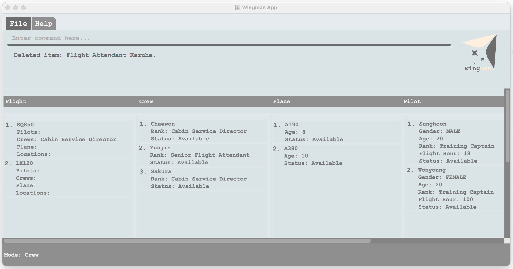
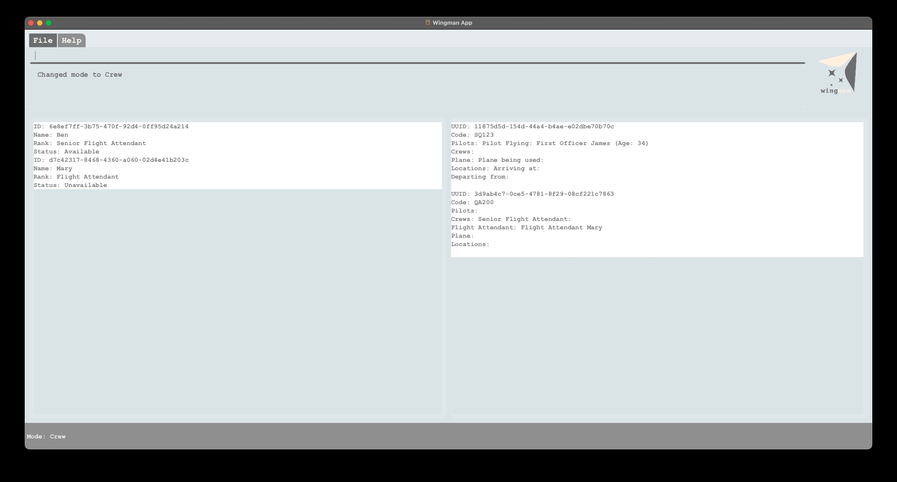
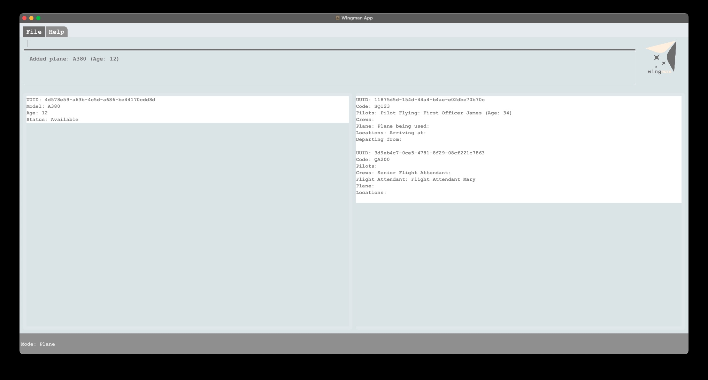
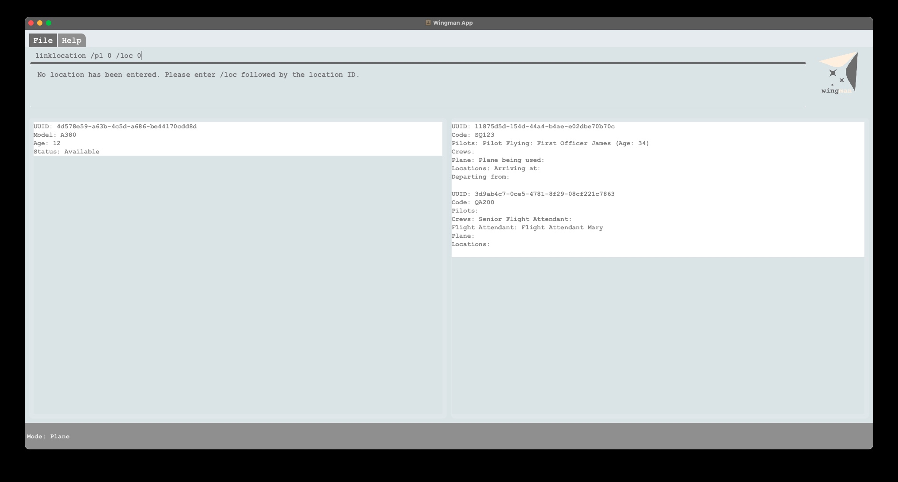
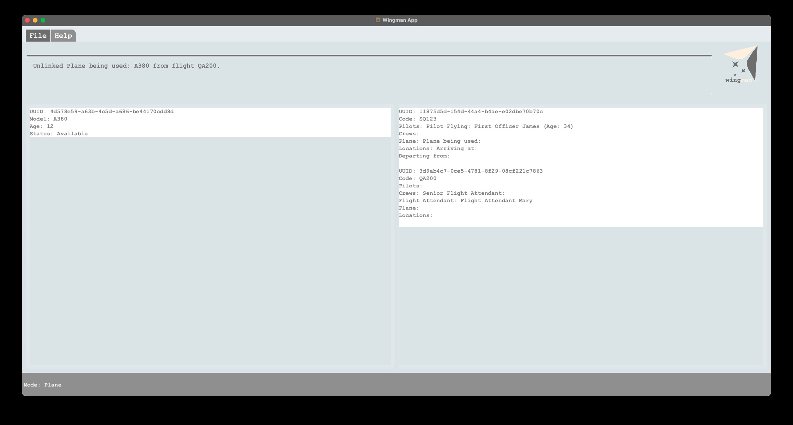

### Wingman User Guide

Wingman is a resource management tool designed for airline managers that allows for efficient management of crew,
flights, locations, pilots, and planes via a Command Line Interface (CLI) while still providing the benefits of a
Graphical User Interface (GUI). The functionalities include adding, deleting, checking, or associating these
flight-related resources.

This guide is to guide you on how to use Wingman to efficiently manage the various aspects of airline operations,
such as flight scheduling and management of crew, pilot, plane and location.

## Table of Contents

- **[How to use this guide?](#how-to-use-this-guide)**
- **[Getting Started](#getting-started)**
- **[Features](#features)**
    - **[Modal Editing](#modal-editing)**
    - **[Shared Commands](#shared-commands)**
    - **[Mode-specific Commands](#mode-specific-commands)**
    - **[Application Commands](#application-commands)**
- **[Command summary](#command-summary)**
- **[FAQ](#faq)**
- **[Other information](#other-information)**

<div style="page-break-after: always;"></div>

## How to use this guide?

This user guide provides an in-depth documentation on the multiple features that enable Wingman
to assist you in managing your resources.
We have also included a handy [command summary](#command-summary) where you can view all the commands at a glance.
Refer to the next section to see how you can get started in just a few steps!

For the description of commands, `{resource}_index` (e.g. `plane_index`) acts a placeholder in the command format where
a
plane's index would be inputted. The index of any resource can be found as the number next to it in the list. Please
refer to the image below for clarity.

## Getting Started

You can get started with Wingman in just 3 simple steps:

1. Click [here](https://github.com/AY2223S2-CS2103T-W11-1/tp/releases/tag/v1.3) to download the Wingman.jar file
2. Open the terminal or command prompt (for Windows users) application in your device
3. Run the following command in your terminal under the directory: `java -jar Wingman.jar`

You should now be in the Wingman application.

A GUI similar to the below should appear in a few seconds.
Note how the app contains some sample data.



If that is not the case, head over to our [FAQ](#faq) section to troubleshoot


<div style="page-break-after: always;"></div>

## Features

### Modal Editing

Wingman offers 5 different modes through which you can manage your resources, with each mode
corresponding to one resource that the app can manage:

- `crew` mode: to manage the crews that form your airline workforce
- `flight` mode: to manage the flights that your airline operates
- `location` mode: to manage the locations in which your airline operates
- `pilot` mode: to manage the pilots that form your airline workforce
- `plane` mode: to manage the planes that your airline operates

The different modes offer similar and intuitive commands, with optimisations to cater to the subject
that the mode is managing. This means you do not have to worry about memorising complex commands and instead
can dive right into the management of your airline. As a result of Wingman's modal design, you will be
able to complete a variety of management tasks through singular commands. These commands are detailed
in the subsequent [sections](#shared-commands).

To switch between different modes simply enter the following command:

```
mode XYZ
```

where XYZ can be any of the modes as described above (i.e. `crew`, `flight`, `location`, `pilot`, `plane`).



As shown in the image above, upon successfully switching to a mode, Wingman will
display the current mode's name in the status bar in the bottom left corner of the window.
The window also displays 2 lists, the left one displaying the entities belonging to the current resource mode
and the right one displaying all the flights that these entities can be linked to.


<div style="page-break-after: always;"></div>

### Shared Commands

The commands in this section are available across ALL 5 modes.

#### 1. Adding a resource

Use this command when you wish to add a new resource entity (e.g. a new plane that has been added to your fleet)
to Wingman, for you to manage the resource.

```
add /prefix_A value_A /prefix_B value_B
```

This commands adds an entity of the current resource mode to Wingman's database. For example,
if you are currently in the `plane` mode, then this command will add a new `plane` to the database. It should be noted,
however, that the prefixes specified in different modes are different.

Here are some examples of how the command works in each mode:

##### Crew mode: `add /n name /r rank`

Prefixes:

- `/n`: the name of the crew.
- `/r`: the rank of the crew.
    - `0`: Cabin Service Director,
    - `1`: Senior Flight Attendant,
    - `2`: Flight Attendant,
    - `3`: Trainee.

Example:

```
Input:
add /n John Smith /r 0

Output: 
Added Cabin Service Director John Smith.
```

##### Flight mode: `add /c code`

Prefix:

- `/c` : the code for the flight.

Example:

```
Input:
add /c SQ230

Output: 
Added flight SQ230.
```

##### Location mode: `add /n name`

Prefix:

- `/n`: name of the location.

Example:

```
Input:
add /n Tokyo

Output: 
Added Tokyo.
```

##### Pilot mode: `add /n name /r rank /a age /g gender /fh flight_hours`

Prefixes:

- `/n`: the name of the pilot.
- `/r`: the rank of the pilot. Possible values:
    - `0`: Training Captain,
    - `1`: Captain,
    - `2`: Senior First Officer,
    - `3`: First Officer,
    - `4`: Second Officer,
    - `5`: Cadet.
- `/a`: the age of the captain.
- `/g`: the gender of the pilot. Possible values:
    - `0`: male
    - `1`: female
    - `2`: other
- `/fh`: the flight hours of the pilot.

Example:

```
Input:
add /n Amelia Earhart /r 5 /a 34 /g 1 /fh 1000

Output: 
Added Cadet Amelia Earhart.
```

##### Plane mode: `add /m model /a age`

Prefixes:

- `/m`: model of the plane.
- `/a`: age of the plane.

Example:

```
Input:
add /m A380 /a 10

Output: 
Added A380.
```

If the command is valid, upon pressing enter, your application window will be updated as shown below.
The response box describes the addition that was made and the new entity should be displayed in the left list.




<div style="page-break-after: always;"></div>

#### 2. Deleting a resource

Use this command when you wish to remove a resource entity (e.g. a pilot that has retired)
from Wingman, to keep your database of resources up to date.

```
delete index_number
```

This commands deletes an entity of the current resource mode from Wingman's database. For example,
if you are currently in the `plane` mode, then this command will delete the specified `plane` from the database.

This command has no variations across modes:

##### All modes: `delete 3`

Prefix:

- `index_number`: the index number of the resource entity you wish to delete. Note that the indexing starts from 0.

The index number of an entity can be obtained from its position in the displayed list.

Example (in `plane` mode):

```
Input:
delete 0

Output: 
Deleted A380.
```

For instance, Flight Attendant Mary will have an index number of 1 in the image below.
(The index number will be displayed in future updates)


<div style="page-break-after: always;"></div>

### Mode-specific Commands

The commands in this section are only available in some modes.

#### 1. Linking a resource to a location

Use this command when you wish to link a resource entity to a location
(e.g. a pilot that has just landed in Dubai can have his location set as Dubai, so you are able to identify
the correct pilots when filtering the pilots by location).

```
linklocation /lo location_index /resource_prefix resource_index
```

This command is ONLY available in the following modes: `crew`, `flight`, `pilot` and `plane`.

This commands links an entity of the current resource mode to a specified location entity in Wingman's database.
For example, if you are currently in the `plane` mode, then this command will link a `plane` to a specified location
entity in the database. It shall be noted, however, that the prefixes specified in different modes are different.

Note: Indexing for `location_index` and `resource_index` starts from 0.

Here are some examples of how the command works in each mode:

##### Crew mode: `linklocation /lo location_index /cr crew_index`

Prefixes:

- `/lo`: the index of the location to which the crew is to be linked to.
- `/cr`: the index of the crew to be linked.

Example:

```
Input:
linklocation /lo 0 /cr 1

Output: 
Linked Cabin Service Director John Smith to Tokyo.
```

##### Flight mode: `linklocation /fl flight_index /from location_index /to location_index`

Prefixes:

- `/fl`: the index of the flight to be linked.
- `/from`: the index of the location to which the flight is to be linked as departing from.
- `/to`: the index of the location to which the flight is to be linked as arriving at.

Example:

```
Input:
linklocation /fl 0 /from 0 /to 1

Output: 
Linked flight SQ230 departing from Tokyo, arriving in Paris.
```

##### Pilot mode: `linklocation /lo location_index /pi pilot_index`

Prefixes:

- `/lo`: the index of the location to which the pilot is to be linked to.
- `/pi`: the index of the pilot to be linked.

Example:

```
Input:
linklocation /lo 0 /pi 1

Output: 
Linked Cadet Amelia Earhart to Tokyo.
```

##### Plane mode: `linklocation /lo location_index /pl plane_index`

Prefixes:

- `/lo`: the index of the location to which the plane is to be linked to.
- `/pl`: the index of the plane to be linked.

Example:

```
Input:
linklocation /lo 0 /pl 1

Output: 
Linked A380 to Tokyo.
```

If the command is valid, Wingman will return a response describing the link that has been made, as shown below:




<div style="page-break-after: always;"></div>

#### 2. Unlinking a resource from a location

Use this command when you wish to unlink a resource entity from a location
(e.g. when a plane has departed from Milan, you can unlink it from Milan,
so you get the correct information when filtering planes by location).

```
unlinklocation /lo location_index /resource_prefix resource_index
```

Same as `linklocation` command, this command is ONLY available in the following modes: `crew`, `flight`, `pilot`
and `plane`.

This commands unlinks an entity of the current resource mode to a specified location entity in Wingman's database.
For example, if you are currently in the `plane` mode, then this command will unlink a `plane`
from the specified location entity in the database. It shall be noted, however,
that the prefixes that are specified in different modes are different.

Note: Indexing for `location_index` and `resource_index` starts from 0.

Here are some examples of how the command works in each mode:

##### Crew mode: `unlinklocation /lo location_index /cr crew_index`

Prefixes:

- `/lo`: the index of the location from which the crew is to be unlinked from.
- `/cr`: the index of the crew to be unlinked.

Example:

```
Input:
unlinklocation /lo 0 /cr 1

Output: 
Unlinked Cabin Service Director John Smith from Tokyo.
```

##### Flight mode: `unlinklocation /fl flight_index /from departure_index /to arrival_index`

Prefixes:

- `/fl`: the index of the flight to be unlinked.
- `/from`: the index of the departure location from which the flight is to be unlinked.
- `/to`: the index of the arrival location from which the flight is to be unlinked.

Example:

```
Input:
unlinklocation /fl 0 /from 0 /to 1

Output: 
Unlinked flight SQ230 from Tokyo and Paris.
```

##### Pilot mode: `unlinklocation /lo location_index /pi pilot_index`

Prefixes:

- `/lo`: the index of the location from which the pilot is to be unlinked from.
- `/pi`: the index of the pilot to be unlinked.

Example:

```
Input:
unlinklocation /lo 0 /pi 1

Output: 
Unlinked Cadet Amelia Earhart from Tokyo.
```

##### Plane mode: `unlinklocation /lo location_index /pl plane_index`

Prefixes:

- `/lo`: the index of the location from which the plane is to be unlinked from.
- `/pl`: the index of the plane to be unlinked.

Example:

```
Input:
unlinklocation /lo 0 /pl 1

Output: 
Unlinked A380 from Tokyo.
```

<div style="page-break-after: always;"></div>

#### 3. Linking a resource to a flight

Use this command when you wish to link a resource entity to a flight (e.g. when assigning pilots to flights,
you can use this command to link each pilot to a flight).

```
linkflight /fl flight_index /resource_prefix resource_index
```

This command is ONLY available in the following modes: `crew`, `pilot` and `plane`.
(Note: Locations are linked to flights through the `flight` mode, using the `linklocation` command described
[above](#1-linking-a-resource-to-a-location))

This commands links an entity of the current resource mode to a specified flight in Wingman's database. For example,
if you are currently in the `plane` mode, then this command will link a `plane` to a specified flight in the database.
It shall be noted, however, that the indexes specified in different modes are different.

Note: Indexing for `flight_index` and `resource_index` starts from 0.

Here are some examples of how the command works in each mode:

##### Crew mode:

`linkflight /fl flight_index /csd crew_index /sfa crew_index /fa crew_index /tr crew_index`

Prefixes:

- `/fl`: the flight to which the specified crew is to be linked to.
- `/csd`: the index of the crew to be linked as Cabin Service Director (CSD) for this flight.
- `/sfa`: the index of the crew to be linked as Senior Flight Attendant (SFA) for this flight.
- `/fa`: the index of the crew to be linked as Flight Attendant (FA) for this flight.
- `/tr`: the index of the crew to be linked as Trainee (TR) for this flight.

Note: In each `linkflight` command under crew mode, you only need to fill up **at least** 1 crew related prefix.

Example:

```
Input:
linkflight /fl 0 /csd 1

Output: 
Linked Cabin Service Director John Smith to SQ230.
```

##### Pilot mode: `linkflight /fl flight_index /pf pilot_index /pm pilot_index`

Prefixes:

- `/fl`: the flight to which the specified pilots are to be linked to.
- `/pf`: the index of the flying pilot to be linked to the flight.
- `/pm`: the index of the monitoring pilot to be linked to the flight.

Note: In each `linkflight` command under pilot mode, you only need to fill up **at least** 1 pilot related prefix.

Example:

```
Input:
linkflight /fl 0 /csd 1

Output: 
Linked Cadet Amelia Earhart to SQ230.
```

##### Plane mode: `linkflight /fl flight_index /pl plane_index`

Prefixes:

- `/fl`: the flight to which the specified plane is to be linked to.
- `/pl`: the index of the plane to be linked as being used for the flight.

Example:

```
Input:
linkflight /fl 0 /pl 1

Output: 
Linked A380 to SQ230.
```

<div style="page-break-after: always;"></div>

#### 4. Unlinking a resource from a flight

Use this command when you wish to unlink a resource entity from a flight (e.g. when a flight has been cancelled,
you can use this command to unlink the crew members from the flight).

```
unlinkflight /fl flight_index /resource_prefix resource_index 
```

This command is ONLY available in the following modes: `crew`, `pilot` and `plane`.
(Note: Locations are unlinked from flights through the `flight` mode, using the `unlinklocation` command described
[above](#2-unlinking-a-resource-from-a-location))

This command unlinks an entity of the current resource mode from a specified flight in Wingman's database. For example,
if you are currently in the `plane` mode, then this command will unlink a `plane` from a specified flight in the
database. It shall be noted, however, that the prefixes specified in different modes are different.

Note: Indexing for `flight_index` and `resource_index` starts from 0.

Here are some examples of how the command works in each mode:

##### Crew mode:

`unlinkflight /fl flight_index /csd crew_index /sfa crew_index /fa crew_index /tr crew_index`

Prefixes:

- `/fl`: the flight from which the specified crew is to be unlinked from.
- `/csd`: the index of the crew to be unlinked as Cabin Service Director (CSD) for this flight.
- `/sfa`: the index of the crew to be unlinked as Senior Flight Attendant (SFA) for this flight.
- `/fa`: the index of the crew to be unlinked as Flight Attendant (FA) for this flight.
- `/tr`: the index of the crew to be unlinked as Trainee (TR) for this flight.

Note: In each `unlinkflight` command in crew mode, you only need to fill up **at least** 1 crew related prefix.

Example:

```
Input:
unlinkflight /fl 0 /csd 1

Output: 
Unlinked Cabin Service Director John Smith from SQ230.
```

##### Pilot mode: `unlinkflight /fl flight_index /pf pilot_index /pm pilot_index`

Prefixes:

- `/fl`: the flight from which the specified pilots are to be linked from.
- `/pf`: the index of the flying pilot to be unlinked from the flight.
- `/pm`: the index of the monitoring pilot to be unlinked from the flight.

Note: In each `unlinkflight` command in pilot mode, you only need to fill up **at least** 1 pilot related prefix.

Example:

```
Input:
unlinkflight /fl 0 /csd 1

Output: 
Unlinked Cadet Amelia Earhart from SQ230.
```

##### Plane mode: `unlink /fl flight_index /pl plane_index`

Prefixes:

- `/fl`: the flight from which the specified plane is to be linked from.
- `/pl`: the index of the plane to be unlinked as being used for the flight.

Example:

```
Input:
unlinkflight /fl 0 /pl 1

Output: 
Unlinked A380 from SQ230.
```

If the command is valid, Wingman will return a response describing how the specified link has been removed.
Wingman will also update the lists in your window, to remove the specified link.



#### 5. Checking a resource's availability

Use this command when you wish to check a resource's availability (i.e. when deciding to use a resource for flight, you
can use this command to check whether the resource is already currently linked to another flight).

```
check /id resource_index
```

This command is ONLY available in the following modes: `crew`, `pilot` and `plane`.

This command checks whether an entity of the current resource is currently linked to a flight in Wingman's database.
For example, if you are currently in `plane` mode, then this command will check whether the specified `plane` is linked
to any flights or not and indicate its availability.

This command is the same across `crew`, `pilot`, and `plane`.

Note: Indexing for `resource_index` starts from 0.

Example (in `plane` mode):

```
Input:
check /id 0

Output: 
A380 is available.
```

<div style="page-break-after: always;"></div>

### Application Commands

#### 1. Exiting from Wingman

```
exit
```

This will close the application window and exit the program.
All your changes to your resources will be saved for you to get back to when you reopen the application.

<div style="page-break-after: always;"></div>

## Prefix Summary

| **Action** | **Meaning**               | **Followed by**                  |
|------------|---------------------------|----------------------------------|
| /n         | `name`                    | Name of crew, location, or pilot |
| /r         | `rank`                    | Rank of crew, or pilot           |
| /c         | `code`                    | Code of flight                   |
| /a         | `age`                     | Age of pilot, or plane           |
| /g         | `gender`                  | Gender of pilot                  |
| /fh        | `flight hour`             | Flight hours of pilot            |
| /m         | `model`                   | Model of plane                   |
| /cr        | `crew`                    |                                  |
| /fl        | `flight`                  |                                  |
| /lo        | `location`                |                                  |
| /pi        | `pilot`                   |                                  |
| /pl        | `plane`                   |                                  |
| /from      | `departure location`      | Index of departure location      |
| /to        | `arrival location`        | Index of arrival location        |
| /csd       | `cabin service director`  | Index of cabin service director  |
| /sfa       | `senior flight attendant` | Index of senior flight attendant |
| /fa        | `flight attendant`        | Index of flight attendant        |
| /tr        | `trainee`                 | Index of trainee                 |
| /pf        | `pilot flying`            | Index of pilot flying            |
| /pm        | `pilot monitoring`        | Index of pilot monitoring        |
| /id        | `index`                   | Index of an entity               |

<div style="page-break-after: always;"></div>

## Command Summary

| **Action**      | **Format**                                                          | **Examples**                   |
|-----------------|---------------------------------------------------------------------|--------------------------------|
| Add             | `add /prefix_A value_A /prefix_B value_B`                           | `add /n Bob /r 2`              |
| Delete          | `delete resource_index`                                             | `delete 1`                     |
| Link location   | `linklocation /lo location_index /resource_prefix resource_index`   | `linklocation /lo 0 /cr 1`     |
| Unlink location | `unlinklocation /lo location_index /resource_prefix resource_index` | `unlinklocation /lo 0 /fl 1`   |
| Link flight     | `linkflight /fl flight_index /resource_prefix resource_index `      | `linkflight /fl 0 /pf 1 /pm 2` |
| Unlink flight   | `unlinkflight /fl flight_index /resource_prefix resource_index `    | `unlinkflight /fl 0 /pu 1`     |
| Check           | `check /id resource_index`                                          | `check /id 0`                  |
| Exit            | `exit`                                                              | `exit`                         |

<div style="page-break-after: always;"></div>

## FAQ

### 1. Why is Wingman not opening when I run the `java -jar` command?

- You might be running the command in the wrong directory.
  Navigate to the directory where you downloaded the application file and run the same command again.
- Verify that your java version is 11. You may run `java -version` in your terminal to see your Java SDK version.
  If you need to install Java 11, please follow
  this [guide](https://nus-cs2103-ay2223s2.github.io/website/admin/programmingLanguages.html#programming-language).
  Below is one example showing the correct version:

```agsl
openjdk version 11.0.18 2023-01-17 LTS
OpenJDK Runtime Environment Zulu11.62+17-CA (build 11.0.18+10-LTS)
OpenJDK 64-Bit Server VM Zulu11.62+17-CA (build 11.0.18+10-LTS, mixed mode)
```

## Other information

This App is developed at the National University of Singapore.
