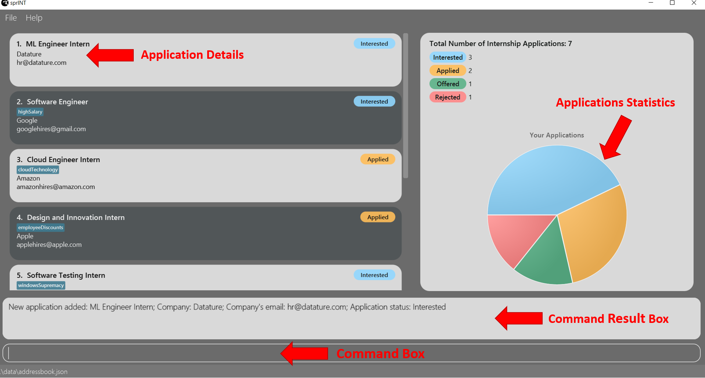
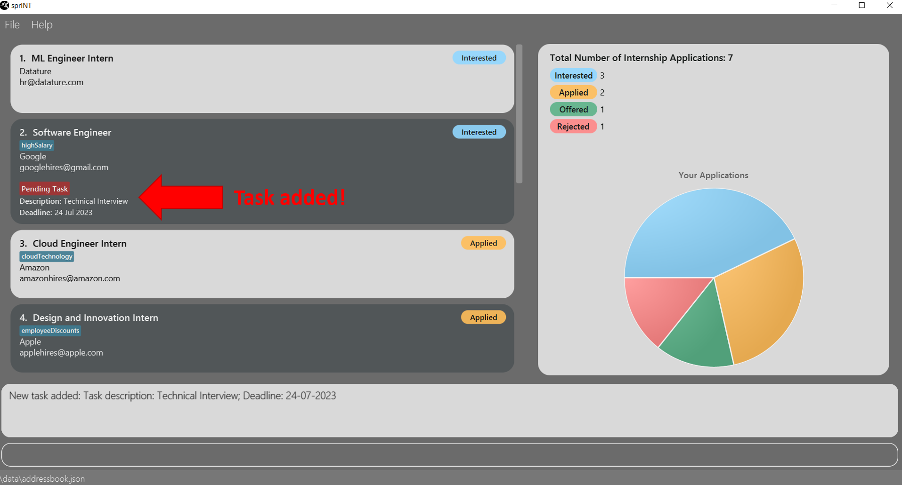

## Table of Contents
 
* [1. Introduction](#1-introduction)
* [2. About the User Guide](#2-about-the-user-guide)
  * [2.1 Target Audience](#21-target-audience)
  * [2.2 Using the Guide](#22-using-the-guide)
  * [2.3 Understanding Notations](#23-understanding-notations)
* [3. About sprINT](#3-about-sprint)
  * [3.1 Configuration and Setup Guide](#31-configuration-and-setup-guide)
  * [3.2 The User Interface](#32-the-user-interface)
  * [3.3 About sprINT's Commands](#33-about-sprints-commands)
  * [3.4 Short Tutorial](#34-short-tutorial)
* [4. Features](#4-features)
  * [4.1 Managing Applications](#41-managing-applications)
    * [4.1.1 Adding an application](#411-adding-an-application--add-app)
    * [4.1.2 Editing an application](#412-editing-an-application--edit-app)
    * [4.1.3 Deleting an application](#413-deleting-an-application--delete-app)
    * [4.1.4 Managing application tags](#414-managing-application-tags-with-add-app-and-edit-app)
  * [4.2 Managing Tasks](#42-managing-tasks)
    * [4.2.1 Adding a task](#421-adding-a-task--add-task)
    * [4.2.2 Editing a task](#422-editing-a-task--edit-task)
    * [4.2.3 Deleting a task](#423-deleting-a-task--delete-task)
  * [4.3 Managing Display of Applications](#43-managing-display-for-applications)
    * [4.3.1 Listing all applications](#431-listing-all-applications--list)
    * [4.3.2 Finding applications](#432-finding-applications--find)
    * [4.3.3 Sorting applications](#433-sorting-applications--sort)
  * [4.4 Miscellaneous Commands](#44-miscellaneous-commands)
    * [4.4.1 Viewing help](#441-viewing-help--help)
    * [4.4.2 Undoing a command](#442-undoing-a-command--undo)
    * [4.4.3 Redoing a command](#443-redoing-a-command--redo)
* [5. FAQ](#5-faq)
* [6. Glossary](#6-glossary)
* [7. Command Summary](#7-command-summary)

--------------------------------------------------------------------------------------------------------------------

## **1. Introduction**

Are you a student who wants to avoid the hassle of managing internship applications? Look no further than sprINT, 
the ideal tool for streamlining this daunting process!

sprINT is a **desktop application** that can help YOU track your internship applications.
Optimised for use by typing while offering a beautiful user interface, it will be a **_great_** asset in your internship 
application journey.

--------------------------------------------------------------------------------------------------------------------

## **2. About the User Guide** 

In this section, you will find information pertaining to the user guide (the document you are reading now!). It includes 
details about who this guide is meant for and how to navigate this guide effectively.  

### **2.1 Target Audience**
This user guide is meant for anyone who wants to use sprINT. It is designed to provide clear and concise instructions
for beginners to kickstart their sprINT journey, as well as for existing or more advanced users who wish to explore 
the full range of features that sprINT has to offer. Whether you are a new or seasoned sprINT user, this guide will be 
your best companion to help you get the most out of sprINT. 

### **2.2 Using the Guide**  
If you are a new user, we recommend you to check out the 
**[Configuration and Setup Guide](#31-configuration-and-setup-guide)** to learn how to set up sprINT quickly, before 
reading through the **[Short Tutorial](#34-short-tutorial)** to pick up a few simple commands.

If you have already used sprINT before, feel free to use the **[Table of Contents](#table-of-contents)** to navigate to 
the section you are interested in, or skip directly to a specific command in **[Features](#4-features)** that 
you wish to learn more about.

### **2.3 Understanding Notations**
Throughout the rest of this user guide, you may encounter certain notations like the ones below. Here's how you should
interpret them: 

**Tips**

Tips are useful suggestions that will help you become a seasoned sprINT user quicker.

:bulb:
**Tip:** Tips give you a better experience with sprINT.

**Notes**

Notes are important information that you should pay attention to when using sprINT.

:information_source:
**Note:** Take notes when you see this icon.

**Caution**

Cautions are in place to warn you of potential pitfalls you may encounter, especially for new users of sprINT.

:exclamation:
**Caution:** Stop and read carefully when you see this!

--------------------------------------------------------------------------------------------------------------------

## **3. About sprINT**

In this section, you will find basic information about sprINT that's just enough to get you started. This includes a 
guide for [configuring and setting up sprINT](#31-configuration-and-setup-guide) for first-time users, an [overview of 
sprINT's user interface](#32-the-user-interface), general notes about [commands in sprINT](#33-about-sprints-commands), 
as well as a [short tutorial](#34-short-tutorial).  

### **3.1 Configuration and Setup Guide**

Step 1: Ensure you have Java `11` or above installed in your computer.

Step 2: Download the latest `sprINT.jar` file [here](https://github.com/AY2223S2-CS2103T-T13-3/tp/releases/tag/v1.3.1).

Step 3: Copy the file to the folder you want to use as the [home folder](#home-folder) for your sprINT application.

Step 4: Double-click on the jar file to run the application.
If it doesn't work, open a [command terminal](#command-terminal), enter `cd` with the path to the folder you put the jar file in,
and type: `java -jar sprINT.jar` to run the application. 

:bulb:
**Tip:** `cd` stands for "change directory". As the name suggests, it is a command that allows you to navigate
to another directory/folder on your computer.

An interface similar to the one shown below should appear in a few seconds. If you are using sprINT for the first time
on your device, the app will contain some sample applications already. 

:bulb:
**Tip:** The app should work for any laptop or computer regardless of the operating system (e.g., Windows, Linux, etc.)!

### **3.2 The User Interface**

We understand that using an app for the first time can be a daunting experience. This is why we created this entire 
section for you to quickly get acquainted with sprINT's user interface.

The following diagram illustrates the general layout of sprINT's app window. 

The table below describes the function(s) of each component. Don't worry if you're initially confused and cannot
remember everything; sprINT is designed to have an intuitive interface that should allow you to familiarise yourself
with in no time. You are also welcome to revisit this section again anytime. 

| No. | Component                | Description                                                                                                                                                                                                              |
|-----| :------------------------|:-------------------------------------------------------------------------------------------------------------------------------------------------------------------------------------------------------------------------|
| 1   | Toolbar                  | Contains buttons to exit sprINT (access by clicking the File button) and view help information quickly.                                                                                                                  |
| 2   | Application List Panel   | Displays the list of all/filtered/sorted applications, depending on the issued command.                                                                                                                                  |
| 3   | Application Card         | Displays information about each application, including the role, company, company email, status and tags or outstanding task (if any).                                                                                   |
| 4   | Statistics Display Panel | Displays statistics about your internship applications, including a pie chart that updates automatically after every command you execute (so there's no need to worry about updating it manually). _Pretty neat, right?_ |
| 5   | Command Result Box       | Displays feedback immediately after executing a command, indicating if it executed successfully, or if not, what went wrong (e.g. incorrect command format).                                                             |
| 6   | Command Box              | This is where you type all your commands; press Enter on your keyboard to execute them.                                                                                                                                  |
| 7   | Storage File Path        | Displays the path of your sprINT storage file.                                                                                                                                                                           |

### **3.3 About sprINT's Commands** 

Before we delve into the individual features, here are some useful notes about the general format of all commands in 
sprINT:

**:information_source: Notes about the command format:** 

* **You cannot add more than 2147483647 applications, and you cannot delete or edit applications that have index greater than 2147483647.**
If you are a normal human being, we do not foresee this to be an issue for you! 

* **Commands in sprINT are composed minimally of a [command word](#command-word). Most, but not all, commands also 
    consist of [prefixes](#prefix) and [parameters](#parameter).** 

* **Words in `UPPER_CASE` are the parameters you need to supply.** 
  e.g. in `add c/COMPANY_NAME`, `COMPANY_NAME` is a parameter which can be used as `add c/Google`.

* **Items encapsulated within square brackets `[]` are optional.** 
  e.g. `c/COMPANY_NAME [t/TAG]` can be used as `c/Google t/highsalary` or as `c/Google` only.

* **Items that come with `(s)` means multiple parameters for the same prefix can be added, as long as they are separated by a space.** 
  e.g. `[t/TAG(s)]` can be used as `t/creditBearing t/highSalary` or as `t/creditBearing` only.

:exclamation:
**Caution:** Be aware of the difference between `(s)` and `[]`. The former allows for multiple parameters of the
same prefix, while the latter represents an optional parameter.

* **Command words and prefixes are case-sensitive.** 
  e.g. `UNDO` will not be recognised as a valid command for the undo operation. Similarly, `bY/` (instead of `by/`)
  will not be recognised as a valid prefix for the `add-task` command.

* **Parameters can be entered in any order.** 
  e.g. if the command specifies the order of `r/ROLE c/COMPANY_NAME`, typing your command in the order of
`c/COMPANY_NAME r/ROLE` is also acceptable.

* **If a parameter is expected only once in the command, but you specified it multiple times, only the last occurrence
of the parameter will be taken.** 
  e.g. if you specify `r/SWE Intern r/Software Intern`, only `r/Software Intern` will be taken as it is the latest
occurrence of the prefix `r/`.

* **Extraneous parameters for commands that do not take in parameters (such as `help`, `list`, `exit` and `clear`) will be ignored.** 
  e.g. if you specify `help 123` as your command, it will be interpreted as `help`, and the help command executes.

### **3.4 Short Tutorial**
Can't wait to try sprINT out? Here is a sample sequence of commands to get the ball rolling:

1. `add-app r/Software Engineering Intern c/Google e/google_careers@gmail.com s/interested`: Adds a new
  application for a **Software Engineering Intern** position at **Google** to the internship book, with the status set
  to **Interested**. A new Application Card should appear at the top of the Application List Panel. 
2. `delete-app 3`: Removes the 3rd application shown on the Application List Panel.
3. `undo`: Reverts the previous delete operation. 
4. `add-task 2 d/Interview by/30-05-2023`: Adds a new **Interview** task with deadline **30 May 2023** to the 2nd 
    application shown on the Application List Panel. 
5. `exit`: Exits sprINT. Notice that there is no need to save your data manually, as sprINT does it for you automatically. 

Congratulations on completing the tutorial! For the complete list of available commands, you may refer to the 
**[Command Summary](#7-command-summary)** section. For more details about each command, you may read on for the next
section on **[Features](#4-features)**.

#### *Return to the [Table of Contents](#table-of-contents).*

--------------------------------------------------------------------------------------------------------------------

## **4. Features**

In this section, you will find detailed information about every feature in sprINT, including its syntax and usage 
instructions.

### 4.1 Managing Applications

This sub-section consists of commands that are related to managing [applications](#application) in sprINT. 

#### 4.1.1 Adding an application : `add-app`

Adds a new internship application to your internship book for tracking.   

Format: `add-app r/ROLE c/COMPANY_NAME e/COMPANY_EMAIL s/STATUS [t/TAG(s)]​`

The following table details the [parameters](#parameter) to be used with the `add-app` command:

| Prefix | Parameter      | Compulsory | Parameter constraints                                                                                                              | 
|--------|----------------|------------|------------------------------------------------------------------------------------------------------------------------------------|
| `r/`   | Role           | Yes        | Must be **alphanumeric** characters or **spaces** only. Cannot be empty.                                                           |
| `c/`   | Company Name   | Yes        | Must be **alphanumeric** characters or **spaces** only. Cannot be empty.                                                           |
| `e/`   | Company Email  | Yes        | Must be of the format: **local-part@domain**. Cannot be empty.                                                                     |
| `s/`   | Status         | Yes        | Must be one of the four available statuses: **interested**, **applied**, **offered**, **rejected**. Input is case-insensitive. |
| `t/`   | Tag            | No         | Must be **alphanumeric** characters only. Cannot be empty.                                                                         |

:bulb: **Tip:**
Tag is an optional field when adding an application. An application can have multiple tags or none at all. 
If you forgot to add a tag to your application after it's been created, or wish to add even more tags, refer to the
section [here](#414-managing-application-tags-with-add-app-and-edit-app) on managing application tags.

Additional things to note:
* For more information about each parameter and other sprINT-specific terminology, feel free to refer to our 
**[Glossary](#6-glossary)**.

Examples:
* `add-app r/SWE Intern c/Google e/google_careers@gmail.com s/interested t/creditBearing`
* `add-app r/Data Analyst Intern c/Bloomberg e/bloomberg_hires@bloomberg.com s/applied`

#### 4.1.2 Editing an application : `edit-app`

Edits an existing application in your internship book. 

Spotted a typo in an existing entry, or want to update the status of an application? No problem! Just specify the index 
and parameter(s) of the application you wish to edit, and `edit-app` will fix it for you. 

Format: `edit-app INDEX [r/ROLE] [c/COMPANY_NAME] [e/COMPANY_EMAIL] [s/STATUS] [t/TAG(s)]​`

Additional things to note:
* `INDEX` refers to the index of the application to edit, as shown in the Application Card. It must be a **positive 
  [integer](#integer).**
* **At least one** of the optional fields must be provided.
* `INDEX` must be of a positive value (1 and above).
* `INDEX` cannot be greater than 2147483647.
* Existing values of the application entry will be updated to what you have inputted.
* Refer to the following section [here](#414-managing-application-tags-with-add-app-and-edit-app)
  to learn more about editing an application's tag(s).
* For more information about each parameter's constraints, refer to the table in section [4.1.1](#411-adding-an-application--add-app).

Examples:
* `edit-app 1 r/Cloud Engineer e/googleHR@gmail.com`: edits the role and email address of the 1st application to be `Cloud Engineer` and `googleHR@gmail.com` respectively.
* `edit-app 2 s/Rejected`: edits the status of the 2nd application to be `Rejected`.

#### 4.1.3 Deleting an application : `delete-app`

Deletes the application you specify from your internship book.

This feature will come in handy if you no longer wish to keep track of an application, maybe because it is no longer
available or relevant to you. 

Format: `delete-app INDEX`

Additional things to note: 
* `INDEX` refers to the index of the application to delete, as shown on the Application Card. It must be a **positive
  [integer](#integer).**
* `INDEX` must be of a positive value (1 and above).
* `INDEX` cannot be greater than 2147483647.

Examples:
* `list` followed by `delete-app 2`: deletes the 2nd application shown on the Application List Panel.
* `find Google` followed by `delete-app 1`: deletes the 1st application shown on the Application List Panel after
execution of the `find` command.

#### 4.1.4 Managing application tags with `add-app` and `edit-app`

**Adding tags** 

sprINT currently supports 2 ways of adding [tags](#tag) to an application entry:

1. Tags can be added when you are creating a **new** application, as a parameter to the `add-app` command. For more 
information, refer to [section 4.1.1](#411-adding-an-application--add-app).
2. Tags can also be added to an **existing** application in the internship book as described below.   

If an application does not have any existing tags, you can add 1 or more tags to the application using `edit-app` as follows:

Format: `edit-app INDEX t/TAG(s)`

Examples (assuming applications *do not* have an existing tag):
* `edit-app 2 t/doResearch`: adds 1 tag to the 2nd application on the Application List Panel. 
* `edit-app 1 t/creditBearing t/workFromHome`: adds 2 tags to the 1st application on the Application List Panel. 

:exclamation: **Caution:** 
Remember! When adding and editing tags, the tag must be inputted as a **single word** with **no spacing and/or symbols**. 
For example, if you wish to tag an application to remind yourself that it is for your dream company, you have to use 
`t/dreamCompany` or `t/dreamcompany`, instead of `t/dream company`, `t/dream-company` and so on.

If an application already has (an) existing tag(s) that you wish to keep, you have to enter all existing tags
**AND** the new tag that you wish to add.

:exclamation: **Caution:** 
Adding of tags is not cumulative, and existing tags in the application **will be removed** if they are not entered 
together with the new tag. For example, if an application has an existing `highSalary` tag, executing 
the command `edit-app 1 t/creditBearing` would remove the original `highSalary` tag, and only the new `creditBearing` tag will be left.

Format: `edit-app INDEX t/EXISTING_TAG(s) t/NEW_TAG(s)`

Example:
* `edit-app 3 t/creditBearing t/nearHome`: adds a new `nearHome` tag to the 3rd application on the Application List Panel, 
  assuming it has an existing `creditBearing` tag.

**Editing tags**

If the application only has 1 existing tag, you can edit it using `edit-app` as follows:

Format: `edit-app INDEX t/EDITED_TAG`

Example: 
* `edit-app 4 t/doResearch`: edits the current tag of the 4th application on the Application List Panel to `doResearch`. 

If the application has more than 1 existing tag, you have to enter the edited tag(s) **AND** all other existing tags.

Format: `edit-app INDEX t/EXISTING_TAG(s) t/EDITED_TAG(s)`

Example:
* `edit-app 1 t/goodWelfare t/farFromHome t/highPay`: assuming that the 1st application on the Application List Panel 
  has existing `goodWelfare`, `farFromHome` and `payUnknown` tags, modifies `payUnknown` to `highPay`.

**Deleting tags**

You can remove **all** existing tags from an application using `edit-app` as follows:

Format: `edit-app INDEX t/` (i.e. without specifying any values after `t/`)

:information_source:
**Note:** This is the only time when the `t/` prefix can be associated with an **empty** parameter.

Otherwise, to remove any combination of existing tags, simply enter the tags that you wish to keep. 

Format: `edit-app INDEX t/EXISTING_TAG(s)_EXCLUDING_THOSE_TO_DELETE`

Example:
* `edit-app 1 t/workFromHome`: removes all other tags except `workFromHome` from the 1st application on the Application 
  List Panel, assuming the application had the `workFromHome` tag initially.
* `edit-app 2 t/creditBearing t/mentoringProvided`: removes all other tags except `creditBearing` and `mentoringProvided`
  from the 2nd application on the Application List Panel, assuming the application had the `creditBearing` and
`mentoringProvided` tags initially.

#### *Return to the [Table of Contents](#table-of-contents).*

--------------------------------------------------------------------------------------------------------------------

### 4.2 Managing Tasks

This sub-section consists of commands that are related to managing [tasks](#task) in sprINT.

#### 4.2.1 Adding a task : `add-task`

Adds a new task to an existing application.

Suppose you recently applied to `Google` for their `Software Engineer` role, and made an entry for it in the 
internship book. Then, `Google` reached out to you for a technical interview on the 24th of July, 2023. You can add this
as a task to the existing application entry using the command: `add-task 1 d/Technical Interview by/24-07-2023`
(assuming that it is showing up as the first application on the Application List Panel). 

Format: `add-task INDEX d/DESCRIPTION by/DEADLINE`

The following table details the [parameters](#parameter) to be used with the `add-app` command:

| Prefix | Parameter   | Compulsory | Constraints                                                              | 
|--------|-------------|------------|--------------------------------------------------------------------------|
| `d/`   | Description | Yes        | Must be **alphanumeric** characters or **spaces** only. Cannot be empty. |
| `by/`  | Deadline    | Yes        | Must be a valid calendar date of the format DD-MM-YYYY.                  |

Additional things to note:
* `INDEX` refers to the index of the application you wish to add a task to, as shown in the Application Card. It must be a **positive
  [integer](#integer).**
* `INDEX` must be of a positive value (1 and above).
* `INDEX` cannot be greater than 2147483647.

You can see how the new task will appear in the updated Application Card, following the scenario given above:

#### 4.2.2 Editing a task : `edit-task`

Edits an existing task for the application that you specify.

Format: `edit-task INDEX [d/DESCRIPTION] [by/DEADLINE]`

Additional things to note:
* `INDEX` refers to the index of the application you wish to edit the task of, as shown in the Application Card. It must be a **positive
  [integer](#integer).**
* `INDEX` must be of a positive value (1 and above).
* `INDEX` cannot be greater than 2147483647.
* **At least one** of the optional parameters must be provided.
* Existing description and/or deadline of the task will be updated to what you have inputted.
* For more information about each parameter's constraints, refer to the table in section [4.2.1](#421-adding-a-task--add-task).
* For more information about each parameter and other sprINT-specific terminology, feel free to refer to our 
  [Glossary](#6-glossary).

Examples:
* `edit-task 1 d/Accept offer by/09-07-2023`: edits the description and deadline of the task for the 
  1st application on the Application List Panel to be `Accept offer` and `09-07-2023` respectively.

#### 4.2.3 Deleting a task : `delete-task`

Deletes an existing task from the specified application.

Format: `delete-task INDEX`

* `INDEX` refers to the index of the application you wish to delete the task from, as shown in the Application Card. It must be a **positive
  [integer](#integer).**
* `INDEX` must be of a positive value (1 and above).
* `INDEX` cannot be greater than 2147483647.

:bulb: **Tip:**
Deleting an application's task will not delete the underlying application entry itself.
Refer to the command <a href = "https://ay2223s2-cs2103t-t13-3.github.io/tp/UserGuide.html#413-deleting-an-application--delete-app">delete-app</a> 
if you wish to delete an application entirely, including its task.

Examples:
* `list` followed by `delete-task 2`: deletes the task for the 2nd application on the Application List Panel.
* `find Google` followed by `delete-task 1`: deletes the task of the 1st application on the Application List Panel
after the execution of the `find` command.

#### *Return to the [Table of Contents](#table-of-contents).*

--------------------------------------------------------------------------------------------------------------------

### 4.3 Managing Display of Applications

#### 4.3.1 Listing all applications : `list`

Shows you a list of all your internship applications, in the order of when they are added. Application
entries that are added more recently will be shown on top.

Format: `list`

#### 4.3.2 Finding applications : `find`

Finds internship applications with information containing any of the given keywords.

Format: `find keywords(s)` or `find [r/keyword(s)] [c/keyword(s)] [s/keyword(s)]`

Additional things to note:
* The keywords are case-insensitive. e.g. You can type `GOoGlE` and it will match with `Google`.
* In `find [r/keyword(s)] [c/keyword(s)] [s/keyword(s)]`, `r/`, `c/` and `s/` are prefixes that represent the `ROLE`, `COMPANY NAME` and `STATUS` parameters respectively.
* In `find keyword(s)`, if none of the prefixes is specified, the keyword(s) will be searched according to the information under all 3 prefixes mentioned.
* When at least one prefix is provided, the keyword(s) is searched according to the information under that particular prefix.
* Only full words will be matched e.g. `Han` will not match `Hans` but `Google` will match with `Google LLC`.

Examples:
* `find Google` returns internship applications for `Google` and `Google LLC`.
* `find Google Meta` returns internship applications for `Google LLC`, `Meta Platforms`.
* `find r/SWE Intern c/Meta s/Offered` returns internship application(s) for the role of `SWE Intern` at `Meta` that is of the status `Offered`.

#### 4.3.3 Sorting applications : `sort`

Sorts internship applications in the order you desire.

:bulb: **Tip:**
While you can't undo a sort command, if you wish to go back to the default view, you can just use the `list` command.

Format: `sort SEQUENCE ORDER`

The following table details the parameters to be used with the `sort` command:

| Parameter | Compulsory | Constraints                                 | 
|-----------|------------|---------------------------------------------|
| Sequence  | Yes        | Must be either `a` or `d`.                  |
| Order     | Yes        | Must be either `alphabetical` or `deadline`.|

Additional things to note: 
* `a` and `d` for `SEQEUENCE` refer to **ascending** and **descending** respectively.
* Currently, there are two orders you can choose for `ORDER`: `alphabetical` and `deadline`
1. Choosing `alphabetical` will sort applications by their roles in alphabetical order. Should
   there be multiple application entries with the same role, their company names will be used as a tiebreaker.
   In the event that there is still a tie (i.e., two applications with same role, same company), then they will be ranked in the order of when they are created;
   more recently created application entries will be shown higher up in the list.
2. Choosing `deadline` will display applications with tasks (and therefore, deadlines) only. (Therefore, if you have no applications with no deadlines,
   an empty list will be displayed.) The applications will be sorted by their task's deadline. Should there be two applications with
   the same deadline, the application entry that is more recently created will show up higher in the list.

Examples:
* `sort a deadline` will show only applications with task deadlines. Those with earlier deadlines will be higher up in the list.
* `sort d alphabetical` will show all applications in descending alphabetical order. (Z to A)

#### *Return to the [Table of Contents](#table-of-contents).*

--------------------------------------------------------------------------------------------------------------------

### 4.4 Miscellaneous Commands

#### 4.4.1 Viewing help : `help`

Displays a pop-up window with a simple summary of all the commands and their formats. The help window that pops up will 
also have a button you can click to access the URL to this guide.

Format: `help`

#### 4.4.2 Undoing a command : `undo`

Undoes the previous command that you have typed in.

Note that you can append extra characters after undo, but all these characters will be ignored, and the basic undo command will be executed.

:information_source: **Info:**
Only `add-app`, `edit-app`, `delete-app`, `add-task`, `edit-task`, `delete-task`, `undo` and `clear` can be undone.  

This command works for all the commands made in the period that you opened sprINT for.

Format: `undo`

#### 4.4.3 Redoing a command : `redo`

Redoes the previous command that you have undo-ed.

Note that you can append extra characters after redo, but all these characters will be ignored, and the basic redo command will be executed.

:exclamation: **Caution:** 
If you executed another command immediately after undo, you will no longer be able to redo the undo-ed command.

Format: `redo`

#### 4.4.4 Clearing all applications : `clear`

Clears all existing application entries.

Format: `clear`

:exclamation: **Caution:** 
The `clear` command must be used with extreme caution, as it might potentially lead to highly undesirable outcomes.
If you accidentally issued the `clear` command, use the `undo` command to revert to the previous state.

#### 4.4.5 Exiting the program : `exit`

Exits the program.
Alternatively, you can exit the program by clicking the top-right X button to close the window. sprINT updates
your data [periodically](#446-saving-the-data), so you don't have to worry about unsaved or possible loss of data when exiting the program.

Format: `exit`

#### 4.4.6 Saving the data

Changes you've made  to your applications are automatically saved in your local storage after each command you execute
that modifies the application data. There is no need to save manually.

#### 4.4.7 Editing the data file **(for Advanced users)**

Data in the internship book are actually saved as a JSON file `[JAR file location]/data/sprint.json`. 
Advanced users are welcome to update their data directly by editing that data file.

:exclamation: **Caution:**
If your changes to the data file makes its format invalid, sprINT automatically discards all data and starts with an empty data file.

#### *Return to the [Table of Contents](#table-of-contents).*

--------------------------------------------------------------------------------------------------------------------

## **5. FAQ**

**Q**: How do I transfer my data to another computer? 
**A**: Install sprINT on the other computer and run it for the first time. A new data file will be created with
the sample data. Overwrite this data file with the original data file from the computer you have been using sprINT on previously.

--------------------------------------------------------------------------------------------------------------------

## **6. Glossary**

### **6.1 sprINT-related Terminology**

#### Application
Represents an internship application entry in the internship book. Each application contains minimally a role,
company name, company email and one of four possible statuses. An application may also have 1 or more tags and 1 task
associated with it. 

#### Command word
Refers to the first word in a valid user command. Examples include `add-app`, `undo` and `sort`. Non-examples include `edit`, `hello` and `12345`.  

#### Prefix
Refers to a short sequence of characters ending in a slash ('/') that precedes a [parameter](#parameter) value. It indicates 
the type of information that follows. For example, `r/` is the prefix for the `role` parameter and `s/` is the prefix 
for the `status` parameter.  

#### Parameter
Refers to a specific input value from the user that provides details to execute a command. Most parameters, other than 
the `INDEX` and `SEQUENCE` parameters, are identified by its [prefix](#prefix). Examples include `c/COMPANY_NAME`,
`d/DESCRIPTION` and `by/DEADLINE`.

#### Status
Represents the current stage of the internship application. Can be one of 4 values:
* **Interested**: An internship that the user is interested in, but has yet to apply to.
* **Applied**: An internship that the user has applied to, but has yet to receive an offer or rejection for.
* **Offered**: An internship that the user has received an offer for.
* **Rejected**: An internship that the user has been rejected for.

#### Task
Represents additional milestones that are part of the internship application process. Examples include online
assessment, technical interview, etc.

### **6.2 Others**

#### Command terminal
A program on your computer that enables you to interact with your computer with text commands, instead of through a 
graphical interface. On Windows, this is either the Command Prompt or Powershell. On Mac, this is the Terminal. 

#### Home folder
The folder that will contain all sprINT-related data (including the application itself). 

#### Integer
A whole number like 1, 3, 5, 8 etc. Numbers with decimals like 2.1, 4.002 are not considered integers.

:information_source: **Note:**
In the context of sprINT, **positive integers** refer to whole numbers in the range 1 to 2147483647 (inclusive).  

#### JSON (Javascript Object Notation)
JSON is a way of storing and sharing data in a simple and standardised format that can be easily read by computers and
understood by humans. sprINT uses JSON to store all your applications because it is _lightweight_, which means that
sprINT can process your data more quickly! 

--------------------------------------------------------------------------------------------------------------------

## **7. Command Summary**

| Action                      | Can undo?          | Format, Examples                                                                                                                                                         |
|-----------------------------|--------------------|--------------------------------------------------------------------------------------------------------------------------------------------------------------------------|
| **Add**   Application   | :heavy_check_mark: | `add-app r/ROLE c/COMPANY_NAME e/COMPANY_EMAIL s/STATUS [t/TAG(s)]​`   e.g. `add-app r/Teaching Assistant c/NUS SOC e/ta_portal@nus.edu.sg s/Offered t/creditBearing` |
| **Edit**  Application   | :heavy_check_mark: | `edit-app INDEX [r/ROLE] [c/COMPANY_NAME] [e/COMPANY_EMAIL] [s/STATUS] [t/TAG(s)]`   e.g. `edit-app 1 r/Cloud Engineer e/googleHR@gmail.com`                         |
| **Delete**  Application | :heavy_check_mark: | `delete-app INDEX`   e.g. `delete-app 1`                                                                                                                             |
| **Add**   Task          | :heavy_check_mark: | `add-task INDEX d/DESCRIPTION by/DEADLINE`   e.g. `add-task 1 d/Technical Interview by/01-05-2023`                                                                    |
| **Edit**   Task         | :heavy_check_mark: | `edit-task INDEX [d/DESCRIPTION] [by/DEADLINE]`   e.g. `edit-task 1 d/Accept offer by/09-07-2023`                                                                    |
| **Delete**   Task       | :heavy_check_mark: | `delete-task INDEX`   e.g. `delete-task 1`                                                                                                                           |
| **List**                    | :x:                | `list`                                                                                                                                                                   |
| **Find**                    | :x:                | `find [keyword(s)]`   e.g. `find Meta`   `find [r/keyword(s)] [c/keyword(s)] [s/keyword(s)]`   e.g. `find r/SWE Intern c/Meta s/Offered`                     |
| **Sort**                    | :x:                | `sort SEQUENCE ORDER`   e.g. `sort d alphabetical` or `sort a deadline`                                                                                              |
| **Help**                    | :x:                | `help`                                                                                                                                                                   |
| **Undo**                    | :x:                | `undo`                                                                                                                                                                   |
| **Redo**                    | :heavy_check_mark: | `redo`                                                                                                                                                                   |
| **Clear**                   | :heavy_check_mark: | `clear`                                                                                                                                                                  |
| **Exit**                    | :x:                | `exit`                                                                                                                                                                   |

#### *Return to the [Table of Contents](#table-of-contents).*

