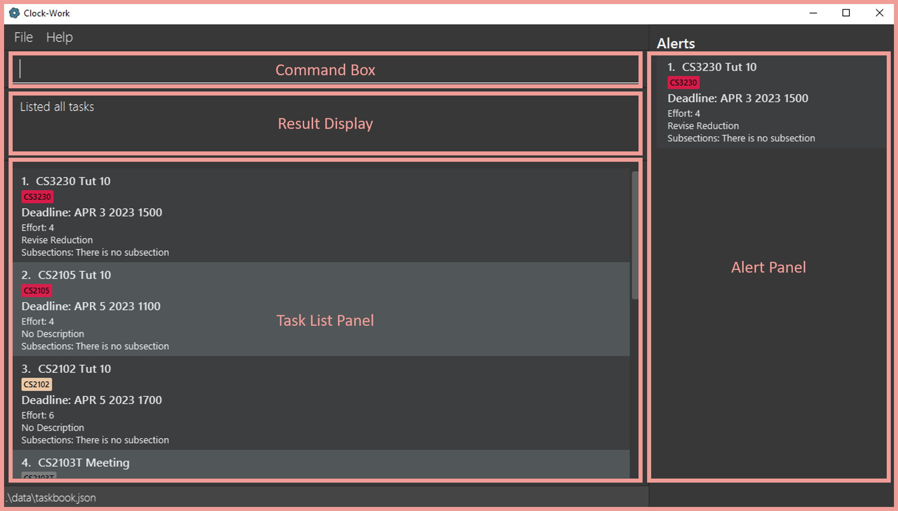
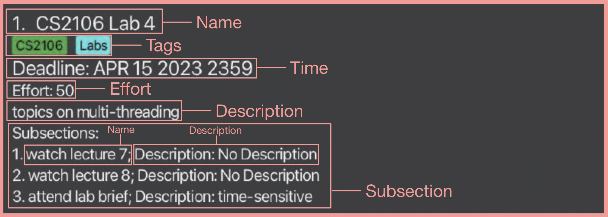

:alarm_clock: Tick-tock. Tick-tock. Time is ticking. :alarm_clock:

:scream: Are you stressed about the programming lab assignment you can't seem to make any progress with? Worried about the endless list of assignments to do? :scream:

:bellhop_bell: If a quick organisation tool is what you need to get your life together, you're at the right place! :bellhop_bell:

Introducing, Clock-Work!

Clock-Work is a **desktop application for managing tasks a student may have.** It is **optimized for use via a Command Line Interface** (CLI) while still having the benefits of a Graphical User Interface (GUI). Like most of us Computer Science students, if you can type fast, Clock-Work can get your assignment management tasks done faster than traditional GUI apps.
This guide is meant for the average Computer Science student, who is interested in using Clock-Work.

With basic commands like `add`, `delete`, `edit`, and special commands like `alert`, `find`, `schedule`, Clock-Work is your one-stop application to organise your busy Computing life :computer:.

**Get started with Clock-Work with this guide!**

Table of Contents
* [1. Quick start](#1-quick-start)
* [2. The GUI of Clock-Work](#2-the-gui-of-clock-work)
* [3. Introducing a Task](#3-a-task-in-clock-work)
* [4. Features and commands](#4-features-and-commands)
  * [4.1 add](#41-adding-a-task--add)
  * [4.2 edit](#42-editing-a-task--edit)
  * [4.3 delete](#43-deleting-a-task--delete)
  * [4.4 list](#44-listing-all-tasks--list)
  * [4.5 sort](#45-sorting-tasks--sort)
  * [4.6 find](#46-locating-tasks-by-name--find)
  * [4.7 stats](#47-getting-statistics--stats)
  * [4.8 alert](#48-get-alerts--alert-alert-window)
  * [4.9 schedule](#49-schedule-of-the-day--schedule-dshortdate-eeffort)
  * [4.10 subsection](#410-subsections)
    * [4.10.1 subsection](#4101-adding-a-subsection-to-a-task--subsection)
    * [4.10.2 remove-subsection](#4102-deleting-a-subsection-from-a-task--remove-subsection)
  * [4.11 help](#411-viewing-help--help)
  * [4.12 clear](#412-clearing-all-entries--clear)
  * [4.13 exit](#413-exiting-the-program--exit)
* [5. Storage](#5-storage)
  * [5.1 saving the data](#51-saving-the-data)
  * [5.2 editing the data](#52-editing-the-data-file)
* [6. FAQ](#6-faq)
* [7. Command summary](#7-command-summary)
* [8. Glossary](#8-glossary)

If you like our product and want to contribute to it, consider looking at the [Developer Guide](DeveloperGuide.md) instead.

--------------------------------------------------------------------------------------------------------------------
## 1. Quick start

1. Ensure you have Java `11` or above installed in your Computer.

2. Download the latest `clockwork.jar` from [here](https://github.com/AY2223S2-CS2103T-W13-3/tp/releases).

3. Copy the file to the folder you want to use as the _home folder_ for your Clock-Work.

4. Open a command terminal. If you do not have a preferred command terminal, you can use the default terminal of your computer by searching for _Terminal_ in your computer.

5. Navigate to the directory with `clockwork.jar` file downloaded in (Downloads folder in most cases).

6. Enter the command `java -jar clockwork.jar` to run the application or double-click on the jar file.

7. A GUI similar to the below should appear in a few seconds. Note how the app contains some sample data. 
   

8. Type the command in the command box and press Enter to execute it. e.g. typing **`help`** and pressing Enter will open the help window. 
   Some example commands you can try:

   * `list` : Lists all tasks.

   * `add n/Meeting d/CS2103T project meeting` : Adds a task named Meeting to task book.

   * `delete 3` : Deletes the 3rd task shown in the current list.

   * `clear` : Deletes all tasks.

   * `exit` : Exits the app.

9. Refer to the [Features and Commands](#2-features-and-commands) below for details of each command.

--------------------------------------------------------------------------------------------------------------------
## 2. The GUI of Clock-Work

Now that you've opened up the app, let's start by introducing you to the basic GUI of Clock-Work.

### Basic Information about the GUI
* The GUI is made up of 4 primary components:
  * The **Command Box**, where commands are typed in.
  * The **Result Display**, where the result messages of commands is displayed. 
  * The **Task List Panel**, where you can view your tasks.
  * The **Alert Panel**, where your upcoming tasks are displayed.

This is a visual breakdown of the different components in the GUI.

--------------------------------------------------------------------------------------------------------------------
## 3. A Task in Clock-Work

The life of a student is busy, but also vibrant and filled with a variety of activities. Clock-Work helps students manage their diverse task-management needs by supporting 3 types of tasks.

### Basic Information about Tasks
* A Task can be:
    * A simpleTask, which does not have a [_long date_](#q4-what-is-a-valid-long-date) attached to it.
    * A deadline, which has a _long date_ known as `deadline`.
    * An event, which has 2 _long dates_ also known as `from` and `to`.

* A task can have the following additional **Optional** fields attached to it:
    * Tags
    * Description
    * Effort level
    * Alert window
    * Subsection

This is what a task looks like in Clock-Work.

This is what each component mean:

| Component | Meaning | How to use it | Usage Specifications                                                                       |
|--| --------- | ------------- |--------------------------------------------------------------------------------------------|
| [Name](#q2-what-is-a-valid-name) | Name of task | Identify tasks | Must be unique, Case-insensitive  |
| [Tag](#q3-what-is-a-valid-tag) | Labels / Folders | Group related tasks | Must be a single word, Case-sensitive, Tags of the same name are only added once, Colour randomly generated, Displayed lexicographically|
| [Time](#q4-what-is-a-valid-long-date) | Type of task | Keep track of time-related information here | Simple tasks have no dates, Deadlines have 1 long date, Events have 2 long dates |
| [Effort](#q7-what-is-an-effort-level) | Estimated amount of work to complete task | Set realistic effort estimates to help with scheduling | Default value of 24                                                                        |
| [Description](#q8-what-is-a-valid-description) | Good-to-know | Useful things to remember | Text with at least 1 character                                                             |
| [Subsection](#q9-what-is-a-valid-subsection) | Smaller tasks to complete | Split a larger task into more manageable pieces | Has its own name and description                                                           |

--------------------------------------------------------------------------------------------------------------------

## 4. Features and Commands

**:information_source: Notes about the command format:** 

### Conventions used in this document

For easy reference and understanding, this guide utilizes some special formatting of text. The conventions used are as follows:

| Convention | Meaning | Sample Usage |
| --- |-----------------------------------------------------------------------------|--------------|
| `lowercaseword` | Valid Clock-Work command words. They may or may not be used with additional inputs. | `plan`       |
| `UPPERCASEWORD` | Compulsory inputs which must be supplied by user in order for the command to work. | `n/NAME`     |
| `[UPPERCASEWORD]` | Optional inputs which user can supply for a command.                        |  `[d/DESCRIPTION]` |
| `…`​ | Inputs can be used multiple times, including zero times | `[t/TAG]…​` |

| Emoji              | Meaning |
|--------------------| --- |
| :man_technologist: | Short messages from us to you |
| :bulb:             | Tips on how to enhance your user experience |
| :warning:          | Important things to note to avoid unintended behaviour |

### Inputs into Clock-Work

Clock-Work provides some flexibility regarding the types of inputs it accepts. These are some information about inputting commands you may find useful.

1. First word is assumed to be a command word (add/delete/list/find).

2. Parameters can be in any order. 
  e.g. if the command specifies `n/Task A d/A's sample description`, `d/A's sample description n/Task A` is also acceptable.

3. If a parameter is expected only once in the command, but you specified it multiple times, only the last occurrence of the parameter will be taken. 
  e.g. if you specify `d/do it fast d/do it slow`, only `d/do it slow` will be taken.

4. Extraneous parameters for commands that do not take in parameters (such as `help`, `list`, `exit` and `clear`) will be ignored. 
  e.g. if the command specifies `help 123`, it will be interpreted as `help`.

### 4.1 Adding a task : `add`

:man_technologist: **Congratulations on reaching this part of the user guide. You should have Clock-Work started and running at this point. You are now ready to add your first task!**

You can create different types of tasks depending on the input parameters you enter.

Format:

* SimpleTask: `add n/TASKNAME [d/DESCRIPTION] [t/TAGS]…​ [E/EFFORT]`

* Deadline: `add n/TASKNAME D/DEADLINE [d/DESCRIPTION] [t/TAGS]…​ [E/EFFORT]`

* Event: `add n/TASKNAME F/FROMDATE T/TODATE [d/DESCRIPTION] [t/TAGS]…​ [E/EFFORT]`

Examples:
* `add n/Read Book d/Make sure to take notes t/Leisure`
* `add n/Return Book d/NUS library t/Urgent D/2023-01-01 1800`

:warning: There are reserved CLI syntax like `n/`, `d/`, `t/`, `D/`, `F/`, `T/`, `all/`, `E/`, `I/`. Input fields will have unexpected behaviour when it contains these characters.

e.g. `add n/Sample d/Why can't I add n/?`

 

:man_technologist: **If you are a pro user, you may consider adding multiple tasks at once with this hack!**

Add multiple tasks with the same parameters except for name with this command:`add n/TASKNAME1 n/TASKNAME2 d/DESCRIPTION [t/TAGS]…​`

:bulb: **PRO TIP**: You can add multiple Events and Deadlines as well! However, they have to share the same timings. Use this to add tasks that occur at the same time!

:bulb: **PRO TIP**: A task can have any number of tags (including 0). Each tag will be automatically assigned a color. [Why are my different tags same color?](#q10-why-does-two-different-tags-have-the-same-tag-color)

### 4.2 Editing a task : `edit`

:man_technologist: **Hmm, have a task that you want to modify but find that it takes too much effort to create and delete a task? Try this command.**

Edits an existing task in the task book.

Format: `edit INDEX [n/TASKNAME] [d/DESCRIPTION] [E/EFFORT] [t/TAG]…​`

* Edits the task at the specified `INDEX`. The index refers to the index number shown in the displayed task list. The index **must be a positive integer** 1, 2, 3, …​
* At least one of the optional fields must be provided.
* `DEADLINE`, `FROMDATE`, `TODATE` can also be altered if and only if the original tasks has these fields. (You are unable to assign a `deadline` to a `SimpleTask`).
* Existing values will be updated to the input values.
* When editing tags, the existing tags of the task will be removed i.e adding of tags is not cumulative.
* You can remove all the task’s tags by typing `t/` without specifying any tags after it.
* You can remove a description with `d/` without specifying any tags after it.

Examples:
*  `edit 1 t/CS2102 t/URGENT` Edits the tags of the first task to now be `CS2102` and `URGENT`
*  `edit 2 n/CS2102 Finals t/` Edits the name of the 2nd task to be `CS2102 Finals` and clears all existing tags.

:warning: When editing the tags of a task, multiple tags of the same name is ignored!

e.g. `edit 1 t/CS2102 t/CS2102` will only register t/CS2102 once!

### 4.3 Deleting a task : `delete`

:man_technologist: **Congratulations! You have completed a task. Now, you can remove it by using this command.**

Deletes the specified task from the task  book.

Format: `delete INDEX [INDEX]…​`

* Deletes the task at the specified `INDEX`.
* The index refers to the index number shown in the displayed task list.
* The index **must be a positive integer** 1, 2, 3, …​
* If multiple indices are entered, they must be written in ascending order.
* The command will reject all specified indices if one of them is invalid.

Examples:
* `list` followed by `delete 2` deletes the 2nd task in the task book.
* `find Betsy` followed by `delete 1` deletes the 1st task in the results of the `find` command.

### 4.4 Listing all tasks : `list`

:man_technologist: **Want to have an overview of all your tasks? Try this!**

Shows a list of all tasks in the task book.

Format: `list`

:bulb: PRO TIP: Some commands (e.g. find) will trigger the UI to display a subset of tasks. Use `list` to return back to the original list.

### 4.5 Sorting tasks : `sort`

:man_technologist: **Is the displayed list too messy for your liking? Sort is here to help.**

Sorts the list using the following format:

* SimpleTask is listed above Deadline and Event.
* Deadline is  listed below SimpleTask and above Event.
* Event is  listed below SimpleTask and Event.
* When comparing 2 tasks of the same class:
    * SimpleTask
        * The task with lesser tags is listed above the task with more tags.
        * Else if both tasks have the same number of tags, the task with a smaller lexicographical name is listed above the other.
    * Deadline
        * The task with the earlier deadline is listed above the task with later deadline.
        * Else if both tasks have the same deadline, the task with lesser tags is listed above the task with more tags.
        * Else if both tasks have the same number of tags, the task with a smaller lexicographical name is listed above the other.
    * Event
        * The task with the earlier `from` attribute is listed above the task with a later `from` attribute.
        * Else if both task have the same `from` attribute, the task with the earlier `to` attribute is listed above the task with later `to` attribute.
        * Else if both task have the same `to` attribute, the task with lesser tags is listed above the task with more tags.
        * Else if both tasks have the same number of tags, the task with a smaller lexicographical name is listed above the other.

Format: `sort`

### 4.6 Locating tasks by name : `find`

:man_technologist: **Oops! Are you unable to locate a task? Try find.**

Find **Tasks** whose attribute best match the user input string.

Format: `find n/NAME` OR `find d/DESCRIPTION` OR `find t/TAG...`

* The search is **case-insensitive**. e.g `book` will match `Book`
* **Substrings** will be matched e.g. `book` will match `Books`
* For Deadline, you can only use a valid date(without the time input) such as `2023-03-10` to search for deadlines on that day.
    * e.g. `find D/2023-03-10` will give you all the deadlines on 2023-01-01.
* For Event, you may either use `F/` or `T/` prefix(without the time input as well) to search for event that starts or ends on a certain date.
    * e.g. `find F/2023-03-10` will give you all the events starting from 2023-03-10.
    * e.g. `find T/2023-03-10` will give you all the event ending on 2023-03-10.
* :warning: Our application currently does not support find by subsections' names or descriptions, the functionality will be implemented in future versions.

Examples:
* `find n/book` finds **Tasks** with name `read book` and `return books`

:bulb: Here are some **PRO TIPS**:
* For names and descriptions, you may use the `all/` prefix to search for a task that contains all of your inputs. Repeated inputs are only considered once.
    * e.g. `find all/ n/do n/homework` will match a task with a name called "do math homework.
    * e.g. `find all/ n/try n/try n/lab` is interpreted as `find all/ n/try n/lab`
* For tags, if you do not specify the `all/` prefix, as long as one tag matches with one of the tags you are searching for, it will be considered matched.
  However, adding `all/` means that a task which contains all your tag inputs will be displayed.
    * e.g. `find t/veryUrgent t/important` will match with tags `t/veryVeryUrgent t/math t/hard` since it has `veryurgent`.
    * e.g. `find all/ t/veryUrgent t/important` will match with tags `t/veryUrgent t/important` since it has both tags.

:warning: When searching for a description `find d/DESCRIPTION`, Tasks without user's input description will not show up!

e.g. `add n/Homework` and `add n/Project d/No Description` followed by `find d/No Description` will return a list with only the latter task.

### 4.7 Getting statistics : `stats`

:man_technologist: **Some statistics will do no harm. Stats is here to help you visualise your tasks in numbers!**

Prints the top 10 tags (if applicable) and its corresponding number of occurrences in the tasks.

Format: `stats`

### 4.8 Get alerts : `alert [ALERT WINDOW]`

:man_technologist: **Beep! Beep! Well, not really, but alert is here to warn you about tasks which are due soon!**

On opening of app, the **alert panel** will open to show **Tasks** which **start or have deadlines** within the **latest** window specified.
Displays in the tasks that fall within the window specified in the **Alert Panel**. If not supplied, assumed to be 24 hours.
Have to specify `ALERT WINDOW` in hours and only integers.

Examples:
- `alert` followed by `48` will show the alert window with all tasks which **start or end** within 48 hours.
- `alert` alone will show the alert window with all tasks which **start or end** within 24 hours.

### 4.9 Schedule of the day : `schedule D/SHORTDATE [E/EFFORT]`

:man_technologist: **Wouldn't it be great if you can have your life planned out for you? Schedule can help!**

`schedule` displays a planned daily schedule according to the tasks currently stored.

Entering `schedule D/SHORTDATE E/EFFORT` generates a new 30-day plan for users based on their intended `E/EFFORT`, and display a list of tasks to be done on `D/SHORTDATE`.
Entering `schedule D/SHORTDATE` displays a list of tasks to be done on `D/SHORTDATE` based on the previously generated plan. [What is a short date?](#q6-what-is-the-difference-between-a-longdate-and-a-shortdate)

How are my plans generated?

When the schedule command is ran with an <code>E/EFFORT</code> flag, a new 30-day plan is generated, starting from the day the command is run.
Tasks allocated to a day should not exceed the intended `E/EFFORT` level indicated.
However, if the need arises, the effort allocated for a day can exceed your preferred <code>E/EFFORT</code> level.

Task book allocates tasks as such:
1. Allocate all events to the day(s) it is supposed to be happening.

2. Allocate all deadlines to the first [free day](#q11-what-is-a-free-day) before it is due (exclusive of due date). Otherwise, allocate task to any day before deadline with the least amount of work allocated (in terms of effort).

3. Allocates each SimpleTask to the most busy day without exceeding desired workload. If such a day is not available, allocate the task to a day with the least amount of work allocated (in terms of effort).

 

Need more help?

Displaying Daily Plans
 
Daily Plans can be viewed by entering <code>schedule D/SHORT_DATE</code> or <code>schedule D/SHORT_DATE E/EFFORT</code>, with the former showing an old plan, and the latter showing a newly generated plan.
As plans are only valid for 30 days from the last time it was generated, users are encouraged to regenerate a plan with an <code>E/EFFORT</code> flag if they do not remember when they last generated their plan.
If no tasks are shown, it means that there are no tasks planned for that day.
An error message that prompts users to re-generate a plan will be shown if the entered date is out of range (either too far in the future, or a date before the start date of generated plan).

 
:warning: Valid `D/SHORTDATE` are 30-days from the day plan was generated. Re-scheduling plans multiple times would not make an invalid date become valid.
 
:warning: Select an effort estimate that you can realistically complete in a day. Having abnormally high desired effort levels in comparison to effort per task (eg. desired workload of 10000 and each task has effort 1) may result in undesired behaviour where all tasks are allocated to the same day.

Examples:
- Assuming today is 2023-03-26, `schedule D/2023-04-01 E/5` will plan a 30-day schedule starting from today (March 26, 2023) according to a desired effort level of 5, and display tasks planned for April 1.
- `schedule D/2023-04-02` will show tasks which should be completed on April 2, 2023, based on a previously generated schedule (which should be generated between 3 Mar 2023, and 2 Apr 2023).

## 4.10 Subsections

:man_technologist: **Have a task that is really long? Want to organise it in smaller sections? Why not use subsection?**

### 4.10.1 Adding a Subsection to a Task : `subsection`

Adds a subsection to a task in the task book. The subsection added will appear as in the corresponding task's task card.
You can do so by entering `subsection index n/name d/description`, and the description prefix `d/` is optional.

Examples:
- Assuming your current task list has a task with index 1, `subsection 1 n/homework d/Math` will add a subsection to the main task at index 1 with a subsection with the name "homework" and description "Math".

### 4.10.2 Deleting a Subsection From a Task : `remove-subsection`

Deletes a subsection from a task, assuming you have one in the task. You can do so by entering `remove-subsection index I/subsection index`, where the first index is the main task's index, and the latter is the subsection's.

Examples:
- Assuming your current task list has a task with index 1, which in turn contains a subsection with index 1. You can delete it with `remove-subsection 1 I/1`. The newly updated task will be shown.

### 4.11 Viewing help : `help`

:man_technologist: **For the beginner user who is still unfamiliar with the commands. Welcome!**

Shows a message explaining how to access the help page.

Format: `help`

### 4.12 Clearing all entries : `clear`

Clears all entries from the task book.

Format: `clear`

### 4.13 Exiting the program : `exit`

:man_technologist: **We hope to see you again!**

Exits the program.

Format: `exit`

## 5. Storage

### 5.1 Saving the data

TaskBook data are saved in the hard disk automatically after any command that changes the data. There is no need to save manually.

### 5.2 Editing the data file

TaskBook data are saved as a JSON file `[JAR file location]/data/taskbook.json`. Advanced users are welcome to update data directly by editing that data file.

:exclamation: **Caution:**
If your changes to the data file make its format invalid, taskBook will discard all data and start with an empty data file at the next run.

### 5.3 Archiving data files `[coming in v2.0]`

_Details coming soon ..._

--------------------------------------------------------------------------------------------------------------------

## 6. FAQ

### Q1 How do I transfer my data to another Computer?
**A**: Install the app in the other computer and overwrite the empty data file it creates with the file that contains the data of your previous TaskBook home folder.

### Q2 What is a valid Name?
**A**: A valid Name has a minimum of 1 character, and does not have **/** in it. It can have multiple words, and there is no limit to the number of characters it accept. However, for a better user experience, we recommend limiting the number of character in name to 35 characters.

### Q3 What is a valid Tag?
**A**: A valid tag consists of only alphanumeric characters, and has minimum length of 1 character. Tags are case-sensitive, which means that **STUDY** and **study** are treated as different tags.

### Q4 What is a valid Long Date?
**A**: A valid LongDate must be in the format of `YYYY-MM-DD HHMM` such as `2023-07-13 1800` (13 July 2023, 6PM). A valid LongDate must have a valid time. A minimum of 4 characters must be supplied and only a maximum of 4 character will be parsed
  e.g. `2023-07-13 180` is invalid and `2023-07-13 18000000000` is understood as `2023-07-13 1800`

### Q5 What is a valid Short Date?
**A**: A valid ShortDate must be in the format of `YYYY-MM-DD` such as `2023-07-15` (15 July 2023).

### Q6 What is the difference between a LongDate and a ShortDate?
**A**: A `ShortDate` omits the `HHMM` component of a `LongDate`.

### Q7 What is an effort level?
**A**: The effort level is a user estimate of the amount of work required to complete a task. Users are free to select any value between 0 and 2147483647 for their estimate.

### Q8 What is a valid Description?
**A**: A valid Description is a text input that has at least one character.

### Q9 What is a valid Subsection?
**A**: A valid Subsection has a name and an optional description. Within a task, all subsection names must be unique, and it is case-insensitive. This means that **study** and **STUDY** are treated as the same name.

### Q10 Why does two different tags have the same tag color?
**A**: Clock-Work randomly assigns 1 of 20 available colors to tags. As the number of tags users use increases, the chances of multiple tags being allocated the same colour increases. More colors will be added in future iterations.

### Q11 What is a free day?
**A**: The sum of allocated effort in a free day does not exceed the user preferred workload.

--------------------------------------------------------------------------------------------------------------------

## 7. Command summary
<table>
    <thead>
        <tr>
            <th>Command</th>
            <th>Inputs</th>
            <th>Examples</th>
        </tr>
    </thead>
    <tbody>
        <tr>
            <td rowspan=6><b>Add</b></td>
            <td>n/TASKNAME</td>
            <td rowspan=4>add n/Read Book d/Lord of The Flies t/Reading t/Literature E/10</td>
        </tr>
        <tr>
            <td>[d/DESCRIPTION]</td>
        </tr>
        <tr>
            <td>[t/TAG]...</td>
        </tr>
        <tr>
            <td>[E/EFFORT]</td>
        </tr>
        <tr>
            <td>[D/DEADLINE]</td>
            <td>add n/CS2103T v1.4 D/2023-04-10 1200</td>
        </tr>
        <tr>
            <td>[F/FROM] [T/TO]</td>
            <td>add n/Sleep v1.4 F/2023-04-08 2300 T/2023-04-09 0800</td>
        </tr>
        <tr>
            <td rowspan=8><b>Edit</b></td>
            <td>INDEX</td>
            <td></td>
        </tr>
        <tr>
            <td>[n/TASKNAME]</td>
            <td>edit 1 n/Read Newspaper</td>
        </tr>
        <tr>
            <td>[d/DESCRIPTION]</td>
            <td>edit 1 d/Straits Times</td>
        </tr>
        <tr>
            <td>[t/TAGS]</td>
            <td>edit 1 t/</td>
        </tr>
        <tr>
            <td>[E/EFFORT]</td>
            <td>edit 1 E/7</td>
        </tr>
        <tr>
            <td>[D/DEADLINE]</td>
            <td>edit 1 D/2023-04-25 1200</td>
        </tr>
        <tr>
            <td>[F/FROM]</td>
            <td>edit 2 F/2023-03-10 1900</td>
        </tr>
        <tr>
            <td>[T/TO]</td>
            <td>edit 2 T/2023-03-10 2100</td>
        </tr>
        <tr>
            <td><b>Delete</b></td>
            <td>INDEX[ES]</td>
            <td>delete 1 2</td>
        </tr>
        <tr>
            <td><b>List</b></td>
            <td>-</td>
            <td>list</td>
        </tr>
        <tr>
            <td><b>Sort</b></td>
            <td>-</td>
            <td>sort</td>
        </tr>
        <tr>
            <td rowspan=8><b>Find</b></td>
            <td>[n/TASKNAME]</td>
            <td>find n/read</td>
        </tr>
        <tr>
            <td>[d/DESCRIPTION]</td>
            <td>find d/Straits Times</td>
        </tr>
        <tr>
            <td>[t/TAGS]</td>
            <td>find t/Books</td>
        </tr>
        <tr>
            <td>[E/EFFORT]</td>
            <td>find E/15</td>
        </tr>
        <tr>
            <td>[D/DEADLINE]</td>
            <td>find D/2023-12-25</td>
        </tr>
        <tr>
            <td>[F/FROM]</td>
            <td>find F/2023-05-12</td>
        </tr>
        <tr>
            <td>[T/TO]</td>
            <td>find T/2023-05-13</td>
        </tr>
        <tr>
            <td>[all/] [n/TASKNAME]...</td>
            <td>find all/ n/read n/book</td>
        </tr>
        <tr>
            <td><b>Stats</b></td>
            <td>-</td>
            <td>stats</td>
        </tr>
        <tr>
            <td><b>Alert</b></td>
            <td>HOURS</td>
            <td>alert 50</td>
        </tr>
        <tr>
            <td rowspan=2><b>Schedule</b></td>
            <td>D/DATE</td>
            <td>schedule D/2023-04-04</td>
        </tr>
        <tr>
            <td>[E/EFFORT]</td>
            <td>schedule D/2023-04-04 E/10</td>
        </tr>
        <tr>
            <td rowspan=3><b>Subsection</b></td>
            <td>INDEX</td>
            <td rowspan=3>subsection 1 n/page 1-5 d/finance</td>
        </tr>
        <tr>
            <td>n/SUBSECTION_NAME</td>
        </tr>
        <tr>
            <td>[d/DESCRIPTION]</td>
        </tr>
        <tr>
            <td><b>Remove-Subsection</b></td>
            <td>TASK_INDEX I/SUBSECTION_INDEX</td>
            <td>remove-subsection 1 I/1</td>
        </tr>
        <tr>
            <td><b>Help</b></td>
            <td>-</td>
            <td>help</td>
        </tr>
        <tr>
            <td><b>Clear</b></td>
            <td>-</td>
            <td>clear</td>
        </tr>
        <tr>
            <td><b>Exit</b></td>
            <td>-</td>
            <td>exit</td>
        </tr>
    </tbody>
</table>

## 8. Glossary
1. Free day: Allocating a task to this day will not result in total allocated effort exceeding preferred effort level.
2. Long date: Date in the format YYYY-MM-DD HHMM.
3. Short date: Date in the format YYYY-MM-DD.
4. Overload: When the sum of effort for all tasks allocated to a particular day exceeds the preferred daily effort level.
