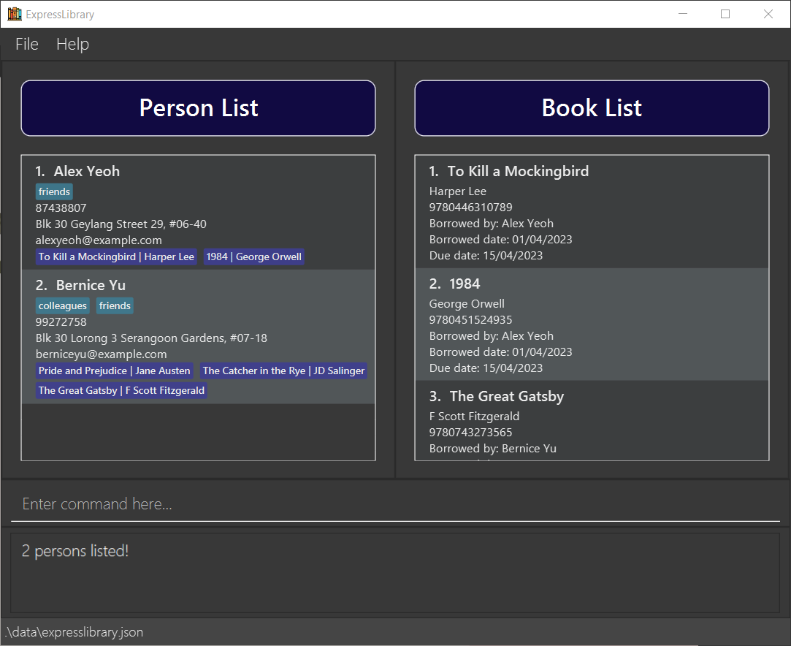
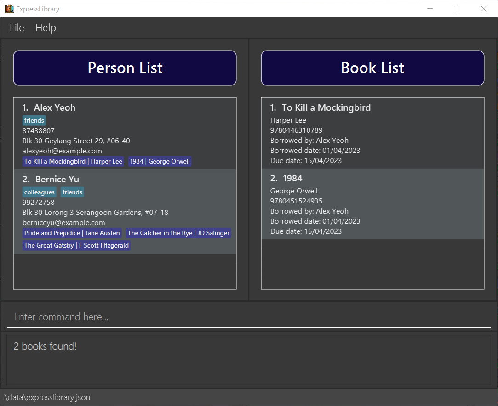
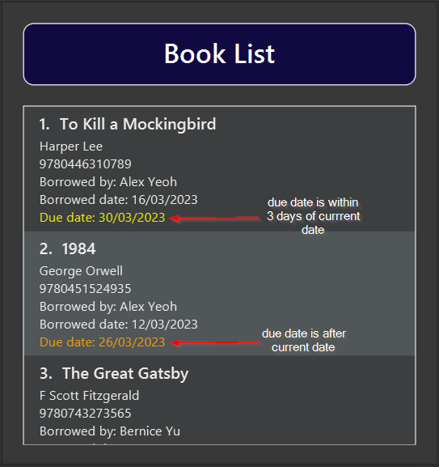

ExpressLibrary is a **desktop app created for librarians to better manage library users and books, optimized for use via a Command Line Interface** (CLI) while still having the benefits of a Graphical User Interface (GUI). If you can type fast, ExpressLibrary gets your tasks done faster than traditional GUI apps.

* Table of Contents
{:toc}

--------------------------------------------------------------------------------------------------------------------

## Quick start

1. Ensure you have Java `11` or above installed in your Computer.

1. Download the latest `expressLibrary.jar` from [here](https://github.com/AY2223S2-CS2103T-T12-3/tp/releases).

1. Copy the file to the folder you want to use as the _home folder_ for your ExpressLibrary.

1. Open a command terminal, `cd` into the folder you put the jar file in, and use the `java -jar expressLibrary.jar` command to run the application (note: double-clicking to open the jar file may lead to issues with saved data). 
   A GUI similar to the below should appear in a few seconds. Note how the app contains some sample data. 
   

1. Type the command in the command box and press Enter to execute it. e.g. typing **`help`** and pressing Enter will open the help window. 
   Some example commands you can try:

   * `listPerson` : Lists all contacts.
   * `addPerson n/Bob Tan p/97450597 e/btan@mail.com`:
   Adds a contact named `Bob Tan` to records
   * `deletePerson 3` : Deletes the 3rd user shown in the current list.
   * `clear` : Clears all persons and books in the ExpressLibrary.
   * `exit` : Exits the app.

1. Refer to the [Features](#features) below for details of each command.

--------------------------------------------------------------------------------------------------------------------

## Features

**:information_source: Notes about the command format:** 

* Words in `UPPER_CASE` are the parameters to be supplied by the user. 
  e.g. in `addPerson n/NAME`, `NAME` is a parameter which can be used as `addPerson n/John Doe`.
* Items in square brackets are optional. 
  e.g `n/NAME [t/TAG]` can be used as `n/John Doe t/friend` or as `n/John Doe`.
* Items with `…`​ after them can be used multiple times including zero times. 
  e.g. `[t/TAG]…​` can be used as ` ` (i.e. 0 times), `t/friend`, `t/friend t/family` etc.
* Parameters can be in any order. 
  e.g. if the command specifies `n/NAME p/PHONE_NUMBER`, `p/PHONE_NUMBER n/NAME` is also acceptable.
* If a parameter is expected only once in the command but you specified it multiple times, only the last occurrence of the parameter will be taken. 
  e.g. if you specify `p/98102341 p/81234134`, only `p/98102341` will be taken.
* Only Singapore phone numbers are valid. (Must be 8 digits long and start with 6, 8 or 9.)
* Emails must abide by RFC5322 standard. For more details, refer to section 3.4.1 of the RFC5322 protocol found here 
https://www.rfc-editor.org/rfc/rfc5322.
* You can also refer to the error message which will appear if you key in an invalid email.
* Extraneous parameters for commands that do not take in parameters (such as `help`, `listPerson`, `exit` and `clear`) will be ignored. 
  e.g. if the command specifies `help 123`, it will be interpreted as `help`.

### Person Commands

#### Adding a user: `addPerson`

Adds a person to the ExpressLibrary.

Format: `addPerson n/NAME p/PHONE_NUMBER e/EMAIL a/ADDRESS [t/TAG]…​`
* You will not be able to add a person with the same email or phone number of an existing person.

:bulb: **Tip:**
A person can have any number of tags. (including 0)

Examples:

* `addPerson n/Bob Tan p/91112222 e/btan@mail.com`

#### Deleting a person : `deletePerson`

Deletes a person at the specified person list index.

Format: `deletePerson PERSON_INDEX [-f]`

* Must be preceded by `listPerson` command.
* Deletes the person at the specified PERSON_INDEX.
* The index refers to the index number shown in the displayed person list.
* The index must be a positive integer 1, 2, 3, …​
* The `-f` flag is optional and should be included in the case where the person to delete has borrowed books and you would like to return all books while deleting the person. Else, a warning message will appear when you try to delete the person without the flag.

Examples:

* `listPerson` followed by `deletePerson 2` deletes the 2nd person in the user records.
* `listPerson` followed by `deletePerson 3 -f` deletes the 3rd person in the user records and returns all books the person has borrowed, if any.

#### Editing a person : `editPerson`

Edits an existing person in the ExpressLibrary.

Format: `editPerson PERSON_INDEX [n/NAME] [p/PHONE] [e/EMAIL] [t/TAG]…​`

* Edits the person at the specified `PERSON_INDEX`. The index refers to the index number shown in the displayed person list. The index **must be a positive integer** 1, 2, 3, …​
* At least one of the optional fields must be provided.
* Existing values will be updated to the input values.
* When editing tags, the existing tags of the person will be removed i.e adding of tags is not cumulative.
* You will not be able to edit a person's email or phone number to be the same as an existing person.
* You can remove all the person’s tags by typing `t/` without
 specifying any tags after it.

Examples:

* `editPerson 1 p/91234567 e/johndoe@example.com` Edits the phone number and email address of the 1st person to be `91234567` and `johndoe@example.com` respectively.
* `editPerson 2 n/Betsy Crower t/` Edits the name of the 2nd person to be `Betsy Crower` and clears all existing tags.

#### Listing all users : `listPerson`

Shows a list of all users in the user records.

Format: `listPerson`

#### Locating persons by name: `findPerson`

Finds persons whose names contain any of the given keywords.

Format: `findPerson KEYWORD [MORE_KEYWORDS]`

* The search is case-insensitive. e.g `hans` will match `Hans`
* The order of the keywords does not matter. e.g. `Hans Bo` will match `Bo Hans`
* Only the name is searched.
* Persons matching at least one keyword will be returned (i.e. `OR` search).

  e.g. `Hans Bo` will return `Hans Gruber`, `Bo Yang`

Examples:

* `findPerson John` returns `john` , `John Doe` and `johnston`.
* `findPerson Alex Bernice` returns `Alex Yeoh`, `Bernice Yu`. 

### Book Commands

#### Adding a book: `addBook`

Adds a book to the book records.

Format: `addBook t/TITLE a/AUTHOR i/ISBN​`
* You will not be able to add a book with the same ISBN of an existing book.

Examples:

* `addBook t/Diary of a Wimpy Kid a/Jeff Kinney i/9780810993136`

#### Deleting a book : `deleteBook`

Delete a book given an index in the book list.

Format: `deleteBook BOOK_INDEX [-f]`

* Must be preceded by `listBook` command.
* Deletes the book at the specified BOOK_INDEX.
* The index refers to the index number shown in the displayed book list.
* The index must be a positive integer 1, 2, 3, …
* The `-f` flag is optional and should be included in the case where the book to delete has been borrowed by a person and you would like to return the book while deleting it. Else, a warning message will appear when you try to delete the book without the flag.​

Examples:

* `listBook` followed by `deleteBook 2` deletes the 2nd book in the user records.
* `listBook` followed by `deleteBook 3 -f` deletes the 3rd book in the user records and returns it if it is borrowed.

#### Editing a book : `editBook`

Edits an existing book in the book records.

Format: `editBook BOOK_INDEX [t/TITLE] [a/AUTHOR] [i/ISBN] [bd/BORROW_DATE] [dd/DUE_DATE]​`

* Edits the book at the specified `BOOK_INDEX`. The index refers to the index number shown in the displayed book list. The index **must be a positive integer** 1, 2, 3, …​
* At least one of the optional fields must be provided.
* You will not be able to edit a book's ISBN to be same as an existing book's ISBN.
* Existing values will be updated to the input values.

Examples:

* `editBook 1 t/Diary of a Wimpy Kid a/Jeff Kinney i/9780810993136` Edits the title and author and ISBN of the 1st book to be `Diary of a Wimpy Kid` and `Jeff Kinney` and `9780810993136`respectively.
* `editBook 2 bd/22/03/2023 dd/29/03/2023` Edits the borrow date and due date of the 2nd book to be `22/03/2023` and `29/03/2023`.

#### Listing all books : `listBook`

Shows a list of all books in the book records.

Format: `listBook`

#### Locate book by title: `findBook`

Find books whose titles contain any of the given keywords.

Format: `findBook KEYWORD [MORE_KEYWORDS]`

* The search is case-insensitive. e.g `DUNE` will match `dune`
* The order of the keywords does not matter. e.g. `Great Gatsby` will match `Gatsby Great`.
* Only the title is searched.
* Books matching at least one keyword will be returned (i.e. `OR` search).
  e.g. `Dune Great` will return `Dune`, `Great Gatsby`.

Examples:

* `findBook The` returns `The Cat in the Hat` and `Call of the Wild`
* `findBook dune Cat` returns `Dune`, `The Cat in the Hat`
* `findBook 1984 kill` returns `1984`, `To Kill a Mockingbird`. 

### Common Commands

#### Borrowing a book : `borrow`

Lends a book to a person given a person index, book index and due date.

Format: `borrow PERSON_INDEX b/BOOK_INDEX d/DUE_DATE`

* Lends a book specified by the BOOK_INDEX to the person at the specified PERSON_INDEX.
* The PERSON_INDEX refers to the index number shown in the displayed person list.
* The BOOK_INDEX refers to the index number shown in the displayed book list.
* The indexes must be positive integers 1, 2, 3, …​

Examples:

* To allow the 2nd person in the person list to borrow the 3rd book in the book list:
  * `listBook` and `listPerson` will show the lists containing the books and the stored persons.
  * `borrow 2 b/3 d/17/10/2024` allows the 2nd user in the person list to borrow the 3rd book in the book list, with a due date of Oct. 17, 2024.
* To **edit** the book's due date only:
  * Simply borrow the book again for the same person but with a different date.
  * `borrow 2 b/3 d/20/11/2024` will renew the book due date for the previous example.

#### Returning a book : `return`

Returns a person's borrowed book to the library given a person index and book index.

Format: `return PERSON_INDEX b/BOOK_INDEX`

* Returns a person's borrowed book specified by the PERSON_INDEX and specified BOOK_INDEX.
* The PERSON_INDEX refers to the index number shown in the displayed person list.
* The BOOK_INDEX refers to the index number shown in the displayed book list.
* The indexes must be positive integers 1, 2, 3, …​

Examples:

* `listBook/listPerson` followed by `return 1 b/2` returns the 2nd book in the book list from the 1st person in the user records.

#### Clearing all entries : `clear`

Clears all entries from ExpressLibrary.

Format: `clear`

#### Exiting the program : `exit`

Exits the program.

Format: `exit`

#### Viewing help : `help`

Shows a message explaining how to access the help page.

Format: `help`

### Colour coded due dates

ExpressLibrary automatically changes the color of due dates to alert the librarian when a book’s due date is within 3 days of the current date or has passed.

As clearly seen in the image above, if the due date is within 3 days of the current date, the color of the due date will turn yellow. If the due date has passed, the color of the due date will turn orange.

### Saving the data

ExpressLibrary data is saved in the hard disk automatically after any command that changes the data. There is no need to save manually.
### Editing the data file

ExpressLibrary data is saved as a JSON file `[JAR file location]/data/expresslibrary-{version_num}.json`. Advanced users are welcome to update data directly by editing that data file.

:information_source: **Note:** When editing book fields when it is borrowed, make sure to update **both** the `books` array in the person object and the **main** `books` array separate from `persons` in the json file. Please refer to [_How data is saved_](https://ay2223s2-cs2103t-t12-3.github.io/tp/DeveloperGuide.html#how-data-is-saved) for more details.

:exclamation: **Caution:**
If your changes to the data file makes its format invalid, ExpressLibrary will discard all data and start with an empty data file at the next run.

--------------------------------------------------------------------------------------------------------------------

## FAQ

**Q**: How do I transfer my data to another computer? 
**A**: Install the app in the other computer and overwrite the empty data file it creates with the file that contains the data of your previous ExpressLibrary home folder.

--------------------------------------------------------------------------------------------------------------------

## Command summary

### Person

Action | Format, Examples
--------|------------------
**AddPerson** | `addPerson n/NAME p/PHONE_NUMBER e/EMAIL [t/TAG]…​`   e.g., `addPerson n/James Ho p/22224444 e/jamesho@example.com`
**DeletePerson** | `deletePerson PERSON_INDEX`  e.g., `deletePerson 3`
**EditPerson** | `editPerson INDEX [n/NAME] [p/PHONE_NUMBER] [e/EMAIL] [t/TAG]…​`  e.g.,`editPerson 2 n/James Lee e/jameslee@example.com`
**FindPerson** | `findPerson KEYWORD [MORE_KEYWORDS]`  e.g., `findPerson James Jake`
**ListPerson** | `listPerson`

### Book

Action | Format, Examples
--------|------------------
**AddBook** | `addBook t/TITLE a/AUTHOR i/ISBN…​`   e.g., `addBook t/Diary of a Wimpy Kid a/Jeff Kinney i/9780810993136`
**DeleteBook** | `deleteBook BOOK_INDEX`  e.g., `deleteBook 3`
**EditBook** | `editBook BOOK_INDEX [t/TITLE] [a/AUTHOR] [i/ISBN] [bd/BORROW_DATE] [dd/DUE_DATE]…​`  e.g.,`editBook 1 t/Diary of a Wimpy Kid a/Jeff Kinney i/9780810993136`
**FindBook** | `findBook KEYWORD [MORE_KEYWORDS]`  e.g., `findBook dune Cat`
**ListBook** | `listBook`

### Common

Action | Format, Examples
--------|------------------
**Borrow** | `borrow PERSON_INDEX b/BOOK_INDEX d/DUE_DATE`   e.g., `borrow 1 b/2 d/23/09/2024`
**Return** | `return PERSON_INDEX b/BOOK_INDEX`   e.g., `return 3 b/1`
**Clear** | `clear`
**Help** | `help`
