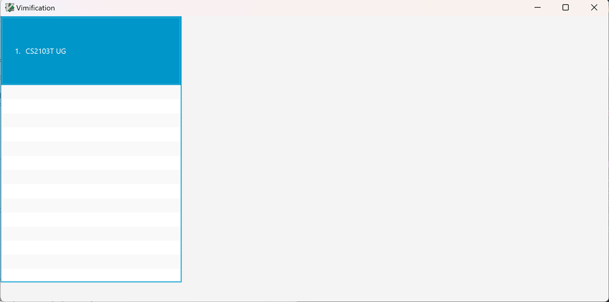
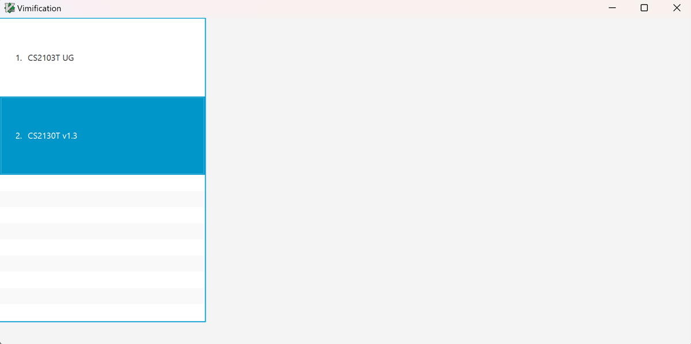
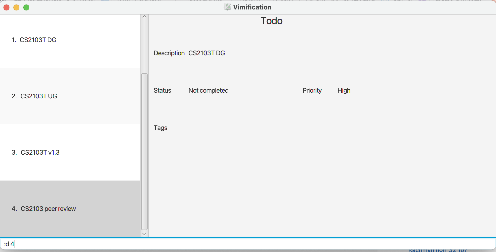
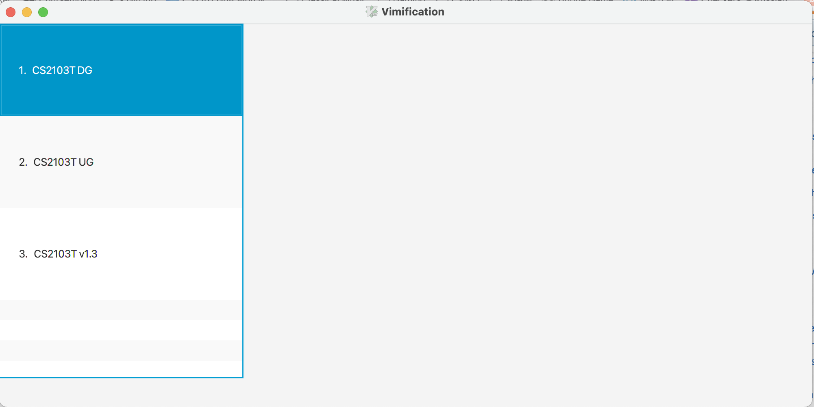
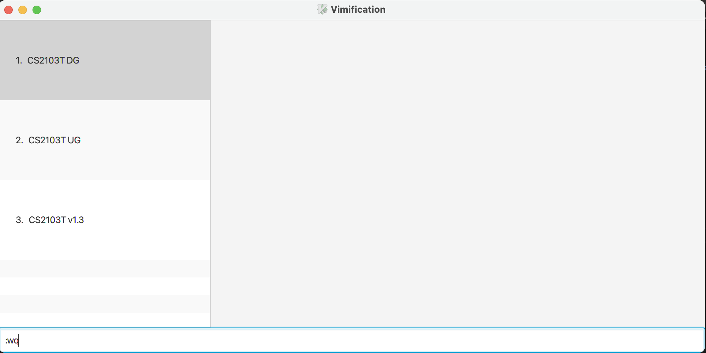

Vimification is a **vim-like desktop app for managing tasks, optimized for use via a Command Line Interface** (CLI)while still having the benefits of a Graphical User Interface (GUI). If you can type fast, Vimification can get your task management tasks done faster than traditional GUI apps. However, for users that are not fast typers or are unfamiliar with vim, we also provide a Graphical User interface (GUI) to assist you.

## Table of Contents

- [Quick Start](#quick-start)
- [Features](#features)
  - [Viewing help](#viewing-help)
  - [Adding a todo task](#adding-a-todo-task)
  - [Adding a task with deadline](#adding-a-task-with-deadline)
  - [Deleting a task](#deleting-a-task)
  - [Exiting the program](#exiting-the-program)
  - [Saving the data](#saving-the-data)

---

## Introduction

Welcome to Vimification

Vimificiation is a desktop app that helps Students manage tasks. It is specifically catered towards NUS SoC students, with features such as vim-like commands to increase efficiency. Students can also add priority and tags to tasks to future customize and categorize them.

## Quick start

1. Ensure you have Java `11` or above installed in your Computer.

1. Download the latest `vimification.jar` from [here](https://github.com/se-edu/addressbook-level3/releases).

1. Copy the file to the folder you want to use as the _home folder_ for your Vimification.

1. Open a command terminal, `cd` into the folder you put the jar file in, and use the `java -jar vimification.jar` command to run the application. 

   A GUI similar to the below should appear in a few seconds. Note how the app contains some sample data. 
   

1. Type the command in the command box and press Enter to execute it. e.g. typing **`help`** and pressing Enter will open the help window. 
   Some example commands you can try:

   - `:i todo CS2130T UG` : Adds a todo task with description `CS2130T UG` to Vimification.

   - `:i deadline CS2130T tp /2023-04-01` : Adds a todo task with description `CS2130T tp` and deadline '2023-04-01' to Vimification.

   - `:d 2` : Deletes the 2nd task shown in the current list.

   - `:wq` : Exits the app.

1. Refer to the [Features](#features) below for details of each command.

---

## Navigating Vimification

Vimification is designed to mimic Vim as closely as possible. Navigate Vimification as you would in Vim by using `h`,`j,`,`k`,`l` to move to the left, down, up, right respectively.

## Using commands

Similar to Vim, you can bring up the command input by pressing the `:` key on your keyboard.
e.g:

## Features

**:information_source: Notes about the command format:** 

- Words in UPPER_CASE are the parameters to be supprised by the users. 
  e.g. `:i todo DESCRIPTION`, `DESCRIPTION` is a parameter which can be used as `:i todo quiz`.

- Words in square brackets are compulsory parameters to be supplied by the user. 
  e.g. in `:i todo [DESCRIPTION]`, `DESCRIPTION` is a parameter must be provided.

- Items with `…`​ after them can be used multiple times including zero times. 
  e.g. `[-t TAG]…​` can be used as ` ` (i.e. 0 times), `-t cs2103t`, `-t cs2103t -t groupwork` etc.

- Parameters can be in any order. 
  e.g. if the command specifies `-p PRIORITY -t TAG`, `-t TAG -p PRIORITY` is also acceptable.

- Extraneous parameters for commands that do not take in parameters (such as `help`, `list`, `exit` and `clear`) will be ignored. 
  e.g. if the command specifies `help 123`, it will be interpreted as `help`.

### Viewing help

Shows a message explaning how to access the help page.

Format: `:help`

### Adding a todo task

Adds a to-do to Vimification.

Format: `:i todo [DESCRIPTION]`
| parameter | description | examples |
| ------------- | ----------------------------------------------- | ------------ |
| `description` | description of the task. | `CS2103T UG` |

Examples:

`:i todo CS2130T UG`

**After**

### Adding a task with deadline

Adds a task with `deadline` to Vimification.

Format: `:i deadline [DESCRIPTION] /[DEADLINE]`

| parameter     | description                                     | examples     |
| ------------- | ----------------------------------------------- | ------------ |
| `description` | description of the task.                        | `CS2103T UG` |
| `deadline`    | The deadline of the task in `YYYY-MM-DD` format | `2023-03-31` |

Examples:

`:i deadline CS2130T v1.3 /2022-03-31`

**After**

### Deleting a task

Deletes the specified person from the address book.

Format: `:d [TASK_INDEX]`

- Deletes the task at the specified `task_index`.
- The index refers to the index number shown in the displayed `TaskList`.
- The index **must be a positive integer**, i.e 1, 2, 3, …​
- The index must not exceed the number of tasks in `TaskList`, otherwise Vimification will show an error message.

Examples:

**Before**

**After**

### Exiting the program

Similar to Vim, we can use the `q` command with write `w` to exit the program.

Format: `:wq!`, `:q!`,,`:wq`,`:q`

Examples:

### Saving the data

Vimification data are saved in the hard disk automatically after any command that changes the data. There is no need to save manually.

### Editing the data file

Vimification data are saved as a JSON file `[JAR file location]/data/tasklist.json`. Advanced users are welcome to update data directly by editing that data file.

:exclamation: **Caution:**
If your changes to the data file makes its format invalid, Vimification will discard all data and start with an empty data file at the next run.

### Archiving data files `[coming in v2.0]`

_Details coming soon ..._

---

## FAQ

**Q**: How do I transfer my data to another Computer? 
**A**: Install the app in the other computer and overwrite the empty data file it creates with the file that contains the data of your previous Vimification home folder.

---

## Command summary

| Action           | Format, Examples                                                                         |
| ---------------- | ---------------------------------------------------------------------------------------- | --- |
| **Add To-do**    | `:i todo [description]`   e.g., `i todo CS2103T UG`                                   |
| **Add Deadline** | `:i deadline [description] /[deadline]`   e.g., `i deadline CS2103T v1.3 /2022-03-31` |     |
| **Delete**       | `:d [index]`  e.g., `:d 3`                                                            |
| **Exit**         | `:wq!`, `:q!`,,`:wq`,`:q`                                                                |
| **Help**         | `:help`                                                                                  |
