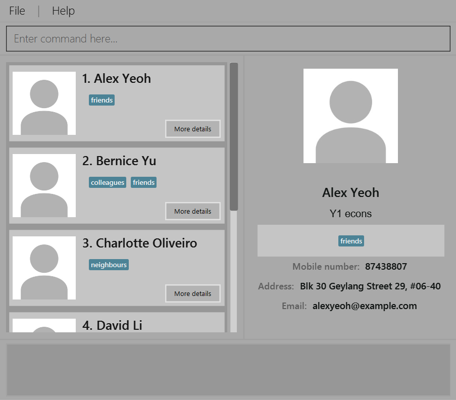

# User Guide

* [Quick Start](#quick-start)
* [Features](#features)
  * [Add user contacts](#add-user-contacts-add)
  * [Delete user contacts](#delete-user-contacts-delete)
  * [Edit user contacts](#edit-user-contacts-edit)
  * [Locating persons by keywords](#locating-persons-by-keywords-find)
  * [Listing all contacts](#listing-all-contacts-list)
  * [Help command](#help-command-help)
  * [Add an image for contacts](#add-an-image-for-contacts-add-image)
  * [Delete an image for contacts](#delete-an-image-for-contacts-delete-image)
  * [Quick import admin contacts](#quick-import-for-admin-contacts-import)
* [Command summary](#command-summary)

---

## Quick start

1. Ensure you have Java `11` or above installed in your computer.
2. Download the latest `bookface.jar` from [here](https://github.com/AY2223S2-CS2103-F11-4/tp/releases).
3. Place `bookface.jar` file in the folder you would like to use as the *home directory*.
4. Run the application. This can be done by either executing the `jar` file, 
or opening a command terminal, `cd` into the *home directory*, and running the 
`java -jar bookface.jar` command. The following GUI will appear upon first 
use of the application.

   
5. The application is initially loaded with sample data for new users to try out the [features](#features) listed below.
Experienced users can delete the sample data and proceed with regular usage.
   
---

## Features

### Add user contacts: `add`

Format: `add [n/NAME] [s/STATUS] [p/PHONE_NUMBER] [e/EMAIL] [a/ADDRESS] [t/TAG, ct/COMMITMENT_TAG, mt/MODULE_TAG]` Optional to add: `t/TAG, ct/COMMITMENT_TAG, mt/MODULE_TAG`

* User is *required* to enter **name, status, phone number, email, address**
* Note that when entering course under "status", course should be only one word, and should be in alphanumeric
* Tags can be optional
* If the account exists, user can add in related field of interests to share with others

Example:

* `add n/Shenghan s/Year2 Computer Science p/99999999 e/david@gmail.com a/punngol place 696a #12-348` will displays the
  necessary basic information that are the user's name, year/course, phone number, email, address. Optional fields are tags,
  for which there are commitment/cca tags, module tags and lastly the general tags for users to enter non-specific typed tags.

Example (with the addition of tags):
* `add n/Shenghan s/Year2 Computer Science p/99999999 e/david@gmail.com a/punngol place 696a #12-348 t/developer ct/soccer
  mt/cs2103` 
* Note that the tags can be placed in any part of the command, and it will not break!

Tags are categorised according to tag colors:
* Commitment tags: `coral pink`
* Module tags: `dark green`
* General tags: `default blue`

### Delete user contacts: `delete`

Delete a contact.
Format: `delete INDEX`

* Show contact details specified by `INDEX`
* The index refers to the index number shown in the displayed person list.
* The index *must* be a positive integer 1, 2, 3, …

  Example:
* `delete 2` deletes the second person in the list of contacts.

### Edit user contacts: `edit`

Edit a contact.
Format: `edit INDEX [n/NAME] [s/STATUS] [p/PHONE_NUMBER] [e/EMAIL] [a/ADDRESS] [t/TAG, ct/COMMITMENT_TAG, mt/MODULE_TAG]`

* Show contact details specified by `INDEX`
* The index refers to the index number shown in the displayed person list.
* The index *must* be a positive integer 1, 2, 3, …

  Example:
* `edit 2 n/James Lee e/jameslee@example.com s/Year2 Computer Science p/99999999 e/david@gmail.com a/punngol place 696a #12-348 t/developer ct/soccer
  mt/cs2103` Brings up the 2nd person in the address book and edits the specified information.

### Locating persons by keywords: `find`

Finds persons whose contact details contain any of the given keywords based on the
prefix specified.

Format: `find PREFIX/KEYWORD [MORE PREFIX/KEYWORD]...`

* The search is case-insensitive e.g. `hans` will match `Hans`
* The search will filter by the `PREFIX` provided, e.g. `n/` searches through the
  names of the contacts, `p/` searches through the phone number of the contacts, `t/`
  searches through the tags of the contact, etc...
* Each prefix must be followed by one and only one keyword. See below for example usage.
* The search is done via the logical ***AND*** operator, i.e., `find n/john t/cs` will return
  the list of contacts where his name is `john` **and** has a tag that contains `cs`.
* The following shows a list of allowed prefixes:
  1. `n/` which represents the name
  2. `s/` which represents the status
  3. `p/` which represents the phone number
  4. `e/` which represents the email
  5. `a/` which represents the address
  6. `t/` which represents the tags

Example:

`find n/amy t/cs2103 e/gmail` will return the list of contacts whose names are `amy`,
has a tag labeled `cs2103`, and whose emails contain `gmail`.

### Listing all contacts: `list`

List all contacts in the address book.

Format: `list`

### Help command: `help`

Shows a link to the user guide to help new users get familiar with the commands for the application.

Format: `help`

### Add an image for contacts: `add-image`

Add a contact image for each contact.

Format: `add-image INDEX ai/[PATH-TO-IMAGE]`

* Adds an image to the contact at the specified `INDEX`
* The index refers to the index number shown in the displayed person list.
* The index **must be a positive integer** 1, 2, 3,...
* Ensure that `ai/` prefix is used before the image path.
* If the image cannot be found or user did not specify a contact image, a default image will be used

> **Note:** The `[PATH-TO-IMAGE]` provided must be an absolute path, and should not be provided in quotation marks.
> For instance: `add-image 2 ai/"C:/Users/user/Downloads/weekiat.png"` will be invalid, whereas 
> `add-image 2 ai/C:/Users/user/Downloads/weekiat.png` will be valid.

Examples:

* `list` followed by `add-image 2 ai/C:/Users/user/Downloads/weekiat.png` adds the image `weekiat.png` to the 2nd person in the address book

### Delete an Image for contacts: `delete-image`

Delete the image of a contact.

Format: `delete-image INDEX`

* Deletes the image of contact specified by `INDEX`
* The index refers to the index number shown in the displayed person list.
* The index *must* be a positive integer 1, 2, 3, …
* A default image will be used after it is deleted

Example:
* `delete-image 2` deletes the image of the 2nd person in the address book.

### Quick Import for admin contacts: `import`

Import administrative contacts for relevant faculties.

Format: `import [faculty]`

* Faculty acronyms (e.g. soc)
* Only selected faculties will be available

Example:

* `import soc` adds all important administrative contact for School of Computing
* `import chs` adds all important administrative contact for College of Humanities and Sciences

---

## Command summary

| Action           | Format, Examples                                                                                                                                                                                                                    |
|------------------|-------------------------------------------------------------------------------------------------------------------------------------------------------------------------------------------------------------------------------------|
| **Add**          | `add [n/NAME] [s/STATUS] [p/PHONE_NUMBER] [e/EMAIL] [a/ADDRESS] [t/TAG, ct/COMMITMENT_TAG, mt/MODULE_TAG]…​`   e.g., `add n/James Ho s/Y2 Science p/22224444 e/jamesho@example.com a/123, Clementi Rd, 1234665 ct/soccer mt/cs1010s` |
| **Delete**       | `delete INDEX`  e.g., `delete 3`                                                                                                                                                                                                 |
| **Edit**         | `edit INDEX [n/NAME] [p/PHONE_NUMBER] [e/EMAIL] [a/ADDRESS] [t/TAG]…​`  e.g.,`edit 2 n/James Lee e/jameslee@example.com`                                                                                                         |
| **Find**         | `find PREFIX/Keyword [MORE PREFIX/KEYWORD]...`  e.g., `find n/amy t/cs2103 e/gmail`                                                                                                                                              |
| **List**         | `list`                                                                                                                                                                                                                              |
| **Help**         | `help`                                                                                                                                                                                                                              |
| **Add-Image**    | `add-image INDEX ai/[PATH-TO-IMAGE]`   e.g., `add-image 2 ai/C:/Users/user/Downloads/weekiat.png`                                                                                                                                |
| **Delete-Image** | `delete-image INDEX`   e.g.,  `delete-image 2`                                                                                                                                                                                   |                                                                                                                       |
| **Import**       | `import [faculty]`   e.g.,  `import soc, import chs`                                                                                                                                                                             |

