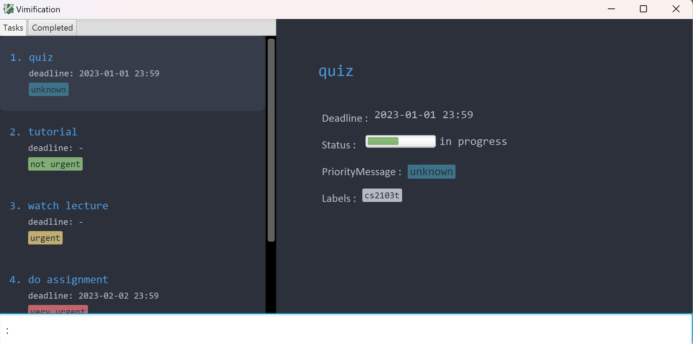

## **Table of Contents**
- [**Table of Contents**](#table-of-contents)
- [Introduction](#introduction)
- [Purpose of this User Guide](#purpose-of-this-user-guide)
- [Quick Start](#quick-start)
  - [Installation](#installation)
  - [For Windows](#for-windows)
  - [For Mac](#for-mac)
  - [Trying out the commands](#trying-out-the-commands)
- [Navigating Vimification](#navigating-vimification)
- [Using the commands](#using-the-commands)
- [Information on commands' parameters](#information-on-commands-parameters)
- [Features and commands](#features-and-commands)
  - [Viewing help](#viewing-help)
  - [Adding task](#adding-task)
  - [Inserting parameters to a task](#inserting-parameters-to-a-task)
  - [Deleting task](#deleting-task)
  - [Deleting parameters of a task](#deleting-parameters-of-a-task)
  - [Editing task](#editing-task)
  - [Filtering task](#filtering-task)
  - [Sorting task](#sorting-task)
  - [Undo the previous command](#undo-the-previous-command)
  - [General information on MACRO commands](#general-information-on-macro-commands)
  - [Exiting the application](#exiting-the-application)
  - [Saving the task list data](#saving-the-task-list-data)
  - [Editing existing task list data](#editing-existing-task-list-data)
  - [Archiving data files (future feature)](#archiving-data-files-future-feature)
- [FAQ](#faq)
- [Flag summary](#flag-summary)
- [Command summary](#command-summary)

## Introduction

<!-- Might want to make this introduction more concise -->

Welcome to Vimification, the ultimate task tracker for Vim enthusiasts! If you are a student at NUS, you know how hectic it can get to manage different deadlines and schedules for different classes and modules. With VimPlanner, you can now manage your tasks and deadlines with ease, using the powerful and efficient Vim-like commands that you already know and love.

Vimification is a **desktop app for managing tasks, optimized for use via a Command Line Interface** (CLI) while still having the benefits of a Graphical User Interface (GUI). If you can type fast, Vimification can get your task management tasks done faster than traditional GUI apps. However, for users that are not fast typers or are unfamiliar with vim, we also provide a Graphical User interface (GUI) to assist you.

Vimification is designed to help you stay organized and productive by providing a simple and intuitive interface that allows you to keep track of all your tasks and deadlines in one place. Whether you are a seasoned Vim user or just starting out, you will find Vimification to be an easy and efficient way to manage your daily tasks.

With Vimification, you can quickly and easily create new tasks, set due dates, prioritize your work, and track your progress. Whether you are working on a group project, studying for an exam, or just trying to stay on top of your assignments, VimPlanner has everything you need to stay organized and focused.

So why waste time fumbling around with a mouse and keyboard? Try Vimification today and experience the power of Vim-like productivity for yourself!

<a href="#table-of-contents">Back to Top &#8593;</a>

## Purpose of this User Guide

The purpose of this user guide is to provide you with a comprehensive resource that will guide you through the various features and functionality of the app, so that you can efficiently manage your tasks and deadlines using VimPlanner's powerful and intuitive interface.

The guide will walk you through the process of creating and managing tasks, setting due dates, prioritizing work, and tracking progress, among other topics. It will provide you with clear and concise instructions that are easy to follow, whether you are a new Vim user or an experienced Vim enthusiast.

Additionally, it will offer troubleshooting tips and solutions to common issues that you may encounter while using VimPlanner, and provide you with a comprehensive resource that will help you optimize your productivity and stay on top of your tasks and deadlines.

Overall, we hope to empower you to streamline your daily workflows and increase your productivity. So, let's get started!

<a href="#table-of-contents">Back to Top &#8593;</a>

---

## Quick Start

### Installation

1. Download the latest `vimification.jar` from [here](https://github.com/AY2223S2-CS2103T-T15-3/tp/releases).

2. Save the file in your intended folder.

### For Windows

1. Ensure that you have Java `11` or above installed in your Computer.

2. Double-click the file to start the app.

3. The application should launch, and a GUI similar to the below should appear in a few seconds.  

### For Mac

1. Ensure that you have Java `11` Zulu SDK installed in your Computer.

2. Open your Mac Terminal, and `cd` into the folder you put the jar file in.

3. Run `java -jar vimification.jar`.

4. The application should launch, and a GUI similar to the below should appear in a few seconds.  
   

### Trying out the commands

1. Type the command in the command box and press Enter to execute it. e.g. typing **`help`** and pressing Enter will open the help window. 

   Some example commands you can try:

   - `:a "tutorial"` : Adds a task with the title `tutorial` to Vimification.

   - `:a "quiz for cs2103T" -d 2023-04-01` : Adds a task with the title `quiz for cs2103T` and deadline `2023-04-01` to Vimification.

   - `:d 2` : Deletes the 2nd task shown in the current list.

   - `:wq` : Exits the app.

2. Refer to the [Features and commands](#features-and-commands) below for details of each command.

<a href="#table-of-contents">Back to Top &#8593;</a>

---

## Navigating Vimification

Vimification is designed to mimic Vim as closely as possible. Navigate Vimification as you would in Vim by using `h`,`j`,`k`,`l` to move to the left, down, up, right respectively. To open the detailed task list, use 'l'.

Moreover, the usual arrow keys (&uarr;, &darr;, &larr;, &rarr;) can be used as well.

<a href="#table-of-contents">Back to Top &#8593;</a>

## Using the commands

Similar to Vim, you can access command mode by **pressing the `:` key** on your keyboard. This will bring the cursor to the command input field, which is at the bottom of the application.

Example:

<a href="#table-of-contents">Back to Top &#8593;</a>

## Information on commands' parameters

<!-- *IMPORTANT: Take note of how the command format is being interpretted, to know what parameters it requires.* -->

_Take note of how the command format is being interpretted, to know what parameters it requires._

Flags like `-d`, `-l` and `-p` act as identifier for the parameter that comes immediately after the flag.

- e.g. `:a "<title>" [-d <deadline>]`, the `-d` indicates the deadline attribute of a task.
- Refer to the [Flag summary](#flag-summary) below for details of each flag.

Words in **angle brackets** are **compulsory** parameters to be supplied by the user.

- e.g. in `:a "<title>"`, the user must provide the `"<title>"` parameter, for example, `:a "Do weekly quiz"`.

Words in **square brackets** are **optional** parameters to be supplied by the user.

- e.g. `:a "<title>" [-d <deadline>]`, the user need not provide the `<deadline>` parameter.

Bracketed items with `…`​ behind means that user can provide multiple parameters.

- e.g. `:a <'title"> [-l <label>]…​`, for example, `:a "Do OP2 slides" -l cs2101`, `:a Do OP2 slides -l cs2101 -l presentation` are both acceptable.

Parameters identified by flags can be in any order.

- e.g. `:a "Do OP2 slides" -l cs2101 -p high`, `:a "Do OP2 slides" -p high -l cs2101` are both acceptable.

Redundant parameter(s) at the end will raise an error, and the command will not be executed.

- e.g. if the user inputs `:help 123`, the command `help` will not be executed, and they will receive an error message.

<a href="#table-of-contents">Back to Top &#8593;</a>

---

## Features and commands

### Viewing help

Shows a message explaning how to access the help page.

Format: `:help`

### Adding task

Adds a task to the current task list.

Format: `:a "<title>" [-d <deadline>] [-l <label>]... [-p <priority>]`

| Parameter    | Detail                                      | Compulsory | Example        |
| ------------ | ------------------------------------------- | ---------- | -------------- |
| `"<title>"`  | Title of the task                           | Yes        | `"CS2103T UG"` |
| `<deadline>` | Deadline of the task                        | No         | `2023-03-31`   |
| `<label>`    | Label given to the task                     | No         | `presentation` |
| `<priority>` | Priority level assigned to the task         | No         | `1`            |

Note: SoC students can put module code as the label.

Example of command
1. `:a "Enhance CS2103T tp user guide" -d 2023-03-31 -l cs2103t -p 1`

### Inserting parameters to a task

Insert the parameter as specified by the flag of a task to the current task list as specified by the task number.

Format: `:i <task_index> [-d <deadline>] [-l <label_name>]`

| Parameter      | Detail                               | Example                                         |
| -------------- | ------------------------------------ | ----------------------------------------------- |
| `<task_index>` | Index of the target task             | 3 (assuming the task list has at least 3 tasks) |
| `<deadline>`   | Deadline of task you want to insert  | 2023-04-05                                      |
| `<label_name>` | Name of the label you want to insert | cs2103t(assuming the task list has this label)  |

Example of command
1. `:i 3 -d 2023-04-5` inserts the deadline to task 3
2. `:i 3 -l cs2103t` inserts the "cs2103t" label to task 3

Condition
- At least one for the flags should be present.
- The index refers to the index number shown in the displayed task list.
- The index **must be a positive integer**, i.e 1, 2, 3 etc.
- The index must not exceed the number of tasks in the displayed task list.

### Deleting task

Deletes a task from the current task list by specifying the task number.

Format: `:d <task_index>`

| Parameter      | Detail                               | Compulsory | Example                                         |
| -------------- | ------------------------------------ | ---------- | ----------------------------------------------- |
| `<task_index>` | Index of the task you want to delete | Yes        | 3 (assuming the task list has at least 3 tasks) |

Example of command
1. `:d 3` deletes task 3

Condition
- The index refers to the index number shown in the displayed task list.
- The index **must be a positive integer**, i.e 1, 2, 3 etc.
- The index must not exceed the number of tasks in the displayed task list.

### Deleting parameters of a task

Deletes the parameter as specified by the flag of a task from the current task list as specified by the task number.

Format: `:d <task_index> [-d] [-l <label_name>]`

| Parameter      | Detail                               | Example                                         |
| -------------- | ------------------------------------ | ----------------------------------------------- |
| `<task_index>` | Index of the target task             | 3 (assuming the task list has at least 3 tasks) |
| `<label_name>` | Name of the label you want to delete | cs2103t (assuming the task list has this label) |

Example of command
1. `:d 3 -d` deletes the deadline of task 3
2. `:d 3 -l cs2103t` deletes the "cs2103t" label of task 3

Condition
- At least one for the flags should be present. Else, command will be treated as deleting the task at index number.
- The index refers to the index number shown in the displayed task list.
- The index **must be a positive integer**, i.e 1, 2, 3 etc.
- The index must not exceed the number of tasks in the displayed task list.

### Editing task

Edit the parameters as specified by the flag of a task in the current task list as specified by the task number.

Format: `:e <task_index> [-t "<title>"] [-d <deadline>] [-s <status>] [-p <priority>] [-l <previous_label> <new_label>]... `

| Parameter    | Detail                                     | Example                                        |
| ------------ | ------------------------------------------ | ---------------------------------------------- |
| `"<title>"`  | New title of task                          | `"CS2103T UG"`                                 |
| `<deadline>` | New deadline of the task                   | `2023-03-31`                                   |
| `<status>`   | New status of task                         | `2`                                            |
| `<priority>` | Priority level assigned to the task        | `1`                                            |
| `<previous_label>` | Name of the label you want to edit   | cs2103t(assuming the task list has this label) |
| `<new_label>` | New name of the label                     | `group project`                                |

Example of command
1. `:e 3 -t "quiz"` edits the title of task 3 to "quiz"
2. `:e 3 -d 2023-04-05` edits the deadline of task 3 to 2023-04-05
3. `:e 3 -s 1` edits the status of task 3 to be in progress
4. `:e 3 -p 1` edits the priority of task 3 to be in urgent
5. `:e 3 -l oldLabel newLabel` edits oldLabel of task 3 to be newLabel

Condition
- At least one for the flags should be present.
- The index refers to the index number shown in the displayed task list.
- The index **must be a positive integer**, i.e 1, 2, 3 etc.
- The index must not exceed the number of tasks in the displayed task list.

### Filtering task

Filter the parameters as specified by the flag.

Format: `:f [-w "<keywords>"] [-d --before/after <date>] [-s <status>] [-p <priority>] [-l <label>]... `

| Parameter       | Detail                                          | Example                                        |
| --------------- | ----------------------------------------------- | ---------------------------------------------- |
| `"<keywords>"`  | Keywords to filter                              | `"CS2103T UG"`                                 |
| `<date>`        | Date of the task to filter before or after      | `2023-03-31`                                   |
| `<status>`      | Status of task to filter                        | `2`                                            |
| `<priority>`    | Priority level of task to filter                | `1`                                            |
| `<label>`       | Label of task to filter                         | cs2103t(assuming the task list has this label) |

Example of command
1. `:f -w "quiz"` filter for tasks with "quiz" as keyword

2. `:f -d --before 2023-04-05` filter for tasks before 2023-04-05
3. `:f -s 1` filter for tasks with status of in_progress
4. `:f -p 1` filter for tasks with priority of urgent
5. `:f -l cs2103t` filter for tasks with label of cs2103t

Condition
- Only one flag should be present.

### Sorting task

Sort the parameters as specified by the flag.

Format: `:s [-t] [-d] [-p] `

Example of command
1. `:s -t` sort for tasks by title
2. `:s -d` sort for tasks by deadline
3. `:s -p` sort for tasks by priority level

Condition
- Only one flag should be present.

### General information on MACRO commands

Sometimes we might be adding the exact same task every week, say `:a "Do CS2103 weekly quiz"`. Typing repeated and identical command could be time consuming and Vimification is aware of it. This is where MACRO command comes in.

MACRO is like a customisable template like command, to streamline the process of running repeated commands. For example, to save `:a "Do CS2103 weekly quiz" -d Friday 14:00` as a MACRO, user can simply input the command, `:macro -a CS2103WeeklyQuiz ":a 'Do CS2103 weekly quiz' -d Friday 14:00"`.

The same method works for deletion of tasks & listing of tasks, which is respectively represented by the command headings, `:macro -d` and `:macro -l` respectively. You can also use more verbose flags like `--add`, `--delete` and `--list` instead of `-a`, `-d` and `-l` while typing MACRO commands.

### Undoing the previous command

You can undo the previous command by simply keying in `:undo`.

### Exiting the application

Similar to Vim, we can use the `:wq!`, `:q!`,,`:wq`,`:q` commands to exit the application.

Format: `:wq!`, `:q!`,,`:wq`,`:q`

### Saving the task list data

The task list data is saved in the hard disk automatically after any command that changes the data. There is no need to save manually.

### Editing existing task list data

Existing task list data is saved as a JSON file `[JAR file location]/data/tasklist.json`. Advanced users are welcome to update data directly by editing that data file.

:exclamation: **Caution:**
If your changes to the data file makes its format invalid, Vimification will discard all data and start with an empty data file at the next run.

### Archiving data files (future feature)

_Details coming soon in v2.0 ..._

<a href="#table-of-contents">Back to Top &#8593;</a>

---

## FAQ

**Q**: How do I transfer my data to another Computer? 
**A**: Install the app in the other computer and overwrite the empty data file it creates with the file that contains the data of your previous Vimification home folder.

<a href="#table-of-contents">Back to Top &#8593;</a>

---

## Flag summary

| Flag                   | Meaning                    | Conditions                                                        |
| ---------------------- | -------------------------- | ----------------------------------------------------------------- |
|-t                      | title of description       | Cannot be empty, enclosed in open close quotation marks           |
|-d                      | deadline of description    | In the format of YYYY-MM-dd or YYYY-MM-dd HH:mm                   |
|-l                      | label of task              | cannot be empty                                                   |
|-p                      | priority of task           | 1 for very urgent, 2 for urgent, 3 for not urgent, 4 for unknown  |
|-s                      | status of task             | 0 for not done, 1 for in progress, 2 for completed, 3 for overdue |

## Command summary

| Action                 | Format                                                                                                            |
| ---------------------- | ----------------------------------------------------------------------------------------------------------------- |
| View help              | `:help`                                                                                                           |
| Add task               | `:a "<title>" [-d <deadline>] [-p <priority>] [-l <label>] `                                                      |
| Insert parameter       | `:i <task_index> [-d <deadline>] [-l <label_name>]`                                                               |
| Delete task            | `:d [index]`                                                                                                      |
| Delete parameter       | `:d <task_index> [-d] [-l <label_name>]`                                                                          |
| Edit parameter         | `:e <task_index> [-t "<title>"] [-d <deadline>] [-s <status>] [-p <priority>] [-l <previous_label> <new_label>] ` |
| Filter                 | `:f [-w "<keyword>"] [-d --before/after <date>] [-s <status>] [-p <priority>] [-l <label>]`                       |
| Sort                   | `:s [-t] [-d] [-p] `                                                                                              |
| Exit the application   | `:wq!`, `:q!`, `:wq`, `:q`                                                                                        |

<a href="#table-of-contents">Back to Top &#8593;</a>

