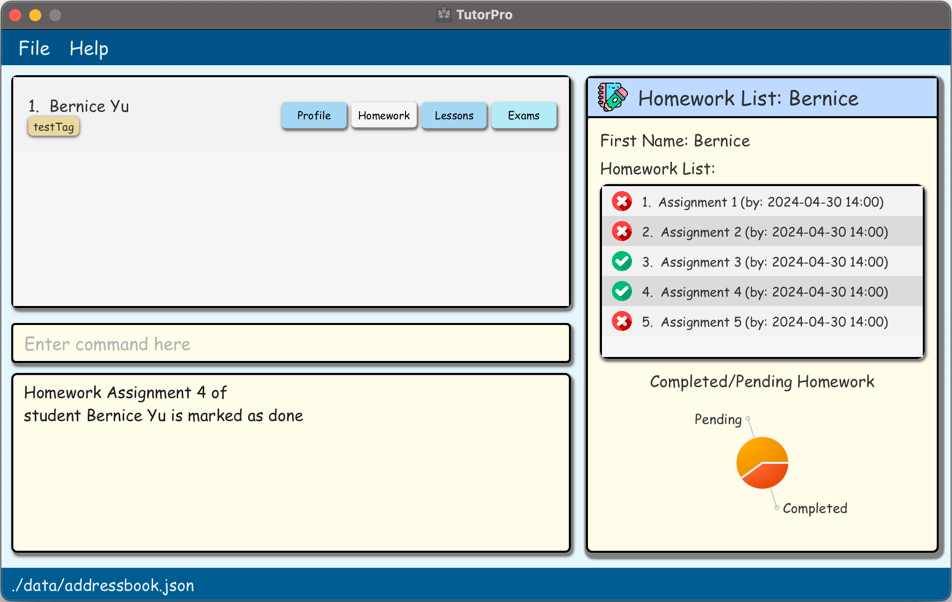
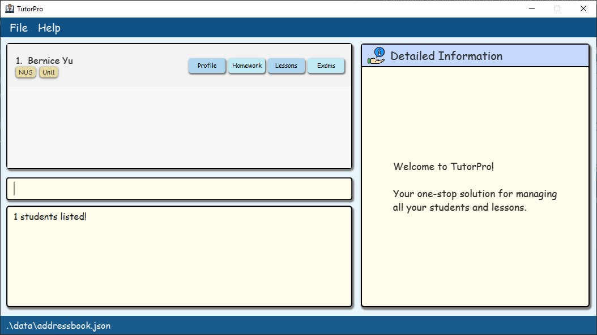
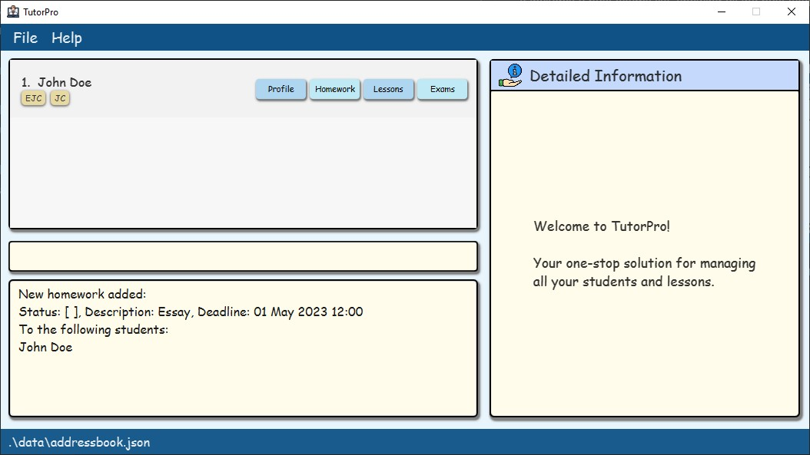
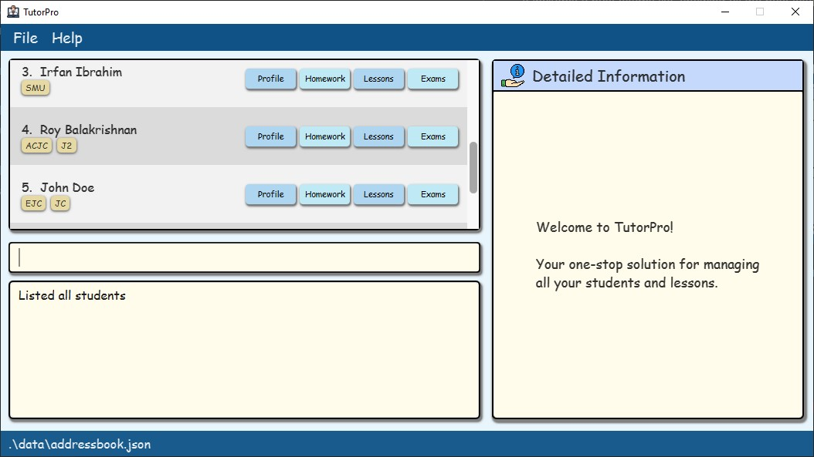
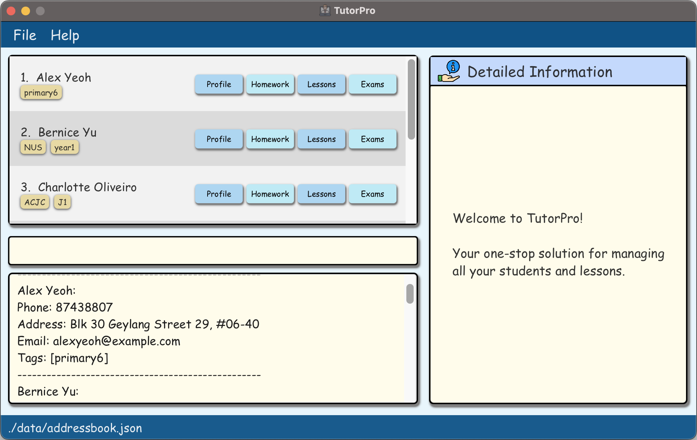
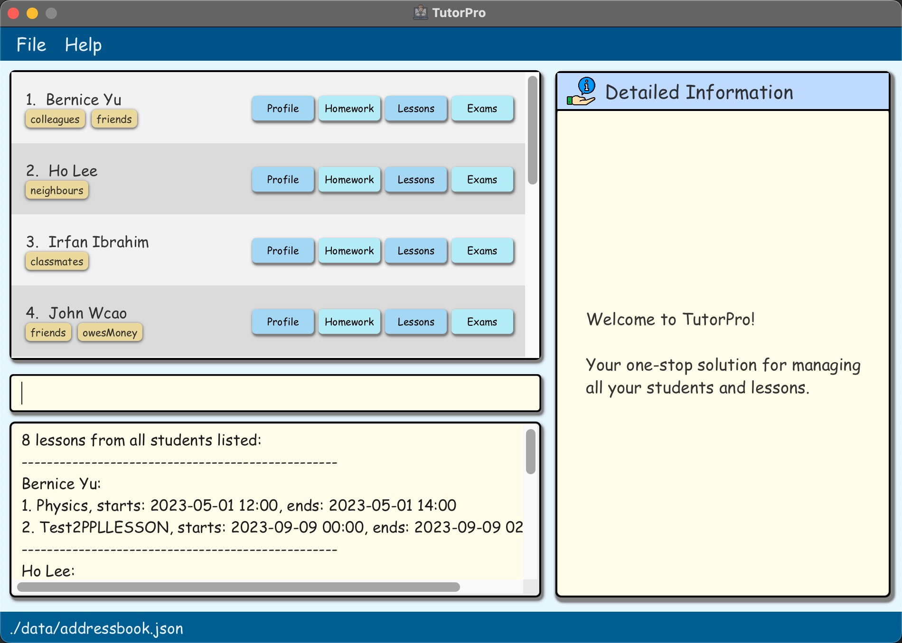
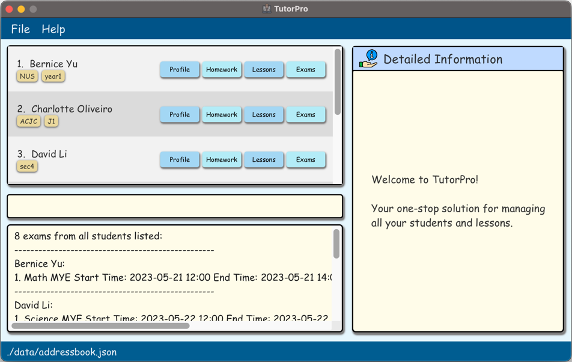

TutorPro is a **desktop app designed to help private tutors manage their student information effectively**. With TutorPro, tutors can easily keep track of their students' addresses, contact details, lessons, homework, and progress, all in one place. This app is optimized for use via a Graphical User Interface (GUI), allowing tutors to interact with the app using easy-to-understand buttons and menus. However, TutorPro also provides a Command Line Interface (CLI) for those who prefer a faster way of getting things done. Whether you're managing a handful of students or hundreds, TutorPro can help you streamline your workflow and make your tutoring experience more efficient.

--------------------------------------------------------------------------------------------------------------------
## Table of Contents
- [Table of Contents](#table-of-contents)
- [Quick start](#quick-start)
  * [Glossary](#glossary)
- [GUI](#gui)
  * [Quick Access Buttons and Detailed Information Section](#quick-access-buttons-and-detailed-information-section)
    + [Profile Page](#profile-page)
    + [Homework Page](#homework-page)
    + [Lessons Page](#lessons-page)
    + [Exams Page](#exams-page)
- [Main Entities](#main-entities)
  * [Homework](#homework)
  * [Lesson](#lesson)
  * [Exam](#exam)
- [Commands](#commands)
  * [How to interpret the Command format](#how-to-interpret-the-command-format)
  * [Profile Commands](#profile-commands)
    + [List all Students](#list-all-students)
    + [Create a new Student Profile](#create-a-new-student-profile)
    + [View a Student Profile](#view-a-student-profile)
    + [Update Student Information](#update-student-information)
    + [Delete a Student Profile](#delete-a-student-profile)
  * [Homework Commands](#homework-commands)
    + [Assign Homework to a Student](#assign-homework-to-a-student)
    + [View Student Homework](#view-student-homework)
    + [Delete Homework from a Student](#delete-homework-from-a-student)
    + [Mark the Homework of a Student as Done](#mark-the-homework-of-a-student-as-done)
    + [Unmark Homework of a Student as Undone](#unmark-homework-of-a-student-as-undone)
    + [Update Homework of a Student](#update-homework-of-a-student)
  * [Lessons Commands](#lessons-commands)
    + [Create a New Lesson Plan for the Upcoming Lesson](#create-a-new-lesson-plan-for-an-upcoming-lesson)
    + [View Lessons](#view-lessons)
    + [Delete a Lesson from a student](#delete-a-lesson-from-a-student)
    + [Update a Lesson](#update-a-lesson)
  * [Exam Commands](#exam-commands)
    + [Add an Exam to be tracked](#add-an-exam-to-be-tracked)
    + [Remove an exam](#remove-an-exam)
    + [View exams tracked by TutorPro](#view-exams-tracked-by-tutorpro)
    + [Edit exam details](#edit-exam-details)
  * [Global Commands](#global-commands)
    + [Get Help for TutorPro](#get-help-for-tutorpro)
    + [Clear all TutorPro Data](#clear-all-tutorpro-data)
    + [Exit TutorPro](#exit-tutorpro)
- [Unique Mechanisms](#unique-mechanisms)
  * [Search by Name Mechanism](#search-by-name-mechanism)
  * [Schedule Clash Detection Mechanism](#schedule-clash-detection-mechanism)
    + [Schedule Clash Detection Mechanism when Adding a New Lesson](#schedule-clash-detection-mechanism-when-adding-a-new-lesson)
      - [With respect to existing lessons](#with-respect-to-existing-lessons)
      - [With respect to existing exams](#with-respect-to-existing-exams)
    + [Schedule Clash Detection Mechanism when Adding a New Exam](#schedule-clash-detection-mechanism-when-adding-a-new-exam)
      - [With respect to existing lessons](#with-respect-to-existing-lessons-1)
      - [With respect to existing exams](#with-respect-to-existing-exams-1)
  * [Duplicate Detection Mechanism](#duplicate-detection-mechanism)
    + [Duplicate Homework Detection](#duplicate-homework-detection)
    + [Duplicate Lesson Detection](#duplicate-lesson-detection)
    + [Duplicate Exam Detection](#duplicate-exam-detection)
  * [Storage Mechanism](#storage-mechanism)
- [FAQ](#faq)
- [Summary](#summary)
  * [List of Commands](#list-of-commands)
  * [List of Prefixes](#list-of-prefixes)
  * [Supported date-time formats](#supported-date-time-formats)
  * [Supported date formats](#supported-date-formats)

<small><i><a href='http://ecotrust-canada.github.io/markdown-toc/'>Table of contents generated with markdown-toc</a></i></small>

--------------------------------------------------------------------------------------------------------------------

## Quick start

1. Ensure you have Java `11` or above installed on your Computer.

2. Download the latest `TutorPro.jar` from [here](https://github.com/AY2223S2-CS2103T-W13-4/tp/releases).

3. Copy the file to the folder you want to use as the _home folder_ for TutorPro.

4. Open a command terminal, `cd` into the folder in which you put the jar file, and use the `java -jar TutorPro.jar` command to run the application. 
   A GUI similar to the one below should appear in a few seconds. Note how the app contains some sample data. 
   

5. Type the command in the command box and press Enter to execute it. e.g. typing **`help`** and pressing Enter will open the help window. 

6. Refer to the [Commands](#commands) below for details of each command.

--------------------------------------------------------------------------------------------------------------------

### Glossary

You may come across some terms you don't understand in the user guide.
The following table provides clarification of the terms commonly used in TutorPro.

|       Term       | Description                                                                                                                                                                                                         |
|:----------------:|---------------------------------------------------------------------------------------------------------------------------------------------------------------------------------------------------------------------|
| **Alphanumeric** | Digits and letters only. For example, `AB3`, `TutorPro`, `coco123`, and `2103` are alphanumeric. `#01-04`, `email@domain.com`, and `white    spaces` are not.                                                       |
|  **Attribute**   | Words that follow prefixes to describe properties, states, characteristics, and traits. Examples are price, weight, name, and order status.                                                                         |
|   **Command**    | A command is a specific instruction you can give to TutorPro to perform an action. You can view the list of commands available [here](#list-of-commands).                                                           |
|     **CLI**      | Command-Line Interface (CLI) receives commands from a user in the form of lines of text. It refers to the input text box in this context.                                                                           |
|     **GUI**      | GUI stands for Graphical User Interface. It refers to the display window of the TutorPro application.                                                                                                               |
|    **Index**     | The index of the contact or item in the display list for contacts/items.                                                                                                                                            |
|   **Integer**    | Whole number                                                                                                                                                                                                        |
|  **Parameter**   | A parameter refers to the information you need to give to your command such that it can execute an action based on that information.                                                                                |
|    **Prefix**    | A prefix indicates the kind of information you are keying in. You can view the list of prefixes available [here](#list-of-prefixes).                                                                                |
|  **Whitespace**  | An empty character, or a placeholder character.                                                                                                                                                                     |
|   **Student**    | A `Student` whom the user (who is a tutor) teaches                                                                                                                                                                  |
|   **Homework**   | A `Homework` assignment whom the user (who is a tutor) has assigned to a `Student`                                                                                                                                  |
|    **Lesson**    | A `Lesson` that the user has scheduled with a `Student`                                                                                                                                                             |
|     **Exam**     | An `Exam` that a Student is scheduled to sit for                                                                                                                                                                    |

--------------------------------------------------------------------------------------------------------------------

## GUI
When you first run the app, you may see a display window pop up similar to the one below. We call this window the **Main Window**.

:information_source: **Note:** The current version of the window is not resizable. Resizability will be added in future versions!

* The **Command Box** on the bottom left refers to the text field where you can type in all your commands.
* The **Display List for Students** on the top left refers to the section where all the students are displayed.
* The **Detailed Information Section** on the right refers to the section where more specific information of the profile, homework, lessons, or exams of a particular student is displayed.

You may enter the following commands in the Command Box to see how the Display List changes:
* `list` lists all students.
* `delete index/1` deletes the student with index 1.

You may also click the quick access buttons one each student card to see how the Detailed Information Section changes.

### Quick Access Buttons and Detailed Information Section
Upon launching the application or executing a command, a welcome page will be displayed in the Detailed Information Section.
Each Student card has four buttons, which are profile, homework, lessons, and exams. When a user clicks on any of the buttons, the corresponding information will be presented in the Detailed Information Section.

:information_source: **Why is the date and time displayed in two different formats?** 
The date and time format in the Detailed Information Section is different from the one used in the `view` commands.
This is purposely done to make the information more distinct and make sure you never get confused.

#### Profile Page
Upon clicking the Profile Button, the Detailed Information section will be refreshed and show the detailed particulars of the student, including the student's full name, phone number, address, and email.

#### Homework Page

Upon clicking the Profile Button, the Detailed Information section will be refreshed and show the detailed homework information of the student.

It includes a homework list, showing all the homework information.
The icon on the left of each homework represents its status,
with the tick icon being `completed` and the cross-icon being `pending`.
It also has a pie chart which represents a ratio between completed and pending homework.

#### Lessons Page

Upon clicking the Lesson Button,
the Detailed Information section will be refreshed and show the detailed Lessons Information for the student.

It includes a past lessons list, showing all the past lesson information and an upcoming lessons list,
showing all the upcoming lessons.

:bulb: **Tip:** Lesson Lists do not have indexes to avoid confusion with the indexes of the lessons in the original list.
If you want to see the index of the lessons in the list,
you can use the `view-lessons` command to view the list of lessons.

:bulb: **Tip:** This page only shows the most basic information of the lessons. If you want to see more details of the lessons, you can use the `view-lessons` command to view the list of lessons.

#### Exams Page

Upon clicking the Exam Button,
the Detailed Information section will be refreshed and show the detailed Exams Information for the student.

It includes a past exams list, showing all the past exams information and all the upcoming exams list,
showing all the upcoming exams.

:bulb: **Tip:** Exam Lists do not have indexes to avoid confusion with the indexes of the exams in the original list.
If you want to see the index of the exams in the list,
you can use the `view-exams` command to view the list of exams.

:bulb: **Tip:** This page only shows the most basic information of the exams. If you want to see more details of the exams, you can use the `view-exams` command to view the list of exams.

## Main Entities
TutorPro allows you to easily handle three main entities of your students: `Homework`, `Lesson`, and `Exam`.
TutorPro also has unique mechanisms to handle duplicate entities and potential clashes between entities.
Please refer to the [Duplicate Detection Mechanism](#duplicate-detection-policy) and [Schedule Clash Detection Mechanism](#schedule-clash-detection-mechanism) sections for more details.

### Homework
A `Homework` is an assignment that you've assigned to a `Student`.
It has a description, a deadline, and a status.
The status can be either `pending` or `completed`.

### Lesson
A `Lesson` is a scheduled meeting between you and a `Student`.
It has a name, a start time, an end time, and a status.
The status can be either `done` or `not done`.

### Exam
An `Exam` is a scheduled exam that a `Student` is going to sit for.
We assume that the exams are conducted by the school, instead of you.
It has a name, a start time, an end time, and a status, an optional weightage, and an optional grade.
The status can be either `done` or `not done`.

:information_source: **Note:**  The status used for `Lesson` and `Exam` is different from the status used for `Homework`. 
This is because the status of `Homework` is determined by the user, (using mark as done or unmark commands) while the status of `Lesson` and `Exam` is determined by the time.
Therefore, we use different terms to avoid confusion.

## Commands

### How to interpret the Command format

* The terms in `UPPER_CASE` are placeholders need to be replaced with your values. For example, in the command `new-student name/NAME`, `NAME` is a placeholder that can be substituted with a specific name, such as `new-student name/John Doe`.
* Items with `…`​ after them can be used zero or more times. 
  e.g. `[name/STUDENT_NAME]…​` can be used as ` ` (i.e. 0 times), `name/John Doe`, `name/John Doe name/Jane Doe` (2 times) etc.
* Extra parameters for commands that don't take in parameters (such as `help`, `exit,` and `clear`) will be ignored. 
  e.g. if the command specifies `help 123`, it will be interpreted as `help`.
* Empty parameters will cause an error. For example, `new-student name/ address/Block 414`.
* All `start/` and `end/` parameters must follow the [Supported Date Time Formats](#supported-date-time-formats).
* Unless otherwise specified, the order of prefixes doesn't matter. 
  e.g. if the command specifies `name/NAME phone/PHONE_NUMBER`, `phone/PHONE_NUMBER name/NAME` is also acceptable unless stated otherwise in a particular command.
* TutorPro allows you to execute commands on students in the entire student list, instead of just the displayed list.
  For example:
  - currently, the displaying list only shows one student, `Bernice Yu`.

    
  - However, you can still execute commands to `John Doe` even though he is not displayed in the list.

    
  - This is because `John Doe` is in the original student list, and the command will be executed on the original student list.

  - 

### Profile Commands

:information_source: **Why TutorPro uses search by index for all the Profile Commands instead of the unique search by name mechanism?** 
For profile commands, especially `delete` and `update-info` command, that may potentially change the name of the student, TutorPro uses search by index instead of search by name to avoid any confusion that may be caused by the name change. 

#### List all Students

Lists all students in TutorPro.

Format: `list`

* This list shows the indexes of all Students in TutorPro. Use it to find the correct index to delete/edit a student.

Example:
* `list` Lists down all students currently stored in TutorPro.

#### Create a new Student Profile

Creates a new profile for a student, given the student’s name.

Format: `new-student [name/STUDENT_NAME] [address/STUDENT_ADDRESS] [phone/PHONE] [email/EMAIL] [school/SCHOOL] [level/GRADE_LEVEL]`

* SCHOOL and GRADE_LEVEL are optional.
* SCHOOL and GRADE_LEVEL consist of numbers and letters only (no symbols or spaces).

Example:
* `new-student name/John Doe address/21 Prince George’s Park email/jdoe@gmail.com phone/12345678 school/ACJC level/sec8` Adds a new student named `John Doe` to TutorPro.

:exclamation: **Caution:** `STUDENT_NAME`, `ADDRESS`, `PHONE` and `EMAIL` should appear exactly once.

#### View a Student Profile

Displays one or many students' profiles, given parameters.

Format `view-profile [name/STUDENTS_NAME] ...`
* Shows a list of students that match the given `STUDENT_NAME`
* If no `STUDENT_NAME` is given, then shows all students.

Example:
* `view-profile` Displays all students in the command line.
* `view-profile name/John` Displays all students that match the name `John`.

:exclamation: **Caution:** STUDENT_NAME is case-insensitive and supports partial matching.
For example, `john` will match `John Doe` and `john doe`. You can refer to the [search by name mechanism](#search-by-name-mechanism) for more details.

#### Update Student Information

Updates the student's information, given the student's label, fields to change, and updated field value

Format: `update-info [index/STUDENT INDEX] [field/NEW_INFO] ...`

Examples:
* `update-info index/1 phone/12345678` Changes the phone number of the student at index 1 to `12345678`.
* `update-info index/2 address/Block 414` Changes the address of the student at index 2 to `Block 414`.
* `update-info index/3 name/John` Changes the name of the student at index 3 to `John`.

* `field/NEW_INFO` is to be replaced by one of
  * `name/`
  * `phone/`
  * `address/` 
    And their respective new values.
* At least one updated parameter has to be present. 

:information_source: **Why can't I update the School and Grade Level of a Student?** 
When your student changes schools or goes up a grade level, their curriculum will likely change. In that case, you should
create a fresh new profile for your student, so that all the lessons, exams and homeworks from the previous grade level/school do not 
get mixed up with the new one. You may then delete the old profile.
This is purposely done to make the information less cluttered and reduce confusion.

:bulb: **Tip:** You can edit multiple fields in a student's profile at once by using several of the above prefixes. For Example:
* `update-info index/1 name/John` Changes the name of the student at index 1 to `John`.
* `update-info index/2 name/John address/Block 414` Changes the name and address of a student at index 2 to `John` and `Block 414` respectively.

#### Delete a Student Profile

Deletes the student's profile, given the index of the student.

Format: `delete [index/STUDENT_INDEX]`

Examples:
* `delete index/1` Deletes the first profile in the student list.

### Homework Commands
#### Assign Homework to a Student

Create a homework assignment with a deadline for one or more students.

Format: `new-homework [name/STUDENT_NAME]... [homework/HOMEWORK_NAME] [deadline/DEADLINE]`

* The `STUDENT_NAME` must be an existing student of the tutor.
* You can enter multiple `name/` prefixes to assign the same homework to multiple students.
* The `DEADLINE` must be in the format given in the support date and time formats' appendix.
* The `DEADLINE` must be in the future.

Examples:
* `new-homework name/John homework/listening comprehension ex1 deadline/2023-05-30 2359` adds the assignment `listening comprehension ex1` to the student named `John. The deadline is 30 May 2023 at 23:59.
* `new-homework name/Donald homework/english essay deadline/2023-05-14 2359` adds the assignment `English Essay` to the student named `Donald`. The deadline is 14 May 2023 at 23:59.
* `new-homework name/Kai Ze name/Muhammad homework/math ex1 deadline/2023-05-23 2359` adds the assignment `math ex1` to the students named `Kai Ze` and `Muhammad`. The deadline is 23 May 2023 at 23:59.

:bulb: **Tip:** You can use the `view-homework` command or click on the `Homework` button next to their name to view the list of homework the student currently has.

:bulb: **Tip:** You can view the supported date and time formats [here](#supported-date-time-formats).

:bulb: **Tip:** A student cannot have multiple homeworks with the same name,
even if they have different deadlines.

:exclamation: **Caution:** STUDENT_NAME is case-insensitive and supports partial matching.
For example, `john` will match `John Doe` and `john doe`. You can refer to the [search by name mechanism](#search-by-name-mechanism) for more details.

:exclamation: **Caution:** STUDENT_NAME should appear at least once and should not be empty.

:exclamation: **Caution:** HOMEWORK_INDEX
and DEADLINE should all only appear exactly once and should not be empty.

#### View Student Homework

Displays a list of homework with the ability to filter by student name and homework status.

Format: `view-homework [name/STUDENT_NAME]... [status/STATUS]`

* By default, all homework will be displayed if no name or status parameter is provided.
* To view homework for specific students, specify the name using `name/STUDENT_NAME` prefixes.
* To view homework with a specific status, specify the status using `status/STATUS`.
* The available status values are `completed` and `pending`.
* It is possible to filter by both student name and status simultaneously.

Examples:
* `view-homework` displays a list of all homework.
* `view-homework name/John` displays homework for a student named `John`.
* `view-homework status/completed` displays all completed homework from all students.
* `view-homework name/John status/pending` displays pending homework for a student named `John`.

:exclamation: **Caution:** STUDENT_NAME is case-insensitive and supports partial matching.
For example, `john` will match `John Doe` and `john doe`. You can refer to the [search by name mechanism](#search-by-name-mechanism) for more details.

:exclamation: **Caution:** STATUS should only appear at most once.
STUDENT_NAME can appear zero or multiple times.

#### Delete Homework from a Student

Deletes a homework assignment for a student.

Format: `delete-homework [name/STUDENT_NAME] [index/HOMEWORK_INDEX]`

* The `STUDENT_NAME` must be an existing student of the tutor. Note that there can only be one student's name.
* The `HOMEWORK_INDEX` must be the index of an existing homework assignment for the specified student.
* A success message will be displayed if the homework assignment is successfully deleted. Otherwise, an error message will be displayed.

Examples:

* `delete-homework name/John index/1` deletes the first homework for the student named John.
* `delete-homework name/Susan index/3` deletes the third homework for the student named Susan.

:exclamation: **Caution:** STUDENT_NAME is case-insensitive and supports partial matching.
For example, `john` will match `John Doe` and `john doe`. You can refer to the [search by name mechanism](#search-by-name-mechanism) for more details.

:exclamation: **Caution:** STUDENT_NAME, and HOMEWORK_INDEX should all only appear exactly once.

#### Mark the Homework of a Student as Done

Marks homework of a student as done.

Format: `mark-homework [name/STUDENT_NAME] [index/HOMEWORK_INDEX]`

* The `STUDENT_NAME` must be an existing student of the tutor.
* The `HOMEWORK_INDEX` must be the index of an existing homework assignment for the specified student.
* A success message will be displayed if the homework assignment is successfully deleted. Otherwise, an error message will be displayed.

Examples:

* `mark-homework name/John index/1` marks the first homework assignment for the student named John.
* `mark-homework name/Susan index/3` marks the third homework assignment for the student named Susan.

:exclamation: **Caution:** STUDENT_NAME is case-insensitive and supports partial matching.
For example, `john` will match `John Doe` and `john doe`. You can refer to the [search by name mechanism](#search-by-name-mechanism) for more details.

:exclamation: **Caution:** STUDENT_NAME, and HOMEWORK_INDEX should all only appear exactly once.

#### Unmark Homework of a Student as Undone

Marks homework of a student as undone.

Format: `unmark-homework [name/STUDENT_NAME] [index/HOMEWORK_INDEX]`

* The `STUDENT_NAME` must be an existing student of the tutor.
* The `HOMEWORK_INDEX` must be the index of an existing homework assignment for the specified student.
* A success message will be displayed if the homework assignment is successfully deleted. Otherwise, an error message will be displayed.

Examples:

* `unmark-homework name/John index/1`unmarks the first homework assignment for the student named John.
* `unmark-homework name/Susan index/3` unmarks the third homework assignment for the student named Susan.

:exclamation: **Caution:** STUDENT_NAME is case-insensitive and supports partial matching.
For example, `john` will match `John Doe` and `john doe`. You can refer to the [search by name mechanism](#search-by-name-mechanism) for more details.

:exclamation: **Caution:** STUDENT_NAME, and HOMEWORK_INDEX should all only appear exactly once.

#### Update Homework of a Student

Updates the information on homework of a student

Format: `update-homework [name/STUDENT_NAME] [index/HOMEWORK_INDEX] [homework/HOMEWORK_NAME] [deadline/DEADLINE]`

* The `STUDENT_NAME` must be an existing student of the tutor. Note that there can only be one student's name.
* The `HOMEWORK_INDEX` must be the index of an existing homework assignment for the specified student.
* The `DEADLINE` must be in the format given in the support date and time formats' appendix.
* The `DEADLINE` must be in the future.
* `HOMEWORK_NAME` and `DEADLINE` are the updated values for this homework.
* At least one of homework names and deadline must be in the command. They can't both be absent.
* A success message will be displayed if the homework assignment is successfully deleted. Otherwise, an error message will be displayed.

Examples:

* `update-homework name/John index/1 homework/Math Assignment 1` updates the name of homework 1 of John to be `Math Assignment 1`.
* `update-homework name/Susan index/3 deadline/2023-05-12 23:59` updates the deadline of homework 3 of Susan to be `2023-05-12 23:59`.
* `update-homework name/Donald index/2 homework/Math Assignment 1 deadline/2023-05-12 23:59` updates the name of homework 2 of Donald to be `Math Assignment 1` and updates the deadline of homework 2 of Donald to be `2023-05-12 23:59`.

:bulb: **Tip:** You can use the `view-homework` command to view the list of homework the student currently has.

:bulb: **Tip:** You can view the supported date and time formats [here](#supported-date-time-formats).

:exclamation: **Caution:** STUDENT_NAME is case-insensitive and supports partial matching.
For example, `john` will match `John Doe` and `john doe`. You can refer to the [search by name mechanism](#search-by-name-mechanism) for more details.

:exclamation:  **Caution:** STUDENT_NAME, HOMEWORK_INDEX,
and DEADLINE should all only appear at most once.

:bulb: **Tip:** A student cannot have multiple homework with the same name,
even if they have different deadlines.

### Lessons Commands

#### Create a New Lesson Plan for an Upcoming Lesson

Creates a new lesson for a given student, with a lesson title and time.

Format: `new-lesson [name/STUDENT_NAME] [lesson/LESSON_TITLE] [start/START_TIME] [end/END_TIME]`

* The `STUDENT_NAME` must be an existing student of the tutor.
* `START_TIME` must be before `END_TIME`, and their difference must be at least 30 minutes and at most 3 hours.
* `START_TIME` and `END_TIME` must be in the future.
* A success message will be displayed if the lesson is successfully created. Otherwise, an error message will be displayed.

Examples:
* `new-lesson name/John Doe lesson/The Water Cycle start/2025-03-23 1300 end/2025-03-23 1500` creates a new lesson for the student named `John Doe` with the lesson title `The Water Cycle` starting at `23 Mar 2025 13:00` and ending at `23 Mar 2025 15:00`.
* `new-lesson name/David Li name/John Doe lesson/Metamorphic Rocks start/2025-04-23 1300 end/2025-04-23 1500` creates a new lesson for the students named `David Li` and `John Doe`  with the lesson title `Metamorphic Rocks` starting at `23 Apr 2025 13:00` and ending at `23 Apr 2025 15:00`.

:bulb: **Tip:** You can use the `view-lesson` command to view the list of lessons the student currently has.

:bulb: **Tip:** You can view the supported date and time formats [here](#supported-date-time-formats).

:exclamation: **Caution:** STUDENT_NAME is case-insensitive and supports partial matching.
For example, `john` will match `John Doe` and `john doe`. You can refer to the [search by name mechanism](#search-by-name-mechanism) for more details.

:exclamation: **Caution:** STUDENT_NAME should appear exactly once.

:exclamation: **Caution:** LESSON_TITLE, START_TIME, and END_TIME should all appear exactly once.

:exclamation: **Caution:** A student can have multiple lessons with the same lesson title, provided that they do not overlap in time.

:information_source: **Note:** Why do TutorPro allows adding homework and exams to multiple students in one command, but only allows adding lessons to one student at a time? 
This is because TutorPro assume all lessons you have with a student are one-to-one. Therefore, it is not possible for you to plan a single lesson with multiple students at the same time.
However, on the other hand, it is perfectly possible for you to assign the same homework to multiple students at the same time. It is also possible for multiple student to attend to the same exam at the same time.

#### View Lessons

Displays the lessons for a given student/all students.

Format: `view-lesson [name/STUDENT_NAME] [lesson/LESSON] [date/DATE] [done/DONE]`

* Every parameter is optional.
* If no parameters are specified, the lessons for all students will be displayed.
* To view the lessons for specific students, specify the names using `name/STUDENT_NAME`s.
* To view the lessons whose titles contain a certain keyword/phrase, specify the keyword/phrase using `lesson/LESSON`.
* To view the lessons for a specific date, specify the date using `date/DATE`.
* To view the lessons that have been completed, include `done/done`.
* To view the lessons that haven't been completed, include `done/not done`.

Examples:
* `view-lesson` Displays the lesson history for all the tutor’s students.
* `view-lesson name/John` Displays the lesson history for the student named John.
* `view-lesson name/John lesson/Math date/2023-05-03` Displays the lessons for student John, where the lessons' titles contain the keyword "Math", on the day 2023-05-03.
* `view-lesson done/done` Displays all lessons that'd been completed
* `view-lesson done/not done` Displays all lessons that haven't been completed
* `view-lesson name/John done/done` Displays all lessons that'd been completed for student John
* `view-lesson name/John name/Bernice done/not done` Displays all lessons that haven't been completed for students John and Bernice

:bulb: **Tip:** You can view the supported date formats [here](#supported-date-formats).

:exclamation: **Caution:** STUDENT_NAME is case-insensitive and supports partial matching.
For example, `john` will match `John Doe` and `john doe`. You can refer to the [search by name mechanism](#search-by-name-mechanism) for more details.

:exclamation: **Caution:** LESSON, DATE, and DONE can appear at most once.
STUDENT_NAME can appear multiple times.

#### Delete a Lesson from a student
Deletes a lesson for a given student.

Format: `delete-lesson [name/STUDENT_NAME] [index/LESSON_INDEX]`

* The `STUDENT_NAME` must be an existing student of the tutor. Note that there can only be one student's name.
* The `LESSON_INDEX` must be a positive integer that is within the range of the student's lesson list.
* A success message will be displayed if the lesson is successfully deleted. Otherwise, an error message will be displayed.

Example:
* `delete-lesson name/John Doe index/1` deletes the first lesson for the student named John Doe.
* `delete-lesson name/Bernice Yu index/2` deletes the second lesson for the student named Bernice Yu.

:bulb: **Tip:** You can use the `view-lesson` command to view the list of lessons the student currently has.

:exclamation: **Caution:** STUDENT_NAME is case-insensitive and supports partial matching.
For example, `john` will match `John Doe` and `john doe`. You can refer to the [search by name mechanism](#search-by-name-mechanism) for more details.

:exclamation: **Caution:** STUDENT_NAME and LESSON_INDEX should appear exactly once.

#### Update a Lesson
Updates a lesson for a given student. This can change the lesson title, start time, and/or end time.

Format: `update-lesson [name/STUDENT_NAME] [index/LESSON_INDEX] [lesson/LESSON_TITLE] [start/START_TIME] [end/END_TIME]`

* The `STUDENT_NAME` must be an existing student of the tutor. Note that there can only be one student's name.
* The `LESSON_INDEX` must be a positive integer that is within the range of the student's lesson list.
* `LESSON_TITLE`, `START_TIME` and `END_TIME` are the updated values for this lesson. At least one of them should be present.
* The provided `START_TIME` must be before the provided `END_TIME`, or, if the `END_TIME` is not provided, it must be before the original end time of the lesson.
* The provided `END_TIME` must be after the provided `START_TIME`, or, if the `START_TIME` is not provided, it must be after the original start time of the lesson.
* The updated lesson's duration must be at least 30 minutes and at most 3 hours.
* A success message will be displayed if the lesson is successfully updated. Otherwise, an error message will be displayed.

Example:
* `update-lesson name/John Doe index/1 lesson/The Water Cycle start/2025-03-23 1300 end/2025-03-23 1500` updates the first lesson for the student named John Doe to have the lesson title `The Water Cycle`, start time `23 Mar 2025 13:00`, and end time `23 Mar 2025 15:00`.
* `update-lesson name/Bernice Yu index/2 lesson/Photosynthesis` updates the second lesson for the student named Bernice Yu to have the lesson title `Photosynthesis`.
* `update-lesson name/John Doe index/1 start/2025-03-23 1300` updates the first lesson for the student named John Doe to have the start time `23 Mar 2025 13:00`.
* `update-lesson name/Bernice Yu index/2 end/2025-03-23 1500` updates the second lesson for the student named Bernice Yu to have the end time `23 Mar 2025 15:00`.

:bulb: **Tip:** You can use the `view-lesson` command to view the list of lessons the student currently has.

:bulb: **Tip:** You can view the supported date and time formats [here](#supported-date-time-formats).

:exclamation: **Caution:** STUDENT_NAME is case-insensitive and supports partial matching.
For example, `john` will match `John Doe` and `john doe`. You can refer to the [search by name mechanism](#search-by-name-mechanism) for more details.

:exclamation: **Caution:** STUDENT_NAME, LESSON_INDEX should appear exactly once.

:exclamation: **Caution:** LESSON_TITLE, START_TIME, and END_TIME should each appear at most once.

### Exam Commands

#### Add an Exam to be tracked

Create an Exam for a given student(s).

Format: `new-exam [name/STUDENT_NAME].. [exam/EXAM_NAME] [start/START_TIME]
[end/END_TIME] [weightage/WEIGHTAGE] [grade/GRADE]`

* One or more `STUDENT_NAME` prefixes must be provided. Multiple `STUDENT_NAME` will assign the exam to multiple students.
* `GRADE` and `WEIGHTAGE` are optional.
* The format of `GRADE` should be `grade/ACTUAL_SCORE/TOTAL_SCORE`
* `GRADE` can only be saved if the exam is already completed.
* `WEIGHTAGE` should be entered as a percentage out of 100 (with/without the % symbol).

Examples:
* `new-exam name/John Doe exam/Math MYE start/2023-05-21 12:00 end/2023-05-21 14:00`
* `new-exam name/John Doe name/Faye Doe exam/Science MYE start/2023-05-22 12:00 end/2023-05-22 14:00`

:bulb: **Tip:** You can view the supported date and time formats [here](#supported-date-time-formats).

:exclamation: **Caution:** STUDENT_NAME is case-insensitive and supports partial matching.
For example, `john` will match `John Doe` and `john doe`.
You can refer to the [search by name mechanism](#search-by-name-mechanism) for more details.

:exclamation: **Caution:** STUDENT_NAME should appear at least once.

:exclamation: **Caution:** EXAM_NAME, START_TIME, and END_TIME should appear exactly once.

#### Remove an exam

Deletes an exam of a student.

Format: `delete-exam [name/STUDENT_NAME] [index/EXAM_INDEX]`

* Removes an exam that TutorPro is currently tracking.
* At least one student name must be provided.
* `EXAM_INDEX` is in reference to the indexing of the exams listed when invoking the `view-exam` command on a
  student.
* There can be multiple `STUDENT_NAME`s provided to this command, and each name provided will attempt to match with only
  one student. eg. `delete-exam name/John name/Faye index/1` will attempt to match each name to a student being tracked,
  and will result in exams of index '1' of students 'John' and 'Faye' being removed from TutorPro.

Examples:
* `delete-exam name/John Doe index/1` - This command will remove student John's 1st indexed exam.

:bulb: **Tip:** You can use the `view-exam` command to view the list of exams the student currently has.

:exclamation: **Caution:** STUDENT_NAME is case-insensitive and supports partial matching.
For example, `john` will match `John Doe` and `john doe`.
You can refer to the [search by name mechanism](#search-by-name-mechanism) for more details.

:exclamation: **Caution:** STUDENT_NAME should appear at least once.

#### View exams tracked by TutorPro

Displays exams stored in TutorPro, with the option to filter based on Exam date, Student name or past/upcoming status.

Format: `view-exam [name/STUDENT_NAME].. [date/DATE] [exam/NAME_OF_EXAM] [done/IS_DONE]`

* Lists exams TutorPro is currently tracking, while filtering for the specified predicates
* All predicates are optional, leaving all parameters blank will list all currently tracked exams
* Field `IS_DONE` can be used with values `done` to show completed exams, or `not done` to show upcoming exams.
* There can be multiple `STUDENT_NAME` prefixes provided to this command, and each name provided will attempt to match with only
  one student. eg. `view-exam name/John name/Faye` will attempt to match each name to a student being tracked, and will
  result in exams of students 'John' and 'Faye' being listed.

Examples:
* `view-exam` - Lists all exams currently being tracked by TutorPro
* `view-exam name/John date/2023-05-01 exam/MYE done/` - List exams attributed to student 'John' on date '2023-05-01'
  with description 'MYE' which are undone.

:bulb: **Tip:** You can view the supported date formats [here](#supported-date-formats).

:exclamation: **Caution:** STUDENT_NAME is case-insensitive and supports partial matching.
For example, `john` will match `John Doe` and `john doe`.
You can refer to the [search by name mechanism](#search-by-name-mechanism) for more details.

:exclamation: **Caution:** The only parameter allowed to have more than one value is `STUDENT_NAME`.

#### Edit exam details

Updates an exam's information.

Format: `update-exam [name/STUDENT_NAME] [index/EXAM_INDEX] [exam/NEW_EXAM_NAME] [start/START_TIME]
[end/END_TIME] [weightage/WEIGHTAGE] [grade/GRADE]`

* Updates the details of an exam tracked by TutorPro.
* `NEW_EXAM_NAME`, `START_TIME`, `END_TIME`, `WEIGHTAGE` and `GRADE` are the the updated values for this exam and are optional.
* Of the optional fields, at least one must be provided in order to update the exam.
* `GRADE` can only be updated after the exam is already completed.
* `EXAM_INDEX` is in reference to the indexing of the exams listed when invoking the `view-exam` command on a
  student.

Examples:
* `update-exam name/John index/1 grade/20/25` -updates the first exam (index when `view-exam` is invoked with student
  name) grade to `20/25`.

:bulb: **Tip:** You can use the `view-exam` command to view the list of exams the student currently has.

:exclamation: **Caution:** STUDENT_NAME is case-insensitive and supports partial matching.
For example, `john` will match `John Doe` and `john doe`.
You can refer to the [search by name mechanism](#search-by-name-mechanism) for more details.

:exclamation: **Caution:** STUDENT_NAME should appear exactly once and should not be empty.

### Global Commands

#### Get Help for TutorPro

Shows the link for TutorPro support and documentation.

Format: `help`

* Opens the help window where you can copy the link to TutorPro's support site.

Example:
* `help` Opens the help window.

#### Clear All TutorPro Data

Deletes all information stored in TutorPro.

Format: `clear`

Example:
* `clear` Deletes all student, homework, lesson and exam data in TutorPro.

:exclamation: **Caution:** Clear is an irreversible command. Any data you lose cannot be recovered anymore. Please use with caution.

#### Exit TutorPro

Closes TutorPro.

Format: `exit`

* This command is just a quick shortcut for keyboard-savvy users. Closing TutorPro with the (X) icon also safely quits TutorPro, without losing any data.

Example:
* `exit` Safely closes TutorPro.

## Unique Mechanisms

### Search by Name Mechanism

* TutorPro uses students' Names as primary keys to identify students.
* Most commands in TutorPro allow you to search for a student by name, rather than by index, which is more intuitive for the user and eliminates the need to remember the index of the student.
* Therefore, duplicate names aren't allowed. Names that are substrings of other names or vice versa aren't allowed. For example, `John Doe` and `John` are not allowed. If you have students with the exact name, say `John Doe`, you can add a number to the end of the name to differentiate them. For example, `John Doe 1` and `John Doe 2`.
* The search by name mechanism is case-insensitive, meaning that the search will be case-insensitive. For Example, `john doe` and `John Doe` will be treated as the same name.
* Partial names can be used as well. For example, `doe` will return all students with the name `John Doe` and `Jane Doe`.

### Schedule Clash Detection Mechanism

#### Schedule Clash Detection Mechanism when Adding a New Lesson

##### With respect to existing lessons
* TutorPro will detect if there is a clash between the new lesson and existing lessons of all students.
* Since TutorPro is meant for one tutor, it is assumed that the tutor will not be teaching two lessons at the same time.
* When adding a new lesson, TutorPro will check if the lesson clashes with any other lessons of all students. For example:
  * Running command `new-lesson name/John Doe lesson/Math Lesson start/2023-05-21 12:00 end/2023-05-21 14:00` will add a new lesson for `John Doe` on `2023-05-21` from `12:00` to `14:00`.
  * If you then run command `new-lesson name/John Doe lesson/Science Lesson start/2023-05-21 13:00 end/2023-05-21 15:00`, which adds a new lesson for `John Doe` on `2023-05-21` from `13:00` to `15:00`, TutorPro will detect that there is a clash in the schedule and will not add the lesson for `John Doe` as a student can't have two lessons at the same time.
* We also Assume that tutors will only teach one student at a time. Therefore, if multiple students have lessons even with the same at the same time, TutorPro will detect that there is a clash in the schedule and will not add the lesson for the student. For example:
  * Running command `new-lesson name/John Doe lesson/Math Lesson start/2023-05-21 12:00 end/2023-05-21 14:00` will add a new lesson for `John Doe` on `2023-05-21` from `12:00` to `14:00`.
  * If you then run command `new-lesson name/Irfan Ibrahim lesson/Math Lesson start/2023-05-21 12:00 end/2023-05-21 14:00`, which adds a new lesson for `Irfan Ibrahim` on `2023-05-21` from `12:00` to `14:00`, TutorPro will detect that there is a clash in the schedule and will not add the lesson for `Irfan Ibrahim` as a tutor can't teach two students at the same time.

##### With respect to existing exams
* TutorPro will detect if there is a clash between the new lesson and existing exams of the particular student.
* Since the timing of the exam is determined by the school of the student, TutorPro will prioritize the timing of the exam over the new lesson.
* We assume that a student will not have an exam and a lesson at the same time. For example:
  * Run command `new-exam name/John Doe exam/Math Exam start/2023-05-21 13:00 end/2023-05-21 15:00`, which adds a new exam for `John Doe` on `2023-05-21` from `13:00` to `15:00`,
  * If you then run command `new-lesson name/John Doe lesson/Math Lesson start/2023-05-21 12:00 end/2023-05-21 14:00`, which will add a new lesson for `John Doe` on `2023-05-21` from `12:00` to `14:00`, TutorPro will detect that there is a clash in the schedule and will not add the lesson for `John Doe`, as a student can't have an exam and a lesson at the same time.

#### Schedule Clash Detection Mechanism when Adding a New Exam

##### With respect to existing lessons
* TutorPro will detect if there is a clash between the new exam and existing lessons of the particular student.
* Since the timing of the exam is determined by the school of the student, TutorPro will prioritize the timing of the new exam over the existing lessons.
* We assume that a student will not have an exam and a lesson at the same time. For example:
  * Run command `new-lesson name/John Doe lesson/Math Lesson start/2023-05-21 12:00 end/2023-05-21 14:00` will add a new lesson for `John Doe` on `2023-05-21` from `12:00` to `14:00`.
  * If you then run command `new-exam name/John Doe exam/Science Exam start/2023-05-21 13:00 end/2023-05-21 15:00`, which adds a new exam for `John Doe` on `2023-05-21` from `13:00` to `15:00`, unlike the previous section, TutorPro will allow you to add the exam for `John Doe` as the exam timing is more important than the lesson timing.
  * However, TutorPro will detect that the clash in the schedule and will prompt you to update the clashed lesson's timing.

##### With respect to existing exams
* TutorPro will detect if there is a clash in the schedule of a student when adding a new exam.
* We assume that a student will not have two exams at the same time.
* Unlike adding a new lesson, when adding a new exam, TutorPro will check if the exam clashes with any other exams of the same student only. (note the difference between adding a new lesson and adding a new exam). For example:
  * Run command `new-exam name/John Doe exam/English Exam start/2023-05-21 12:00 end/2023-05-21 14:00` will add a new exam for `John Doe` on `2023-05-21` from `12:00` to `14:00`.
  * If you run command `new-exam name/John Doe exam/Math Exam start/2023-05-21 13:00 end/2023-05-21 14:00`, which adds a new exam for `John Doe` on `2023-05-21` from `13:00` to `14:00`, TutorPro will detect that there is a clash in the schedule and will not add the exam for `John Doe` as a student can't have two exams at the same time.

### Duplicate Detection Mechanism
TutorPro will detect duplicate homeworks,
lessons and exams and will not add them to the student's list of homeworks, lessons and exams respectively.
However,
you may have noticed that duplicate homework name is not allowed but duplicate lesson name and exam name is allowed.
This is a carefully crafted feature that will be explained in the following section.

#### Duplicate Homework Detection
* TutorPro identifies homework by its name, since we assume that a student can have multiple homeworks with the same deadline.
* Since name is the primary key for homework, duplicate homework names are not allowed. For example, if you have a homework named `Math Homework` and you try to add another homework with the same name even with a different deadline, TutorPro will detect that there is a duplicate homework and will not add the homework.
* If you have homeworks with the same name, we encourage you to add a number to the end of the name to differentiate them. For example, `Math Homework 1` and `Math Homework 2`.

#### Duplicate Lesson Detection
* TutorPro identifies a lesson by its start time and end time, since we assume that a student can have multiple lessons with the same name, but they can't have two lessons at the same time.
* Since start time and end time is the primary key for lessons, lessons that `clash` with other lessons aren't allowed. (See [Schedule Clash Detection Mechanism when Adding a New Lesson](#schedule-clash-detection-mechanism-when-adding-a-new-lesson) for more details)
* However, adding lessons with the duplicate name but without `clashes` with other lessons are allowed. For example:
  * if you have a lesson named `Math Lesson` for `John Doe` on `2023-05-21` from `12:00` to `14:00`
  * you then try to add another lesson with the same name but on `2023-05-24` from `13:00` to `15:00`, TutorPro will not detect that there is a duplicate lesson and will add the lesson.

#### Duplicate Exam Detection
* TutorPro identifies an exam by its start time and end time, since we assume that a student can have multiple exams with the same name, but they can't have two exams at the same time.
* Since start time and end time is the primary key for exams, exams that `clash` with other exams aren't allowed. (See [Schedule Clash Detection Mechanism when Adding a New Exam](#schedule-clash-detection-mechanism-when-adding-a-new-exam) for more details)
* However, adding exams with the duplicate name but without `clashes` with other exams are allowed. For example:
  * if you have an exam named `Math Exam` for `John Doe` on `2023-05-21` from `12:00` to `14:00`
  * you then try to add another exam with the same name but on `2023-05-24` from `13:00` to `15:00`, TutorPro will not detect that there is a duplicate exam and will add the exam.

### Storage Mechanism
:biohazard: This section is for advanced users who are interested in learning about the storage mechanism of TutorPro. If you are new to TutorPro, we recommend that you skip this section and do not edit the JSON file directly.

* TutorPro stores all the data in a JSON file.
* The JSON file is located in the `data` folder of the TutorPro home folder.
* If it is your first time using TutorPro, the TutorPro home folder will be created in the same directory as the TutorPro JAR file and a sample student list will be created for your to quickly get started.
* We discourage you from editing the JSON file directly as the content you edited may not be in the correct format and may not be able to be parsed by TutorPro.
* If the storage file is corrupted, TutorPro will create a new storage file and an empty student list.

:warning: **Warning** 
If what you edit in the JSON file is in the correct format but violates the constraint of TutorPro, TutorPro can parse the data file but may not be able to function as expected. For example, if you edit the end time of an exam to be earlier than the start time of the exam.
Therefore, we strongly discourage you from editing the JSON file directly unless you are absolutely sure of what you are doing.

--------------------------------------------------------------------------------------------------------------------

## FAQ

**Q**: How can I transfer my data to another computer in TutorPro?  
**A**: You can transfer your data to another computer by installing TutorPro on the new computer and replacing its empty data file with the one that contains the data from your previous TutorPro home folder. Refer to [Storage Mechanism](#storage-mechanism) for more details.

**Q**: My students' full information is not shown on the student list.
How can I view the full information of a student?
 
**A**: You can view the full information of a student by running command `view-student [index/INDEX]`.
For example, if you want to view the full information of the student at index 1,
you can run command `view-student index/1`.
Alternatively, you can also view with the profile button on the student card.

--------------------------------------------------------------------------------------------------------------------

## Summary

### List of Commands

| Action                       | Command Format                                                                                                               | Example                                                                                                                |
|:-----------------------------|------------------------------------------------------------------------------------------------------------------------------|------------------------------------------------------------------------------------------------------------------------|
| Create new student profile   | `new-student [name/STUDENT_NAME] [address/STUDENT_ADDRESS] [phone/PHONE] [email/EMAIL] [school/SCHOOL] [level/GRADE_LEVEL]`  | `new-student name/John Doe address/21 Prince George’s Park email/jdoe@gmail.com phone/12345678 school/ACJC level/sec8` |
| List all students            | `list`                                                                                                                       | `list`                                                                                                                 |
| Update student information   | `update-info [index/INDEX] [name/STUDENT_NAME] [field/NEW_INFO]...`                                                          | `update-info index/1 name/John address/Block 123 #12-34`                                                               |
| Delete student profile       | `delete [index/STUDENT_INDEX]`                                                                                               | `delete index/1`                                                                                                       |
| View Profile                 | `view-profile [name/STUDENTS_NAME]`                                                                                          | `view-profile name/John`                                                                                               |
| Assign homework to a student | `new-homework [name/STUDENT_NAME]... [homework/HOMEWORK_NAME] [deadline/DEADLINE]`                                           | `new-homework name/John homework/listening comprehension ex1 deadline/02-12-2023 23:59`                                |
| View student's homework      | `view-homework [name/STUDENT_NAME]... [status/STATUS]`                                                                       | `view-homework name/John status/pending`                                                                               |
| Delete student's homework    | `delete-homework [name/STUDENT_NAME] [index/HOMEWORK_INDEX]`                                                                 | `delete-homework name/John index/1`                                                                                    |
| Mark homework as done        | `mark-homework [name/STUDENT_NAME] [index/HOMEWORK_INDEX]`                                                                   | `mark-homework name/John index/1`                                                                                      |
| Unmark homework as undone    | `unmark-homework [name/STUDENT_NAME] [index/HOMEWORK_INDEX]`                                                                 | `unmark-homework name/John index/1`                                                                                    |
| Update student's homework    | `update-homework [name/STUDENT_NAME] [index/HOMEWORK_INDEX] [homework/HOMEWORK_NAME] [deadline/DEADLINE]`                    | `update-homework name/John index/1 homework/Math Assignment 1`                                                         |
| Create new lesson plan       | `new-lesson [name/STUDENT_NAME] [lesson/LESSON_TITLE] [start/START_TIME] [end/END_TIME]`                                     | `new-lesson name/John Doe lesson/The Water Cycle start/25-03-23-1300 end/25-03-23-1500`                                |
| View lessons history         | `view-lesson [name/STUDENT_NAME] [subject/SUBJECT] [date/DATE] [done/DONE]`                                                  | `view-lesson name/John`                                                                                                |
| Delete a lesson              | `delete-lesson [name/STUDENT_NAME] [index/LESSON_INDEX]`                                                                     | `delete-lesson name/John Doe index/1`                                                                                  |
| Update a lesson              | `update-lesson [name/STUDENT_NAME] [index/LESSON_INDEX] [lesson/LESSON_TITLE] [start/START_TIME] [end/END_TIME]`             | `update-lesson name/John Doe index/1 lesson/The Water Cycle start/2025-03-23 1300 end/2025-03-23 1500`                 |
| Add an exam                  | `new-exam [name/STUDENT_NAME]... [exam/EXAM_NAME] [start/START_TIME] [end/END_TIME] [weightage/WEIGHTAGE] [grade/GRADE]`     | `new-exam name/John Doe exam/Math MYE start/2023-05-21 12:00 end/2023-05-21 14:00`                                     |
| Remove an exam               | `delete-exam [name/STUDENT_NAME]... [index/INDEX_OF_EXAM]`                                                                   | `delete-exam name/John Doe index/1`                                                                                    |
| Update an exam               | `update-exam [name/STUDENT_NAME] [index/INDEX_OF_EXAM] [exam/NEW_EXAM_NAME] [start/START_TIME] [end/END_TIME] [grade/GRADE]` | `update-exam name/John Doe index/1 exam/Math MYE`                                                                      |
| View exams                   | `view-exam [name/STUDENT_NAME]... [date/DATE] [exam/EXAM_NAME] [done/DONE_STATUS]`                                           | `view-exam name/John Doe date/2023-05-01 exam/MYE done/`                                                               |
| Get help for TutorPro        | `help`                                                                                                                       | `help`                                                                                                                 |
| Exit TutorPro                | `exit`                                                                                                                       | `exit`                                                                                                                 |

### List of Prefixes

| Prefix       | Meaning     | Usage                                               | Example                           |
|:-------------|-------------|-----------------------------------------------------|-----------------------------------|
| `name/`      | Name        | Student name                                        | `name/John Doe`                   |
| `phone/`     | Phone       | Phone number of a Student                           | `phone/12345678`                  |
| `email/`     | Email       | Email address of a Student                          | `email/johndoe@gmail.com`         |
| `address/`   | Address     | Home address of a Student                           | `address/21 Prince George's Park` |
| `level/`     | Grade Level | Grade level of a Student                            | `level/sec8`                      |
| `school/`    | School      | School name of a Student                            | `school/ACJC`                     |
| `tag/`       | Tag         | Tag on a Student                                    | `tag/favorite`                    |
| `homework/`  | Homework    | name of Homework assigned to a Student              | `homework/Math Assignment`        |
| `deadline/`  | Deadline    | Due date                                            | `deadline/02-12-2023 2359`        |
| `exam/`      | Exam        | Exam name                                           | `exam/Math MYE`                   |
| `status/`    | Status      | Indicates whether a homework is completed           | `status/pending`                  |
| `index/`     | Index       | Index of a student/homework/lesson/exam             | `index/1`                         |
| `lesson/`    | Lesson      | Lesson title                                        | `lesson/The Water Cycle`          |
| `start/`     | Start Time  | Start time of a lesson/exam                         | `start/2025-03-23 1300`           |
| `end/`       | End Time    | End time of a lesson/exam                           | `end/2025-03-23 1500`             |
| `date/`      | Date        | Date of a lesson/exam                               | `date/2023-03-29`                 |
| `done/`      | Done        | indicates if a lesson/exam is past the current time | `done/done`                       |

### Supported date-time formats
* `MMM dd yyyy HHmm`
* `MMM dd yyyy HH:mm`
* `yyyy-MM-dd'T'HH:mm `
* `dd/MM/yyyy HHmm`
* `dd/MM/yyyy HH:mm`
* `yyyy/MM/dd HHmm`
* `yyyy/MM/dd HH:mm `
* `yyyy/MM/dd'T'HHmm`
* `yyyy/MM/dd'T'HH:mm `
* `yyyy-MM-dd HHmm`
* `yyyy-MM-dd HH:mm `
* `dd MMM yyyy HHmm`
* `dd MMM yyyy HH:mm `
* `MMM dd, yyyy HHmm`
* `MMM dd, yyyy HH:mm `

### Supported date formats
* `MMM dd yyyy`
* `yyyy-MM-dd`
* `dd/MM/yyyy`
* `yyyy/MM/dd`
* `dd MMM yyyy`
* `MMM dd, yyyy`
* `dd-mm-yyyy`
