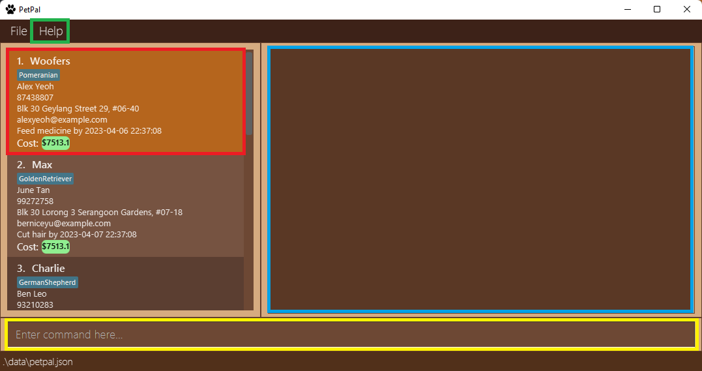
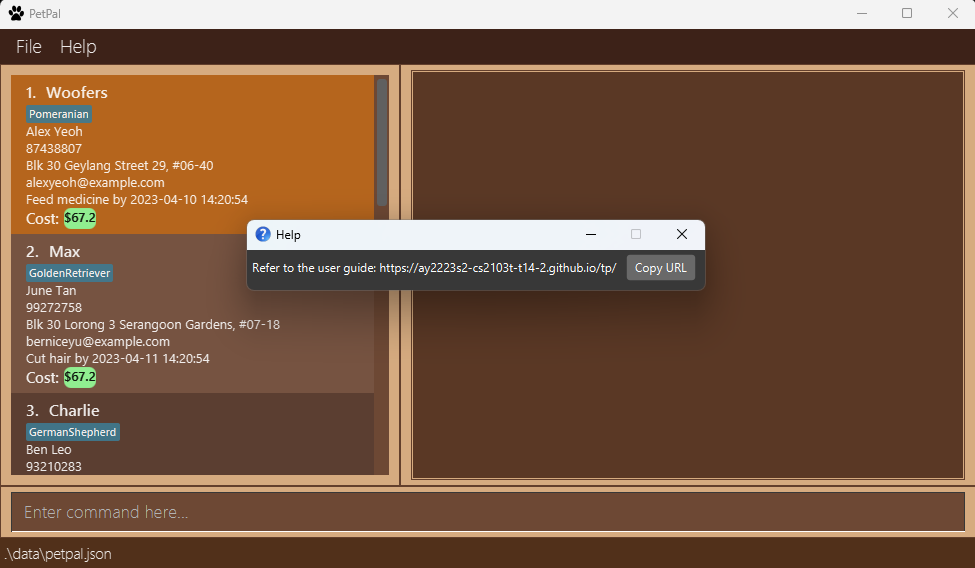
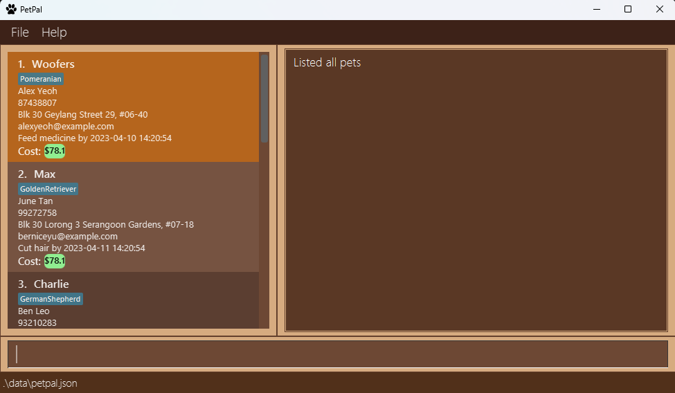
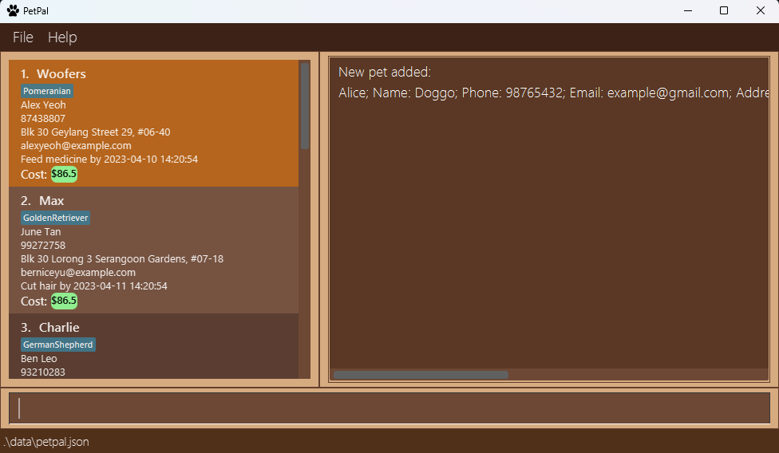
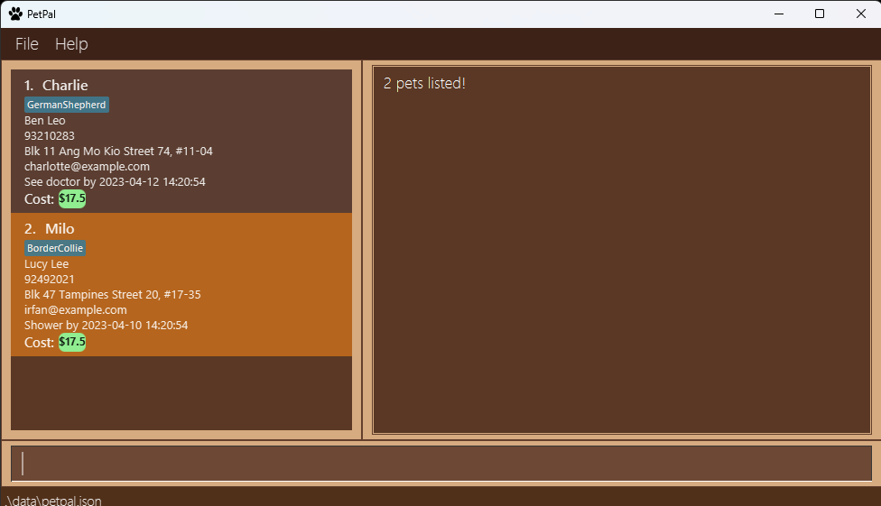
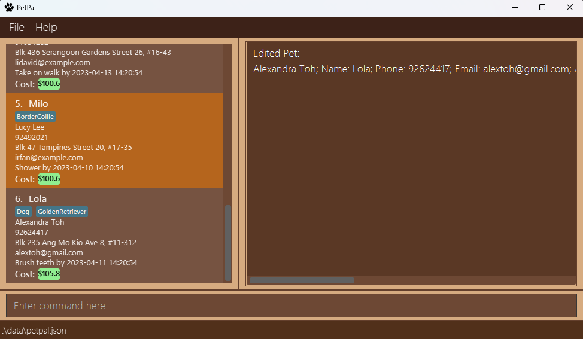
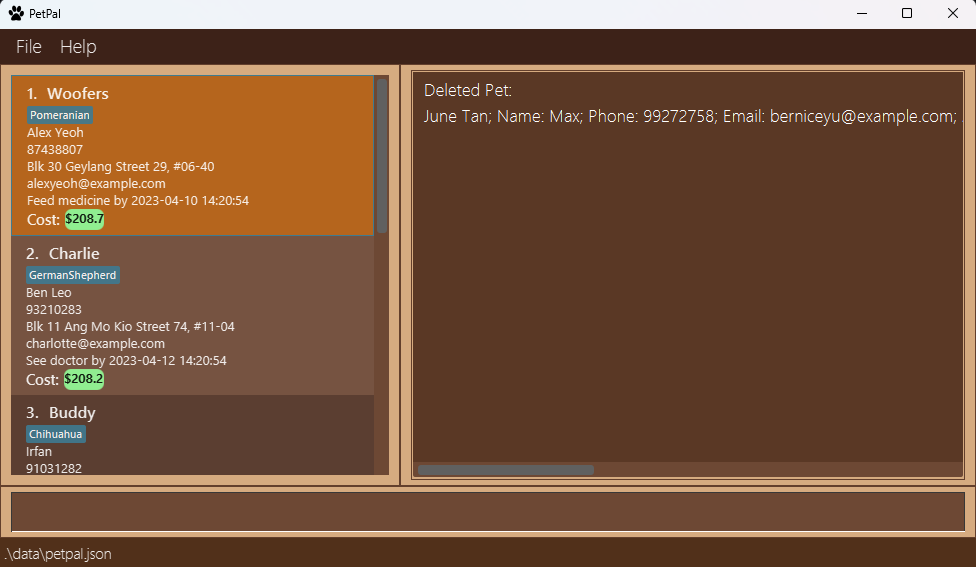
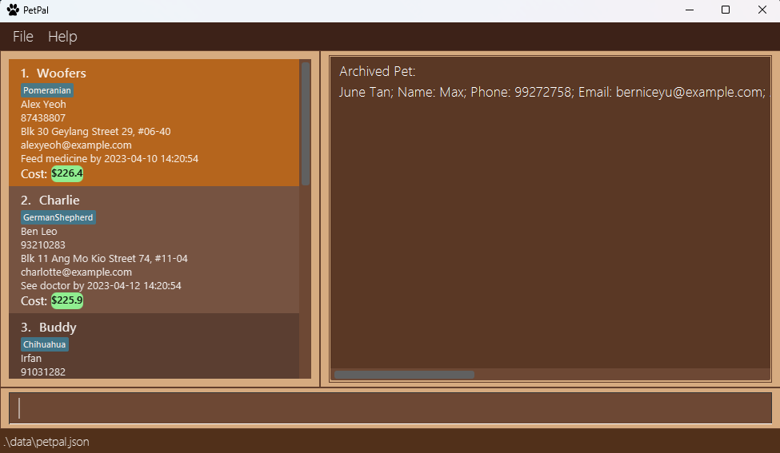
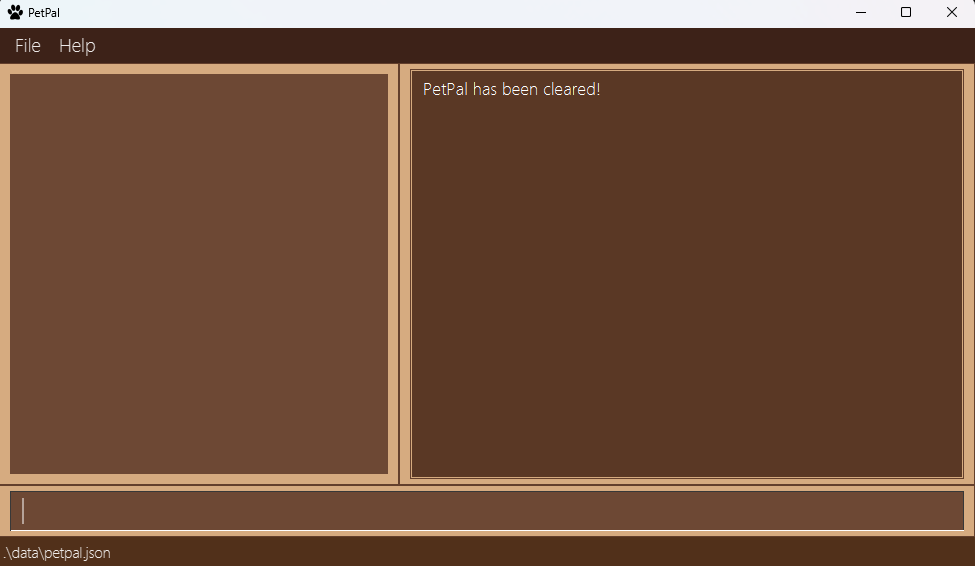

---
span
---
## Welcome to PetPal!

PetPal is your **furry and dependable assistant** who **reminds you of deadlines** and **consolidates crucial information** like pet names, tags dietary needs all in an **aesthetically pleasing** GUI!
You can now focus on spending quality time with your furry friends without having to worry about things accidentally slipping your mind.

**PetPal is optimized for Pet DayCare owners to use via the Command Line Interface (CLI)** while still having the benefits of a Graphical User Interface (GUI).
PetPal can help get your pet's administrative tasks done without needing to be tech-savvy.

This user guide will help you get started and understand how PetPal can **seamlessly streamline your pet-administrative duties**.

## Table of Contents

* Table of Contents
  {:toc}

---

## Quick start

1. Ensure you have Java `11` or above installed in your Computer.
2. Download the latest `PetPal.jar` from [here](https://github.com/AY2223S2-CS2103T-T14-2/tp/releases).
3. Copy the file to the folder you want to use as the _home folder_ for your PetPal.
4. Double-click the file to start the app. The GUI similar to below should appear in a few seconds. Note how the app contains some sample data. 
   
5. Type the command in the command line and press Enter to execute it. e.g. typing **`help`** and pressing Enter will open the help window. 
   Some example commands you can try:

   * **`list`** : Lists all pets currently stored.
   * **`add`**`o/Petricia n/Whiskers p/98746333 e/petricia@petpal.com a/311 Beach Road 2023-03-27 21:09:09 d/Feed cat - 2023-03-27 21:09:09 t/MaineCoon`
     : Adds a `Pet` named `Whiskers` to your PetPal.
   * **`exit`** : Exits the app.
6. Refer to the [Features](#features) below for details of each command.
7. Refer to the [Command Summary](#command-summary) for a quick summary of all commands.

[Return to Table of Contents](#table-of-contents)

---

## Getting Familiar With Your User Interface

1. **Pet Cards**: Contain all the information of a pet. (Highlighted in red)
2. **Command Line**: Type in your commands here. (Highlighted in yellow)
3. **Result Display**: The result of your command execution appears here. (Highlighted in blue)
4. **Help Button**: Provides the URL of this user guide.

[Return to Table of Contents](#table-of-contents)

---

## How to use the User Guide

### General formatting conventions

* Text in [blue](#How-to-use-the-user-guide) are hyperlinks that direct you to the relevant section of the page or to other websites.
* Text in **bold** are used to emphasize important details to look out for or to distinguish headers from the rest of the text.
* Text in `code snippets such as this` are used to show inputs and their format.

* :white_check_mark: **Input Shortcut:**
  Shortened forms of commands which can help increase your efficiency in using PetPal

* :bulb: **Note:**
  Information that might be useful to know to enhance your PetPal experience, might not be compulsory to know

* :heavy_exclamation_mark: **Caution:**
  Important information to note which might negatively impact your experience in using PetPal as it might cause fatal
  errors

* :information_source: **Information**

Information that you need to know

### Command formatting conventions:

* Words in `UPPER_CASE` are the information supplied by you. 
  e.g. `OWNER_NAME` is a parameter in `add o/OWNER_NAME`, where you can input `add o/John Doe`.
* Parameters in `[]` are optional. 
  e.g. `DEADLINE` is an optional parameter in `add o/OWNER_NAME [d/DEADLINE]`, where you can input `add on/John Doe d/Feed dog - 2023-03-27 21:09:09` or just `add n/John Doe`.
* Items with `...` after them can be used multiple times. 
  e.g. `[t/TAG...]` can be used as `t/Pomeranian`, `t/Pomeranian t/Vegetarian` etc.
* `INDEX` represents the index of a specific pet in PetPal list you are **currently viewing**, which can change based on prior commands executed (e.g. `find`, `remind`) 
  e.g. You can use the command `delete INDEX` as `delete 2`.
* Parameters can be in **any order**. 
  e.g. You can input either `add o/OWNER_NAME p/PHONE_NUMBER` or ` add p/PHONE_NUMBER o/OWNER_NAME`.
* Only the last occurrence of a parameter that is expected once will be taken **if you specify it more than once.** 
  e.g. Given `p/12341234 p/56785678`, only `p/56785678` will be taken.
* Extraneous parameters for commands that do not take in parameters (such as `help`, `list`, `exit`,`clear` and `undo`) will be ignored. 
  e.g. if the command specifies `help 123`, it will be interpreted as `help`.

---

## Features

### General

#### Viewing help : `help`

Shows a message explaining how you can access our user guide.

Format: `help`, `h` or Press `F1`

#### Listing your pets : `list`

Shows a list of all pets stored in your PetPal.

Format: `list` or `l`

### Adding

#### Adding a pet's information : `add`

If you have new pet client(s) and need to add your new furry friends into PetPal, you can make use of the `add` command.

Format: `add n/PET_NAME o/OWNER_NAME p/PHONE_NUMBER e/EMAIL a/ADDRESS ts/TIME_STAMP [d/DEADLINE] [t/TAG...] `

* :information_source: **Information**

Note:

1. The field `n/PET_NAME` is **case-sensitive**. That is `n/Doggo` and `n/doggo` will be treated as 2 different pets.
2. There certain constraints which might differ for each parameter, please refer to **Figure 1** below for details on each constraint.
3. Pets with the `PET_NAME` **cannot** be created.
4. There can be multiple tags associated with each pet, simply repeat the tag prefix. e.g. `t/Dog t/BichonFrise`

Figure 1 provides a summary of the parameters with their descriptions, prefixes and constraints.

| Parameter      | Description                                    | Prefix | Constraints                                                                                                                                                                                                                                                                                                                                                                                                                                                                                                                                                                                                                                                                                              | Required?  |
| -------------- | ---------------------------------------------- | ------ | -------------------------------------------------------------------------------------------------------------------------------------------------------------------------------------------------------------------------------------------------------------------------------------------------------------------------------------------------------------------------------------------------------------------------------------------------------------------------------------------------------------------------------------------------------------------------------------------------------------------------------------------------------------------------------------------------------- | ---------- |
| `OWNER_NAME`   | The name of the owner                          | `o/`   | Names should only contain alphanumeric characters and spaces                                                                                                                                                                                                                                                                                                                                                                                                                                                                                                                                                                                                                                             | COMPULSORY |
| `PET_NAME`     | The name of the pet                            | `n/`   | Names should only contain alphanumeric characters and spaces                                                                                                                                                                                                                                                                                                                                                                                                                                                                                                                                                                                                                                             | COMPULSORY |
| `PHONE_NUMBER` | The owner's phone number                       | `p/`   | Phone numbers should only contain numbers, and it should be at least 3 digits long                                                                                                                                                                                                                                                                                                                                                                                                                                                                                                                                                                                                                       | COMPULSORY |
| `EMAIL`        | The owner's email                              | `e/`   | Emails should be of the format local-part@domain and adhere to the following constraints:  1. The local-part should only contain alphanumeric characters and these special characters, excluding the parentheses, ( + SPECIAL_CHARACTERS + ). The local-part may not start or end with any special "characters." 2. This is followed by a '@' and then a domain name. The domain name is made up of domain labels separated by periods.The domain name must: - end with a domain label at least 2 characters long - have each domain label start and end with alphanumeric characters - have each domain label consist of alphanumeric characters, separated only by hyphens, if any | COMPULSORY |
| `ADDRESS`      | The owner's address                            | `a/`   |                                                                                                                                                                                                                                                                                                                                                                                                                                                                                                                                                                                                                                                                                                          | COMPULSORY |
| `TIMESTAMP`    | The date and time when the pet starts boarding | `ts/`  | Timestamps should be in the`YYYY-MM-DD HH:MM:SS` format.   eg. 2023-03-27 21:09:09  and in the future                                                                                                                                                                                                                                                                                                                                                                                                                                                                                                                                                                                                    | COMPULSORY |
| `DEADLINE`     | A deadline attributed with the pet             | `d/`   | Timestamps given in the deadline should be in the`YYYY-MM-DD HH:MM:SS` format.   eg. 2023-03-27 21:09:09  and in the future                                                                                                                                                                                                                                                                                                                                                                                                                                                                                                                                                                              | OPTIONAL   |
| `TAG`          | A label that you can attach to a pet           | `t/`   | Tags should be alphanumeric, and**cannot** include spaces                                                                                                                                                                                                                                                                                                                                                                                                                                                                                                                                                                                                                                                | OPTIONAL   |

<b>Figure 1</b>: Parameters with their descriptions, prefixes and constraints.

* :heavy_exclamation_mark: **Caution:**
  The format of the timestamp should strictly follow the convention `YYYY-MM-DD HH:MM:SS` eg. `2023-03-27 21:09:09`
  otherwise you will encounter errors when adding a new pet.

Example given: `Example: add o/Alice n/Doggo p/98765432 e/example@gmail.com a/311, Clementi Ave 2, #02-25 ts/2023-03-27 21:09:09 d/Feed dog - 2023-03-27 21:09:09 t/Dog t/Chihuahua`

Other examples:

* `add o/Petricia n/Whiskers p/98746333 e/petricia@petpal.com a/311 Beach Road 2023-03-27 21:09:09 d/Feed cat - 2023-03-27 21:09:09 t/MaineCoon ts/2023-03-27 21:09:09 t/Cat`
* `add o/Robert n/Fluffy p/98746333 e/rob@bmail.com a/622 Rose Road ts/2023-03-27 21:09:09 d/Feed rabbit - 2023-03-27 21:09:09 t/Vegetarian t/Rabbit`

#### Filtering out reminders that are due soon : `remind`

Get a filtered list of things you should do soon!

**Constraints**

* The filtering of the list only checks if the deadline of a pet is within 3 days of current date.
* It does not sort out the list based on the deadline of the pet. (Future implementation)
* However, currently those reminders that are due within the day are highlighted in bright orange on the GUI as seen in the image given below.

Format: `remind`

:bulb: **Note:**
The pets highlighted in bright orange are reminders that are due within a day! 

### Retrieving

#### Finding your pet by name : `find`

Find your pets by their names.

**Constraints**

* The search is case-insensitive. e.g. `woofers` will match `Woofers`
* Only the **pet name** is searched. e.g. `find Alex` will not return owner names, addresses or emails with `Alex`
* Partial words will not be matched. e.g. `Jack` will not match `Jackson`
* Order of the name given does not matter. e.g. `Milo Charlie` will match `Charlie` and `Milo`

Format: `find n/PET_NAME`

Example given: `find Milo Charlie`

Other examples:

* `find Max` returns `max` and `Max Leo`
* `find Super Wolf` returns `Super Wolf`, `Super Dog`, `Wolf Hunter` 

:bulb: **Note:** 
`find` command returns a new list. Any commands performed after `find` is based on the new list. You can use the `list` command to return to the original list.

:white_check_mark: **Input Shortcut:**
Format: `f n/PET_NAME`

### Updating

#### Updating your pet information : `edit`

A pet owner changed their contact information? or did you find out new information about your pet client?

You can edit these changes with the `edit` command. This command can be used to edit: phone number, address, email, and tags.

If you accidentally invoked this command with the wrong parameters, you can use the `edit` command to re-edit the wrong fields or
the `undo` command to revert the wrong changes.

**Constraints**

* Edits the pet with the provided index.
* `INDEX` is the index of the pet in the currently displayed list.
* You must provide **at least one** of the optional fields.
* Allows you to update a pet to have same owner name but different phone number or, same number but different owner name as a current pet in the PetPal.
* Pet profiles are auto saved in PetPal and are reflected in the PetPal list.
* Cost is constantly being updated in PetPal but the latest information may not be reflected to you. To get the latest information, either click on the pet profile or run a command (e.g. `list` or `l`).

Format: `edit INDEX [p/PHONE_NUMBER] [a/ADDRESS] [e/EMAIL] [t/TAG...]`

Example given: `edit 6 t/GoldenRetriever t/Dog a/Blk 235 Ang Mo Kio Ave 8, #11-312 e/alextoh@gmail.com`

:bulb: **Note:**

If you wish to add tags to the pet, take note to include all previous tags in the edit, or they will be overridden.

Only parameters provided will be changed.

Other examples:

* `edit 2 p/91234567 a/21 Beach Road` Updates the second pet entry's phone number to`91234567`
  and address to `21 Beach Rd`
* `edit 3 t/Dog`. Updates the third pet entry's tag to `Dog`, take note that if the third entry has an existing tag,
  the edit will override the existing tag

#### Amount indication

Pet Card information indicates the amount of money owed to you for taking good care of their pets!

Cost is calculated based on initial timestamp input by user. The cost is updated based on user interaction, clicking the petcard or reopening petpal!

#### Changing the cost : `changecost`

Do some pets cost more to board in your daycare than others? You can use the `changecost` command to
change the parameters for cost calculation for each pet.

Cost is incremented in real time and is calculated based on `FLAT_RATE + (TIMESTAMP - CURR_TIME * RATE)`.

:bulb: **Note:**

The cost will only update in your PetPal list when you click on the PetPal entry.

The update only applies to the selected PetPal entry.

Format: `changecost INDEX RATE FLAT_RATE`

Example given: `changecost 1 0.1 0.5`

* :white_check_mark: **Input Shortcut:**
  You can also use the shortcut `cc` to replace `changecost`

Additional example:

* `cc 2 1.0 1.5`

### Marking a deadline as done : `mark`

The 'mark' function is designed to help pet owners keep track of their pet's deadlines by marking them as done.

Pets that are already marked will not be highlighted.

Format: `mark INDEX`

Example given: `mark 1`

:bulb: **Note:**

You should always mark the pet's deadline when you finished it. Otherwise, it will be highlighted as undone.

Pet deadline status will be automatically saved in the form of `status` field in the `petpal.json` file. `Unmarked` means have not finished yet and `Marked` means already finished.

### Deletion

#### Deleting a pet : `delete`

Deletes the specified pet from your PetPal.

You can use this command when:

1. You drop a pet.
    

**Constraints**

* `INDEX` is the index of the pet in the currently displayed list.
* Deletes the pet with the specified index in your PetPal.

Format: `delete INDEX`

Example:

* `delete 2` deletes the second pet in the currently displayed pet list in the PetPal.

#### Archiving a pet: `archive`

Sometimes a client may become inactive or stop using your services. To keep a record of the pet whilst not cluttering
your active PetPal list, you can use the `archive` command to move these records to another save file.

Archives the specified pet into the `archive.json` file in the `data` folder.

Note that:

* The specified pet will be removed from your PetPal list.
* The index is based on the **currently displayed** PetPal list, which might change depending on prior commands used
  (e.g. `find`)

Format: `archive INDEX`

Example:

* `archive 2` archives the second pet in the currently displayed list in PetPal

#### Clearing PetPal list: `clear`

Clears all entries from `PetPal.json`.

Format: `clear`

:heavy_exclamation_mark: **Important**
If you run this command by accident, you can [undo](#undoing-a-previous-command--undo) the command to restore the previous state of PetPal.

### Undo

#### Undoing a previous command : `undo`

Undo the last command executed, only works for supported commands. You can use this if you
make a mistake while using PetPal.

**Constraints**

* The command intended to be undone should be an undoable command.
* Supported commands: `add`, `delete`, `edit`, `clear`, `undo`
* **NOT SUPPORTED** commands: `exit`, `find`, `help`, `list`, `remind`, `changecost`, `archive`

Format: `undo`

### Exiting the program : `exit`

Exits the program. Data is [automatically saved](#saving-the-data).

Format: `exit` or `e`

### Saving the data

Your PetPal and archive data are both automatically saved after executing any command that changes the data.
This means hassle-free saving.

### Editing the data file

PetPal data are saved as a JSON file `[JAR file location]/data/PetPal.json`. If you are an advanced user, you are welcome to update data directly by editing that data file.
Archive data is also in a JSON format and can be found `[JAR file location]/data/archive.json`.

:exclamation: **Caution:**
If your changes to either data files makes its format invalid, PetPal will **discard all data** and start with an empty data file at the next run,
which is **IRREVERSIBLE**.

[Return to Table of Contents](#table-of-contents)

---

## FAQ

**Q**: How do I transfer my data to another computer? 
**A**: Follow these steps to transfer your data to another computer:

1. Find the save folder on the current computer. The save files can be found in the `data` folder created by the app, it should include both `PetPal.json` and `archive.json`
2. Transfer the save file to your new computer.
3. Download the latest release of PetPal from [here](https://github.com/AY2223S2-CS2103T-T14-2/tp/releases) on your new computer.
4. Launch PetPal on your new computer and exit.
5. You should see a new `data` folder containing a new `PetPal.json` with a sample. Replace this file with the save file copied over from your old computer.
6. Launch PetPal again. Your data should be there!

* :bulb: **Note:**
  If you wish to transfer only 1 of the files over, repeat the same steps, and replace the file you want to move, instead of the entire `data` folder

  

**Q**: How do I view the entire pet list after a `find` command?

**A**: Run `list` or `l` to view the entire unfiltered list.

  

**Q**: Why there are some pets highlighted even though the deadline is already passed?

**A**: If you have already done the task, run `mark` function to mark it as done and remove the highlight.

  
**Q**: PetPal says the index is invalid even though the pet exists in the PetPal list

**A**: Index of each pet is based on your **currently viewable** pet list index, so if your currently viewable pet list is empty, the index will be invalid 
Run `list` or `l` to view all the pets in the list before executing the command again.

  

**Q**: Why is my pet cost not updating?

**A**: After clicking on a `PetCard` once, the cost will be updated for the first time. To update the cost again, please click on other `PetCards`.

  
If you have additional questions that is not present in the User Guide, feel free to contact us via our email `contact@petpal.com`
or raise an issue in our [GitHub](https://github.com/AY2223S2-CS2103T-T14-2/tp/issues)

[Return to Table of Contents](#table-of-contents)

---

## Glossary

| Term                     | Definition                                                                                                                                                                                                                                                                                                                       |
| ------------------------ | -------------------------------------------------------------------------------------------------------------------------------------------------------------------------------------------------------------------------------------------------------------------------------------------------------------------------------- |
| Alphanumeric             | Refers to characters that are the combined set of the 26 alphabetic characters, a to Z, both lowercase and uppercase, and the 10 Arabic numerals, 0 to 9.                                                                                                                                                                        |
| Command Line Interface   | A command-line interface (CLI) is a text-based user interface (UI) used to run programs, manage computer files and interact with the computer.                                                                                                                                                                                   |
| YYYY-MM-DD hh:mm:ss      | Date format whereby`YYYY` refers to the year using 4 digits, `MM` refers to the months in 2 digits, `DD` refers to the days in 2 digits, `hh` refers to the 2 digit hours, `mm` refers to the 2 digit minutes, 'ss' refers to the 2 digit seconds. They are each separated by a hyphen: `-` character for date and `:` for time. |
| Graphical User Interface | A graphical user interface (GUI) is an interface through which a user interacts with electronic devices such as computers and smartphones through the use of icons, menus and other visual indicators or representations (graphics).                                                                                             |
| Index                    | The number that corresponds to the position of the pet in the list. The index must be a numeral above 0.                                                                                                                                                                                                                         |
| Java                     | The programming language used for this application. Java is a general-purpose computer programming language designed to produce programs that will run on any computer system that has Java installed.                                                                                                                           |
| JAR                      | JAR stands for Java ARchive. PetPal uses JAR to deliver its distribution. JAR is a file format based on the popular ZIP file format and is used for aggregating many files into one.                                                                                                                                             |
| JSON                     | JSON stands for JavaScript Object Notation. JSON is the format used to store your PetPal's data. JSON is a lightweight format for storing and transporting data.                                                                                                                                                                 |

[Return to Table of Contents](#table-of-contents)

---

## Command summary

| Action          | Format, Examples                                                                                                                                                                                                                                                        | Shortcut              |
| --------------- | ----------------------------------------------------------------------------------------------------------------------------------------------------------------------------------------------------------------------------------------------------------------------- | --------------------- |
| **Help**        | `help`                                                                                                                                                                                                                                                                  | `h` or **PRESS** `F1` |
| **List**        | `list`                                                                                                                                                                                                                                                                  | `l`                   |
| **Add**         | `add o/OWNER_NAME p/PHONE_NUMBER e/EMAIL a/ADDRESS ts/TIME_STAMP [d/DEADLINE] [t/TAG...]`  e.g `Example: add o/Alice n/Doggo p/98765432 e/example@gmail.com a/311, Clementi Ave 2, #02-25 ts/2023-03-27 21:09:09 d/Feed dog - 2023-03-27 21:09:09 t/Dog t/Chihuahua` |                       |
| **Edit**        | `edit p/PHONE_NUMBER [e/EMAIL] [a/ADDRESS] [t/TAG...]`  e.g `Example: edit 6 t/Golden Retriever t/Dog a/Blk 235 Ang Mo Kio Ave 8, #11-312 e/alextoh@gmail.com`                                                                                                       |                       |
| **Delete**      | `delete INDEX` e.g. `delete 2`                                                                                                                                                                                                                                       |                       |
| **Remind**      | `remind`                                                                                                                                                                                                                                                                |                       |
| **Mark**        | `mark INDEX`  e.g `mark 1`                                                                                                                                                                                                                                           |                       |
| **Find**        | `find n/PET_NAME` e.g `find Milo`                                                                                                                                                                                                                                    | `f`                   |
| **Undo**        | `undo`                                                                                                                                                                                                                                                                  |                       |
| **Change Cost** | `changecost INDEX RATE FLAT_COST` e.g. `changecost 1 0.1 0.5`                                                                                                                                                                                                        | `cc`                  |
| **Archive**     | `archive INDEX` e.g. `archive 1`                                                                                                                                                                                                                                     |                       |
| **Clear**       | `clear`                                                                                                                                                                                                                                                                 |                       |
| **Exit**        | `exit`                                                                                                                                                                                                                                                                  |                       |

[Return to Table of Contents](#table-of-contents)

---

## Acknowledgements

* This project is based on the AddressBook-Level3 project created by the [SE-EDU initiative](https://se-education.org)
* The logo used references the [Dog icons created by Flat Icons - Flaticon](https://www.flaticon.com/free-icons/dog)

[Return to Table of Contents](#table-of-contents)
