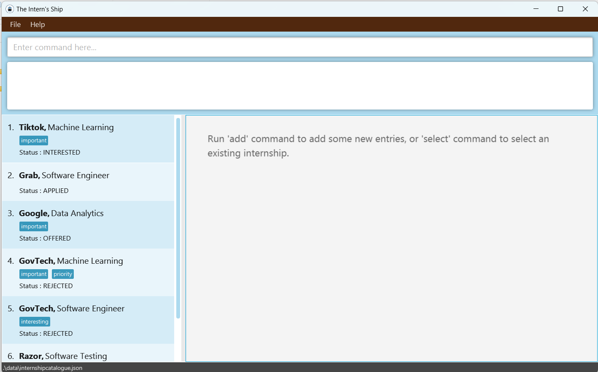
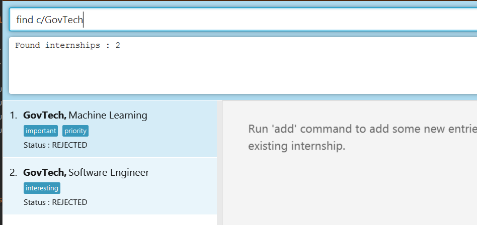
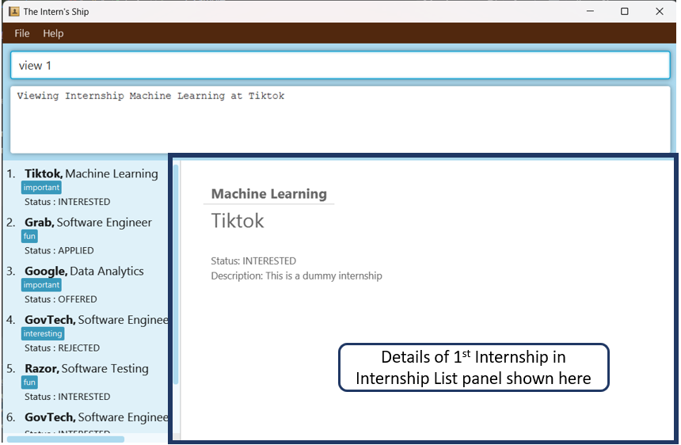
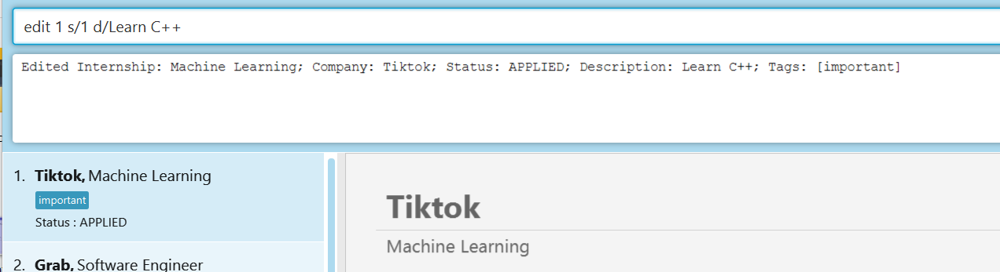
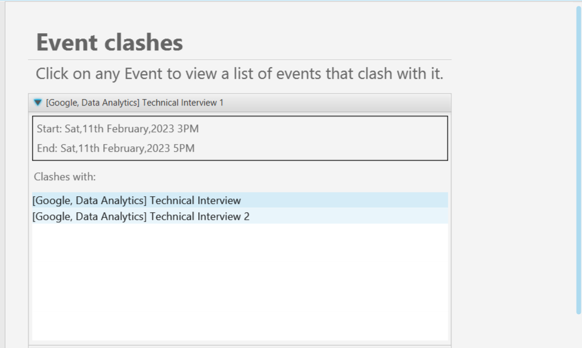

The Intern’s Ship (TinS) is a **desktop app for managing internships application, optimized for use via a Command Line
Interface (CLI)** while still having the benefits of a Graphical User Interface (GUI). If you can type fast, TinS can
help you manage and keep track of your internship applications faster than traditional GUI apps.

* Features (v1.3)
  * Adding an internship application: `add`
  * Listing all internship applications in TinS: `list`
  * Finding a particular internship application in TinS: `find`
  * Editing a details of an internship application: `edit`
  * Locating internship by name: `select`
  * Deleting an internship : `delete`
  * Adding an event to an internship application: `event add`
  * Deleting an event from an internship application: `event delete`
  * Finding all clashing events: `clash`
  * Getting help: `help`
  * Saving the data
  * Exiting the program: `exit`

-----------------
## Table of Contents
{:toc}

--------------------------------------------------------------------------------------------------------------------

## Quick start

1. Ensure you have Java `11` or above installed in your Computer.

2. Download the latest `tins.jar` from [here](https://github.com/AY2223S2-CS2103T-W11-2/tp/releases/tag/v1.3(trial)).

3. Copy the file to the folder you want to use as the _home folder_ for your TinS.

4. Open a command terminal, `cd` into the folder you put the jar file in, and use the `java -jar tins.jar` command to run the application.<br>
   A GUI similar to the below should appear in a few seconds. Note how the app contains some sample data.<br>
   

5. Type the command in the command box and press Enter to execute it.

6. Refer to the [Features](#features) below for details of each command.

--------------------------------------------------------------------------------------------------------------------

## About the Graphic User Interface (GUI)

1. **Command Line**: This is where you would input your commands.
2. **Program Response**: This box displays the program's feedback to your inputted commands.
3. **Internship List Panel**: This panel displays your internships listings stored in TinS (including Position, 
Company, Status and Tags).
4. **Internship Display Panel**: This panel displays relevant details pertaining to specific internship.

## Features

<div markdown="block" class="alert alert-info">

**Notes about the command format:**<br>

* Words in `UPPER_CASE` are the parameters to be supplied by the user.<br>
  e.g. in `add p/POSITION c/COMPANY_NAME s/APPLICATION_STATUS d/DESCRIPTION`, `POSITION` is a parameter which can be
  used as `add p/Software Engineer c/Grab s/1 d/Requires knowledge of Python and Java`.

* Items in square brackets are optional.<br>
  e.g `[TAG]` means that the user input is optional.

</div>

### Adding an Internship Application : `add`

Adds an internship and its details to TinS.

Format: `add p/POSITION c/COMPANY_NAME s/APPLICATION_STATUS d/DESCRIPTION [t/TAG] ...`

* `POSITION`: Name of Internship Position
* `COMPANY_NAME` : Name of Hiring Company

> Note: `POSITION` and `COMPANY_NAME` have to be unique. <br>
> If there is an Internship with `POSITION` as `Software Engineer` and `COMPANY_NAME` as `Grab` already saved in TinS:
> * Adding an Internship with `POSITION` as `Software Engineer` and `COMPANY_NAME` as `Grab` is not valid
> * Adding an Internship with `POSITION` as `Software Engineer 1` and `COMPANY_NAME` as `Grab` is valid
> * Adding an Internship with `POSITION` as `Software Engineer` and `COMPANY_NAME` as `Grab 1` is valid

* `APPLICATION_STATUS` : Status of Application
  * `APPLICATION_STATUS` should be an Integer value from 0 to 3. Here are the statuses for the corresponding integer
  values:
    * `0` : Interested
    * `1` : Applied
    * `2` : Offered
    * `3` : Rejected
* `DESCRIPTION` : Additional details about the Internship (E.g. Contact Details, Link to Webpage, Requirements of
Internship)
* `TAG` : Customised Tag
  * This is optional.
  * An Internship can have more than one tag.

Example:
```
add p/Software Engineer c/Grab s/1 d/Requires knowledge of Python and Java t/Important t/Priority
```

### Listing all Internships Applications : `list`

List all the internships in Internship List panel of TinS.

* After keying in the `list` command, TinS displays **all** the Internships stored in TinS in the Internship List panel on
the left side of TinS Application.
* Only the `POSITION`, `COMPANY_NAME`, `APPLICATION_STATUS` and `TAG` are display in the Internship List panel for each
Internship.

Example: <br>


### Finding Internships: `find`
Finds Internships by Position, Company, Status.
Format: `find p/[POSITION] c/[COMPANY_NAME] s/[APPLICATION_STATUS]`

* After keying in the `find` command, the program will filter the internship catalogue accordingly.
* To revert the list back to the original, just simply enter the `list` command.

Example: Default TinS has 6 internship listings. `find c/GovTech` would return the list of internships with company name
GovTech.


### Viewing Details of a Particular Internship : `select`

View details of the internship selected by ID.

Format: `select ID`

* `ID`: The number of the selected internship in the Internship List Panel
* After keying in the `select` command, the program will return the all details of the selected internship in the right
panel.

Example: <br>


### Editing Details of Internship Application : `edit`

Edit details of the internship selected by ID.

Format: `edit ID p/[POSITION] c/[COMPANY_NAME] s/[APPLICATION_STATUS] d/[DESCRIPTION] t/[TAG]`

* `ID`: Identification number of the Internship.
* `[POSITION]`: Name of Internship Position (optional).
* `[COMPANY_NAME]` : Name of hiring company (optional).
* `APPLICATION_STATUS]` : Status of Application (`ACCEPTED`, `APPLIED`, `PENDING`, `REJECTED`) (optional).
* `[DESCRIPTION]`: Additional details of the internship application (optional).
* `[TAG]`: Labels for the internship application (optional).
* After keying in the `edit` command, along with the selected fields the user wishes to edit, TinS will update the
  corresponding fields of the internship application accordingly.

Example: <br>
After keying in the `edit` command followed by an existing `ID` and the fields `APPLICATION_STATUS` and `DESCRIPTION`, 
TinS will update the `APPLICATION_STATUS` and `DESCRIPTION` fields of the internship application with the specified 
`ID`, then display the newly updated internship application

~~~
edit 1 s/1 d/Learn C++
~~~


### Deleting an Internship Application : `delete`

Deletes an internship along with its details.

Format: `delete ID`
* Deletes the person at the specified `ID` in the Internship List Panel.

Example: `delete 1` deletes the first internship displayed in the Internship List Panel

### Adding an Event to an Internship Application : `event add`
Adds an Event along with its details to the selected internship.

> Note: Before adding an event , you have to select an internship using `select ID`

Format: `event add na/EVENT_NAME st/[START_DATETIME] en/END_DATETIME de/DESCRIPTION`

* If you want to add an `event`: 

`event add na/EVENT_NAME st/START_DATETIME en/END_DATETIME de/DESCRIPTION`

* If you want to add an `deadline`:

`event add na/EVENT_NAME en/END_DATETIME de/DESCRIPTION`

* `EVENT_NAME`: Name of the Event
* `START_DATETIME`: Starting time of an event (optional) (in the format: DD/MM/YYYY HHMM)
* `END_DATETIME`: Ending time of an event (in the format: DD/MM/YYYY HHMM)
* `DESCRIPTION`: Description of the Event (e.g. Venue, Things to take note of)

Examples:
```
event add na/Technical Interview st/10/09/2023 1500 en/10/09/2023 1700 de/On Zoom
```

### Deleting an Event from an Internship Application : `event delete`
Deletes selected Event along with its details from the selected internship.

> Note: Before deleting an event, you have to select an internship using `select ID`

Format: `event delete ID`
* `ID`: The ID of the selected event in the list

Examples: `event delete 1` entered after `select 1` deletes the first event in the first internship.

### Finding all Clashing Events : `clash`
Displays all events with clashing timings.

Format: `clash`


### Exiting the program : `exit`

Exits and closes the TinS application.

Format: `exit`

### Saving the data

The Intern Ship’s data is saved in the hard disk automatically after any command that changes the data.
There is no need to save manually.

--------------------------------------------------------------------------------------------------------------------

## Command summary
<table>

<tr>
<th>Action</th>
<th>Format</th>
</tr>

<tr>
<td><b>Add</b></td>
<td><code>add p/POSITION c/COMPANY_NAME s/APPLICATION_STATUS d/DESCRIPTION [t/TAG] ...</code><br>
E.g. <code>add p/Software Engineer c/Grab s/1 d/Requires knowledge of Python t/Important t/Priority</code></td>
</tr>

<tr>
<td><b>List</b></td>
<td><code>list</td>
</tr>

<tr>
<td><b>Edit</b></td>
<td><code>edit ID [p/POSITION] [c/COMPANY_NAME] [s/APPLICATION_STATUS] [d/DESCRIPTION] [t/TAG] ...</code><br>
E.g. <code>edit 1 p/Data Analyst</code> edits the <code>POSITION</code> of first internship in the Internship List panel
to Data Analyst</td>
</tr>

<tr>
<td><b>Delete</b></td>
<td><code>delete ID</code><br>
E.g. <code>delete 1</code> deletes the first internship in the Internship List panel</td>
</tr>

<tr>
<td><b>Select</b></td>
<td><code>select ID</code><br>
E.g. <code>select 1</code> selects the first internship in the Internship List panel</td>
</tr>

<tr>
<td><b>Add Event</b></td>
<td><code>event add na/EVENT_NAME st/[START_DATETIME] en/END_DATETIME de/DESCRIPTION</code><br>
E.g. <code>event add na/Technical Interview st/10/09/2023 1500 en/10/09/2023 1700 de/On Zoom</code></td>
</tr>

<tr>
<td><b>Delete Event</b></td>
<td><code>event delete ID</code><br>
E.g. <code>event delete 1</code></td>
</tr>

<tr>
<td><b>Finding Clashing Events</b></td>
<td><code>clash</code></td>
</tr>

<tr>
<td><b>Help</b></td>
<td><code>help</code></td>
</tr>

<tr>
<td><b>exit</b></td>
<td><code>exit</code></td>
</tr>

</table>
