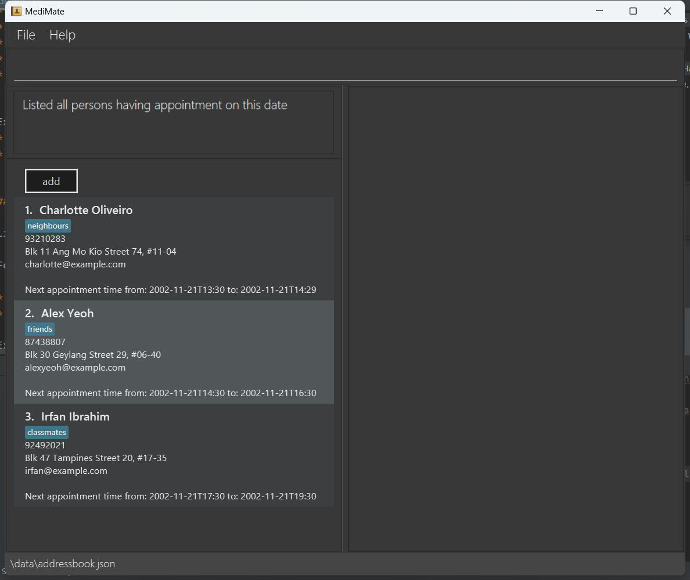

# MediMate: The Doctor's Companion

MediMate (MM) is a cross-platform desktop application for medical professionals, specifically for private doctors or
their receptionists,
who are experienced with computers and currently using paper records to store patient information.
With this solution, they will be able to better manage their patient data, including updating,
accessing and adding new patient details easily. It is optimized for use via a Command Line Interface (CLI) while still
having the
benefits of a Graphical User Interface (GUI). If you can type fast, MM can get your contact management tasks done faster
than traditional GUI apps.

## Table of Contents

- [Quick Start](#quick-start)
- [Features](#features)
    - [Help](#help)
    - [Add](#add)
    - [List](#list)
        - [listTime](#listtime)
        - [list_name](#list_name)
    - [Edit](#edit)
    - [Appointment](#appointment)
        - [makeApp](#makeapp)
        - [markApp](#markapp)
    - [Create](#create)
    - [View](#view)
    - [Upload](#upload)
    - [Find](#find)
    - [SearchDate](#searchdate)
    - [Delete](#delete)
        - [deletes](#deletes)
        - [deleteFile](#deletefile)
    - [Clear](#clear)
    - [Exit](#exit)
- [Saving, Editing, and Archiving Data](#saving-editing-and-archiving-data)
- [FAQ](#faq)
- [Command Summary](#command-summary)

--------------------------------------------------------------------------------------------------------------------

## Quick start

1. Ensure you have Java `11` or above installed in your Computer.

2. Download the latest `MediMate.jar`
   from [here](https://github.com/AY2223S2-CS2103T-W11-4/tp/releases/tag/v1.3.0-alpha).

3. Copy the file to the folder you want to use as the _home folder_ for your MediMate.

4. Open a command terminal, `cd` into the folder you put the jar file in, and use the `java -jar MediMate.jar` command
   to run the application. 
   A GUI similar to the below should appear in a few seconds. Note how the app contains some sample data. 
   

5. Type the command in the command box and press Enter to execute it. e.g. typing **`help`** and pressing Enter will
   open the help window. 
   Some example commands you can try:

    * `list` : Lists all patients.

    * `add n/John Doe p/98765432 e/johnd@example.com a/Jo0hn street, block 123, #01-01 ag/20 m/cough t/classmate` : Adds
      a patient named `John Doe` to the Patient List.

    * `delete 3` : Deletes the 3rd patient shown in the current list.

    * `clear` : Deletes all patients.

    * `exit` : Exits the app.

6. Refer to the [Features](#features) below for details of each command.

--------------------------------------------------------------------------------------------------------------------

## Features

**:information_source: Notes about the command format:** 

* Words in `UPPER_CASE` are the parameters to be supplied by the user. 
  e.g. in `add n/NAME`, `NAME` is a parameter which can be used as `add n/John Doe`.

* Items in square brackets are optional. 
  e.g `n/NAME [t/TAG]` can be used as `n/John Doe t/friend` or as `n/John Doe`.

* Items with `…`​ after them can be used multiple times including zero times. 
  e.g. `[t/TAG]…​` can be used as ` ` (i.e. 0 times), `t/friend`, `t/friend t/family` etc.

* Parameters can be in any order. 
  e.g. if the command specifies `n/NAME p/PHONE_NUMBER`, `p/PHONE_NUMBER n/NAME` is also acceptable.

* If a parameter is expected only once in the command but you specified it multiple times, only the last occurrence of the parameter will be taken. 
  e.g. if you specify `p/12341234 p/56785678`, only `p/56785678` will be taken.

* Extraneous parameters for commands that do not take in parameters (such as `help`, `list`, `exit` and `clear`) will be ignored. 
  e.g. if the command specifies `help 123`, it will be interpreted as `help`.

### Viewing help : `help`

Shows a message explaning how to access the help page.

Format: `help`

### Adding a patient : `add`

Adds a patient to the address book through CLI method:

* Enter the patient's name, phone number, email, and address.
* You can add any number of tags to the patient's profile by adding "t/" followed by the tag.
* OPTIONAL: You can also add patient's age, medical condition, nric.
* NRIC need to be in the correct format. The first letter must be either 'S', 'T' or 'G' (E.g. S9935010Y)
* Age need to be less than or equal to 120 and must be a positive integer.
* To record a patient's other information, add them as additional tags to the patient's profile.

Format: `add n/NAME p/PHONE_NUMBER e/EMAIL a/ADDRESS [ag/AGE] [m/MEDICAL_CONDITION] [nric/NRIC_NUMBER] [t/TAG]…​`

:bulb: **Tip:**
A patient can have any number of tags (including 0)

Examples:

* `add n/John Doe p/98765432 e/johnd@example.com a/John street, block 123, #01-01`
* `add n/Betsy Crowe t/friend e/betsycrowe@example.com a/Newgate Prison p/1234567 ag/12 m/cough nric/S9935010Y t/criminal` 

Adds a patient to the address book through GUI method: 
* Click the add button as shown in the screenshot. 
* Fill in the blanks.

The first example contains strictly required information to identify a patient.

The second example contains more information relevant to that patient.

### Listing all patients : `list`

Shows a list of all patients in the address book.

Format: `list`

### Listing patients by time : `listTime`

Shows a list containing of all patients that have an appointment date and time.

Format: `listTime`

### Listing patients by name : `list_name`

Shows a list of all patients in the address book by their name lexicographically.

Format: `list_name`

### Editing a patient : `edit`

Edits an existing patient in the patient list:

Format: `edit INDEX [n/NAME] [p/PHONE] [e/EMAIL] [a/ADDRESS] [ag/AGE] [m/MEDICAL_CONDITION] [nric/NRIC_NUMBER] [t/TAG]…​`

* Edits the patient at the specified `INDEX`. The index refers to the index number shown in the displayed patient list.
  The index **must be a positive integer** 1, 2, 3, …​
* Specify the field you want to edit (name, phone, email, address, age, medical condition, nric, or tag) followed by the
  new value. At least one of the optional fields must be provided.
* Existing values will be updated to the input values.
* Editing Nric number need to be in the correct format and cannot be empty. The first letter must be either 'S', 'T'
  or 'G' (E.g. S9935010Y)
* When editing tags, the existing tags of the patient will be removed i.e adding of tags is not cumulative.
* You can remove all the patient’s tags by typing `t/` without
  specifying any tags after it.

Examples:

* `edit 1 p/91234567 e/johndoe@example.com` Edits the phone number and email address of the 1st patient to be `91234567`
  and `johndoe@example.com` respectively.
* `edit 2 n/Betsy Crower t/` Edits the name of the 2nd patient to be `Betsy Crower` and clears all existing tags.
* `edit 2 m/` Edits the medication condition of the 2nd patient to be empty.
* `edit 2 m/Flu` Edits the medication condition of the 2nd patient to be `Flu`.
* `edit 3 ag/50` Edits the age of the 3rd patient to be `50`.
* `edit 3 ag/1222` This command is not allowed as age should be less than or equal to 120 and must be a positive
  integer.

### Making Appointment to a patient : `makeApp`

Makes an appointment with a patient(reschedule appointment allowed)

Format: `makeApp INDEX /from {startTime} /to {endTime}`

* Makes an appointment with a patient at the specified `INDEX`. The index refers to the index number shown in the
  displayed patient list. The index **must be a positive integer** 1, 2, 3, …​
* startTime and endTime should be on the same date
* startTime has to be earlier than the endTime else appointment will not be created.
* If a patient already had an appointment, it will reschedule this appointment
* Appointment will not be created if the timing clash with existing appointment timing

Examples:

* `makeApp 5 /from 2023-08-15 1430 /to 2023-08-15 1630` Makes an Appointment with 5th patient, starting from
  14:30 to 16:30 on 2023-08-15

### Marking Appointment with a patient: `markApp`

Marks an appointment with a patient as done

Format: `markApp INDEX`

* Marks an appointment with a patient at the specified `INDEX`. The index refers to the index number shown in the
  displayed patient list. The index **must be a positive integer** 1, 2, 3, …​
* The patient will now have no appointment
* Once marked, the patient's appointment will be empty.
* Appointment cannot be marked if the patient's appointment is empty.

Examples:

* `markApp 5` Marks an appointment with 5th patient as done.

### Create a Medical Certificate for patient: `create`

Create a PDF Medical Certificate for a patient

Format: `create INDEX doc/DOCTOR_NAME m/MEDICAL_CONDITION d/DAYS`

* Create a PDF medical certificate for a patient at the specified `INDEX`. The index refers to the index number shown in
  the displayed patient list. The index **must be a positive integer** 1,2,3 …​
* Days representing the number of days of unfit, and it **must be positive integer** 1,2,3 …​

Examples:

* `create 1 doc/John m/Flu d/5` Creates a 5 days Medical Certificate for the 1st patient in PDF format, with medication
  condition of flu.

### View the Medical File of a patient: `view`

View the medical file of the specified patient. File must be in either in pdf, bmp, jpg, png or gif format

Format: `view INDEX {FILE INDEX}`

* View the medical report or relevant file of a patient at the specified `INDEX`. The index refers to the index number
  shown in the displayed patient list. The index **must be a positive integer** 1,2,3 …​
* Once selected, the chosen medical report will pop up in another window allowing user to view.
* `FILE INDEX` refers to the index number shown in the patient's panel, containing a list of relevant patient's file.
  The file index **must be a positive integer** 1,2,3 …​

Examples:

* `view 1 1` View the 1st medical file of the 1st patient. A pop-up window will appear containing the medical file

### Upload a patient's medical file: `upload`

Upload the medical file. File must be in either in pdf, bmp, jpg, png or gif format.
This index file can contain additional information about the patient, such as medical history,
test results, or treatment plans.

Format: `upload INDEX`

* Upload a medical file and store in the patient's record at the specified `INDEX`. The index refers to the index number
  shown in the displayed patient list. The index **must be a positive integer** 1,2,3 …​

Examples:

* `upload 1` will pop-up a window such that user can navigate and upload the desired file. File will be stored in the
  application.

### Locating patients by name : `find`

Finds patients whose names contain any of the given keywords.

Format: `find KEYWORD [MORE_KEYWORDS]`

* The search is case-insensitive. e.g `hans` will match `Hans`
* The order of the keywords does not matter. e.g. `Hans Bo` will match `Bo Hans`
* Only the name is searched.
* Only full words will be matched e.g. `Han` will not match `Hans`
* Patients matching at least one keyword will be returned (i.e. `OR` search).
  e.g. `Hans Bo` will return `Hans Gruber`, `Bo Yang`

Examples:
* `find John` returns `john` and `John Doe`
* `find alex david` returns `Alex Yeoh`, `David Li` 
  

### Searching patients with Appointment on specified date: `searchDate`

Lists all patients with appointment on specified date

Format: `searchDate {date}`

* Lists all patients with appointment on {date}
* Detailed time on that date is sorted for doctors to avoid clashes

Examples:
* `searchDate 2002-11-21` lists three patients with appointment on 2002-11-21 and the time is sorted 
  

### Deleting a patient : `delete`

Deletes the specified patient from the address book.

Format: `delete INDEX`

* Deletes the patient at the specified `INDEX`.
* The INDEX refers to the index number shown in the displayed patient list.
* The INDEX **must be a positive integer** 1, 2, 3, …​

Examples:
* `list` followed by `delete 2` deletes the 2nd patient in the patient list.
* `find Betsy` followed by `delete 1` deletes the 1st patient in the results of the `find` command.

### Deleting multiple patients : `deletes`

Deletes the specified patient from the address book.

Format: `delete INDEX1 INDEX2 …​`

* Deletes multiple patients records at the specified INDEX.
* The INDEX refers to the index number shown in the displayed patient list.
* INDEX must be a positive integer 1, 2, 3, …​
* The order of the INDEX does not need to be sequential or follow a specific numerical pattern.

Examples:

* `list` followed by `delete 2 3` deletes the 2nd and 3rd person in the address book.
* `list` followed by `delete 3 1` deletes the 3rd and 1st person in the address book.
* `find Betsy` followed by `delete 1 2` deletes the 1st and 2nd person in the results of the `find` command.

## Delete a medical file for the specified patient: `deleteFile`

Delete a medical file from the patient's record and remove it from the database.

Format: `deleteFile index {file index}`

* The index refers to the index number shown in the displayed patient list.
* File index refers to the index number shown in the list at the patient panel, which contains all the relevant medical
  reports of the specified patient's.
* Both index and file index must be a positive integer 1, 2, 3, …​

Examples:

* `deleteFile 1 1` Deletes the first medical file of the 1st patient.

### Clearing all entries : `clear`

Clears all entries from the patient list.

Format: `clear`

### Exiting the program : `exit`

Exits the program.

Format: `exit`

### Saving the data

MediMate data are saved in the hard disk automatically after any command that changes the data. There is no need to save manually.

### Editing the data file

MediMate data are saved as a JSON file `[JAR file location]/data/addressbook.json`. Advanced users are welcome to update data directly by editing that data file.

:exclamation: **Caution:**
If your changes to the data file makes its format invalid, AddressBook will discard all data and start with an empty data file at the next run.

### Archiving data files `[coming in v2.0]`

_Details coming soon ..._

--------------------------------------------------------------------------------------------------------------------

## FAQ

**Q**: How do I transfer my data to another Computer? 
**A**: Install the app in the other computer and overwrite the empty data file it creates with the file that contains the data of your previous AddressBook home folder.

--------------------------------------------------------------------------------------------------------------------

## Command summary

| Action                               | Format, Examples                                                                                                                                                                                                                                   |
|--------------------------------------|----------------------------------------------------------------------------------------------------------------------------------------------------------------------------------------------------------------------------------------------------|
| **Help**                             | `help`                                                                                                                                                                                                                                             |
| **Add**                              | `add n/NAME p/PHONE_NUMBER e/EMAIL a/ADDRESS [ag/AGE] [m/MEDICAL_CONDITION] [nric/NRIC_NUMBER] [t/TAG]…​`   e.g., `add n/James Ho p/22224444 e/jamesho@example.com a/123, Clementi Rd, 1234665 ag/20 n/Flu nric/S9524050Y t/friend t/colleague` |
| **List**                             | `list`                                                                                                                                                                                                                                             |
| **List by Time**                     | `listTime`                                                                                                                                                                                                                                         |
| **List by Name**                     | `list_name`                                                                                                                                                                                                                                        |
| **Edit**                             | `edit INDEX [n/NAME] [p/PHONE_NUMBER] [e/EMAIL] [a/ADDRESS] [t/TAG]…​`  e.g.,`edit 2 n/James Lee e/jameslee@example.com`                                                                                                                        |
| **Make new Appointment**             | `makeApp INDEX from/START_TIME to/END_TIME   e.g.,`   e.g. `makeApp 5 /from 2023-08-15 1430 /to 2023-08-15 1630`                                                                                                                             |
| **Mark Appointment**                 | `markApp INDEX`   e.g. `markApp 5`                                                                                                                                                                                                              |
| **Create PDF Medical Certificate**   | `create INDEX doc/DOCTOR_NAME m/MEDICAL_CONDITION d/DAYS`   e.g. `create 1 doc/James Lee m/Asthma d/2`                                                                                                                                          |
| **View Medical Files**               | `view INDEX {FILE INDEX}`   e.g. `view 1 1`                                                                                                                                                                                                     |
| **Upload Medical Files**             | `upload INDEX`   e.g. `upload 1`                                                                                                                                                                                                                |
| **Find**                             | `find KEYWORD [MORE_KEYWORDS]`  e.g., `find James Jake`                                                                                                                                                                                         |
| **Search Appointment Date**          | `searchDate {DATE}`   e.g. `searchDate 2023-04-02`                                                                                                                                                                                              |
| **Delete**                           | `delete INDEX`  e.g., `delete 3`                                                                                                                                                                                                                |
| **Delete Multiple Patients Records** | `deletes INDEX1 INDEX2 `   e.g. `deletes 1 2`                                                                                                                                                                                                   |
| **Delete a patient's Medical File**  | `deleteile INDEX {FILE INDEX}`   e.g. `deleteFile 1 2`                                                                                                                                                                                          |
| **Clear**                            | `clear`                                                                                                                                                                                                                                            |
| **Exit The Application**             | `exit`                                                                                                                                                                                                                                             |
