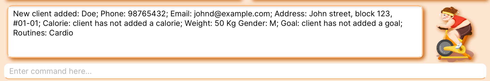

<h2>
About FitBook
</h2>

FitBook is a **desktop app for managing clients, optimized for use via a Command Line Interface** (CLI) while still having the benefits of a Graphical User Interface (GUI). If you can type fast, Fitbook can get your client management tasks done faster than traditional GUI apps.

This User Guide provides brief documentation on how you can install the application and describes how each feature should be used. Start by looking at the [quick start](#quick-start) guide to get you started.
* Table of Contents
{:toc}

--------------------------------------------------------------------------------------------------------------------

##Quick start

1. Ensure you have **Java** `11` or above installed in your Computer.

1. **Download** the latest `fitbook.jar` from [here](https://github.com/AY2223S2-CS2103T-T15-2/tp/releases).

1. **Copy** the file to the folder you want to use as the _home folder_ for your FitBook.

1. Open a command terminal, `cd` into the folder you put the jar file in, and use the `java -jar fitbook.jar` command to run the application. 
   A GUI similar to the below should appear in a few seconds. Note how the app contains some sample data. 
   

1. Type the command in the command box and press Enter to execute it. e.g. typing **`help`** and pressing Enter will open the help window. 
   Some example commands you can try:

   * `listClients` : Lists all Clients.

   * `add n/John Doe p/98765432 e/johnd@example.com a/John street, block 123, #01-01 w/50 g/M` : Adds a contact named `John Doe` to the FitBook.

   * `delete 3` : Deletes the 3rd contact shown in the current list.

   * `clear` : Deletes all contacts.

   * `export` : Exports all Client's details in FitBook into a csv file.

   * `exportRoutine` : Exports all Routine details in FitBook into a csv file.

   * `addRoutine r/Cardio ex/3x5 1km Jog ex/3x10 Jumping Jacks` : Adds a new routine named `Cardio` with 2 exercises `3x5 1km Jog` and `3x10 Jumping Jacks`.

   * `exit` : Exits the app.

1. Refer to the [Features](#features) below for details of each command.

--------------------------------------------------------------------------------------------------------------------

##Features

**:information_source: Notes about the command format:** 

* Words in `UPPER_CASE` are the parameters to be supplied by the user. 
  e.g. in `add n/NAME`, `NAME` is a parameter which can be used as `add n/John Doe`.

* Items in square brackets are optional. 
  e.g `n/NAME [t/TAG]` can be used as `n/John Doe t/friend` or as `n/John Doe`.

* Items with `…`​ after them can be used multiple times including zero times. 
  e.g. `[t/TAG]…​` can be used as ` ` (i.e. 0 times), `t/friend`, `t/friend t/family` etc.

* Parameters can be in any order. 
  e.g. if the command specifies `n/NAME p/PHONE_NUMBER`, `p/PHONE_NUMBER n/NAME` is also acceptable.

* If a parameter is expected only once in the command but you specified it multiple times, only the last occurrence of the parameter will be taken. 
  e.g. if you specify `p/12341234 p/56785678`, only `p/56785678` will be taken.

* Extraneous parameters for commands that do not take in parameters (such as `help`, `list`, `exit` and `clear`) will be ignored. 
  e.g. if the command specifies `help 123`, it will be interpreted as `help`.

* Client list can be found in the Client panel. Routine list can be found in the Routine Panel of the `Routine` tab.

###Viewing help : `help`

Shows a message explaning how to access the help page.

Format: `help`

###Adding a client: `add`

Adds a client to the FitBook.

Format: `add n/NAME p/PHONE_NUMBER e/EMAIL a/ADDRESS w/WEIGHT g/GENDER
[cal/RECOMMENDED_CALORIES_INTAKE] [g/GOAL] [r/ROUTINE]…​ [app/APPOINTMENT_TIME]…​ [t/TAG]…​`

* A client can have any number of `tags`, `appointments` and `exercise routines` (including 0).
* A user cannot add an exercise routine to client that does not exist in the exercise routine list in the `Exercise` tab.

:bulb: **Tip:** `Gender` should be either M or F (not case-sensitive). 

:bulb: **Tip:** `Routine` is case sensitive. 

Examples:
* `add n/John Doe p/98765432 e/johnd@example.com a/John street, block 123, #01-01 w/50 g/M r/Cardio`
* `add n/Betsy Crowe t/friend e/betsycrowe@example.com a/Newgate Prison p/93125841 t/John's Friend w/55 g/F`
* `add n/Betsy Crowe app/12-12-2030 cal/2300 g/F e/betsycrowe@example.com a/Newgate Prison p/93125841 t/Friend r/Cardio`

Using `add n/Doe p/98765432 e/johnd@example.com a/John street, block 123, #01-01 w/50 g/M r/Cardio` in the command input box will look like this:

###Listing all clients : `listClients`

Displays a list of all clients in the FitBook under the Client panel.

Format: `listClients`

:bulb: **Tip:** To list all clients in the client panel after using find.

* Initiate the command with 'listClients'
* All clients in FitBook has been listed once again!

###Editing a client : `edit`

Edits an existing client in the FitBook.

Format: `edit CLIENT_INDEX n/NAME p/PHONE_NUMBER e/EMAIL a/ADDRESS w/WEIGHT g/GENDER
[cal/RECOMMENDED_CALORIES_INTAKE] [g/GOAL] [r/ROUTINE]…​ [app/APPOINTMENT_TIME]…​ [t/TAG]…​`

* Edits the client at the specified `CLIENT_INDEX`. The index refers to the index number shown in the displayed client list. The index **must be a positive integer** 1, 2, 3, …​
* At least one of the optional fields must be provided.
* Existing values will be updated to the input values.
* When editing `tags`,`appointments` and `routines`, the existing `tags`,`appointments` and `routines` of the client will be removed i.e adding of `tags`,`appointments` and `routines` are not cumulative.
* You can remove all the client’s tags by typing `t/` without specifying any tags after it. (same for `appointments` with `/app` prefix and `routines` with `/r`)

:bulb: **Tip:** `Gender` should be either M or F (not case-sensitive). 

:bulb: **Tip:** `Routine` is case sensitive. 

Examples:
*  `edit 1 p/91234567 e/johndoe@example.com` Edits the phone number and email address of the 1st client to be `91234567` and `johndoe@example.com` respectively.
*  `edit 2 n/Betsy Crower t/` Edits the name of the 2nd client to be `Betsy Crower` and clears all existing tags.
*  `edit 3 w/23.0` Edits the weight of the 3rd client to `23.0`.
*  `edit 4 w/25.0 g/m` Edits the weight and gender of the 4th client to `25.0` and `m`.

Using `edit 1 p/91234567 e/johndoe@example.com` in the command input box will look like this:

###Locating clients by fields: `find`

Finds Clients in FitBook whose details contain any of the given keywords.

Format: `find [n/NAME] [p/PHONE] [e/EMAIL] [a/ADDRESS] [w/WEIGHT] [g/GENDER] [cal/CALORIE] [t/TAG]
[app/APPOINTMENT]`

:bulb: **Tip:** The search is case-insensitive. e.g `hans` will match `Hans` 

:bulb: **Tip:** Details containing the keyword will also be matched, even if both do not match exactly. e.g. `Han` will match `Hans`, `John` will match `John Li` and `John Tan`, `19` will match `1900` and `0190` 

Available Prefixes:
* `n` filters by Name
* `p` filters by Phone
* `e` filers by Email
* `a` filters by Address
* `t` filters by Tag
* `w` filters by Weight
* `g` filters by Gender
* `gl` filters by Goal
* `cal` filters by Calorie
* `app` filters by Appointment

Examples:
* `find n/Alex` returns every client with 'Alex' in their name.
* `find p/91234567` returns every client with phone numbers that match or contains '91234567'.
* `find n/Alex p/91234567` returns every client with 'Alex' in their name OR with phone numbers that match or contain
'91234567'

###Deleting a client : `delete`

Deletes the specified client from the FitBook.

Format: `delete INDEX`

* Deletes the client at the specified `INDEX`.
* The index refers to the index number shown in the displayed client list.
* The index **must be a positive integer** 1, 2, 3, …​

Examples:
* `list` followed by `delete 2` deletes the 2nd client in the FitBook.
* `find Betsy` followed by `delete 1` deletes the 1st client in the results of the `find` command.

###Clearing all entries : `clear`

Clears all entries from the FitBook.

Format: `clear`

###Export Client details : `export`

Exports the client details locally into a csv file.

Format: `export`

###Adding a routine: `addRoutine`</h3>

Adds a routine to the FitBook.

Format: `addRoutine r/ROUTINE_NAME [ex/EXERCISE]…​`

:bulb: **Tip:** A client can have any number of `Exercise` (including 0). 

Examples:
* `addRoutine r/Cardio`
* `addRoutine r/HIIT ex/3x10sets of Jumping ropes`

###Editing a routine : `editRoutine`

Edits an existing routine in the FitBook.

Format: `editRoutine ROUTINE_INDEX r/ROUTINE_NAME` or `editRoutine INDEX exno/EXERCISE_INDEX ex/EXERCISE`

* Edits the routine at the specified `ROUTINE_INDEX`. The index refers to the index number shown in the displayed routine list. The index **must be a positive integer** 1, 2, 3, …​
* At least one of the two types should be used. No mixture of the two types is not allowed.
* This command only allows the editing existing Routine's name or existing Exercise's name.

Examples:
*  `editRoutine 1 r/Cardio` Edits the routine name of the 1st routine to be `Cardio` respectively.
*  `editRoutine 2 exno/1 ex/3x10sets dumbbells` Edits the exercise of the 2nd routine to be `3x10sets dumbbells`.

###Listing all Routines in FitBook : `listRoutines`

List all Routines in FitBook under Exercise tab.

Format: `listRoutines`

* Initiate the command with 'listRoutines'
* All Routines in FitBook has been listed once again!

###Locating Routines by name: `findRoutine`

Finds Routines in FitBook whose Routine name contains any of the given keywords.

Format: `findRoutine KEYWORD`

:bulb: **Tip:** The search is case-insensitive. e.g `cardio` will match `Cardio`. 

:bulb: **Tip:** The order of the keywords does not matter. e.g. `Fun swimming` will match `Swimming fun`. 

Examples:
* `findRoutine Cardio`

###Clearing all Routine entries : `clearRoutines`

Clears all Routine entries in FitBook under the `Exercise` Tab.

Format: `clearRoutines`

###Deleting a routine : `deleteRoutine`

Deletes the specified Routine from the FitBook.

Format: `deleteRoutine ROUTINE_INDEX`

* Deletes the routine at the specified `ROUTINE_INDEX`.
* The index refers to the index number shown in the displayed Routine list in the `Exercise panel`.
* The index **must be a positive integer** 1, 2, 3, …​

Examples:
* `listRoutines` followed by `deleteRoutine 2` deletes the 2nd Routine in FitBook.
* `findRoutine Cardio` followed by `deleteRoutine 1` deletes the 1st Routine in the results of the `findRoutine` command.

###Adding an Exercise : `addExercise`

Adds an exercise to a current Routine in FitBook.

Format: `addExercise ROUTINE_INDEX ex/EXERCISE_NAME`

* Adds an exercise `EXERCISE_NAME` to the Routine in FitBook at the specified `ROUTINE_INDEX`.
* The `ROUTINE_INDEX` refers to the index number shown in the displayed Routine list in the exercise panel.
* The `ROUTINE_INDEX` **must be a positive integer** 1, 2, 3, …​

Examples:
* `listRoutines` followed by `addExercise 1 ex/push ups` adds the exercise `push ups` to the first Routine in the exercise list in FitBook.

###Deleting an Exercise : `deleteExercise`

Deletes an exercise from a Routine in FitBook.

Format: `deleteExercise ROUTINE_INDEX EXERCISE_INDEX`

* Deletes the exercise specified by the `EXERCISE_INDEX` of the Routine in FitBook specified by `ROUTINE_INDEX`.
* The `ROUTINE_INDEX` refers to the index number shown in the displayed Routine list in the exercise panel.
* The `EXERCISE_INDEX` refers to the index number shown in the displayed Routine exercise list in the exercise panel.
* Both `ROUTINE_INDEX` and `EXERCISE_INDEX` **must be a positive integer and a valid integer according to the list displayed** 1, 2, 3, …​

Examples:
* `listRoutines` followed by `deleteExercise 1 2` deletes the exercise specified at index `2` from the Routine specified at index `1` in the Routine list in FitBook.
* `findRoutine Cardio` followed `deleteExercise 1 1` deletes the exercise specified at index `1` from the Routine specified at index `1` in the results of the `findRoutineCardio` command.

###Export Routine details : `exportRoutines`

Exports the routine details locally into a csv file.

Format: `exportRoutines`

###Exiting the program : `exit`

Exits the program.

Format: `exit`

###Saving the data

FitBook data are saved in the hard disk automatically after any command that changes the data. There is no need to save manually.

###Editing the data file

FitBook data are saved as a JSON file `[JAR file location]/data/fitbook.json`. Advanced users are welcome to update data directly by editing that data file.

:exclamation: **Caution:**
If your changes to the data file makes its format invalid, FitBook will discard all data and start with an empty data file at the next run.

###Archiving data files `[coming in v2.0]`

_Details coming soon ..._
///PLACE HOLDER OUR ACTUAL FEATURE LIST////
1.	Adding new client
Add a new customer profile: addClient
Format: addClient c/CLIENT_NAME p/PHONE_NUMBER add/ADDRESS [appt/APPOINTMENT_TIME] [w/WEIGHT] [cal/TARGET_CALORIES_INTAKE][g/ GOAL] [r/Routines] [g/gender]

Example:
•	addClient c/Lisa p/95230245 cal/2000 w/50 r/1,2,3

2.	Removing a client: removeClient
Removes a client profile.
Format: removeClient c/CLIENT_NAME

Examples:
•	removeClient c/Lisa

3.	Editing client information
Edits client details (e.g. phone number)
Format: editClient c/CLIENT_NAME [p/PHONE_NUMBER] [add/ADDRESS] [appt/APPOINTMENT_TIME]
[w/WEIGHT] [cal/TARGET_CALORIES_INTAKE][g/ GOAL] [r/Routines] [g/gender]
`
Examples:
•	editClient c/Lisa p/95230245

4.	Finding client by name
Locates client
Format: findClient c/CLIENT_NAME

Examples:
•	findClient c/Lisa

5.	Listing all clients: listClients
Lists all clients added. “Change tab to clients”.
Format: listClients

6.	Listing all the routines: listRoutines
Lists all routines added. “Change tab to lists”.
Format: listRoutines

7.	Exiting the app
Exits the program.
Format: logout

8.	Creating an exercise routine: createRoutine
Creates an empty exercise routine to the list of exercise routines.
Format: createRoutine n/EXERCISE_ROUTINE_NAME

Examples:
•	createRoutine n/Slimming Exercise
•	createRoutine n/Cardio Exercise

9.	Saving exercise routines: saveExercise
Saves an exercise routine to the FitBook.
Format: saveExercise e/EXERCISE_NUMBER r/ROUTINE_NUMBER n/ROUTINE [t/DURATION_OR_REPS][s/SETS]

Examples:
•	saveExercise e/3 r/2 n/Dumbbell curls t/20 s/3
•	saveExercise e/2 r/3 n/Lateral Raises t/10 s/4
•	saveExercise e/1 r/1 n/Treadmill Sprint t/10 minutes

10.	Showing the list of exercise routines: listRoutines
Shows the list of exercise routines in the fitbook.
Format: listRoutines [f/SEARCH]

Examples:
•	listRoutines
•	listRoutines f/Cardio

11.	Tagging the exercise routine to each client: tagExercise
Tags an exercise routine to each client in the fitbook.
Format: tagExercise p/PERSON_INDEX_IN_THE_LIST e/EXERCISE_INDEX_IN_THE_EXERCISE_LIST

Examples:
•	tagExercise p/2 e/3

12.	  Filtering clients by exercises: filterExercise
Filters and shows the clients by their routine.
Format: filterExercise e/EXERCISE_NAME

Examples:
•	filterExercise e/Cardio
•	filterExercise e/Strength

Filtering the clients by gender: filterGender
Filters and shows the clients by gender.
Format: filterGender g/GENDER

13.	Marking the exercise of a client’s routine as done: markExercise
Marks the exercise of a client’s routine as done.
markExercise p/PERSON_INDEX_IN_THE_LIST r/ROUTINE_NUMBER e/EXERCISE_NUMBER

Example:
•	markExercise p/2 r/1 e/3

14.	Unmarking the exercise of a client’s routine as not done: unmarkExercise
Unmarks the exercise of a client’s routine as not done.
unmarkExercise p/PERSON_INDEX_IN_THE_LIST r/ROUTINE_NUMBER e/EXERCISE_NUMBER

Example:
•	unmarkExercise p/2 r/1 e/3

15.	Unmarking all the exercise of a client’s routine as not done:
unmarkAllExercise
Unmarks all the exercise of a client’s routine as not done.
unmarkAllExercise p/PERSON_INDEX_IN_THE_LIST r/ROUTINE_NUMBER

Example:
•	unmarkAllExercise p/1 r/3

--------------------------------------------------------------------------------------------------------------------

##FAQ

**Q**: How do I transfer my data to another Computer? 
**A**: Install the app in the other computer and overwrite the empty data file it creates with the file that contains the data of your previous FitBook home folder.

**Q**: Must I exit the FitBook app through the `exit` command? 
**A**: There is no need to exit the FitBook app through the `exit` command as everything is saved after each action changes to the list.

**Q**: Why can I not tag the exercise routine to the client? 
**A**: The exercise routine is probably not inside the list of routines or the routine name is wrong. The routine name is case-sensitive.
--------------------------------------------------------------------------------------------------------------------

##Command summary

| Action                           | Format, Examples                                                                                                                                                                                                                                                                                 |
|----------------------------------|--------------------------------------------------------------------------------------------------------------------------------------------------------------------------------------------------------------------------------------------------------------------------------------------------|
| **Add**                          | `add n/NAME p/PHONE_NUMBER e/EMAIL a/ADDRESS w/WEIGHT g/GENDER [cal/RECOMMENDED_CALORIES_INTAKE] [g/GOAL] [r/ROUTINE_NAME]…​ [app/APPOINTMENT_TIME]…​ [t/TAG]…​`   e.g., `add n/James Ho p/22224444 e/jamesho@example.com a/123, Clementi Rd, 1234665 t/friend t/colleague w/55 g/M`          |
| **Clear all entries in FitBook** | `clear`                                                                                                                                                                                                                                                                                          |
| **Delete**                       | `delete INDEX`  e.g., `delete 3`                                                                                                                                                                                                                                                              |
| **Edit**                         | `edit CLIENT_INDEX n/NAME p/PHONE_NUMBER e/EMAIL a/ADDRESS w/WEIGHT g/GENDER [cal/RECOMMENDED_CALORIES_INTAKE] [g/GOAL] [r/ROUTINE_NAME]…​ [app/APPOINTMENT_TIME]…​ [t/TAG]…​`  e.g.,`edit 2 n/James Lee e/jameslee@example.com`                                                              |
| **Find**                         | `find [n/NAME] [p/PHONE] [e/EMAIL] [a/ADDRESS] [w/WEIGHT] [g/GENDER] [cal/CALORIE] [t/TAG] [app/APPOINTMENT]`  e.g., `find James Jake p/91234567 e/jamesjake@example.com`                                                                                                                     |
| **List**                         | `listClients`                                                                                                                                                                                                                                                                                    |
| **Help**                         | `help`                                                                                                                                                                                                                                                                                           |
| **Export Client Details**        | `export`                                                                                                                                                                                                                                                                                         |
| **Add Exercise**                 | `addExercise ROUTINE INDEX ex/EXERCISE`   e.g, `addExercise 1 ex/4 x 3 sprints`                                                                                                                                                                                                               |
| **Add Routine**                  | `addRoutine r/ROUTINE_NAME [ex/EXERCISE]…​`   e/g, `addRoutine r/Cardio ex/3x5 1km Jog ex/3x10 Jumping Jacks `                                                                                                                                                                                |
| **Edit Routine** (routine name)  | `editRoutine ROUTINE_INDEX r/ROUTINE_NAME`   e/g, `editRoutine 1 r/Cardio`                                                                                                                                                                                                                    |
| **Edit Routine** (exercise)      | `editRoutine INDEX exno/EXERCISE_INDEX ex/EXERCISE`   e/g, `editRoutine 1 exno/1 ex/3x10sets of Dumbbell curls`                                                                                                                                                                               |
| **Delete Exercise**              | `deleteExercise ROUTINE INDEX EXERCISE INDEX`   e.g, `deleteExercise 1 2`                                                                                                                                                                                                                     |
| **Delete Routine**               | `deleteRoutine ROUTINE INDEX `   e.g, `deleteRoutine 1`                                                                                                                                                                                                                                       |
| **List Routine**                 | `listRoutines`                                                                                                                                                                                                                                                                                   |
| **Clear Routine**                | `clearRoutines`                                                                                                                                                                                                                                                                                  |
| **Find Routine**                 | `findRoutine ROUTINE NAME`   e.g, `findRoutine Cardio`                                                                                                                                                                                                                                        |
| **Export Routine Details**       | `exportRoutine`                                                                                                                                                                                                                                                                                  |

