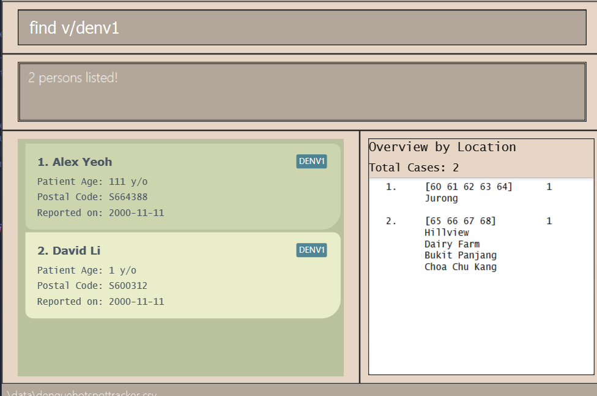

* Table of Contents
  {:toc}
  
--------------------------------------------------------------------------------------------------------------------

## Introduction

DengueHotspotTracker (DHT) is a **desktop app for managing Dengue Cases, optimized for**
**use via a Command Line Interface** (CLI) while still having the benefits of a Graphical User
Interface (GUI). If you can type fast, AB3 can get your contact management tasks done faster than traditional GUI apps.

--------------------------------------------------------------------------------------------------------------------

## Quick start

1. Ensure you have Java `11` or above installed in your Computer.

2. Download the latest `dht.jar` from [here](https://github.com/AY2223S2-CS2103-W17-2/tp/releases).

3. Copy the file to the folder you want to use as the _home folder_ for your DengueHotspotTracker.

4. Open a command terminal, `cd` into the folder you put the jar file in, and use the `java -jar dht.jar` 
command to run
the application. 
   A GUI similar to the below should appear in a few seconds. Note how the app contains some sample data. 
   

5. Type the command in the command box and press Enter to execute it. e.g. typing **`help`** and pressing Enter will
open the help window. 
   Some example commands you can try:

   * `list` : Lists all cases.

   * `add n/John Tan p/543299 d/2023 February 13 a/20` : Adds a case named `John Tan` to the Dengue Hotspot Tracker.

   * `delete 3` : Deletes the 3rd case shown in the current list.
   
   * `find n/John` : Finds all cases with name John (non-case sensitive) and shows it in a filtered list.

   * `clear` : Deletes all cases.

   * `exit` : Exits the app.

   * `undo 5` : Undo 5 previous actions.

   * `redo 5` : Redo 5 previous actions.
   
6. To learn more about DengueHotspotTracker, refer to the [Commands](#Commands) section below
for details of each command, or the [Command Summary](#Command summary).

--------------------------------------------------------------------------------------------------------------------

## Navigating the User Interface

placeholder

--------------------------------------------------------------------------------------------------------------------

## Command summary

| Action     | Format, Examples                                                                                                         |
|------------|--------------------------------------------------------------------------------------------------------------------------|
| **Add**    | `add n/NAME p/POSTAL_CODE d/DATE a/AGE [v/DENGUE_VARIANT]…​`   e.g., `add n/James Ho p/S222244 d/2000-11-11 a/123, v/DENV1` |
| **Clear**  | `clear`                                                                                                                        |
| **Delete** | `delete INDEX…​` or `delete [d/DATE]` or `delete [sd/STARTDATE] [ed/ENDDATE]`   e.g., `delete 3`, `delete d/2023-03-10`       |
| **Edit**   | `edit INDEX [n/NAME] [p/POSTAL_CODE] [d/DATE] [a/AGE] [v/DENGUE_VARIANT]…​`  e.g.,`edit 2 n/James Lee d/2001-11-11`         |
| **Find**   | `find [n/NAME] [p/POSTAL_CODE] [d/DATE] [a/AGE]`  or  `find [n/NAME] [sd/START_DATE] [ed/END_DATE]`  e.g., `find n/James Jake` |
| **List**   | `list`                                                                                                                   |
| **Sort**   | `sort [n/] [a/] [d/]`  e.g.,`sort d/`                                                                                       |
| **Import** | `import [FILENAME]`  e.g. `import sampledata.csv`                                                                     |
| **Export** | `export [FILENAME]`  e.g. `export sampledata.csv`                                                                     |
| **Help**   | `help`                                                                                                                   |
| **Undo**   | `undo [INTEGER]`                                                                                                         |
| **Redo**   | `redo [INTEGER]`                                                                                                         |

--------------------------------------------------------------------------------------------------------------------

## Features

**:information_source: Notes about the command format:** 

* Words in `UPPER_CASE` are the parameters to be supplied by the user. 
  e.g. in `add n/NAME`, `NAME` is a parameter which can be used as `add n/John Doe`.

* Items in square brackets are optional. 
  e.g `n/NAME [v/VARIANT]` can be used as `n/John Doe v/DENV1` or as `n/John Doe`.

* Multiple date formats are accepted, as long as `yyyy`, `MM`/`MMM`/`MMMM` and `dd` are present, 
  with no extra alphanumeric characters.
  e.g `d/2000-january-05`, `d/jan 2000 01`, `20000101` will all work.
  When it is ambiguous whether a sequent of digits corresponds to `MM` or `dd` or `yyyy`, 
  The first sequence of 4 digits will be read as `yyyy`, before the first sequence of 2 digits
  is read into `MM`. Then, `dd` is the last to be read in. Thus, `20000102` is read as 2nd Jan 2000.

* Items in curly brackets are features that are currently work in progress.  
  e.g `{t/TAG}` means that tagging someone has not yet been implemented, but is planned to be a feature.

* Items with `…`​ after them can be used multiple times including zero times. 
  e.g. `[v/VARIANT]…​` can be used as ` ` (i.e. 0 times), `v/DENV1`, `v/DENV1 v/DENV2` etc.

* Parameters can be in any order. 
  e.g. if the command specifies `n/NAME p/POSTAL_CODE`, `p/POSTAL_CODE n/NAME` is also acceptable.

* If a parameter is expected only once in the command but you specified it multiple times, only the last occurrence of the parameter will be taken. 
  e.g. if you specify `p/123414 p/567878`, only `p/567878` will be taken.

* Extraneous parameters for commands that do not take in parameters (such as `help`, `list`, `exit` and `clear`) will be ignored. 
  e.g. if the command specifies `help 123`, it will be interpreted as `help`.

* For postal codes, the user may choose to enter a sequence of 6 digits, or the letter `"S"` or `"s"` followed by the sequence of 6 digits. Postal codes should be valid, i.e. their first two digits should start with a valid postal sector in Singapore.

* Users may choose to enter dates in various formats, including but not limited to:
  * `yyyy-mm-dd`, e.g. `2023-03-12`
  * `yyyy/mm/dd`, e.g. `2023/03/12`
  * `dd MMM yyyy`, e.g. `12 mar 2023`

--------------------------------------------------------------------------------------------------------------------

## Valid persons
This section describes the requirements of the specified data fields.

### Person names
The first character of the name must not be a whitespace
* Names must only contain alphanumeric characters and spaces.
* Names have a maximum allowed length of 50 and cannot be blank.

### Postal codes
* Postal codes must be of the following format:
    * S123456
    * 123456
* Postal codes must have 6 digits.

### Date
* Dates should adhere to the following constraints:
  * Year:
    * 4-digit years YYYY
  * Month:
    * 2-digit months MM 
    * 3-letter months MMM
    * fully-spelled months MMMM
  * Day:
    * 2-digit days dd

### Age
* Ages should only contain numeric characters.
* Ages should be within the range of 0 and 199.
    * Valid:
        * `0`
        * `51`
        * `199`
    * Invalid:
        * `#200` (contains invalid hash symbol)
        * `200` (outside of the range of valid ages)

### Variants
* Variants must be one of following four values:
  * `DENV1`
  * `DENV2`
  * `DENV3`
  * `DENV4`

--------------------------------------------------------------------------------------------------------------------

## Commands

### Adding a case: `add`

Adds a dengue patient to the dengue hotspot tracker.

Format: `add n/PATIENT_NAME p/POSTAL_CODE d/DATE a/AGE [v/DENGUE_VARIANT]…​`

Examples:
* `add n/John Tan p/543299 d/2023-02-13 a/20 v/DENV1`
* `add n/Desiree Lim p/519999 d/2023-02-13 a/18`

### Clearing all entries: `clear`

Clears all entries from the Dengue Hotspot Tracker.

Format: `clear`

### Deleting cases: `delete`

Deletes the specified cases from the Dengue Hotspot Tracker. The cases can be specified with indexes, a date, or a date range.

Format: `delete INDEX…​` or `delete d/DATE` or `delete [sd/STARTDATE] [ed/ENDDATE]`, where at least one of the optional fields must be provided.

* Deletes cases at the specified `INDEX`es, cases from the specified `DATE`, or cases falling within the specified range from `STARTDATE` to `ENDDATE` inclusive.
* The index refers to the index number shown in the displayed case list.
* The index **must be a positive integer** 1, 2, 3, …​
* The command will fail if multiple indexes are given and at least one of them is out of range of the displayed case list.
* If a start date is given without an end date, the range will be taken to end at the latest date in the Dengue Hotspot Tracker.
* Likewise, if an end date is given without a start date, the range will be taken to start at the earliest date in the Dengue Hotspot Tracker.
* The `sd/` and `ed/` arguments can be given in any order.
* The start date must come before or be the same as the end date.
* The three variations of the delete command should not be used together, i.e. indexes should not be provided with dates, and `d/` should not co-occur with `sd/` or `ed/`.

Examples:
* `list` followed by `delete 2 3` deletes the 2nd and 3rd cases in the Dengue Hotspot Tracker.
* `find n/Betsy` followed by `delete 1` deletes the 1st case in the results of the `find` command.
* `find p/s666` followed by `delete d/2023-03-23` deletes the cases from 23rd March 2023 in the results of the `find` command.
* * `find p/243` followed by `delete sd/2023-03-20 ed/2023-03-27` deletes the cases from 20th March 2023 to 27th March 2023 inclusive in the results of the `find` command.

### Editing a case: `edit`

Edits an existing case in the Dengue Hotspot Tracker.

Format: `edit INDEX [n/NAME] [p/POSTAL] [d/DATE] [a/AGE] [v/DENGUE_VARIANT]…​`

* Edits the case at the specified `INDEX`. The index refers to the index number shown in the displayed case list.
* The index **must be a positive integer** 1, 2, 3, …​
* At least one of the optional fields must be provided.
* Existing values will be updated to the input values.
* When editing dengue variants, all existing variants of the case will be removed i.e adding of variants is not cumulative.
* You can remove all the case’s dengue variants by typing `v/` without
    specifying any variants after it.

Examples:
* `edit 1 p/912345 d/2001-01-01` Edits the postal code and date of the 1st case to be `S912345` and `2001-01-01`
respectively.
* `edit 2 n/Betsy Crower v/` Edits the name of the 2nd case to be `Betsy Crower` and clears all tagged dengue variants.

### Finding cases by prefixes: `find` 

Find cases which matches the given prefixes. Date ranges and age ranges are also supported using new prefixes
`sd/` `ed/` `sa/` `ea/`.

Format: `find [n/NAME] [p/POSTAL_CODE] [d/DATE] [a/AGE] [v/DENGUE_VARIANT]…​`  or  `
find [n/NAME] [sd/START_DATE] [ed/END_DATE] [v/DENGUE_VARIANT]…​`

* The search is case-insensitive for all tags.
  * e.g. `n/hans` will match `Hans` or `hAns`
* Prefixes for date `sd/` `ed/` and age ranges `sa/` `ea/` cannot be used in conjunction with the specific 
date `d/` or age `a/` prefixes respectively
  * e.g. `find n/Alex d/2011-11-10 sd/2005-10-10` will throw an error 
* For names, partial words will be matched 
  * e.g. `n/Han` will match `Hans` and `Abrahan`
* For postal codes, the beginning of the postal code will be matched 
  * e.g. `p/10` will match `S101234` but not `S123410`
* For postal codes, the user may choose to include an `"S"` or `"s"` character or not
  * e.g. `p/S10` will match `S101234`
  * e.g. `p/s10` will also match `S101234`
* Persons matching all given prefixes will be returned.
  * e.g. `find n/Alex p/s101` will match only those cases with both name `alex` and of postal code that begins with `s101`
* For variants, the user may choose to include multiple variant `v/` prefixes.
  * e.g. `find v/DENV1 v/DENV2` is a valid command 
* Only those which have the caught the multiple variants of dengue will be filtered by find 
  * e.g. `find v/DENV1 v/DENV2` will only return all cases of people who have caught both DENV1 and DENV2 before.
* Date ranges and age ranges will function even if only one of the two prefixes are specified.
  * e.g `find sd/2010-11-10` is a valid command and will show all cases that happened after and on 2010-11-10.
  * e.g `find ed/2011-10-10` is a valid command and will show all cases that happened before and on 2011-10-10.
  * e.g `find sa/10` is a valid command and will show all cases of people who are older and of the same age as 10.
  * e.g `find ea/50` is a valid command and will show all cases of people who are younger and of the same age as 50.
* Only valid names, dates, ages, variant names are allowed
  * e.g `find n/#erwin` will fail since names do not allow for special characters
  * e.g `find d/2000/13/10` will fail since 13 is not a valid month.
  * e.g `find a/200` will fail since this application only accepts ages 0 - 199.
  * e.g `find v/denver` will fail since `denver` is not a valid dengue variant name.
* Only valid date and age ranges are allowed.
  * e.g `find sa/50 ea/12` will fail since the end age is earlier than the start age.
  * e.g `find sd/2000/10/10 ed/1999/10/10` will fail since the end date is earlier than the start date.

Examples:
* `find v/denv1` finds all cases with `DENV1` in their variant tags.
  

### Listing all cases: `list`

Shows a list of all cases in the Dengue Hotspot Tracker.

Format: `list`

### Sorting cases: `sort`

Sorts the entire case list based on the specified criteria.

Format: `sort [n/] [a/] [d/]`

* Sorts cases based on the specified criteria.
* One and only one of the criteria must be specified; `n/` for name, `a/` for age, and `d/` for date.

### Importing data from CSV file : `import`

Use this command to import persons from a CSV file. Imported items will be added to the front of the list.

Format: `import [FILENAME]`

* The dengue case list imported must be valid. Some criteria are as follows:
    * No duplicates
    * All fields [valid](#valid-denguehotspottracker)
    * No missing fields
* The CSV must begin with a header that includes the names of each column.

:exclamation: **Caution:**

As DengueHotspotTracker does not allow persons with duplicate **names, postal code and date**, 
please ensure that the persons you are importing do not conflict with existing data within DengueHotspotTracker. 
This applies to **all** persons, not just those currently displayed.

:bulb: **Tip:**

If you are using Microsoft Excel, you can easily export your data to a CSV file and import it into DengueHotspotTracker!

See [below](#exporting-data-to-csv-file--export) for example CSV files.

### Exporting data to CSV file : `export`

Use this command to export currently displayed cases to a CSV file.

Format: `export [FILENAME]`

Example CSV output of  `export sampledata.csv`
<pre><code style="white-space: pre-wrap;">""Patient Name","Age","Date","Postal Code","Variants"
"Alex Yeoh","111","2000-11-11","S664388","[DENV1]"
"Bernice Yu","11","2000-11-11","S112727","[DENV4, DENV2]"
"Charlotte Oliveiro","0","2000-11-11","S602283","[DENV3]"
"David Li","1","2000-11-11","S600312","[DENV1]"
"Irfan Ibrahim","199","2000-11-11","S654921","[DENV2]"
"Roy Balakrishnan","2","2000-11-11","S666247","[DENV4]"
</code></pre>

:bulb: **Tip:**
Try copying these to a .csv file. Then import them as sample inputs!

### Viewing help: `help`

Shows a message explaining how to access the help page.

Format: `help`

### Undo/Redo an action : `undo` or `redo`

Undo/redo an action that resulted in the change of the Dengue Hotspot Tracker data.

Format: `undo [INTEGER]` or `redo [INTEGER]` for `undo` and `redo` respectively.

* Undo/redo an action multiple times, specified by the number `INTEGER`. If not specified, `INTEGER` is assumed to be 1.
* `INTEGER` must be a strictly positive integer.
* The user cannot undo/redo actions from a previous session of starting the app.
* The user cannot undo actions that are more than 10 iterations old.
* The user cannot undo actions that do not change the data of the Dengue Hotspot Tracker, such as list and find.
* Performing a change after undo-ing will clear any possible `redo` actions.

Examples:
* `list` followed by `clear' 
s all cases from the Dengue Hotspot Tracker.
* `find n/Betsy` followed by `clear` deletes all cases in the results of the `find` command.

### Exiting the program: `exit`

Exits the program.

Format: `exit`

### Saving the data

DengueHotspotTracker data are saved in the hard disk automatically after any command that changes
the data. There is no need to save manually.

### Editing the data file

DengueHotspotTracker data are saved as a CSV file `[JAR file location]/data/denguehotspottracker.csv`. Advanced users
are welcome to update data directly by editing that data file.

:exclamation: **Caution:**
If your changes to the data file makes its format invalid, DengueHotspotTracker will discard all data and start with an
empty data file at the next run.

### Archiving data files `[coming in v2.0]`

_Details coming soon ..._

--------------------------------------------------------------------------------------------------------------------

## FAQ

**Q**: How do I transfer my data to another Computer? 
**A**: Install the app in the other computer and overwrite the empty data file it creates with the file that contains
the data of your previous DengueHotspotTracker home folder.
