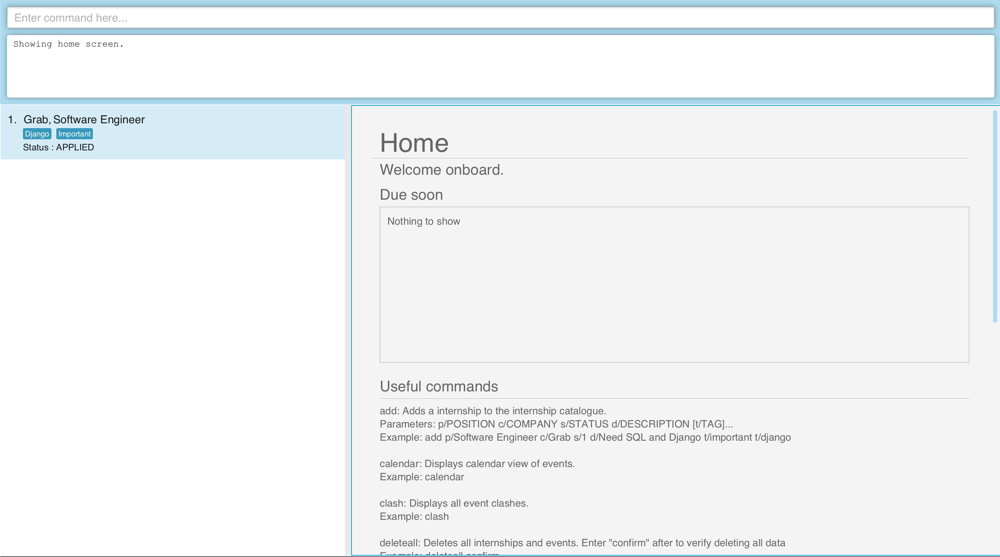
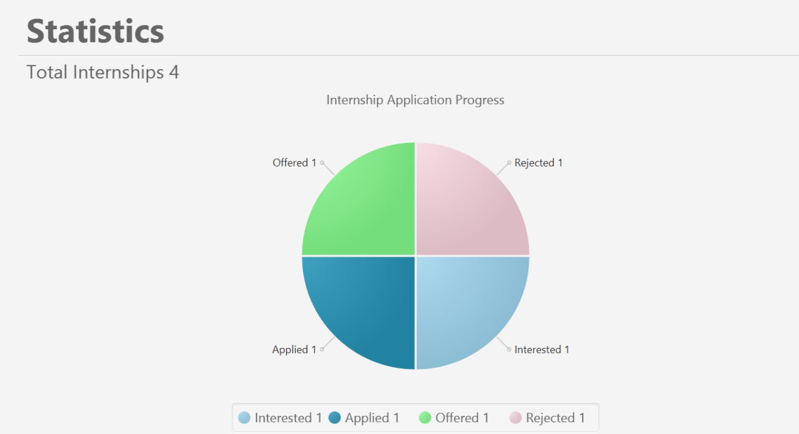
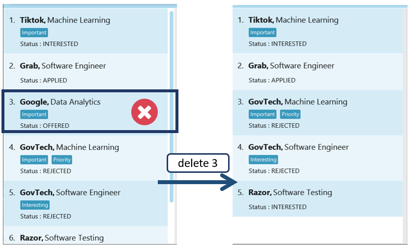

  <h1 id="intro"> 
      The Intern's Ship - User Guide</h1>

Whether it is to fulfil a graduation requirement or simply to gain real world working experience, taking up an 
internship during one's course of study has become a popular option amongst many university students. Studies have
found that the completion of an internship increases one's chance of employment after graduation by a whopping 85%. 

To increase one's chances of successfully securing an internship, it is recommended that one sources out at least 50
potential employers and submit a minimum of 20 internships applications. Being required to keep track of the
application deadlines of multiple internships or finding ways to schedule interview timing so that they do not
clash can be a confusing and time-consuming process. 

Designed with internship-seeking <b>university students</b> in mind, <b>The Intern’s Ship (TinS)</b> aims to make
managing your internship applications fuss-free. Optimized for use via a Command Line Interface (CLI), while still having
the benefits of a Graphical User Interface (GUI), this <b>desktop app</b> is perfect for fast typers. With a
simple command, TinS can help you manage, coordinate and keep track of your internship applications conveniently and
neatly. 

<h3>Notable Features (v1.3)</h3>
  * Finding a particular internship application in TinS using keywords: `find`
  * Finding all clashing events: `clash`

<h2>Table of Contents</h2>

1. [About TinS Application's Interface](#about_gui)
2. [Quick Start](#quick_start)
3. [Features](#features)

   1. Opening Home Page: [`home`](#home_function)
   2. Opening Statistics Page: [`stats`](#stats_function)
   3. Opening Calendar Page: [`calendar`](#calendar_function)
   4. Adding an Internship Application: [`add`](#add_function)
   5. Listing all Internship Applications in TinS: [`list`](#list_function)
   6. Finding a Particular Internship Application in TinS: [`find`](#find_function)
   7. Editing Details of an Internship Application: [`edit`](#edit_function)
   8. Viewing Details of a Particular Internship Application: [`select`](#select_function)
   9. Deleting an Internship Application: [`delete`](#delete_function)
   10. Adding an Event to an Internship Application: [`event add`](#eventadd_function)
   11. Deleting an Event from an Internship Application: [`event delete`](#eventdelete_function)
   12. Finding a Particular Event: [`event find`](#eventfind_function)
   13. Finding all Clashing Events: [`clash`](#clash_function)
   14. Clearing all Internship Applications in TinS: [`clear`](#clear_function)
   15. Getting help: [`help`](#help_function)
   16. Exiting the program: [`exit`](#exit_function)
   17. [Saving data in TinS](#save_function)

4. [Command Summary](#command_summary)

<h2 id="about_gui">About TinS Application's Interface</h2>

1. **Command Line**: This is where you would input your commands.
2. **Program Response**: This box displays the program's feedback to your inputted commands. 
   Types of Program Response Messages:
   * Success Message: indicating that TinS has successfully executed your command
   * Error Message: indicating the reason why TinS was not about to execute your command and tips on what you can do to
   correct the error
3. **Internship List Panel**: This panel displays your internships listings stored in TinS (including Position,
   Company, Status and Tags).
4. **Internship Display Panel**: This panel displays relevant details pertaining to specific internship.

<h2 id="quick_start">Quick Start</h2>

1. Ensure you have Java `11` or above installed in your Computer.

2. Download the latest `tins.jar` from [here](https://github.com/AY2223S2-CS2103T-W11-2/tp/releases/tag/v1.3(trial)).

3. Copy the file to the folder you want to use as the _home folder_ for your TinS.

4. Open a command terminal, `cd` into the folder you put the jar file in, and use the `java -jar tins.jar` command to 
   run the application. 
   A TinS Application Interface similar to the one below should appear in a few seconds.

   > Note: The default TinS application contains some sample data. To remove all sample data, use the
   > [`clear`](#clear_function) feature.

    

5. Refer to the [Command Summary](#command_summary) below for your desired TinS Commands. More details on each specific
TinS command can be found [here](#features).

7. Type your command in the [command line](#about_gui) and press the `Enter` key for TinS to execute it.

<h2 id="features">Features (v1.3)</h2>

**Notes about the command format:**

* Words in `UPPER_CASE` are the parameters to be supplied by the user. 
  e.g. in `add p/POSITION c/COMPANY_NAME s/APPLICATION_STATUS d/DESCRIPTION`, `POSITION` is a parameter which can be
  used as `add p/Software Engineer c/Grab s/1 d/Requires knowledge of Python and Java`.

* Items in square brackets are optional. 
  e.g `[TAG]` means that the user input is optional.

<h3>Feature List</h3>

1. Opening Home Page: [`home`](#home_function)
2. Opening Statistics Page: [`stats`](#stats_function)
3. Opening Calendar Page: [`calendar`](#calendar_function)
4. Adding an Internship Application: [`add`](#add_function)
5. Listing all Internship Applications in TinS: [`list`](#list_function)
6. Finding a Particular Internship Application in TinS: [`find`](#find_function)
7. Editing Details of an Internship Application: [`edit`](#edit_function)
8. Viewing Details of a Particular Internship Application: [`select`](#select_function)
9. Deleting an Internship Application: [`delete`](#delete_function)
10. Adding an Event to an Internship Application: [`event add`](#eventadd_function)
11. Deleting an Event from an Internship Application: [`event delete`](#eventdelete_function)
12. Finding a Particular Event: [`event find`](#eventfind_function)
13. Finding all Clashing Events: [`clash`](#clash_function)
14. Clearing all Internship Applications in TinS: [`clear`](#clear_function)
15. Getting help: [`help`](#help_function)
16. Exiting the program: [`exit`](#exit_function)
17. [Saving data in TinS](#save_function)

<h3 id="home_function"> Opens the Home Page : `home`</h3>

Returns user to the home page. 

> Note: Command can also be used to refresh home page.

* After keying in the `home` command, TinS displays the home page.
* Home page shows the today's events and useful commands.

Example: `home`

<h3 id="stats_function"> Opens the Statistics Page : `stats`</h3>

Displays the user's statistics.

> Note: Command can also be used to refresh stats page.

* After keying in the `stats` command, TinS displays users statistics on the stats page.
* Summary shows pie chart of current internships' statuses.

Example: `stats`

<h3 id="calendar_function"> Opens the Calendar Page : `calendar`</h3>

Displays the user's events on a Calendar.

> Note: Command can also be used to refresh calendar page.

* After keying in the `calendar` command, TinS displays user's events on the calendar page.

Example: `calendar`

<h3 id="add_function">Adding an Internship Application : `add`</h3>

Adds an internship and its details to TinS.

Format: `add p/POSITION c/COMPANY_NAME s/APPLICATION_STATUS d/DESCRIPTION [t/TAG] ...`

* `POSITION`: Name of Internship Position
* `COMPANY_NAME` : Name of Hiring Company

> Note: `POSITION` and `COMPANY_NAME` have to be unique.  
> If there is an Internship with `POSITION` as `Software Engineer` and `COMPANY_NAME` as `Grab` already saved in TinS:
> * Adding an Internship with `POSITION` as `Software Engineer` and `COMPANY_NAME` as `Grab` is not valid
> * Adding an Internship with `POSITION` as `Software Engineer 1` and `COMPANY_NAME` as `Grab` is valid
> * Adding an Internship with `POSITION` as `Software Engineer` and `COMPANY_NAME` as `Grab 1` is valid

* `APPLICATION_STATUS` : Status of Application
    * `APPLICATION_STATUS` should be an Integer value from 0 to 3. Here are the statuses for the corresponding integer
      values:
        * `0` : Interested
        * `1` : Applied
        * `2` : Offered
        * `3` : Rejected
* `DESCRIPTION` : Additional details about the Internship (E.g. Contact Details, Link to Webpage, Requirements of
  Internship)
* `TAG` : Customised Tag
    * This is optional.
    * An Internship can have more than one tag.
    * Example of commonly used Tags: `Important`, `Priority`

Example: `add p/Software Engineer c/Grab s/1 d/Requires knowledge of Python and Java t/Important t/Priority`

<h3 id="list_function">Listing all Internships Applications : `list`</h3>

List all the internships in Internship List panel of TinS.

* After keying in the `list` command, TinS displays **all** the Internships stored in TinS in the Internship List panel.
* Only the `POSITION`, `COMPANY_NAME`, `APPLICATION_STATUS` and `TAG` are display in the
[Internship List Panel](#about_gui) for each Internship.

Example: `list` 

<h3 id="find_function">Finding Internships: `find`</h3>

Finds an Internships by their fields (`POSITION`, `COMPANY_NAME`, `APPLICATION_STATUS`, `TAGS`).
Format: `find p/[POSITION] c/[COMPANY_NAME] s/[APPLICATION_STATUS] t/[TAG] t/[TAG]`

* Choose the fields you would like to filter the Internship Catalogue by. One or more fields can be used to filter
  the Internship Catalogue.
* For each chosen field, enter a keyword you would like to find corresponding Internship Applications for.
* After keying in the `find` command, TinS will filter the internship catalogue based on your chosen fields and
  provided keywords.
* To view all Internship Applications in TinS again, simply enter the `list` command.

Example: Default TinS has 6 internship listings. `find c/GovTech` would return the list of internships with company name
GovTech.

<h3 id="select_function">Viewing Details of a Particular Internship Application : `select`</h3>

View details of the internship application selected by ID.

Format: `select ID`

* `ID`: The number of the selected internship in the [Internship List Panel](#about_GUI)
* After keying in the `select` command, TinS will return the all details of the selected internship in the 
  [Internship Display Panel](#about_GUI).

Example: `select 2`

<h3 id="edit_function">Editing Details of Internship Application : `edit`</h3>

Edit details of the internship application selected by ID.

Format: `edit ID p/[POSITION] c/[COMPANY_NAME] s/[APPLICATION_STATUS] d/[DESCRIPTION] t/[TAG] ...`

* `ID`: Identification number of the Internship.
* `[POSITION]`: Name of Internship Position (optional).
* `[COMPANY_NAME]` : Name of hiring company (optional).
* `[APPLICATION_STATUS]` : Status of Application (`ACCEPTED`, `APPLIED`, `PENDING`, `REJECTED`) (optional).
* `[DESCRIPTION]`: Additional details of the internship application (optional).
* `[TAG]`: Labels for the internship application (optional).
* After keying in the `edit` command, along with the selected fields the user wishes to edit, TinS will update the
  corresponding fields of the internship application accordingly.

Example:  
After keying in the `edit` command followed by an existing `ID` and the fields `APPLICATION_STATUS` and `DESCRIPTION`, 
TinS will update the `APPLICATION_STATUS` and `DESCRIPTION` fields of the internship application with the specified 
`ID`, then display the newly updated internship application. This command `edit 1 s/1 d/Learn C++` will return the
following results.

<h3 id="delete_function">Deleting an Internship Application : `delete`</h3>

Deletes an internship along with its details by its ID.

Format: `delete ID`
* Deletes the person at the specified `ID` in the [Internship List Panel](#about_GUI).

Example: `delete 3` deletes the 3rd internship listed in the [Internship List Panel](#about_GUI). In this example, the
internship application with `POSITION` as Data Analytics and `COMPANY_NAME` as Google is removed.

<h3 id="eventadd_function">Adding an Event to an Internship Application : `event add`</h3>

Adds an Event along with its details to the selected internship.

> Note: Before adding an event, you have to select an internship using [`select ID`](#select_function).

Format: `event add na/EVENT_NAME st/[START_DATETIME] en/END_DATETIME de/DESCRIPTION`

* `EVENT_NAME`: Name of the Event
* `START_DATETIME`: Starting time of an event (optional) (in the format: DD/MM/YYYY HHMM)
* `END_DATETIME`: Ending time of an event (in the format: DD/MM/YYYY HHMM)
* `DESCRIPTION`: Description of the Event (e.g. Venue, Things to take note of)

Examples:
1. If you would like to add an Internship Application Submission Deadline:
  `event add na/Application Submission Deadline en/14/04/2023 2359 de/Via Talent Connect`
2. If you would like to add an Interview:
  `event add na/Technical Interview st/10/05/2023 1500 en/10/05/2023 1700 de/On Zoom`

<h3 id="eventdelete_function">Deleting an Event from an Internship Application : `event delete`</h3>

Deletes selected Event along with its details from the selected internship.

> Note: Before deleting an event, you have to select an internship using `select ID`

Format: `event delete ID`
* `ID`: The ID of the selected event in the list

Examples: `event delete 1` entered after `select 1` deletes the first event in the first internship.

<h3 id="eventfind_function">Finding a particular Event : `find event`</h3>

Finds events based on certain filters.

Format: `event add na/[EVENT_NAME] st/[START_DATETIME] en/[END_DATETIME]`

Example: `event add na/Technical Interview st/20/03/2023 1400` returns a list of events with the name Technical
Interview and starting time 20 March 2023, 2pm.

<h3 id="clash_function">Finding all Clashing Events : `clash`</h3>

Displays all events with clashing timings in the [Internship Display Panel](#about_gui).

Format: `clash`

Example:

<h3 id="clear_function">Clearing all Internship Applications in TinS : `clear`</h3>

Deletes all existing Internship Applications in TinS.

> Caution: This command is irreversible. Only use it when you would like to clear <b>all</b> internship applications in
> your Internship Catalogue.

Format: `clear`

<h3 id="help_function">Getting Help : `help`</h3>

Provides you with the link to [The Intern's Ship - User Guide](#intro).

Format: `help`

<h3 id="exit_function">Exiting the program : `exit`</h3>

Exits and closes the TinS application.

Format: `exit`

<h3 id="save_function">Saving the data</h3>

The Intern Ship’s data is saved in the hard disk automatically after any command that changes the data.
There is no need to save manually.

--------------------------------------------------------------------------------------------------------------------

<h2 id="command_summary">Command summary</h2>

<table>

<tr>
<th>Action</th>
<th>Format</th>
</tr>

<tr>
<td><b><a href="#add_function">Add</a></b></td>
<td><code>add p/POSITION c/COMPANY_NAME s/APPLICATION_STATUS d/DESCRIPTION [t/TAG] ...</code> 
E.g. <code>add p/Software Engineer c/Grab s/1 d/Requires knowledge of Python t/Important t/Priority</code></td>
</tr>

<tr>
<td><b><a href="#list_function">List</a></b></td>
<td><code>list</code></td>
</tr>

<tr>
<td><b><a href="#edit_function">Edit</a></b></td>
<td><code>edit ID [p/POSITION] [c/COMPANY_NAME] [s/APPLICATION_STATUS] [d/DESCRIPTION] [t/TAG] ...</code> 
E.g. <code>edit 1 p/Data Analyst</code> edits the <code>POSITION</code> of first internship in the Internship List panel
to Data Analyst</td>
</tr>

<tr>
<td><b><a href="#delete_function">Delete</a></b></td>
<td><code>delete ID</code> 
E.g. <code>delete 1</code> deletes the first internship in the Internship List panel</td>
</tr>

<tr>
<td><b><a href="select_function">Select</a></b></td>
<td><code>select ID</code> 
E.g. <code>select 1</code> selects the first internship in the Internship List panel</td>
</tr>

<tr>
<td><b><a href="#eventadd_function">Add Event</a></b></td>
<td><code>event add na/EVENT_NAME st/[START_DATETIME] en/END_DATETIME de/DESCRIPTION</code> 
E.g. <code>event add na/Technical Interview st/10/09/2023 1500 en/10/09/2023 1700 de/On Zoom</code></td>
</tr>

<tr>
<td><b><a href="#eventdelete_function">Delete Event</a></b></td>
<td><code>event delete ID</code> 
E.g. <code>event delete 1</code></td>
</tr>

<tr>
<td><b><a href="#clash_function">Clash</a></b></td>
<td><code>clash</code></td>
</tr>

<tr>
<td><b><a href="#clear_function">Clear</a></b></td>
<td><code>clear</code></td>
</tr>

<tr>
<td><b><a href="#help_function">Help</a></b></td>
<td><code>help</code></td>
</tr>

<tr>
<td><b><a href="#exit_function">Exit</a></b></td>
<td><code>exit</code></td>
</tr>

</table>
