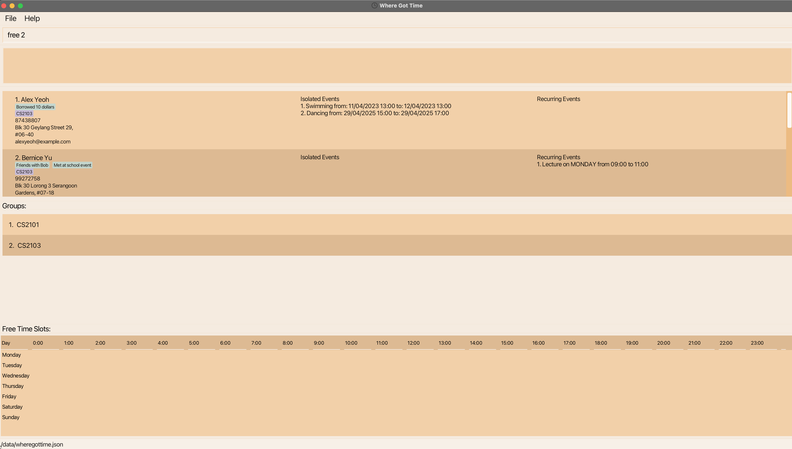
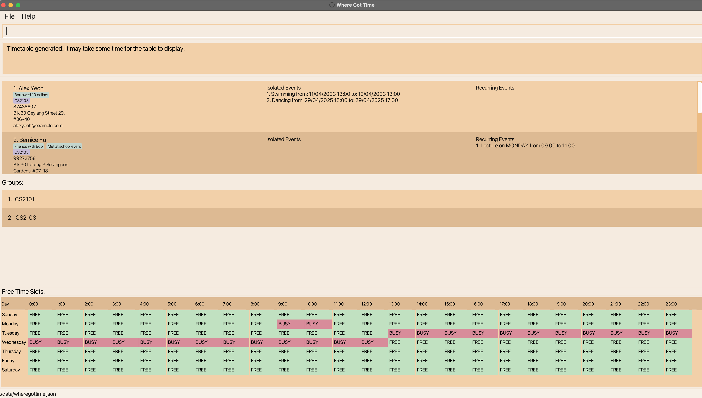

Where Got Time (WGT) **a perfect desktop app** dedicate to managing your events and plan out your meetings with your friends and family. It is developed for university student, who can type fast to efficiently keep track of all of their events and their friends' events **via a Command Line Interface (CLI)** while still having the benefits of a Graphical User Interface (GUI). If you can type fast, WGT can help you find a date that all your friends are free to meet instead of having to manually compare timetables with each other.

* Table of Contents
{:toc}

--------------------------------------------------------------------------------------------------------------------

## Quick start

1. Ensure you have Java `11` or above installed in your Computer.

1. Download the latest `wheregottime.jar` from [here](https://github.com/AY2223S2-CS2103T-T09-2/tp/releases).

1. Copy the file to an **empty** folder that you want to use as the _home folder_ for your WhereGotTime. (e.g.: A new folder in your `Desktop`)

1. Open a command terminal, `cd` into the folder you put the jar file in, and use the `java -jar wheregottime.jar` command to run the application. 
   A GUI similar to the below should appear in a few seconds. Note how the app contains some sample data. 
   

1. Type the command in the command box and press Enter to execute it. e.g. typing **`help`** and pressing Enter will open the help window. 
   Some example commands you can try:

    * `list` : Lists all contacts.

    * `add n/John Doe p/98765432 e/johnd@example.com a/John street, block 123, #01-01` : Adds a contact named `John Doe` to the Address Book.

    * `delete 3` : Deletes the 3rd contact shown in the current list.

    * `clear` : Deletes all contacts.

    * `exit` : Exits the app.

1. Refer to the [Features](#features) below for details of each command.

--------------------------------------------------------------------------------------------------------------------

## Features

**WARNING: Directly editing the saved json file which cause the app to malfunction**

**:information_source: Notes about the command format:** 

* Words in `UPPER_CASE` are the parameters to be supplied by the user. 
  e.g. in `add n/NAME`, `NAME` is a parameter which can be used as `add n/John Doe`.

* Items in square brackets are optional. 
  e.g `n/NAME [t/TAG]` can be used as `n/John Doe t/friend` or as `n/John Doe`.

* Items with `…`​ after them can be used multiple times (Even not at all). 
  e.g. `[t/TAG]…​` can be used as ` ` (i.e. 0 times), `t/friend`, `t/friend t/family` etc.

* Parameters can be in any order. 
  e.g. if the command specifies `n/NAME p/PHONE_NUMBER`, `p/PHONE_NUMBER n/NAME` is also acceptable.

* If a parameter is specified multiple times when it is only expected once, only the last occurrence of the parameter will be taken. 
  e.g. if you specify `p/12341234 p/56785678`, only `p/56785678` will be taken.

* Extraneous parameters for commands that do not take in parameters (such as `help`, `list`, `exit` and `clear`) will be ignored. 
  e.g. if the command specifies `help 123`, it will be interpreted as `help`.

* For commands that require index, the index is based on the current person/group list shown.

## General commands
### Viewing help : `help`

Shows a message explaning how to access the help page.

Format: `help`

### Clearing all entries : `clear`

Clears all entries from the address book.

Format: `clear`

### Exiting the program : `exit`

Exits the program.

Format: `exit`

## Person-related commands
### Adding a person: `add`

Adds a person to the address book.

Format: `add n/NAME p/PHONE_NUMBER e/EMAIL a/ADDRESS [t/TAG] [g/GROUP]…​`

* A person can only be added to an **existing** group
* Tags can only contain alphanumeric and spaces

:bulb: **Tip:**
A person can have any number of tags and groups (including 0)

Examples:
* `add n/John Doe p/98765432 e/johnd@example.com a/John street, block 123, #01-01`
* `add n/Betsy Crowe t/friend e/betsycrowe@example.com a/Newgate Prison p/1234567 t/criminal`

### Listing all persons : `list`

Shows a list of all persons in the address book.

Format: `list`

### Editing a person : `edit`

Edits an existing person in the address book.

Format: `edit INDEX [m/] [n/NAME] [p/PHONE] [e/EMAIL] [a/ADDRESS] [t/TAG] [g/GROUP]…​`

* Edits the person at the specified `INDEX`. The index refers to the index number shown in the displayed person list. The index **must be a positive integer** 1, 2, 3, …​
* At least one of the optional fields must be provided.
* Existing values will be updated to the input values.
* When editing tags/groups, the existing tags/groups of the person will be removed i.e adding of tags/groups is not cumulative.
* To add on to existing groups/tags without overwriting it, include the prefix `m/` (merge).
* When using prefix `m/`, groups/tags added cannot be empty.
* Groups can only be added if it has been created.
* You can remove all the person’s tags/groups by typing `t/` and `g/` respectively without
  specifying any tags/groups after it.
* Adding duplicate groups/tags to a `Person` would not result in multiple groups/tags created.

Examples:
*  `edit 1 p/91234567 e/johndoe@example.com` Edits the phone number and email address of the 1st person to be `91234567` and `johndoe@example.com` respectively.
*  `edit 2 n/Betsy Crower t/ g/` Edits the name of the 2nd person to be `Betsy Crower` and clears all existing tags and groups.
*  `edit 3 m/ t/Borrowed 10 dollars` Edit the tags of the 3rd person to be `Borrowed 10 dollars` plus the existing tag of that person.
*  `edit 3 m/ g/CS2103T` Edit the groups of the 3rd person to be `CS2103T` plus the existing groups of that person.

### Locating persons by name: `find`

Finds persons whose names contain any of the given keywords.

Format: `find KEYWORD [MORE_KEYWORDS]`

* The search is case-insensitive. e.g `hans` will match `Hans`
* The order of the keywords does not matter. e.g. `Hans Bo` will match `Bo Hans`
* Only the name is searched.
* Only full words will be matched e.g. `Han` will not match `Hans`
* Persons matching at least one keyword will be returned (i.e. `OR` search).
  e.g. `Hans Bo` will return `Hans Gruber`, `Bo Yang`

Examples:
* `find John` returns `john` and `John Doe`
* `find alex david` returns `Alex Yeoh`, `David Li` 
  

### Deleting a person : `delete`

Deletes the specified person from the address book.

Format: `delete INDEX`

* Deletes the person at the specified `INDEX`.
* The index refers to the index number shown in the displayed person list.
* The index **must be a positive integer** 1, 2, 3, …​

Examples:
* `list` followed by `delete 2` deletes the 2nd person in the address book.
* `find Betsy` followed by `delete 1` deletes the 1st person in the results of the `find` command.

## Group-related commands
### Creating a group : `group_create`

Create a group in the address book.

Format: `group_create g/GROUP_NAME`

* Creates a group with the specified group name `GROUP_NAME`.
* The group name cannot be empty and must be alphanumeric!
* **NOTE: The group name cannot contain spaces**
* The group name cannot be empty
* Only one group can be created
* If more than one group is specified, only the last occurrence of a group will be taken

Examples:
* `group_create g/CS2103T`
* `group_create g/CS2101`

### Deleting a group : `group_delete`

Deletes an existing group from the address book.

Format: `group_delete GROUP_INDEX`

* Deletes a group with the specified `GROUP_INDEX`
* The group index cannot be empty and must be an existing group
* Deleting a group will remove all persons in that group

Examples:
* `group_delete 1`
* `group_delete 2`

### List all groups: `group_list`

Shows a list of all existing groups' name in the address book.

Format: `group_list`

### Find a group: `group_find`

Finds persons in groups whose group names contain any of the given keywords.

Format: `group_find KEYWORD [MORE_KEYWORDS]`

* The search is case-insensitive. e.g `CS2103` will match `cs2103`
* The order of the keywords does not matter. e.g. `CS2103 CS2101` will match `CS2101 CS2103`
* Only the group name is searched.
* Only full words will be matched e.g. `CS2103` will not match `CS2103T`
* Persons with groups matching at least one keyword will be returned (i.e. `OR` search).
  e.g. `CS2103 CS2101` will return persons in `CS2101`, `CS2103`
* The group name cannot be empty

Examples:
* `group_find CS2103` returns persons in the group `CS2103`
* `group_find CS2103 CS2101` returns persons in the group `CS2103` and `CS2101`

## Event-related commands

### Creating an event:
Create events and add it to a specific person in WGT. WGT supports two types of event:
1. isolated event: one off event 
2. recurring event: weekly events such as tutorials and lectures 

Note that only **hourly** events can be created.
For example, `17:00` is a valid timing and `17:30` is an invalid timing

#### 1) Isolated event: `event_create`
Format: `event_create INDEX ie/EVENT_NAME f/START_DATE t/END_DATE`

* `INDEX` refers to the index of the person to add the given isolated event
* Creates an event with the specified name `EVENT_NAME` using the flag `ie/` which stands for Isolated event
* The flags `f/` represent the word __from__ and `t/` represents the word __to__
* `EVENT_NAME`, `START_DATE` and `END_DATE` cannot be left empty
* If there are duplicate attributes (i.e. `event_create INDEX ie/test ie/test2 f/START_DATE t/END_DATE`), WGT will take the 
info following the latest attribute (in the example case, WGT will take event name to be test 2). 

* The format of both `START_DATE` and `END_DATE` would be in `dd/MM/yyyy HH:mm`
* `START_DATE` has to be before the `END_DATE`
* `START_DATE` and `END_DATE` has to be after the current date time

Examples:
* `event_create 1 ie/CS2101 Presentation f/02/02/2025 16:00 t/28/02/2025 18:00`

#### 2) Weekly Recurring Event `event_create_recur`
Format: `event_create_recur INDEX re/EVENT_NAME d/DAY_OF_WEEK f/START_TIME t/END_TIME`

* `INDEX` refers to the index of the person whose recurring event list will be added with the given recurring event
* Creates a recurring event with the specified name `EVENT_NAME` using the flag `re` which stands for Recurring event
* The flag `d/` represents the day of the week
* The remaining flags `f/` represent the word __from__ and `t/` represents the word __to__
* The format `DAY_OF_WEEK` accepts the input `Monday, Tuesday, Wednesday, Thursday, Friday, Saturday and Sunday`
* The format of `START_TIME` and `END_TIME` would be in `HH:mm`
* `EVENT_NAME`, `DAY_OF_WEEK`, `START_TIME` and `END_TIME` cannot be left empty

Examples:
* `event_create_recur 1 re/CS2103T Weekly Meeting d/Monday f/12:00 t/14:00`

### Deleting an event:
Delete either an isolated or a weekly recurring event
#### 1) Delete an isolated event: `ie_delete`

Deletes an existing isolated event from a person's isolated event list in WGT.

Format: `ie_delete INDEX_OF_PERSON INDEX_OF_EVENT`

* Deletes an event with the specified event index `INDEX_OF_EVENT` from the specified person index `INDEX_OF_PERSON`
* Both `INDEX_OF_PERSON` and `INDEX_OF_EVENT` and cannot be empty and must be an existing and valid person and index i.e. if there is 
only 3 persons stored in WGT, 4 is an invalid `INDEX_OF_PERSON`

:exclamation: **Caution:**
Expired events (events' end date is before the current date time) will be automatically deleted

Examples:
* `ie_delete 1 1`

#### 2) Delete recurring event: `re_delete`
Deletes a recurring event from a person's recurring event list in WGT.

Format: `re_delete INDEX_OF_PERSON INDEX_OF_EVENT`

* Deletes an event with the specified event index `INDEX_OF_EVENT` from the specified person index `INDEX_OF_PERSON`
* Both `INDEX_OF_PERSON` and `INDEX_OF_EVENT` and cannot be empty and must be an existing person and index

Examples:
* `re_delete 1 1`

### Editing an event:
Edit the attributes of either an isolated event or a weekly recurring event
#### 1) Edit an isolated event: `ie_edit`

Edit an existing isolated event from person's isolated event list in WGT.

Format: `ie_edit INDEX_OF_PERSON INDEX_OF_EVENT [ie/NAME] [f/START_DATE] [t/END_DATE]`

* Edit a weekly recurring event with the specified `INDEX_OF_EVENT` that belong to a person with a specified `INDEX_OF_PERSON`
* **At least one attribute** from isolated event must be included. The attributes are `[ie/NAME]`, `[f/START_DATE]` and `[t/END_DATE]`
* Any attributes being edited on must be valid
* `NAME` must only be in alphabetic or numeric terms
* `START_DATE` and `END_DATE` must be in the format of `dd/MM/yyyy HH:mm`
* `START_DATE` has to be before the `END_DATE`
* `START_DATE` and `END_DATE` has to be after the current date time

Examples:
* `ie_edit 1 1 ie/Biking`
* `ie_edit 1 1 f/09/03/2024 15:00`

#### 2) Edit a recurring event: `re_edit`
Edit an existing recurring event from person's recurring event list in the address book.

Format: `re_edit INDEX_OF_PERSON INDEX_OF_EVENT [re/NAME] [d/DAY_OF_WEEK] [f/START_TIME] [t/END_TIME]`

* Edit a weekly recurring event with the specified `INDEX_OF_EVENT` that belong to a person with a specified `INDEX_OF_PERSON`
* At least one attribute from recurring event must be included. The attributes are `[re/NAME]`, `[d/DAY_OF_WEEK]`, `[f/START_TIME]` and `[t/END_TIME]`
* Any attributes being edited on must be valid
* `NAME` must only be in alphabetic or numeric terms
* `DAY_OF_WEEK` must be either `Monday, Tuesday, Wednesday, Thursday, Friday, Saturday or Sunday`
* `START_TIME` and `END_TIME` must be in the format of `HH:mm`

Examples:
* `re_edit 1 1 re/Swimming`
* `re_edit 1 1 d/Tuesday`
* `re_edit 1 1 t/14:00`

### Find free time slots: `free`

Displays the time slots in a week when all members of the specified group are free (no events).

Format: `free GROUP_INDEX [f/START_DATE]`

* Finds unoccupied time slots within members of the group at the specified `GROUP_INDEX`. The index refers to the index number
  shown in the displayed group list. The index *must be a positive* 1, 2, 3 ...
* The `START_DATE` field is optional. The time slots will be shown for the week ahead, starting from that date. If it is
  not provided, then the current date will be used.
* `START_DATE` must be of the format: `dd/MM/yyyy`
* Note that if there are any changes to a person's event(s), the time table will only be updated upon entering the `free` command.

Example:

1) Let's say you want to find a free time slot within the group 'CS2103'.
2) Type the command `free` followed by the group index. In this case, the group index is 2.
3) Hit enter.

1) The free time slots will be generated and shown below.
2) The free time slots are shown from the current day that the command is entered.
3) However, if you would like to change the start date, you can indicate the `START_DATE` but it is optional.

## Data-related commands
### Importing data : `import`
Import one person into your address book to update their details and events.

Format: `import`

* Stored data must be in a file called `export.json` and the file must be placed in the folder `data` which is in the same location as the JAR file.
* Stored data can only contain 1 person.
* The imported person will not have any tags or groups.
    * This is because groups and tags are dependent on how the user wants to assign them. Therefore, merging or overwriting groups/tags when importing is not appropriate.
* If the imported person is already an entry in your address book with the same name (case-sensitive), their phone number, address, email as well as their event lists will be updated to the imported data.
* If the imported person is not yet an entry in your address book, a new entry will be created with the imported person's details (excluding tags and groups).

### Export a person: `export`
Export a person's details from the address book.

Format: `export [INDEX_OF_PERSON]`

* Exports a person's details with the specified `INDEX`
* All details except groups and tags are exported (Reason mentioned in `Import` section)
* Export data is saved in the data/export.json
* Exporting a person will overwrite any existing export.json file

Examples:
* `export 1`
* `export 2`

### Saving the data

WhereGotTime data are saved in the hard disk automatically after any command that changes the data. There is no need to save manually.

### Editing the data file

WhereGotTime data are saved as a JSON file `[JAR file location]/data/wheregottime.json`. Advanced users are welcome to update data directly by editing that data file.

:exclamation: **Caution:**
If your changes to the data file makes its format invalid, the app will discard all data and start with an empty data file at the next run.

--------------------------------------------------------------------------------------------------------------------

## FAQ

**Q**: How do I transfer my data to another Computer? 
**A**: Install the app in the other computer and overwrite the empty data file it creates with the file that contains the data of your previous WhereGotTime home folder.

--------------------------------------------------------------------------------------------------------------------

## Command summary

| Action                     | Format, Examples                                                                                                                                                            |
|----------------------------|-----------------------------------------------------------------------------------------------------------------------------------------------------------------------------|
| **Add**                    | `add n/NAME p/PHONE_NUMBER e/EMAIL a/ADDRESS [t/TAG]…​`   e.g., `add n/James Ho p/22224444 e/jamesho@example.com a/123, Clementi Rd, 1234665 t/friend t/colleague`       |
| **Clear**                  | `clear`                                                                                                                                                                     |
| **Delete**                 | `delete INDEX`  e.g., `delete 3`                                                                                                                                         |
| **Edit**                   | `edit INDEX [n/NAME] [p/PHONE] [e/EMAIL] [a/ADDRESS] [t/TAG] [g/GROUP]…​`  e.g.,`edit 2 n/James Lee e/jameslee@example.com t/CS2103T g/`  e.g., `edit 3 m/ t/CS2103T` |
| **Find**                   | `find KEYWORD [MORE_KEYWORDS]`  e.g., `find James Jake`                                                                                                                  |
| **List**                   | `list`                                                                                                                                                                      |
| **Help**                   | `help`                                                                                                                                                                      |
| **Group create**           | `group_create g/GROUP_NAME`                                                                                                                                                 |
| **Group delete**           | `group_delete GROUP_INDEX`                                                                                                                                                  |
| **Group list**             | `group_list`                                                                                                                                                                |
| **Group find**             | `group_find KEYWORD [MORE_KEYWORDS]`   e.g., `group_find CS2103 CS2101`                                                                                                  |
| **Isolated Event create**  | `event_create INDEX ie/EVENT_NAME f/START_DATE t/END_DATE`                                                                                                                  |
| **Isolated Event delete**  | `ie_delete INDEX_OF_PERSON INDEX_OF_EVENT`                                                                                                                                  |
| **Isolated Event update**  | `ie_edit INDEX_OF_PERSON INDEX_OF_EVENT [ie/NAME] [f/START_DATE] [t/END_DATE]`                                                                                              |
| **Recurring Event create** | `event_create_recur INDEX re/EVENT_NAME d/DAY_OF_WEEK f/START_TIME t/END_TIME`                                                                                              |
| **Recurring Event delete** | `re_delete INDEX_OF_PERSON INDEX_OF_EVENT`                                                                                                                                  |
| **Recurring Event update** | `re_edit INDEX_OF_PERSON INDEX_OF_EVENT [re/NAME] [d/DAY_OF_WEEK] [f/START_TIME] [t/END_TIME]`                                                                              |
| **Export person**          | `export [INDEX_OF_PERSON]`                                                                                                                                                  |                                                                                                                                                     |
| **Free**                   | `free GROUP_INDEX [f/START_DATE]`                                                                                                                                           |
