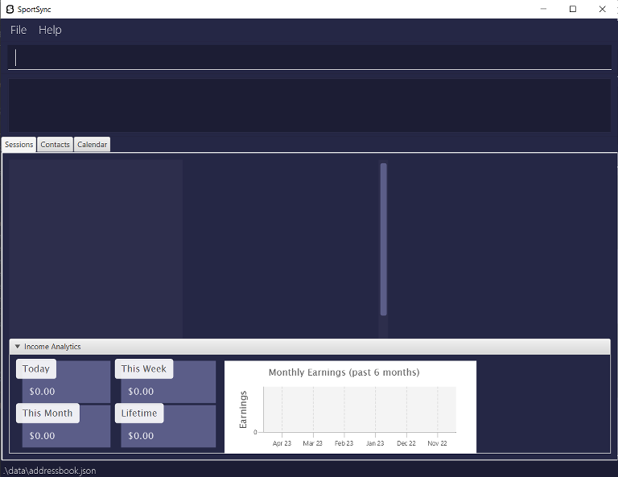
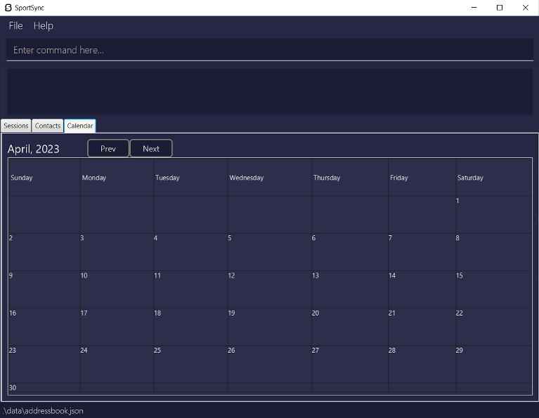
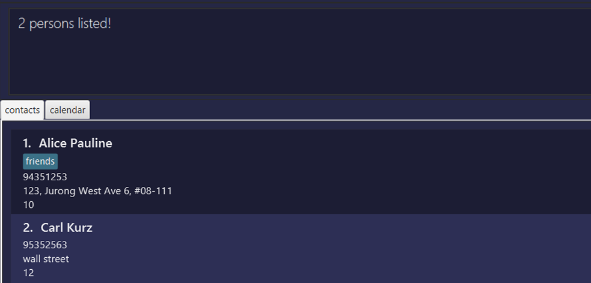
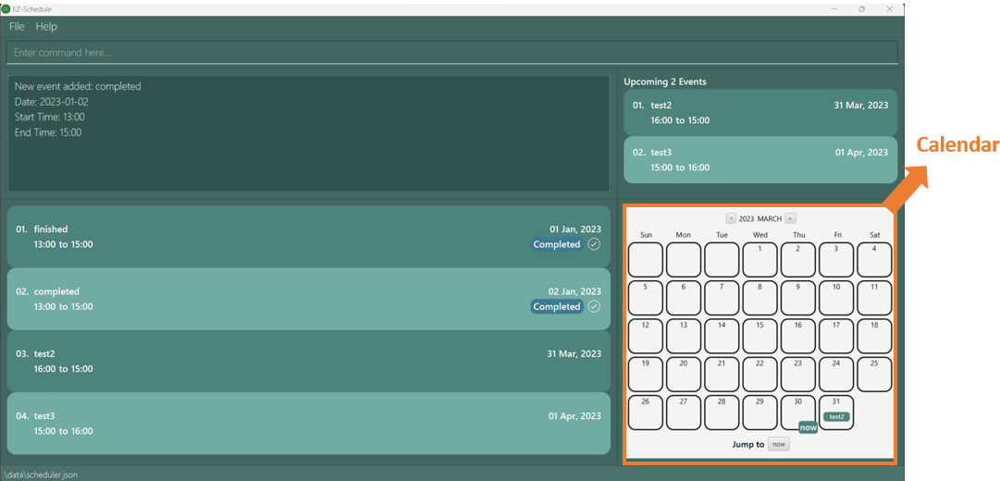
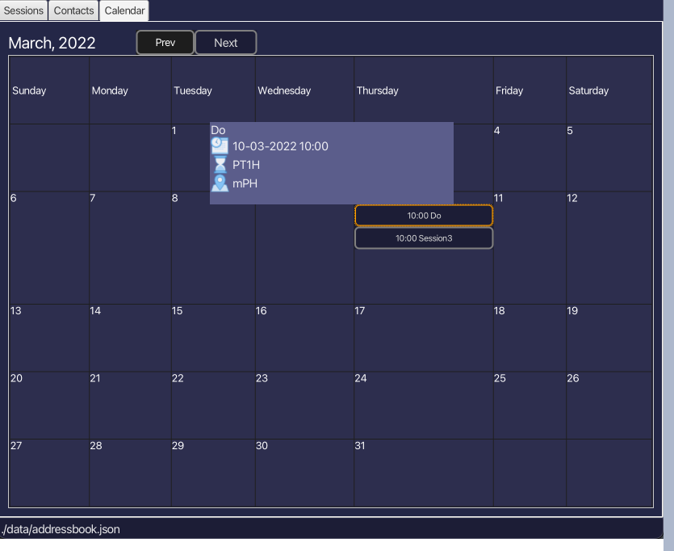
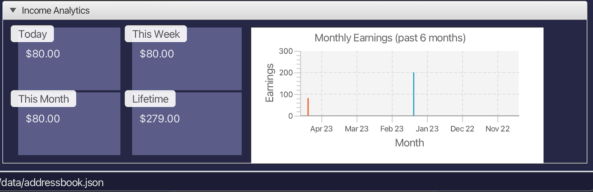

SportSync is a **desktop app for managing training sessions and athletes, optimized for use via a Command Line Interface** (CLI) while still having the benefits of a Graphical User Interface (GUI). If you can type fast, SportSync can get your training management tasks done faster than traditional GUI apps.

* Table of Contents 
{:toc}

--------------------------------------------------------------------------------------------------------------------

## **Quick start**
### Prerequisites
Ensure that you have Java 11 or above installed on your computer. If you don't have Java installed, you can download it from the official Java website [here](https://www.oracle.com/java/technologies/downloads/).

1. Download the latest `sportsync.jar` from [here](https://github.com/AY2223S2-CS2103T-W13-2/tp/releases).

2. Copy the file to the folder you want to use as the _home folder_ for your SportSync.

3.Open a command terminal, `cd` into the folder you put the jar file in, and use the `java -jar sportsync.jar` command to run the application. 
   e.g. `cd Desktop\New_Folder` and then `java -jar sportsync.jar` 

   A GUI similar to the below should appear in a few seconds. This shows the **session list**, which is currently empty. 
   Below that is the income analytics, which tabulates how much you've earned through your sessions.  
     
   Click the `Contacts` tab, or press the shortcut `CTRL + 2`.  You have just navigated to the **contact list**. 
   Note how the app contains some sample data.  
   

4.Type the command in the command box and press Enter to execute it. e.g. typing `help` and pressing Enter will open the help window. 
   Some example commands you can try:

* `list` : Lists all athletes.

* `add n/John Doe p/98765432 a/311, Clementi Ave 2, r/35 t/friends t/owesMoney`
    : Adds athlete `John Doe` to SportSync.

* `delete 3` : Deletes the 3rd athlete shown in the current list.

* `clear` : Deletes all athletes and sessions.

* `exit` : Exits the app.

Refer to the [Features](#features) below for details of each command.

5.Click the `Calendar` tab, or press the shortcut `CTRL + 3`. You have just navigated to the **calendar**, which is currently empty. 
   All future scheduled sessions will automatically show up on the calendar.  
    

:bulb: **Tip:**
Here are some useful shortcuts that can help you save time: 
**F1**: Opens the help menu. 
**CTRL + 1**: Switches to the `Sessions` tab. 
**CTRL + 2**: Switches to the `Contacts` tab. 
**CTRL + 3**: Switches to the `Calendar` tab. 

--------------------------------------------------------------------------------------------------------------------

## **Features**

**:information_source: Notes about the command format:** 
* Parameters are used to specify information that is required for the command to be executed correctly.

* Words in `UPPER_CASE` are the parameters to be supplied by you.  
  e.g. in `add n/NAME`, `NAME` is a parameter which can be used as `add n/John Doe…​`.

* Items in square brackets are optional. 
  e.g. `n/NAME [t/TAG]` can be used as `n/John Doe t/friend` or as `n/John Doe`.

* Items with `…`​ after them can be used multiple times including zero times. 
  e.g. `[t/TAG]…​` can be used as ` ` (i.e. 0 times), `t/friend`, `t/friend t/family` etc.

* Parameters can be in any order. 
  e.g. if the command specifies `n/NAME p/PHONE_NUMBER`, `p/PHONE_NUMBER n/NAME` is also acceptable.

* If a parameter is expected only once in the command but is specified multiple times, only the last occurrence of the parameter will be taken. 
  e.g. if you specify `p/12341234 p/56785678`, only `p/56785678` will be taken.

* Extraneous parameters for commands that do not take in parameters (such as `help`, `list`, `exit` and `clear`) will be ignored. 
  e.g. if the command specifies `help 123`, it will be interpreted as `help`.

## **General**

### Viewing help : `help`

Shows a message containing a link to the SportSync User Guide. 
Clicking the 'Copy URL' button copies the link to your clipboard.

Format: `help`

:bulb: **Tip:**
The help menu can also be accessed by pressing the F1 key.

### Undoing a previous command : `undo`

Undoes a previously entered command.

Format: `undo`

* Functions similarly to the undo function in other apps.
* Cannot be used if no commands have been entered yet.

### Redoing a previous command : `redo`

Redoes a previously undone command.

Format: `redo`

* Functions similarly to the redo function in other apps.
* Cannot be used if no commands have been entered yet.

:exclamation: **Caution:**
A redo operation cannot be done if the contacts or sessions have been edited after an undo operation.

### Exiting the program : `exit`

Exits the program.

Format: `exit`

## **Athlete Management**

### Adding a new athlete: `add`

Adds an athlete to the contact list.

Format: `add n/NAME p/PHONE_NUMBER a/ADDRESS r/PAY_RATE [t/TAG]…​`

* An existing athlete with the same name must not already exist in the contact list.

:bulb: **Tip:**
An athlete can have any number of tags (including 0)

Examples: 
* `add n/John Doe p/98765432 r/44 a/UTown Residences, #01-01` 
Adds an athlete with name `"John Doe"`, phone number `"98765432"`, pay rate `"44"` and address `"UTown Residences, #01-01"`. 
* `add n/Betsy Crowe t/friend a/Sheares Hall p/1234567 t/basketball r/5` 
Adds an athlete with name `"Betsy Crowe"`, phone number `"1234567"`, pay rate `"5"` address `"Sheares Hall"`, and tags `"friend"`, `"basketball"`.

### Listing all athletes : `list`

Shows all athletes in the contact list.

Format: `list`

### Editing an athlete's details : `edit`

Edits the details of an existing athlete in the contact list, by their index.

Format: `edit INDEX [n/NAME] [p/PHONE_NUMBER] [r/PAY_RATE] [a/ADDRESS] [t/TAG]…​`

* The index refers to the index number shown in the displayed contact list.
* The index **must be a positive integer** 1, 2, 3, …​ not more than the number of athletes in the contact list.
* At least one of the optional fields must be provided.
* Existing values will be updated to the new input values.
* When editing tags, the **existing tags of the athlete will be removed**.  (i.e. adding of tags is not cumulative)
* You can remove all the athlete’s tags by typing `t/` without
  specifying any tags after it.

Examples: 
* `edit 1 p/91234567 r/3`  
Edits the phone number of the first athlete in the contact list to be `91234567`, and their pay rate to be `3`. 
* `edit 2 n/Betsy Crower t/` 
Edits the name of the 2nd athlete in the contact list to be `Betsy Crower` and removes all their existing tags.

### Finding athletes by name: `find`

Finds athletes in the contact list whose names contain any of the given keywords.

Format: `find KEYWORD [MORE_KEYWORDS]…​`

* Only the name of the athlete is searched.
* The search is case-insensitive. e.g. `hans` will match `Hans`
* Full and partial words will be matched e.g. `Han` and `Hans` will both match `Hans`
* The order of the keywords does not matter. e.g. `Hans Bo` will match `Bo Hans`
* Athletes matching at least one keyword will be returned (i.e. `OR` search). 
  e.g. `Hans Bo` will return `Hans Gruber`, `Bo Yang`

Examples: 
* `find John` 
Returns `john` and `John Doe` 
* `find carl alice`  
Returns `Alice Pauline`, `Carl Kurz`  

### Deleting an athlete : `delete`

Deletes an athlete from the contact list, by their index.

Format: `delete INDEX`

* The index refers to the index number shown in the displayed contact list.
* The index **must be a positive integer** 1, 2, 3, …​ not more than the number of athletes in the contact list.

Examples: 
* `list` followed by `delete 2` 
Deletes the 2nd athlete in the contact list. 
* `find Betsy` followed by `delete 1` 
Deletes the 1st athlete in the results of the `find` command.

### Clearing all athletes and sessions : `clear`

Clears all athletes from the contact list and sessions from the session list.

Format: `clear`

### Sorting the contact list : `sort`

Sorts all athletes in the contact list according to the provided attribute.

Format: `sort ATTRIBUTE`

* Sorts the athlete in ascending order, according to specified attribute `ATTRIBUTE`.
* Attributes:

  * 1 - Name
  * 2 - Pay rate

Examples: 
* `sort 1` 
Sorts the contact list by name in alphabetical order. 
* `sort 2` 
Sorts the contact list by pay rate, from lowest to highest.

## **Tag Management**

### Adding tags to an athlete: `add-tag`

Adds the specified tag(s) to an athlete, by their index.

Format: `add-tag INDEX t/TAG [MORE_TAGS]…​`

* Multiple tags can be added to an athlete at once.
* The index refers to the index number shown in the displayed contact list.
* The index **must be a positive integer** 1, 2, 3, …​ not more than the number of athletes in the contact list.
* The tag is added to the athlete without altering existing tags the athlete has.
* The athlete must not already have a tag with the same name.

Examples: 
* `add-tag 1 t/Hall` 
Adds a tag `Hall` to the athlete at index 1.
* `add-tag 4 t/Basketball t/Varsity` 
Adds tags `Basketball` and `Varsity` to the athlete at index 4.

### Removing tags from an athlete: `remove-tag`

Removes the specified tag(s) from an athlete, by their index.

Format: `remove-tag INDEX t/TAG [MORE_TAGS]…​`

* Multiple tags can be removed from an athlete at once.
* The index refers to the index number shown in the displayed contact list.
* The index **must be a positive integer** 1, 2, 3, …​ not more than the number of athletes in the contact list.
* The tag is removed from the athlete without altering existing tags the athlete has.
* The athlete must already have the tag for it to be deleted.

Examples: 
* `remove-tag 1 t/Hall` 
Removes the tag `Hall` from the athlete at index 1.
* `remove-tag 4 t/Basketball t/Varsity` 
Removes tags `Basketball` and `Varsity` from the athlete at index 4.

### Showing athletes with specified tags : `show`

Finds athletes in the contact list who have any of the specified tags.

Format: `show TAG_NAME [MORE_TAGS]…​`

* Filters the contact list to only contain athletes having one or more of the specified tag(s).
* At least one tag name **must be provided.**

Examples: 
* `show Varsity` 
Shows all athletes who have the tag `Varsity`. 
* `show Hockey Tennis` 
Shows all athletes who have the tag `Hockey`, the tag `Tennis`, or both.

## **Session Management**

**:information_source: Notes about session-related commands:** 
* When editing a session, the changes may not get reflected in the side panel in real time.  Manually update the panel by clicking on the session again.

### Creating a new session : `create-session`

Creates a new session and adds it to the session list.

Format: `create-session n/NAME s/SESSION l/LOCATION`

* The session list must not already have a session with the same name.
* Datetime format must be `DD-MM-YYYY HH:mm`.

Examples: 
* `create-session n/Hall s/10-03-2022 10:00 to 10-03-2022 11:00 l/MPSH2` 
Creates a session with name `Hall` from `10 March 2022, 10:00 a.m.` to `10 March 2022, 11:00 a.m.` at `MPSH2`.

### Deleting an existing session : `delete-session`

Deletes an existing session from the session list.

Format: `delete-session INDEX`

* The index refers to the index number shown in the displayed session list.
* The index **must be a positive integer** 1, 2, 3, …​ not more than the number of sessions in the session list.
* Session must already exist for it to be deleted.

Examples: 
* `delete-session 3` 
Deletes the 3rd session in the session list.

### Marking an athlete as present : `mark`

Marks an athlete (by name) as present for a specified session (by index).

Format: `mark SESSION_INDEX n/ATHLETE_NAME`

* The index refers to the index number shown in the displayed session list.
* The index **must be a positive integer** 1, 2, 3, …​ not more than the number of sessions in the session list.
* Athlete must already exist to be marked as present.

Examples: 
* `mark 1 n/John Doe` 
Marks John Doe as present in the 1st session in the session list.

### Marking an athlete as absent : `unmark`

Marks an athlete (by name) as absent for a specified session (by index).

Format: `unmark SESSION_INDEX n/ATHLETE_NAME`

* The index refers to the index number shown in the displayed session list.
* The index **must be a positive integer** 1, 2, 3, …​ not more than the number of sessions in the session list.
* Athlete must already exist to be marked as absent.

Examples: 
* `unmark 1 n/John Doe` 
Marks John Doe as absent in the 1st session in the session list.

### Adding an athlete to a session: `student-add`

Adds an athlete (by index) to a specified session (by name).

Format: `student-add INDEX n/SESSION_NAME`

* The index refers to the index number shown in the displayed contact list.
* The index **must be a positive integer** 1, 2, 3, …​ not more than the number of athletes in the contact list.
* Session must already exist to add an athlete to it.

Examples: 
* `student-add 1 n/hall` 
Adds the athlete at index 1 of the contact list to the session `Hall`.

### Removing an athlete from a session: `student-remove`

Removes an athlete (by index) from a specified session (by name).

Format: `student-remove INDEX n/SESSION_NAME`

* The index refers to the index number shown in the displayed contact list.
* The index **must be a positive integer** 1, 2, 3, …​ not more than the number of athletes in the contact list.
* Session must already exist to remove an athlete from it.

Examples: 
* `student-remove 1 n/hall` 
Removes the athlete at index 1 of the contact list from the session `Hall`.

## **Calendar**
The **Calendar** includes various functions that enable you to manage your schedule effectively. These features are designed to simplify the process of tracking sessions.

### How to view
You can access the Calendar Features by interacting with the Calendar tab. 
  You can click on the `Prev` and `Next` buttons to navigate through the months. 

### Features
The Calendar features allow you to view your schedule on a monthly basis. You can also click on a session to view its details.

 

 

## **Income Analytics**

The **Income Analytics** Panel is an automated feature that tracks and displays your coaching income based on athlete attendance and pay rates.

### How to view
The panel is automatically updated based on athlete attendance and pay rates. 
It displays income earned on the current day, week, month, and lifetime.

### Features
The displayed income is based on the athlete's pay rate per hour and the duration of the session(s) the athletes belong to. 
An athlete only contributes to your income if they are marked as present.
 

--------------------------------------------------------------------------------------------------------------------

## **FAQ**

**Q**: How do I transfer my data to another Computer? 
**A**: Install the app in the other computer and overwrite the empty data file it creates with the file that contains the data of your previous SportSync home folder. 

**Q**: How do I save my data? 
**A**: SportSync data is saved in the hard disk automatically after any command that changes the data. There is no need to save manually. 

**Q**: How do I edit the data file manually? 
**A**: SportSync data is saved as a JSON file at `[JAR file location]/data/addressbook.json`. You can update the data directly by editing that data file. 

:exclamation: **Caution:**
If your changes to the data file makes its format invalid, SportSync will discard all data and start with an empty data file upon startup.

## **Glossary**

* **Pay rate**: The amount of fees paid by the athlete per session.
* **Session**: A training period for athletes, conducted by a coach.
* **Session List**: A list of training sessions.
* **Athlete**: A person being trained by a coach.
* **Contact List**: A list of athletes and their contact details.
* **Coach**: A person who trains and directs athletes or a team.
* **Attendance**: A record of the presence (or absence) of an athlete in a session.
* **Tag**: A label attached to an athlete in SportSync, used to group them together for easier management.

--------------------------------------------------------------------------------------------------------------------

## **Command summary**

| Action                          | Format, Examples                                                                                                                            |
|---------------------------------|---------------------------------------------------------------------------------------------------------------------------------------------|
| **Help Window**                 | `help`                                                                                                                                      |
| **Undo Action**                 | `undo`                                                                                                                                      |
| **Redo Action**                 | `redo`                                                                                                                                      |
| **Exit SportSync**              | `exit`                                                                                                                                      |
| **Add New Athlete**             | `add n/NAME p/PHONE_NUMBER a/ADDRESS r/PAY_RATE [t/TAG]…​`   e.g. `add n/Betsy Crowe t/friend a/Sheares Hall p/1234567 t/basketball r/5` |
| **List Athletes**               | `list`                                                                                                                                      |
| **Edit Athlete**                | `edit INDEX [n/NAME] [p/PHONE_NUMBER] [r/PAY_RATE] [a/ADDRESS] [t/TAG]…​`  e.g. `edit 2 n/James Lee r/3`                                 |
| **Find Athlete**                | `find KEYWORD [MORE_KEYWORDS]`  e.g. `find James Jake`                                                                                   |
| **Delete Athlete**              | `delete INDEX`  e.g. `delete 3`                                                                                                          |
| **Clear Athletes and Sessions** | `clear`                                                                                                                                     |
| **Sort Athletes**               | `sort ATTRIBUTE`  e.g. `sort 1`                                                                                                          |
| **Add Tags to Athlete**         | `add-tag INDEX t/TAG [MORE_TAGS]…​`   e.g. `add-tag 2 t/Private t/New`                                                                   |
| **Remove Tags from Athlete**    | `remove-tag INDEX t/TAG [MORE_TAGS]…​`   e.g. `remove-tag 2 t/Private`                                                                   |
| **Show Athletes with Tags**     | `show TAG_NAME [MORE_TAGS]…​`  e.g. `show Hall Varsity`                                                                                  |
| **Create Session**              | `create-session n/NAME s/SESSION l/LOCATION`  e.g. `create-session n/Hall s/10-03-2022 10:00 to 10-03-2022 11:00 l/MPSH2`                |
| **Delete Session**              | `delete-session INDEX`  e.g. `delete-session 3`                                                                                          |
| **Mark Athlete Attendance**     | `mark SESSION_INDEX n/ATHLETE_NAME`   e.g. `mark 1 n/John Doe`                                                                           |
| **Unmark Athlete Attendance**   | `unmark SESSION_INDEX n/ATHLETE_NAME`   e.g. `unmark 1 n/John Doe`                                                                       |
| **Add Athlete to Session**      | `student-add INDEX n/SESSION_NAME`   e.g. `student-add 1 n/Hall`                                                                         |
| **Remove Athlete from Session** | `student-remove INDEX n/SESSION_NAME`   e.g. `student-remove 1 n/Hall`                                                                   |

