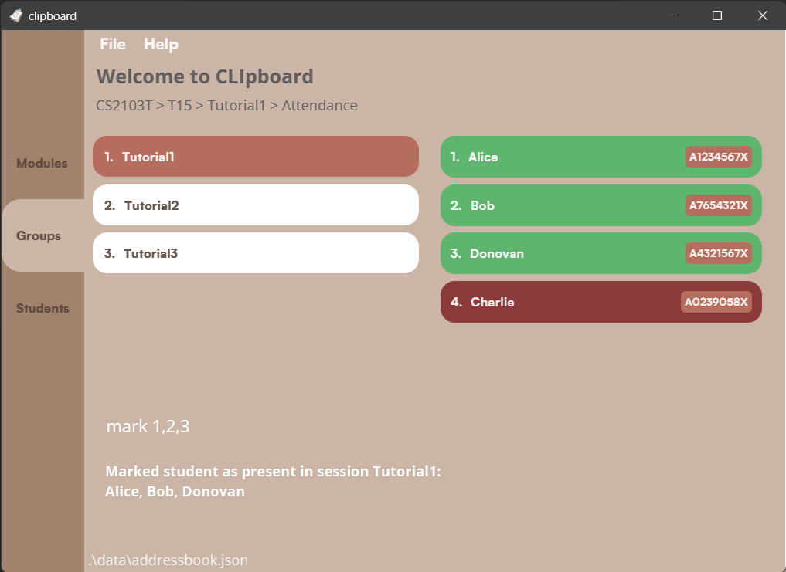

Group: AY2223S2-CS2103T-T15-4

## Introduction

CLIpboard is a desktop app that helps educators (like you!), especially those that tutor multiple classes, by managing their students’ particulars<strong> in an organised manner.</strong>

CLIpboard is optimized **for use via a Command Line Interface** (CLI) while still having the benefits of a Graphical User Interface (GUI). It can get your student management tasks done faster than traditional GUI apps. CLIpboard is optimised for keyboard users, so if you can type fast, CLIpboard can work even faster.



--------------------------------------------------------------------------------------------------------------

## Table of Contents

* Table of Contents
{:toc}

--------------------------------------------------------------------------------------------------------------

## Quick Start

1. Ensure you have Java 11 or above installed in your Computer.
2. Download the latest clipboard.jar from [here](https://github.com/AY2223S2-CS2103T-T15-4/tp/releases).
3. Copy the file to the folder you want to use as the *home folder* for your CLIpboard.
4. Open a command terminal, cd into the folder you put the jar file in, and use the `java -jar clipboard.jar` command to run the application.&nbsp;
<br>e.g. your clipboard.jar is stored in `user/app/task/`, you run `cd user/app/task/` then `java -jar clipboard.jar`
<br>A GUI similar to the above should appear in a few seconds. Note how the app contains some sample data.

5. Type the command in the command box and press Enter to execute it.
<br>e.g. typing `help` and pressing Enter will open the help window.
    <br>Some example commands you can try:
    1. `add n/John Doe p/98765432 e/johnd@example.com sid/A1234567X` : Adds a student named John Doe with the particulars to the list at Student Page.
    2. `delete 3` : Deletes the 3rd student shown in the student list when you are at Student Page.
    3. `undo` : Returns to the state before the last command you entered.
    4. `exit` : Exits the app.
6. Refer to the commands list below for a detailed description for each command.

--------------------------------------------------------------------------------------------------------------

## Commands

List of commands:

-  [Course Page Commands: ](#course-page-commands)
    - [Adding a course: ](#adding-a-course--add-course) `add course`
    - [Deleting a course: ](#deleting-a-course--delete-course) `delete course`
    - [Editing a course: ](#editing-a-course--edit-course) `edit course`
    - [Selecting a course to display its Group Page: ](#selecting-a-course--select) `select`
- [Group Page Commands: ](#group-page-commands)
    - [Adding a group: ](#adding-a-group--add-group) `add group`
    - [Deleting a group: ](#deleting-a-group--delete-group) `delete group`
    - [Editing a group: ](#editing-a-group--edit-group) `edit group`
    - [Selecting a group to display its Student Page: ](#selecting-a-group--select) `select`
    - [Displaying sessions of a group: ](#displaying-sessions-of-a-group--session) `session`
    - [Displaying tasks of a group: ](#displaying-tasks-of-a-group--task) `task`
- [Students Page Commands: ](#students-page-commands)
    - [Adding a student: ](#adding-a-student--add-student) `add student`
    - [Deleting a student: ](#deleting-a-student--delete-student) `delete student`
    - [Editing a student: ](#editing-a-student--edit-student) `edit student`
    - [Copying a student's email: ](#copying-a-students-email--copy) `copy`
    - [Finding students by name: ](#finding-students-by-name--find) `find`
    - [View a student's information: ](#view-a-students-information--view) `view`
    - [Displays a student's information:  ](#displays-a-students-information--view) `select`
    - [Adding or deleting a remark: ](#adding-or-deleting-a-remark--remark) `remark`
    - [Upload a student's photo: ](#uploading-a-students-photo--upload) `upload`
    - [Sorting list of students: ](#sorting-list-of-students--sort) `sort`
- [Session Page Commands: ](#session-page-commands)
    - [Adding a session: ](#adding-a-session--add-session) `add session`
    - [Deleting a session: ](#deleting-a-session--delete-session) `delete session`
    - [Editing a session: ](#editing-a-session--edit-session) `edit session`
    - [Selecting a session to start attendance-taking: ](#selecting-a-session-to-start-attendance-taking--select) `select`
- [Students by Session Commands: ](#students-by-session-commands)
    - [Marking attendance of a selected students: ](#marking-attendance-of-a-selected-students--mark) `mark`
    - [Unmarkikng attendance of a selected students: ](#unmarkikng-attendance-of-a-selected-students--unmark) `unmark`
    - [View the overall attendance of the session: ](#view-the-overall-attendance-of-the-session--attendance) `attendance`
- [Task Page Commands: ](#task-page-commands)
- [Students by Task Commands: ](#students-by-task-commands)
- [General Commands: ](#general-commands)
    - [Displaying the home page (Course Page): ](#displaying-the-home-page--course-page---home) `home`
    - [Displaying the previous page you were at: ](#displaying-the-previous-page-you-were-at--back) `back`
    - [Undoing the last command you did: ](#undoing-the-last-command-you-did--undo) `undo`
    - [Opening help window: ](#opening-help-window--help) `help`
    - [Scrolling through command history: ](#scrolling-through-command-history--up-or-down-arrow-key) `UP` or `DOWN` arrow key
    - [Clearing all entries: ](#clearing-all-entries--clear) `clear`
    - [Exiting the program: ](#exiting-the-program--exit) `exit`


--------------------------------------------------------------------------------------------------------------
## Navigation Guide


--------------------------------------------------------------------------------------------------------------
## Course Page Commands


### Adding a course: `add course`

Adds a course to the list of courses in the course page.

Format:
```
add course <COURSE>
```

- Adding a course with the same module code is not allowed.
    - For example, if a course with module code 'CS2103T' already exists in CLIpboard, entering `add course CS2103T` will display an error message.

Examples:
- `add course CS2103T` will add a new course with module code `CS2103T`
- `add course CS2105` will add a new course with module code `CS2105`


### Deleting a course: `delete course`

Deletes a course from the list of courses in the course page.

Format:
```
delete course <INDEX>
```


Examples:
- `delete course 1` will delete 1st course listed in the course list panel of CLIpboard.


### Editing a course: `edit course`

Edits an existing course in the course list.

Format:
```
edit course <INDEX> <NEW COURSE NAME>
```

- Edits course at index specified in `<INDEX>`.


Examples:
- `edit course 1 CS2106` will rename the first course listed in the course list to 'CS2106'.


### Selecting a course: `select`

Selects an existing course to display its corresponding Group Page.

Format:
```
select <INDEX>
```
- Selects course at index specified in `<INDEX>` and displays list of groups from that course.

Examples:
- `select 1` will display a list of groups from the 1st course.

--------------------------------------------------------------------------------------------------------------

## Group Page Commands


### Adding a group: `add group`

Adds a group to the list of groups in the group page.

Format:
```
add group <GROUP>
```

- Adding a group with the same group name is not allowed.
    - For example, if a group with group name 'T15' already exists in CLIpboard, 
  entering `add group T15` will display an error message.

Examples:
- `add group T15` will add a new group with group name `T15`
- `add group T16` will add a new group with group name `T16`


### Deleting a group: `delete group`

Deletes a group from the list of groups in the group page.

Format:
```
delete group <INDEX>
```


Examples:
- `delete group 1` will delete 1st group listed in the group list panel of CLIpboard.


### Editing a group: `edit group`

Edits an existing group in the group list.

Format:
```
edit group <INDEX> <NEW GROUP NAME>
```

- Edits group at index specified in `<INDEX>`.


Examples:
- `edit group 1 T16` will replace the group name of the first group listed to 'T16'.


### Selecting a group: `select`

Selects an existing group to display its corresponding Student Page.

Format:
```
select <INDEX>
```
- Selects group at index specified in <INDEX> and displays list of students in that group.

Examples:
- `select 1` will return a list of students from the 1st group.


### Displaying sessions of a group: `session`

Selects an existing group to display its corresponding Session Page.

Format:
```
session <INDEX>
```
- Selects group at index specified in <INDEX> and displays list of sessions in that group.

Examples:
- `session 1` will return a list of sessions from the 1st group.


### Displaying tasks of a group: `task`

Selects an existing group to display its corresponding Task Page.

Format:
```
task <INDEX>
```
- Selects group at index specified in <INDEX> and displays list of tasks assigned to that group.

Examples:
- `task 1` will return a list of tasks for the 1st group.

--------------------------------------------------------------------------------------------------------------

## Students Page Commands


### Adding a student: `add student`

Adds a student to the student roster.

Format:
```
add n/<NAME> p/<PHONE_NUMBER> e/<EMAIL> sid/<STUDENT_ID> [t/<TAG>]
```

- `t/<TAG>` field is optional.
- Adding a student with the same student ID is not allowed.
    - For example, if a student with a student ID of `A0123456X` already exists in CLIpboard, entering `add n/Tom p/99887766 e/tom@example.com sid/A0123456X m/CS2105` will display an error message.

Examples:
- `add n/John Doe p/98765432 e/johnd@example.com sid/A1234567X m/CS2103T`
- `add n/Roy Balakrishnan p/92624417 e/royb@example.com sid/A7356561X m/CS2105 t/T06`


### Deleting a student: `delete student`

Deletes a student from the student roster.

Format:
```
delete <INDEX>
```

Examples:
- `delete 1` will delete 1st student listed in the student list panel of CLIpboard.


### Editing a student: `edit student`

Edits an existing student in the student roster.

Format:
```
edit <INDEX> [n/<NAME>] [p/<PHONE_NUMBER>] [e/<EMAIL>] [sid/<STUDENT_NUMBER>] [t/<TAG>]
```

- Edits student at index specified in `<INDEX>`.
- At least one field `[n/<NAME>]`, `[p/<PHONE_NUMBER>]`, `[e/<EMAIL>]`, `[sid/<STUDENT_NUMBER>]`, or `[t/<TAG>]` must be provided.
- Fields entered following `edit <INDEX>` will replace the original fields.
- Fields not entered will not replace the original fields.

Examples:
- `edit 1 n/John Doe` will replace the name of the first student listed in the student list to 'John Doe'.
- `edit 4 p/99887766 e/john@gmail.com` will replace the phone number and email of the fourth student listed in the student list to '99887766' and 'john@gmail.com' respectively.


### Copying a student's email: `copy`

Copies a student's email to your clipboard.

Format:
```
copy <INDEX>
```

Examples:
- `copy 1` will copy the email of the 1st student listed to your clipboard.


### Finding students by name: `find`

Finds students whose names contain any of the given keywords.

Format:
```
find <KEYWORDS> [<MORE_KEYWORDS>]
```

Examples:
- `find John` returns John.
- `find Alex Yu` returns `Alex Yeoh`, `Bernice Yu` 


### View a student's information: `view`

Views personal information for a particular student.

Format:
```
view <INDEX>
```

Examples:
- `view 2` will display the full student details of the 2nd student in the student list on the view panel.


### Adding or deleting a remark: `remark`

Add or delete a remark to/from a student in the student roster.

Format for adding a remark:
```
remark <INDEX> [r/<REMARK]
```

- Adds a remark to student in the student list whose index is specified in the `<INDEX>` field.

Format for deleting a remark:
```
remark <INDEX>
```

- Deletes a remark from a student in the student list whose index is specified in the `<INDEX>` field.

Examples:
- `remark 1 r/Loves watching Sci-Fi movies` will add a remark of 'Loves watching Sci-Fi movies' to the first student listed in the student list.
- `remark 2` will delete the remark from the second student listed in the student list.


### Uploading a student's photo: `upload`

Uploads a student's photo to be displayed on the student roster.

Format:
```
upload <LOCAL_FILE_PATH>
```
- File path must be an absolute file path to the photo.
- For student photo to be reflected to a specific student in CLIpboard, photo must be named after the said student's student ID (i.e. `<STUDENT_ID>.png`)
- If a new photo with the same name as an existing photo in CLIpboard is uploaded, existing photo will be replaced.
<div markdown="span" class="alert alert-primary">:bulb: **Tip:**
Only images of file type .png is accepted
</div>

Examples:
- `upload /Users/AlexYeoh/Desktop/A0123456X.png`


### Sorting list of students: `sort`

Sorts list of students in student roster.

Format:
```
sort <CATEGORY>
```

- Current possible categories are `name` and `id`

Examples:
- `sort name` will sort list of students alphabetically according to name.
- `sort id` will sort list of students alphanumerically according to student ID.


--------------------------------------------------------------------------------------------------------------

## Session Page Commands

### Adding a session: `add session`

Adds a session to the list of session in the session page.

Format:
```
add session <SESSION>
```

- Adding a session with the same session name is not allowed.
    - For example, if a session with name 'Tutorial1' already exists in CLIpboard,
      entering `add session Tutorial1` will display an error message.

Examples:
- `add session Tutorial1`
- `add session Tutorial2`


### Deleting a session: `delete session`

Deletes a session from the list of session in the session page.

Format:
```
delete session <INDEX>
```


Examples:
- `delete session 1` will delete 1st session listed in the session list panel of CLIpboard.


### Editing a session: `edit session`

Edits an existing session in the session list.

Format:
```
edit session <INDEX> <NEW SESSION NAME>
```

- Edits session at index specified in `<SESSION>`.


Examples:
- `edit session 1 Tutorial0` will replace the session name of the first session listed to 'Tutorial0'.


### Selecting a session to start attendance-taking: `select`

Selects an existing session to start taking attendance for that session by displaying Student Page of that session on the right panel.

Format:
```
select <INDEX>
```
- Selects session at specified index and displays list of students in that session.

Examples:
- `select 1` will return a list of students from the 1st session.

--------------------------------------------------------------------------------------------------------------

## Students by Session Commands

### Marking selected students as present: `mark`

Marks selected students' attendance as present for current session.

Format:
```
mark <INDEX>
mark <INDEX>, <INDEX>, ...
```

Examples:
- `mark 1` will mark the 1st student as present.
- `mark 2,3,4` will mark the 2nd, 3rd and 4th students as present.


### Marking selected students as absent: `unmark`

Marks selected students' attendance as absent for current session.

Format:
```
unmark <INDEX>
unmark <INDEX>, <INDEX>, ...
```

Examples:
- `mark 1` will mark the 1st student as absent.
- `mark 2,3,4` will mark the 2nd, 3rd and 4th students as absent.


### View the overall attendance of the session: `attendance`

Displays the overall attendance of the session you are at. (Pictured below.)


Format: 
```
attendance
```

--------------------------------------------------------------------------------------------------------------

## Task Page Commands
[TBC]

## Students by Task Commands
[TBC]

--------------------------------------------------------------------------------------------------------------

## General Commands
Commands that can be used on any page.

### Displaying the home page (Course Page): `home`

Goes back to the Course Page which is the home page of CLIpboard.

Format:
```
home
```


### Displaying the previous page you were at: `back`

Goes back to the page you were at.

Format:
```
back
```


### Undoing the last command you did: `undo`

Deletes the change that your last command did.

Format:
```
undo
```


### Opening help window: `help`

Opens a window showing a link to this User Guide.

Format:
```
help
```


### Scrolling through command history: `UP` or `DOWN` arrow key

Scrolls through past commands in command box.

- Similar to Linux command-line interface, use the up or down arrow keys to scroll through previously typed commands in the command box.
- You may use the `LEFT` or `RIGHT` arrow keys to edit the command first.
- Press `ENTER` to execute the command.


### Clearing all entries: `clear`

Clears all entries in the student roster.

Format:
```
clear
```


### Exiting the program: `exit`

Exits the program.

Format:
```
exit
```
