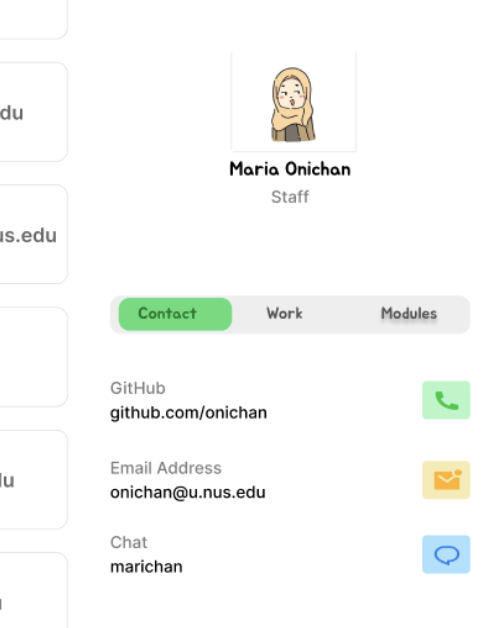
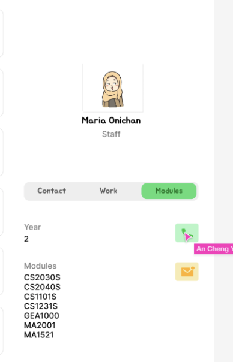

# About

CoDoc is a desktop app for students in SoC (School of Computing) to connect with each other for the benefit of their course of study. It is optimized for use via a Command Line Interface (CLI) while still having the benefits of a Graphical User Interface (GUI). If you can type fast, CoDoc can get your contact management tasks done faster than traditional GUI apps and networking with people can be easily done.

--------------------------------------------------------------------------------------------------------------------
# Table of Contents
1. [Quick Start](#quick-start)
2. [Features](#features)
   * [Add](#add)
   * [View](#view)
   * [Edit](#edit)
   * [Find](#find)
   * [List](#list)
   * [Delete](#delete)
   * [Clear](#clear)
   * [Exit](#exit)
   * [Help](#help)
   * Automatically save to file
   * Automated bulk edit [coming soon]
   * Archiving data files [coming soon]
3. [FAQ](#faq)
4. [Command Summary](#command-summary)

--------------------------------------------------------------------------------------------------------------------
## Quick Start

1. Ensure you have Java `11` or above installed in your Computer.

2. Download the latest `codoc.jar` from [here] (link to be added).

3. Copy the file to the folder you want to use as the _home folder_ for your CoDoc program.

4. Open a command terminal, `cd` into the folder you put the jar file in, and use the `java -jar codoc.jar` command to run the application. 
   A GUI similar to the below should appear in a few seconds. Note how the app contains some sample data. 
   

5. Type the command in the command box and press Enter to execute it. e.g. typing **`help`** and pressing Enter will open the help window. 
   Some example commands you can try:

   * `list` : Lists all contacts.

   * `add n/John Doe g/98765432 e/johnd@example.com a/John street, block 123, #01-01` : Adds a contact named `John Doe` to CoDoc.

   * `delete 3` : Deletes the 3rd contact shown in the current list.

   * `clear` : Deletes all contacts.

   * `exit` : Exits the app.

6. Refer to the [Features](#features) below for details of each command.

--------------------------------------------------------------------------------------------------------------------
## Features

**:information_source: Notes about the command format:** 

* Words in `UPPER_CASE` are the parameters to be supplied by the user. 
  e.g. in `add n/NAME`, `NAME` is a parameter which can be used as `add n/John Doe`.

* Items in square brackets are optional. 
  e.g `n/NAME [s/SKILL]` can be used as `n/John Doe s/python` or as `n/John Doe`.

* Items with `…`​ after them can be used multiple times including zero times. 
  e.g. `[s/SKILL]…​` can be used as ` ` (i.e. 0 times), `s/python`, `s/python s/sql` etc.

* Parameters can be in any order. 
  e.g. if the command specifies `n/NAME g/GITHUB_USERNAME`, `g/GITHUB_USERNAME n/NAME` is also acceptable.

* If a parameter is expected only once in the command but you specified it multiple times, only the last occurrence of the parameter will be taken. 
  e.g. if you specify `g/12341234 g/56785678`, only `g/56785678` will be taken.

* Extraneous parameters for commands that do not take in parameters (such as `help`, `list`, `exit` and `clear`) will be ignored. 
  e.g. if the command specifies `help 123`, it will be interpreted as `help`.

### Adding a person: `add`
_Adds a person to CoDoc._
>> add n/NAME e/EMAIL y/YEAR c/COURSE [OPTIONAL/PARAMETER]...
> 
> **Compulsory parameters:**
> - n/NAME (eg. n/John Doe)
> - e/EMAIL (eg. e/johndoe123@email.com)
> - y/YEAR (eg. ay/3, ay/prof, ay/alum)
> - c/COURSE (eg. c/Computer Science, c/Information Security)
> 
> **Optional parameters:**
> - ct/CONTACT (eg.ct/Telegram: @Johndoe123)
> - sn/STUDENT NUMBER (eg. sn/E1234568)
> - m/MODULE YEAR (eg. m/AY2223S1 CS2103T, m/AY2122S2 CS2101)
> - job/WORK (eg. job/Google Software Engineer, job/ATAP)
> - skill/SKILL (eg. skill/C++, skill/Rust)
> - link//LINK (eg. link//github.com/johndoe123)
> 
> 💡 **Tip:** A person can have any number of [OPTIONAL/PARAMETER] (including 0)
> 
> **Examples:**
> - `add` n/Betsy Crowe e/betsycrowe@example.com y/prof c/Information Security ct/Telegram: @betC123 job/Professor, NUS IS link//linkedin.com/in/betsycrowe 
> - `add` n/John Doe e/johnd@example.com y/2 c/Computer Science
> 

### Viewing contacts/tabs: `view`
_View more details of specific contact._
>> view INDEX
> 
> Loads up the contact at INDEX to the right panel to view details
> 
> 

>> view TAB
> 
> Switches the tab of the right panel (eg. view c, view w, view m)
> 
> 

### Editing a person information: `edit`
_Edits an existing person in CoDoc._
>> edit [n/NAME] [e/EMAIL] [y/YEAR] [c/COURSE] [OPTIONAL/PARAMETER]...
> 
> - Edits the person displayed in the view panel 
> - At least one of the optional fields must be provided. 
> - Existing values will be updated to the input values. 
> - When editing skills, the existing skills of the person will be removed i.e adding of skills is not cumulative. 
> - You can remove all the person’s skills by typing s/ without specifying any skills after it
> 
> **Examples:**
> - edit g/91234567 e/johndoe@example.com will edit the github username and email address of the person to be 91234567 and johndoe@example.com respectively. 
> - edit n/Betsy Crower s/ Edits the name of the person to be Betsy Crower and clears all existing skills.

### Finding something: `find`
_Finds persons whose names contain any of the given keywords._

>> find KEYWORD [MORE_KEYWORDS]
> * The search is case-insensitive. e.g `hans` will match `Hans`
> * The order of the keywords does not matter. e.g. `Hans Bo` will match `Bo Hans`
> * Only the name is searched. 
> * Only full words will be matched e.g. `Han` will not match `Hans`
> * Persons matching at least one keyword will be returned (i.e. `OR` search).
  e.g. `Hans Bo` will return `Hans Gruber`, `Bo Yang`
>
> **Examples:**
> - `find John` returns `john` and `John Doe`
> - `find alex david` returns `Alex Yeoh`, `David Li` 
  

### List all contacts: `list`
_Shows a list of all persons in CoDoc._
>> `list`

### Delete a contact: `delete`
_Deletes the specified person from CoDoc._
>> delete INDEX
> 
> - Deletes the person at the specified INDEX. 
> - The index refers to the index number shown in the displayed person list. 
> - The index must be a positive integer 1, 2, 3, …​
>
> Examples:
> - list followed by delete 2 deletes the 2nd person in CoDoc. 
> - find Betsy followed by delete 1 deletes the 1st person in the results of the find command.

### Clear all contacts: `clear`
_Clears all entries from CoDoc._
>> clear

### Exiting the program : `exit`
_Exits the program._
>> `exit`

### Viewing help : `help`
_Shows a message explaining how to access the help page._
>> help
> 
> 

### Automatically save to file

CoDoc data are saved in the hard disk automatically after any command that changes the data. There is no need to save manually.

### Automated bulk edits `[coming in v2.0]`
_Details coming soon ..._

### Archiving data files `[coming in v2.0]`

_Details coming soon ..._

--------------------------------------------------------------------------------------------------------------------

## FAQ

**Q**: How do I transfer my data to another Computer? 
**A**: Install the app in the other computer and overwrite the empty data file it creates with the file that contains the data of your previous CoDoc home folder.

**Q**: Where is the data file stored? 
**A**: CoDoc data are saved as a JSON file `[JAR file location]/data/codoc.json`. Advanced users are welcome to update data directly by editing that data file.

:warning: If your changes to the data file makes its format invalid, CoDoc will discard all data and start with an empty data file at the next run.

--------------------------------------------------------------------------------------------------------------------

## Command Summary
| Action             | Format, Examples                                                                                                                                                                                                                                       |
|--------------------|--------------------------------------------------------------------------------------------------------------------------------------------------------------------------------------------------------------------------------------------------------|
| Add	               | `add n/NAME y/YEAR c/COURSE e/EMAIL [l/LINKEDIN] [g/GITHUB] [m/YEARTAKEN MODCODE]... [s/SKILL]...` e.g., `add n/Bob Sim y/2 c/com sci e/e0823741@nus.edu l/linkedin.com/in/bom-sim-086g93847/ m/ay2223s2 cs2103t m/ay2223s2 cs2101 s/python s/java` |
| View contact       | `view INDEX` e.g., `view 3`                                                                                                                                                                                                                       |
| View tab           | `view C/M/T` e.g., `view c`, `view m` or `view t`                                                                                                                                                                                                 |
| Edit               | `edit [n/NAME] [y/YEAR] [c/COURSE] [e/EMAIL] [l/LINKEDIN] [g/GITHUB] [m/MODINDEX YEARTAKEN MODCODE]... [s/SKILL]...` e.g., `edit n/Bob Lim m/2 ay2223s2 cs2109s`                                                                                    |
| Find	name          | `find NAME [MORENAMES]` e.g., `find Bob Sam Pete`                                                                                                                                                                                                 |
| Find module        | `findm MODCODE [MOREMODCODES]` e.g., `findm cs2013t cs2109s cs2107`                                                                                                                                                                               |
| Find skills          | `finds SKILL [MORESKILLS]` e.g., `finds java python`                                                                                                                                                                                                  |
| List               | `view` the default list of all contacts                                                                                                                                                                                                                |
| Delete             | `delete INDEX` e.g., `delete 3`                                                                                                                                                                                                                   |
| Clear all contacts | `clear`                                                                                                                                                                                                                                                |
| Exit               | `exit`                                                                                                                                                                                                                                                 |
| Help               | `help`                                                                                                                                                                                                                                                 |
