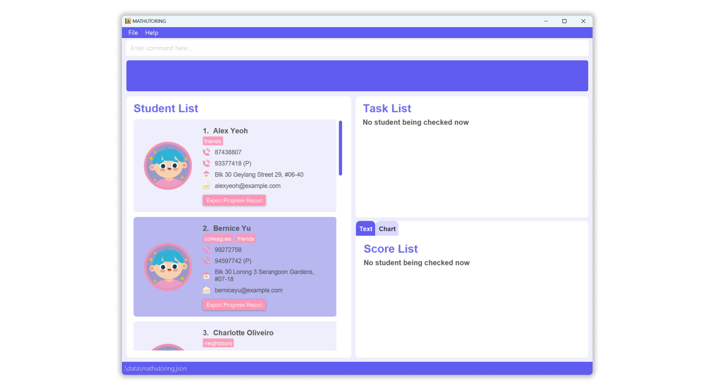
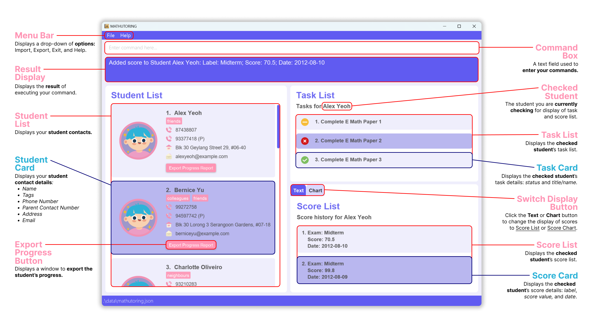
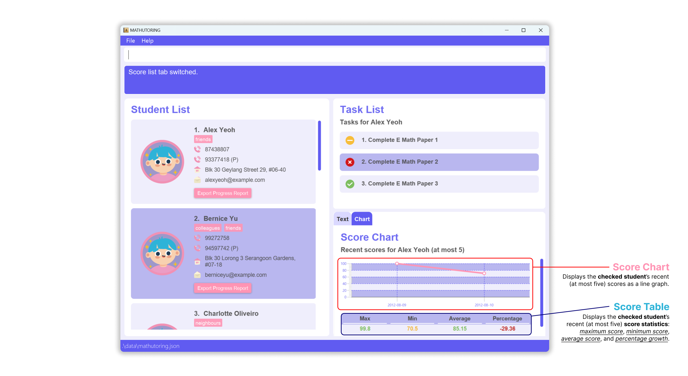

## Table of Contents
*  **[Overview](#overview)**
*  **[Quick start](#quick-start)**
*  **[User interface layout](#user-interface-layout)**
*  **[User input restrictions](#user-input-restrictions)**
   *  **[Student contact](#student-contact)**
      *  [Name](#name)
      *  [Phone/Contact Number](#phonecontact-number)
      *  [Email](#email)
      *  [Address](#address)
      *  [Tags](#tags)
   *  **[Task](#task)**
      *  [Name/Title](#nametitle)
   *  **[Score](#score)**
      *  [Label](#label)
      *  [Value](#value)
      *  [Date](#date)
   *  **[General fields](#general-fields)**
      *  [Index](#index)
      *  [File path for export](#file-path-for-export)
      *  [File path for import](#file-path-for-import)
*  **[Features](#features)**
   *  **[Managing student contact](#managing-student-contact)**
      *  [Adding a student: `add`](#1-adding-a-student-add)
      *  [Deleting a student: `delete`](#2-deleting-a-student-delete)
      *  [Editing a student: `edit`](#3-editing-a-student-edit)
      *  [Checking a student: `check`](#4-checking-a-student-check)
      *  [Finding a student: `find`](#5-finding-a-student-find)
      *  [Filtering students: `filter`](#6-filtering-students-filter)
      *  [Listing all students: `list`](#7-listing-all-students-list)
   *  **[Managing task list of a student](#managing-task-list-of-a-student)**
      *  [Adding a task for a student: `addtask`](#1-adding-a-task-for-a-student-addtask)
      *  [Deleting a task of a student: `deletetask`](#2-deleting-a-task-of-a-student-deletetask)
      *  [Marking a task of a student: `markcomplete`, `markinprogress`, `marklate`](#3-marking-a-task-of-a-student-markcomplete-markinprogress-marklate)
   *  **[Managing score list of a student](#managing-score-list-of-a-student)**
      *  [Adding a score for a student: `addscore`](#1-adding-a-score-for-a-student-addscore)
      *  [Deleting a score of a student: `deletescore`](#2-deleting-a-score-of-a-student-deletescore)
      *  [Switching between score tabs: `switch`](#3-switching-between-score-tabs-switch)
   *  **[Managing the data of the students](#managing-the-data-of-the-students)**
       *  [Exporting the data of the students: `export`](#1-exporting-the-data-of-the-students-export)
       *  [Importing the data of the students: `import`](#2-importing-the-data-of-the-students-import)
       *  [Exporting the progress of a student: `exportp`](#3-exporting-the-progress-of-a-student-exportp)
   *  **[General commands](#general-commands)**
       *  [Viewing help: `help`](#1-viewing-help-help)
       *  [Clearing all entries: `clear`](#2-clearing-all-entries-clear)
       *  [Exiting the program: `exit`](#3-exiting-the-program-exit)
   *  **[Saving the data](#saving-the-data)**
   *  **[Editing the data file](#editing-the-data-file)**
*  **[GUI display restrictions](#gui-display-restrictions)**
*  **[FAQ](#faq)**
*  **[Command summary](#command-summary)**

--------------------------------------------------------------------------------------------------------------------

## Overview

Finding it hard to manage your student contact details and keep track of their progress?

Finding it a hassle to keep a list of student tasks and scores?

**MATHUTORING** helps you solve these problems!

**MATHUTORING**, a centralised desktop application targeted to **private Math tuition teachers**, helps you manage student contact details and performance by keeping student contact details, tasks, and scores.
You can also see score charts and statistics!

What's more, you can generate a PDF report of your student containing the student's tasks and scores.
If you need to switch to a new device, you can also export and import your previous data into the application!

**MATHUTORING** is optimised for use via a Command Line Interface (CLI) while still having the benefits of a Graphical User Interface (GUI). If you can type fast, **MATHUTORING** can get your contact management tasks done faster than traditional GUI apps.

[Back to top](#table-of-contents)

--------------------------------------------------------------------------------------------------------------------

## Quick start

1. Ensure you have `Java 11` or above installed in your Computer.

2. Download the latest `mathutoring.jar`.

3. Copy the file to the folder you want to use as the _home folder_ for your MATHUTORING app.

4. Open a command terminal, `cd` into the folder you put the jar file in, and use the `java -jar mathutoring.jar` command to run the application. 
    
   The initial GUI below should appear in a few seconds. Note how the app contains some sample data for your reference, you are free to delete the sample data after you get familiar with the MATHUTORING. 

    

    

5. Type the command in the command box and press `Enter` to execute it. e.g. typing **`help`** and pressing `Enter` will open the help window. 
   Some example commands you can try:

   * `list` : Lists all students in the student list.

   * `add n/John Doe p/98765432 e/johnd@example.com a/311, Clementi Ave 2, #02-25 c/87849999 t/female t/primary` : Adds a student named `John Doe` to the student list in MATHUTORING with two tags attached.

   * `delete 3` : Deletes the 3rd student (if the student exists) shown in the current list.

   * `clear` : Deletes all students.

   * `exit` : Exits the app.

6. Recommended minimum screen size: 740x700.

7. Refer to the [Features](#features) below for details of each command.

[Back to top](#table-of-contents)

--------------------------------------------------------------------------------------------------------------------

## User interface layout

There are two options to display a student's scores (__score list__ and __score chart__) by clicking the *Text* and *Chart* buttons (referred as Switch Display Button below) respectively.

[Back to top](#table-of-contents)

### Layout with score list

[Back to top](#table-of-contents)

### Layout with score chart

[Back to top](#table-of-contents)

--------------------------------------------------------------------------------------------------------------------

## User input restrictions
To achieve the best performance, we have set **restrictions** for the user command input.  
Here is the **summary** for input restrictions. Users are advised to skim through all the restrictions to avoid command input mistakes.

[Back to top](#table-of-contents)

### Student contact

#### Name
A **name** can only contain **alphanumeric** characters and **spaces**.

[Back to top](#table-of-contents)

#### Phone/Contact number
* A **phone/contact number** must have at least **3 digits** and no more than **15 digits**.

[Back to top](#table-of-contents)

#### Email
An **email** should be of the format `local-part@domain` and adheres to the following constraints:
1. The **local-part** should only contain **alphanumeric characters** and **these special characters**, excluding the parentheses, (+_.-).  
    The **local-part** may not start or end with any special characters.
2. This is followed by a **'@'** and then a domain name. The domain name is made up of domain labels separated by periods.
   The **domain name** must:
    - end with a domain label at least **2 characters** long
    - have each domain label start and end with **alphanumeric** characters
    - have each domain label consist of alphanumeric characters, separated only by **hyphens**, if any.

[Back to top](#table-of-contents)

#### Address
No restrictions.

[Back to top](#table-of-contents)

#### Tags
A **tag** can only contain **alphanumeric** characters and should not contain more than **20 characters**.

[Back to top](#table-of-contents)

--------------------------------------------------------------------------------------------------------------------

### Task

#### Name/Title
A **name** can only contain **alphanumeric** characters and **spaces**.

[Back to top](#table-of-contents)

--------------------------------------------------------------------------------------------------------------------

### Score

#### Label
A **label** can only contain **alphanumeric** characters and **spaces**.

[Back to top](#table-of-contents)

#### Value
A **value** can be any integer or a number with one decimal place from **0 to 100 (inclusive)**.

[Back to top](#table-of-contents)

#### Date
The format of a **date** must be in **`yyyy-MM-DD`**, and must not be in the future.

[Back to top](#table-of-contents)

--------------------------------------------------------------------------------------------------------------------

### General fields

#### Index
An index must be a **positive integer** 1, 2, 3, ... (one-based index).
Note if the index given is too large and exceed the integer limit, the command will be deemed as invalid.

[Back to top](#table-of-contents)

#### File path for export
* File path separator (e.g. backward/forward slash) should **follow user's operating system**.
  * e.g. Windows uses backward slash and Mac uses forward slash
* Export path should be a **directory**, not a file!

[Back to top](#table-of-contents)

#### File path for import
* File path separator (e.g. backward/forward slash) should **follow user's operating system**.
    * e.g. Windows uses backward slash and Mac uses forward slash
* Export path should be a **file**, not a directory!

[Back to top](#table-of-contents)

--------------------------------------------------------------------------------------------------------------------

## Features

**:information_source: Notes about the command format:** 

* Words in `UPPER_CASE` are the parameters to be supplied by the user. 
  e.g. in `add n/NAME`, `NAME` is a parameter which can be used as `add n/John Doe`.

* Items in square brackets are optional. 
  e.g. `n/NAME [t/TAG]` can be used as `n/John Doe t/primary` or as `n/John Doe`.

* Items with `…`​ after them can be used multiple times including zero times. 
  e.g. `[t/TAG]…​` can be used as ` ` (i.e. 0 times), `t/secondary`, `t/secondary4 t/secondary` etc.

* Parameters can be in any order. 
  e.g. if the command specifies `n/NAME p/PHONE_NUMBER`, `p/PHONE_NUMBER n/NAME` is also acceptable.

* If a parameter is expected only once in the command, but the user specified it multiple times, only the last occurrence of the parameter will be taken. 
  e.g. if the user specify `p/12341234 p/56785678`, only `p/56785678` will be taken.

* __Extraneous parameters for commands that do not take in parameters (including `help`, `list`, `exit`, `clear`, and `switch`) will be ignored. __
  e.g. if the command specifies `help 123`, it will be interpreted as `help`.

* Command words are case-insensitive. 
  e.g. if the command specifies such as `help`, `HELP`, `Help`..., it will be interpreted as `help`.

[Back to top](#table-of-contents)

### Managing student contact

### 1. Adding a student: `add`

Adds a student to the student list.

Format: `add n/NAME p/PHONE_NUMBER e/EMAIL a/ADDRESS c/CONTACT_PARENT [t/TAG]…​`

**:bulb: Tips:** 
* A student is allowed to have alphanumeric or numeric names, however, special characters (e.g. `à`, `_`) are not allowed.
* If a student does not have a phone number, their parent's contact number can be used as the student's phone number.
* A student can have any number of tags (including 0)

**:exclamation: Caution:** 
* In order to avoid potential confusion, we do not allow any student to have the same name regardless of the letter cases (e.g. Harry, HARRY, harry are deemed as same name).
* If the user wish to add in a student who has the same name as an existing student in the student list, consider adding a number after the student's name to distinguish them.  e.g. Emily and Emily 2 are acceptable names.

**:information_source:  Note about the avatars (profile pictures):** 
* The avatar will change if the student has a "gender" tag.
* The "gender" tag include male and female (case-insensitive). If a student does not have any gender tag or have both gender tags (male and female), the avatar will stay as default.

Examples:
* `add n/John Doe p/98765432 e/johnd@example.com a/John street, block 123, #01-01 c/948372948`
* `add n/Betsy Crowe t/primary c/83927482 e/betsycrowe@example.com a/Downtown p/1234567 t/primary3`
    

[Back to top](#table-of-contents)

### 2. Deleting a student: `delete`

Deletes the specified student from the student list.

Format: `delete INDEX`

* Deletes the student at the specified `INDEX`.
* The index refers to the index number shown in the displayed student list.
* The index **must be a positive integer** 1, 2, 3, …​

Examples:
* `list` followed by `delete 2` deletes the 2nd student (if the student exists) in the student list. 
    Before `delete 2` is executed, the student `Bernice Yu` is shown in the Student List.
    .png)
    After `delete 2` is executed, the student `Bernice Yu` is deleted from the Student List.
    .png)
* `find Betsy` followed by `delete 1` deletes the 1st student (if the student exists) in the results of the `find` command.
* `filter female` followed by `delete 3` deletes the 3rd student (if the student exists) in the results of the `filter` command.

[Back to top](#table-of-contents)

### 3. Editing a student: `edit`

Edits an existing student in the student list.

Format: `edit INDEX [n/NAME] [p/PHONE] [e/EMAIL] [a/ADDRESS] [c/CONTACT_PARENT] [t/TAG]…​`

* Edits the student at the specified `INDEX`. The index refers to the index number shown in the displayed student list. The index **must be a positive integer** 1, 2, 3, …​
* At least one of the optional fields must be provided.
* Existing values will be updated to the input values.
* When editing tags, all the existing tags of the student will be removed. i.e. adding of tags is not cumulative.
* The user can remove all the student’s tags by typing `t/` without specifying any tags after it.
* We allow the user to edit the `PHONE_NUMBER` and `CONTACT_PARENT` to be the same.
* The user are not allowed to change the name of a student to be the same as any existing student in the list.

Examples:
*  `edit 1 p/91234567 e/johndoe@example.com` Edits the phone number and email address of the 1st student to be `91234567` and `johndoe@example.com` respectively.
*  `edit 2 n/Betsy Crower t/` Edits the name of the 2nd student to be `Betsy Crower` and clears all existing tags. 
    Before command execution:
    .png)
    After command execution:
    .png)

[Back to top](#table-of-contents)

### 4. Checking a student: `check`

Displays the information of the student being checked, including their task list and score list.

Format: `check INDEX`

* Checks the student at the specified `INDEX` and displays the task list and score list of the student.
* The index refers to the index number shown in the displayed student list.
* The index **must be a positive integer** 1, 2, 3, …​

**:information_source:  Note:** 
After the user checked a student, the respective student's task list and score list will continue to be displayed, unless:
  * That respective student (the latest checked student) is being deleted.
  * That respective student (the latest checked student) is being edited.
  * The student list being cleared.
  * New student date (.json file) is being imported.

**Any of the above actions will alter the status to no student being checked now.**

Examples:
* `check 2` checks the 2nd student in the student list, the respective task list and score list will show on the right side of the application window. 

    

 
    Before command execution:
    .png)
    After command execution: 
    * Student has no tasks and scores:
        
    * Student has tasks and scores:
        

[Back to top](#table-of-contents)

### 5. Finding a student: `find`

Finds students whose names contain any of the given keywords.

Format: `find KEYWORD [MORE_KEYWORDS]`

* The search is case-insensitive. e.g. `hans` will match `Hans`
* The order of the keywords does not matter. e.g. `Hans Bo` will match `Bo Hans`
* Only the name is searched.
* Only full words will be matched e.g. `Han` will not match `Hans`
* Students matching at least one keyword will be returned (i.e. `OR` search).
  e.g. `Hans Bo` will return `Hans Gruber`, `Bo Yang`

Examples:
* `find John` returns `john` and `John Doe`
* `find alex david` returns `Alex Yeoh`, `David Li` 
    

[Back to top](#table-of-contents)

### 6. Filtering students: `filter`

Filters students whose tags match with any of the given keywords.

Format: `filter KEYWORD [MORE_KEYWORDS]`

* The filter is case-insensitive. e.g. `primary` will match `Primary`
* The order of the keywords does not matter. e.g. `primaryprimary4` will match `primary4primary`
* Only the tag is searched.
* Only full words will be matched e.g. `primary` will not match `primary4`
* Students whose tag matches at least one keyword will be returned (i.e. `OR` search).
  e.g. `primary primary4` will return students with tags of either `primary`, `primary4`, or both.

Examples:
* `filter primary` returns tag `primary`, `Primary`.
* `filter secondary secondary2` returns students with tags of either `secondary`, `secondary2`, or both.
    

[Back to top](#table-of-contents)

### 7. Listing all students: `list`

Lists all the students in the student list.

Format: `list`

[Back to top](#table-of-contents)

--------------------------------------------------------------------------------------------------------------------

### Managing task list of a student

### 1. Adding a task for a student: `addtask`

Adds a task to a specific student.

Format: `addtask INDEX t/TASK_TITLE`

* Adds the given task to the student at the specified `INDEX`.
* The index refers to the index number shown in the displayed student list.
* The index **must be a positive integer** 1, 2, 3, …​
* A task can have alphanumeric or numeric names, however, special characters (e.g. `à`, `_`) are not allowed.
* A task with the same name as a task already in the task list cannot be added to the task list.
* The name of a task is case-insensitive. e.g. `do homework` is the same as `Do Homework`

Examples:

* `list` followed by `addtask 2 t/finish Math Paper 1` adds the task `finish Math Paper 1` to the 2nd student of the
  student list. 
    The following result assumes that the user have [checked](#4-checking-a-student-check) the student before. 
    
* `check 2` followed by `addtask 1 t/Complete A Math Exercise` adds the task `Complete A Math Exercise` to the student
  being checked.

[Back to top](#table-of-contents)

### 2. Deleting a task of a student: `deletetask`

Deletes the specified task from the task list of a student.

Format: `deletetask INDEX_OF_STUDENT INDEX_OF_TASK`

* Deletes the task at the specified `INDEX_OF_TASK` of a specified student (`INDEX_OF_STUDENT`).
* The first index refers to the index number shown in the displayed student list and
  the second index refers to the index of the task in the displayed task list of the student.
* Both indexes **must be positive integers** 1, 2, 3, …​

Examples:

* `list` followed by `deletetask 2 3` deletes the third task of the 2nd student in the student list. 
    The following result assumes that the user have [checked](#4-checking-a-student-check) the student before. 
    Before command execution:
    .png)
    After command execution:
    .png)
* `find Betsy` followed by `deletetask 1 6` deletes the sixth task of the 1st student in the results of the `find` command.

[Back to top](#table-of-contents)

### 3. Marking a task of a student: `markcomplete`, `markinprogress`, `marklate`

Marks the specified task from the task list of a student as complete, in progress, or late.

Format:
  Mark task as complete: `markcomplete INDEX_OF_STUDENT INDEX_OF_TASK`
  Mark task as in progress: `markinprogress INDEX_OF_STUDENT INDEX_OF_TASK`
  Mark task as late: `marklate INDEX_OF_STUDENT INDEX_OF_TASK`

* Marks the task at the specified `INDEX_OF_TASK` of a specified student (`INDEX_OF_STUDENT`) as complete, in progress or late, depending on the command called.
* The first index refers to the index number shown in the displayed student list and
  the second index refers to the index of the task in the displayed task list of the student.
* Both indexes **must be positive integers** 1, 2, 3, …​
* The default status for a newly added task is in progress.

Examples:

* `list` followed by `markcomplete 2 3` marks the third task of the 2nd student in the student list as complete. 

    

    The following result assumes that the user have [checked](#4-checking-a-student-check) the student before. 
    Before command execution:
    .png)
    After command execution:
    png)
* `list` followed by `marklate 2 3` marks the third task of the 2nd student in the student list as late. 
    The following result assumes that the user have [checked](#4-checking-a-student-check) the student before. 
    Before command execution:
    .png)
    After command execution:
    .png)
* `find Betsy` followed by `marklate 1 6` marks the sixth task of the 1st student in the results of the
  `find` command as late.

[Back to top](#table-of-contents)

--------------------------------------------------------------------------------------------------------------------

### Managing score list of a student

### 1. Adding a score for a student: `addscore`

Adds a score to a specific student.

Format: `addscore INDEX l/LABEL v/VALUE_OF_SCORE d/DATE`

* Adds the given score to the student at the specified `INDEX`.
* The index refers to the index number shown in the displayed student list.
* The index **must be a positive integer** 1, 2, 3, …​
* A score can have alphanumeric or numeric labels, however, special characters (e.g. `à`, `_`) are not allowed.
* The given `VALUE_OF_SCORE` can be **any number from 0 to 100**.
* The given `VALUE_OF_SCORE` can either be **an integer or a number with one decimal place**
* Exams on different dates can have the same `Label`.
* No two exams can have the same `Date`.

**:information_source: Note about format of `DATE`:** 
* The format of `DATE` must be `yyyy-MM-DD`. For example, `2022-02-20` represents 20 February 2022.
* If the `DATE` entered by the user is in the future, will not be allowed.

**:exclamation: Caution:** 
* In order to avoid potential confusion, we only allow one score per day and the full mark of each score is 100.
* If there are two exams in one day, e.g. `Midterm Math Paper 1` and `Midterm Math Paper 2`, user can either combine these two exams to one score with label `Midterm Math` or add them in separate dates.
* If the full score of a test is not 100, please convert the score value with a full score of 100 before entering.

Examples:

* `list` followed by `addscore 2 l/Midterm Math Paper v/99.5 d/2023-03-02` adds a `Midterm Math Paper` score with a
  value of `99.5` and dated `2022-03-02` to the 2nd student in the student list. 
  The following result assumes that the user have [checked](#4-checking-a-student-check) the student before. 
  * Current display for score tab is using score list.
    
  * Current display for score tab is using score chart.
    
* `check 5` followed by `addscore 1 l/CA2 A Math v/50 d/2021-09-09` adds a `CA2 A Math` score with a
  value of `50` and dated `2021-09-09` to the student being checked.

[Back to top](#table-of-contents)

### 2. Deleting a score of a student: `deletescore`

Deletes the specified score from the score list of a student.

Format: `deletescore INDEX_OF_STUDENT INDEX_OF_SCORE `

* Deletes the score at the specified `INDEX_OF_SCORE` of a specified student (`INDEX_OF_STUDENT`).
* The first index refers to the index number shown in the displayed student list and
  the second index refers to the index of the task in the displayed score list of the student.
* Both indexes **must be positive integers** 1, 2, 3, …​

Examples:

* `list` followed by `deletescore 2 1` deletes first score of the 2nd student in the student list.
  The following results assumes that the user have [checked](#4-checking-a-student-check) the student before. 
  * Current display for score tab is using score list. 
    Before command execution:
    .png)
    After command execution:
    .png)
* `find Betsy` followed by `deletescore 1 2` deletes second score of the 1st student in the results of the `find` command.

[Back to top](#table-of-contents)

### 3. Switching between score tabs: `switch`

Switches between the score list and score chart tabs.

Format: There we support using CLI or GUI.

**CLI**  `switch`

**GUI**  Click the **Text** or **Chart** button to switch to score list and score chart tabs respectively.

[Back to top](#table-of-contents)

--------------------------------------------------------------------------------------------------------------------

### Managing the data of the students

### 1. Exporting the data of the students: `export`

Exports all the student's data out. Users can export with or without specifying the path.
The default exported position for CLI will be under the _home folder_ (the folder that contains the "mathutoring.jar" file).
The exported file name is `data.json`.

Format:

**CLI**  `export [FILE_PATH]`

**GUI** 
Click the "File" on the top menu, then choose "Export" under the drop-down list.

An export window will pop up, the user is required to specify which folder to store the exported file.

Examples:
* `export` will export the file as a JSON file `[JAR file location]/data/data.json`
* For Windows users
  * `export` p/C:\bin export `data.json` to bin folder under C disk.
* For Mac users
  * `export` p//Users/username/Desktop export `data.json` to desktop.

**:information_source: Note about the format of `FILE_PATH`:** 
* For Windows users, the format of `FILE_PATH` must be `p/C:\Users\username\Downloads`.
* For Mac users, the format of `FILE_PATH` must be `p//Users/username/Desktop`.

[Back to top](#table-of-contents)

### 2. Importing the data of the students: `import`

Imports student data into the application. Users can import the file by dragging the file in or choosing the file path.
The imported file must be in `.json` format.

Format:

**CLI**  - `import FILE_PATH`

**GUI**  - Click the "File" on the top menu, then choose "Import" under the drop-down list. An import window will pop up, the user can choose to either drag the file in or choose a specific file path.

Examples:
* For Windows users
  * `import` p/C:\bin\data.json.
* For Mac users
  * `import` p//Users/username/Desktop/data.json.

**:information_source: Note about the format of `FILE_PATH`:** 
* For Windows users, the format of `FILE_PATH` must be `p/C:\bin\[FILE_NAME]`.
* For Mac users, the format of `FILE_PATH` must be `p//Users/username/Desktop/[FILE_NAME]`.

[Back to top](#table-of-contents)

### 3. Exporting the progress of a student: `exportp`

Exports the specified student progress into a PDF file. Users can export without specifying the path. The default
exported position for CLI will be under the _home folder_.

Format:

**CLI** `exportp INDEX [p/FILE_PATH]`

**GUI** Click the "Export Progress Report" button of a student in the student list. An export progress window will pop
up, the user is required to specify which folder to store the exported file.

* Exports the score list and task list of the specified student `INDEX` in the form of a PDF file.
* The `INDEX` **must be a positive integer** 1, 2, 3, ...
* If `FILE_PATH` is not specified, file will be exported as a JSON file in `[JAR file location]/data`
* `FILE_PATH` should be a valid path to a **directory**.
* The exported file name is `[STUDENT_NAME]'s Progress Report.pdf`, e.g. `Alex Yeoh's Progress Report.pdf`
* Sample PDF output file: [Alex Yeoh's Progress Report.pdf](pdfs/Alex Yeoh's Progress Report.pdf)

Examples:

* `exportp 1` will export the file as a PDF file `[JAR file location]/data/[FIRST_STUDENT_NAME]'s Progress Report.pdf`
* For Windows users
  * `exportp 1 p/C:\Users\John Doe\Downloads`
* For Mac users
  * `exportp 1 p//Users/johndoe/Documents`

**:information_source: Note about the format of `FILE_PATH`:** 
* For Windows users, the format of `FILE_PATH` must be `p/C:\Users\username\Downloads`.
* For Mac users, the format of `FILE_PATH` must be `p//Users/username/Desktop`.

[Back to top](#table-of-contents)

--------------------------------------------------------------------------------------------------------------------

### General commands

### 1. Viewing help: `help`

Prompts the help page link together with a brief user guide that explain what commands are  provided in MATHUTORING.
For more detailed information such as how to use the syntax, please refer to the help page.

Format:

**CLI**  `help`

**GUI** 
Click the "Help" on the top menu, then choose "Help" again under the drop-down list.

[Back to top](#table-of-contents)

### 2. Clearing all entries: `clear`

Clears all entries from the MATHUTORING.

Format: `clear`

[Back to top](#table-of-contents)

### 3. Exiting the program: `exit`

Exits from MATHUTORING.

Format: `exit`

[Back to top](#table-of-contents)

--------------------------------------------------------------------------------------------------------------------

### Saving the data

* MATHUTORING data is saved in the hard disk automatically after any command that changes the data. There is no need to save manually.
* If the user would like to save the MATHUTORING data in a different location, they can use the [`export`](#1-exporting-the-data-of-the-students-export)
command.

[Back to top](#table-of-contents)

### Editing the data file

MATHUTORING data are saved as a JSON file `[JAR file location]/data/mathutoring.json`. Advanced users are welcome to update data directly by editing that data file.

:exclamation: Caution:
If the changes to the data file make its format invalid, MATHUTORING will discard all data and start with an empty data file at the next run.

[Back to top](#table-of-contents)

--------------------------------------------------------------------------------------------------------------------

## GUI display restrictions
We have set up a few GUI display restrictions in order to avoid the GUI being affect by extreme inputs (e.g. super long name) or small screen size, and thus hinder the user experience.
* If the student name is more than 29 letters, the full student name will be displayed in the student list. However, the
task list will only display the first 29 letters, with the remaining letters shown as ellipsis.

* If the exam label is more than 11 letters, the full exam label will be displayed in the score list, text panel.
However, the chart tooltip will only display the first 11 letters, with the remaining letters shown as ellipsis.

* When you try to open the JavaFX window, you might notice that it doesn't open if it is minimized. The proposed solution is already in the developer guide.

--------------------------------------------------------------------------------------------------------------------

## FAQ

**Q**: How do I transfer my data to another Computer? 
**A**: Install the app in the other computer and overwrite the empty data file it creates with the file that contains the data of your previous MATHUTORING home folder.

**Q**: I can't find the `mathutoring.json` file and the files exported for `export` and `exportp`. What should I do?  
**A**: Open the application using `java -jar mathutoring.jar` instead of opening the application by clicking the JAR file. More details can be found in the [Quick start](#quick-start) section.

[Back to top](#table-of-contents)

--------------------------------------------------------------------------------------------------------------------

## Command summary

| Action                                                                                 | Format, Examples                                                                                                                                                                              |
|----------------------------------------------------------------------------------------|-----------------------------------------------------------------------------------------------------------------------------------------------------------------------------------------------|
| [**Add a Student**](#1-adding-a-student-add)                                           | `add n/NAME p/PHONE_NUMBER e/EMAIL a/ADDRESS c/PARENT_PHONE [t/TAG]…​`   e.g., `add n/James Ho p/22224444 e/jamesho@example.com a/123, Clementi Rd, 1234665 c/11112222 t/friend t/primary` |
| [**Delete a Student**](#2-deleting-a-student-delete)                                   | `delete INDEX`  e.g., `delete 1`                                                                                                                                                           |
| [**Edit a Student**](#3-editing-a-student-edit)                                        | `edit INDEX [n/NAME] [p/PHONE_NUMBER] [e/EMAIL] [a/ADDRESS] [c/PARENT_PHONE] [t/TAG]…​`  e.g.,`edit 2 n/James Lee e/jameslee@example.com c/12348888`                                       |
| [**Check a Student**](#4-checking-a-student-check)                                     | `check INDEX`  e.g. `check 1`                                                                                                                                                              |
| [**Find a Student**](#5-finding-a-student-find)                                        | `find KEYWORD [MORE_KEYWORDS]`  e.g., `find James Jake`                                                                                                                                    |
| [**Filter Students**](#6-filtering-students-filter)                                    | `filter KEYWORD [MORE_KEYWORDS]`  e.g., `filter friends colleagues`                                                                                                                        |
| [**List Students**](#7-listing-all-students-list)                                      | `list`                                                                                                                                                                                        |
| [**Add a Task**](#1-adding-a-task-for-a-student-addtask)                               | `addtask INDEX t/TITLE`  e.g `addtask 2 t/Homework Assignment 1`                                                                                                                           |
| [**Delete a Task**](#2-deleting-a-task-of-a-student-deletetask)                        | `deletetask INDEX_OF_STUDENT INDEX_OF_TASK`  e.g `deletetask 2 1`                                                                                                                          |
| [**Mark a Task**](#3-marking-a-task-of-a-student-markcomplete-markinprogress-marklate) | `mark(STATUS) INDEX_OF_STUDENT INDEX_OF_TASK` (`mark(STATUS)` can be either `markcomplete`, `marklate` or `markinprogress`)  e.g. `markComplete 1 2`                                    |
| [**Add a Score**](#1-adding-a-score-for-a-student-addscore)                            | `addscore INDEX_OF_STUDENT l/LABEL v/VALUE_OF_SCORE d/DATE`  e.g `addscore 1 l/CA2 A Math v/70 d/2022-03-03`                                                                               |
| [**Delete a Score**](#2-deleting-a-score-of-a-student-deletescore)                     | `deletescore INDEX_OF_STUDENT INDEX_OF_SCORE`  e.g. `deletescore 3 4`                                                                                                                      |
| [**Switch Score Tab**](#3-switching-between-score-tabs-switch)                         | `switch`                                                                                                                                                                                      |
| [**Export Data**](#1-exporting-the-data-of-the-students-export)                        | `export [p/FILE_PATH]`  e.g. `export p//Users/John`                                                                                                                                        |
| [**Import Data**](#2-importing-the-data-of-the-students-import)                        | `import p/FILE_PATH`  e.g. `import p//Users/John/data.json`                                                                                                                                |
| [**Export a Student's Progress**](#3-exporting-the-progress-of-a-student-exportp)      | `exportp INDEX [p/FILE_PATH]`  e.g. `export 1 p//Users/John`                                                                                                                               |
| [**Help**](#1-viewing-help-help)                                                       | `help`                                                                                                                                                                                        |
| [**Clear**](#2-clearing-all-entries-clear)                                             | `clear`                                                                                                                                                                                       |
| [**Exit**](#3-exiting-the-program-exit)                                                | `exit`                                                                                                                                                                                        |

[Back to top](#table-of-contents)
