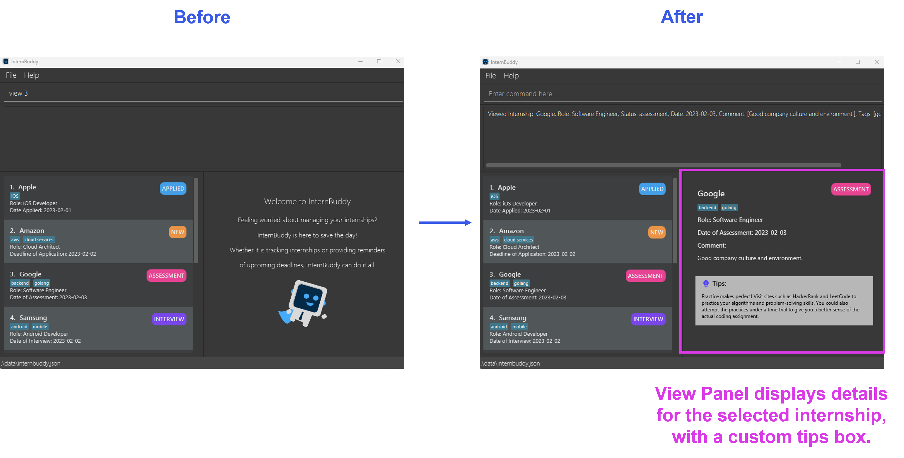
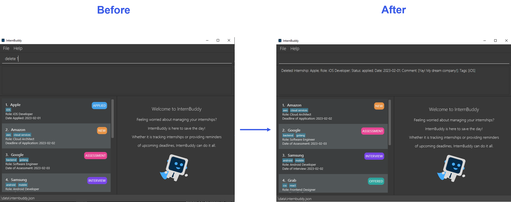
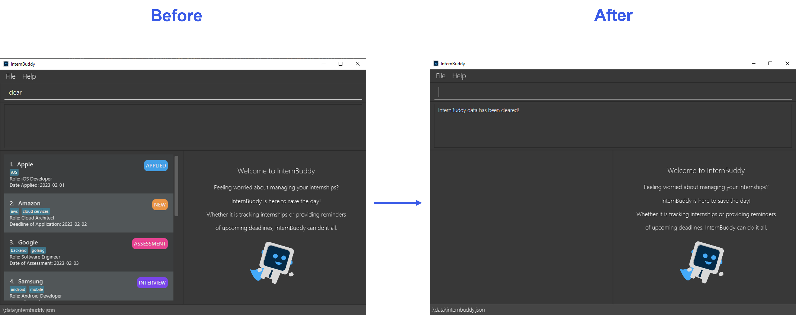

## **Table of Contents**
* Table of Contents
{:toc}

--------------------------------------------------------------------------------------------------------------------
## **Introducing InternBuddy**

InternBuddy is a desktop application for Computing undergraduates to manage their internship applications.
It is optimized for typing where it allows you to complete internship management tasks much more efficiently via
the keyboard as compared to using traditional Graphical User Interface (GUI) applications. If you are a fast typist
who is seeking for a one-stop platform to systematically organise your internship applications,
then InternBuddy is the perfect buddy to accompany you during your internship hunt.

InternBuddy runs using Java 11, and is available on the Windows, macOS and Linux operating systems.

 

  

--------------------------------------------------------------------------------------------------------------------
## **About the User Guide**

### Objectives of the User Guide
This user guide aims to provide comprehensive instructions for users to learn how to use InternBuddy,
providing details on the installation process and features provided by InternBuddy. It also contains information
for advanced users to customise the usage of InternBuddy for a tailored user experience.

### Using the User Guide
This uses guide uses a set of formatting standards and visuals to better communicate information.

**Information Box**

:information_source: **Info:** Provides useful information that supplements the main text

**Tip Box**

:bulb: **Tip:**  Suggestions on how to enhance your experience

**Warning Box**

:warning: **Warning:**  Warns of a dangerous action that you should be aware of and to consider
carefully before committing

**Syntax Highlighting**

Commands, parameters, file paths and class names are highlighted.

`command`, `PARAMETER`, `filepath.json`, `ClassName`

**Keyboard Actions**

Keyboard keys are indicated using rounded buttons.

<button>Ctrl</button> <button>Alt</button> <button>Space</button> <button>Enter</button> <button>&uarr;</button>

--------------------------------------------------------------------------------------------------------------------

## **Quick Start**

1. Ensure you have Java `11` or above installed in your computer

:information_source: **Info:** If you are unsure of whether you have Java 11 installed, or need help installing
it, you can refer to <a href="#appendix-a-installing-java-11">Appendix A</a>.

2. Download the latest `internbuddy.jar` from [here](https://github.com/AY2223S2-CS2103T-T14-3/tp/releases).

3. Copy the file `internbuddy.jar` to the folder you want to use as the _home folder_ for InternBuddy.

:information_source: **Info:** The home folder is the folder where you will navigate to in order to launch
InternBuddy, and it is where your InternBuddy data file will be stored in.

4. Double-click on the file `internbuddy.jar` to launch InternBuddy. A GUI similar to Figure 1 should
   appear in a few seconds. Note how the app contains some sample data.  
   
   
Figure 1: InternBuddy's GUI

 

5. You can interact with InternBuddy by typing into the box with the text `Enter command here...`, then pressing
   <button>Enter</button> to execute your command. For example, typing help and pressing <button>Enter</button> will open
   the help window.

6. Here are some other example commands you can try:

    - `list`: List all internship entries stored in InternBuddy
    - `add n/Food Panda r/Web Developer s/Applied d/2023-04-01`: Adds a new internship entry into InternBuddy.
    - `delete 3` : Deletes the 3rd internship entry of the current list displayed in InternBuddy.
    - `exit` : Exits InternBuddy.

Do refer to [Features](#features) below for a comprehensive list of supported features and their associated details.

--------------------------------------------------------------------------------------------------------------------
## **Exploring the Graphical User Interface**

Figure 2: Different parts of InternBuddy's GUI

 

| Part            | Usage                                                                                        |
|-----------------|----------------------------------------------------------------------------------------------|
| Input Box       | You can type in your commands here to interact with InternBuddy.                             |
| Results Display | This is where the results of your command will be displayed.                                 |
| List Panel      | Displays a list of internship entries.                                                       |
| View Panel      | Displays either the welcome message or detailed information of a specified internship entry. |
| Location Bar    | States where your InternBuddy data file is located on your computer.                         |

Figure 3: Explanation of the different parts of InternBuddy's GUI

:bulb: **Tip:**  The GUI is resizeable. You can resize it according to your preferences.

--------------------------------------------------------------------------------------------------------------------
## **Command Information**

### Notes about Commands and Parameters

* Words in `UPPER_CASE` are the parameters to be supplied by the user. 
  e.g. If the command format is `add n/COMPANY_NAME`, you may input the command as `add n/Apple` where you supply the
  value `Apple` to the parameter `COMPANY_NAME`.

* Items in square brackets are optional. 
  e.g. If the command format is `edit INDEX [n/NAME] [c/COMMENT]`, you may input the command as `edit 2 n/Apple` where
  you omit the value for the parameter `COMMENT`.

* Items with `…`​ after them can be used multiple times including zero times. 
  e.g. `[t/TAG]…​` can be used as ` ` (i.e. 0 times), `t/friend`, `t/friend t/family` etc.

* Parameters can be in any order. 
  e.g. If the command format is `n/NAME r/ROLE`, both `n/Apple r/Software Engineer` and `r/Software Engineer n/Apple`
  are acceptable.

* If a parameter is expected only once in the command, but you specified it multiple times, only the last occurrence of
  the parameter will be taken. 
  e.g. If the command format is `r/ROLE`, typing in `r/Front-end Developer r/Back-end Developer` will cause your
  input to be interpreted as `r/Back-end Developer`.

* Extraneous parameters for commands that do not take in parameters (such as `help`, `list`, and `exit`) will be
  ignored. 
  e.g. If the command format is `help`, typing in `help 123` will cause your input to be interpreted as `help`.

### Descriptions, Prefixes and Constraints for Parameters
In InternBuddy's commands, we refer to a range of parameters that you can replace with values to input information that
is customised to your internship applications.

There are 2 important things that you should note:
1. Most parameters have associated **prefixes**. Prefixes are convenient shorthands that allow you to easily identify
   which parameter does a value belong to. For example, in `add n/Apple`, the value `Apple` is associated with the
   parameter `COMPANY_NAME` since the `n/` prefix is used.
2. There are **constraints** to the values that you can replace parameters with. The constraints differ based on
   the parameters. If you do not adhere to these constraints in your input, your input will be valid and an error
   message will be shown in the Results Display when you type the input in and press <button>Enter</button>.

Figure 4 provides a summary of the parameters with their descriptions, prefixes and constraints.

| Parameter      | Description                                                                    | Prefix | Constraints                                                                                                                                             |
|----------------|--------------------------------------------------------------------------------|--------|---------------------------------------------------------------------------------------------------------------------------------------------------------|
| `COMPANY_NAME` | The name of the company                                                        | `n/`   | Cannot be blank and must be at most 50 characters                                                                                                       |
| `ROLE`         | The role that you applied for                                                  | `r/`   | Cannot be blank and must be at most 50 characters                                                                                                       |
| `STATUS`       | The status of the internship application                                       | `s/`   | Must be one of the following: `New`, `Applied`, `Assessment`, `Interview`, `Offered`, `Accepted`, `Rejected`. Note that this is **not** case-sensitive. |
| `DATE`         | The date associated with the internship application                            | `d/`   | Must be a valid date in the format `YYYY-MM-DD `                                                                                                        |
| `COMMENT`      | A comment that you can make on an internship application                       | `c/`   | Cannot be blank                                                                                                                                         |
| `TAG`          | A label that you can give to an internship application                         | `t/`   | Cannot be blank and must be at most 30 characters                                                                                                       |
| `INDEX`        | The index number of the internship entry as displayed in the List Panel        | -      | A positive integer that is smaller than or equal to the largest index number shown in the List Panel. Note that 0 is not a positive integer.            |

Figure 4: Parameters with their descriptions, prefixes and constraints

### Details on `STATUS` and `DATE`
The parameter `STATUS` is used to represent the current status of an internship application. It can only take on one
of the following values: `New`, `Applied`, `Assessment`, `Interview`, `Offered`, `Accepted` and `Rejected`.
Note that this is not case-sensitive. Figure 5 explains the meaning of each status.

| `STATUS` | Description                                                                                                                       |
|-------------------|-----------------------------------------------------------------------------------------------------------------------------------|
| `New`             | You have recently saw this internship opportunity and would like to record it in InternBuddy. Also, you have yet to apply for it. |
| `Applied`         | You have applied for this internship opportunity and you are currently waiting for the company's response.                        |
| `Assessment`      | You are currently in the technical assessment stage of the application process.                                                   |
| `Interview`       | You are currently in the behavioral interview stage of the application process.                                                   |
| `Offered`         | You have been offered the internship opportunity.                                                                                 |
| `Accepted`        | You have accepted the internship opportunity.                                                                                     |
| `Rejected`        | You have either been rejected by the company, or that you have rejected the internshop offer.                                     |

Figure 5: Description of statuses

Depending on the status of the internship application, the `DATE` parameter will be interpreted differently. Figure 6
documents the meaning of `DATE` with respect to each `STATUS` value.

| `STATUS`     | Interpretation of `DATE`     |
|--------------|------------------------------|
| `New`        | Deadline of Application      |
| `Applied`    | Date Applied                 |
| `Assessment` | Date of Technical Assessment |
| `Interview`  | Date of Behavioral Interview |
| `Offered`    | Deadline of Offer Acceptance |
| `Accepted`   | Date of Acceptance           |
| `Rejected`   | Date of Rejection            |

Figure 6: Description of dates

### Duplicate internships
InternBuddy does not allow for the storage of duplicate internships. Should you enter a command that attempts to store 
a duplicate internship, InternBuddy will remind you that the internship already exists.

A duplicate internship is defined as 2 internships that have the matching `COMPANY_NAME`, `STATUS`, `DATE` and `ROLE`. The comparison 
will be case-insensitive. Please refer to the examples below for further explanation.

In the table below, Internship A and Internship B will be considered as duplicate internships, because they have the same `COMPANY_NAME`, `STATUS`, `DATE` and `ROLE`
even though the capitalization of certain parameters may be different.

| `PARAMETER`    | Internship A      | Internship B      |
|----------------|-------------------|-------------------|
| `COMPANY_NAME` | Google            | google            |
| `ROLE`         | Frontend Engineer | frontend engineer |
| `STATUS`       | New               | New               |
| `DATE`         | 2023-02-02        | 2023-02-02        |
| `COMMENT`      | NA                | NA                |
| `TAGS`         | C++               | Java              |

Meanwhile, Internship C and Internship D are not considered duplicate internships, because they have different `COMPANY_NAME`.

| `PARAMETER`    | Internship C      | Internship D     |
|----------------|-------------------|------------------|
| `COMPANY_NAME` | Apple             | Apple Inc        |
| `ROLE`         | Frontend Engineer | frontend engineer |
| `STATUS`       | New               | New              |
| `DATE`         | 2023-02-02        | 2023-02-02       |
| `COMMENT`      | NA                | NA               |
| `TAGS`         | Java              | Java             |

--------------------------------------------------------------------------------------------------------------------
## **Features**

### Listing all Internships : `list`
Shows the list of all internship entries that you have stored in InternBuddy.

Format: `list`

### Adding an Internship : `add`

Do you have a new internship to track? Add it to InternBuddy using the `add` command.

Format: `add n/COMPANY_NAME r/ROLE s/STATUS d/DATE [c/COMMENT] [t/TAG]...`

* The optional `COMMENT` parameter has a default value of `NA`. This means that if you do not specify any value for it,
  the comment for the newly added internship will be `NA`.
* The optional `TAG` parameter will be empty by default. This means that if you do not specify any value for it, there
  will be no tags associated with the newly added internship.

Examples:
* `add n/Deliveroo r/Software Engineer s/Assessment d/2023-02-01` Adds a new internship entry with
  company name `Deliveroo`, role `Software Engineer`, status `Assessment` and date of technical assessment
  `2023-02-01`.
* `add n/Food Panda r/Web Developer s/New d/2023-02-01 c/I love Food Panda! t/React t/Front-end` Adds a new internship entry
  with company name `Food Panda`, role `Web Developer`, status `New`, deadline of application `2023-02-01`,
  comment `I love Food Panda` and tags `React` and `Front-End`.
* `add n/Food Panda s/new d/2023-02-01` Displays an error because the `ROLE` parameter is missing.

   
Figure XX: Example of the add command in action

 

### Editing an Internship : `edit`

Made a mistake, or wish to update your internship entry? The `edit` command modifies an internship entry from your list of existing entries.

Format: `edit INDEX [n/COMPANY_NAME] [r/ROLE] [s/STATUS ] [d/DATE] [c/COMMENT] [t/TAG]...`

* The internship entry whose entry number is `INDEX` would be updated. `INDEX` needs to be a valid entry number as specified in the [List Panel](#exploring-the-graphical-user-interface)  displayed using the `list` command.
* You have to provide at least one of the optional parameters
* You can remove all of an internship’s tags by typing `t/` without specifying any other tags after it. 
* You can reset the comment of an internship to the default value of `NA` by typing `c/` without specifying any comments after it.

:warning: **Warning:**  When editing tags, the existing tags of the internship will be removed i.e adding of tags is not cumulative.

Examples:
* `edit 2 s/assessment r/Software Developer` Sets the status and role of the second internship entry as `Assessment` and `Software Developer` respectively.
* `edit 2` Displays an error because the command does not satisfy the criteria of having at least one optional parameter.
* `edit 2 t/Java t/Go` Sets the tags of the second internship entry as Java and Go. (Existing tags will be removed)
* `edit 2 t/` Removes all the tags of the second internship entry.

### Viewing an Internship : `view`
Want to view the details of a specific internship entry? You can do so using the `view` command.

Format: `view INDEX`
* Views the details of the internship entry with index number `INDEX` as indicated in
  the [List Panel](#exploring-the-graphical-user-interface).
* The details will be shown in the [View Panel](#exploring-the-graphical-user-interface).
* Apart from the internship details, a custom tips box is also included in the
[View Panel](#exploring-the-graphical-user-interface), where the tips change according to the status of the
internship entry.

Examples:
* `view 1` Assuming that you have at least three internships displayed in the
[List Panel](#exploring-the-graphical-user-interface), this displays the details of the third internship in the
[View Panel](#exploring-the-graphical-user-interface).
* `view -1` Displays an error because `INDEX` must be a positive integer.
* `view 8` Assuming that you have 7 internships displayed in the
[List Panel](#exploring-the-graphical-user-interface), this displays an error because `INDEX` cannot be greater
than the maximum index shown in the [List Panel](#exploring-the-graphical-user-interface), which is 7 in this case.

   
Figure XX: Example of the view command in action

 

### Copying an Internship to Clipboard : `copy`
Want to copy the content of a specific internship to somewhere else? You can do so using the `copy` command.

Format: `copy INDEX`
*Copy the details of information of the internship entry with index number `INDEX` as indicated 
in the [List Panel](#exploring-the-graphical-user-interface).
*The details will be copied onto the clipboard of your computer.

Examples:
* `view 1` Assuming that you have at least three internships displayed in the
[List Panel](#exploring-the-graphical-user-interface), this will copy the details of the third internship onto the
clipboard of your computer.
* `view -1` Displays an error because `INDEX` must be a positive integer.
* `view 8` Assuming that you have 7 internships displayed in the
  [List Panel](#exploring-the-graphical-user-interface), this displays an error because `INDEX` cannot be greater
  than the maximum index shown in the [List Panel](#exploring-the-graphical-user-interface), which is 7 in this case.

### Finding Internships : `find`
Are you an experienced internship hunter with tons of internship entries? Our `find` command will help filter through all your internship entries and return the internship entries you're looking for.

Format: `find [n/COMPANY_NAME] [r/ROLE] [s/STATUS ] [d/DATE] [c/COMMENT] [t/TAG]...`

* You have to provide at least one of the optional parameters. A `find` command without any parameters will result in an invalid command format error.
* The find command works through an exact match, regardless of upper or lower case, of the parameter and the internship entry's corresponding attributes.
* When multiple instances of the same type of field exists in user input (e.g. multiple `n/COMPANY_NAME` fields or multiple `r/ROLE` fields), only internships containing at least one of these fields of the same type will be filtered out.
* When different types of fields, each with multiple instances, exist in user input (e.g. multiple `n/COMPANY_NAME` and multiple `r/ROLE` fields), only internships containing at least one of the inputs from every different type of field will be filtered out. 

Examples:
* `find n/Google Ltd` filters out all internships with company name 'Google Ltd'. Note that case matching is insensitive, so internships with the company name 'google ltd', 'gOOglE ltD' or more will also be deleted. However, matching must be exact, so inputs like 'goo' and 'google' will not filter out an internship with company name 'Google Ltd'.
* `find n/Google n/Apple n/Meta` filters out all internships with company name 'Google', 'Apple' or 'Meta'.
* `find n/Google n/Apple s/new` filters out all internships that has the `new` status and have company name 'Google' or 'Apple'.
* `find n/Google n/Apple t/Python t/Java` filters out all internships with company names 'Google' or 'Apple' and have the tags 'Python' or 'Java'.

   
Figure XX: Example of the find command in action

### Getting Upcoming Events and Deadlines : `upcoming`
Want to view your upcoming events and deadlines? You can do so using the `upcoming` command.

Format: `upcoming`
* The `upcoming` command provides the list of internships that have events (interviews/assessments) or deadlines (application deadline/offer acceptance deadline) within the upcoming week
* In other words, it gives you the list of internships that have a `STATUS` of `NEW/OFFERED/ASSESSMENT/INTERVIEW`, and the `DATE`  falls within the upcoming week.
* Upcoming week is defined as the current day and the 6 days that follow it.

Examples: 
* `upcoming` If today's date is 5 January 2023, it will list all internships that have a `STATUS`of `NEW/OFFERED/ASSESSMENT/INTERVIEW` and `DATE` is from 5 January 2023 to 11 January 2023 inclusive.

### Deleting Internships by Index : `delete-index`
Need to keep your screen nice and tidy? `delete-index` can help you achieve this by deleting multiple internships using their indices.

Format: `delete-index INDEX [INDEX]...`

* Deletes the internship whose index number is `INDEX` as specified by the `list` or `find` command in the [List Panel](#exploring-the-graphical-user-interface).
* If multiple `INDEX` are provided, multiple internships can be deleted.
* At least 1 `INDEX` must be provided.
* `INDEX` does not need to be unique. If 2 or more of `INDEX` have the same value, only the first one will be taken. 

Examples:
* If you run `delete-index 1` after `find`, it will delete the first entry as displayed by `find`. 
* If you run `delete-index 1` after `list`, it will delete the first entry as displayed by `list`.
* `delete-index 1 3` Deletes the first and third
  internship in the [List Panel](#exploring-the-graphical-user-interface).
* `delete-index 3 1 3 3 1` Deletes the first and third
  internship in the [List Panel](#exploring-the-graphical-user-interface).
* `delete-index` Displays an error because at least one `INDEX` must be specified.

   
Figure XX: Example of the delete command in action

### Deleting Internships by Fields : `delete-field`
Wish that you could delete internships using parameters instead of indices? You can
certainly do so using `delete-field`.

Format: `delete-field [n/COMPANY_NAME]... [r/ROLE]... [s/STATUS]... [d/DATE]... [t/TAG]...`

* You have to provide at least one of the optional parameters.
* The `delete-field` command is case-insensitive. For example, `delete-field n/Google` deletes all internships with the company name 'google', 'Google' or 'gOOgle' and so on.

* `delete-field` deletes entries with exact matches only. For example, `delete-field n/Google Ltd` will not delete an entry with company name `Google` because
  `Google` does not exactly match with `Google Ltd`.

There are 2 possible scenarios when using the `delete-field` command. 

**Method 1: Use a single parameter type**

e.g., `delete-field s/Applied`, `delete-field s/Applied s/New`,
`delete-field n/Google n/Apple n/Meta`

* The `delete-field` command deletes all internship entries that match with **any** of the values that you provide.

Examples:
* `delete-field n/Google n/Meta` deletes all internship entries that have a status of **either**
  `Applied` **or** `New`.

**Method 2: Use 2 or more different parameter types**

e.g., `delete-field n/Google n/Apple s/New`, `delete-field n/Google n/Apple s/Applied s/New`,
`delete-field n/Google r/Engineer t/Python t/Java`

* The `delete-field` command deletes all internship entries that matches with **at least one** value for
  **every** parameter type that is specified.

Examples:
* `delete-field n/Google n/Apple s/new` Delete internship entries that have a status `New` and have
  a company name of `Google` **or** `Apple`.
* `delete-field n/Google n/Apple s/Applied s/New` Delete internship entries that have company names
  of `Google` **or** `Apple` **and** roles of `Applied` **or** `New`.

:warning: **Warning:**  If you use an unknown prefix or a prefix not specific to this command, it will be interpreted as a string. For example, `delete-field s/Applied c/hello` will try to find internships whose status equals `"Applied c/hello"`.

### Clearing all Internships : `clear`
The `clear` command deletes all entries permanently from InternBuddy.

Format: `clear`

Example:

   
Figure XX: Example of the clear command in action

### Getting Help : `help`
Forgot the commands for InternBuddy? Fret not! You can easily view the list of supported commands and their formats
using the `help` command.

Format: `help`
* Opens a new window which displays the list of supported commands in InternBuddy, and provides a link to InternBuddy's
  user guide where you can view more detailed information about each command.
* You can click on the <button>Copy URL</button> button to copy the link to your clipboard.

   
Figure XX: Help Window

 

:information_source: **Info:** Clicking on the hyperlink in the help window may not work on some Linux
devices as the functionality is dependent on Gnome libraries. If you are using a Linux device and
the hyperlink does not work, you can click on the <Button>Copy URL</Button> button instead.

### Exiting InternBuddy : `exit`

Done with tracking your internships for the day? Exit InternBuddy using the `exit` command.

Format: `exit`

### Saving your Internship Data

Your internship data for InternBuddy are saved automatically after any command that changes the data. The data are saved
in a file `internbuddy.json` which is located in a subfolder `data` in the [home folder](#quick-start)
where you placed `internbuddy.json`. There is no need to save manually.

:information_source: **Info:** The file location of `internbuddy.json` is stated in the
<a href="#exploring-the-graphical-user-interface">Location Bar</a> of the GUI.

### Loading the Data

InternBuddy data is loaded from `internbuddy.json` automatically at the beginning of each run. There is no need to load
manually.
* If `internbuddy.json` is missing, InternBuddy will start with a new data file containing the sample internship
entries.
* If the content in `internbuddy.json` was altered and as a result has invalid format, InternBuddy will start with an
  empty data file.

:warning: **Warning:**  Starting with an empty data file means that all internship entries previously stored in
InternBuddy will no longer be present. This is equivalent to a data wipeout. Therefore, we advise against tampering
with the content in `internbuddy.json` unless you are confident in doing so. If you are interested, you can refer to
<a href="#appendix-b--customising-the-data-file">Appendix B</a> for instructions on how to do so.

--------------------------------------------------------------------------------------------------------------------

## **FAQ**

**Q**: How do I transfer my data to another Computer? 
**A**: Install InternBuddy in the other computer and overwrite the file `internbuddy.json` that it creates with the
file `internbuddy.json` that is stored on your existing computer.

**Q**: Does InternBuddy support undoing of commands? For example, can I undo a `delete` action? 
**A**: Unfortunately, the current version of InternBuddy does not support the `undo` command. However, it is a feature
that we are exploring and hope to implement in the future!

--------------------------------------------------------------------------------------------------------------------
## **Command Summary**

| Action                        | Format, Examples                                                                                                                    |
|-------------------------------|-------------------------------------------------------------------------------------------------------------------------------------|
| List                          | `list`                                                                                                                              |
| Add                           | `add n/COMPANY_NAME r/ROLE s/STATUS d/DATE [c/COMMENT] [t/TAG]...`    e.g., `add n/Apple r/Software Engineer s/New d/2023-03-01` |
| Edit                          | `edit INDEX [n/NAME] [r/ROLE] [s/STATUS] [d/DATE] [c/COMMENT] [t/TAG]...`  e.g.,`edit 2 s/Assessment r/Software Developer`       |
| View                          | `view INDEX`  e.g., `view 1`                                                                                                     |
| Copy to Clipboard             | `copy INDEX`  e.g., `copy 1`                                                                                                     |
| Find                          | `find [n/COMPANY_NAME]... [r/ROLE]... [s/STATUS]... [d/DATE]... [t/TAG]...` e.g., `find n/Apple n/Google`                       |
| Get Upcoming Events/Deadlines | `upcoming`                                                                                                                          |
| Delete                        | `delete INDEX`  e.g., `delete 3`                                                                                                 |
| Clear                         | `clear`                                                                                                                             |
| Help                          | `help`                                                                                                                              |
| Exit                          | `exit`                                                                                                                              |

Figure XX: Commands in InternBuddy

--------------------------------------------------------------------------------------------------------------------
## **Appendix A: Installing Java 11**
Follow the following steps to set up Java 11 in your computer.
1. Open up a terminal on your computer.
    - For Windows users, click on the `Windows` icon at the bottom left of your computer. Then, type in `terminal` in
      the search bar and double-click the application called `Terminal`.
    - For macOS users, click on the `Spotlight` search icon at the top right of your computer. Then, type in `terminal`
      in the search bar and double-click the application called `Terminal`.
    - For Linux users, press <Button>CTRL</Button> + <Button>ALT</Button> + <Button>T</Button> to launch the terminal.
2. In the terminal, type in `java -version` and press <button>Enter</button>. The terminal will display the version of
   Java that you have installed on your computer.
3. If you do not have any versions of Java installed, or you have a version older than Java 11, download [Java 11](https://www.oracle.com/java/technologies/downloads/#java11) here.
   You may then return to Step 1 to check whether you have the correct version of Java installed.

--------------------------------------------------------------------------------------------------------------------
## **Appendix B: Customising the Data File**
If you are an advanced user of InternBuddy, you can directly edit the contents of your data through the `internbuddy.json`
file without using the GUI.

:warning: **Warning:**  If you are new to InternBuddy or are not confident in reading JSON files, we would advise you against
directly editing the `internbuddy.json` file. This is because if you accidentally make a mistake that leads to the JSON
file not having the correct format, InternBuddy would restart with the sample data file, wiping out any data that you had
previously.

The following steps outline how you can properly edit the `internbuddy.json` file:
1. Open the `internbuddy.json` file by double-clicking on it. If you are prompted to select an application to open
   the file, you can choose any text editor such as `Notepad`.
2. Once opened, you will see the JSON data file in a format as shown in Figure XX. Each box contains the data for one
   specific internship entry.
3. Within each box, you can see that there are pairings where each pair is made up of a `PARAMETER` and `VALUE`.

   
Figure XX: Sample JSON data file

 

4. To manually change the value of a parameter, simply replace the text for `VALUE`. Figure XX illustrates an example
   where we change the value of `STATUS` from `assessment` to `interview` for the internship entry with company name
   `Google`. Once your changes have been made, you can save the file by pressing <button>CTRL</button> + <button>S</button>.

:warning: **Warning:**  Make sure that you follow the [constraints](#descriptions-prefixes-and-constraints-for-parameters)
when substituting in your own values. If the constraints are not satisfied, InternBuddy would not be able to
read your data in `internbuddy.json` file and would restart with a new sample data file instead.

   
Figure XX: Editing the JSON file

 

5. Launch InternBuddy and you will see that your data have been updated accordingly.

--------------------------------------------------------------------------------------------------------------------

## **Glossary**

| Term                           | Definition                                                                                                                                                                                                                                                                                                                           |
|--------------------------------|--------------------------------------------------------------------------------------------------------------------------------------------------------------------------------------------------------------------------------------------------------------------------------------------------------------------------------------|
| Command                        | An instruction for InternBuddy to perform an action.                                                                                                                                                                                                                                                                                 |
| Command Line Interface (CLI)   | A CLI is the text-based interface that you can use to provide instructions to your computer. Examples of instructions include opening files and running programs.                                                                                                                                                                    |
| Graphical User Interface (GUI) | A GUI is the visual interface that you see when an application launches, allowing you to interact with it by clicking on its various buttons and components.                                                                                                                                                                         |
| Mainstream OS                  | Includes Windows, macOS, Linux and Unix.                                                                                                                                                                                                                                                                                             |
| Parameter                      | A part of the command where you have to supply a value for the command to be valid.                                                                                                                                                                                                                                                  |
| Prefix                         | A short form for the name of a parameter. It indicates which parameter does a value belongs to. For example, in `n/Apple`, the value `Apple` is supplied to the parameter `COMPANY_NAME` since the `n/` prefix is used.                                                                                                              |

Figure XX: Glossary for InternBuddy's User Guide

--------------------------------------------------------------------------------------------------------------------
## **Acknowledgements**

* InternBuddy is written in **Java 11**.
* It is adapted from the [AddressBook Level 3](https://github.com/se-edu/addressbook-level3) project created by
  the [SE-EDU initiative](https://se-education.org).
* Libraries and frameworks used: [JavaFX](https://openjfx.io/), [Jackson](https://github.com/FasterXML/jackson),
  [JUnit5](https://github.com/junit-team/junit5) and [TestFX](https://github.com/TestFX/TestFX).
* Other references: [AddressBook Level 4](https://github.com/se-edu/addressbook-level4)
  and [Please Hire Us](https://github.com/AY2223S1-CS2103T-W17-4/tp) (Primarily for the purpose of GUI testing).
