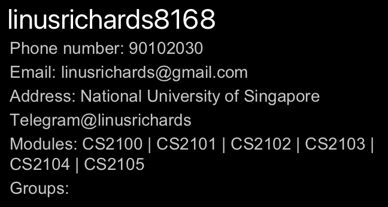
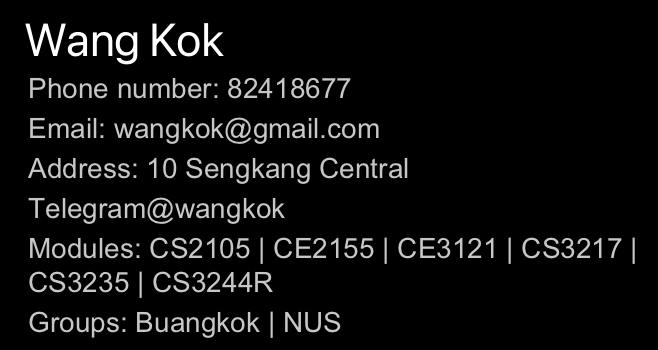
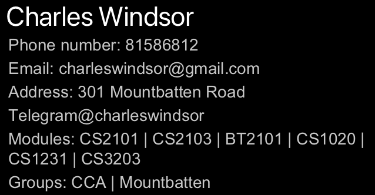

# EduMate User Guide

EduMate is a desktop app designed for NUS students to manage their academic and social lives.

## Using this Guide
If this is the first time you are using this user guide, we highly recommend you to read the [Overview](#overview) section. Otherwise,

* If you are running EduMate for the first time, please take a look at our [Quick Start](#quick-start) guide.
* If you want to learn to use EduMate, do check out our [Commands](#) section for a detailed guide.
* If you want to contribute to this project, please refer to our [Developer Guide](https://ay2223s2-cs2103t-w14-2.github.io/tp/DeveloperGuide.html).

## Table of Contents
1. [**Using this Guide**](#using-this-guide)
2. [**Table of Contents**](#table-of-contents)
3. [**Overview**](#overview)
    1. [**What is EduMate?**](#what-is-edumate)
    2. [**Understanding the Symbols and Colours**](#understanding-the-symbols-and-colours)
    3. [**Glossary**](#glossary)
4. [**Quick Start**](#quick-start)
    1. [**System Requirements**](#system-requirements)
    2. [**Installation Instructions**](#installation-instructions)
5. [**User Interface**](#user-interface)
    1. [**Person List**](#person-list)
    2. [**Person Profile**](#person-profile)
    3. [**Command Line**](#command-line)
    4. [**Command Result**](#command-result)
6. [**Commands**](#commands)
    1. [**How to interpret the command format**](#how-to-interpret-the-command-format)
    2. [**Arguments**](#arguments)
        1. [**Name**](#name)
        2. [**Phone Number**](#phone-number)
        3. [**Email Address**](#email-address)
        4. [**Home Address**](#home-address)
        5. [**Telegram Handle**](#telegram-handle)
        6. [**Group**](#group)
        7. [**Module**](#module)
    3. [**Basic Commands**](#basic-commands)
        1. [**Exit the application `exit`**](#exit-the-application)
        2. [**View help window `help`**](#view-help-window-help)
        3. [**List all contacts `list`**](#list-all-contacts-list)
        4. [**Add a contact `add`**](#add-a-contact-add)
        5. [**View a contact's profile `view`**](#view-a-contacts-profile-view)
        6. [**Edit a contact's details `edit`**](#edit-a-contacts-details-edit)
        7. [**Delete a contact `delete`**](#delete-a-contact-delete)
        8. [**Add or remove a label from a contact `tag`**](#add-or-remove-a-label-from-a-contact-tag)
    4. [**Search Commands**](#search-commands)
        1. [**Find contacts that match your criteria `find`**](#find-contacts-that-match-your-criteria-find)
        2. [**Sort contacts based on your criteria `sort`**](#sort-contacts-based-on-your-criteria-sort)
    5. [**Storage Commands**](#storage-commands)
        1. [**Save a copy of EduMate `save`**](#save-a-copy-of-edumate-save)
        2. [**Load a copy of EduMate `load`**](#load-a-copy-of-edumate-load)
    6. [**Meet Commands**](#meet-commands)
        1. [**Suggest places to meet with your contacts `meet`**](#suggest-places-to-meet-with-your-contacts-meet)
    7. [**Advanced Commands**](#advanced-commands)
        1. [**View your past command history `history`**](#view-your-past-command-history-history)
    8. [**Miscellaneous Commands**](#miscellaneous-commands)
        1. [**Clear the contents of EduMate `clear`**](#clear-the-contents-of-edumate-clear)
        2. [**Generate a random EduMate `sample`**](#generate-a-random-edumate-sample)
7. [**FAQ**](#faq)
8. [**Summary**](#summary)
    1. [**Prefixes**](#prefixes)
    2. [**Command Summary**](#command-summary)
9. [**Troubleshooting**](#troubleshooting)
    1. [**How to check your Java version**](#how-to-check-your-java-version)

--------------------------------------------------------------------------------------------------------------------

## Overview

The following subsections explain the overarching functionality of EduMate, as well as the various terminology we will use in this guide.

### What is EduMate?

{to be filled}

### Understanding the Symbols and Colours

Here is a breakdown of the different symbols and colours we will use throughout this guide.

:information_source: Useful information for you to know.

:bulb: Tips and tricks to enhancing your experience in using EduMate.

:warning: Warnings for you to heed so that EduMate works as intended.

### Glossary

[Return to the top](#table-of-contents)

--------------------------------------------------------------------------------------------------------------------

## Quick start

### System Requirements

Here is everything you need to install and set up EduMate. For the best possible experience, we recommend that you run the application on the following supported operating systems:

* Windows
* macOS
* Linux

Do also ensure that you have Java `11` or above installed in your Computer. If you don’t already have Java `11` or above on your system, head over to [Oracle’s Java download page](https://www.oracle.com/java/technologies/downloads/). To check whether your Java version is compatible with EduMate, please refer to [this section]().

### Installation Instructions

1. Download the latest `eduMate.jar` from [here](https://github.com/AY2223S2-CS2103T-W14-2/tp/releases).

2. Copy the file to the folder you want to use as the _home folder_ for your EduMate.

3. Open a command terminal, `cd` into the folder you put the jar file in, and use the `java -jar eduMate.jar` command to run the application. 
   A GUI similar to the below should appear in a few seconds. Note how the app contains some sample data. 
   
    
4. Type the command in the command box and press Enter to execute it. 
   Some example commands you can try:

    * `help`: Displays a link leading to this User Guide.

    * `list`: Lists the contacts in EduMate.

    * `view 1`: View the first contact in the profile window.

    * `exit`: Ends the application.
       

[Return to the top](#table-of-contents)

--------------------------------------------------------------------------------------------------------------------

## User Interface

{to be filled in}

### Person List

{to be filled in}

### Person Profile

{to be filled in}

### Command Line

{to be filled in}

### Command Result

{to be filled in}

[Return to the top](#table-of-contents)

--------------------------------------------------------------------------------------------------------------------

## Commands

{to be filled in}

### How to interpret the command format

**:information_source: Basic Command Format** 

* The first word is the type of command that you are running. 
  e.g. for the command `delete 5`, we are running the `delete` command.

* We use [Prefixes]() like `p/` and `g/` to label our arguments for the command. Additionally, we use numbers to specify the index of contacts in our list. 
  e.g. `edit 2 n/Steven Tan` runs the `edit` command with an index of 2 and an `n/` argument of Steven Tan.

* Words in `UPPER_CASE` are arguments you are meant to fill in. 
  e.g. in `view n/NAME`, you can fill in the `NAME` argument like `view n/Tan Kah Kee`.

* We use `z/` to denote any prefix. 
  e.g. `z/FIELD` could mean `n/FIELD` or `a/FIELD`.

* Items in square brackets are optional. 
  e.g. `n/NAME [g/GROUP]` can be used as `n/Tan Kah Kee g/Friend` or as `n/Tan Kah Kee`.

* Items with `…`​ after them can be used multiple times including zero times. 
  e.g. `[m/MODULE]…​` can be used as ` ` (i.e. 0 times), `m/`, `m/CS2108 m/CS2101` etc.

* Unless otherwise specified, arguments can be in any order. 
  e.g. if the command specifies `n/NAME a/ADDRESS`, `a/ADDRESS n/NAME` is also acceptable.

* If an argument is expected only once in the command, but you specified it multiple times, only the **last** occurrence of the argument will be taken. 
  e.g. `p/86544145 p/81353055` will be interpreted as `p/81353055`.

* Unnecessary arguments will be ignored. 
  e.g. `help 123` will be interpreted as `help`.

**:warning: Invalid Command Formats** 

* Indices must be positive numbers. 
  e.g. `delete one` is not an accepted command.

* [Prefixes]() must be preceded by a space. 
  e.g. `sort m/an/Tan` is not an accepted command for prefixes `m/` and `n/`.

[Return to the top](#table-of-contents)

## Arguments

A contact's attributes can be categorised into two types: _single-valued_ and _multi-valued_. A contact may have only one of each single-valued attribute, such as name, phone number, email address, Telegram handle, and home address. Conversely, a contact may have any number of multi-valued attributes, such as groups and modules.

### Name

Description: The name of the person. 
Pattern: `n/NAME` 
Rules: `NAME` should only contain alphanumeric characters and spaces. It **must also be unique**. 
Example: `n/Wen Li`

### Phone Number

Description: The phone number of the person. 
Pattern: `p/PHONE_NUMBER` 
Rules: `PHONE_NUMBER` should only contain numbers, and be at least 3 digits long. 
Example: `p/89229358`

### Email Address

Description: The email address of the person. 
Pattern: `e/EMAIL` 
Rules: `EMAIL` should be of the form `local@domain`, where
* `local` consists of only alphanumeric and the special characters `+`, `_`, `.`, `-`.
* `domain` {can someone fill up} 
  Example: `e/wenli@gmail.com`

### Home Address

Description: The name of the **closest MRT station** to their home. 
Pattern: `a/ADDRESS` 
Rules: `ADDRESS` should be the name of a valid MRT station. 
Example: `a/Boon Lay`

### Telegram Handle

Description: The telegram handle of the person. 
Pattern: `t/TELEGRAM` 
Rules: `TELEGRAM` should start with an `@` symbol. 
Example: `t/@wenli`

### Group

Description: The group that you and the person belong to. 
Pattern: `g/GROUP` 
Rules: `GROUP` should only contain alphanumeric characters. 
Example: `g/Groupmate`

### Module

Description: The name of the module the person is taking. 
Pattern: `m/MODULE` 
Rules: `MODULE` should be the name of a valid NUS module. 
Example: `m/CS2107`

## Basic Commands

### Exit the application

Shows a message explaining how to access the help page.

:information_source: You can use this command if:
* you want to end the program
* you are done using the application

Formats:
* `exit`

What you should see: 
  {Explanation}

Examples:
* `exit`

### View help window `help`

Shows a message explaining how to access the help page.

:information_source: You can use this command if:
* you are unsure of how to use the application
* you need a refresher of how to use the commands

Formats:
* `help`

What you should see: 
 
{Explanation}

Examples:
* `help`

### List all contacts `list`

Lists all the contacts currently stored within EduMate.

:information_source: You can use this command if:
* you want to see all your contacts

Formats:
* `list`

What you should see: 
{GUI}
{Explanation}

Examples:
* `list`

### Add a contact `add`

Adds a contact to the EduMate.

:information_source: You can use this command if:
* you want to add a new contact into the EduMate.

Formats:
* `add n/NAME p/PHONE a/ADDRESS e/EMAIL t/TELEGRAM [g/GROUP]…​ [m/MODULE]…​`: {fill in}

What you should see: 
{GUI} 
{Explanation}

Examples:
* `add n/Wen Li p/89229358 a/Boon Lay e/wenli@gmail.com t/@wenli g/Groupmate m/CS2101 m/CS2107`: Adds a contact with the following details:
    * Name: `Wen Li`
    * Phone number: `89229358`
    * Address: `Boon Lay`
    * Email: `wenli@gmail.com`
    * Telegram handle: `@wenli`
    * Groups: `Groupmate`
    * Modules: `CS2101`, `CS2107`

### View a contact's profile `view`

You can use the view command to look up their current information, or their contact's information on the Panel to the right.

:information_source: You can use this command if:
* you want to view a contact's full details
* you are unsure of the person's index when using other command

Formats:
* `view`: Views your profile.
* `view INDEX`: Views the contact at index `INDEX`.
* `view n/NAME`: Views the contact with name `NAME`.

What you should see: 

|                               `view`                               |
|:------------------------------------------------------------------:|
|  |
|             User's own profile displayed on the panel              |

|                                     `view 5`                                     |
|:--------------------------------------------------------------------------------:|
|         |
| The profile of the 5th person indexed by EduMate will be displayed on the panel. |

|                       `view n/Charles Windsor`                        |
|:---------------------------------------------------------------------:|
|  |
|    The profile of Charles Windsor will be displayed on the panel.     |

Examples:

### Edit a contact's details `edit`

Edits the profile of a contact.

You can use this command if:
* you want to quickly edit a particular field of a particular contact

Formats:
* `edit INDEX [z/FIELD]…​`: Edits the fields for the contact at index `INDEX`.
* `edit [z/FIELD]…​`: Edits your user profile.

What you should see: 
{GUI} 
{Explanation}

Examples:
* `edit 3 n/Wen Qing`: Changes the name of the third contact to `Wen Qing`.
* `edit 6 p/89229358 t/@wenqing`: Changes the phone number and telegram handle of the sixth contact.
* `edit a/Bedok`: Updates your address to `Bedok`.

### Delete a contact `delete`

Removes a contact from EduMate.

:information_source: You can use this command if:
* you no longer want to keep a contact in EduMate.

Formats:
* `delete INDEX`: Deletes the contact at index `INDEX`.

What you should see: 
{GUI} 
{Explanation}

Examples:
* `delete 5`: Removes the fifth contact from EduMate.

### Add or remove a label from a contact `tag`

Edits the profile of a contact.

:information_source: You can use this command if:
*

Formats:
*

What you should see: 
{GUI} 
{Explanation}

Examples:

## Search Commands

### Find contacts that match your criteria `find`

Finds persons whose specified fields contain any of the given keywords.

:information_source: You can use this command if:
* {fill in}

Formats:
* `find z/KEYWORD [MORE_KEYWORDS]…​`

What you should see: 
{GUI} 
{Explanation}

:bulb: Tips on usage 
* The search is case-insensitive. e.g hans will match Hans
* The order of the keywords does not matter. e.g. Hans Bo will match Bo Hans
* Only the field specified by the prefix is searched. e.g. n/ means only the name field is searched
* Words matching the first part of the string will be matched e.g. Han will match Hans
* Persons matching at least one keyword will be returned (i.e. OR search). e.g. Hans Bo will return Hans Gruber, Bo Yang

Examples:
* `find m/CS2103T CS2109S`: Returns all persons with modules CS2103T or CS2109S
* `find n/Edward Richards`: Returns all persons with names Edward or Richards
* `find p/9093`: Returns all persons with phone numbers starting with 9093

### Sort contacts based on your criteria `sort`

Sorts persons based on certain criteria. For example, you can sort the contacts by name (in alphabetical order).

:information_source: You can use this command if:
* you want to 

Formats:
* `sort`: Sorts the contacts by their indices.
* `sort z/a`: Sorts the contacts by their `z` attribute **in ascending order**
* `sort z/d`: Sorts the contacts by their `z` attribute **in descending order**
* `sort z/`: Sorts the contacts by their `z` attribute based on our **default ordering**
* `sort z1/ z2/`: Sorts the contacts by their `z1` attribute, and breaks ties using their `z2` attribute
* `sort [z/]…​`: Sorts the contacts by multiple attributes

:information_source: How we sort the attributes:

* The `NAME`, `EMAIL`, `ADDRESS`, `PHONE` and `TELEGRAM` attributes are sorted by alphabetical order, and is default in **ascending** order.
* For `GROUP`, we sort the contacts based on the number of groups the contact belongs to. By default, we sort in **descending order**. 
  e.g. if Alex has 2 groups (TA, NS), and Ben has one group (TA), Alex will be placed before Ben in the default ordering.
* For `MODULE`, we sort the contacts based on the number of common modules they share with you. By default, we sort in **descending order**. 
  e.g. if Alex has 2 modules (CS1101S, CS1231S), Ben has one module (CS1101S), and you have 2 modules(CS1231S, MA2001), Alex has 1 module in common with you (CS1231S) and Ben has 0 modules in common with you. As such, Alex will be placed before Ben in the default ordering.

What you should see: 
{GUI} 
{Explanation}

Examples:
* `sort n/d`: Sorts by name in descending order
* `sort m/a`: Sorts by the number of modules they have in common with you (in ascending order)
* `sort t/`: Sorts by Telegram handle in its default ordering (ascending)

## Storage Commands

### Save a copy of EduMate `save`

Saves the EduMate into a file with a name of your choice.

:information_source: You can use this command if:
* You want to create backups of your EduMate

Formats:
* `save FILENAME`: Saves the EduMate into a file at `FILENAME.json`.

What you should see: 
{GUI} 
{Explanation}

Examples:
* `save backup`: Saves the EduMate in the `backup.json` file.

### Load a copy of EduMate `load`

Edits the profile of a contact.

:information_source: You can use this command if:
*

Formats:
*

What you should see: 
{GUI} 
{Explanation}

Examples:

## Meet Commands

### Suggest places to meet with your contacts `meet`

Edits the profile of a contact.

You can use this command if:
*

Formats:
*

What you should see: 
{GUI} 
{Explanation}

Examples:

## Advanced Commands

### View your past command history `history`

Edits the profile of a contact.

:information_source: You can use this command if:
*

Formats:
*

What you should see: 
{GUI} 
{Explanation}

Examples:

## Miscellaneous Commands

### Clear the contents of EduMate `clear`

Edits the profile of a contact.

:information_source: You can use this command if:
*

Formats:
*

What you should see: 
{GUI} 
{Explanation}

Examples:

### Generate a random EduMate `sample`

Edits the profile of a contact.

:information_source: You can use this command if:
*

Formats:
*

What you should see: 
{GUI} 
{Explanation}

Examples:

## FAQ

**Q**: Can I add multiple module tags to a user
**A**: Yes, you can add multiple tags to a single user by using the "Module Tagging" feature multiple times.

**Q**: Can I edit my own profile?
**A**: It will not be in v1.02, but it may be possible for future iterations.

## Summary

### Prefixes

### Command Summary

| Action            | Format, Examples                                                                      |
|-------------------|---------------------------------------------------------------------------------------|
| **User**          | `user`                                                                                |
| **Add Person**    | `add n/NAME`   e.g., `add n/John Doe`                                              |
| **Delete Person** | `delete n/NAME`  e.g., `delete n/John Doe`                                         |
| **Tag Module**    | `tag n/NAME m/MODULE_TAG`  e.g.,`tag n/John Doe m/CS2103T`                         |
| **Untag Module**  | `untag n/NAME m/MODULE_TAG`  e.g., `untag n/John Doe m/CS2103T`                    |
| **Filter By Mod** | `filter m/MODULE_TAG`   e.g., `filter m/CS2103T`                                   |
| **Sort**          | `sort`                                                                                |
| **View**          | `view`  `view <index>` `view n/NAME` e.g., `view 5` or `view n/Komyo San` |

## Troubleshooting

### How to check your Java version
