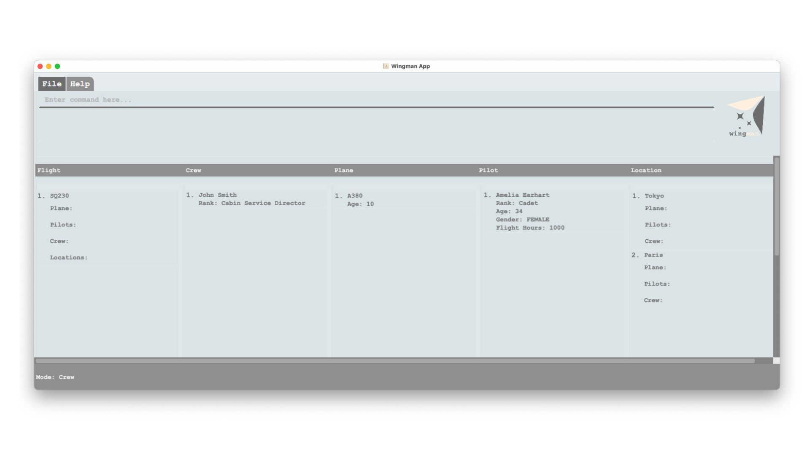
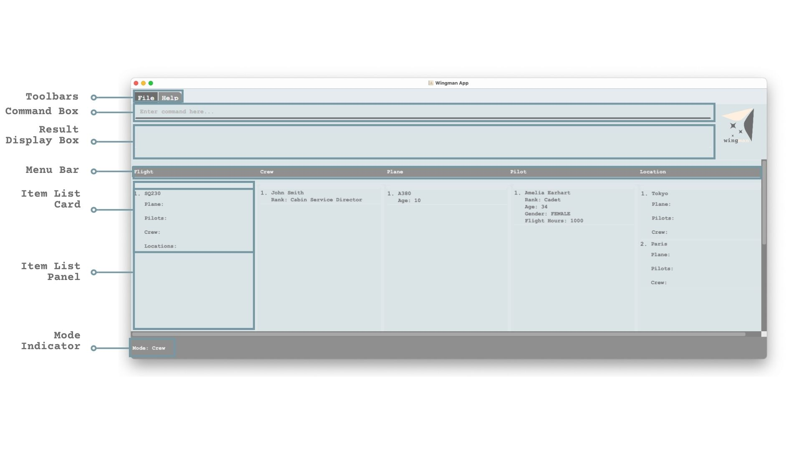
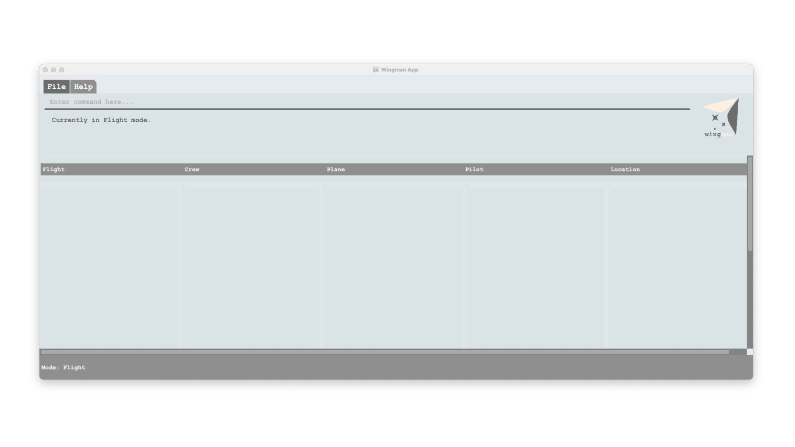
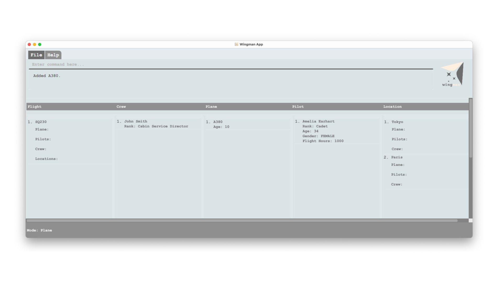
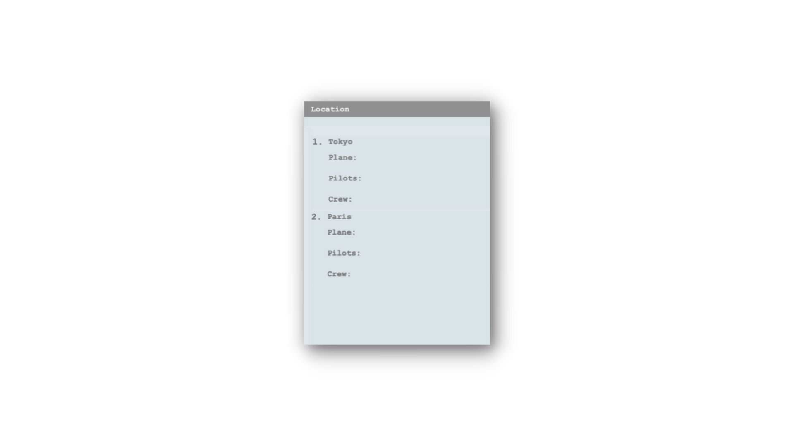
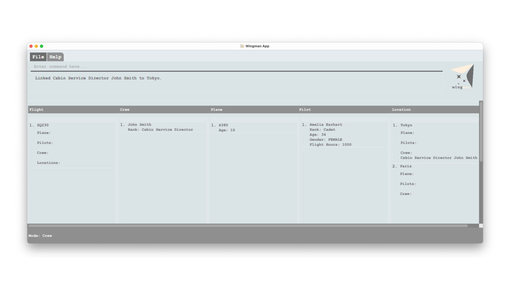
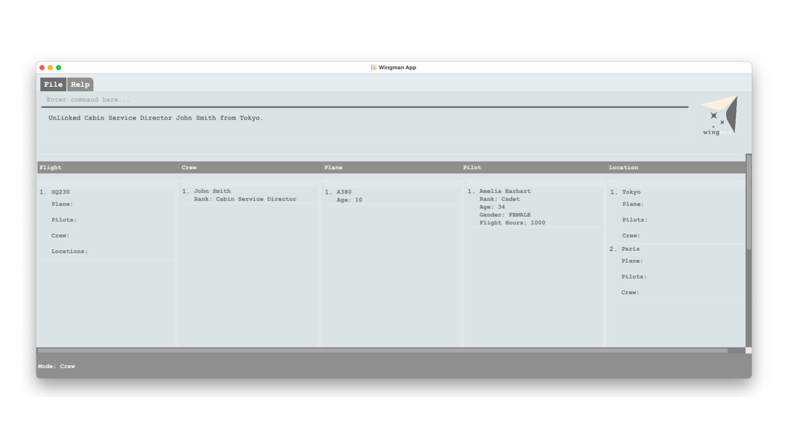
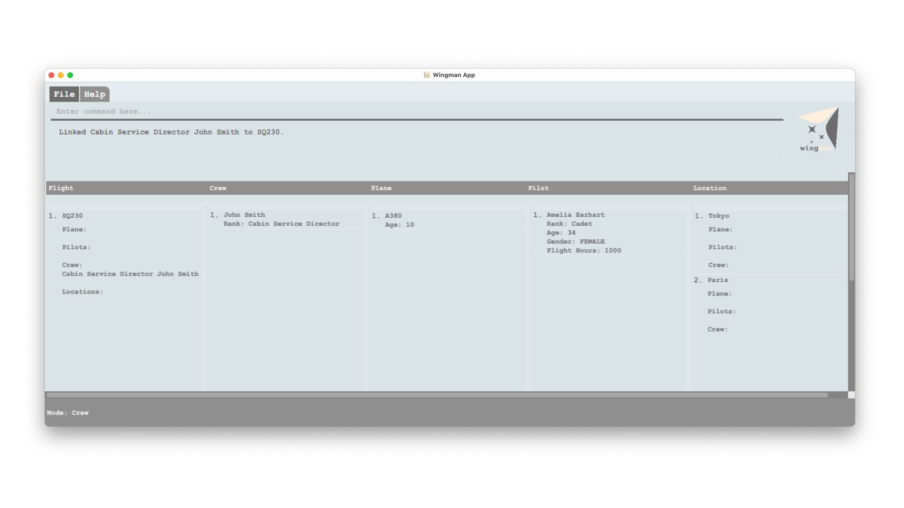
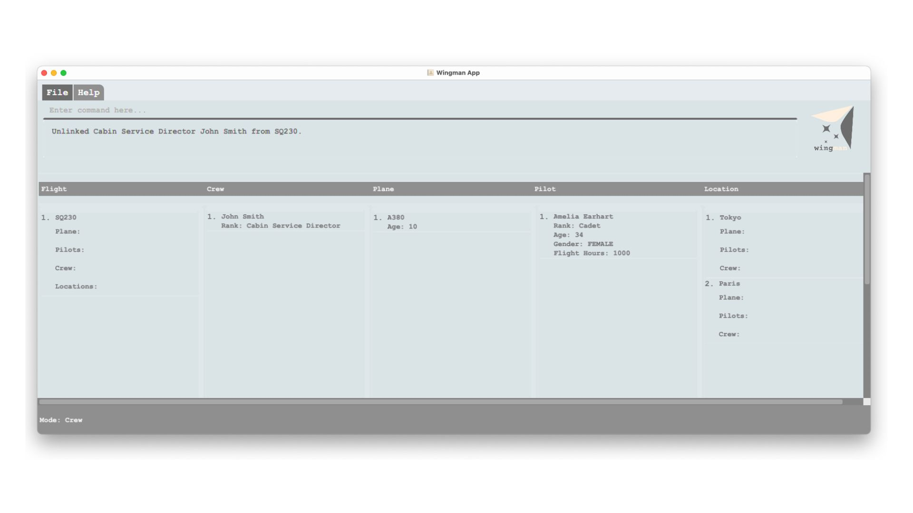

<p align="center">
  
</p>

Wingman is a resource management tool designed for airline managers that allows for efficient management of crew,
flights, locations, pilots, and planes via command lines. The functionalities include adding, deleting, checking, or
associating these
airline-related resources. The program is highly optimized for fast typers, while having an intuitive graphical
interface
for managers to monitor the status of airline-related resources.

In this flight, we will guide you on how to use Wingman to efficiently manage the various aspects of airline operations,
such as flight scheduling and management of crew, pilot, plane and location.

## Table of Contents

- **[How to Use This Guide?](#how-to-use-this-guide)**
- **[Getting Started](#getting-started)**
- **[Layout of Wingman Application Window](#layout-of-wingman-application-window)**
- **[Modal Editing: `mode`](#modal-editing)**
- **[Command Formatting](#command-formatting)**
- **[Features](#features)**
  - **[Shared Commands](#shared-commands)**
    - **[Adding a resource: `add`](#1-adding-a-resource)**
    - **[Deleting a resource: `delete`](#2-deleting-a-resource)**
  - **[Mode-specific Commands](#mode-specific-commands)**
    - **[Linking a resource to a location: `linklocation`](#1-linking-a-resource-to-a-location)**
    - **[Unlinking a resource from a location: `unlinklocation`](#2-unlinking-a-resource-from-a-location)**
    - **[Linking a resource to a flight: `linkflight`](#3-linking-a-resource-to-a-flight)**
    - **[Unlinking a resource from a flight: `unlinkflight`](#4-unlinking-a-resource-from-a-flight)**
    - **[Checking a resource's availability: `check`](#5-checking-a-resources-availability)**
- **[Prefix Summary](#prefix-summary)**
- **[Command Summary](#command-summary)**
- **[FAQ](#faq)**
- **[Glossary](#glossary)**
- **[Other Information](#other-information)**

<div style="page-break-after: always;"></div>

## How to use this guide?

This user guide provides an in-depth documentation on the multiple features that enable Wingman
to assist you in managing your resources.

If you are an experienced user trying to find a specific command, you can head over to
the [Command Summary](#command-summary) section where you can view all the commands at a glance.

If you are a first-time user, you can begin by reading the [Getting Started](#getting-started) section to learn how to
get started with Wingman in just a few simple steps!

To find an in depth description of Wingman's features, simply search for the feature in the
[Table of Contents](#table-of-contents) and head over to the relevant section.
Each section contains a detailed description of the feature, and it's command format
along with some examples of possible uses and expected outputs.

<div style="page-break-after: always;"></div>

## Getting Started

You can get started with Wingman in just 3 simple steps:

1. Ensure you have `JAVA 11` installed on your computer. If you are unsure how to check JAVA version on your computer,
   please check out [FAQ](#faq).
2. Click [here](https://github.com/AY2223S2-CS2103T-W11-1/tp/releases/tag/v1.3) to download the Wingman.jar file
3. Open a command terminal on your computer, and run the command to start the application:  `java -jar Wingman.jar`

A GUI similar to the one below should appear in a few seconds.

<div style="border: 0px solid #ccc; background-color: #d9edff; color: darkblue; padding: 10px; margin-bottom: 10px;">
Take note how the app below contains some sample data. This may not be the case if it's your first time using Wingman.
</div>



Congratulations on successfully setting up Wingman! If you encounter any issues during installation, please head over to
our [FAQ](#faq) section to troubleshoot.

Before you start using Wingman, do take a moment to read the
following sections:

1. [Layout of Wingman Application Window](#layout-of-wingman-application-window) to understand how you can navigate
   through the various sections.
2. [Modal Editing](#modal-editing) to understand how Wingman's commands are operated.
3. [Command Formatting](#command-formatting) to understand how we explain how to use each command in the following
   [Features](#features) section.

<div style="page-break-after: always;"></div>

### Layout of Wingman Application Window


The following table describes the sections in detail:

| **Section**          | **Description**                                                                     |
|----------------------|-------------------------------------------------------------------------------------|
| `Toolbars`           | Contains buttons to exit the app/view help.                                         |
| `Command Box`        | Accepts text input for you to type in your commands.                                |
| `Result Display Box` | Displays various messages (e.g. success/error messages) after commands are entered. |
| `Menu Bar`           | Displays labels of each mode (flight/crew/plane/pilot/location)                     |
| `Item List Card`     | Displays information of a flight/crew/plane/pilot/location saved in Wingman.        |
| `Item List Panel`    | Displays the list of flight/crew/plane/pilot/location saved in Wingman.             |
| `Mode Indicator`     | Displays the current mode.                                                          |

### Modal Editing

Wingman offers 5 different modes through which you can manage your resources, with each mode
corresponding to one [resource](#glossary) that the app can manage:

- `crew` mode: to manage the crews that form your airline workforce
- `flight` mode: to manage the flights that your airline operates
- `location` mode: to manage the locations in which your airline operates
- `pilot` mode: to manage the pilots that form your airline workforce
- `plane` mode: to manage the planes that your airline operates

The different modes offer similar and intuitive commands, with optimisations to cater to the resource that the mode is
managing. This means you do not have to worry about memorising complex commands and instead can dive right into the
management of your airline.

To switch between different modes simply enter the following command:

```
mode XYZ
```

where XYZ can be any of the modes described above (i.e. `crew`, `flight`, `location`, `pilot`, `plane`).

Upon successfully switching to a mode, Wingman will display the current mode's name in the status bar in the bottom left
corner of the window. The window also displays a list for each resource, to aid you in keeping track of links between 
resources.



### Command Formatting

In Wingman, a command has 3 components: a command word, required input values, and optional input values.

* A **command word** is the part which tells Wingman what operation you would like to do.
  Examples of command words might include: `add`, `delete`, or `linkflight`.

* A **required input value** is information you must include when typing a command, in order for the command
  to properly work. In Wingman, required input values are preceded with a `/prefix` where the prefix, would be an
  indicator of what value is required after it. If you forget to add a required input value, Wingman will remind you as
  you type the command.

* An **optional input value** is information you might include when typing a command, but is not necessary for the
  command
  to work. In Wingman, optional input values are preceded with a `/prefix` where the prefix, would be an indicator of
  what
  value is required after it. Optional input values are indicated in the command explanations below.

In the following [Features](#features) section, we will show you the general format for each command. To help you
understand the general command format, below is an example:

`linklocation /lo {location-index} /{resource-prefix} {resource-index}`

Here, `linklocation` is the command keyword, `/lo` and `/{resource-prefix}` are the prefixes, and `{location-index}` and
`{resource-index}` are integers that specify the values corresponding to the two prefixes in order.

<div style="border: 0px solid #ccc; background-color: #d9edff; color: darkblue; padding: 10px; margin-bottom: 10px;">
  "{}" means this is a placeholder for which you should substitute in a value. For example, "{location-index}" means the
index of a location is expected here, which could be 1, 2, 3, and so on. Similarly, "{resource-prefix}" is a prefix 
specific to a resource, such as "pl" for plane. 
</div>

To give you an idea, one instance that follows the above general format is

`linklocation /lo 1 /pl 10`

This command links the location at index 1 to the plane at index 10. The indices can be found in the displayed list.

[Back to contents](#table-of-contents)

<div style="page-break-after: always;"></div>

## Features

### Shared Commands

The commands in this section are available across ALL 5 modes.

#### **1. Adding a resource: `add`**

Use this command when you wish to add a new resource entity (e.g. a new plane that has been added to your fleet)
to Wingman, for you to manage the resource.

```
add /prefix_A value_A /prefix_B value_B
```

This commands adds an entity of the current resource mode to Wingman's database. For example,
if you are currently in the `plane` mode, then this command will add a new `plane` to the database.
Each `/prefix` is an attribute of the resource entity, and you can specify the values
for each attribute as shown in the following examples.

<div style="border: 0px solid #ccc; background-color: #d9edff; color: darkblue; padding: 10px; margin-bottom: 10px;">
<strong>Note:</strong> The prefixes vary across different modes. Refer to the examples below for more clarity.
</div>

If the command is valid, upon pressing enter, your application window will be updated as shown below.
The result display box describes the addition that was made and the new entity should be displayed in the list.



###### Crew mode: `add /n name /r rank`

Required prefixes:

- `/n`: the name of the crew.
- `/r`: the rank of the crew.
  - `0`: Senior Crew Member,
  - `1`: Crew Member,
  - `2`: Junior Crew Member,
  - `3`: Trainee.

<div style="border: 0px solid #ccc; background-color: #d9edff; color: darkblue; padding: 10px; margin-bottom: 10px;">
Note: Your selection is limited to the designated ranks
</div>

Example:

```
Input:
add /n John Smith /r 0

Output: 
Added Senior Crew Member John Smith.
```

###### Flight mode: `add /c code`

Required prefixes:

- `/c` : the code of the flight.

Example:

```
Input:
add /c SQ230

Output: 
Added SQ230.
```

###### Location mode: `add /n name`

Required prefixes:

- `/n`: name of the location.

Example:

```
Input:
add /n Tokyo

Output: 
Added Tokyo.
```

###### Pilot mode: `add /n name /r rank /a age /g gender /fh flight-hours`

Required prefixes:

- `/n`: the name of the pilot.
- `/r`: the rank of the pilot. The accepted values for this required input value are as follows
    - `0`: Training Captain,
    - `1`: Captain,
    - `2`: Senior First Officer,
    - `3`: First Officer,
    - `4`: Second Officer,
    - `5`: Cadet.
- `/a`: the age of the captain.
- `/g`: the gender of the pilot. The accepted values for this required input value are as follows
    - `0`: male
    - `1`: female
    - `2`: other
- `/fh`: the flight hours of the pilot.

<div style="border: 0px solid #ccc; background-color: #d9edff; color: darkblue; padding: 10px; margin-bottom: 10px;">
Note: Your selection is limited to the designated ranks and gender identities.
</div>

Example:

```
Input:
add /n Amelia Earhart /r 5 /a 34 /g 1 /fh 1000

Output: 
Added Cadet Amelia Earhart.
```

###### Plane mode: `add /m model /a age`

Required prefixes:

- `/m`: the model of the plane.
- `/a`: the age of the plane.

Example:

```
Input:
add /m A380 /a 10

Output: 
Added A380.
```

[Back to contents](#table-of-contents)

<div style="page-break-after: always;"></div>

#### **2. Deleting a resource**

Use this command when you wish to remove a resource entity (e.g. a pilot that has retired)
from Wingman, to keep your database of resources up to date.

This commands deletes an entity of the current resource mode from Wingman's database. For example,
if you are currently in the `plane` mode, then this command will delete the specified `plane` from the database.

<div style="border: 0px solid #ccc; background-color: #d9edff; color: darkblue; padding: 10px; margin-bottom: 10px;">
Note: Please make sure the program is under the correct mode before performing deletion. &#128515
</div>

This command has **NO** variation across the modes.

```
delete {index-number}
```

Required input value:

- `index-number`: the index number of the resource entity you wish to delete.

The index number of a resource entity is the number next to its entry in the displayed list.



<div style="border: 0px solid #ccc; background-color: #d9edff; color: darkblue; padding: 10px; margin-bottom: 10px;">
<strong>Note:</strong> Remember that indexing starts from 1. You may directly refer to the display list for the index of an item. 
</div>

Example in `plane` mode:

```
Input:
delete 1

Output: 
Deleted A380.
```

[Back to contents](#table-of-contents)

<div style="page-break-after: always;"></div>

### Mode-specific Commands

The commands in this section are only available in the specified modes.

#### **1. Linking a resource to a location**

Use this command when you wish to link a resource entity to a location. A link means there is some association between the resource to the location.
For example, a crew may work and reside in some locations, then we can
link the crew to the locations.

<div style="border: 0px solid #ccc; background-color: #d9edff; color: darkblue; padding: 10px; margin-bottom: 10px;">
<strong>Note:</strong> For flexibility, a resource can be linked to multiple locations. This is because planes, crews, and pilots may have multiple associations. 
</div>

This command is only available in these modes: `crew`, `flight`, `pilot` and `plane`. This commands links an entity of the current resource mode to a specified location entity in Wingman's database.

For example, if you are currently in the `crew` mode, then this command will link a `crew` to a specified location. If the command is valid, Wingman will return a response confirming the link that has been made, as shown below:



We detail the format for different modes below.

###### Crew mode: `linklocation /lo location-index /cr {crew-index}`

Required prefixes:

- `/lo`: the index of the location to which the crew is to be linked to.
- `/cr`: the index of the crew to be linked.

Example:

```
Input:
linklocation /lo 1 /cr 1

Output: 
Linked Senior Crew Member John Smith to Tokyo.
```

###### Flight mode: `linklocation /fl {flight-index} /from {location-index} /to {location-index}`

Required prefixes:

- `/fl`: the index of the flight to be linked.
- `/from`: the index of the location to which the flight is to be linked as departing from.
- `/to`: the index of the location to which the flight is to be linked as arriving at.

Example:

```
Input:
linklocation /fl 1 /from 1 /to 2

Output: 
Linked Tokyo, Paris to SQ230.
```

###### Pilot mode: `linklocation /lo {location-index} /pi {pilot-index}`

Required prefixes:

- `/lo`: the index of the location to which the pilot is to be linked to.
- `/pi`: the index of the pilot to be linked.

Example:

```
Input:
linklocation /lo 1 /pi 1

Output: 
Linked Cadet Amelia Earhart to Tokyo.
```

###### Plane mode: `linklocation /lo {location-index} /pl {plane-index}`

Prefixes:

- `/lo`: the index of the location to which the plane is to be linked to.
- `/pl`: the index of the plane to be linked.

Example:

```
Input:
linklocation /lo 1 /pl 1

Output: 
Linked A380 to Tokyo.
```

[Back to contents](#table-of-contents)

<div style="page-break-after: always;"></div>

#### **2. Unlinking a resource from a location**

Use this command when you wish to unlink a resource entity from a location.
To unlink, the location and the entity should have been linked first, otherwise the program will let you that the command is invalid.

The command has a very similar format to the link command. It is also only
available in these modes: `crew`, `flight`, `pilot` and `plane`.

For example, if you are currently in the `crew` mode, then this command will unlink a `crew` from the specified location entity in the database. If the command is valid, Wingman will return a response confirming the link that has been undone, as shown below:



We will detail for command format for different resources below.

###### Crew mode: `unlinklocation /lo {location-index} /cr {crew-index}`

Required prefixes:

- `/lo`: the index of the location from which the crew is to be unlinked from.
- `/cr`: the index of the crew to be unlinked.

Example:

```
Input:
unlinklocation /lo 1 /cr 1

Output: 
Unlinked Senior Crew Member John Smith from Tokyo.
```

###### Flight mode: `unlinklocation /fl {flight-index} /from {departure-index} /to {arrival-index}`

Required prefixes:

- `/fl`: the index of the flight to be unlinked.
- `/from`: the index of the departure location from which the flight is to be unlinked.
- `/to`: the index of the arrival location from which the flight is to be unlinked.

Example:

```
Input:
unlinklocation /fl 1 /from 1 /to 1

Output: 
Unlinked Tokyo, Paris from SQ230.
```

###### Pilot mode: `unlinklocation /lo {location-index} /pi {pilot-index}`

Required prefixes:

- `/lo`: the index of the location from which the pilot is to be unlinked from.
- `/pi`: the index of the pilot to be unlinked.

Example:

```
Input:
unlinklocation /lo 1 /pi 1

Output: 
Unlinked Cadet Amelia Earhart from Tokyo.
```

###### Plane mode: `unlinklocation /lo {location-index} /pl {plane-index}`

Prefixes:

- `/lo`: the index of the location from which the plane is to be unlinked from.
- `/pl`: the index of the plane to be unlinked.

Example:

```
Input:
unlinklocation /lo 1 /pl 1

Output: 
Unlinked A380 from Tokyo.
```

[Back to contents](#table-of-contents)

<div style="page-break-after: always;"></div>

After introducing how to link resources to a location, we will next describe how to link resources to a flight.

#### **3. Linking a resource to a flight**

A flight requires multiple resources, such as crews, pilots, and planes. We have commands that allow users to link them to a flight.

To link a resource to a flight, the program needs be switched to the corresponding mode first, e.g., to link a pilot to a flight, the program should be under `pilot` mode. Thus, this command is only available in some modes: `crew`, `pilot` and `plane`.

For example, if you are currently in the `crew` mode, then this command will link a `crew` to a specified flight in the database. If the command is valid, Wingman will return a response confirming the link that has been made, as shown below:



Next, we will detail the commands for each mode.

###### Crew mode: `linkflight /fl {flight-index} /csd {crew-index} /sfa {crew-index} /fa {crew-index} /tr {crew-index}`

Required prefixes:

- `/fl`: the flight to which the specified crew is to be linked to.

Optional prefixes:

- `/csd`: the index of the crew to be linked as Cabin Service Director (CSD) for this flight.
- `/sfa`: the index of the crew to be linked as Senior Flight Attendant (SFA) for this flight.
- `/fa`: the index of the crew to be linked as Flight Attendant (FA) for this flight.
- `/tr`: the index of the crew to be linked as Trainee (TR) for this flight.

<div style="border: 0px solid #ccc; background-color: #d9edff; color: darkblue; padding: 10px; margin-bottom: 10px;">
<strong>Note:</strong> In each <span style="font-family: Courier;">linkflight</span> command under 
<span style="font-family: Courier;">crew</span> mode, you need to fill up <i>exactly one</i> optional prefix.
</div>

Example:

```
Input:
linkflight /fl 1 /csd 1

Output: 
Linked Cabin Service Director John Smith to SQ230.
```

###### Pilot mode: `linkflight /fl flight-index /p{x} pilot-index`

Here `x` is either `f` or `m`. See below details.

Required prefixes:

- `/fl`: the flight to which the specified pilots are to be linked to.

Optional prefixes:

- `/pf`: the index of the flying pilot to be linked to the flight.
- `/pm`: the index of the monitoring pilot to be linked to the flight.

<div style="border: 0px solid #ccc; background-color: #d9edff; color: darkblue; padding: 10px; margin-bottom: 10px;">
<strong>Note:</strong> In each <span style="font-family: Courier;">linkflight</span> command under 
<span style="font-family: Courier;">pilot</span> mode, you need to fill up <i>exactly one</i> optional prefix.
</div>

Example:

```
Input:
linkflight /fl 1 /pf 1

Output: 
Linked Cadet Amelia Earhart to SQ230.
```

###### Plane mode: `linkflight /fl {flight-index} /pl {plane-index}`

Required prefixes:

- `/fl`: the flight to which the specified plane is to be linked to.
- `/pl`: the index of the plane to be linked as being used for the flight.

Example:

```
Input:
linkflight /fl 1 /pl 1

Output: 
Linked A380 to SQ230.
```

If the command is valid, Wingman will return a response confirming the link that has been made, as shown below:


[Back to contents](#table-of-contents)

<div style="page-break-after: always;"></div>

#### **4. Unlinking a resource from a flight**

Use this command when you wish to unlink a resource entity from a flight. Similar to `linklocation` and `unlinklocation`, this command is only valid if the source and the flight have been linked before with.

Same as linking a resource to a flight, this command is only available in these modes: `crew`, `pilot`, and `plane`.

For example, if you are currently in the `crew` mode, then this command will unlink a `crew` from a specified flight in the
database. If the command is valid, Wingman will return a response confirming the link that has been undone, as shown below:



We will detail the command format for each mode below.

###### Crew mode: `unlinkflight /fl {flight-index} /csd {crew-index} /sfa {crew-index} /fa {crew-index} /tr {crew-index}`

Required prefixes:

- `/fl`: the flight from which the specified crew is to be unlinked from.

Optional prefixes:

- `/csd`: the index of the crew to be unlinked as Cabin Service Director (CSD).
- `/sfa`: the index of the crew to be unlinked as Senior Flight Attendant (SFA).
- `/fa`: the index of the crew to be unlinked as Flight Attendant (FA).
- `/tr`: the index of the crew to be unlinked as Trainee (TR).

<div style="border: 0px solid #ccc; background-color: #d9edff; color: darkblue; padding: 10px; margin-bottom: 10px;">
<strong>Note:</strong> In each <span style="font-family: Courier;">unlinkflight</span> command under 
<span style="font-family: Courier;">crew</span> mode, you need to fill up <i>exactly one</i> optional prefix.
</div>

Example:

```
Input:
unlinkflight /fl 1 /csd 1

Output: 
Unlinked Cabin Service Director John Smith from SQ230.
```

###### Pilot mode: `unlinkflight /fl {flight-index} /pf {pilot-index} /pm {pilot-index}`

Required prefixes:

- `/fl`: the flight from which the specified pilots are to be unlinked from.

Optional prefixes:

- `/pf`: the index of the flying pilot to be unlinked from the flight.
- `/pm`: the index of the monitoring pilot to be unlinked from the flight.

<div style="border: 0px solid #ccc; background-color: #d9edff; color: darkblue; padding: 10px; margin-bottom: 10px;">
<strong>Note:</strong> In each <span style="font-family: Courier;">linkflight</span> command under 
<span style="font-family: Courier;">pilot</span> mode, you need to fill up <i>exactly one</i> optional prefix.
</div>

Example:

```
Input:
unlinkflight /fl 1 /pf 1

Output: 
Unlinked Cadet Amelia Earhart from SQ230.
```

###### Plane mode: `unlink /fl {flight-index} /pl {plane-index}`

Required prefixes:

- `/fl`: the flight from which the specified plane is to be unlinked from.
- `/pl`: the index of the plane to be unlinked from the flight.

Example:

```
Input:
unlinkflight /fl 1 /pl 2

Output: 
Unlinked A380 from SQ230.
```

## Prefix Summary

| **Action** | **Meaning**               | **Followed by**                  |
|------------|---------------------------|----------------------------------|
| /n         | `name`                    | Name of crew, location, or pilot |
| /r         | `rank`                    | Rank of crew, or pilot           |
| /c         | `code`                    | Code of flight                   |
| /a         | `age`                     | Age of pilot, or plane           |
| /g         | `gender`                  | Gender of pilot                  |
| /fh        | `flight hour`             | Flight hours of pilot            |
| /m         | `model`                   | Model of plane                   |
| /cr        | `crew`                    |                                  |
| /fl        | `flight`                  |                                  |
| /lo        | `location`                |                                  |
| /pi        | `pilot`                   |                                  |
| /pl        | `plane`                   |                                  |
| /from      | `departure location`      | Index of departure location      |
| /to        | `arrival location`        | Index of arrival location        |
| /csd       | `cabin service director`  | Index of cabin service director  |
| /sfa       | `senior flight attendant` | Index of senior flight attendant |
| /fa        | `flight attendant`        | Index of flight attendant        |
| /tr        | `trainee`                 | Index of trainee                 |
| /pf        | `pilot flying`            | Index of pilot flying            |
| /pm        | `pilot monitoring`        | Index of pilot monitoring        |

[Back to contents](#table-of-contents)

<div style="page-break-after: always;"></div>

## Command Summary

| **Action**      | **Format**                                                               | **Examples**                   |
|-----------------|--------------------------------------------------------------------------|--------------------------------|
| Add             | `add /{prefix_A} {value_A} /{prefix_B} {value_B}`                        | `add /n Bob /r 2`              |
| Delete          | `delete resource-index`                                                  | `delete 1`                     |
| Link location   | `linklocation /lo location-index /{resource-prefix} {resource-index}`    | `linklocation /lo 1 /cr 1`     |
| Unlink location | `unlinklocation /lo {location-index} /{resource-prefix} {resource-index}` | `unlinklocation /lo 1 /fl 1`   |
| Link flight     | `linkflight /fl {flight-index} /{resource-prefix} {resource-index}`      | `linkflight /fl 1 /pf 1 /pm 2` |
| Unlink flight   | `unlinkflight /fl {flight-index} /{resource-prefix} {resource-index}`    | `unlinkflight /fl 1 /pu 1`     |

[Back to contents](#table-of-contents)

<div style="page-break-after: always;"></div>

## Glossary

| **Term**        | **Definition**                                                                                                                                                                                                   |
|-----------------|------------------------------------------------------------------------------------------------------------------------------------------------------------------------------------------------------------------|
| Prefix          | A placeholder term referring to an attribute name (e.g. /g for gender)                                                                                                                                           |
| Resource        | Crews, Pilots, Planes, Flights, or Locations                                                                                                                                                                     |
| Mode            | A status of the program that specifies a particular set of behaviors. The program behaviors (e.g., command format) are different in different modes. In this application, each mode corresponds to one resource. |
| Resource Entity | An entity of any of the resource types specified above (e.g. Captain Bob)                                                                                                                                        |
| Prefix          | A placeholder term referring to an attribute name (e.g. /g for gender)                                                                                                                                           |

[Back to contents](#table-of-contents)

## FAQ

### 1. Why is Wingman not opening when I run the `java -jar` command?

- You might be running the command in the wrong directory.

Navigate to the directory where you downloaded the application file and run the same command again.

- Verify that your java version is 11. See the following question.

### 2. How to check my `JAVA` version?

You may run `java -version` in your terminal to see your Java SDK version.
If you need to install Java 11, please follow
this [guide](https://nus-cs2103-ay2223s2.github.io/website/admin/programmingLanguages.html#programming-language).
Below is one example showing the correct version:

```agsl
openjdk version 11.0.18 2023-01-17 LTS
OpenJDK Runtime Environment Zulu11.62+17-CA (build 11.0.18+10-LTS)
OpenJDK 64-Bit Server VM Zulu11.62+17-CA (build 11.0.18+10-LTS, mixed mode)
```

[Back to contents](#table-of-contents)

## Other information

Wingman is developed at the National University of Singapore.

[Back to contents](#table-of-contents)
